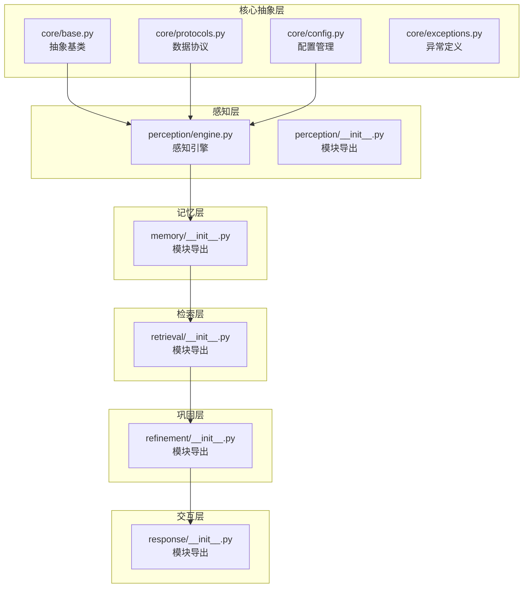
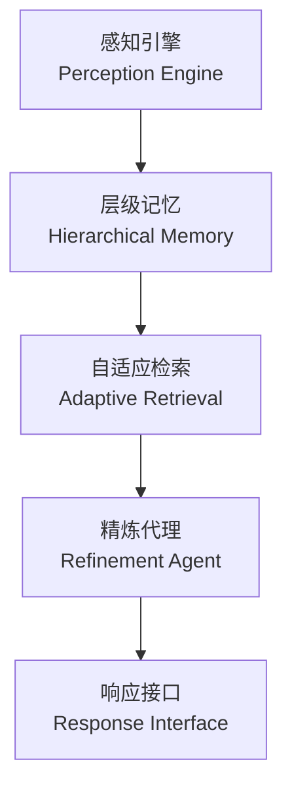

# API参考手册

<cite>
**本文档引用的文件**
- [README.md](file://README.md)
- [src/__init__.py](file://src/__init__.py)
- [src/core/base.py](file://src/core/base.py)
- [src/core/config.py](file://src/core/config.py)
- [src/core/protocols.py](file://src/core/protocols.py)
- [src/core/exceptions.py](file://src/core/exceptions.py)
- [src/perception/engine.py](file://src/perception/engine.py)
- [src/perception/__init__.py](file://src/perception/__init__.py)
- [src/memory/__init__.py](file://src/memory/__init__.py)
- [src/retrieval/__init__.py](file://src/retrieval/__init__.py)
- [src/refinement/__init__.py](file://src/refinement/__init__.py)
- [src/response/__init__.py](file://src/response/__init__.py)
- [pyproject.toml](file://pyproject.toml)
- [requirements.txt](file://requirements.txt)
- [QUICKSTART.md](file://QUICKSTART.md)
</cite>

## 目录
1. [简介](#简介)
2. [项目结构](#项目结构)
3. [核心组件](#核心组件)
4. [架构概览](#架构概览)
5. [详细组件分析](#详细组件分析)
6. [依赖分析](#依赖分析)
7. [性能考虑](#性能考虑)
8. [故障排除指南](#故障排除指南)
9. [结论](#结论)
10. [附录](#附录)

## 简介
本手册为NecoRAG框架的完整API参考，涵盖Python包接口、RESTful API端点规范、数据模型与错误码说明。NecoRAG是一个模拟人脑双系统记忆与认知科学理论的下一代认知型RAG框架，采用五层架构：感知层、记忆层、检索层、巩固层、交互层。本手册面向开发者提供快速查找与使用API的技术参考。

## 项目结构
NecoRAG采用模块化分层设计，核心模块包括：
- perception：感知引擎，负责文档解析、分块、编码与情境标记
- memory：层级记忆存储，包含工作记忆、语义记忆与情景图谱
- retrieval：自适应检索，混合检索与重排序
- refinement：精炼代理，幻觉检测与知识巩固
- response：响应接口，情境自适应生成与思维链可视化
- core：核心抽象层、配置管理、数据协议与异常定义
- dashboard：可选的Web配置管理界面（依赖FastAPI）

**图表来源**
- [src/core/base.py:1-571](file://src/core/base.py#L1-L571)
- [src/core/config.py:1-370](file://src/core/config.py#L1-L370)
- [src/core/protocols.py:1-273](file://src/core/protocols.py#L1-L273)
- [src/core/exceptions.py:1-296](file://src/core/exceptions.py#L1-L296)
- [src/perception/engine.py:1-130](file://src/perception/engine.py#L1-L130)
- [src/perception/__init__.py:1-23](file://src/perception/__init__.py#L1-L23)
- [src/memory/__init__.py:1-22](file://src/memory/__init__.py#L1-L22)
- [src/retrieval/__init__.py:1-19](file://src/retrieval/__init__.py#L1-L19)
- [src/refinement/__init__.py:1-26](file://src/refinement/__init__.py#L1-L26)
- [src/response/__init__.py:1-23](file://src/response/__init__.py#L1-L23)

**章节来源**
- [src/__init__.py:1-111](file://src/__init__.py#L1-L111)
- [README.md:1-678](file://README.md#L1-L678)

## 核心组件
本节概述Python包的公共接口，包括统一入口、核心模块导出与可选Dashboard模块。

- 统一入口
  - NecoRAG：主框架类
  - create_rag：便捷创建函数
- 核心模块导出
  - PerceptionEngine：感知引擎
  - MemoryManager：记忆管理器
  - AdaptiveRetriever：自适应检索器
  - HyDEEnhancer：HyDE增强器
  - RefinementAgent：精炼代理
  - ResponseInterface：响应接口
- 可选Dashboard模块
  - DashboardServer：Web服务器
  - ConfigManager：配置管理器
- 领域权重模块
  - DomainConfig、DomainConfigManager
  - KeywordLevel、DomainLevel
  - CompositeWeightCalculator、TemporalWeightCalculator、DomainRelevanceCalculator
  - create_example_domain

**章节来源**
- [src/__init__.py:9-111](file://src/__init__.py#L9-L111)

## 架构概览
NecoRAG采用“五层认知”架构，从感知到交互形成完整闭环：

**图表来源**
- [README.md:35-85](file://README.md#L35-L85)

## 详细组件分析

### 感知引擎 API
感知引擎负责多模态数据的高精度编码与情境标记，提供一站式处理流程。

- 类：PerceptionEngine
  - 方法
    - parse_document(file_path: str) -> ParsedDocument
      - 解析文档
      - 参数：file_path（字符串，文件路径）
      - 返回：ParsedDocument（解析后的文档对象）
    - process(parsed_doc: ParsedDocument) -> List[EncodedChunk]
      - 处理解析后的文档，生成编码块
      - 参数：parsed_doc（ParsedDocument，解析后的文档）
      - 返回：List[EncodedChunk]（编码后的文本块列表）
    - process_file(file_path: str) -> List[EncodedChunk]
      - 一站式处理：解析文档 + 编码 + 打标
      - 参数：file_path（字符串，文件路径）
      - 返回：List[EncodedChunk]（编码后的文本块列表）
    - process_text(text: str) -> List[EncodedChunk]
      - 处理纯文本
      - 参数：text（字符串，文本内容）
      - 返回：List[EncodedChunk]（编码后的文本块列表）
  - 初始化参数
    - model: str = "BGE-M3"
    - chunk_size: int = 512
    - chunk_overlap: int = 50
    - enable_ocr: bool = True

**章节来源**
- [src/perception/engine.py:14-130](file://src/perception/engine.py#L14-L130)
- [src/perception/__init__.py:1-23](file://src/perception/__init__.py#L1-L23)

### 记忆层 API
记忆层提供三层架构（工作记忆L1、语义记忆L2、情景图谱L3），支持动态权重衰减与主动遗忘。

- 模块导出
  - MemoryManager：记忆管理器
  - WorkingMemory：工作记忆
  - SemanticMemory：语义记忆
  - EpisodicGraph：情景图谱
  - MemoryDecay：记忆衰减
  - MemoryItem、MemoryLayer：数据模型

**章节来源**
- [src/memory/__init__.py:1-22](file://src/memory/__init__.py#L1-L22)

### 检索层 API
检索层基于扩散激活理论实现混合检索与重排序，支持HyDE增强与早停机制。

- 模块导出
  - AdaptiveRetriever：自适应检索器
  - HyDEEnhancer：HyDE增强器
  - ReRanker：重排序器
  - FusionStrategy：融合策略
  - RetrievalResult：检索结果

**章节来源**
- [src/retrieval/__init__.py:1-19](file://src/retrieval/__init__.py#L1-L19)

### 巩固层 API
巩固层实现Generator-Critic-Refiner闭环，支持幻觉检测与知识固化。

- 模块导出
  - RefinementAgent：精炼代理
  - Generator：答案生成器
  - Critic：批判器
  - Refiner：修正器
  - HallucinationDetector：幻觉检测器
  - KnowledgeConsolidator：知识固化器
  - MemoryPruner：记忆修剪器
  - RefinementResult、HallucinationReport：结果模型

**章节来源**
- [src/refinement/__init__.py:1-26](file://src/refinement/__init__.py#L1-L26)

### 交互层 API
交互层提供情境自适应生成与思维链可视化，支持用户画像适配与详细程度调整。

- 模块导出
  - ResponseInterface：响应接口
  - UserProfileManager：用户画像管理器
  - ToneAdapter：语气适配器
  - DetailLevelAdapter：详细程度适配器
  - ThinkingChainVisualizer：思维链可视化器
  - UserProfile、Response、Interaction：数据模型

**章节来源**
- [src/response/__init__.py:1-23](file://src/response/__init__.py#L1-L23)

### 核心抽象层 API
核心抽象层定义了所有组件的统一接口，确保实现的一致性与可替换性。

- 抽象基类
  - BaseParser、BaseChunker、BaseEncoder、BaseTagger：感知层抽象
  - BaseMemoryStore、BaseVectorStore、BaseGraphStore：记忆层抽象
  - BaseRetriever、BaseReranker：检索层抽象
  - BaseGenerator、BaseCritic、BaseRefiner、BaseHallucinationDetector：巩固层抽象
  - BaseLLMClient、BaseAsyncLLMClient：LLM客户端抽象
  - BaseResponseAdapter：响应适配器抽象
- 数据协议
  - Document、Chunk、EncodedChunk、Embedding、Memory、Query、Response、RetrievalResult等
  - 枚举：DocumentType、ChunkType、MemoryLayer、RetrievalSource、ResponseTone、DetailLevel等
- 配置管理
  - LLMConfig、PerceptionConfig、MemoryConfig、RetrievalConfig、RefinementConfig、ResponseConfig、DomainWeightConfig、NecoRAGConfig
  - ConfigPresets：development、production、minimal
- 异常体系
  - NecoRAGError及子类：ParseError、ChunkingError、EncodingError、MemoryError、VectorStoreError、GraphStoreError、RetrievalError、RerankError、GenerationError、HallucinationError、RefinementError、LLMError、LLMConnectionError、LLMRateLimitError、LLMResponseError、ConfigurationError、ValidationError

**章节来源**
- [src/core/base.py:1-571](file://src/core/base.py#L1-L571)
- [src/core/protocols.py:1-273](file://src/core/protocols.py#L1-L273)
- [src/core/config.py:1-370](file://src/core/config.py#L1-L370)
- [src/core/exceptions.py:1-296](file://src/core/exceptions.py#L1-L296)

## 依赖分析
NecoRAG的Python包依赖与版本要求如下：

- 核心依赖
  - numpy>=1.24.0
  - python-dateutil>=2.8.0
- 可选Dashboard依赖
  - fastapi>=0.109.0
  - uvicorn[standard]>=0.27.0
  - pydantic>=2.5.0
- 开发工具
  - pytest、pytest-asyncio、black、flake8、mypy

版本兼容性
- Python版本：>=3.9
- 项目版本：1.0.0-alpha（打包版本），模块版本：1.1.0-alpha（模块导出）

**章节来源**
- [pyproject.toml:1-59](file://pyproject.toml#L1-L59)
- [requirements.txt:1-57](file://requirements.txt#L1-L57)
- [src/__init__.py:6-7](file://src/__init__.py#L6-L7)

## 性能考虑
- 检索准确率（Recall@K）目标提升20%
- 幻觉率：<5%（通过精炼代理）
- 简单查询延迟：<800ms（首字延迟）
- 复杂查询延迟：<1500ms（多跳+重排）
- 上下文压缩率：-40%（通过记忆衰减）

**章节来源**
- [README.md:465-474](file://README.md#L465-L474)

## 故障排除指南
常见问题与解决方案：
- 安装依赖
  - 使用requirements.txt安装完整依赖
- Dashboard启动失败
  - 检查端口占用（默认8000），必要时更换端口
- 导入测试
  - 运行test_imports.py验证模块导入
- 配置管理
  - 使用ConfigManager创建与更新配置Profile
  - 支持配置导入导出

**章节来源**
- [QUICKSTART.md:15-325](file://QUICKSTART.md#L15-L325)

## 结论
本API参考手册提供了NecoRAG框架的完整接口规范与使用指南。开发者可通过统一入口快速集成各模块，并利用核心抽象层确保系统的可扩展性与一致性。结合RESTful API与Dashboard，可实现从配置管理到推理输出的全链路开发体验。

## 附录

### RESTful API端点规范（Dashboard）
- 获取所有Profiles
  - GET /api/profiles
- 创建Profile
  - POST /api/profiles
- 更新模块参数
  - PUT /api/profiles/{id}/modules/{module}
- 获取统计信息
  - GET /api/stats

请求与响应格式
- Content-Type: application/json
- 成功响应：标准JSON对象
- 错误响应：包含错误码与详细信息的对象

**章节来源**
- [README.md:417-431](file://README.md#L417-L431)
- [QUICKSTART.md:143-172](file://QUICKSTART.md#L143-L172)

### 错误码说明
- NecoRAGError：基础错误，包含code、message、details字段
- 感知层：PARSE_ERROR、CHUNKING_ERROR、ENCODING_ERROR
- 记忆层：MEMORY_ERROR、VECTOR_STORE_ERROR、GRAPH_STORE_ERROR
- 检索层：RETRIEVAL_ERROR、RERANK_ERROR
- 巩固层：GENERATION_ERROR、HALLUCINATION_ERROR、REFINEMENT_ERROR
- LLM相关：LLM_ERROR、LLM_CONNECTION_ERROR、LLM_RATE_LIMIT_ERROR、LLM_RESPONSE_ERROR
- 配置相关：CONFIGURATION_ERROR、VALIDATION_ERROR

**章节来源**
- [src/core/exceptions.py:10-296](file://src/core/exceptions.py#L10-L296)

### 数据模型与协议
- 文档相关：Document、Chunk、EncodedChunk、ContextTag
- 向量相关：Embedding、EncodedChunk
- 记忆相关：Memory、Entity、Relation、MemoryLayer
- 查询相关：Query、RetrievalResult
- 响应相关：GeneratedAnswer、CritiqueResult、HallucinationReport、Response
- 用户相关：UserProfile

**章节来源**
- [src/core/protocols.py:66-273](file://src/core/protocols.py#L66-L273)