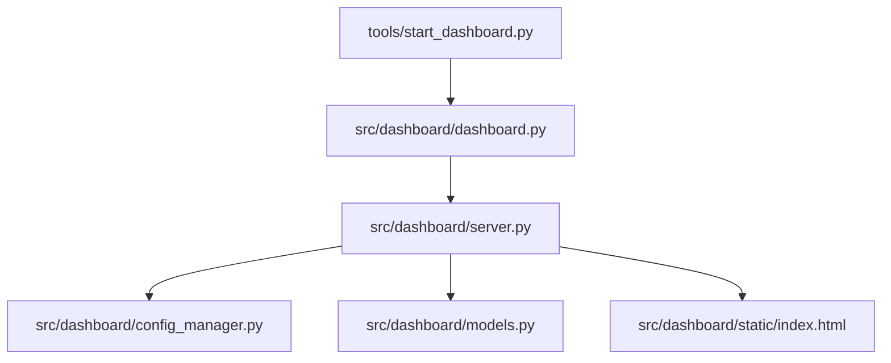
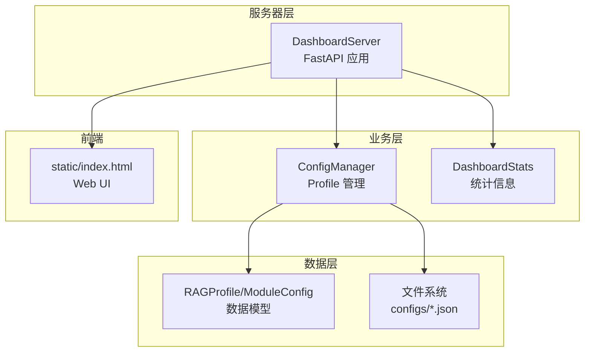
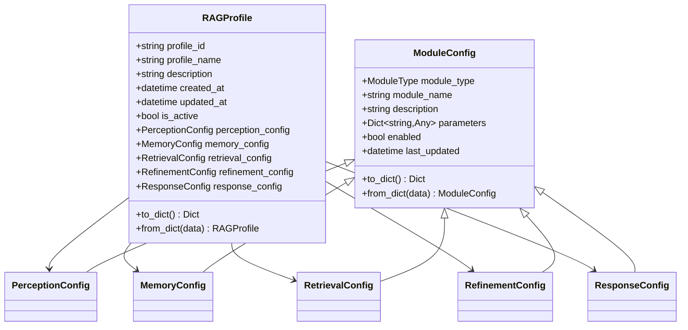
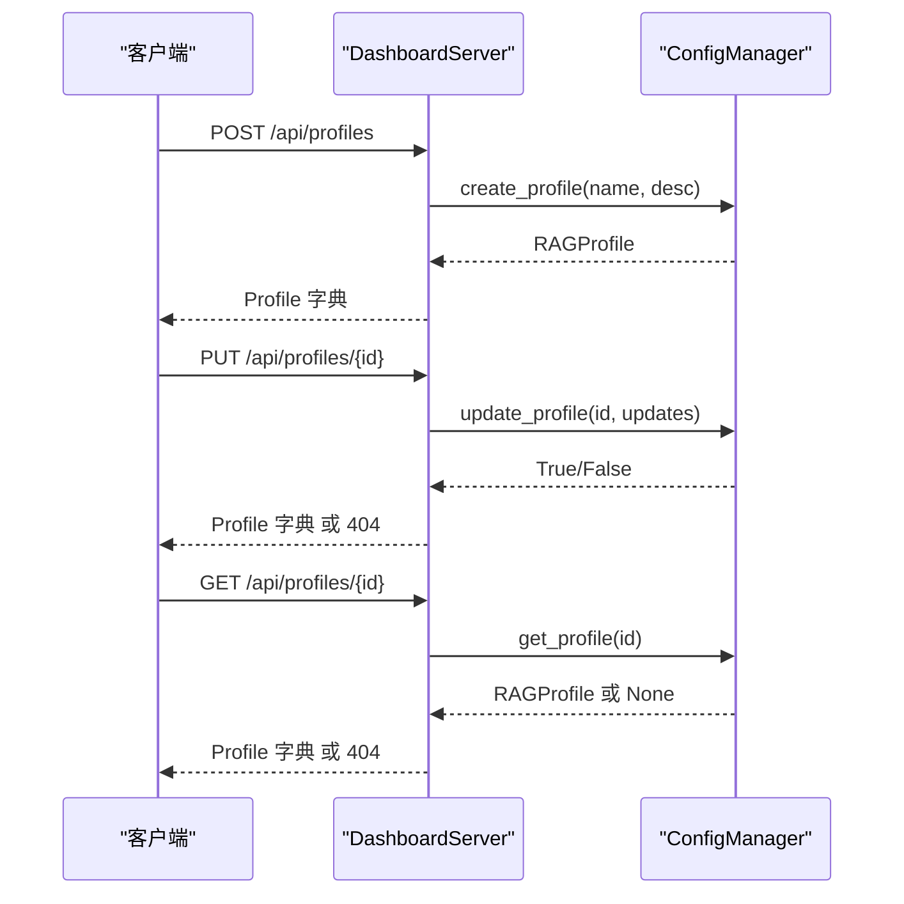
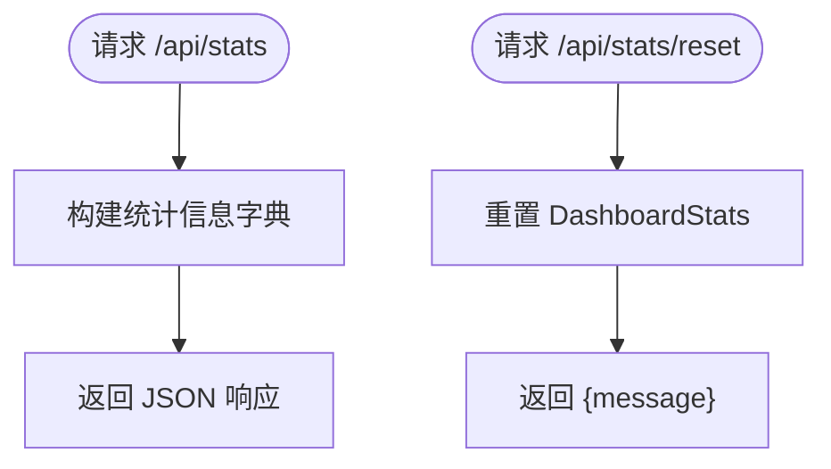
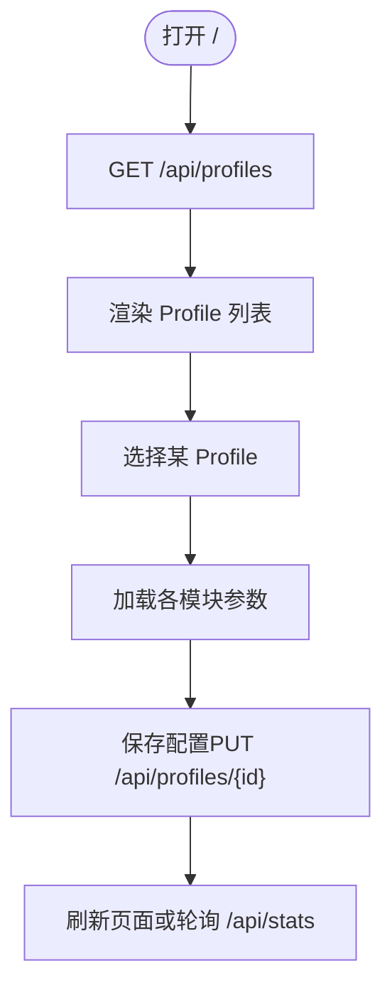
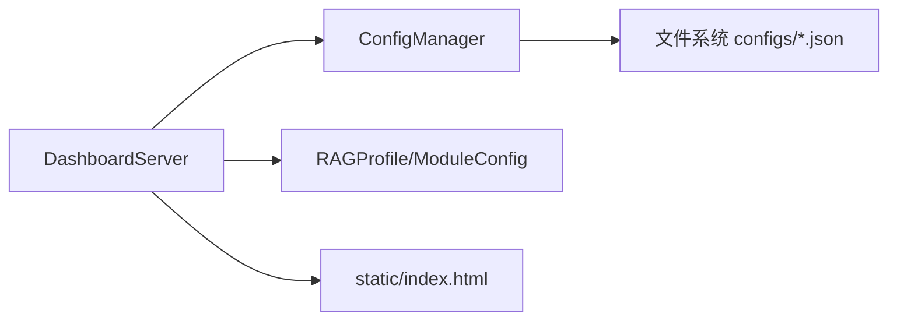

# 仪表板API

<cite>
**本文引用的文件**
- [src/dashboard/server.py](file://src/dashboard/server.py)
- [src/dashboard/config_manager.py](file://src/dashboard/config_manager.py)
- [src/dashboard/models.py](file://src/dashboard/models.py)
- [src/dashboard/dashboard.py](file://src/dashboard/dashboard.py)
- [src/dashboard/__init__.py](file://src/dashboard/__init__.py)
- [src/dashboard/static/index.html](file://src/dashboard/static/index.html)
- [DASHBOARD_GUIDE.md](file://DASHBOARD_GUIDE.md)
- [src/dashboard/README.md](file://src/dashboard/README.md)
- [tools/start_dashboard.py](file://tools/start_dashboard.py)
- [tools/start_dashboard.sh](file://tools/start_dashboard.sh)
- [tools/start_dashboard.bat](file://tools/start_dashboard.bat)
</cite>

## 目录
1. [简介](#简介)
2. [项目结构](#项目结构)
3. [核心组件](#核心组件)
4. [架构总览](#架构总览)
5. [详细组件分析](#详细组件分析)
6. [依赖分析](#依赖分析)
7. [性能考虑](#性能考虑)
8. [故障排查指南](#故障排查指南)
9. [结论](#结论)
10. [附录](#附录)

## 简介
本文件为 NecoRAG 仪表板 API 的权威参考文档，覆盖配置管理、模块参数管理、统计信息与 Web UI 的 RESTful 接口规范，并提供仪表板的部署与访问方式说明。文档同时给出 API 调用示例、错误处理建议与最佳实践，帮助开发者与运维人员高效地集成与维护仪表板。

## 项目结构
仪表板相关代码集中在 src/dashboard 目录，配合工具脚本 tools 提供跨平台启动方式；Web UI 静态资源位于 static/index.html；配套使用指南位于 DASHBOARD_GUIDE.md 与 src/dashboard/README.md。

图表来源
- [tools/start_dashboard.py:1-56](file://tools/start_dashboard.py#L1-L56)
- [src/dashboard/dashboard.py:1-31](file://src/dashboard/dashboard.py#L1-L31)
- [src/dashboard/server.py:1-393](file://src/dashboard/server.py#L1-L393)
- [src/dashboard/config_manager.py:1-315](file://src/dashboard/config_manager.py#L1-L315)
- [src/dashboard/models.py:1-231](file://src/dashboard/models.py#L1-L231)
- [src/dashboard/static/index.html:1-1026](file://src/dashboard/static/index.html#L1-L1026)

章节来源
- [src/dashboard/server.py:1-393](file://src/dashboard/server.py#L1-L393)
- [src/dashboard/config_manager.py:1-315](file://src/dashboard/config_manager.py#L1-L315)
- [src/dashboard/models.py:1-231](file://src/dashboard/models.py#L1-L231)
- [src/dashboard/dashboard.py:1-31](file://src/dashboard/dashboard.py#L1-L31)
- [tools/start_dashboard.py:1-56](file://tools/start_dashboard.py#L1-L56)
- [tools/start_dashboard.sh:1-26](file://tools/start_dashboard.sh#L1-L26)
- [tools/start_dashboard.bat:1-30](file://tools/start_dashboard.bat#L1-L30)
- [src/dashboard/static/index.html:1-1026](file://src/dashboard/static/index.html#L1-L1026)
- [DASHBOARD_GUIDE.md:1-309](file://DASHBOARD_GUIDE.md#L1-L309)
- [src/dashboard/README.md:1-417](file://src/dashboard/README.md#L1-L417)

## 核心组件
- DashboardServer：基于 FastAPI 的 Web 服务器，提供 REST API 与静态 UI 资源挂载。
- ConfigManager：负责 Profile 的持久化、加载、切换、导入导出与复制。
- RAGProfile/ModuleConfig：定义仪表板配置的数据模型与模块参数结构。
- 启动入口：tools/start_dashboard.py 与 src/dashboard/dashboard.py 提供命令行启动能力。
- Web UI：静态页面 index.html，提供 Profile 列表、模块参数编辑与统计面板。

章节来源
- [src/dashboard/server.py:43-393](file://src/dashboard/server.py#L43-L393)
- [src/dashboard/config_manager.py:14-315](file://src/dashboard/config_manager.py#L14-L315)
- [src/dashboard/models.py:164-231](file://src/dashboard/models.py#L164-L231)
- [src/dashboard/__init__.py:1-16](file://src/dashboard/__init__.py#L1-L16)
- [src/dashboard/static/index.html:1-1026](file://src/dashboard/static/index.html#L1-L1026)

## 架构总览
仪表板采用“服务器 + 配置管理 + 数据模型”的三层结构：FastAPI 路由层负责对外暴露 REST API；ConfigManager 负责 Profile 的增删改查与导入导出；数据模型定义了 Profile 与模块参数的结构；静态资源提供 Web UI。

图表来源
- [src/dashboard/server.py:43-393](file://src/dashboard/server.py#L43-L393)
- [src/dashboard/config_manager.py:14-315](file://src/dashboard/config_manager.py#L14-L315)
- [src/dashboard/models.py:164-231](file://src/dashboard/models.py#L164-L231)
- [src/dashboard/static/index.html:1-1026](file://src/dashboard/static/index.html#L1-L1026)

## 详细组件分析

### REST API 规范

- 基础路径
  - 所有 API 前缀为 /api。
  - Web UI 路径为 /，静态资源挂载于 /static。

- 跨域配置
  - 允许任意来源、方法与头部，便于前端直连。

- 认证与授权
  - 当前实现未内置认证/授权中间件，建议在反向代理层（如 Nginx）或网关处添加 Basic/Digest/OAuth 或 JWT 策略，或在后续版本中引入安全中间件。

- Profile 管理接口
  - GET /api/profiles
    - 功能：获取所有 Profile。
    - 响应：数组，元素为每个 Profile 的字典表示。
  - GET /api/profiles/{profile_id}
    - 功能：获取指定 Profile。
    - 响应：单个 Profile 字典。
    - 错误：404 未找到。
  - GET /api/profiles/active
    - 功能：获取当前活动 Profile。
    - 响应：活动 Profile 字典。
    - 错误：404 无活动配置。
  - POST /api/profiles
    - 功能：创建新 Profile。
    - 请求体：CreateProfileRequest（profile_name, description）。
    - 响应：新建 Profile 字典。
  - PUT /api/profiles/{profile_id}
    - 功能：更新 Profile（支持部分更新）。
    - 请求体：UpdateProfileRequest（可选字段：profile_name、description、各模块配置）。
    - 响应：更新后的 Profile 字典。
    - 错误：404 未找到。
  - DELETE /api/profiles/{profile_id}
    - 功能：删除 Profile。
    - 响应：{"message": "..."}。
    - 错误：404 未找到。
  - POST /api/profiles/{profile_id}/activate
    - 功能：激活指定 Profile。
    - 响应：{"message": "..."}。
    - 错误：404 未找到。
  - POST /api/profiles/{profile_id}/duplicate
    - 功能：复制指定 Profile（需传入新名称）。
    - 响应：复制得到的新 Profile 字典。
    - 错误：404 未找到。
  - POST /api/profiles/{profile_id}/export?export_path=...
    - 功能：导出 Profile 至文件。
    - 响应：{"message": "..."}。
    - 错误：400 导出失败。
  - POST /api/profiles/import?import_path=...
    - 功能：从文件导入 Profile。
    - 响应：导入的 Profile 字典。
    - 错误：400 导入失败。

- 模块参数管理接口
  - GET /api/profiles/{profile_id}/modules/{module}
    - 功能：获取指定模块的参数。
    - 支持模块：whiskers、memory、retrieval、grooming、purr。
    - 响应：{"module": "...", "parameters": {...}, "description": "..."}。
    - 错误：404 未找到；400 模块名非法。
  - PUT /api/profiles/{profile_id}/modules/{module}
    - 功能：更新指定模块参数。
    - 请求体：ModuleParametersUpdate（module, parameters）。
    - 响应：{"message": "..."}。
    - 错误：404 未找到；400 模块名非法。

- 统计信息接口
  - GET /api/stats
    - 功能：获取系统统计信息。
    - 响应：包含 total_documents、total_chunks、total_queries、active_sessions、memory_usage、performance_metrics 等键的字典。
  - POST /api/stats/reset
    - 功能：重置统计信息。
    - 响应：{"message": "..."}。

- Web UI
  - GET /
    - 功能：返回 Web UI 页面（优先 static/index.html，否则回退到内置简单 UI）。
  - 静态资源
    - GET /static/*：提供 UI 资源。

章节来源
- [src/dashboard/server.py:94-253](file://src/dashboard/server.py#L94-L253)
- [src/dashboard/server.py:239-253](file://src/dashboard/server.py#L239-L253)
- [src/dashboard/server.py:19-41](file://src/dashboard/server.py#L19-L41)

### 数据模型与配置结构

- RAGProfile
  - 关键字段：profile_id、profile_name、description、created_at、updated_at、is_active、各模块配置对象。
  - to_dict/from_dict：序列化/反序列化。
- ModuleConfig 及子类
  - ModuleType：PERCEPTION、MEMORY、RETRIEVAL、REFINEMENT、RESPONSE。
  - 各模块默认参数：
    - PerceptionConfig：chunk_size、chunk_overlap、enable_ocr、vector_model、vector_size 等。
    - MemoryConfig：l1_ttl、l2_vector_size、decay_rate、archive_threshold 等。
    - RetrievalConfig：top_k、min_score、hyde_enabled、reranker_model、confidence_threshold 等。
    - RefinementConfig：min_confidence、hallucination_threshold、consolidation_interval 等。
    - ResponseConfig：default_tone、default_detail_level、show_trace、show_evidence 等。
- DashboardStats
  - total_documents、total_chunks、total_queries、active_sessions、memory_usage、performance_metrics 等。

图表来源
- [src/dashboard/models.py:164-231](file://src/dashboard/models.py#L164-L231)
- [src/dashboard/models.py:21-44](file://src/dashboard/models.py#L21-L44)

章节来源
- [src/dashboard/models.py:164-231](file://src/dashboard/models.py#L164-L231)
- [src/dashboard/models.py:21-44](file://src/dashboard/models.py#L21-L44)

### 配置管理流程（序列图）

图表来源
- [src/dashboard/server.py:121-147](file://src/dashboard/server.py#L121-L147)
- [src/dashboard/config_manager.py:42-166](file://src/dashboard/config_manager.py#L42-L166)

章节来源
- [src/dashboard/server.py:121-147](file://src/dashboard/server.py#L121-L147)
- [src/dashboard/config_manager.py:42-166](file://src/dashboard/config_manager.py#L42-L166)

### 统计信息流程（流程图）

图表来源
- [src/dashboard/server.py:219-235](file://src/dashboard/server.py#L219-L235)
- [src/dashboard/models.py:221-231](file://src/dashboard/models.py#L221-L231)

章节来源
- [src/dashboard/server.py:219-235](file://src/dashboard/server.py#L219-L235)
- [src/dashboard/models.py:221-231](file://src/dashboard/models.py#L221-L231)

### Web UI 与 API 协同（流程图）

图表来源
- [src/dashboard/static/index.html:734-782](file://src/dashboard/static/index.html#L734-L782)
- [src/dashboard/server.py:121-147](file://src/dashboard/server.py#L121-L147)
- [src/dashboard/server.py:219-235](file://src/dashboard/server.py#L219-L235)

章节来源
- [src/dashboard/static/index.html:734-782](file://src/dashboard/static/index.html#L734-L782)
- [src/dashboard/server.py:121-147](file://src/dashboard/server.py#L121-L147)
- [src/dashboard/server.py:219-235](file://src/dashboard/server.py#L219-L235)

## 依赖分析
- 组件耦合
  - DashboardServer 依赖 ConfigManager 与数据模型，负责路由注册与响应封装。
  - ConfigManager 依赖数据模型与文件系统，负责 Profile 的持久化与缓存。
  - Web UI 通过 /api 路由与服务器交互，不直接依赖后端逻辑。
- 外部依赖
  - FastAPI、Uvicorn、Pydantic（类型校验）、CORS 中间件。
- 潜在循环依赖
  - 未发现循环导入；模块职责清晰。

图表来源
- [src/dashboard/server.py:15-16](file://src/dashboard/server.py#L15-L16)
- [src/dashboard/config_manager.py:32-40](file://src/dashboard/config_manager.py#L32-L40)
- [src/dashboard/models.py:164-231](file://src/dashboard/models.py#L164-L231)
- [src/dashboard/static/index.html:1-1026](file://src/dashboard/static/index.html#L1-L1026)

章节来源
- [src/dashboard/server.py:15-16](file://src/dashboard/server.py#L15-L16)
- [src/dashboard/config_manager.py:32-40](file://src/dashboard/config_manager.py#L32-L40)
- [src/dashboard/models.py:164-231](file://src/dashboard/models.py#L164-L231)
- [src/dashboard/static/index.html:1-1026](file://src/dashboard/static/index.html#L1-L1026)

## 性能考虑
- 配置缓存：ConfigManager 在内存中缓存所有 Profile，避免频繁 IO。
- 批量更新：建议在前端或客户端聚合多次参数更新，减少 API 调用次数。
- 统计刷新：UI 默认每 5 秒轮询一次 /api/stats，可根据场景调整频率。
- CORS：允许任意来源与方法，便于开发调试，生产环境建议收紧来源与方法。

## 故障排查指南
- 404 未找到 Profile
  - 确认 profile_id 是否正确；先调用 GET /api/profiles 获取列表。
- 400 导入/导出失败
  - 检查 import_path/export_path 是否有效；确认文件可读/可写。
- 无法访问 Dashboard
  - 检查端口是否被占用；确认防火墙放行；使用 tools/start_dashboard.sh 或 tools/start_dashboard.bat 启动。
- CORS 问题
  - 生产环境建议配置具体允许的 origins、methods 与 headers。

章节来源
- [src/dashboard/server.py:109-111](file://src/dashboard/server.py#L109-L111)
- [src/dashboard/server.py:144-147](file://src/dashboard/server.py#L144-L147)
- [src/dashboard/server.py:168-171](file://src/dashboard/server.py#L168-L171)
- [src/dashboard/server.py:187-191](file://src/dashboard/server.py#L187-L191)
- [tools/start_dashboard.sh:10-25](file://tools/start_dashboard.sh#L10-L25)
- [tools/start_dashboard.bat:10-27](file://tools/start_dashboard.bat#L10-L27)

## 结论
仪表板 API 提供了完整的配置管理、模块参数管理与统计信息接口，结合 Web UI 实现了可视化的参数调优与监控。当前实现未内置认证/授权，建议在生产环境中通过反向代理或网关增强安全策略。未来可扩展 WebSocket 实时推送与权限管理等能力。

## 附录

### 部署与访问方式
- 命令行启动
  - Python 模块方式：python -m necorag.dashboard.dashboard
  - 带参数：--host、--port、--config-dir
- 脚本启动
  - tools/start_dashboard.py（通用）
  - tools/start_dashboard.sh（Linux/Mac）
  - tools/start_dashboard.bat（Windows）
- 访问地址
  - Web UI：http://localhost:8000
  - API 文档：http://localhost:8000/docs

章节来源
- [src/dashboard/dashboard.py:10-31](file://src/dashboard/dashboard.py#L10-L31)
- [tools/start_dashboard.py:16-56](file://tools/start_dashboard.py#L16-L56)
- [tools/start_dashboard.sh:16-25](file://tools/start_dashboard.sh#L16-L25)
- [tools/start_dashboard.bat:18-27](file://tools/start_dashboard.bat#L18-L27)
- [DASHBOARD_GUIDE.md:26-56](file://DASHBOARD_GUIDE.md#L26-L56)

### API 调用示例（来自指南）
- 获取所有 Profiles：GET /api/profiles
- 创建 Profile：POST /api/profiles
- 更新 Profile：PUT /api/profiles/{profile_id}
- 激活 Profile：POST /api/profiles/{profile_id}/activate
- 删除 Profile：DELETE /api/profiles/{profile_id}
- 获取模块参数：GET /api/profiles/{profile_id}/modules/{module}
- 更新模块参数：PUT /api/profiles/{profile_id}/modules/{module}
- 获取统计信息：GET /api/stats
- 重置统计信息：POST /api/stats/reset

章节来源
- [DASHBOARD_GUIDE.md:92-147](file://DASHBOARD_GUIDE.md#L92-L147)
- [src/dashboard/README.md:86-203](file://src/dashboard/README.md#L86-L203)

### 仪表板配置 JSON 结构与字段说明
- RAGProfile 字段
  - profile_id、profile_name、description、created_at、updated_at、is_active
  - 各模块配置：perception_config、memory_config、retrieval_config、refinement_config、response_config
- 模块配置字段
  - module_type、module_name、description、parameters（字典）、enabled、last_updated
- 示例结构参考
  - 完整示例与字段说明参见 DASHBOARD_GUIDE.md 与 src/dashboard/README.md 的配置文件存储章节。

章节来源
- [src/dashboard/models.py:164-231](file://src/dashboard/models.py#L164-L231)
- [src/dashboard/models.py:21-44](file://src/dashboard/models.py#L21-L44)
- [DASHBOARD_GUIDE.md:186-222](file://DASHBOARD_GUIDE.md#L186-L222)
- [src/dashboard/README.md:253-283](file://src/dashboard/README.md#L253-L283)

### WebSocket 实时监控
- 当前实现未提供 WebSocket 接口。
- 建议在后续版本中增加 /ws/stats 端点，向订阅者推送统计信息更新，以降低轮询开销。

章节来源
- [src/dashboard/README.md:407-412](file://src/dashboard/README.md#L407-L412)