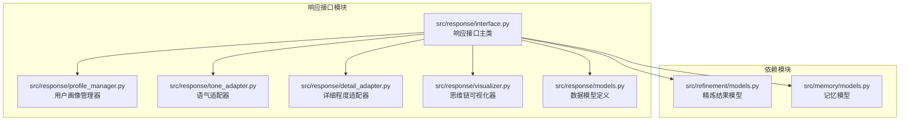
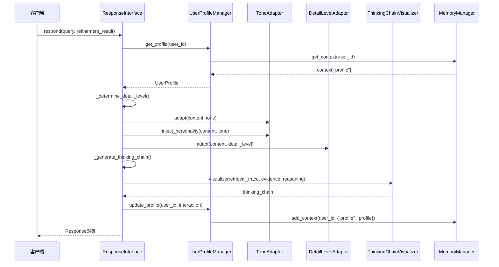
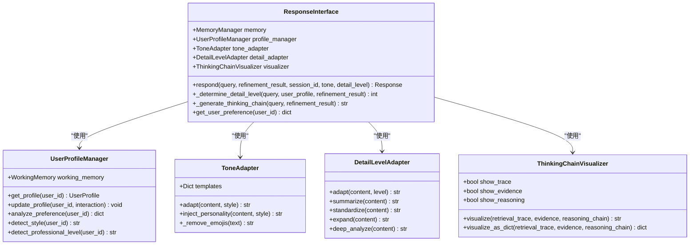
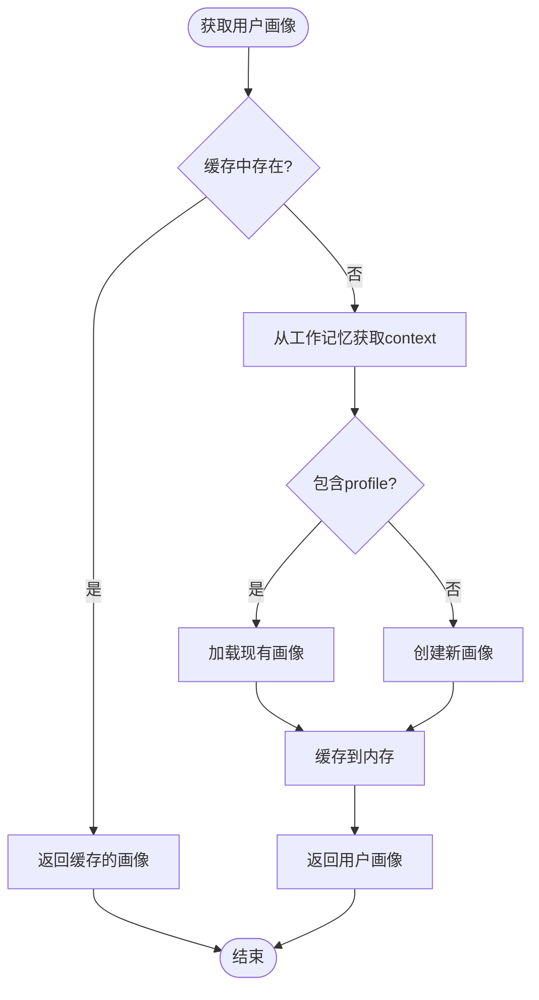
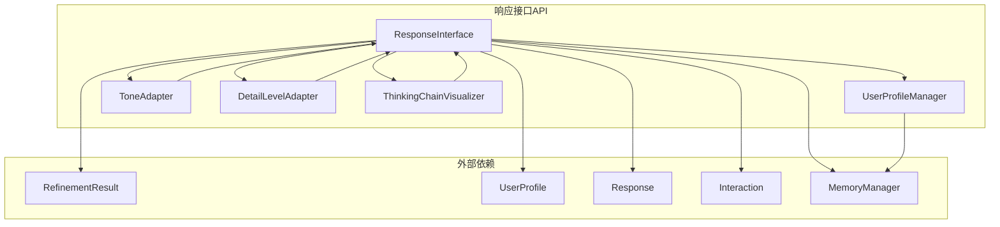

# 响应接口API

<cite>
**本文档引用的文件**
- [src/response/interface.py](file://src/response/interface.py)
- [src/response/profile_manager.py](file://src/response/profile_manager.py)
- [src/response/tone_adapter.py](file://src/response/tone_adapter.py)
- [src/response/detail_adapter.py](file://src/response/detail_adapter.py)
- [src/response/visualizer.py](file://src/response/visualizer.py)
- [src/response/models.py](file://src/response/models.py)
- [src/refinement/models.py](file://src/refinement/models.py)
- [src/memory/models.py](file://src/memory/models.py)
- [example/example_usage.py](file://example/example_usage.py)
- [src/response/__init__.py](file://src/response/__init__.py)
- [README.md](file://README.md)
</cite>

## 目录
1. [简介](#简介)
2. [项目结构](#项目结构)
3. [核心组件](#核心组件)
4. [架构概览](#架构概览)
5. [详细组件分析](#详细组件分析)
6. [依赖关系分析](#依赖关系分析)
7. [性能考虑](#性能考虑)
8. [故障排除指南](#故障排除指南)
9. [结论](#结论)
10. [附录](#附录)

## 简介

响应接口API是NecoRAG框架的交互层核心组件，负责情境自适应生成与可解释性输出。该接口通过用户画像管理、语气适配、详细程度适配和思维链可视化四大核心功能，为用户提供个性化、透明且高质量的响应服务。

NecoRAG采用五层认知架构设计，响应接口位于最外层，直接面向用户交互。该接口不仅能够根据用户特征生成定制化响应，还能展示完整的思考过程，实现真正的可解释性AI。

## 项目结构

响应接口API位于`src/response/`目录下，包含以下核心文件：



**图表来源**
- [src/response/interface.py:1-224](file://src/response/interface.py#L1-L224)
- [src/response/profile_manager.py:1-165](file://src/response/profile_manager.py#L1-L165)
- [src/response/tone_adapter.py:1-138](file://src/response/tone_adapter.py#L1-L138)
- [src/response/detail_adapter.py:1-202](file://src/response/detail_adapter.py#L1-L202)
- [src/response/visualizer.py:1-150](file://src/response/visualizer.py#L1-L150)

**章节来源**
- [src/response/interface.py:1-224](file://src/response/interface.py#L1-L224)
- [src/response/__init__.py:1-23](file://src/response/__init__.py#L1-L23)

## 核心组件

响应接口API由五个核心组件构成，每个组件都有明确的职责分工：

### 1. ResponseInterface - 响应接口主类
- **职责**：协调各子组件，生成最终响应
- **核心功能**：情境自适应生成、用户画像适配、思维链可视化
- **初始化参数**：memory(记忆管理器)、llm_model(LLM模型)、default_tone(默认语气)、default_detail_level(默认详细程度)

### 2. UserProfileManager - 用户画像管理器
- **职责**：管理用户画像、分析用户偏好、跟踪交互历史
- **核心功能**：画像缓存、历史记录管理、偏好分析
- **存储位置**：工作记忆中的context["profile"]

### 3. ToneAdapter - 语气适配器
- **职责**：根据用户特征调整响应语气
- **支持风格**：formal(正式)、friendly(友好)、humorous(幽默)
- **适配方式**：模板注入、连接词注入、表情符号控制

### 4. DetailLevelAdapter - 详细程度适配器
- **职责**：根据查询复杂度调整响应详细程度
- **四个层级**：Level 1(简洁摘要)、Level 2(标准回答)、Level 3(详细解释)、Level 4(深度分析)
- **自动调整**：基于迭代次数和用户专业水平

### 5. ThinkingChainVisualizer - 思维链可视化器
- **职责**：生成可解释的思维链可视化输出
- **展示内容**：检索路径、证据来源、推理过程
- **输出格式**：结构化文本和结构化对象

**章节来源**
- [src/response/interface.py:16-132](file://src/response/interface.py#L16-L132)
- [src/response/profile_manager.py:10-165](file://src/response/profile_manager.py#L10-L165)
- [src/response/tone_adapter.py:8-138](file://src/response/tone_adapter.py#L8-L138)
- [src/response/detail_adapter.py:8-202](file://src/response/detail_adapter.py#L8-L202)
- [src/response/visualizer.py:9-150](file://src/response/visualizer.py#L9-L150)

## 架构概览

响应接口API采用分层架构设计，各组件之间通过清晰的接口进行通信：



**图表来源**
- [src/response/interface.py:55-132](file://src/response/interface.py#L55-L132)
- [src/response/profile_manager.py:69-100](file://src/response/profile_manager.py#L69-L100)
- [src/response/tone_adapter.py:49-109](file://src/response/tone_adapter.py#L49-L109)
- [src/response/detail_adapter.py:28-56](file://src/response/detail_adapter.py#L28-L56)
- [src/response/visualizer.py:37-71](file://src/response/visualizer.py#L37-L71)

## 详细组件分析

### ResponseInterface 类分析

ResponseInterface是响应接口API的核心类，负责协调各个子组件的工作流程。

#### 主要方法

**respond() 方法**
- **功能**：生成最终响应
- **输入参数**：query(查询文本)、refinement_result(精炼结果)、session_id(会话ID)、tone(语气)、detail_level(详细程度)
- **输出**：Response对象
- **处理流程**：
  1. 获取用户画像
  2. 确定语气风格
  3. 确定详细程度
  4. 语气适配和个性化注入
  5. 详细程度适配
  6. 生成思维链可视化
  7. 创建响应对象
  8. 更新用户画像

**_determine_detail_level() 方法**
- **功能**：智能确定详细程度级别
- **决策因素**：
  - 用户专业水平映射：beginner→3, intermediate→2, expert→1
  - 查询复杂度调整：迭代次数>2时提高详细程度
  - 最终范围：1-4级

**_generate_thinking_chain() 方法**
- **功能**：生成思维链可视化
- **包含内容**：
  - 检索路径：查询理解→语义检索→证据发现
  - 证据来源：证据ID和相关度
  - 推理过程：置信度、迭代次数、幻觉检测结果

#### 类关系图



**图表来源**
- [src/response/interface.py:16-224](file://src/response/interface.py#L16-L224)
- [src/response/profile_manager.py:10-165](file://src/response/profile_manager.py#L10-L165)
- [src/response/tone_adapter.py:8-138](file://src/response/tone_adapter.py#L8-L138)
- [src/response/detail_adapter.py:8-202](file://src/response/detail_adapter.py#L8-L202)
- [src/response/visualizer.py:9-150](file://src/response/visualizer.py#L9-L150)

**章节来源**
- [src/response/interface.py:16-224](file://src/response/interface.py#L16-L224)

### 用户画像管理器分析

UserProfileManager负责维护和管理用户画像，是个性化响应的基础。

#### 核心功能

**画像获取机制**
- **缓存策略**：内存中缓存用户画像，避免重复读取
- **持久化存储**：通过工作记忆的context["profile"]进行持久化
- **默认创建**：首次访问时自动创建新的UserProfile实例

**历史记录管理**
- **查询历史**：记录用户的查询历史，支持偏好分析
- **历史限制**：最大历史记录数限制，防止内存膨胀
- **时间戳更新**：每次更新时自动更新updated_at字段

**偏好分析功能**
- **关键词提取**：从查询历史中提取高频关键词
- **统计分析**：计算总查询数、交互风格等指标
- **专业水平检测**：基于查询内容分析用户专业水平

#### 流程图



**图表来源**
- [src/response/profile_manager.py:41-67](file://src/response/profile_manager.py#L41-L67)

**章节来源**
- [src/response/profile_manager.py:10-165](file://src/response/profile_manager.py#L10-L165)

### 语气适配器分析

ToneAdapter负责根据用户特征和场景需求调整响应的语气风格。

#### 支持的语气风格

| 语气风格 | 特征描述 | 模板配置 | 适用场景 |
|---------|----------|----------|----------|
| formal | 专业严谨 | 无前后缀，避免表情符号，正式连接词 | 商务、学术、正式场合 |
| friendly | 亲切友好 | 无前后缀，允许表情符号，日常连接词 | 日常交流、客户服务 |
| humorous | 幽默轻松 | 前缀"哈哈，"，后缀" 😸"，趣味连接词 | 娱乐、教育、创意场景 |

#### 适配算法

**内容适配流程**
1. **模板选择**：根据指定风格选择对应的模板配置
2. **前后缀添加**：根据模板配置添加适当的前后缀
3. **表情符号处理**：根据风格要求移除或保留表情符号
4. **连接词注入**：在多段落内容中注入相应的连接词

**个性化注入机制**
- **连接词策略**：不同风格使用不同的连接词集合
- **段落处理**：在段落间添加自然的过渡连接
- **语调调节**：通过连接词和标点符号调节整体语调

**章节来源**
- [src/response/tone_adapter.py:8-138](file://src/response/tone_adapter.py#L8-L138)

### 详细程度适配器分析

DetailLevelAdapter根据查询复杂度和用户需求调整响应的详细程度。

#### 四级详细程度模型

| 级别 | 名称 | 特征 | 适用场景 |
|------|------|------|----------|
| 1 | 简洁摘要 | 1-2句话，直接给出核心答案 | 时间紧迫、快速查询 |
| 2 | 标准回答 | 单段落+要点列表，平衡详细度 | 日常问答、一般查询 |
| 3 | 详细解释 | 多段落+案例说明，深入分析 | 学习研究、技术讨论 |
| 4 | 深度分析 | 完整报告格式，包含多个维度 | 学术研究、决策支持 |

#### 自动调整机制

**专业水平映射**
- **初学者**：默认3级详细程度，便于理解
- **中级用户**：默认2级详细程度，平衡效率和信息量
- **专家用户**：默认1级详细程度，直接进入核心内容

**复杂度调整**
- **简单查询**：迭代次数≤2，保持较低详细程度
- **复杂查询**：迭代次数>2，自动提升一级详细程度
- **范围限制**：确保详细程度在1-4级范围内

#### 内容转换算法

**摘要生成**
- **最小实现**：提取第一句作为摘要
- **边界处理**：处理没有句号的情况

**要点提取**
- **关键词识别**：识别包含"重要"、"关键"、"核心"等关键词的句子
- **数量限制**：最多提取3个要点
- **格式化输出**：使用编号列表格式

**章节来源**
- [src/response/detail_adapter.py:8-202](file://src/response/detail_adapter.py#L8-L202)

### 思维链可视化器分析

ThinkingChainVisualizer负责生成可解释的思维链可视化输出，展示AI的完整思考过程。

#### 可视化内容结构

**检索路径追踪**
- **查询理解**：识别和理解用户查询的关键信息
- **实体识别**：从查询中提取相关实体
- **向量检索**：在语义记忆中进行相似度匹配
- **图谱推理**：利用知识图谱进行多跳推理
- **结果融合**：整合多源证据形成最终答案

**证据来源展示**
- **证据编号**：为每条证据分配唯一标识
- **相关度评分**：显示证据的相关程度
- **来源信息**：提供证据的具体来源

**推理过程记录**
- **置信度评估**：展示答案的可信度
- **迭代次数**：记录精炼过程的迭代次数
- **幻觉检测**：显示幻觉检测的结果

#### 可视化输出格式

**文本格式**
- **结构化布局**：使用标题和分段组织内容
- **图标装饰**：使用emoji增强可读性
- **层次分明**：通过缩进和编号显示层次关系

**结构化对象**
- **RetrievalVisualization**：包含查询理解、检索步骤、证据来源、推理链条
- **JSON兼容**：便于前端渲染和数据交换

**章节来源**
- [src/response/visualizer.py:9-150](file://src/response/visualizer.py#L9-L150)

## 依赖关系分析

响应接口API的依赖关系相对简单，主要依赖于其他模块的数据模型和工具类。



**图表来源**
- [src/response/interface.py:6-13](file://src/response/interface.py#L6-L13)
- [src/response/profile_manager.py:5-7](file://src/response/profile_manager.py#L5-L7)

### 主要依赖说明

**内部依赖**
- **MemoryManager**：用于获取和存储用户画像
- **RefinementResult**：来自精炼层的结构化结果
- **UserProfile/Response/Interaction**：数据模型定义

**外部依赖**
- **WorkingMemory**：工作记忆接口，用于上下文存储
- **LLM模型**：虽然在接口中声明但具体实现由调用者提供

**循环依赖避免**
- 响应接口不依赖记忆管理器的实现细节
- 通过抽象接口进行通信，避免直接耦合

**章节来源**
- [src/response/interface.py:6-13](file://src/response/interface.py#L6-L13)
- [src/response/profile_manager.py:5-7](file://src/response/profile_manager.py#L5-L7)

## 性能考虑

响应接口API在设计时充分考虑了性能优化，主要体现在以下几个方面：

### 缓存策略
- **用户画像缓存**：内存中缓存用户画像，减少重复读取
- **工作记忆集成**：利用工作记忆的TTL机制自动清理过期数据
- **批量操作**：支持批量更新用户偏好和历史记录

### 内存管理
- **历史记录限制**：默认最大历史记录数为100，防止内存膨胀
- **时间戳更新**：只在必要时更新updated_at字段
- **惰性加载**：用户画像按需加载，避免不必要的初始化

### 处理效率
- **快速路径**：简单查询直接返回，避免复杂的适配过程
- **模板复用**：语气模板预编译，避免运行时重复创建
- **字符串操作优化**：使用高效的字符串分割和连接操作

### 可扩展性
- **插件化设计**：支持自定义语气风格和详细程度级别
- **配置驱动**：通过配置文件调整性能参数
- **异步处理**：支持异步更新用户画像，不影响响应速度

## 故障排除指南

### 常见问题及解决方案

**用户画像获取失败**
- **症状**：UserProfileManager.get_profile()抛出异常
- **原因**：工作记忆连接失败或数据损坏
- **解决方案**：检查工作记忆配置，重新初始化UserProfile

**语气适配异常**
- **症状**：ToneAdapter.adapt()返回空字符串
- **原因**：模板配置缺失或内容为空
- **解决方案**：验证模板配置，确保输入内容非空

**详细程度适配错误**
- **症状**：DetailLevelAdapter.adapt()返回原始内容
- **原因**：详细程度级别超出1-4范围
- **解决方案**：修正详细程度级别，确保在有效范围内

**思维链可视化空白**
- **症状**：ThinkingChainVisualizer.visualize()返回空字符串
- **原因**：所有可视化选项被禁用或输入数据为空
- **解决方案**：启用至少一个可视化选项，检查输入数据

### 调试技巧

**日志记录**
- 在关键节点添加详细的日志信息
- 记录输入参数和输出结果
- 跟踪用户画像的更新过程

**单元测试**
- 为每个组件编写独立的单元测试
- 测试边界条件和异常情况
- 验证组件间的接口契约

**性能监控**
- 监控响应时间分布
- 跟踪内存使用情况
- 分析用户画像缓存命中率

**章节来源**
- [src/response/interface.py:134-224](file://src/response/interface.py#L134-L224)
- [src/response/profile_manager.py:69-165](file://src/response/profile_manager.py#L69-L165)

## 结论

响应接口API作为NecoRAG框架的交互层核心，通过精心设计的四个核心组件实现了情境自适应的智能响应。该接口不仅提供了高度个性化的用户体验，还通过思维链可视化展示了完整的AI思考过程，真正实现了可解释性AI。

### 主要优势

1. **情境自适应**：通过用户画像和查询分析，提供最适合的响应
2. **可解释性**：完整的思维链可视化，让用户理解AI的思考过程
3. **个性化**：支持多种语气风格和详细程度，满足不同用户需求
4. **可扩展性**：模块化设计，易于添加新的适配器和可视化功能

### 应用场景

- **客户服务**：根据客户特征提供个性化的服务响应
- **教育培训**：根据学生水平调整教学内容的详细程度
- **决策支持**：为不同专业背景的用户提供合适的分析报告
- **内容创作**：根据目标受众调整内容的表达方式

### 未来发展

随着NecoRAG框架的不断完善，响应接口API将继续演进，支持更多高级功能如情感分析、多模态响应、实时个性化等，为用户提供更加智能化和人性化的交互体验。

## 附录

### API使用示例

以下是一个完整的响应接口使用示例：

```python
# 初始化响应接口
interface = ResponseInterface(
    memory=memory,
    default_tone="friendly",
    default_detail_level=2
)

# 生成响应
response = interface.respond(
    query="深度学习有哪些应用领域？",
    refinement_result=refinement_result,
    session_id="user_123",
    tone="friendly",
    detail_level=2
)

# 获取用户偏好
preference = interface.get_user_preference("user_123")
```

### 配置参数说明

| 参数名称 | 类型 | 默认值 | 说明 |
|----------|------|--------|------|
| memory | MemoryManager | 必需 | 记忆管理器实例 |
| llm_model | str | "default" | LLM模型名称 |
| default_tone | str | "friendly" | 默认语气风格 |
| default_detail_level | int | 2 | 默认详细程度级别 |
| profile_ttl | int | 86400 | 画像TTL（秒） |
| max_history | int | 100 | 最大历史记录数 |

### 错误处理最佳实践

1. **输入验证**：始终验证输入参数的有效性
2. **异常捕获**：在关键操作中添加适当的异常处理
3. **降级策略**：在网络异常时提供基础功能
4. **日志记录**：详细记录错误信息便于调试