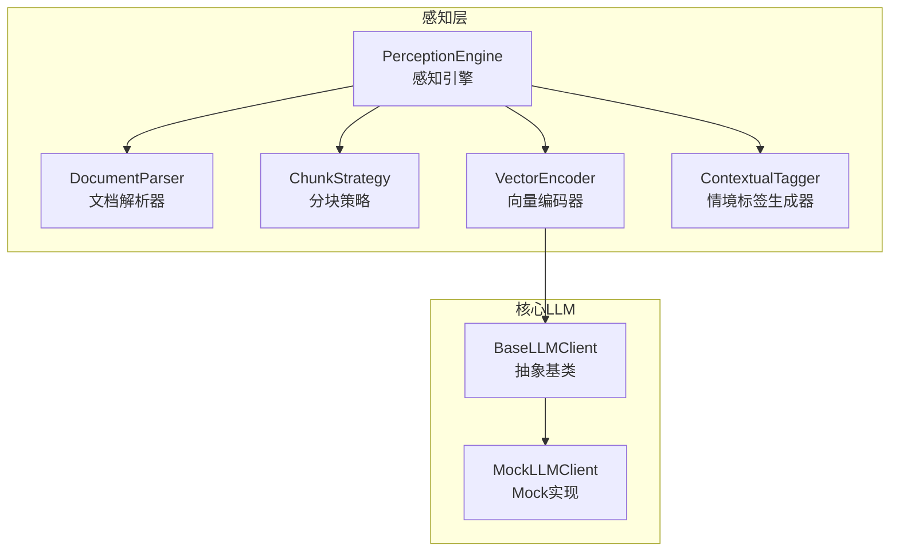
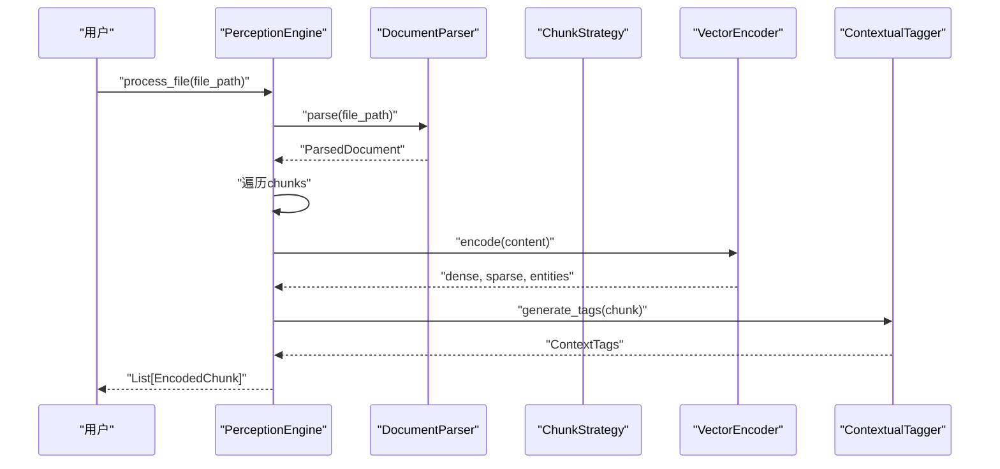
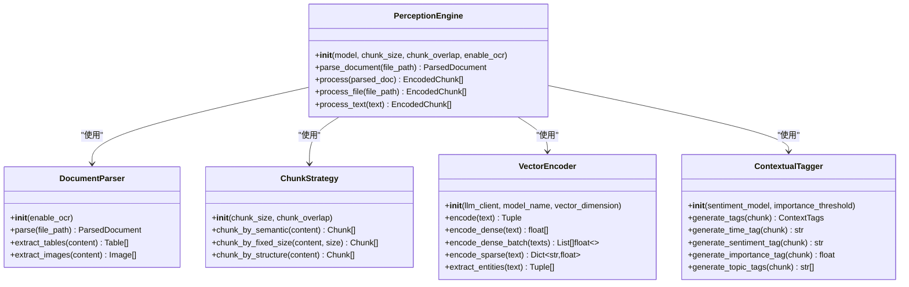
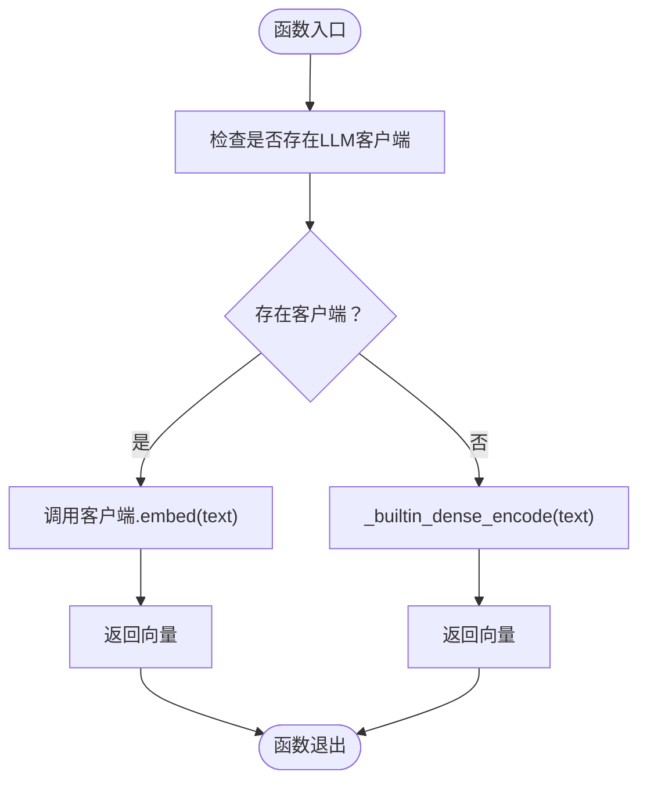
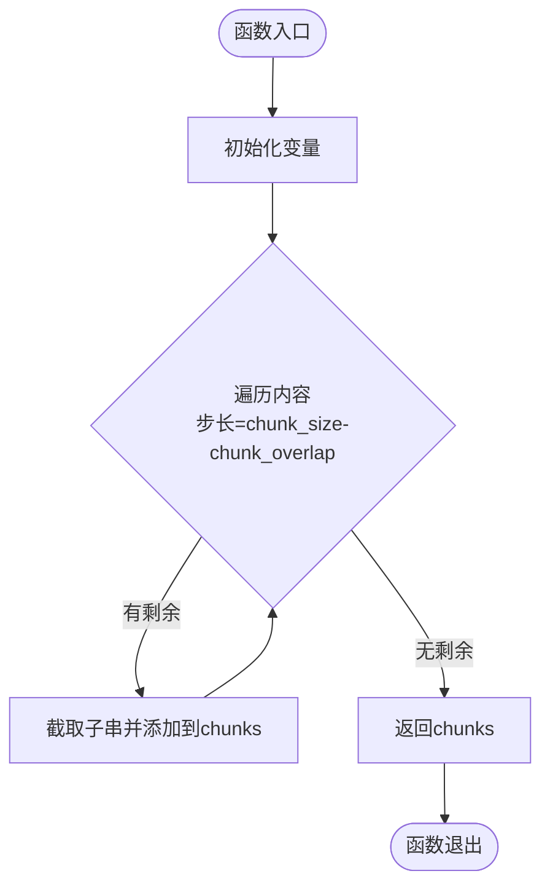
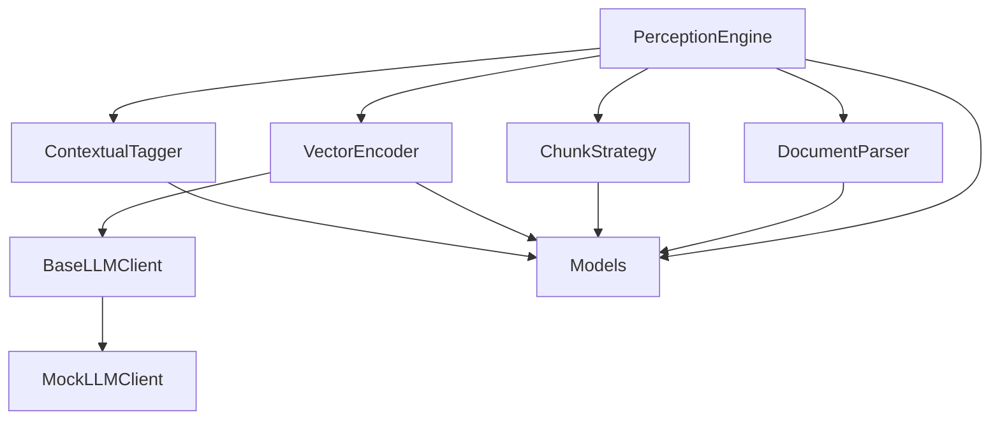

# 感知引擎API

<cite>
**本文档引用的文件**
- [engine.py](file://src/perception/engine.py)
- [parser.py](file://src/perception/parser.py)
- [chunker.py](file://src/perception/chunker.py)
- [tagger.py](file://src/perception/tagger.py)
- [encoder.py](file://src/perception/encoder.py)
- [models.py](file://src/perception/models.py)
- [base.py](file://src/core/llm/base.py)
- [mock.py](file://src/core/llm/mock.py)
- [README.md](file://README.md)
- [perception/README.md](file://src/perception/README.md)
- [example_usage.py](file://example/example_usage.py)
</cite>

## 目录
1. [简介](#简介)
2. [项目结构](#项目结构)
3. [核心组件](#核心组件)
4. [架构总览](#架构总览)
5. [详细组件分析](#详细组件分析)
6. [依赖关系分析](#依赖关系分析)
7. [性能考虑](#性能考虑)
8. [故障排除指南](#故障排除指南)
9. [结论](#结论)
10. [附录](#附录)

## 简介
本文件为感知引擎API的完整参考文档，聚焦于PerceptionEngine类及其相关组件。感知引擎负责多模态数据的高精度编码与情境标记，涵盖文档处理、文本编码、分块策略、向量化编码以及情境标记等能力。本文将详细说明各组件的职责、调用关系、参数与返回值、使用示例、文件格式支持、配置选项以及编码器选择与性能影响。

## 项目结构
感知引擎位于src/perception目录，主要由以下模块组成：
- engine.py：感知引擎主类，协调解析、分块、编码与情境标记
- parser.py：文档解析器，负责将各种格式文档转换为统一结构化表示
- chunker.py：分块策略，支持多种分块模式（语义、固定大小、结构）
- encoder.py：向量编码器，生成稠密向量、稀疏向量与实体三元组
- tagger.py：情境标签生成器，为每个文本块生成时间、情感、重要性、主题标签
- models.py：数据模型定义，包括Chunk、EncodedChunk、ParsedDocument等
- core/llm：LLM客户端抽象与Mock实现，用于向量化与文本生成

图表来源
- [engine.py:14-130](file://src/perception/engine.py#L14-L130)
- [parser.py:11-112](file://src/perception/parser.py#L11-L112)
- [chunker.py:10-98](file://src/perception/chunker.py#L10-L98)
- [encoder.py:24-254](file://src/perception/encoder.py#L24-L254)
- [tagger.py:10-144](file://src/perception/tagger.py#L10-L144)
- [base.py:11-178](file://src/core/llm/base.py#L11-L178)
- [mock.py:16-313](file://src/core/llm/mock.py#L16-L313)

章节来源
- [engine.py:14-130](file://src/perception/engine.py#L14-L130)
- [README.md:158-195](file://README.md#L158-L195)

## 核心组件
本节概述感知引擎的主要公共接口与职责分工：
- PerceptionEngine：感知引擎主类，提供parse_document、process、process_file、process_text等接口，协调解析、分块、编码与情境标记
- DocumentParser：文档解析器，负责将各种格式文档转换为统一结构化表示
- ChunkStrategy：分块策略，支持语义分块、固定大小分块、结构化分块
- VectorEncoder：向量编码器，生成稠密向量、稀疏向量与实体三元组
- ContextualTagger：情境标签生成器，为每个文本块生成时间、情感、重要性、主题标签
- 数据模型：Chunk、EncodedChunk、ParsedDocument等，定义统一的数据结构

章节来源
- [engine.py:42-130](file://src/perception/engine.py#L42-L130)
- [parser.py:27-112](file://src/perception/parser.py#L27-L112)
- [chunker.py:17-98](file://src/perception/chunker.py#L17-L98)
- [encoder.py:32-254](file://src/perception/encoder.py#L32-L254)
- [tagger.py:17-144](file://src/perception/tagger.py#L17-L144)
- [models.py:11-69](file://src/perception/models.py#L11-L69)

## 架构总览
感知引擎的处理流程如下：
1. 输入可以是文件路径或纯文本
2. 若为文件，先通过DocumentParser解析；若为文本，通过ChunkStrategy进行分块
3. 对每个文本块，使用VectorEncoder生成稠密向量、稀疏向量与实体三元组
4. 使用ContextualTagger为每个文本块生成情境标签
5. 将编码结果封装为EncodedChunk并返回

图表来源
- [engine.py:92-106](file://src/perception/engine.py#L92-L106)
- [parser.py:27-59](file://src/perception/parser.py#L27-L59)
- [encoder.py:72-86](file://src/perception/encoder.py#L72-L86)
- [tagger.py:32-47](file://src/perception/tagger.py#L32-L47)

## 详细组件分析

### PerceptionEngine类
PerceptionEngine是感知引擎的核心类，负责协调解析、分块、编码与情境标记。其公共接口包括：
- parse_document(file_path)：解析文档，返回ParsedDocument
- process(parsed_doc)：对解析后的文档进行编码与情境标记，返回EncodedChunk列表
- process_file(file_path)：一站式处理，解析+编码+打标
- process_text(text)：处理纯文本，内部使用ChunkStrategy进行分块

初始化参数：
- model：向量化模型名称，默认"BGE-M3"
- chunk_size：分块大小，默认512
- chunk_overlap：分块重叠，默认50
- enable_ocr：是否启用OCR，默认True

返回值：
- parse_document：ParsedDocument
- process：List[EncodedChunk]
- process_file：List[EncodedChunk]
- process_text：List[EncodedChunk]

使用示例：
- 基础使用：参见README中的使用示例
- 完整流程：参见example_usage.py中的示例

章节来源
- [engine.py:21-130](file://src/perception/engine.py#L21-L130)
- [README.md:169-184](file://README.md#L169-L184)
- [example_usage.py:12-47](file://example/example_usage.py#L12-L47)

#### 类关系图

图表来源
- [engine.py:14-130](file://src/perception/engine.py#L14-L130)
- [parser.py:11-112](file://src/perception/parser.py#L11-L112)
- [chunker.py:10-98](file://src/perception/chunker.py#L10-L98)
- [encoder.py:24-254](file://src/perception/encoder.py#L24-L254)
- [tagger.py:10-144](file://src/perception/tagger.py#L10-L144)

### 文档处理方法
- DocumentParser.parse(file_path)：解析文档，返回ParsedDocument
  - 支持的文件格式：最小实现为读取文本文件，后续计划集成RAGFlow支持PDF、Word、Markdown、HTML等
  - 返回值：ParsedDocument，包含file_path、content、chunks、tables、images、metadata等字段
  - 错误处理：文件不存在时抛出FileNotFoundError

- DocumentParser.extract_tables(content)：提取表格（最小实现返回空列表）
- DocumentParser.extract_images(content)：提取图片（最小实现返回空列表）

章节来源
- [parser.py:27-112](file://src/perception/parser.py#L27-L112)

### 文本编码方法
- VectorEncoder.encode(text)：编码文本，返回三元组(dense_vector, sparse_vector, entities)
- VectorEncoder.encode_dense(text)：生成稠密向量
- VectorEncoder.encode_dense_batch(texts)：批量生成稠密向量
- VectorEncoder.encode_sparse(text)：生成稀疏向量（TF-IDF风格的词频统计）
- VectorEncoder.extract_entities(text)：提取实体三元组（主体、关系、客体）

编码器选择与回退机制：
- 优先使用注入的LLM客户端（如MockLLMClient）进行向量化
- 若未提供LLM客户端，则使用内置实现（确定性伪向量）
- BaseLLMClient定义了embed/embed_batch等接口，MockLLMClient提供了确定性向量生成

章节来源
- [encoder.py:72-254](file://src/perception/encoder.py#L72-L254)
- [base.py:36-71](file://src/core/llm/base.py#L36-L71)
- [mock.py:118-133](file://src/core/llm/mock.py#L118-L133)

#### 稠密向量生成流程

图表来源
- [encoder.py:88-104](file://src/perception/encoder.py#L88-L104)
- [encoder.py:191-212](file://src/perception/encoder.py#L191-L212)

### 分块策略接口
- ChunkStrategy.chunk_by_semantic(content)：语义分块（按段落分割）
- ChunkStrategy.chunk_by_fixed_size(content, size)：固定大小分块，支持重叠
- ChunkStrategy.chunk_by_structure(content)：结构化分块（按标题、段落等）

分块参数：
- chunk_size：分块大小，默认512
- chunk_overlap：分块重叠，默认50

章节来源
- [chunker.py:28-98](file://src/perception/chunker.py#L28-L98)

#### 固定大小分块算法

图表来源
- [chunker.py:58-82](file://src/perception/chunker.py#L58-L82)

### 向量化编码接口
- encode：返回(dense, sparse, entities)
- encode_dense：返回稠密向量
- encode_dense_batch：批量稠密向量
- encode_sparse：返回稀疏向量（关键词权重）
- extract_entities：返回实体三元组

向量维度与模型：
- 默认向量维度：768
- 默认模型名称："BGE-M3"
- 可通过LLM客户端替换实现

章节来源
- [encoder.py:72-190](file://src/perception/encoder.py#L72-L190)

### 情境标记接口
- ContextualTagger.generate_tags(chunk)：生成完整情境标签
- generate_time_tag：生成时间标签（最小实现：检测文档元数据）
- generate_sentiment_tag：生成情感标签（最小实现：简单关键词检测）
- generate_importance_tag：生成重要性评分（基于长度与关键词密度）
- generate_topic_tags：生成主题标签（提取高频词）

章节来源
- [tagger.py:32-144](file://src/perception/tagger.py#L32-L144)

## 依赖关系分析
感知引擎的依赖关系如下：
- PerceptionEngine依赖DocumentParser、ChunkStrategy、VectorEncoder、ContextualTagger
- VectorEncoder依赖BaseLLMClient，若未提供则回退到MockLLMClient
- 数据模型由models.py提供，被各组件共享使用

图表来源
- [engine.py:14-130](file://src/perception/engine.py#L14-L130)
- [encoder.py:24-61](file://src/perception/encoder.py#L24-L61)
- [base.py:11-178](file://src/core/llm/base.py#L11-L178)
- [mock.py:16-313](file://src/core/llm/mock.py#L16-L313)
- [models.py:11-69](file://src/perception/models.py#L11-L69)

章节来源
- [engine.py:37-40](file://src/perception/engine.py#L37-L40)
- [encoder.py:46-60](file://src/perception/encoder.py#L46-L60)

## 性能考虑
- 文档解析：最小实现为读取文本文件，后续计划集成RAGFlow以提升解析效率与准确性
- 向量化：默认使用BGE-M3模型，支持通过LLM客户端替换实现；Mock实现用于演示与测试
- 分块策略：固定大小分块开销较低，语义分块需要更复杂的逻辑
- 情境标签：情感与重要性评分基于简单规则，可扩展为模型驱动

章节来源
- [README.md:133-135](file://README.md#L133-L135)
- [perception/README.md:131-136](file://src/perception/README.md#L131-L136)

## 故障排除指南
- 文件不存在：DocumentParser.parse在文件不存在时抛出FileNotFoundError
- 向量化异常：若LLM客户端不可用，将回退到Mock实现；确保正确配置或提供自定义实现
- 分块异常：固定大小分块在极端情况下可能产生空块，需确保输入文本非空

章节来源
- [parser.py:41-42](file://src/perception/parser.py#L41-L42)
- [encoder.py:50-60](file://src/perception/encoder.py#L50-L60)

## 结论
感知引擎API提供了从文档解析到多维度编码与情境标记的完整能力。通过PerceptionEngine类，用户可以便捷地处理文件与文本，获得包含稠密向量、稀疏向量、实体三元组与情境标签的编码块。未来可进一步集成RAGFlow与更多模型，以提升解析与编码的准确性与性能。

## 附录

### API定义与参数说明
- PerceptionEngine.__init__
  - model: str，默认"BGE-M3"
  - chunk_size: int，默认512
  - chunk_overlap: int，默认50
  - enable_ocr: bool，默认True

- PerceptionEngine.parse_document
  - 参数：file_path: str
  - 返回：ParsedDocument

- PerceptionEngine.process
  - 参数：parsed_doc: ParsedDocument
  - 返回：List[EncodedChunk]

- PerceptionEngine.process_file
  - 参数：file_path: str
  - 返回：List[EncodedChunk]

- PerceptionEngine.process_text
  - 参数：text: str
  - 返回：List[EncodedChunk]

- DocumentParser.__init__
  - 参数：enable_ocr: bool，默认True

- ChunkStrategy.__init__
  - 参数：chunk_size: int，默认512
  - 参数：chunk_overlap: int，默认50

- VectorEncoder.__init__
  - 参数：llm_client: BaseLLMClient，默认None
  - 参数：model_name: str，默认"BGE-M3"
  - 参数：vector_dimension: int，默认768

- ContextualTagger.__init__
  - 参数：sentiment_model: str，默认"default"
  - 参数：importance_threshold: float，默认0.5

章节来源
- [engine.py:21-130](file://src/perception/engine.py#L21-L130)
- [parser.py:18-25](file://src/perception/parser.py#L18-L25)
- [chunker.py:17-26](file://src/perception/chunker.py#L17-L26)
- [encoder.py:32-48](file://src/perception/encoder.py#L32-L48)
- [tagger.py:17-30](file://src/perception/tagger.py#L17-L30)

### 数据模型定义
- Chunk：content、index、start_char、end_char、metadata
- EncodedChunk：content、chunk_id、dense_vector、sparse_vector、entities、context_tags、metadata、created_at
- ParsedDocument：file_path、content、chunks、tables、images、metadata、parsed_at
- ContextTags：time_tag、sentiment_tag、importance_score、topic_tags

章节来源
- [models.py:11-69](file://src/perception/models.py#L11-L69)

### 使用示例
- 基础使用：参见README中的使用示例
- 完整流程：参见example_usage.py中的示例

章节来源
- [README.md:169-184](file://README.md#L169-L184)
- [example_usage.py:12-47](file://example/example_usage.py#L12-L47)