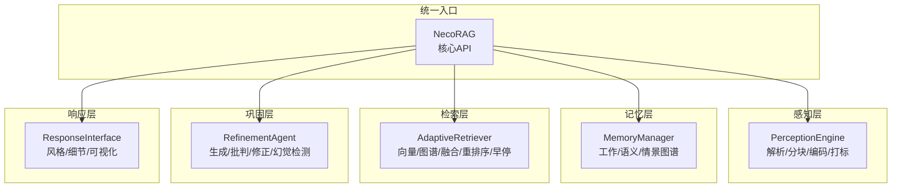
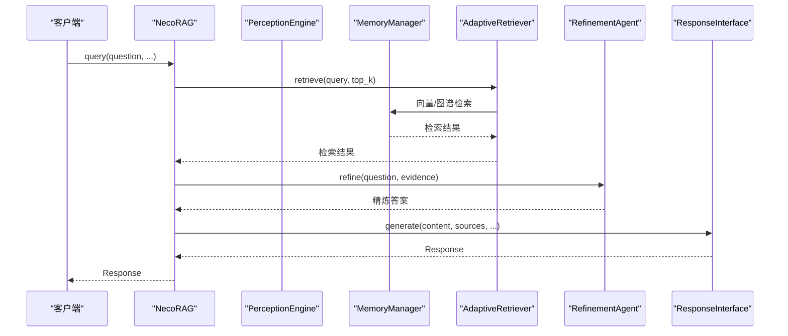
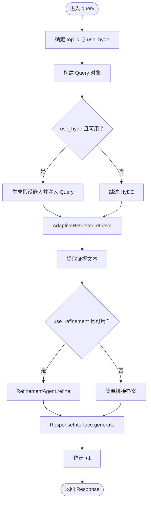
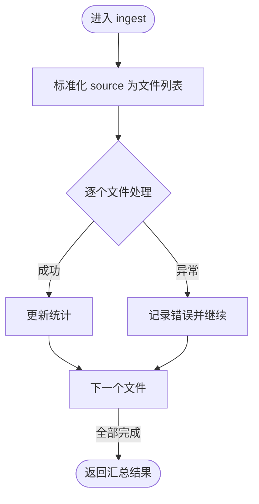
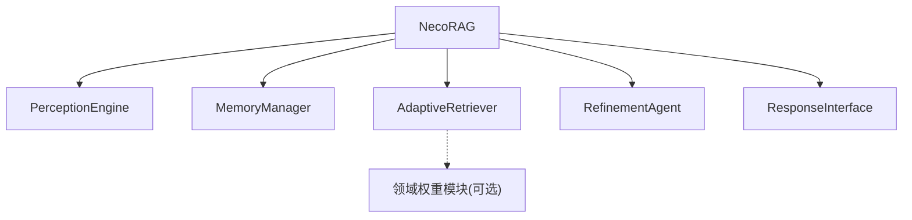

# 核心API

<cite>
**本文引用的文件**
- [src/necorag.py](file://src/necorag.py)
- [src/core/config.py](file://src/core/config.py)
- [src/core/exceptions.py](file://src/core/exceptions.py)
- [src/perception/engine.py](file://src/perception/engine.py)
- [src/memory/manager.py](file://src/memory/manager.py)
- [src/retrieval/retriever.py](file://src/retrieval/retriever.py)
- [src/refinement/agent.py](file://src/refinement/agent.py)
- [src/response/interface.py](file://src/response/interface.py)
- [src/core/protocols.py](file://src/core/protocols.py)
- [src/core/base.py](file://src/core/base.py)
- [src/__init__.py](file://src/__init__.py)
- [example/example_usage.py](file://example/example_usage.py)
</cite>

## 目录
1. [简介](#简介)
2. [项目结构](#项目结构)
3. [核心组件](#核心组件)
4. [架构总览](#架构总览)
5. [详细组件分析](#详细组件分析)
6. [依赖分析](#依赖分析)
7. [性能考虑](#性能考虑)
8. [故障排查指南](#故障排查指南)
9. [结论](#结论)
10. [附录](#附录)

## 简介
本文件为 NecoRAG 核心 API 的权威参考文档，聚焦主类 NecoRAG 的公共方法与配置对象，涵盖：
- 初始化参数与便捷工厂函数
- 文档导入方法：ingest、ingest_file、ingest_text
- 查询方法：query、search
- 统计与管理：get_stats、clear、上下文管理与类方法
- 配置对象结构与参数设置
- 常见使用场景与最佳实践

## 项目结构
NecoRAG 采用“认知层级化”的模块化设计，核心由感知、记忆、检索、巩固、响应五大层组成，并通过统一入口类 NecoRAG 提供简洁易用的 API。

图表来源
- [src/necorag.py:28-102](file://src/necorag.py#L28-L102)
- [src/perception/engine.py:14-41](file://src/perception/engine.py#L14-L41)
- [src/memory/manager.py:16-47](file://src/memory/manager.py#L16-L47)
- [src/retrieval/retriever.py:122-164](file://src/retrieval/retriever.py#L122-L164)
- [src/refinement/agent.py:16-60](file://src/refinement/agent.py#L16-L60)

章节来源
- [src/necorag.py:28-102](file://src/necorag.py#L28-L102)
- [src/perception/engine.py:14-41](file://src/perception/engine.py#L14-L41)
- [src/memory/manager.py:16-47](file://src/memory/manager.py#L16-L47)
- [src/retrieval/retriever.py:122-164](file://src/retrieval/retriever.py#L122-L164)
- [src/refinement/agent.py:16-60](file://src/refinement/agent.py#L16-L60)

## 核心组件
- NecoRAG：统一入口类，封装文档导入、查询检索、统计与生命周期管理。
- 配置对象：NecoRAGConfig 及其子配置（LLMConfig、PerceptionConfig、MemoryConfig、RetrievalConfig、RefinementConfig、ResponseConfig、DomainWeightConfig），支持从文件与环境变量加载。
- 异常体系：NecoRAGError 及其子类，覆盖感知、记忆、检索、LLM、配置等模块的错误类型。
- 协议与抽象：定义数据协议（Document、Chunk、Embedding、Query、Response、RetrievalResult 等）与各层抽象基类，确保实现一致性与可替换性。

章节来源
- [src/necorag.py:28-102](file://src/necorag.py#L28-L102)
- [src/core/config.py:232-284](file://src/core/config.py#L232-L284)
- [src/core/exceptions.py:10-42](file://src/core/exceptions.py#L10-L42)
- [src/core/protocols.py](file://src/core/protocols.py)
- [src/core/base.py:19-571](file://src/core/base.py#L19-L571)

## 架构总览
NecoRAG 的核心调用链如下：客户端通过 NecoRAG 发起查询，感知层对输入进行解析与编码，记忆层存储与检索，检索层执行融合与重排序并支持早停，巩固层进行答案生成与验证，响应层输出适配后的结果。

图表来源
- [src/necorag.py:242-311](file://src/necorag.py#L242-L311)
- [src/retrieval/retriever.py:177-253](file://src/retrieval/retriever.py#L177-L253)
- [src/refinement/agent.py:61-128](file://src/refinement/agent.py#L61-L128)
- [src/response/interface.py](file://src/response/interface.py)

## 详细组件分析

### NecoRAG 主类 API 参考

- 初始化与便捷工厂
  - 构造函数
    - 参数
      - config: NecoRAGConfig，可选；未提供时使用开发环境预设
      - llm_client: BaseLLMClient，可选；未提供时根据配置自动创建 Mock 客户端
    - 返回：无（初始化内部组件）
    - 异常：无显式抛出；内部日志记录初始化状态
    - 使用示例路径：[示例：快速开始:37-49](file://example/example_usage.py#L37-L49)
  - 类方法
    - from_config_file(config_path): 从配置文件创建实例
    - quick_start(): 使用最小配置快速启动
  - 便捷函数
    - create_rag(llm_provider="mock", **kwargs): 快速创建实例，支持通过关键字参数覆盖配置

- 文档导入
  - ingest(source, recursive=True, file_types=None)
    - 参数
      - source: 支持 str/Path/路径列表；目录时按递归与类型过滤收集文件
      - recursive: 是否递归
      - file_types: 文件类型过滤列表（如 ['.txt', '.md']）
    - 返回：字典，包含 total_files、processed、failed、chunks_created、errors
    - 异常：对单文件处理失败记录错误但不中断整体流程
    - 统计：更新文档导入数与总分块数
    - 使用示例路径：[示例：完整工作流程:218-247](file://example/example_usage.py#L218-L247)
  - ingest_file(file_path)
    - 参数：file_path: str/Path
    - 返回：int，创建的分块数量
    - 异常：文件不存在时抛出 FileNotFoundError
    - 行为：感知层处理 -> 记忆层存储
  - ingest_text(text, metadata=None)
    - 参数：text: str；metadata: 可选字典
    - 返回：int，创建的分块数量
    - 行为：感知层处理 -> 记忆层存储

- 查询与检索
  - query(question, user_id=None, top_k=None, use_hyde=None, use_refinement=True)
    - 参数
      - question: str
      - user_id: 可选
      - top_k: 可选，默认取配置
      - use_hyde: 可选，未指定则取配置开关
      - use_refinement: 是否启用精炼
    - 返回：Response 对象（包含 content、confidence、sources、metadata）
    - 行为：可选 HyDE 增强 -> 检索 -> 提取证据 -> 精炼或简单拼接 -> 响应适配
    - 统计：查询次数+1
  - search(query, top_k=10)
    - 参数：query: str；top_k: int
    - 返回：List[RetrievalResult]
    - 行为：仅检索，不生成答案

- 统计与管理
  - get_stats()
    - 返回：字典，包含 documents_ingested、queries_processed、total_chunks、memory_count、config（提供 LLM 提供商与模型名）
  - clear()
    - 行为：重建记忆管理器与检索器，清空统计
  - 生命周期
    - __enter__/__exit__：上下文管理
    - close()：日志记录关闭

- 方法参数与返回类型摘要
  - ingest: 输入 Union[str, Path, List[str]]，输出 Dict[str, Any]
  - ingest_file: 输入 Union[str, Path]，输出 int
  - ingest_text: 输入 str + 可选 Dict，输出 int
  - query: 输入 str + 可选 user_id/top_k/use_hyde/use_refinement，输出 Response
  - search: 输入 str + int，输出 List[RetrievalResult]
  - get_stats: 无参，输出 Dict[str, Any]
  - clear: 无参，无返回
  - 上下文管理：__enter__ 返回 self，__exit__ 调用 close()

- 异常处理
  - ingest 对单文件失败记录错误并继续处理
  - ingest_file 在文件不存在时抛出 FileNotFoundError
  - 其余方法内部捕获异常并记录日志，避免中断主流程

- 使用示例路径
  - [示例：完整工作流程:218-247](file://example/example_usage.py#L218-L247)
  - [示例：Perception Engine:12-47](file://example/example_usage.py#L12-L47)
  - [示例：Memory Manager:50-91](file://example/example_usage.py#L50-L91)
  - [示例：Adaptive Retriever:94-136](file://example/example_usage.py#L94-L136)
  - [示例：Refinement Agent:139-173](file://example/example_usage.py#L139-L173)
  - [示例：Response Interface:176-215](file://example/example_usage.py#L176-L215)

章节来源
- [src/necorag.py:52-412](file://src/necorag.py#L52-L412)
- [src/necorag.py:414-437](file://src/necorag.py#L414-L437)
- [example/example_usage.py:12-247](file://example/example_usage.py#L12-L247)

### 配置对象结构与参数设置

- NecoRAGConfig（全局配置）
  - 字段概览（节选）
    - project_name: str
    - version: str
    - debug: bool
    - llm: LLMConfig
    - perception: PerceptionConfig
    - memory: MemoryConfig
    - retrieval: RetrievalConfig
    - refinement: RefinementConfig
    - response: ResponseConfig
    - domain_weight: DomainWeightConfig
    - data_dir/config_dir/log_dir: str
  - 加载方式
    - from_dict：递归处理枚举与子配置
    - load_config：支持从文件与环境变量覆盖关键配置
  - 环境变量映射（示例）
    - NECORAG_DEBUG、NECORAG_LLM_PROVIDER、NECORAG_LLM_MODEL、NECORAG_LLM_API_KEY、NECORAG_VECTOR_DB、NECORAG_VECTOR_DB_URL、NECORAG_GRAPH_DB、NECORAG_GRAPH_DB_URL

- 子配置要点
  - LLMConfig：provider、model_name、api_key、temperature、max_tokens、embedding_model、embedding_dimension 等
  - PerceptionConfig：chunk_size、chunk_overlap、chunk_strategy、enable_time_tag、enable_emotion_tag、enable_importance_tag、enable_topic_tag、supported_formats
  - MemoryConfig：working_memory_ttl、working_memory_max_items、vector_db_provider、vector_db_url、vector_collection_name、graph_db_provider、graph_db_url、max_relation_depth、decay_rate、decay_threshold
  - RetrievalConfig：default_top_k、vector_weight、graph_weight、enable_early_termination、confidence_threshold、min_results、enable_hyde、hyde_temperature、enable_rerank、rerank_top_k、novelty_penalty
  - RefinementConfig：max_iterations、confidence_threshold、factual_threshold、logical_threshold、evidence_threshold、enable_consolidation、consolidation_interval、enable_pruning、pruning_threshold
  - ResponseConfig：default_tone、default_detail_level、enable_thinking_chain、show_retrieval_path、show_evidence_sources、output_format
  - DomainWeightConfig：keyword_factor、temporal_factor、domain_factor、decay_rate、evergreen_enabled

- 预设配置
  - development()：调试模式，内存型存储
  - production()：生产模式，提升迭代与重排序
  - minimal()：最小配置，禁用部分高级特性

- 使用建议
  - 开发阶段：使用 development() 或默认配置
  - 生产阶段：使用 production() 并结合环境变量覆盖敏感参数
  - 快速启动：使用 quick_start() 或 create_rag() 快速获得可用实例

章节来源
- [src/core/config.py:232-370](file://src/core/config.py#L232-L370)
- [src/core/config.py:288-327](file://src/core/config.py#L288-L327)
- [src/core/config.py:340-370](file://src/core/config.py#L340-L370)
- [src/__init__.py:10-11](file://src/__init__.py#L10-L11)

### 数据协议与抽象基类

- 数据协议（节选）
  - Document、Chunk、EncodedChunk、Embedding、Memory、Entity、Relation、Query、RetrievalResult、GeneratedAnswer、CritiqueResult、HallucinationReport、Response、UserProfile
- 抽象基类（节选）
  - 感知层：BaseParser、BaseChunker、BaseEncoder、BaseTagger
  - 记忆层：BaseMemoryStore、BaseVectorStore、BaseGraphStore
  - 检索层：BaseRetriever、BaseReranker
  - 巩固层：BaseGenerator、BaseCritic、BaseRefiner、BaseHallucinationDetector
  - LLM：BaseLLMClient、BaseAsyncLLMClient
  - 响应层：BaseResponseAdapter

- 设计意义
  - 通过抽象基类确保各模块可替换性与一致性
  - 通过协议定义跨模块的数据契约，便于扩展与集成

章节来源
- [src/core/protocols.py](file://src/core/protocols.py)
- [src/core/base.py:19-571](file://src/core/base.py#L19-L571)

### 组件内部流程图

#### query 方法调用流程

图表来源
- [src/necorag.py:242-311](file://src/necorag.py#L242-L311)
- [src/retrieval/retriever.py:177-253](file://src/retrieval/retriever.py#L177-L253)
- [src/refinement/agent.py:61-128](file://src/refinement/agent.py#L61-L128)
- [src/response/interface.py](file://src/response/interface.py)

#### ingest 流程

图表来源
- [src/necorag.py:119-166](file://src/necorag.py#L119-L166)

## 依赖分析
- 组件耦合
  - NecoRAG 作为编排者，依赖感知、记忆、检索、巩固、响应各层组件
  - 检索层与领域权重模块存在可选依赖（DOMAIN_WEIGHT_AVAILABLE）
- 外部依赖
  - LLM 提供商：Mock（默认）、OpenAI、Ollama、vLLM、Azure、Anthropic（需扩展实现）
  - 向量/图数据库：Memory（默认）、Qdrant、Milvus、Chroma、Neo4j、Nebula（需扩展实现）

图表来源
- [src/necorag.py:18-22](file://src/necorag.py#L18-L22)
- [src/retrieval/retriever.py:17-27](file://src/retrieval/retriever.py#L17-L27)

章节来源
- [src/necorag.py:18-22](file://src/necorag.py#L18-L22)
- [src/retrieval/retriever.py:17-27](file://src/retrieval/retriever.py#L17-L27)

## 性能考虑
- 早停机制：AdaptiveRetriever 的 EarlyTerminationController 基于置信度与边际收益动态决定是否提前终止，减少不必要的重排序与融合计算。
- 重排序与融合：在候选集上先融合再重排序，控制 rerank_top_k 以平衡质量与速度。
- HyDE 增强：在 query 向量化不足时可生成假设文档辅助检索，但需权衡额外开销。
- 记忆衰减：MemoryManager 的 MemoryDecay 会定期归档低权重记忆，保持检索效率。
- 批量处理：感知层支持批量编码，建议在导入阶段尽量合并小文件以提升吞吐。

## 故障排查指南
- 常见异常类型
  - NecoRAGError：基础异常
  - ParseError、ChunkingError、EncodingError：感知层错误
  - VectorStoreError、GraphStoreError：记忆层错误
  - RetrievalError、RerankError：检索层错误
  - GenerationError、HallucinationError、RefinementError：巩固层错误
  - LLMError、LLMConnectionError、LLMRateLimitError、LLMResponseError：LLM 相关错误
  - ConfigurationError、ValidationError：配置与校验错误
- 排查建议
  - 检查配置文件与环境变量是否正确加载
  - 确认 LLM 提供商与 API Key 设置
  - 关注检索层早停阈值与重排序参数
  - 使用 get_stats 查看导入与查询统计，定位瓶颈
  - 对单文件导入失败，查看 ingest 返回的 errors 列表

章节来源
- [src/core/exceptions.py:10-296](file://src/core/exceptions.py#L10-L296)
- [src/necorag.py:119-166](file://src/necorag.py#L119-L166)

## 结论
NecoRAG 通过统一入口类 NecoRAG 提供了简洁而强大的 API，覆盖文档导入、智能检索、答案精炼与响应适配的完整链路。配合完善的配置体系与异常处理，既满足快速开发需求，又具备生产级的可维护性与扩展性。建议在生产环境中结合环境变量与预设配置，合理设置检索与精炼参数，并利用统计接口持续优化性能。

## 附录

### 常见使用场景与最佳实践
- 快速开始
  - 使用 create_rag 或 quick_start 快速获得可用实例
  - 使用 ingest 导入文档目录，再调用 query 获取答案
- 生产部署
  - 使用 production 预设配置，结合环境变量覆盖敏感参数
  - 合理设置 top_k、enable_rerank、enable_hyde、max_iterations 等参数
- 调试与监控
  - 开启 debug 并使用 get_stats 观察导入与查询统计
  - 对失败文件记录进行复盘，优化感知层参数（如分块大小与重叠）

章节来源
- [src/necorag.py:390-412](file://src/necorag.py#L390-L412)
- [src/core/config.py:340-370](file://src/core/config.py#L340-L370)
- [example/example_usage.py:218-247](file://example/example_usage.py#L218-L247)