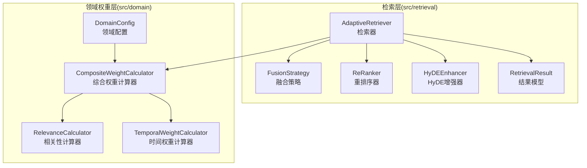
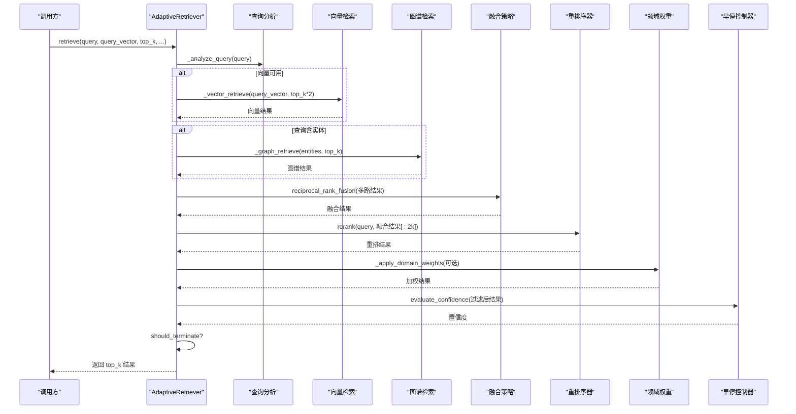
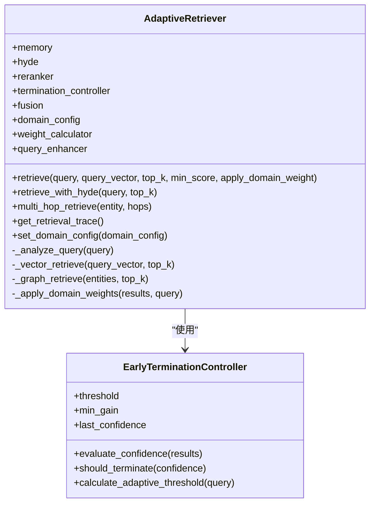
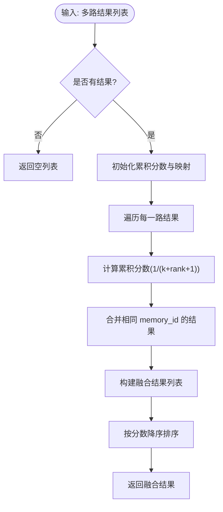
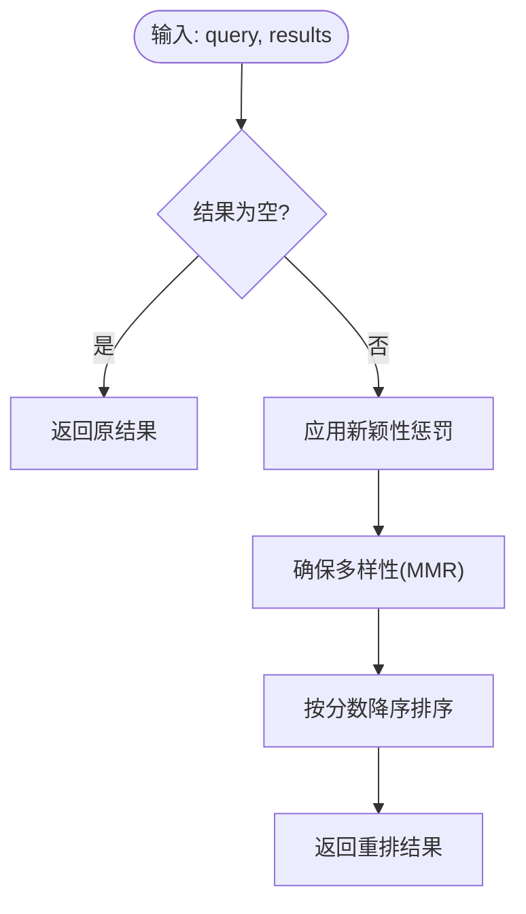
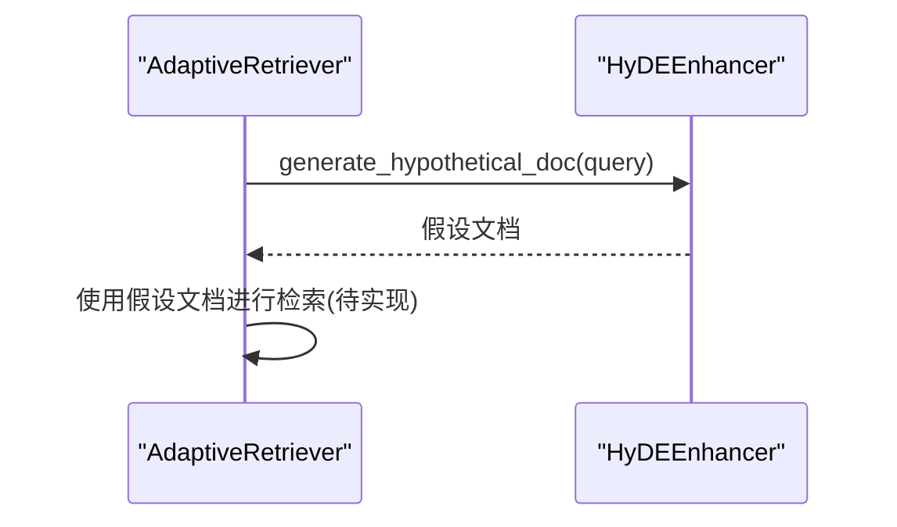
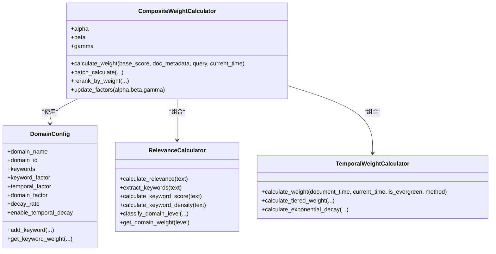
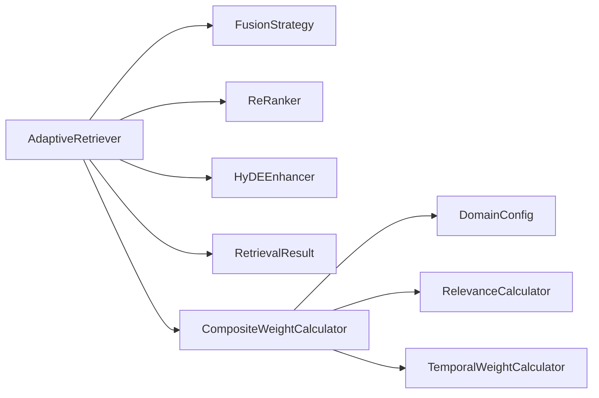

# 检索API

<cite>
**本文档引用的文件**
- [retriever.py](file://src/retrieval/retriever.py)
- [models.py](file://src/retrieval/models.py)
- [fusion.py](file://src/retrieval/fusion.py)
- [reranker.py](file://src/retrieval/reranker.py)
- [hyde.py](file://src/retrieval/hyde.py)
- [config.py](file://src/domain/config.py)
- [weight_calculator.py](file://src/domain/weight_calculator.py)
- [relevance.py](file://src/domain/relevance.py)
- [temporal_weight.py](file://src/domain/temporal_weight.py)
- [example_usage.py](file://example/example_usage.py)
- [README.md](file://README.md)
- [requirements.txt](file://requirements.txt)
</cite>

## 目录
1. [简介](#简介)
2. [项目结构](#项目结构)
3. [核心组件](#核心组件)
4. [架构总览](#架构总览)
5. [详细组件分析](#详细组件分析)
6. [依赖关系分析](#依赖关系分析)
7. [性能考量](#性能考量)
8. [故障排查指南](#故障排查指南)
9. [结论](#结论)
10. [附录](#附录)

## 简介
本文件为检索API的完整参考文档，聚焦于 AdaptiveRetriever 类的接口与实现，覆盖基础检索、多路检索、HyDE 增强、结果重排、融合算法、领域权重与早停机制等核心能力。文档同时提供配置参数说明、调用方式、使用示例、性能对比与数据结构说明，并给出优化策略与故障排查建议。

## 项目结构
检索相关模块位于 src/retrieval 与 src/domain 下，分别负责检索执行、融合策略、重排序、HyDE 增强以及领域权重与相关性计算。示例位于 example 目录，README 提供高层概览与使用指引。

图表来源
- [retriever.py:122-440](file://src/retrieval/retriever.py#L122-L440)
- [fusion.py:9-128](file://src/retrieval/fusion.py#L9-L128)
- [reranker.py:10-179](file://src/retrieval/reranker.py#L10-L179)
- [hyde.py:17-213](file://src/retrieval/hyde.py#L17-L213)
- [models.py:9-29](file://src/retrieval/models.py#L9-L29)
- [config.py:54-161](file://src/domain/config.py#L54-L161)
- [weight_calculator.py:56-318](file://src/domain/weight_calculator.py#L56-L318)
- [relevance.py:29-328](file://src/domain/relevance.py#L29-L328)
- [temporal_weight.py:47-271](file://src/domain/temporal_weight.py#L47-L271)

章节来源
- [README.md:247-286](file://README.md#L247-L286)

## 核心组件
- AdaptiveRetriever：自适应检索器，集成多路检索、融合、重排、HyDE 增强、领域权重与早停机制。
- FusionStrategy：结果融合策略，支持 RRF 与加权融合。
- ReRanker：重排序器，基于新颖性惩罚与多样性保障。
- HyDEEnhancer：HyDE 增强器，生成假设文档以提升检索质量。
- DomainConfig/CompositeWeightCalculator/RelevanceCalculator/TemporalWeightCalculator：领域权重与相关性计算体系。
- RetrievalResult/QueryAnalysis：检索结果与查询分析数据模型。

章节来源
- [retriever.py:122-440](file://src/retrieval/retriever.py#L122-L440)
- [models.py:9-29](file://src/retrieval/models.py#L9-L29)
- [fusion.py:9-128](file://src/retrieval/fusion.py#L9-L128)
- [reranker.py:10-179](file://src/retrieval/reranker.py#L10-L179)
- [hyde.py:17-213](file://src/retrieval/hyde.py#L17-L213)
- [config.py:54-161](file://src/domain/config.py#L54-L161)
- [weight_calculator.py:56-318](file://src/domain/weight_calculator.py#L56-L318)
- [relevance.py:29-328](file://src/domain/relevance.py#L29-L328)
- [temporal_weight.py:47-271](file://src/domain/temporal_weight.py#L47-L271)

## 架构总览
AdaptiveRetriever 将“查询理解”“多路检索”“结果融合”“重排序”“领域权重”“HyDE 增强”“早停机制”串联为一条完整的检索流水线，支持灵活配置与扩展。

图表来源
- [retriever.py:177-254](file://src/retrieval/retriever.py#L177-L254)
- [fusion.py:18-71](file://src/retrieval/fusion.py#L18-L71)
- [reranker.py:41-71](file://src/retrieval/reranker.py#L41-L71)
- [weight_calculator.py:81-147](file://src/domain/weight_calculator.py#L81-L147)

## 详细组件分析

### AdaptiveRetriever 类
- 角色：自适应检索器，统一调度检索、融合、重排、领域权重与 HyDE 增强。
- 关键接口
  - retrieve：主检索入口，支持向量检索、图谱检索、融合、重排、领域权重、过滤与早停。
  - retrieve_with_hyde：HyDE 增强检索（生成假设文档后检索）。
  - multi_hop_retrieve：基于图谱的多跳检索。
  - get_retrieval_trace：获取检索路径追踪日志。
  - set_domain_config：动态设置领域配置。
- 早停机制：EarlyTerminationController 基于置信度阈值与边际收益递减策略决定是否提前终止。
- 领域权重：CompositeWeightCalculator 联合关键字相关性、时间权重与领域权重，对基础分数进行加权。

图表来源
- [retriever.py:30-120](file://src/retrieval/retriever.py#L30-L120)
- [retriever.py:122-440](file://src/retrieval/retriever.py#L122-L440)

章节来源
- [retriever.py:122-440](file://src/retrieval/retriever.py#L122-L440)

### FusionStrategy 融合策略
- 支持两种融合方法
  - reciprocal_rank_fusion：基于倒数排名的融合，适合跨来源结果合并。
  - weighted_fusion：按权重对各来源结果打分求和，需提供权重归一化。
- 参数
  - k：RRF 融合的参数，默认 60。
  - weights：加权融合的权重列表，长度需与结果列表一致。

图表来源
- [fusion.py:18-71](file://src/retrieval/fusion.py#L18-L71)

章节来源
- [fusion.py:9-128](file://src/retrieval/fusion.py#L9-L128)

### ReRanker 重排序器
- 功能
  - novelty 惩罚：抑制重复内容，降低冗余。
  - 多样性保障：基于 MMR-like 策略选择多样化结果。
- 参数
  - model：重排序模型（预留）。
  - novelty_weight：新颖性权重。
  - diversity_weight：多样性权重。
  - redundancy_penalty：冗余惩罚强度。

图表来源
- [reranker.py:41-71](file://src/retrieval/reranker.py#L41-L71)

章节来源
- [reranker.py:10-179](file://src/retrieval/reranker.py#L10-L179)

### HyDEEnhancer 增强器
- 功能
  - 生成假设文档，提升模糊查询的检索效果。
  - 支持多假设生成与向量表示（若提供 LLM 客户端）。
  - 查询增强：返回包含原始查询与假设文档的查询列表。
- 参数
  - llm_client：LLM 客户端（可选）。
  - temperature：生成温度。
  - num_hypotheses：生成假设数量。

图表来源
- [hyde.py:58-84](file://src/retrieval/hyde.py#L58-L84)
- [retriever.py:307-332](file://src/retrieval/retriever.py#L307-L332)

章节来源
- [hyde.py:17-213](file://src/retrieval/hyde.py#L17-L213)
- [retriever.py:307-332](file://src/retrieval/retriever.py#L307-L332)

### 领域权重与相关性计算
- DomainConfig：定义领域名称、关键字词典、权重因子与时间衰减配置。
- CompositeWeightCalculator：综合计算关键字权重、时间权重与领域权重，得到最终加权分数。
- RelevanceCalculator：从文本中提取关键字、计算关键字得分与密度、判定领域等级并给出权重乘数。
- TemporalWeightCalculator：基于指数衰减或分层权重计算时间权重，支持常青内容。

图表来源
- [config.py:54-161](file://src/domain/config.py#L54-L161)
- [weight_calculator.py:56-318](file://src/domain/weight_calculator.py#L56-L318)
- [relevance.py:29-328](file://src/domain/relevance.py#L29-L328)
- [temporal_weight.py:47-271](file://src/domain/temporal_weight.py#L47-L271)

章节来源
- [config.py:54-161](file://src/domain/config.py#L54-L161)
- [weight_calculator.py:56-318](file://src/domain/weight_calculator.py#L56-L318)
- [relevance.py:29-328](file://src/domain/relevance.py#L29-L328)
- [temporal_weight.py:47-271](file://src/domain/temporal_weight.py#L47-L271)

### 数据模型
- RetrievalResult：检索结果数据结构，包含 memory_id、content、score、source、metadata、retrieval_path。
- QueryAnalysis：查询分析结果，包含 original_query、rewritten_query、query_type、entities、intent、complexity。

章节来源
- [models.py:9-29](file://src/retrieval/models.py#L9-L29)

## 依赖关系分析
- 检索层内部依赖：AdaptiveRetriever 依赖 FusionStrategy、ReRanker、HyDEEnhancer、RetrievalResult；可选依赖领域权重模块。
- 领域权重层依赖：DomainConfig 作为配置源，CompositeWeightCalculator 组合 RelevanceCalculator 与 TemporalWeightCalculator。
- 外部依赖：向量数据库、图数据库、缓存、嵌入模型、LLM 客户端等（可选），在 requirements.txt 中列出。

图表来源
- [retriever.py:122-440](file://src/retrieval/retriever.py#L122-L440)
- [weight_calculator.py:56-318](file://src/domain/weight_calculator.py#L56-L318)
- [config.py:54-161](file://src/domain/config.py#L54-L161)

章节来源
- [requirements.txt:1-66](file://requirements.txt#L1-L66)

## 性能考量
- 早停机制：在置信度达到阈值或边际收益低于设定值时提前终止，显著减少后续处理开销。
- 融合策略：RRF 适合跨来源合并，加权融合需谨慎设置权重，避免偏置。
- 重排序：新颖性惩罚与多样性保障有助于提升结果质量，但可能增加计算成本。
- 领域权重：关键字与时间权重的组合可提升相关性，注意权重因子的平衡。
- HyDE：生成假设文档可提升检索质量，但需要 LLM 客户端支持，成本较高。

[本节为通用性能讨论，无需特定文件来源]

## 故障排查指南
- 检索结果为空
  - 检查 query_vector 是否正确传入；确认向量检索路径是否可达。
  - 检查图谱检索是否启用且 entities 是否有效。
- 结果质量不佳
  - 调整 novelty_weight、diversity_weight、redundancy_penalty。
  - 启用领域权重并调整 DomainConfig 的权重因子。
- HyDE 未生效
  - 确认 HyDEEnhancer 已启用且 LLM 客户端可用。
- 早停过早导致遗漏
  - 适当提高 confidence_threshold 或降低 min_gain。
- 性能瓶颈
  - 评估融合与重排的成本，必要时减少 top_k 或关闭 HyDE。

章节来源
- [retriever.py:177-254](file://src/retrieval/retriever.py#L177-L254)
- [reranker.py:20-40](file://src/retrieval/reranker.py#L20-L40)
- [weight_calculator.py:207-223](file://src/domain/weight_calculator.py#L207-L223)
- [hyde.py:24-50](file://src/retrieval/hyde.py#L24-L50)

## 结论
AdaptiveRetriever 提供了从查询理解到结果重排的完整检索管线，结合融合、重排、HyDE 增强与领域权重，能够有效提升检索质量与效率。通过早停机制与可配置参数，可在不同场景下取得良好的性能与准确性平衡。建议根据业务场景调整领域权重因子、重排参数与早停阈值，并在需要时启用 HyDE 以改善模糊查询的检索效果。

[本节为总结性内容，无需特定文件来源]

## 附录

### API 使用示例与性能对比
- 基础检索示例
  - 参考示例脚本中的 AdaptiveRetriever 使用方式，包含 retrieve、retrieve_with_hyde、multi_hop_retrieve 与检索路径追踪。
- 性能对比
  - README 提供了 Recall@K、幻觉率、简单/复杂查询延迟与上下文压缩率等目标指标，可用于评估不同配置下的效果。

章节来源
- [example_usage.py:94-137](file://example/example_usage.py#L94-L137)
- [README.md:465-474](file://README.md#L465-L474)

### 配置参数与调用方式
- AdaptiveRetriever
  - memory：MemoryManager 实例。
  - reranker_model：重排序模型名称（预留）。
  - confidence_threshold：早停阈值。
  - enable_hyde：是否启用 HyDE。
  - domain_config：DomainConfig 实例（可选）。
- FusionStrategy
  - reciprocal_rank_fusion：k 默认 60。
  - weighted_fusion：weights 需与结果列表长度一致。
- ReRanker
  - novelty_weight、diversity_weight、redundancy_penalty。
- HyDEEnhancer
  - llm_client、temperature、num_hypotheses。
- DomainConfig
  - keyword_factor、temporal_factor、domain_factor、decay_rate、enable_temporal_decay、领域权重映射。
- CompositeWeightCalculator
  - update_factors：动态调整权重因子。

章节来源
- [retriever.py:129-161](file://src/retrieval/retriever.py#L129-L161)
- [fusion.py:18-93](file://src/retrieval/fusion.py#L18-L93)
- [reranker.py:20-40](file://src/retrieval/reranker.py#L20-L40)
- [hyde.py:24-50](file://src/retrieval/hyde.py#L24-L50)
- [config.py:62-76](file://src/domain/config.py#L62-L76)
- [weight_calculator.py:207-223](file://src/domain/weight_calculator.py#L207-L223)

### 检索结果数据结构与字段说明
- RetrievalResult
  - memory_id：记忆 ID。
  - content：内容文本。
  - score：分数（基础相似度或加权后分数）。
  - source：来源类型（vector/graph/hyde/fusion）。
  - metadata：附加元数据（可包含领域权重详情）。
  - retrieval_path：检索路径（用于可视化）。
- QueryAnalysis
  - original_query：原始查询。
  - rewritten_query：改写后的查询（可选）。
  - query_type：查询类型（factual/reasoning/comparative）。
  - entities：识别到的实体列表。
  - intent：意图（可选）。
  - complexity：复杂度（simple/medium/complex）。

章节来源
- [models.py:9-29](file://src/retrieval/models.py#L9-L29)

### 早停机制与优化策略
- EarlyTerminationController
  - evaluate_confidence：基于 top-1 与分数分布评估置信度。
  - should_terminate：阈值与边际收益双重判断。
  - calculate_adaptive_threshold：基于查询长度动态调整阈值。
- 优化建议
  - 根据查询复杂度调整阈值与最小边际收益。
  - 在高质量初筛后启用 HyDE 与领域权重，进一步提升质量。
  - 控制 top_k 与融合/重排成本，避免过度计算。

章节来源
- [retriever.py:30-120](file://src/retrieval/retriever.py#L30-L120)