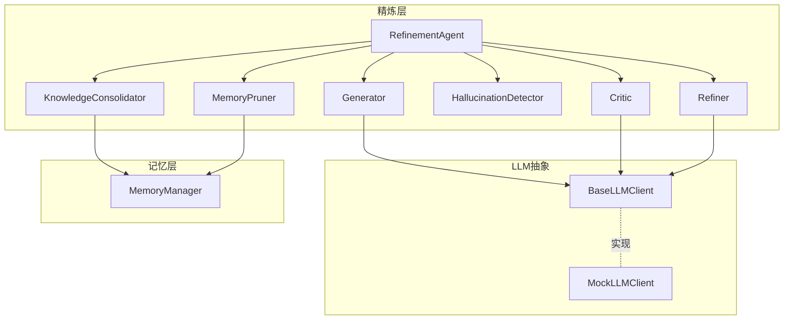
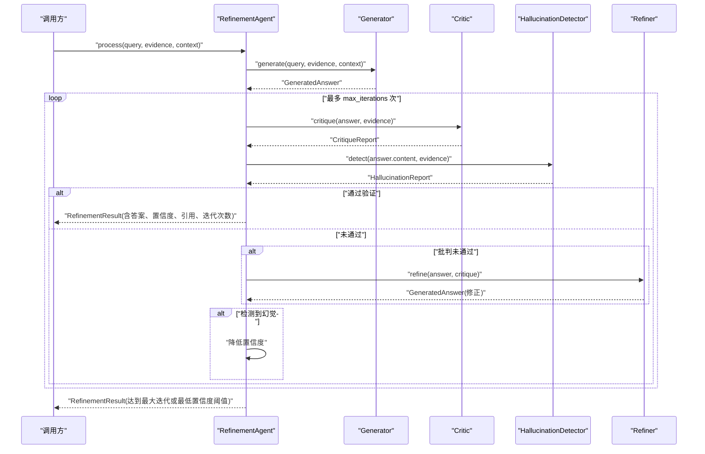
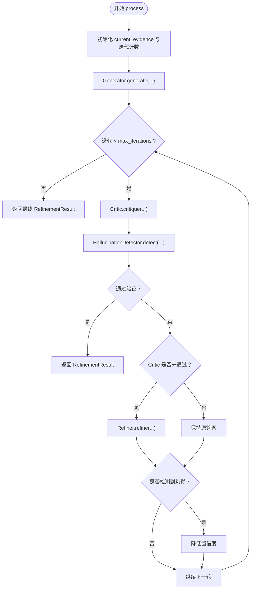
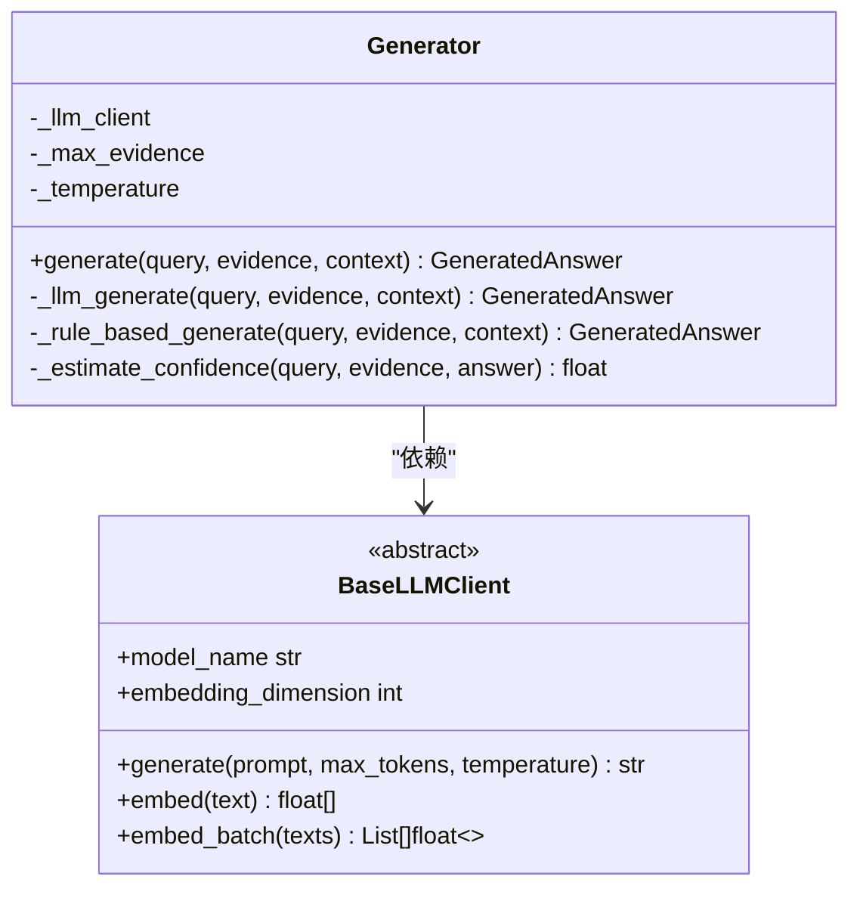
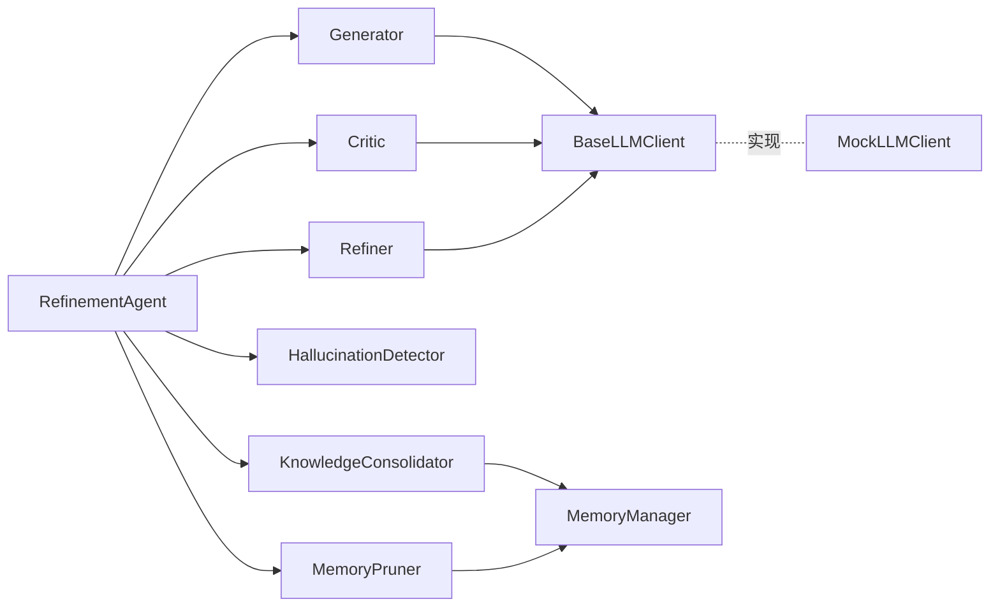

# 精炼代理API

<cite>
**本文引用的文件**
- [src/refinement/agent.py](file://src/refinement/agent.py)
- [src/refinement/generator.py](file://src/refinement/generator.py)
- [src/refinement/critic.py](file://src/refinement/critic.py)
- [src/refinement/refiner.py](file://src/refinement/refiner.py)
- [src/refinement/hallucination.py](file://src/refinement/hallucination.py)
- [src/refinement/consolidator.py](file://src/refinement/consolidator.py)
- [src/refinement/pruner.py](file://src/refinement/pruner.py)
- [src/refinement/models.py](file://src/refinement/models.py)
- [src/core/llm/base.py](file://src/core/llm/base.py)
- [src/core/llm/mock.py](file://src/core/llm/mock.py)
- [src/memory/manager.py](file://src/memory/manager.py)
- [src/refinement/__init__.py](file://src/refinement/__init__.py)
- [example/example_usage.py](file://example/example_usage.py)
- [src/core/config.py](file://src/core/config.py)
</cite>

## 目录
1. [简介](#简介)
2. [项目结构](#项目结构)
3. [核心组件](#核心组件)
4. [架构总览](#架构总览)
5. [详细组件分析](#详细组件分析)
6. [依赖分析](#依赖分析)
7. [性能考虑](#性能考虑)
8. [故障排查指南](#故障排查指南)
9. [结论](#结论)
10. [附录](#附录)

## 简介
本文件为精炼代理API的权威参考文档，聚焦RefinementAgent类的接口与内部流程，涵盖答案生成、批判评估、答案修正、幻觉检测、知识固化与记忆修剪等能力。文档同时提供不同精炼策略的配置方法、LLM客户端集成方式与性能优化建议，并给出精炼质量评估指标与完整工作流程示例。

## 项目结构
围绕“巩固层”的精炼代理相关模块组织如下：
- 精炼代理主类：RefinementAgent
- 子组件：Generator（答案生成）、Critic（批判评估）、Refiner（答案修正）、HallucinationDetector（幻觉检测）
- 记忆与知识管理：KnowledgeConsolidator（知识固化）、MemoryPruner（记忆修剪）
- 数据模型：RefinementResult、GeneratedAnswer、CritiqueReport、HallucinationReport等
- LLM抽象与Mock实现：BaseLLMClient、MockLLMClient
- 记忆管理器：MemoryManager（用于知识固化与修剪）

图表来源
- [src/refinement/agent.py:16-151](file://src/refinement/agent.py#L16-L151)
- [src/refinement/generator.py:15-208](file://src/refinement/generator.py#L15-L208)
- [src/refinement/critic.py:9-72](file://src/refinement/critic.py#L9-L72)
- [src/refinement/refiner.py:8-64](file://src/refinement/refiner.py#L8-L64)
- [src/refinement/hallucination.py:9-154](file://src/refinement/hallucination.py#L9-L154)
- [src/refinement/consolidator.py:9-142](file://src/refinement/consolidator.py#L9-L142)
- [src/refinement/pruner.py:10-157](file://src/refinement/pruner.py#L10-L157)
- [src/core/llm/base.py:11-178](file://src/core/llm/base.py#L11-L178)
- [src/core/llm/mock.py:16-313](file://src/core/llm/mock.py#L16-L313)
- [src/memory/manager.py:16-186](file://src/memory/manager.py#L16-L186)

章节来源
- [src/refinement/agent.py:16-151](file://src/refinement/agent.py#L16-L151)
- [src/refinement/__init__.py:6-25](file://src/refinement/__init__.py#L6-L25)

## 核心组件
- RefinementAgent：精炼代理主类，负责执行“生成-批判-修正-验证-幻觉检测”的闭环，并在具备MemoryManager时异步运行知识固化与记忆修剪。
- Generator：基于证据生成答案，支持LLM客户端依赖注入与规则回退；内置置信度估算。
- Critic：对答案进行质量评估，产出是否有效、问题列表、建议与质量分数。
- Refiner：根据批判报告修正答案，调整置信度与引用。
- HallucinationDetector：检测事实一致性、逻辑连贯性与证据支撑度，输出幻觉报告。
- KnowledgeConsolidator：分析查询模式、识别知识缺口、补充知识、合并碎片、更新图谱连接。
- MemoryPruner：模拟“猫舔毛”行为，清理噪声、强化重要连接、维持知识时效性。
- 数据模型：GeneratedAnswer、CritiqueReport、HallucinationReport、RefinementResult、KnowledgeGap、QueryPattern。

章节来源
- [src/refinement/models.py:9-66](file://src/refinement/models.py#L9-L66)
- [src/refinement/generator.py:15-208](file://src/refinement/generator.py#L15-L208)
- [src/refinement/critic.py:9-72](file://src/refinement/critic.py#L9-L72)
- [src/refinement/refiner.py:8-64](file://src/refinement/refiner.py#L8-L64)
- [src/refinement/hallucination.py:9-154](file://src/refinement/hallucination.py#L9-L154)
- [src/refinement/consolidator.py:9-142](file://src/refinement/consolidator.py#L9-L142)
- [src/refinement/pruner.py:10-157](file://src/refinement/pruner.py#L10-L157)

## 架构总览
RefinementAgent将各子组件组合为一个可配置的精炼流水线，支持迭代优化与异步后台任务。

图表来源
- [src/refinement/agent.py:61-128](file://src/refinement/agent.py#L61-L128)
- [src/refinement/generator.py:67-101](file://src/refinement/generator.py#L67-L101)
- [src/refinement/critic.py:25-71](file://src/refinement/critic.py#L25-L71)
- [src/refinement/refiner.py:24-63](file://src/refinement/refiner.py#L24-L63)
- [src/refinement/hallucination.py:34-75](file://src/refinement/hallucination.py#L34-L75)

## 详细组件分析

### RefinementAgent 接口与流程
- 初始化参数
  - llm_model：LLM模型标识
  - memory：MemoryManager实例（可选）
  - max_iterations：最大迭代次数
  - min_confidence：最低置信度阈值
- 主要接口
  - process(query, evidence, context) -> RefinementResult：执行一次完整的精炼流程
  - run_background_tasks() -> dict：异步运行知识固化与记忆修剪
- 精炼流程要点
  - 初始答案由Generator生成
  - 进入while循环，依次执行Critic评估、HallucinationDetector检测
  - 若通过则直接返回；否则根据Critic结果修正答案，或因幻觉降低置信度
  - 达到最大迭代次数或置信度低于阈值时，返回当前结果

图表来源
- [src/refinement/agent.py:61-128](file://src/refinement/agent.py#L61-L128)

章节来源
- [src/refinement/agent.py:27-60](file://src/refinement/agent.py#L27-L60)
- [src/refinement/agent.py:61-128](file://src/refinement/agent.py#L61-L128)
- [src/refinement/agent.py:130-151](file://src/refinement/agent.py#L130-L151)

### 答案生成接口（Generator）
- 功能
  - 基于证据生成答案，支持LLM客户端依赖注入
  - 当未提供LLM客户端时，回退到规则生成
  - 内置置信度估算，综合证据数量、答案长度与关键词覆盖
- 关键参数
  - llm_client：BaseLLMClient实例（默认自动注入Mock）
  - max_evidence：最大使用证据数量
  - temperature：生成温度
- 生成策略
  - LLM生成：构造提示词，调用llm_client.generate，再估算置信度
  - 规则生成：拼接证据要点，估算置信度

图表来源
- [src/refinement/generator.py:15-208](file://src/refinement/generator.py#L15-L208)
- [src/core/llm/base.py:11-85](file://src/core/llm/base.py#L11-L85)

章节来源
- [src/refinement/generator.py:25-50](file://src/refinement/generator.py#L25-L50)
- [src/refinement/generator.py:67-101](file://src/refinement/generator.py#L67-L101)
- [src/refinement/generator.py:102-174](file://src/refinement/generator.py#L102-L174)
- [src/refinement/generator.py:176-208](file://src/refinement/generator.py#L176-L208)

### 批判评估接口（Critic）
- 功能
  - 基于答案与证据评估质量，产出是否有效、问题列表、建议与质量分数
- 评估维度
  - 引用完整性、置信度阈值、答案长度
- 输出
  - CritiqueReport(is_valid, issues, suggestions, quality_score)

章节来源
- [src/refinement/critic.py:25-71](file://src/refinement/critic.py#L25-L71)

### 答案修正接口（Refiner）
- 功能
  - 根据批判报告修正答案，调整置信度与引用
- 修正策略
  - 基于批判质量分数微调置信度
  - 追加补充证据片段与引用

章节来源
- [src/refinement/refiner.py:24-63](file://src/refinement/refiner.py#L24-L63)

### 幻觉检测接口（HallucinationDetector）
- 功能
  - 检测事实一致性、逻辑连贯性与证据支撑度
- 关键参数
  - fact_threshold、support_threshold
- 输出
  - HallucinationReport(is_hallucination, fact_score, logic_score, support_score, issues)

章节来源
- [src/refinement/hallucination.py:34-75](file://src/refinement/hallucination.py#L34-L75)
- [src/refinement/hallucination.py:77-107](file://src/refinement/hallucination.py#L77-L107)
- [src/refinement/hallucination.py:109-129](file://src/refinement/hallucination.py#L109-L129)
- [src/refinement/hallucination.py:131-153](file://src/refinement/hallucination.py#L131-L153)

### 知识固化接口（KnowledgeConsolidator）
- 功能
  - 分析查询模式、识别知识缺口、补充知识、合并碎片、更新图谱连接
- 关键参数
  - memory_manager：MemoryManager实例
  - min_query_frequency：最小查询频率阈值
- 输出
  - 异步运行，返回固化周期统计信息

章节来源
- [src/refinement/consolidator.py:35-61](file://src/refinement/consolidator.py#L35-L61)
- [src/refinement/consolidator.py:75-102](file://src/refinement/consolidator.py#L75-L102)
- [src/refinement/consolidator.py:104-117](file://src/refinement/consolidator.py#L104-L117)
- [src/refinement/consolidator.py:119-141](file://src/refinement/consolidator.py#L119-L141)

### 记忆修剪接口（MemoryPruner）
- 功能
  - 识别噪声、低质量、过时记忆并修剪；强化高频访问连接
- 关键参数
  - noise_threshold、quality_threshold、outdated_days
- 输出
  - 修剪统计报告（移除数量、强化数量等）

章节来源
- [src/refinement/pruner.py:41-69](file://src/refinement/pruner.py#L41-L69)
- [src/refinement/pruner.py:71-85](file://src/refinement/pruner.py#L71-L85)
- [src/refinement/pruner.py:87-101](file://src/refinement/pruner.py#L87-L101)
- [src/refinement/pruner.py:103-118](file://src/refinement/pruner.py#L103-L118)
- [src/refinement/pruner.py:120-137](file://src/refinement/pruner.py#L120-L137)
- [src/refinement/pruner.py:139-156](file://src/refinement/pruner.py#L139-L156)

### 数据模型
- HallucinationReport：幻觉检测报告
- GeneratedAnswer：生成的答案（含置信度与引用）
- CritiqueReport：批判报告
- RefinementResult：精炼结果（含迭代次数）
- KnowledgeGap、QueryPattern：知识固化辅助模型

章节来源
- [src/refinement/models.py:9-66](file://src/refinement/models.py#L9-L66)

## 依赖分析
- RefinementAgent依赖各子组件与MemoryManager（可选）
- 子组件依赖BaseLLMClient抽象，可注入Mock实现
- KnowledgeConsolidator与MemoryPruner依赖MemoryManager
- 数据模型在各组件间共享

图表来源
- [src/refinement/agent.py:48-59](file://src/refinement/agent.py#L48-L59)
- [src/refinement/generator.py:39-49](file://src/refinement/generator.py#L39-L49)
- [src/core/llm/base.py:11-85](file://src/core/llm/base.py#L11-L85)
- [src/core/llm/mock.py:16-313](file://src/core/llm/mock.py#L16-L313)
- [src/memory/manager.py:16-46](file://src/memory/manager.py#L16-L46)

## 性能考虑
- LLM客户端集成
  - 通过BaseLLMClient抽象解耦，可注入Mock或真实LLM实现
  - MockLLMClient提供确定性响应与向量，便于测试与演示
- 生成策略优化
  - 控制max_evidence减少上下文长度，提升响应速度
  - 合理设置temperature平衡创造性与稳定性
- 精炼迭代控制
  - max_iterations与min_confidence影响吞吐与质量权衡
- 异步任务
  - run_background_tasks异步执行知识固化与修剪，避免阻塞主线程

章节来源
- [src/core/llm/base.py:11-85](file://src/core/llm/base.py#L11-L85)
- [src/core/llm/mock.py:16-313](file://src/core/llm/mock.py#L16-L313)
- [src/refinement/generator.py:25-42](file://src/refinement/generator.py#L25-L42)
- [src/refinement/agent.py:27-46](file://src/refinement/agent.py#L27-L46)
- [src/refinement/agent.py:130-151](file://src/refinement/agent.py#L130-L151)

## 故障排查指南
- 常见问题
  - 答案置信度过低：检查证据数量与质量，适当增加max_evidence或提升证据相关性
  - 幻觉风险：关注HallucinationReport中的事实一致性与证据支撑度，必要时降低置信度或补充证据
  - 批判未通过：依据Critic的issues与建议进行Refiner修正
- 调试建议
  - 使用MockLLMClientWithMemory记录调用历史，定位生成/嵌入异常
  - 检查MemoryManager的存储与检索是否正常，确认权重与访问计数

章节来源
- [src/core/llm/mock.py:267-313](file://src/core/llm/mock.py#L267-L313)
- [src/refinement/critic.py:42-64](file://src/refinement/critic.py#L42-L64)
- [src/refinement/hallucination.py:54-75](file://src/refinement/hallucination.py#L54-L75)
- [src/memory/manager.py:48-112](file://src/memory/manager.py#L48-L112)

## 结论
RefinementAgent提供了可配置、可扩展的精炼闭环，结合Generator、Critic、Refiner、HallucinationDetector与记忆管理组件，形成从答案生成到质量保障再到知识沉淀的完整体系。通过合理配置参数与LLM客户端集成，可在保证质量的同时兼顾性能与可维护性。

## 附录

### 精炼策略配置与参数说明
- RefinementAgent
  - llm_model：LLM模型标识
  - memory：MemoryManager实例（可选）
  - max_iterations：最大迭代次数
  - min_confidence：最低置信度阈值
- Generator
  - llm_client：LLM客户端实例
  - max_evidence：最大使用证据数量
  - temperature：生成温度
- HallucinationDetector
  - fact_threshold：事实一致性阈值
  - support_threshold：证据支撑度阈值
- MemoryPruner
  - noise_threshold：噪声判定阈值
  - quality_threshold：质量判定阈值
  - outdated_days：过时天数判定

章节来源
- [src/refinement/agent.py:27-46](file://src/refinement/agent.py#L27-L46)
- [src/refinement/generator.py:25-42](file://src/refinement/generator.py#L25-L42)
- [src/refinement/hallucination.py:19-33](file://src/refinement/hallucination.py#L19-L33)
- [src/refinement/pruner.py:20-39](file://src/refinement/pruner.py#L20-L39)

### LLM客户端集成方式
- 同步集成：实现BaseLLMClient并注入到Generator/Critic/Refiner
- 异步集成：实现BaseAsyncLLMClient（如需流式生成）
- 开发演示：使用MockLLMClient/MockLLMClientWithMemory

章节来源
- [src/core/llm/base.py:11-178](file://src/core/llm/base.py#L11-L178)
- [src/core/llm/mock.py:16-313](file://src/core/llm/mock.py#L16-L313)

### 精炼质量评估指标与方法
- 置信度（Confidence）
  - 由Generator估算，综合证据数量、答案长度与关键词覆盖
- 批判报告（CritiqueReport）
  - is_valid、issues、suggestions、quality_score
- 幻觉检测报告（HallucinationReport）
  - is_hallucination、fact_score、logic_score、support_score
- 知识固化与修剪
  - 知识缺口数量、填补数量、碎片合并数量、图谱连接更新数量
  - 修剪移除数量、强化连接数量

章节来源
- [src/refinement/generator.py:176-208](file://src/refinement/generator.py#L176-L208)
- [src/refinement/critic.py:66-71](file://src/refinement/critic.py#L66-L71)
- [src/refinement/hallucination.py:69-75](file://src/refinement/hallucination.py#L69-L75)
- [src/refinement/consolidator.py:57-61](file://src/refinement/consolidator.py#L57-L61)
- [src/refinement/pruner.py:63-69](file://src/refinement/pruner.py#L63-L69)

### 完整精炼工作流程示例
- 步骤
  - 使用MemoryManager存储与检索知识
  - 使用AdaptiveRetriever获取证据
  - 使用RefinementAgent执行精炼，得到RefinementResult
  - 使用ResponseInterface生成交互响应
- 示例入口
  - 参考example/example_usage.py中的示例4与示例5

章节来源
- [example/example_usage.py:139-173](file://example/example_usage.py#L139-L173)
- [example/example_usage.py:176-215](file://example/example_usage.py#L176-L215)