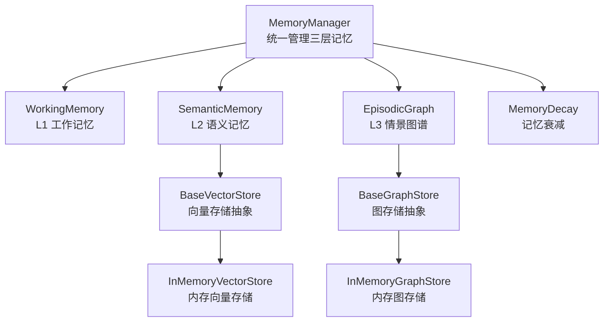
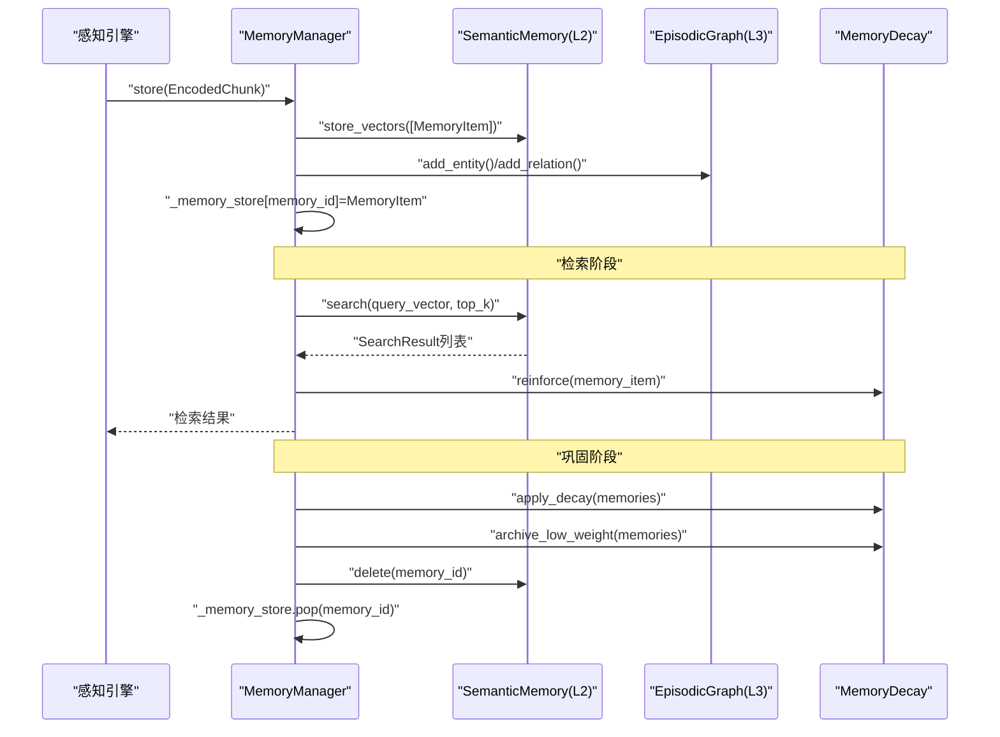
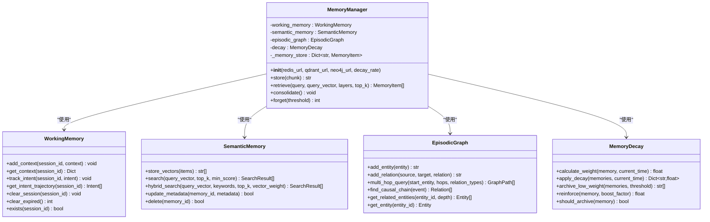
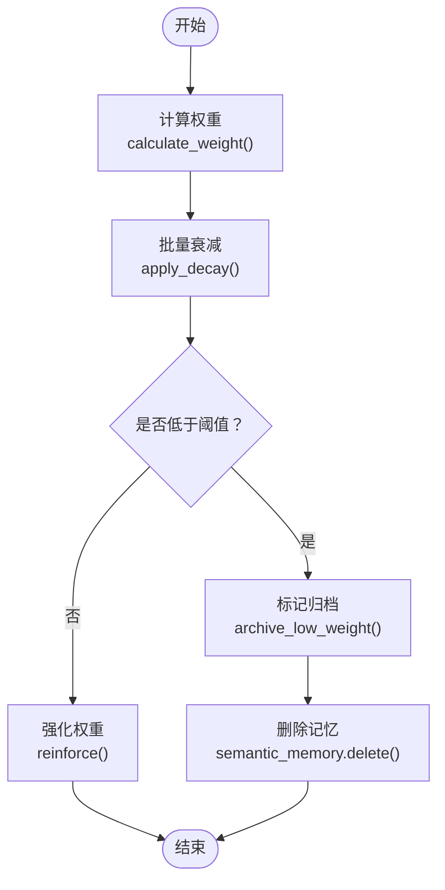
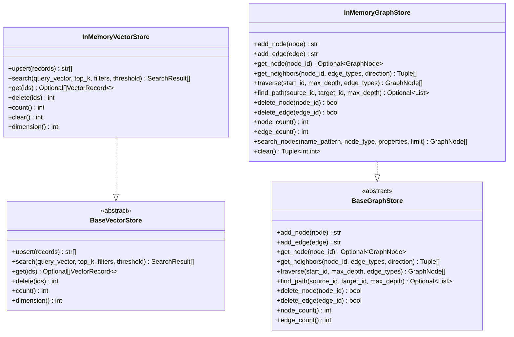
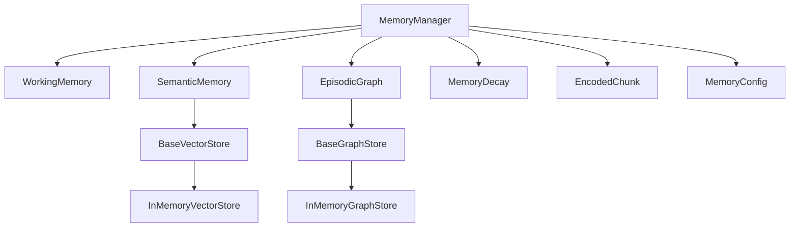

# 记忆管理API

<cite>
**本文档引用的文件**
- [manager.py](file://src/memory/manager.py)
- [models.py](file://src/memory/models.py)
- [working_memory.py](file://src/memory/working_memory.py)
- [semantic_memory.py](file://src/memory/semantic_memory.py)
- [episodic_graph.py](file://src/memory/episodic_graph.py)
- [decay.py](file://src/memory/decay.py)
- [base.py](file://src/memory/backends/base.py)
- [memory_store.py](file://src/memory/backends/memory_store.py)
- [README.md](file://src/memory/README.md)
- [example_usage.py](file://example/example_usage.py)
- [models.py](file://src/perception/models.py)
- [config.py](file://src/core/config.py)
</cite>

## 目录
1. [简介](#简介)
2. [项目结构](#项目结构)
3. [核心组件](#核心组件)
4. [架构总览](#架构总览)
5. [详细组件分析](#详细组件分析)
6. [依赖分析](#依赖分析)
7. [性能考虑](#性能考虑)
8. [故障排除指南](#故障排除指南)
9. [结论](#结论)
10. [附录](#附录)

## 简介
本文件为记忆管理API的详细参考文档，聚焦MemoryManager类的接口设计与使用方法，涵盖三层记忆系统的存储、检索、删除与统计能力，并深入解释记忆衰减机制的API使用方法。文档同时提供不同存储后端的配置与使用指南，以及最佳实践与性能优化建议，帮助开发者在实际项目中高效集成与扩展记忆系统。

## 项目结构
记忆管理模块位于src/memory目录，采用分层设计：
- MemoryManager：统一管理三层记忆（工作记忆L1、语义记忆L2、情景图谱L3）
- WorkingMemory：L1工作记忆（模拟Redis，存储会话上下文与用户意图轨迹）
- SemanticMemory：L2语义记忆（模拟向量数据库，存储高维向量）
- EpisodicGraph：L3情景图谱（模拟图数据库，存储实体关系）
- MemoryDecay：记忆衰减机制（权重计算、强化、归档）
- Backends：抽象基类与内存实现，定义向量存储与图存储的统一接口

**图表来源**
- [manager.py:16-47](file://src/memory/manager.py#L16-L47)
- [working_memory.py:11-35](file://src/memory/working_memory.py#L11-L35)
- [semantic_memory.py:21-49](file://src/memory/semantic_memory.py#L21-L49)
- [episodic_graph.py:10-32](file://src/memory/episodic_graph.py#L10-L32)
- [decay.py:11-38](file://src/memory/decay.py#L11-L38)
- [base.py:54-137](file://src/memory/backends/base.py#L54-L137)
- [base.py:139-276](file://src/memory/backends/base.py#L139-L276)
- [memory_store.py:20-141](file://src/memory/backends/memory_store.py#L20-L141)
- [memory_store.py:143-381](file://src/memory/backends/memory_store.py#L143-L381)

**章节来源**
- [manager.py:16-47](file://src/memory/manager.py#L16-L47)
- [README.md:1-244](file://src/memory/README.md#L1-L244)

## 核心组件
本节概述MemoryManager类及其三层记忆子系统的职责与接口要点：
- MemoryManager：提供统一的存储、检索、巩固与遗忘接口；协调各层之间的数据流转与权重更新
- WorkingMemory（L1）：会话上下文与意图轨迹的临时存储，支持TTL与清理
- SemanticMemory（L2）：高维向量存储与检索，支持向量相似度搜索与元数据更新
- EpisodicGraph（L3）：实体关系网络，支持多跳查询与因果链条追踪
- MemoryDecay：动态权重衰减、强化与归档阈值控制

**章节来源**
- [manager.py:16-186](file://src/memory/manager.py#L16-L186)
- [working_memory.py:11-120](file://src/memory/working_memory.py#L11-L120)
- [semantic_memory.py:21-179](file://src/memory/semantic_memory.py#L21-L179)
- [episodic_graph.py:10-194](file://src/memory/episodic_graph.py#L10-L194)
- [decay.py:11-155](file://src/memory/decay.py#L11-L155)

## 架构总览
记忆管理API遵循“感知-记忆-检索-巩固-交互”的完整工作流：
- 知识入库：感知引擎生成EncodedChunk，MemoryManager将其持久化至L2语义记忆，并构建L3图谱实体与关系
- 检索：根据查询向量在L2进行向量检索，必要时结合L1上下文与L3图谱推理
- 巩固：应用衰减机制，将高频知识持久化，低频知识归档
- 遗忘：主动清理低价值记忆，释放存储空间

**图表来源**
- [manager.py:48-112](file://src/memory/manager.py#L48-L112)
- [manager.py:114-147](file://src/memory/manager.py#L114-L147)
- [manager.py:149-185](file://src/memory/manager.py#L149-L185)
- [semantic_memory.py:50-78](file://src/memory/semantic_memory.py#L50-L78)
- [episodic_graph.py:33-69](file://src/memory/episodic_graph.py#L33-L69)
- [decay.py:72-118](file://src/memory/decay.py#L72-L118)

## 详细组件分析

### MemoryManager类接口详解
MemoryManager提供以下核心接口：
- 存储接口：store(chunk) 将EncodedChunk转换为MemoryItem并写入L2与L3，同时维护统一存储映射
- 检索接口：retrieve(query, query_vector, layers, top_k) 支持指定层级检索，默认仅L2向量检索
- 巩固接口：consolidate() 应用衰减并归档低权重记忆
- 遗忘接口：forget(threshold) 主动删除低于阈值的记忆

**图表来源**
- [manager.py:16-186](file://src/memory/manager.py#L16-L186)
- [working_memory.py:11-120](file://src/memory/working_memory.py#L11-L120)
- [semantic_memory.py:21-179](file://src/memory/semantic_memory.py#L21-L179)
- [episodic_graph.py:10-194](file://src/memory/episodic_graph.py#L10-L194)
- [decay.py:11-155](file://src/memory/decay.py#L11-L155)

**章节来源**
- [manager.py:48-185](file://src/memory/manager.py#L48-L185)

### 三层记忆类型API接口

#### L1工作记忆（临时存储）
- 接口要点
  - add_context(session_id, context)：添加会话上下文，支持增量更新与最后更新时间记录
  - get_context(session_id)：获取会话上下文
  - track_intent(session_id, intent)：跟踪用户意图轨迹
  - get_intent_trajectory(session_id)：获取意图列表
  - clear_session(session_id)：清除会话数据（模拟遗忘）
  - clear_expired()：清理过期数据（最小实现返回0）
  - exists(session_id)：检查会话是否存在

- 设计特点
  - 极低延迟访问
  - TTL自动过期（通过最小实现预留扩展点）
  - LRU淘汰策略（预留扩展点）
  - 模拟瞬时遗忘

**章节来源**
- [working_memory.py:36-119](file://src/memory/working_memory.py#L36-L119)

#### L2语义记忆（长期存储）
- 接口要点
  - store_vectors(memory_items)：批量存储向量与元数据
  - search(query_vector, top_k, min_score)：向量相似度检索
  - hybrid_search(query_vector, keywords, top_k, vector_weight)：混合检索（向量+关键词）
  - update_metadata(memory_id, metadata)：更新元数据
  - delete(memory_id)：删除记忆

- 设计特点
  - 高维向量存储
  - 混合搜索（向量+关键词）
  - HNSW索引（预留扩展点）
  - 模糊匹配

**章节来源**
- [semantic_memory.py:50-179](file://src/memory/semantic_memory.py#L50-L179)

#### L3情景图谱（关联存储）
- 接口要点
  - add_entity(entity)：添加实体
  - add_relation(source, target, relation)：添加关系
  - multi_hop_query(start_entity, hops, relation_types)：多跳查询
  - find_causal_chain(event)：查找因果链条
  - get_related_entities(entity_id, depth)：获取相关实体
  - get_entity(entity_id)：获取实体

- 设计特点
  - 实体关系存储
  - 多跳推理
  - 因果链条追踪
  - 结构化记忆

**章节来源**
- [episodic_graph.py:33-194](file://src/memory/episodic_graph.py#L33-L194)

### 记忆衰减机制API使用方法
MemoryDecay提供以下API：
- calculate_weight(memory, current_time)：计算当前权重（含时间衰减与访问频率因子）
- apply_decay(memories, current_time)：批量应用衰减
- archive_low_weight(memories, threshold)：归档低权重记忆
- reinforce(memory, boost_factor)：强化权重（提升访问频率与最近访问时间）
- should_archive(memory)：判断是否应归档

**图表来源**
- [decay.py:39-142](file://src/memory/decay.py#L39-L142)
- [manager.py:149-185](file://src/memory/manager.py#L149-L185)

**章节来源**
- [decay.py:11-155](file://src/memory/decay.py#L11-L155)
- [manager.py:149-185](file://src/memory/manager.py#L149-L185)

### 存储后端配置与使用
- 抽象基类
  - BaseVectorStore：定义向量存储的统一接口（upsert/search/get/delete/count等）
  - BaseGraphStore：定义图存储的统一接口（add_node/add_edge/get_neighbors/traverse/find_path等）

- 内存实现
  - InMemoryVectorStore：基于内存的向量存储，适用于开发与测试
  - InMemoryGraphStore：基于内存的图存储，适用于开发与测试

- 配置参数
  - L1工作记忆：ttl、max_session_items（可通过配置类扩展）
  - L2语义记忆：vector_db_provider、vector_db_url、vector_collection_name
  - L3情景图谱：graph_db_provider、graph_db_url、max_relation_depth
  - 衰减机制：decay_rate、decay_threshold

**图表来源**
- [base.py:54-137](file://src/memory/backends/base.py#L54-L137)
- [base.py:139-276](file://src/memory/backends/base.py#L139-L276)
- [memory_store.py:20-141](file://src/memory/backends/memory_store.py#L20-L141)
- [memory_store.py:143-381](file://src/memory/backends/memory_store.py#L143-L381)

**章节来源**
- [base.py:1-297](file://src/memory/backends/base.py#L1-L297)
- [memory_store.py:1-381](file://src/memory/backends/memory_store.py#L1-L381)
- [config.py:125-147](file://src/core/config.py#L125-L147)

## 依赖分析
- 组件耦合
  - MemoryManager对WorkingMemory、SemanticMemory、EpisodicGraph与MemoryDecay存在直接依赖
  - SemanticMemory与EpisodicGraph分别依赖各自的抽象基类
  - Backends模块提供统一接口，便于替换具体实现

- 外部依赖
  - 感知层：EncodedChunk作为输入数据结构
  - 配置层：MemoryConfig提供后端选择与参数配置

**图表来源**
- [manager.py:8-12](file://src/memory/manager.py#L8-L12)
- [semantic_memory.py:9-9](file://src/memory/semantic_memory.py#L9-L9)
- [episodic_graph.py:7-7](file://src/memory/episodic_graph.py#L7-L7)
- [base.py:54-137](file://src/memory/backends/base.py#L54-L137)
- [base.py:139-276](file://src/memory/backends/base.py#L139-L276)
- [config.py:125-147](file://src/core/config.py#L125-L147)

**章节来源**
- [manager.py:1-13](file://src/memory/manager.py#L1-L13)
- [semantic_memory.py:1-9](file://src/memory/semantic_memory.py#L1-L9)
- [episodic_graph.py:1-7](file://src/memory/episodic_graph.py#L1-L7)
- [config.py:125-147](file://src/core/config.py#L125-L147)

## 性能考虑
- 写入延迟
  - L1：极低延迟（内存字典模拟），适合会话上下文与意图轨迹
  - L2：向量相似度计算与内存存储，延迟较低
  - L3：图遍历与邻接表操作，延迟适中

- 检索延迟
  - L1：O(1)上下文查询
  - L2：余弦相似度计算，复杂度与向量维度相关
  - L3：BFS/DFS多跳遍历，复杂度与图规模相关

- 容量与扩展
  - L1：受限于单机内存，需配合TTL与清理策略
  - L2：内存向量存储适合中小规模，可扩展至分布式向量库
  - L3：内存图适合小规模，可扩展至分布式图数据库

- 优化建议
  - 使用向量索引（如HNSW）降低L2检索复杂度
  - 对L1会话数据定期清理过期项
  - 对L3图谱实施节点与边的分页遍历
  - 合理设置衰减参数以平衡记忆保留与存储成本

[本节为通用性能指导，不直接分析特定文件]

## 故障排除指南
- 常见问题
  - 向量维度不匹配：确保查询向量与存储向量维度一致
  - 节点不存在：添加边前需先添加节点
  - 检索结果为空：检查查询向量是否有效，或调整阈值与top_k

- 调试步骤
  - 验证向量维度与集合配置
  - 检查图节点与边的添加顺序
  - 使用最小实现进行单元测试，逐步替换为真实后端

**章节来源**
- [memory_store.py:41-141](file://src/memory/backends/memory_store.py#L41-L141)
- [memory_store.py:143-381](file://src/memory/backends/memory_store.py#L143-L381)

## 结论
记忆管理API通过MemoryManager统一协调L1、L2、L3三层记忆，结合MemoryDecay实现动态权重衰减与主动遗忘，形成从感知到交互的完整记忆闭环。通过抽象基类与内存实现，系统具备良好的可扩展性与可测试性。建议在生产环境中结合具体后端（Redis/Qdrant/Neo4j等）进行部署，并根据业务场景调优衰减参数与检索策略。

[本节为总结性内容，不直接分析特定文件]

## 附录

### API使用示例
- 存储与检索
  - 使用MemoryManager.store存储EncodedChunk
  - 使用MemoryManager.retrieve进行向量检索
- 记忆巩固与遗忘
  - 使用MemoryManager.consolidate执行批量衰减与归档
  - 使用MemoryManager.forget主动删除低价值记忆

**章节来源**
- [example_usage.py:50-91](file://example/example_usage.py#L50-L91)
- [example_usage.py:94-136](file://example/example_usage.py#L94-L136)

### 配置参数速查
- L1工作记忆
  - ttl：会话TTL（秒）
  - max_session_items：单会话最大条目
- L2语义记忆
  - vector_db_provider：向量数据库提供商
  - vector_db_url：向量数据库URL
  - vector_collection_name：集合名称
- L3情景图谱
  - graph_db_provider：图数据库提供商
  - graph_db_url：图数据库URL
  - max_relation_depth：最大关系深度
- 衰减机制
  - decay_rate：衰减速率
  - decay_threshold：归档阈值

**章节来源**
- [config.py:125-147](file://src/core/config.py#L125-L147)
- [README.md:194-222](file://src/memory/README.md#L194-L222)