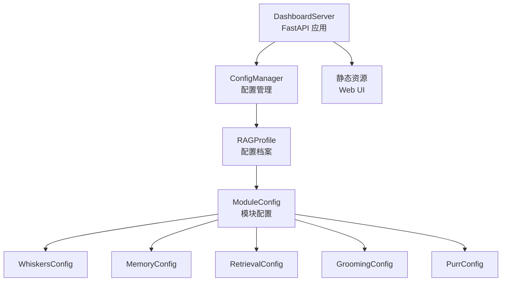
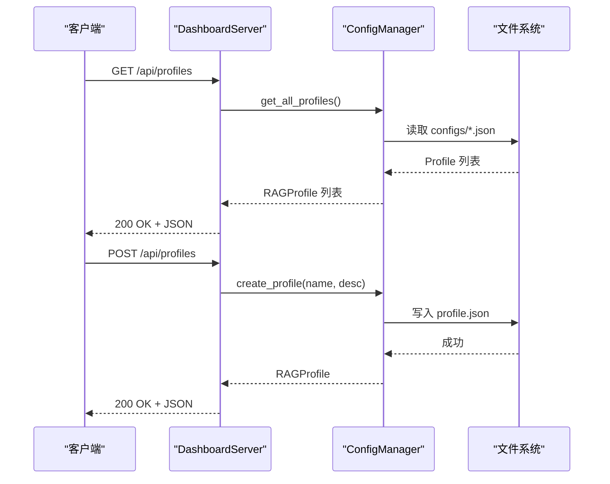

# API参考文档

<cite>
**本文档引用的文件**
- [src/dashboard/server.py](file://src/dashboard/server.py)
- [src/dashboard/config_manager.py](file://src/dashboard/config_manager.py)
- [src/dashboard/models.py](file://src/dashboard/models.py)
- [src/dashboard/dashboard.py](file://src/dashboard/dashboard.py)
- [src/dashboard/README.md](file://src/dashboard/README.md)
- [DASHBOARD_GUIDE.md](file://DASHBOARD_GUIDE.md)
- [tools/start_dashboard.py](file://tools/start_dashboard.py)
- [tools/start_dashboard.sh](file://tools/start_dashboard.sh)
- [requirements.txt](file://requirements.txt)
- [pyproject.toml](file://pyproject.toml)
- [example/example_usage.py](file://example/example_usage.py)
</cite>

## 目录
1. [简介](#简介)
2. [项目结构](#项目结构)
3. [核心组件](#核心组件)
4. [架构总览](#架构总览)
5. [详细组件分析](#详细组件分析)
6. [依赖分析](#依赖分析)
7. [性能考虑](#性能考虑)
8. [故障排除指南](#故障排除指南)
9. [结论](#结论)
10. [附录](#附录)

## 简介
本文件为 NecoRAG Dashboard 的完整 API 参考文档，覆盖仪表板管理 API、配置管理 API、模块控制 API 等 RESTful 接口。文档提供每个端点的 HTTP 方法、URL 模式、请求/响应格式、错误码定义，并结合项目中的模型定义与实现细节，给出参数说明、使用示例与最佳实践。

## 项目结构
Dashboard 采用 FastAPI 构建，核心入口位于 dashboard 模块，配置管理由 ConfigManager 负责，数据模型定义于 models.py。工具脚本提供便捷启动方式。

图表来源
- [src/dashboard/server.py:43-93](file://src/dashboard/server.py#L43-L93)
- [src/dashboard/config_manager.py:14-41](file://src/dashboard/config_manager.py#L14-L41)
- [src/dashboard/models.py:164-231](file://src/dashboard/models.py#L164-L231)

章节来源
- [src/dashboard/server.py:1-393](file://src/dashboard/server.py#L1-L393)
- [src/dashboard/config_manager.py:1-315](file://src/dashboard/config_manager.py#L1-L315)
- [src/dashboard/models.py:1-231](file://src/dashboard/models.py#L1-L231)

## 核心组件
- DashboardServer：FastAPI 应用实例，注册所有 API 路由，提供 Web UI 与统计信息。
- ConfigManager：负责 Profile 的创建、读取、更新、删除、复制、导入导出及活动状态切换。
- RAGProfile 与 ModuleConfig：定义配置档案与各模块参数的数据结构与序列化。

章节来源
- [src/dashboard/server.py:43-93](file://src/dashboard/server.py#L43-L93)
- [src/dashboard/config_manager.py:14-41](file://src/dashboard/config_manager.py#L14-L41)
- [src/dashboard/models.py:164-231](file://src/dashboard/models.py#L164-L231)

## 架构总览
Dashboard 通过 FastAPI 提供 REST API，前端通过 /docs 查看 OpenAPI 文档，静态资源挂载在 /static。配置文件以 JSON 形式存储在本地目录，ConfigManager 负责持久化与缓存。

图表来源
- [src/dashboard/server.py:99-129](file://src/dashboard/server.py#L99-L129)
- [src/dashboard/config_manager.py:42-74](file://src/dashboard/config_manager.py#L42-L74)

## 详细组件分析

### 仪表板管理 API

- 获取所有 Profiles
  - 方法：GET
  - 路径：/api/profiles
  - 认证：无
  - 请求体：无
  - 响应：数组，元素为 Profile 字典
  - 错误码：200 成功；异常情况由 FastAPI 默认处理
  - 示例：参见 [DASHBOARD_GUIDE.md:96-99](file://DASHBOARD_GUIDE.md#L96-L99)

- 获取单个 Profile
  - 方法：GET
  - 路径：/api/profiles/{profile_id}
  - 路径参数：profile_id（字符串）
  - 响应：Profile 字典
  - 错误码：200 成功；404 未找到
  - 示例：参见 [DASHBOARD_GUIDE.md:95-98](file://DASHBOARD_GUIDE.md#L95-L98)

- 获取活动 Profile
  - 方法：GET
  - 路径：/api/profiles/active
  - 响应：Profile 字典
  - 错误码：200 成功；404 无活动配置
  - 示例：参见 [DASHBOARD_GUIDE.md:114-119](file://DASHBOARD_GUIDE.md#L114-L119)

- 创建 Profile
  - 方法：POST
  - 路径：/api/profiles
  - 请求体：CreateProfileRequest
    - profile_name：字符串
    - description：字符串（可选）
  - 响应：Profile 字典
  - 错误码：200 成功；异常情况由 FastAPI 默认处理
  - 示例：参见 [DASHBOARD_GUIDE.md:100-109](file://DASHBOARD_GUIDE.md#L100-L109)

- 更新 Profile
  - 方法：PUT
  - 路径：/api/profiles/{profile_id}
  - 路径参数：profile_id（字符串）
  - 请求体：UpdateProfileRequest
    - profile_name：可选
    - description：可选
    - whiskers_config：可选，字典
    - memory_config：可选，字典
    - retrieval_config：可选，字典
    - grooming_config：可选，字典
    - purr_config：可选，字典
  - 响应：Profile 字典
  - 错误码：200 成功；404 未找到
  - 示例：参见 [DASHBOARD_GUIDE.md:111-123](file://DASHBOARD_GUIDE.md#L111-L123)

- 删除 Profile
  - 方法：DELETE
  - 路径：/api/profiles/{profile_id}
  - 路径参数：profile_id（字符串）
  - 响应：{"message": "Profile deleted"}
  - 错误码：200 成功；404 未找到
  - 示例：参见 [DASHBOARD_GUIDE.md:130-133](file://DASHBOARD_GUIDE.md#L130-L133)

- 激活 Profile
  - 方法：POST
  - 路径：/api/profiles/{profile_id}/activate
  - 路径参数：profile_id（字符串）
  - 响应：{"message": "Profile activated"}
  - 错误码：200 成功；404 未找到
  - 示例：参见 [DASHBOARD_GUIDE.md:125-128](file://DASHBOARD_GUIDE.md#L125-L128)

- 复制 Profile
  - 方法：POST
  - 路径：/api/profiles/{profile_id}/duplicate
  - 路径参数：profile_id（字符串）
  - 查询参数：new_name（字符串）
  - 响应：Profile 字典
  - 错误码：200 成功；404 未找到
  - 示例：参见 [DASHBOARD_GUIDE.md:157-163](file://DASHBOARD_GUIDE.md#L157-L163)

- 导出 Profile
  - 方法：POST
  - 路径：/api/profiles/{profile_id}/export
  - 路径参数：profile_id（字符串）
  - 查询参数：export_path（字符串）
  - 响应：{"message": "Profile exported"}
  - 错误码：200 成功；400 导出失败
  - 示例：参见 [DASHBOARD_GUIDE.md:165-171](file://DASHBOARD_GUIDE.md#L165-L171)

- 导入 Profile
  - 方法：POST
  - 路径：/api/profiles/import
  - 查询参数：import_path（字符串）
  - 响应：Profile 字典
  - 错误码：200 成功；400 导入失败
  - 示例：参见 [DASHBOARD_GUIDE.md:173-179](file://DASHBOARD_GUIDE.md#L173-L179)

章节来源
- [src/dashboard/server.py:99-180](file://src/dashboard/server.py#L99-L180)
- [src/dashboard/README.md:88-144](file://src/dashboard/README.md#L88-L144)
- [DASHBOARD_GUIDE.md:94-147](file://DASHBOARD_GUIDE.md#L94-L147)

### 模块参数管理 API

- 获取模块参数
  - 方法：GET
  - 路径：/api/profiles/{profile_id}/modules/{module}
  - 路径参数：profile_id（字符串）、module（字符串，枚举：whiskers/memory/retrieval/grooming/purr）
  - 响应：包含 module、parameters、description 的字典
  - 错误码：200 成功；404 未找到；400 模块名无效
  - 示例：参见 [DASHBOARD_GUIDE.md:147-150](file://DASHBOARD_GUIDE.md#L147-L150)

- 更新模块参数
  - 方法：PUT
  - 路径：/api/profiles/{profile_id}/modules/{module}
  - 路径参数：profile_id（字符串）、module（字符串）
  - 请求体：ModuleParametersUpdate
    - module：字符串（与路径一致）
    - parameters：字典
  - 响应：{"message": "Module parameters updated"}
  - 错误码：200 成功；404 未找到；400 模块名无效
  - 示例：参见 [DASHBOARD_GUIDE.md:159-171](file://DASHBOARD_GUIDE.md#L159-L171)

章节来源
- [src/dashboard/server.py:183-216](file://src/dashboard/server.py#L183-L216)
- [src/dashboard/README.md:145-172](file://src/dashboard/README.md#L145-L172)

### 统计信息 API

- 获取统计信息
  - 方法：GET
  - 路径：/api/stats
  - 响应：包含 total_documents、total_chunks、total_queries、active_sessions、memory_usage、performance_metrics 的字典
  - 错误码：200 成功
  - 示例：参见 [DASHBOARD_GUIDE.md:175-178](file://DASHBOARD_GUIDE.md#L175-L178)

- 重置统计信息
  - 方法：POST
  - 路径：/api/stats/reset
  - 响应：{"message": "Stats reset"}
  - 错误码：200 成功

章节来源
- [src/dashboard/server.py:219-236](file://src/dashboard/server.py#L219-L236)
- [src/dashboard/README.md:173-202](file://src/dashboard/README.md#L173-L202)

### Web UI 与静态资源
- 根路径 /
  - 方法：GET
  - 响应：HTML 页面（内置简单 UI 或返回静态 index.html）
  - 错误码：200 成功
- 静态资源
  - 路径：/static
  - 作用：提供前端静态文件服务

章节来源
- [src/dashboard/server.py:239-253](file://src/dashboard/server.py#L239-L253)

### 数据模型与参数说明

- RAGProfile
  - 字段：profile_id、profile_name、description、created_at、updated_at、is_active、whiskers_config、memory_config、retrieval_config、grooming_config、purr_config
  - 说明：配置档案主体，包含五个模块配置对象

- ModuleConfig（抽象）
  - 字段：module_type、module_name、description、parameters、enabled、last_updated
  - 说明：模块配置基类，具体模块继承该类

- WhiskersConfig
  - 默认参数示例：chunk_size、chunk_overlap、enable_ocr、vector_model、vector_size 等
  - 参考：[src/dashboard/models.py:47-63](file://src/dashboard/models.py#L47-L63)

- MemoryConfig
  - 默认参数示例：l1_ttl、l1_max_session_items、l2_vector_size、l2_collection_name、l3_max_relation_depth、decay_rate 等
  - 参考：[src/dashboard/models.py:67-91](file://src/dashboard/models.py#L67-L91)

- RetrievalConfig
  - 默认参数示例：top_k、min_score、max_hops、hyde_enabled、reranker_model、pounce_threshold 等
  - 参考：[src/dashboard/models.py:95-115](file://src/dashboard/models.py#L95-L115)

- GroomingConfig
  - 默认参数示例：min_confidence、hallucination_threshold、consolidation_interval 等
  - 参考：[src/dashboard/models.py:119-137](file://src/dashboard/models.py#L119-L137)

- PurrConfig
  - 默认参数示例：default_tone、default_detail_level、profile_ttl、show_trace 等
  - 参考：[src/dashboard/models.py:141-160](file://src/dashboard/models.py#L141-L160)

章节来源
- [src/dashboard/models.py:164-231](file://src/dashboard/models.py#L164-L231)

## 依赖分析
- 运行时依赖
  - FastAPI、Uvicorn、Pydantic：Web 框架与数据模型
  - NumPy、dateutil：通用计算与日期处理
- 可选依赖（用于扩展功能）
  - 文档解析：RAGFlow、PyMuPDF、python-docx、beautifulsoup4
  - 向量数据库：qdrant-client、pymilvus
  - 图数据库：neo4j、nebula3-python
  - 缓存：redis
  - 嵌入模型：FlagEmbedding、sentence-transformers
  - LLM 集成：langchain、langgraph、openai、anthropic
  - NLP 工具：spacy、transformers
  - 工具：aiohttp、requests、python-dotenv

章节来源
- [requirements.txt:1-57](file://requirements.txt#L1-L57)
- [pyproject.toml:27-30](file://pyproject.toml#L27-L30)

## 性能考虑
- 合理设置分块大小（Whiskers chunk_size），通常在 512-1024 字符范围
- 调整检索参数（Retrieval top_k、pounce_threshold）以平衡准确率与延迟
- 优化记忆衰减（Memory decay_rate）以控制存储与检索成本
- 使用批量更新接口减少 API 调用次数
- 建议在生产环境启用合适的 CORS 策略与反向代理

## 故障排除指南
- Dashboard 无法访问
  - 检查端口占用与防火墙设置
  - 参考：[DASHBOARD_GUIDE.md:302-304](file://DASHBOARD_GUIDE.md#L302-L304)
- 配置保存失败
  - 检查配置目录写入权限或更换目录
  - 参考：[DASHBOARD_GUIDE.md:392-399](file://DASHBOARD_GUIDE.md#L392-L399)
- API 返回 404
  - 确认 Profile ID 存在，先获取列表再使用
  - 参考：[DASHBOARD_GUIDE.md:401-405](file://DASHBOARD_GUIDE.md#L401-L405)

## 结论
本 API 参考文档覆盖了 Dashboard 的核心配置管理与模块参数控制能力，提供了清晰的端点定义、请求/响应格式与错误码说明。结合数据模型与使用示例，用户可以快速集成与定制 NecoRAG 的配置管理流程。

## 附录

### 启动与部署
- 命令行启动
  - 参考：[DASHBOARD_GUIDE.md:26-56](file://DASHBOARD_GUIDE.md#L26-L56)
- 脚本启动
  - Python 脚本：[tools/start_dashboard.py:16-51](file://tools/start_dashboard.py#L16-L51)
  - Shell 脚本：[tools/start_dashboard.sh:1-26](file://tools/start_dashboard.sh#L1-L26)
- 作为模块运行
  - 参考：[src/dashboard/dashboard.py:10-26](file://src/dashboard/dashboard.py#L10-L26)

### 客户端实现指南
- 使用 curl 或任意 HTTP 客户端调用 /api/* 端点
- 使用 /docs 查看 OpenAPI 文档与交互式调试
- 参考示例：[DASHBOARD_GUIDE.md:92-147](file://DASHBOARD_GUIDE.md#L92-L147)

### 安全与速率限制
- CORS 已配置为允许所有来源（开发用途），生产环境请根据需要收紧
- 未内置认证与速率限制，建议在反向代理层添加认证与限流策略

### 最佳实践
- 使用 Profile 管理多环境配置（开发/测试/生产）
- 通过模块参数 API 精细调优各模块性能
- 定期导出配置以便备份与团队共享
- 结合统计信息 API 监控系统运行状态