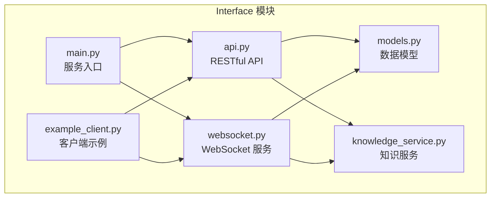
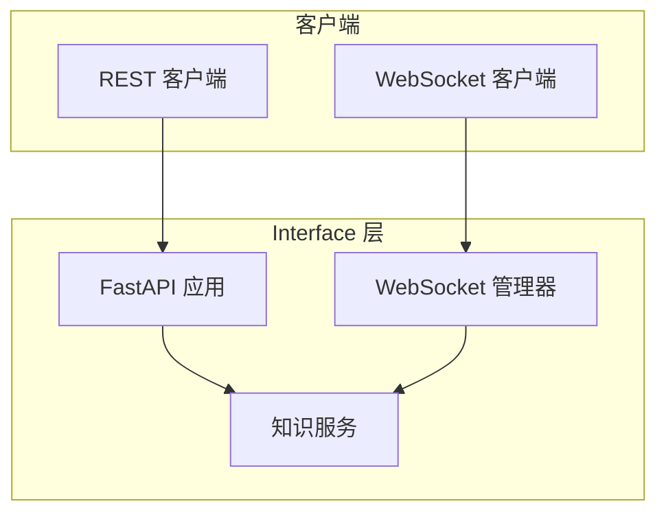
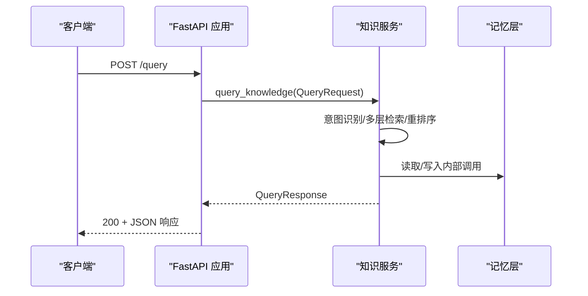
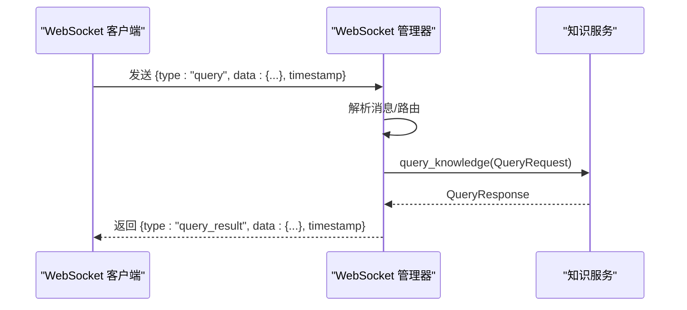
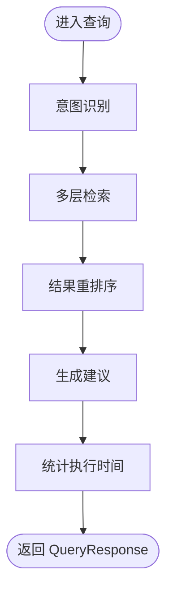
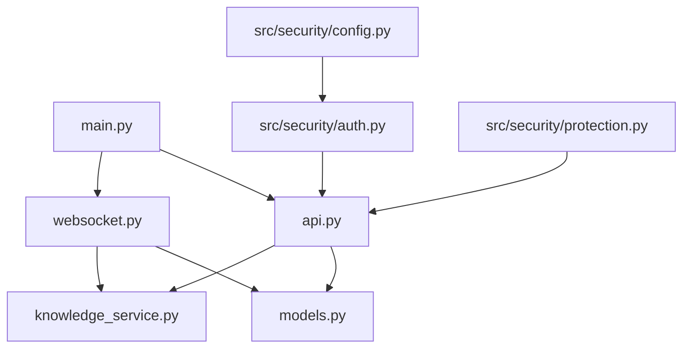

# API接口文档

<cite>
**本文档引用的文件**
- [interface/api.py](file://interface/api.py)
- [interface/websocket.py](file://interface/websocket.py)
- [interface/main.py](file://interface/main.py)
- [interface/models.py](file://interface/models.py)
- [interface/knowledge_service.py](file://interface/knowledge_service.py)
- [interface/example_client.py](file://interface/example_client.py)
- [src/core/protocols.py](file://src/core/protocols.py)
- [src/dashboard/server.py](file://src/dashboard/server.py)
- [src/security/auth.py](file://src/security/auth.py)
- [src/security/config.py](file://src/security/config.py)
- [src/security/protection.py](file://src/security/protection.py)
- [VERSION_README.md](file://VERSION_README.md)
- [RELEASE_NOTES_v3.1.0.md](file://RELEASE_NOTES_v3.1.0.md)
- [README.md](file://README.md)
</cite>

## 目录
1. [简介](#简介)
2. [项目结构](#项目结构)
3. [核心组件](#核心组件)
4. [架构总览](#架构总览)
5. [详细组件分析](#详细组件分析)
6. [依赖关系分析](#依赖关系分析)
7. [性能考量](#性能考量)
8. [故障排查指南](#故障排查指南)
9. [结论](#结论)
10. [附录](#附录)

## 简介
本文件为 NecoRAG Interface 模块的全面 API 文档，覆盖 RESTful API、WebSocket 实时通信、内部知识服务以及与系统其他模块的集成关系。Interface 模块提供标准化的 RESTful 接口与 WebSocket 通道，统一封装知识库的查询、插入、更新、删除等核心能力，并通过统一的数据模型与协议定义保证模块间一致性。

- 版本信息：v3.3.0-alpha
- 项目目标：为上层应用提供稳定、可扩展、可观测的接口层，支撑多场景知识检索与实时交互。

**章节来源**
- [README.md:104-183](file://README.md#L104-L183)
- [VERSION_README.md:1-91](file://VERSION_README.md#L1-L91)
- [RELEASE_NOTES_v3.1.0.md:1-315](file://RELEASE_NOTES_v3.1.0.md#L1-L315)

## 项目结构
Interface 模块位于 `interface/` 目录，包含以下关键文件：
- `api.py`：FastAPI 应用与 RESTful 路由定义
- `websocket.py`：WebSocket 服务与消息路由
- `main.py`：服务启动入口与并发运行
- `models.py`：API/WS 数据模型与枚举
- `knowledge_service.py`：知识服务封装（查询、插入、更新、删除、统计）
- `example_client.py`：RESTful 与 WebSocket 客户端示例
- `__init__.py`：模块导出

**图表来源**
- [interface/api.py:1-174](file://interface/api.py#L1-L174)
- [interface/websocket.py:1-299](file://interface/websocket.py#L1-L299)
- [interface/main.py:1-82](file://interface/main.py#L1-L82)
- [interface/models.py:1-85](file://interface/models.py#L1-L85)
- [interface/knowledge_service.py:1-307](file://interface/knowledge_service.py#L1-L307)
- [interface/example_client.py:1-200](file://interface/example_client.py#L1-L200)

**章节来源**
- [interface/api.py:1-174](file://interface/api.py#L1-L174)
- [interface/websocket.py:1-299](file://interface/websocket.py#L1-L299)
- [interface/main.py:1-82](file://interface/main.py#L1-L82)
- [interface/models.py:1-85](file://interface/models.py#L1-L85)
- [interface/knowledge_service.py:1-307](file://interface/knowledge_service.py#L1-L307)
- [interface/example_client.py:1-200](file://interface/example_client.py#L1-L200)

## 核心组件
- RESTful API 服务：提供健康检查、查询、插入、更新、删除、统计、建议等接口
- WebSocket 服务：提供实时查询、插入、更新、删除、订阅/退订、心跳等消息处理
- 知识服务：封装多层检索、意图识别、结果重排序、建议生成、统计聚合等
- 数据模型：统一的请求/响应模型、枚举类型、WebSocket 消息格式
- 客户端示例：演示 RESTful 与 WebSocket 的使用方式

**章节来源**
- [interface/api.py:26-164](file://interface/api.py#L26-L164)
- [interface/websocket.py:18-299](file://interface/websocket.py#L18-L299)
- [interface/knowledge_service.py:27-307](file://interface/knowledge_service.py#L27-L307)
- [interface/models.py:11-85](file://interface/models.py#L11-L85)
- [interface/example_client.py:13-200](file://interface/example_client.py#L13-L200)

## 架构总览
Interface 模块采用“服务入口 + 协议适配 + 知识服务”的分层设计：
- 服务入口负责启动 REST 与 WebSocket 服务
- 协议适配层分别处理 HTTP 与 WebSocket 消息
- 知识服务层封装核心业务逻辑并与系统其他模块交互

**图表来源**
- [interface/main.py:30-67](file://interface/main.py#L30-L67)
- [interface/api.py:26-164](file://interface/api.py#L26-L164)
- [interface/websocket.py:27-37](file://interface/websocket.py#L27-L37)
- [interface/knowledge_service.py:45-72](file://interface/knowledge_service.py#L45-L72)

## 详细组件分析

### RESTful API 接口规范
- 服务器：FastAPI 应用，支持 CORS
- 端口：默认 8000（可通过入口参数修改）
- 路由：
  - GET /：根路径，返回欢迎信息与版本
  - GET /health：健康检查，返回组件状态与运行时间
  - POST /query：知识查询，请求体为 QueryRequest，响应为 QueryResponse
  - POST /insert：知识插入，请求体为 InsertRequest，响应为批量插入结果
  - PUT /update：知识更新，请求体为 UpdateRequest，响应为更新结果
  - DELETE /delete：知识删除，请求体为 DeleteRequest，响应为删除结果
  - GET /stats：统计信息，返回知识库统计
  - GET /suggestions/{query}：查询建议，返回建议列表

认证与安全
- 当前实现未内置认证中间件；如需认证，请在应用层添加安全中间件或依赖注入
- CORS 已开启，允许任意来源、方法与头部

错误处理
- 所有接口在异常时返回 500 与错误详情
- 健康检查在异常时返回不健康状态

版本与文档
- 版本：1.0.0
- 文档：/docs 与 /redoc

**章节来源**
- [interface/api.py:26-164](file://interface/api.py#L26-L164)
- [interface/models.py:35-78](file://interface/models.py#L35-L78)

#### RESTful API 序列图（查询流程）

**图表来源**
- [interface/api.py:80-91](file://interface/api.py#L80-L91)
- [interface/knowledge_service.py:45-72](file://interface/knowledge_service.py#L45-L72)

### WebSocket 接口规范
- 服务器：独立 WebSocket 服务器，端口默认 8001
- 连接管理：维护客户端连接、房间订阅、广播
- 消息类型：
  - query：查询请求，返回 query_result
  - insert：插入请求，返回 insert_result 并广播 inserted
  - update：更新请求，返回 update_result 并广播 updated
  - delete：删除请求，返回 delete_result 并广播 deleted
  - subscribe：订阅房间，返回 subscribed
  - unsubscribe：取消订阅，返回 unsubscribed
  - ping：心跳，返回 pong
- 消息格式：WebSocketMessage（type、data、timestamp），JSON 序列化

实时交互模式
- 客户端可订阅房间（如 knowledge_updates），接收知识变更通知
- 心跳 ping/pong 保持连接活跃

**章节来源**
- [interface/websocket.py:18-299](file://interface/websocket.py#L18-L299)
- [interface/models.py:73-78](file://interface/models.py#L73-L78)

#### WebSocket 消息处理序列图（查询）

**图表来源**
- [interface/websocket.py:52-88](file://interface/websocket.py#L52-L88)
- [interface/knowledge_service.py:45-72](file://interface/knowledge_service.py#L45-L72)

### 知识服务（内部封装）
- 查询：意图识别 → 多层检索 → 结果重排序 → 建议生成 → 统计执行时间
- 插入：逐条预处理 → 写入多层记忆 → 知识巩固触发
- 更新：校验存在 → 部分/全量更新 → 多层同步 → 关联更新
- 删除：校验存在 → 多层删除 → 关联清理
- 统计：总条目、领域分布、语言分布、最近更新、健康状态

注意：实际检索与存储调用在知识服务中以占位形式存在，具体实现依赖系统其他模块（感知层、记忆层、检索层等）。

**章节来源**
- [interface/knowledge_service.py:45-307](file://interface/knowledge_service.py#L45-L307)

#### 知识服务流程图（查询）

**图表来源**
- [interface/knowledge_service.py:45-72](file://interface/knowledge_service.py#L45-L72)

### 数据模型与协议
- 查询意图枚举：factual/comparative/reasoning/concept/summary/procedural/exploratory
- 知识条目：id/content/title/tags/domain/language/时间戳/元数据
- 查询请求：query/intent/domain/language/top_k/filters
- 查询响应：query_id/results/execution_time/intent_detected/confidence/suggestions
- 插入请求：entries/batch_size
- 更新请求：entry_id/updates/partial_update
- 删除请求：entry_ids
- WebSocket 消息：type/data/timestamp
- 健康状态：status/components/timestamp/uptime

此外，系统核心协议（src/core/protocols.py）定义了文档、分块、向量、记忆、查询、响应等统一数据类型，确保模块间一致的数据交换。

**章节来源**
- [interface/models.py:11-85](file://interface/models.py#L11-L85)
- [src/core/protocols.py:14-298](file://src/core/protocols.py#L14-L298)

### 客户端实现指南
- RESTful 客户端示例：NecoRAGAPIClient，支持健康检查、查询、插入、统计
- WebSocket 客户端示例：NecoRAGWebSocketClient，支持连接、消息发送、订阅/退订、查询
- 使用建议：
  - RESTful：适合一次性请求/响应场景
  - WebSocket：适合实时推送、订阅变更、长连接场景
  - 建议在生产环境增加超时、重试、断线重连策略

**章节来源**
- [interface/example_client.py:13-200](file://interface/example_client.py#L13-L200)

## 依赖关系分析
- 接口层依赖：
  - FastAPI（REST）、websockets（WebSocket）、uvicorn（ASGI 服务器）
  - Pydantic（数据模型校验）
- 知识服务依赖：
  - 与感知层、记忆层、检索层、响应层的抽象接口（占位实现）
- 安全与保护：
  - 认证：JWTAuthService（可选集成）
  - 速率限制：RateLimiter（可选中间件）
  - 配置：SecurityManager（从环境变量加载）

**图表来源**
- [interface/api.py:6-16](file://interface/api.py#L6-L16)
- [interface/websocket.py:14-15](file://interface/websocket.py#L14-L15)
- [interface/main.py:10-11](file://interface/main.py#L10-L11)
- [src/security/auth.py:56-133](file://src/security/auth.py#L56-L133)
- [src/security/protection.py:36-67](file://src/security/protection.py#L36-L67)
- [src/security/config.py:17-87](file://src/security/config.py#L17-L87)

**章节来源**
- [interface/api.py:6-16](file://interface/api.py#L6-L16)
- [interface/websocket.py:14-15](file://interface/websocket.py#L14-L15)
- [interface/main.py:10-11](file://interface/main.py#L10-L11)
- [src/security/auth.py:56-133](file://src/security/auth.py#L56-L133)
- [src/security/protection.py:36-67](file://src/security/protection.py#L36-L67)
- [src/security/config.py:17-87](file://src/security/config.py#L17-L87)

## 性能考量
- RESTful 与 WebSocket 并发：服务入口通过 uvicorn 与 asyncio 并发运行，提升吞吐
- WebSocket 连接管理：按房间广播，减少无效消息传递
- 意图识别与检索：建议在上游模块（意图分析、检索层）实现缓存与索引优化
- 统计与健康：定期获取统计信息，结合仪表板监控整体健康状况

**章节来源**
- [interface/main.py:30-67](file://interface/main.py#L30-L67)
- [interface/websocket.py:232-244](file://interface/websocket.py#L232-L244)
- [src/dashboard/server.py:238-254](file://src/dashboard/server.py#L238-L254)

## 故障排查指南
- 健康检查失败：检查知识服务统计接口是否可用，确认各组件状态
- WebSocket 连接断开：检查客户端心跳（ping/pong），确认服务器日志中的连接状态
- RESTful 500 错误：查看知识服务异常堆栈，定位具体环节（检索/存储/重排序）
- 安全相关：如启用 JWT，确认密钥、算法、过期时间配置正确；如启用速率限制，确认请求频率与阈值

**章节来源**
- [interface/api.py:56-78](file://interface/api.py#L56-L78)
- [interface/websocket.py:44-50](file://interface/websocket.py#L44-L50)
- [src/security/auth.py:81-95](file://src/security/auth.py#L81-L95)
- [src/security/protection.py:36-67](file://src/security/protection.py#L36-L67)

## 结论
NecoRAG Interface 模块提供了统一、可扩展的 API 接口层，既满足 RESTful 的标准交互，又支持 WebSocket 的实时推送。通过清晰的数据模型与协议定义，确保与系统其他模块的协同工作。建议在生产环境中结合认证、速率限制与监控体系，进一步提升安全性与稳定性。

## 附录

### 协议与版本信息
- 版本：v3.3.0-alpha
- 接口版本：1.0.0
- 文档：/docs 与 /redoc

**章节来源**
- [VERSION_README.md:5-91](file://VERSION_README.md#L5-L91)
- [interface/api.py:28-34](file://interface/api.py#L28-L34)

### 安全与认证
- JWT 认证服务：支持令牌创建、解码、用户依赖注入
- OAuth2：支持状态生成与回调处理（示例）
- 安全配置：从环境变量加载 JWT、OAuth2、速率限制、CORS 等配置
- 速率限制：基于 IP 的滑动窗口限流

**章节来源**
- [src/security/auth.py:56-133](file://src/security/auth.py#L56-L133)
- [src/security/auth.py:134-191](file://src/security/auth.py#L134-L191)
- [src/security/config.py:17-87](file://src/security/config.py#L17-L87)
- [src/security/protection.py:36-67](file://src/security/protection.py#L36-L67)

### 迁移与兼容性
- v3.3.0-alpha 为功能增强版本，主要涉及代码统计、三级用户系统重构与架构文档完善
- Interface 模块保持向后兼容，新增内容不影响现有接口使用
- 如需启用认证与速率限制，请参考安全模块并在应用层集成

**章节来源**
- [RELEASE_NOTES_v3.1.0.md:257-280](file://RELEASE_NOTES_v3.1.0.md#L257-L280)
- [README.md:104-183](file://README.md#L104-L183)