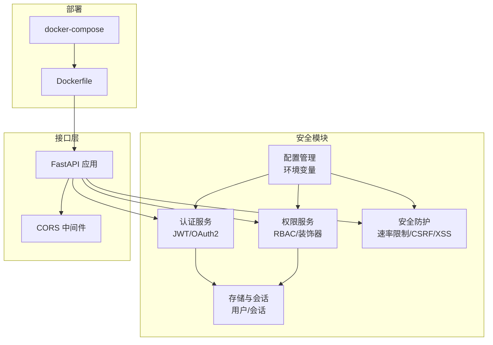
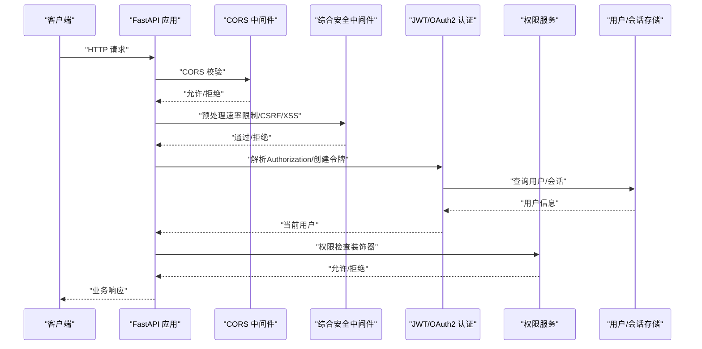
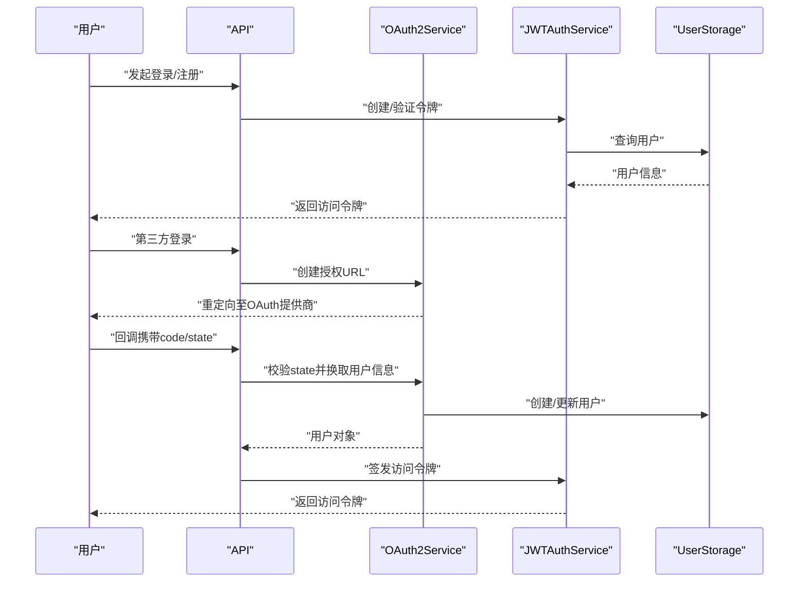
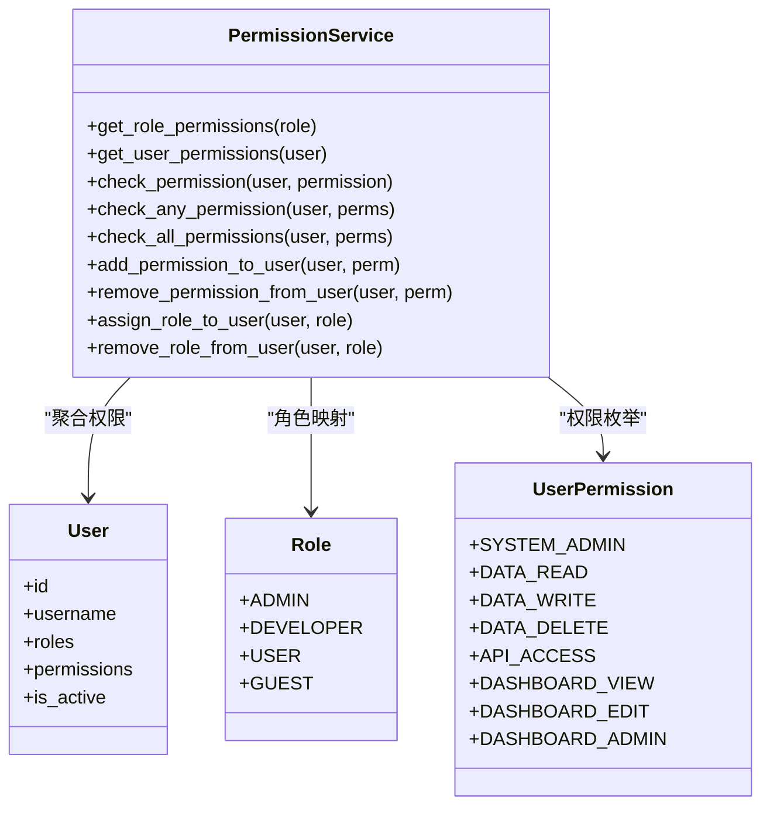
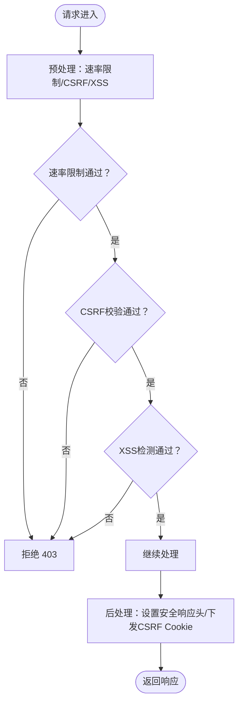
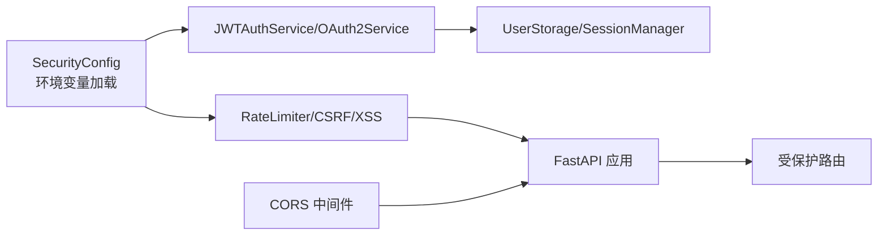

# API认证与安全

<cite>
**本文引用的文件**
- [src/security/__init__.py](file://src/security/__init__.py)
- [src/security/auth.py](file://src/security/auth.py)
- [src/security/config.py](file://src/security/config.py)
- [src/security/permission.py](file://src/security/permission.py)
- [src/security/protection.py](file://src/security/protection.py)
- [src/security/models.py](file://src/security/models.py)
- [src/security/storage.py](file://src/security/storage.py)
- [src/security/example_usage.py](file://src/security/example_usage.py)
- [interface/api.py](file://interface/api.py)
- [src/core/config.py](file://src/core/config.py)
- [devops/docker-compose.yml](file://devops/docker-compose.yml)
- [devops/Dockerfile](file://devops/Dockerfile)
- [src/workspace/user/permissions.py](file://src/workspace/user/permissions.py)
- [src/workspace/team/legacy_user/permissions.py](file://src/workspace/team/legacy_user/permissions.py)
</cite>

## 目录
1. [简介](#简介)
2. [项目结构](#项目结构)
3. [核心组件](#核心组件)
4. [架构总览](#架构总览)
5. [详细组件分析](#详细组件分析)
6. [依赖分析](#依赖分析)
7. [性能考虑](#性能考虑)
8. [故障排查指南](#故障排查指南)
9. [结论](#结论)
10. [附录](#附录)

## 简介
本文件面向NecoRAG的API认证与安全机制，系统化梳理认证流程（API密钥管理、令牌验证）、权限控制（RBAC模型与ACL）、安全防护（速率限制、CSRF/XSS防护、安全响应头）、CORS策略、以及生产与开发环境的配置差异。同时提供安全最佳实践、审计与日志记录指南、常见威胁防护与应急响应流程，帮助读者在理解现有实现的基础上，安全地扩展与部署系统。

## 项目结构
围绕安全主题的关键模块分布如下：
- 认证与授权：JWT认证、OAuth2集成、用户与权限模型、依赖注入获取当前用户
- 权限控制：基于角色的访问控制（RBAC）、权限检查装饰器
- 安全防护：速率限制、CSRF防护、XSS检测、综合安全中间件与安全响应头
- 配置管理：环境变量驱动的安全配置加载
- 存储与会话：用户存储、会话管理（内存后端）
- CORS与接口：FastAPI应用中的CORS中间件
- 部署与容器：Docker镜像与编排，暴露端口与健康检查

**图表来源**
- [src/security/auth.py:23-210](file://src/security/auth.py#L23-L210)
- [src/security/permission.py:61-187](file://src/security/permission.py#L61-L187)
- [src/security/protection.py:12-196](file://src/security/protection.py#L12-L196)
- [src/security/config.py:11-92](file://src/security/config.py#L11-L92)
- [src/security/storage.py:13-209](file://src/security/storage.py#L13-L209)
- [interface/api.py:26-164](file://interface/api.py#L26-L164)
- [devops/Dockerfile:1-39](file://devops/Dockerfile#L1-L39)
- [devops/docker-compose.yml:118-147](file://devops/docker-compose.yml#L118-L147)

**章节来源**
- [src/security/__init__.py:16-65](file://src/security/__init__.py#L16-L65)
- [src/security/auth.py:23-210](file://src/security/auth.py#L23-L210)
- [src/security/permission.py:61-187](file://src/security/permission.py#L61-L187)
- [src/security/protection.py:12-196](file://src/security/protection.py#L12-L196)
- [src/security/config.py:11-92](file://src/security/config.py#L11-L92)
- [src/security/storage.py:13-209](file://src/security/storage.py#L13-L209)
- [interface/api.py:26-164](file://interface/api.py#L26-L164)
- [devops/Dockerfile:1-39](file://devops/Dockerfile#L1-L39)
- [devops/docker-compose.yml:118-147](file://devops/docker-compose.yml#L118-L147)

## 核心组件
- 认证服务
  - JWTAuthService：基于JWT的无状态认证，支持令牌签发、解码与当前用户解析
  - OAuth2Service：支持GitHub/Google等第三方OAuth2登录，状态参数校验与回调处理
  - 依赖注入：get_current_user/get_current_active_user用于路由保护
- 权限控制
  - PermissionService：基于角色的权限聚合、检查（任一/全部）、动态增删权限与角色
  - 装饰器：check_permission/require_permission及专用权限装饰器（如require_admin）
- 安全防护
  - RateLimiter：按IP的滑动窗口速率限制
  - CSRFProtection：基于会话ID生成并校验CSRF Token
  - XSSProtection：请求参数与表单数据的XSS模式检测，并设置安全响应头
  - ComprehensiveSecurityMiddleware：整合速率限制、CSRF、XSS与安全响应头
- 配置管理
  - SecurityManager：从环境变量加载JWT、OAuth2、速率限制、CSRF/XSS、CORS与密码策略
  - SecurityConfig：集中定义安全配置字段
- 存储与会话
  - UserStorage：用户创建/查询/更新/删除与索引维护（内存后端）
  - SessionManager：会话创建/读取/更新/销毁与超时管理
- CORS与接口
  - FastAPI应用内置CORS中间件，默认允许所有来源与方法，可结合SecurityConfig调整

**章节来源**
- [src/security/auth.py:23-210](file://src/security/auth.py#L23-L210)
- [src/security/permission.py:61-187](file://src/security/permission.py#L61-L187)
- [src/security/protection.py:12-196](file://src/security/protection.py#L12-L196)
- [src/security/config.py:11-92](file://src/security/config.py#L11-L92)
- [src/security/models.py:76-101](file://src/security/models.py#L76-L101)
- [src/security/storage.py:13-209](file://src/security/storage.py#L13-L209)
- [interface/api.py:36-43](file://interface/api.py#L36-L43)

## 架构总览
下图展示认证、权限与安全防护在FastAPI应用中的协作关系，以及与配置、存储的交互。

**图表来源**
- [interface/api.py:36-43](file://interface/api.py#L36-L43)
- [src/security/protection.py:148-196](file://src/security/protection.py#L148-L196)
- [src/security/auth.py:97-132](file://src/security/auth.py#L97-L132)
- [src/security/permission.py:127-174](file://src/security/permission.py#L127-L174)
- [src/security/storage.py:13-209](file://src/security/storage.py#L13-L209)

## 详细组件分析

### 认证流程（JWT与OAuth2）
- JWT令牌
  - 签发：包含用户ID、用户名、角色、权限、签发与过期时间
  - 解码：校验签名与过期；异常时返回未授权
  - 当前用户：依赖注入解析Bearer Token，校验用户激活状态
- OAuth2
  - 发起登录：生成随机state并构建授权URL
  - 回调处理：校验state有效性，模拟换取用户信息并创建/更新用户
- 依赖注入
  - get_current_user：解析当前用户
  - get_current_active_user：确保用户处于激活状态

**图表来源**
- [src/security/auth.py:56-190](file://src/security/auth.py#L56-L190)
- [src/security/storage.py:25-142](file://src/security/storage.py#L25-L142)

**章节来源**
- [src/security/auth.py:56-132](file://src/security/auth.py#L56-L132)
- [src/security/auth.py:134-190](file://src/security/auth.py#L134-L190)
- [src/security/storage.py:25-142](file://src/security/storage.py#L25-L142)

### 权限控制（RBAC与ACL）
- 角色与权限
  - 角色：ADMIN、DEVELOPER、USER、GUEST
  - 权限：系统管理、数据读写删、API访问、仪表板查看/编辑/管理等
- 权限服务
  - 聚合：用户直接权限 + 角色继承权限
  - 检查：任一/全部权限满足即通过
  - 动态管理：为用户增删权限与角色
- 装饰器
  - check_permission/require_permission：在路由层进行权限拦截
  - 专用装饰器：require_admin/require_data_write/require_dashboard_edit

**图表来源**
- [src/security/permission.py:10-126](file://src/security/permission.py#L10-L126)
- [src/security/models.py:10-37](file://src/security/models.py#L10-L37)

**章节来源**
- [src/security/permission.py:61-187](file://src/security/permission.py#L61-L187)
- [src/security/models.py:10-61](file://src/security/models.py#L10-L61)

### 安全防护（速率限制、CSRF、XSS）
- 速率限制
  - 按客户端IP记录请求时间戳，1分钟窗口内超过阈值则拒绝
  - 通过X-Forwarded-For解析真实IP
- CSRF防护
  - 仅对非安全方法进行校验
  - 从请求头或表单获取CSRF Token，与会话绑定的期望Token安全比较
  - 生成Token时使用secret_key与session_id混合哈希
- XSS防护
  - 检测查询参数与表单数据中的危险模式
  - 设置X-XSS-Protection与Content-Security-Policy响应头
- 综合安全中间件
  - 串联速率限制、CSRF、XSS检查
  - 设置X-Frame-Options、X-Content-Type-Options、Strict-Transport-Security
  - GET请求时下发安全Cookie（csrf_token）

**图表来源**
- [src/security/protection.py:36-196](file://src/security/protection.py#L36-L196)

**章节来源**
- [src/security/protection.py:36-196](file://src/security/protection.py#L36-L196)

### CORS配置与跨域访问控制
- FastAPI应用内置CORS中间件，默认允许所有来源、凭据、方法与头
- 安全配置中提供allowed_origins字段，可通过环境变量覆盖
- 建议在生产环境限定具体来源，避免使用通配符

**章节来源**
- [interface/api.py:36-43](file://interface/api.py#L36-L43)
- [src/security/config.py:61-61](file://src/security/config.py#L61-L61)

### 安全头设置、HTTPS要求与数据传输加密
- 安全响应头
  - X-Frame-Options、X-Content-Type-Options、Strict-Transport-Security在综合安全中间件中设置
- HTTPS与传输加密
  - 仓库未直接实现TLS终止；建议在反向代理层（如Nginx/Traefik）启用HTTPS与证书管理
  - Dockerfile暴露8000端口，容器内未强制HTTPS，需外部网关保障

**章节来源**
- [src/security/protection.py:178-182](file://src/security/protection.py#L178-L182)
- [devops/Dockerfile:30-39](file://devops/Dockerfile#L30-L39)

### 认证配置示例（本地开发与生产）
- 环境变量（示例键名）
  - JWT：JWT_SECRET_KEY、JWT_ALGORITHM、JWT_EXPIRE_MINUTES
  - OAuth2：GITHUB_CLIENT_ID/GITHUB_CLIENT_SECRET、GOOGLE_CLIENT_ID/GOOGLE_CLIENT_SECRET
  - 安全：RATE_LIMIT_ENABLED、RATE_LIMIT_REQUESTS、CSRF_PROTECTION_ENABLED、XSS_PROTECTION_ENABLED、ALLOWED_ORIGINS、PASSWORD_MIN_LENGTH、PASSWORD_REQUIRE_UPPERCASE/LC/DIGITS/SPECIAL
- 开发环境
  - 允许宽松策略（如通配符CORS、较短过期时间）
  - 可关闭部分防护以方便调试
- 生产环境
  - 强制HTTPS与严格CORS
  - 严格的密码策略与速率限制
  - 启用CSRF/XSS防护与安全响应头

**章节来源**
- [src/security/config.py:17-83](file://src/security/config.py#L17-L83)
- [src/security/models.py:76-101](file://src/security/models.py#L76-L101)

### 权限模型与访问控制列表（ACL）
- 角色到权限映射：管理员拥有最高权限；开发者具备开发与维护权限；普通用户与访客权限逐级降低
- ACL实现：PermissionService聚合用户直接权限与角色继承权限，提供“任一/全部”权限检查
- 路由级保护：通过装饰器在业务路由上声明所需权限

**章节来源**
- [src/security/permission.py:10-126](file://src/security/permission.py#L10-L126)
- [src/security/permission.py:127-187](file://src/security/permission.py#L127-L187)

### 安全最佳实践
- 防止API滥用
  - 启用速率限制并结合IP白名单（可在上游网关实现）
  - 对高危操作开启CSRF防护与二次确认
- 速率限制
  - 建议按用户/租户维度进行配额管理（当前实现按IP）
- IP白名单
  - 建议在反向代理层实施，避免绕过容器内策略
- 安全审计与日志
  - 使用访问日志记录用户行为（见用户/团队权限模块的日志接口）
  - 建议接入集中式日志系统（ELK/Grafana Stack）进行审计与告警

**章节来源**
- [src/security/protection.py:36-68](file://src/security/protection.py#L36-L68)
- [src/workspace/user/permissions.py:271-311](file://src/workspace/user/permissions.py#L271-L311)
- [src/workspace/team/legacy_user/permissions.py:271-311](file://src/workspace/team/legacy_user/permissions.py#L271-L311)

## 依赖分析
安全模块内部组件高度内聚，通过配置中心统一加载策略；接口层通过CORS中间件与安全中间件协同；存储层为认证与会话提供基础能力。

**图表来源**
- [src/security/config.py:17-83](file://src/security/config.py#L17-L83)
- [src/security/auth.py:56-190](file://src/security/auth.py#L56-L190)
- [src/security/protection.py:36-196](file://src/security/protection.py#L36-L196)
- [src/security/storage.py:13-209](file://src/security/storage.py#L13-L209)
- [interface/api.py:36-43](file://interface/api.py#L36-L43)

**章节来源**
- [src/security/__init__.py:16-65](file://src/security/__init__.py#L16-L65)
- [src/security/config.py:11-92](file://src/security/config.py#L11-L92)

## 性能考虑
- 速率限制采用内存滑动窗口，适合中小规模并发；高并发场景建议引入分布式缓存（如Redis）实现共享计数
- JWT解码为纯CPU计算，开销较低；建议缩短过期时间并配合刷新机制
- XSS检测对每个请求的查询参数与表单进行扫描，建议优化匹配规则与缓存敏感模式
- CORS默认允许所有来源可能带来额外的预检开销，生产环境建议精确配置

## 故障排查指南
- 认证失败
  - 检查Authorization头是否为Bearer Token
  - 核对JWT密钥、算法与过期时间
  - 确认用户处于激活状态
- 权限不足
  - 使用调试端点查看当前用户的有效权限集合
  - 确认角色与直接权限是否正确赋值
- 速率限制触发
  - 检查客户端IP是否被误判
  - 调整速率限制阈值或窗口
- CSRF/XSS拦截
  - 确认CSRF Token随请求提交或Cookie下发
  - 检查CORS与安全响应头是否正确设置
- OAuth2回调失败
  - 核对state参数是否匹配且未过期
  - 检查第三方提供商的client_id/secret配置

**章节来源**
- [src/security/auth.py:81-132](file://src/security/auth.py#L81-L132)
- [src/security/permission.py:176-187](file://src/security/permission.py#L176-L187)
- [src/security/protection.py:36-196](file://src/security/protection.py#L36-L196)
- [src/security/example_usage.py:201-211](file://src/security/example_usage.py#L201-L211)

## 结论
NecoRAG的安全模块提供了完善的认证、权限与安全防护能力，结合环境变量驱动的配置，能够灵活适配开发与生产环境。建议在生产环境中强化CORS与HTTPS策略、启用严格的密码策略与速率限制，并通过反向代理实现CSRF/XSS与安全响应头的统一治理。同时，建议完善审计与日志体系，持续监控与优化安全策略。

## 附录

### 常见威胁与防护措施
- JWT泄露
  - 缩短过期时间、启用刷新令牌、避免在前端持久化密钥
- OAuth2状态劫持
  - 严格校验state参数，设置过期时间并一次性使用
- CSRF攻击
  - 对非GET请求启用CSRF校验，使用HttpOnly Secure Cookie下发Token
- XSS注入
  - 输入过滤与输出转义，设置安全响应头
- API滥用
  - 启用速率限制、IP白名单、行为审计

### 应急响应流程
- 发现异常
  - 立即审查访问日志与审计轨迹
  - 临时收紧CORS与安全策略
- 隔离与恢复
  - 暂停受影响路由或服务
  - 更换密钥与撤销令牌
- 复盘与加固
  - 修复漏洞并更新安全策略
  - 补充监控与告警规则

**章节来源**
- [src/workspace/user/permissions.py:271-311](file://src/workspace/user/permissions.py#L271-L311)
- [src/workspace/team/legacy_user/permissions.py:271-311](file://src/workspace/team/legacy_user/permissions.py#L271-L311)