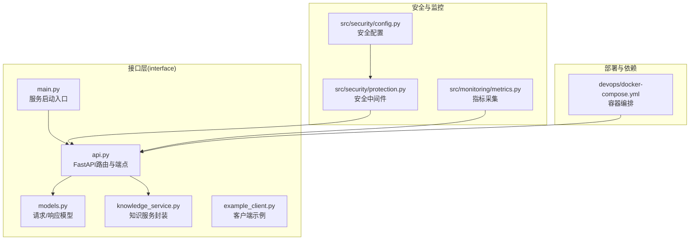
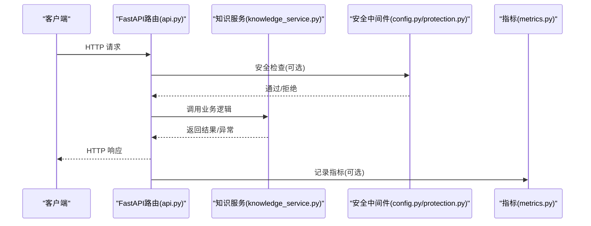
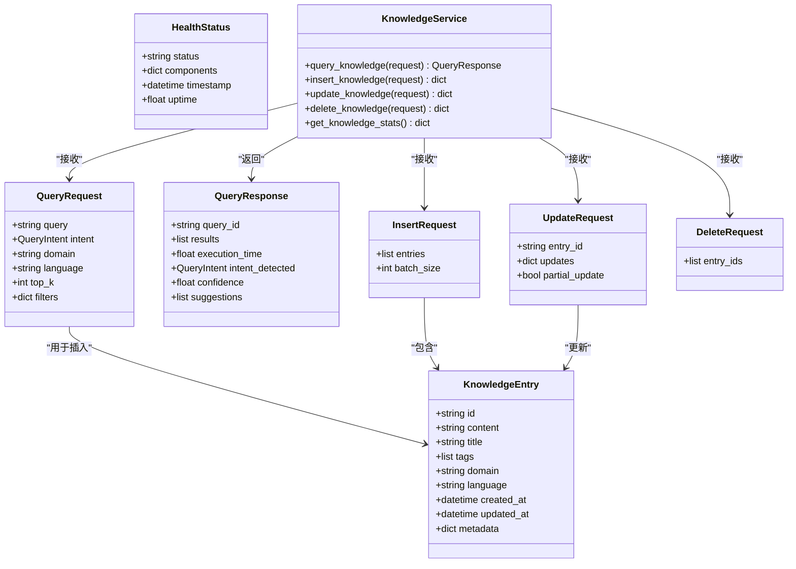

# RESTful API接口

<cite>
**本文档引用的文件**
- [api.py](file://interface/api.py)
- [models.py](file://interface/models.py)
- [knowledge_service.py](file://interface/knowledge_service.py)
- [example_client.py](file://interface/example_client.py)
- [main.py](file://interface/main.py)
- [docker-compose.yml](file://devops/docker-compose.yml)
- [config.py](file://src/security/config.py)
- [protection.py](file://src/security/protection.py)
- [metrics.py](file://src/monitoring/metrics.py)
</cite>

## 目录
1. [简介](#简介)
2. [项目结构](#项目结构)
3. [核心组件](#核心组件)
4. [架构总览](#架构总览)
5. [详细接口规范](#详细接口规范)
6. [依赖关系分析](#依赖关系分析)
7. [性能与优化](#性能与优化)
8. [故障排查](#故障排查)
9. [结论](#结论)
10. [附录](#附录)

## 简介
本文件为 NecoRAG 的 RESTful API 接口文档，覆盖健康检查、知识查询、知识插入、知识更新、知识删除、统计信息、查询建议等端点。文档提供每个端点的请求/响应模式定义、HTTP 方法、URL 路径、参数、响应格式、状态码与错误处理，并给出使用 curl 或编程语言调用示例。同时说明认证机制、CORS 配置与安全注意事项，并提供性能优化建议与最佳实践。

## 项目结构
接口服务位于 interface 模块，核心包括：
- FastAPI 应用与路由定义
- 数据模型定义（Pydantic）
- 知识服务封装（查询、插入、更新、删除、统计）
- 客户端示例与服务启动入口

**图表来源**
- [api.py:26-174](file://interface/api.py#L26-L174)
- [models.py:1-85](file://interface/models.py#L1-L85)
- [knowledge_service.py:27-307](file://interface/knowledge_service.py#L27-L307)
- [example_client.py:1-200](file://interface/example_client.py#L1-L200)
- [main.py:14-82](file://interface/main.py#L14-L82)
- [config.py:11-92](file://src/security/config.py#L11-L92)
- [protection.py:12-184](file://src/security/protection.py#L12-L184)
- [metrics.py:25-207](file://src/monitoring/metrics.py#L25-L207)
- [docker-compose.yml:1-164](file://devops/docker-compose.yml#L1-L164)

**章节来源**
- [api.py:26-174](file://interface/api.py#L26-L174)
- [models.py:1-85](file://interface/models.py#L1-L85)
- [knowledge_service.py:27-307](file://interface/knowledge_service.py#L27-L307)
- [main.py:14-82](file://interface/main.py#L14-L82)

## 核心组件
- FastAPI 应用与路由：定义健康检查、查询、插入、更新、删除、统计、建议等端点，配置 CORS。
- 数据模型：QueryRequest、QueryResponse、InsertRequest、UpdateRequest、DeleteRequest、HealthStatus 等。
- 知识服务：封装查询意图识别、多层检索、结果重排序、建议生成、统计聚合等。
- 客户端示例：演示如何使用 requests 与 websockets 调用 API。
- 安全与监控：安全配置与中间件、指标采集与导出。

**章节来源**
- [api.py:26-174](file://interface/api.py#L26-L174)
- [models.py:11-85](file://interface/models.py#L11-L85)
- [knowledge_service.py:27-307](file://interface/knowledge_service.py#L27-L307)
- [config.py:11-92](file://src/security/config.py#L11-L92)
- [protection.py:12-184](file://src/security/protection.py#L12-L184)
- [metrics.py:25-207](file://src/monitoring/metrics.py#L25-L207)

## 架构总览
NecoRAG 的 RESTful API 通过 FastAPI 提供，内部调用知识服务完成业务逻辑；安全中间件与配置可选启用；监控指标可导出 Prometheus 格式。

**图表来源**
- [api.py:56-174](file://interface/api.py#L56-L174)
- [knowledge_service.py:45-307](file://interface/knowledge_service.py#L45-L307)
- [config.py:11-92](file://src/security/config.py#L11-L92)
- [protection.py:12-184](file://src/security/protection.py#L12-L184)
- [metrics.py:177-207](file://src/monitoring/metrics.py#L177-L207)

## 详细接口规范

### 健康检查 /health
- 方法：GET
- 路径：/health
- 响应模型：HealthStatus
- 成功响应字段：
  - status: 字符串，服务状态（healthy/degraded/unhealthy）
  - components: 字典，各组件状态
  - timestamp: 时间戳
  - uptime: 运行时间（秒）

- 错误处理：
  - 服务内部异常时返回 unhealthy 状态与空时间戳。

- 示例：
  - curl: curl http://localhost:8000/health
  - 客户端示例：NecoRAGAPIClient.health_check()

**章节来源**
- [api.py:56-78](file://interface/api.py#L56-L78)
- [models.py:80-85](file://interface/models.py#L80-L85)
- [example_client.py:19-22](file://interface/example_client.py#L19-L22)

### 知识查询 /query
- 方法：POST
- 路径：/query
- 请求模型：QueryRequest
  - query: 查询内容
  - intent: 可选，查询意图枚举
  - domain: 可选，目标领域
  - language: 查询语言，默认 zh
  - top_k: 返回结果数量，默认 5
  - filters: 过滤条件字典
- 响应模型：QueryResponse
  - query_id: 查询ID
  - results: 检索结果列表
  - execution_time: 执行时间（秒）
  - intent_detected: 检测到的意图
  - confidence: 置信度
  - suggestions: 相关查询建议列表

- 错误处理：
  - 服务内部异常时抛出 500 错误。

- 示例：
  - curl: curl -X POST http://localhost:8000/query -H "Content-Type: application/json" -d '{"query":"什么是人工智能？","language":"zh","top_k":5}'
  - 客户端示例：NecoRAGAPIClient.query_knowledge("什么是人工智能？")

**章节来源**
- [api.py:80-91](file://interface/api.py#L80-L91)
- [models.py:35-52](file://interface/models.py#L35-L52)
- [example_client.py:24-36](file://interface/example_client.py#L24-L36)

### 知识插入 /insert
- 方法：POST
- 路径：/insert
- 请求模型：InsertRequest
  - entries: 知识条目列表（每项符合 KnowledgeEntry）
  - batch_size: 批处理大小，默认 100
- 响应：
  - success: 布尔
  - inserted_count: 成功插入数量
  - failed_count: 失败数量
  - inserted_ids: 成功ID列表
  - failed_entries: 失败条目列表（含错误信息）
  - timestamp: ISO 时间戳

- 错误处理：
  - 服务内部异常时抛出 500 错误。

- 示例：
  - curl: curl -X POST http://localhost:8000/insert -H "Content-Type: application/json" -d '{"entries":[{"content":"测试内容","title":"测试条目","tags":["测试"],"domain":"example"}],"batch_size":100}'
  - 客户端示例：NecoRAGAPIClient.insert_knowledge([...])

**章节来源**
- [api.py:93-104](file://interface/api.py#L93-L104)
- [models.py:55-58](file://interface/models.py#L55-L58)
- [example_client.py:38-45](file://interface/example_client.py#L38-L45)

### 知识更新 /update
- 方法：PUT
- 路径：/update
- 请求模型：UpdateRequest
  - entry_id: 要更新的知识条目ID
  - updates: 更新内容字典
  - partial_update: 是否部分更新，默认 True
- 响应：
  - success: 布尔
  - entry_id: 更新的条目ID
  - updated_fields: 更新字段列表
  - timestamp: ISO 时间戳

- 错误处理：
  - 服务内部异常时抛出 500 错误。

- 示例：
  - curl: curl -X PUT http://localhost:8000/update -H "Content-Type: application/json" -d '{"entry_id":"xxx","updates":{"title":"新标题"},"partial_update":true}'

**章节来源**
- [api.py:106-117](file://interface/api.py#L106-L117)
- [models.py:61-65](file://interface/models.py#L61-L65)

### 知识删除 /delete
- 方法：DELETE
- 路径：/delete
- 请求模型：DeleteRequest
  - entry_ids: 要删除的知识条目ID列表
- 响应：
  - success: 布尔
  - deleted_count: 成功删除数量
  - failed_count: 删除失败数量
  - deleted_ids: 成功删除ID列表
  - failed_ids: 失败ID列表（含错误信息）
  - timestamp: ISO 时间戳

- 错误处理：
  - 服务内部异常时抛出 500 错误。

- 示例：
  - curl: curl -X DELETE http://localhost:8000/delete -H "Content-Type: application/json" -d '{"entry_ids":["id1","id2"]}'

**章节来源**
- [api.py:119-130](file://interface/api.py#L119-L130)
- [models.py:68-70](file://interface/models.py#L68-L70)

### 统计信息 /stats
- 方法：GET
- 路径：/stats
- 响应：
  - total_entries: 总条目数
  - by_domain: 领域分布
  - by_language: 语言分布
  - recent_updates: 最近更新列表
  - health_status: 健康状态
  - timestamp: ISO 时间戳

- 错误处理：
  - 服务内部异常时抛出 500 错误。

- 示例：
  - curl: curl http://localhost:8000/stats
  - 客户端示例：NecoRAGAPIClient.get_stats()

**章节来源**
- [api.py:132-143](file://interface/api.py#L132-L143)
- [example_client.py:47-50](file://interface/example_client.py#L47-L50)

### 查询建议 /suggestions/{query}
- 方法：GET
- 路径：/suggestions/{query}
- 路径参数：
  - query: 查询字符串
- 响应：
  - query: 原始查询
  - suggestions: 建议列表（示例：基于输入生成的相关建议）

- 错误处理：
  - 服务内部异常时抛出 500 错误。

- 示例：
  - curl: curl http://localhost:8000/suggestions/人工智能

**章节来源**
- [api.py:145-157](file://interface/api.py#L145-L157)

## 依赖关系分析

**图表来源**
- [models.py:11-85](file://interface/models.py#L11-L85)
- [knowledge_service.py:27-307](file://interface/knowledge_service.py#L27-L307)

**章节来源**
- [models.py:11-85](file://interface/models.py#L11-L85)
- [knowledge_service.py:27-307](file://interface/knowledge_service.py#L27-L307)

## 性能与优化
- CORS 配置：默认允许任意来源、方法与头，便于前端跨域访问，生产环境建议限定来源与方法。
- 速率限制：可选的安全中间件 RateLimiter 支持按 IP 与时间窗口限制请求频率。
- 指标监控：ApplicationMetrics 与 SystemMetrics 提供 API 调用耗时、缓存命中、模型推理时间等指标，可导出 Prometheus 格式。
- 建议：
  - 对高频查询启用缓存（如查询结果缓存）。
  - 合理设置 top_k 与 filters，减少检索成本。
  - 使用批量插入（InsertRequest.batch_size）降低网络往返。
  - 在网关层启用 gzip 压缩与连接复用。
  - 生产环境配置 JWT/OAuth2 认证与 HTTPS。

**章节来源**
- [api.py:36-43](file://interface/api.py#L36-L43)
- [protection.py:36-67](file://src/security/protection.py#L36-L67)
- [metrics.py:177-207](file://src/monitoring/metrics.py#L177-L207)
- [config.py:11-92](file://src/security/config.py#L11-L92)

## 故障排查
- 健康检查失败：检查知识服务统计接口是否可用，确认各组件状态。
- 500 错误：查看服务日志，定位知识服务中的异常；必要时启用更详细的日志级别。
- CORS 问题：若前端跨域失败，检查 CORS 配置或在生产环境限制允许的来源。
- 安全相关：如需启用速率限制、CSRF/XSS 保护，请在安全配置中开启相应开关并正确部署。

**章节来源**
- [api.py:56-78](file://interface/api.py#L56-L78)
- [config.py:11-92](file://src/security/config.py#L11-L92)
- [protection.py:148-184](file://src/security/protection.py#L148-L184)

## 结论
本文档提供了 NecoRAG RESTful API 的完整接口规范与使用指南，涵盖数据模型、端点定义、错误处理与性能优化建议。结合安全配置与监控指标，可在生产环境中稳定运行并持续优化。

## 附录

### 认证与安全
- CORS：默认允许任意来源与方法，生产环境建议限制来源与方法。
- 安全中间件：提供速率限制、CSRF、XSS 等保护，可通过配置启用。
- 认证：安全配置支持 JWT/OAuth2，可按需启用。

**章节来源**
- [api.py:36-43](file://interface/api.py#L36-L43)
- [config.py:11-92](file://src/security/config.py#L11-L92)
- [protection.py:148-184](file://src/security/protection.py#L148-L184)

### 部署与运行
- 本地启动：通过 InterfaceService 同时启动 RESTful API 与 WebSocket 服务。
- Docker 编排：devops/docker-compose.yml 提供统一编排，包含 Redis、Qdrant、Neo4j、Ollama、Grafana 等服务。

**章节来源**
- [main.py:30-72](file://interface/main.py#L30-L72)
- [docker-compose.yml:118-147](file://devops/docker-compose.yml#L118-L147)