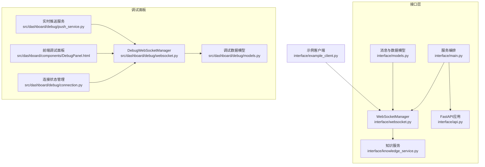
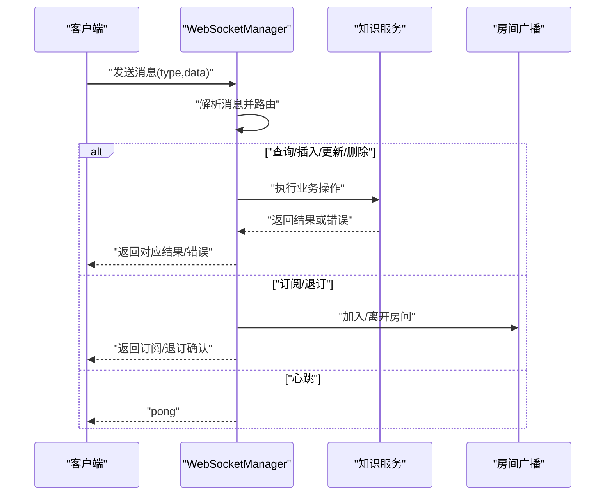
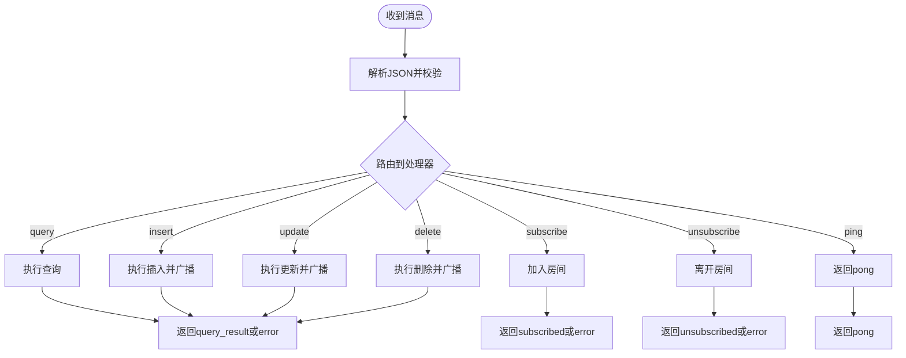
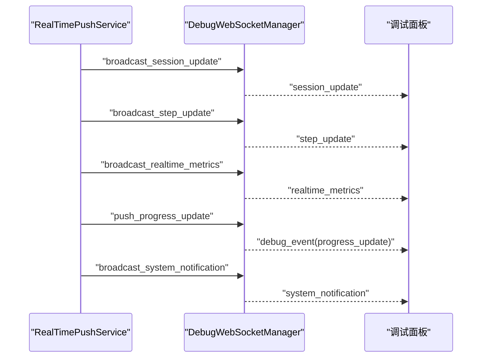
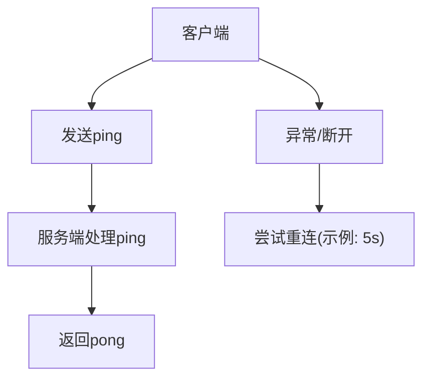
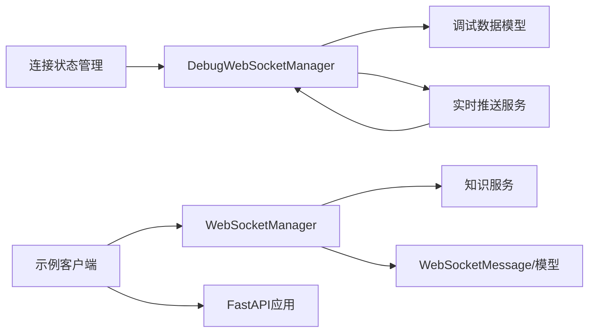

# WebSocket实时通信接口

<cite>
**本文引用的文件**
- [interface/websocket.py](file://interface/websocket.py)
- [interface/models.py](file://interface/models.py)
- [interface/main.py](file://interface/main.py)
- [interface/knowledge_service.py](file://interface/knowledge_service.py)
- [interface/api.py](file://interface/api.py)
- [interface/example_client.py](file://interface/example_client.py)
- [src/dashboard/debug/websocket.py](file://src/dashboard/debug/websocket.py)
- [src/dashboard/debug/models.py](file://src/dashboard/debug/models.py)
- [src/dashboard/debug/push_service.py](file://src/dashboard/debug/push_service.py)
- [src/dashboard/debug/connection.py](file://src/dashboard/debug/connection.py)
- [src/dashboard/components/DebugPanel.html](file://src/dashboard/components/DebugPanel.html)
</cite>

## 目录
1. [简介](#简介)
2. [项目结构](#项目结构)
3. [核心组件](#核心组件)
4. [架构总览](#架构总览)
5. [详细组件分析](#详细组件分析)
6. [依赖关系分析](#依赖关系分析)
7. [性能考量](#性能考量)
8. [故障排除指南](#故障排除指南)
9. [结论](#结论)
10. [附录](#附录)

## 简介
本文件面向NecoRAG的WebSocket实时通信接口，提供从连接建立、消息格式、事件类型、实时推送机制到错误处理、重连策略、性能调优与安全配置的完整文档。文档同时覆盖知识库更新通知、查询进度跟踪、系统状态变更等事件，并给出JavaScript与Python等主流语言的客户端实现示例与最佳实践。

## 项目结构
NecoRAG的实时通信能力主要分布在以下模块：
- 接口层WebSocket服务：提供知识库操作与房间订阅的实时通道
- 调试面板WebSocket服务：提供调试会话、证据、推理、性能指标等实时推送
- API层：RESTful接口与WebSocket服务共同构成统一的对外接口
- 示例客户端：展示如何使用WebSocket进行查询、订阅与收听实时事件

图表来源
- [interface/websocket.py:18-299](file://interface/websocket.py#L18-L299)
- [interface/api.py:26-174](file://interface/api.py#L26-L174)
- [interface/main.py:14-82](file://interface/main.py#L14-L82)
- [interface/models.py:73-85](file://interface/models.py#L73-L85)
- [interface/knowledge_service.py:27-307](file://interface/knowledge_service.py#L27-L307)
- [src/dashboard/debug/websocket.py:49-554](file://src/dashboard/debug/websocket.py#L49-L554)
- [src/dashboard/debug/models.py:186-336](file://src/dashboard/debug/models.py#L186-L336)
- [src/dashboard/debug/push_service.py:16-258](file://src/dashboard/debug/push_service.py#L16-L258)
- [src/dashboard/debug/connection.py:315-595](file://src/dashboard/debug/connection.py#L315-L595)
- [src/dashboard/components/DebugPanel.html:428-454](file://src/dashboard/components/DebugPanel.html#L428-L454)

章节来源
- [interface/main.py:30-73](file://interface/main.py#L30-L73)
- [interface/websocket.py:27-36](file://interface/websocket.py#L27-L36)

## 核心组件
- WebSocketManager：负责知识库操作的WebSocket服务，支持查询、插入、更新、删除、订阅/退订、心跳等消息类型；提供房间广播与错误推送。
- DebugWebSocketManager：负责调试面板的WebSocket服务，支持会话更新、步骤更新、性能指标、证据与推理更新、系统通知、实时指标等事件推送。
- WebSocketMessage/数据模型：统一的WebSocket消息格式与知识库操作请求/响应模型。
- RealTimePushService：封装调试会话的实时推送流程，包括会话开始/结束、步骤推进、性能快照、进度更新等。
- 连接状态管理：维护连接生命周期、健康检查、告警与清理策略。
- 示例客户端：展示JavaScript与Python的WebSocket客户端实现。

章节来源
- [interface/websocket.py:18-299](file://interface/websocket.py#L18-L299)
- [src/dashboard/debug/websocket.py:49-554](file://src/dashboard/debug/websocket.py#L49-L554)
- [interface/models.py:73-85](file://interface/models.py#L73-L85)
- [src/dashboard/debug/push_service.py:16-133](file://src/dashboard/debug/push_service.py#L16-L133)
- [src/dashboard/debug/connection.py:315-595](file://src/dashboard/debug/connection.py#L315-L595)
- [interface/example_client.py:53-93](file://interface/example_client.py#L53-L93)

## 架构总览
WebSocket实时通信分为两条主线：
- 知识库实时通道：通过WebSocketManager提供查询、插入、更新、删除等操作的实时响应，并支持房间订阅以推送知识库变更事件。
- 调试面板实时通道：通过DebugWebSocketManager提供调试会话的全链路实时数据流，包括检索步骤、证据、推理、性能指标、系统通知与进度更新。

图表来源
- [interface/websocket.py:52-88](file://interface/websocket.py#L52-L88)
- [interface/websocket.py:90-186](file://interface/websocket.py#L90-L186)
- [interface/websocket.py:188-221](file://interface/websocket.py#L188-L221)

## 详细组件分析

### WebSocket消息格式与事件类型
- 消息基础结构
  - type：消息类型，如query、insert、update、delete、subscribe、unsubscribe、ping
  - data：消息体，承载具体参数
  - timestamp：消息时间戳
- 事件类型
  - query_result：查询结果
  - insert_result/updated/deleted：插入/更新/删除结果
  - subscribed/unsubscribed：订阅/退订确认
  - error：错误消息
  - pong：心跳响应
- 房间订阅
  - 客户端通过subscribe/unsubscribe加入/离开房间
  - 系统在知识库变更时向房间广播inserted/updated/deleted等事件

图表来源
- [interface/websocket.py:52-88](file://interface/websocket.py#L52-L88)
- [interface/websocket.py:90-186](file://interface/websocket.py#L90-L186)
- [interface/websocket.py:188-221](file://interface/websocket.py#L188-L221)

章节来源
- [interface/models.py:73-78](file://interface/models.py#L73-L78)
- [interface/websocket.py:52-88](file://interface/websocket.py#L52-L88)

### 知识库实时推送机制
- 知识库变更通知
  - 插入/更新/删除成功后，系统向“knowledge_updates”房间广播inserted/updated/deleted事件
- 查询进度跟踪
  - 当前WebSocket接口未直接提供查询进度事件；可通过RESTful接口获取查询结果与建议
- 系统状态变更
  - 通过错误消息与房间广播实现状态变更通知

章节来源
- [interface/websocket.py:117-122](file://interface/websocket.py#L117-L122)
- [interface/websocket.py:143-148](file://interface/websocket.py#L143-L148)
- [interface/websocket.py:169-174](file://interface/websocket.py#L169-L174)

### 调试面板实时推送机制
- 会话更新：会话开始、步骤推进、完成/失败
- 性能指标：实时指标推送与性能快照
- 证据与推理：证据新增、推理链更新
- 系统通知：系统心跳、告警等
- 进度更新：会话整体进度与消息

图表来源
- [src/dashboard/debug/push_service.py:63-133](file://src/dashboard/debug/push_service.py#L63-L133)
- [src/dashboard/debug/websocket.py:200-261](file://src/dashboard/debug/websocket.py#L200-L261)
- [src/dashboard/debug/websocket.py:505-516](file://src/dashboard/debug/websocket.py#L505-L516)
- [src/dashboard/debug/websocket.py:536-544](file://src/dashboard/debug/websocket.py#L536-L544)
- [src/dashboard/debug/websocket.py:492-503](file://src/dashboard/debug/websocket.py#L492-L503)

章节来源
- [src/dashboard/debug/push_service.py:16-133](file://src/dashboard/debug/push_service.py#L16-L133)
- [src/dashboard/debug/websocket.py:492-516](file://src/dashboard/debug/websocket.py#L492-L516)

### 心跳机制、错误处理与重连策略
- 心跳
  - 客户端发送ping，服务端返回pong
- 错误处理
  - 解析失败、路由失败、业务异常均返回error消息
- 重连策略
  - 前端示例展示了断线后5秒重连的策略
- 连接管理
  - DebugWebSocketManager提供连接接受、断开、订阅管理与清理任务

图表来源
- [interface/websocket.py:215-221](file://interface/websocket.py#L215-L221)
- [interface/websocket.py:62-66](file://interface/websocket.py#L62-L66)
- [src/dashboard/components/DebugPanel.html:443-448](file://src/dashboard/components/DebugPanel.html#L443-L448)
- [src/dashboard/debug/websocket.py:92-130](file://src/dashboard/debug/websocket.py#L92-L130)

章节来源
- [interface/websocket.py:215-221](file://interface/websocket.py#L215-L221)
- [src/dashboard/components/DebugPanel.html:443-448](file://src/dashboard/components/DebugPanel.html#L443-L448)
- [src/dashboard/debug/websocket.py:92-130](file://src/dashboard/debug/websocket.py#L92-L130)

### 客户端实现示例

#### JavaScript客户端
- 连接与消息发送
  - 建立WebSocket连接，发送包含type/data/timestamp的消息，接收响应
- 订阅与退订
  - 通过subscribe/unsubscribe加入/离开房间
- 重连策略
  - 断线后定时重连

章节来源
- [interface/example_client.py:60-93](file://interface/example_client.py#L60-L93)
- [src/dashboard/components/DebugPanel.html:428-454](file://src/dashboard/components/DebugPanel.html#L428-L454)

#### Python客户端
- 使用websockets库建立连接
- 发送消息并等待响应
- 支持查询、订阅、退订等操作

章节来源
- [interface/example_client.py:53-93](file://interface/example_client.py#L53-L93)

### 实时监控与调试信息
- 调试会话模型：包含检索步骤、证据来源、推理链、性能指标、状态等
- 实时推送服务：按会话生命周期推送步骤、证据、推理、性能与系统通知
- 连接状态管理：记录连接状态、健康检查、告警与清理

章节来源
- [src/dashboard/debug/models.py:186-276](file://src/dashboard/debug/models.py#L186-L276)
- [src/dashboard/debug/push_service.py:63-133](file://src/dashboard/debug/push_service.py#L63-L133)
- [src/dashboard/debug/connection.py:315-595](file://src/dashboard/debug/connection.py#L315-L595)

## 依赖关系分析
- WebSocketManager依赖知识服务进行查询与写入操作，并通过房间广播实现事件推送
- DebugWebSocketManager依赖调试数据模型与推送服务，提供丰富的实时事件
- 连接状态管理器为调试面板提供连接生命周期与健康监控
- 示例客户端依赖WebSocketManager与API层

图表来源
- [interface/websocket.py:14-15](file://interface/websocket.py#L14-L15)
- [interface/knowledge_service.py:27-307](file://interface/knowledge_service.py#L27-L307)
- [src/dashboard/debug/websocket.py:49-554](file://src/dashboard/debug/websocket.py#L49-L554)
- [src/dashboard/debug/models.py:186-336](file://src/dashboard/debug/models.py#L186-L336)
- [src/dashboard/debug/push_service.py:16-258](file://src/dashboard/debug/push_service.py#L16-L258)
- [src/dashboard/debug/connection.py:315-595](file://src/dashboard/debug/connection.py#L315-L595)
- [interface/example_client.py:53-93](file://interface/example_client.py#L53-L93)
- [interface/api.py:26-174](file://interface/api.py#L26-L174)

章节来源
- [interface/websocket.py:14-15](file://interface/websocket.py#L14-L15)
- [src/dashboard/debug/websocket.py:49-554](file://src/dashboard/debug/websocket.py#L49-L554)

## 性能考量
- 并发与广播
  - 房间广播采用并发发送，注意避免阻塞；可考虑背压与限流
- 清理与资源回收
  - DebugWebSocketManager提供清理任务与连接清理策略，建议根据负载调整清理周期
- 心跳与超时
  - ping/pong用于保持连接活性，建议结合客户端重连策略与服务端超时配置
- 事件频率控制
  - 实时推送服务对证据与推理推送设置了节流，避免过载

章节来源
- [src/dashboard/debug/websocket.py:398-421](file://src/dashboard/debug/websocket.py#L398-L421)
- [src/dashboard/debug/push_service.py:134-156](file://src/dashboard/debug/push_service.py#L134-L156)

## 故障排除指南
- 连接失败
  - 检查服务端端口与主机绑定；确认防火墙与反向代理配置
- 消息解析错误
  - 确认消息格式符合WebSocketMessage结构；检查JSON合法性
- 订阅无效
  - 确认房间名一致；检查订阅/退订流程
- 重连失败
  - 前端示例采用固定间隔重连，可根据网络状况调整重连策略
- 调试面板无数据
  - 确认会话已注册；检查推送服务是否启动；核对订阅关系

章节来源
- [interface/websocket.py:62-66](file://interface/websocket.py#L62-L66)
- [src/dashboard/components/DebugPanel.html:443-448](file://src/dashboard/components/DebugPanel.html#L443-L448)
- [src/dashboard/debug/websocket.py:92-130](file://src/dashboard/debug/websocket.py#L92-L130)

## 结论
NecoRAG的WebSocket接口提供了两类实时通信能力：知识库操作的实时响应与房间广播，以及调试面板的全链路实时数据流。通过统一的消息格式、清晰的事件类型与完善的错误处理与重连策略，开发者可以构建稳定可靠的实时应用。建议在生产环境中结合连接清理、心跳与超时配置、事件频率控制等手段，持续优化性能与稳定性。

## 附录

### API使用示例与最佳实践
- 使用RESTful API进行健康检查、查询、插入、更新、删除与统计
- 使用WebSocket进行实时查询与房间订阅
- 建议在客户端实现指数退避重连、心跳保活与错误上报

章节来源
- [interface/api.py:56-143](file://interface/api.py#L56-L143)
- [interface/example_client.py:96-194](file://interface/example_client.py#L96-L194)