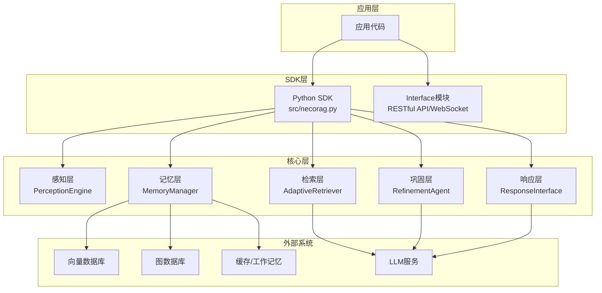
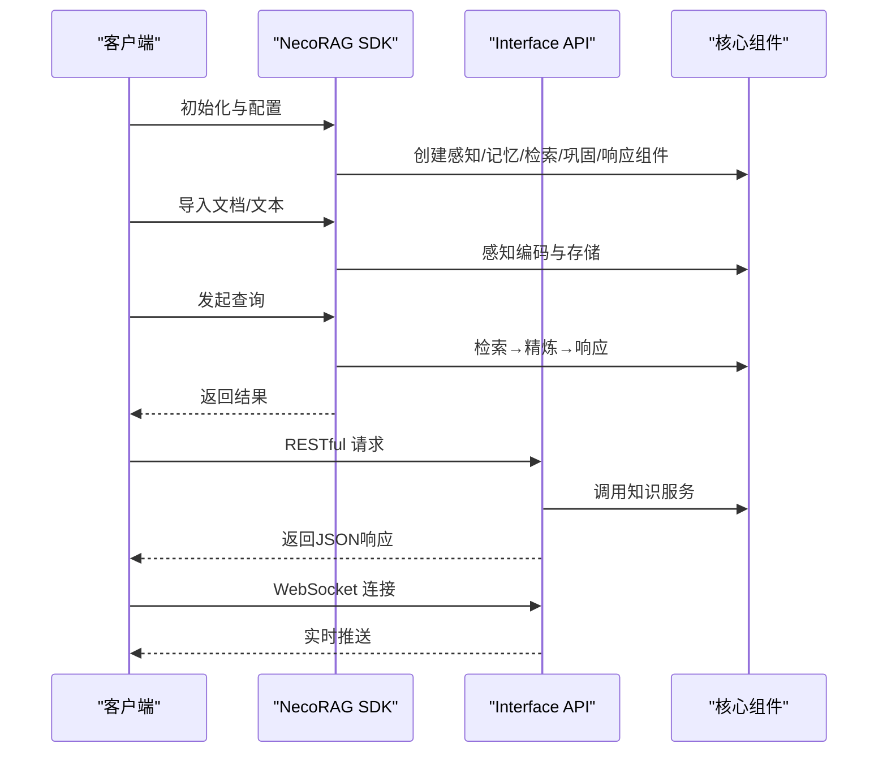
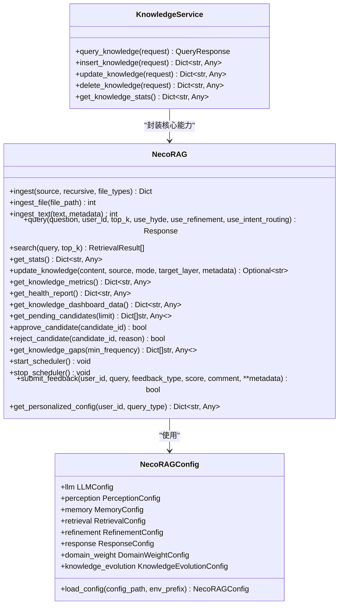
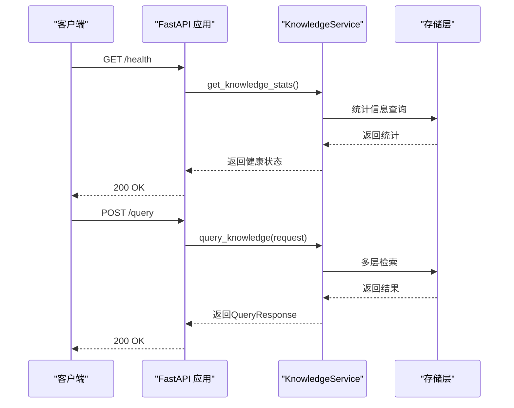
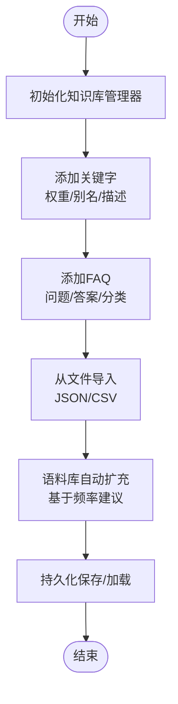
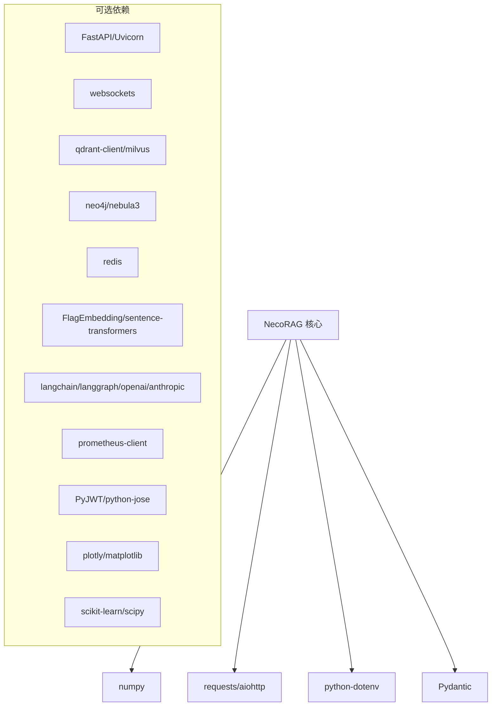

# 客户端SDK与集成指南

<cite>
**本文档引用的文件**
- [README.md](file://README.md)
- [QUICKSTART.md](file://QUICKSTART.md)
- [requirements.txt](file://requirements.txt)
- [pyproject.toml](file://pyproject.toml)
- [src/necorag.py](file://src/necorag.py)
- [src/core/config.py](file://src/core/config.py)
- [src/core/exceptions.py](file://src/core/exceptions.py)
- [src/core/base.py](file://src/core/base.py)
- [src/__init__.py](file://src/__init__.py)
- [interface/__init__.py](file://interface/__init__.py)
- [interface/api.py](file://interface/api.py)
- [interface/models.py](file://interface/models.py)
- [interface/knowledge_service.py](file://interface/knowledge_service.py)
- [interface/example_client.py](file://interface/example_client.py)
- [example/example_usage.py](file://example/example_usage.py)
- [example/knowledge_base_integration.py](file://example/knowledge_base_integration.py)
- [example/knowledge_base_example.py](file://example/knowledge_base_example.py)
</cite>

## 目录
1. [简介](#简介)
2. [项目结构](#项目结构)
3. [核心组件](#核心组件)
4. [架构总览](#架构总览)
5. [详细组件分析](#详细组件分析)
6. [依赖关系分析](#依赖关系分析)
7. [性能考虑](#性能考虑)
8. [故障排除指南](#故障排除指南)
9. [结论](#结论)
10. [附录](#附录)

## 简介
本指南面向希望在应用中集成 NecoRAG 客户端 SDK 的开发者，提供从安装、配置到完整 API 调用流程的详细说明。文档重点涵盖：
- Python SDK 的使用方法与最佳实践
- 客户端初始化配置（API 端点、认证、连接参数）
- 从基础查询到复杂知识库管理的完整调用流程
- 错误处理与异常管理策略
- 性能优化建议（连接池、批量操作、缓存策略）
- 故障排除与常见问题解决方案

## 项目结构
NecoRAG 采用模块化分层架构，核心能力通过统一入口类对外提供，并配套 RESTful API 与 WebSocket 接口，便于多语言客户端集成。

**图表来源**
- [src/necorag.py:51-148](file://src/necorag.py#L51-L148)
- [src/perception/__init__.py](file://src/perception/__init__.py)
- [src/memory/__init__.py](file://src/memory/__init__.py)
- [src/retrieval/__init__.py](file://src/retrieval/__init__.py)
- [src/refinement/__init__.py](file://src/refinement/__init__.py)
- [src/response/__init__.py](file://src/response/__init__.py)

**章节来源**
- [README.md:52-183](file://README.md#L52-L183)
- [src/__init__.py:9-226](file://src/__init__.py#L9-L226)

## 核心组件
- NecoRAG 统一入口类：提供文档导入、查询、知识演化、自适应学习等统一 API
- 配置系统：集中管理 LLM、感知、记忆、检索、巩固、响应等模块配置
- 异常体系：统一的错误类型与结构化错误信息
- Interface 模块：提供 RESTful API 与 WebSocket 接口，便于多语言客户端接入

**章节来源**
- [src/necorag.py:51-148](file://src/necorag.py#L51-L148)
- [src/core/config.py:278-334](file://src/core/config.py#L278-L334)
- [src/core/exceptions.py:10-455](file://src/core/exceptions.py#L10-L455)
- [interface/api.py:26-174](file://interface/api.py#L26-L174)

## 架构总览
NecoRAG 采用五层认知架构，从感知层到交互层形成完整的闭环。Python SDK 通过统一入口类封装各层能力，同时提供 RESTful API 与 WebSocket 接口，满足不同场景的集成需求。

**图表来源**
- [src/necorag.py:237-514](file://src/necorag.py#L237-L514)
- [interface/api.py:80-143](file://interface/api.py#L80-L143)
- [interface/knowledge_service.py:45-76](file://interface/knowledge_service.py#L45-L76)

**章节来源**
- [README.md:56-102](file://README.md#L56-L102)
- [QUICKSTART.md:120-134](file://QUICKSTART.md#L120-L134)

## 详细组件分析

### Python SDK 使用指南
- 安装与导入
  - 通过包管理器安装依赖，参考 requirements.txt 与 pyproject.toml
  - 从 src.__init__ 导入统一入口类与核心模块
- 初始化与配置
  - 使用 NecoRAGConfig 与 ConfigPresets 进行配置管理
  - 可通过环境变量覆盖关键配置项
- 基础查询流程
  - 文档导入：支持文件与文本两种方式
  - 查询：可选择是否使用 HyDE 增强、答案精炼与意图路由
- 知识库管理
  - 知识演化：实时更新、定时更新、候选审核、健康报告
  - 自适应学习：反馈收集、策略优化、偏好预测

**图表来源**
- [src/necorag.py:51-758](file://src/necorag.py#L51-L758)
- [src/core/config.py:278-334](file://src/core/config.py#L278-L334)
- [interface/knowledge_service.py:27-307](file://interface/knowledge_service.py#L27-L307)

**章节来源**
- [src/necorag.py:75-148](file://src/necorag.py#L75-L148)
- [src/core/config.py:338-377](file://src/core/config.py#L338-L377)
- [src/core/base.py:1-869](file://src/core/base.py#L1-L869)

### RESTful API 与 WebSocket 集成
- RESTful API
  - 提供健康检查、查询、插入、更新、删除、统计等接口
  - 支持插件市场路由（可选）
- WebSocket
  - 实现实时消息推送与订阅功能
  - 适用于需要低延迟交互的场景

**图表来源**
- [interface/api.py:56-143](file://interface/api.py#L56-L143)
- [interface/knowledge_service.py:45-76](file://interface/knowledge_service.py#L45-L76)

**章节来源**
- [interface/api.py:26-174](file://interface/api.py#L26-L174)
- [interface/models.py:11-85](file://interface/models.py#L11-L85)
- [interface/knowledge_service.py:27-307](file://interface/knowledge_service.py#L27-L307)
- [interface/example_client.py:13-200](file://interface/example_client.py#L13-L200)

### 知识库管理与领域权重系统
- 关键字与 FAQ 管理
  - 支持关键字级别、权重、别名与描述
  - FAQ 搜索与匹配
- 文档权重计算
  - 结合时间衰减、领域相关性与新颖性评分
- 批量导入与持续学习
  - 支持从文件批量导入关键字
  - 基于语料库自动扩充关键字

**图表来源**
- [example/knowledge_base_integration.py:21-363](file://example/knowledge_base_integration.py#L21-L363)
- [example/knowledge_base_example.py:23-305](file://example/knowledge_base_example.py#L23-L305)

**章节来源**
- [example/knowledge_base_integration.py:21-363](file://example/knowledge_base_integration.py#L21-L363)
- [example/knowledge_base_example.py:23-305](file://example/knowledge_base_example.py#L23-L305)

## 依赖关系分析
- 核心依赖
  - numpy、packaging、python-dateutil、aiohttp、requests、python-dotenv、pydantic
- 可选模块
  - FastAPI、Uvicorn、websockets（Dashboard 与 API）
  - 向量数据库、图数据库、缓存、嵌入模型、LLM 集成、监控、安全、可视化、自适应优化等
- 可选依赖分组
  - intent、intent-ml、intent-fasttext（意图分析）
  - scheduler、scheduler-distributed（调度）
  - dashboard、monitoring、security（功能增强）

**图表来源**
- [requirements.txt:12-161](file://requirements.txt#L12-L161)
- [pyproject.toml:27-81](file://pyproject.toml#L27-L81)

**章节来源**
- [requirements.txt:1-161](file://requirements.txt#L1-L161)
- [pyproject.toml:1-101](file://pyproject.toml#L1-L101)

## 性能考虑
- 连接池与并发
  - 使用 aiohttp 进行异步 HTTP 请求，减少阻塞
  - RESTful API 使用 Uvicorn，支持多进程与异步处理
- 批量操作
  - 批量插入/更新接口，降低网络往返开销
  - 向量编码与检索支持批量处理
- 缓存策略
  - L1 工作记忆使用 Redis，支持 TTL 与快速过期
  - 结果缓存与查询建议缓存，提升响应速度
- 检索优化
  - 启用 HyDE 增强与重排序，提高检索质量
  - 早停机制在置信度达标时提前终止检索
- 监控与告警
  - Prometheus 指标收集，Grafana 可视化
  - Dashboard 实时监控系统状态

**章节来源**
- [src/core/config.py:158-193](file://src/core/config.py#L158-L193)
- [src/necorag.py:237-337](file://src/necorag.py#L237-L337)
- [requirements.txt:23-26](file://requirements.txt#L23-L26)

## 故障排除指南
- 常见异常类型
  - ParseError、ChunkingError、EncodingError（感知层）
  - MemoryError、VectorStoreError、GraphStoreError（记忆层）
  - RetrievalError、RerankError（检索层）
  - GenerationError、HallucinationError、RefinementError（巩固层）
  - LLMError、LLMConnectionError、LLMRateLimitError、LLMResponseError（LLM 相关）
  - ConfigurationError、ValidationError（配置与校验）
  - KnowledgeEvolutionError、UpdateError、CandidateError、MetricsCalculationError、SchedulerError、RollbackError（知识演化）
  - AdaptiveLearningError、FeedbackError、StrategyOptimizationError、PreferencePredictionError（自适应学习）
- 错误处理最佳实践
  - 使用统一异常基类 NecoRAGError，便于捕获与分类
  - 在 API 层将内部异常转换为 HTTP 错误码与结构化错误信息
  - 记录详细日志，包含错误码、消息与上下文详情
  - 对网络与外部服务错误实现重试与熔断策略
- 常见问题
  - 依赖安装：根据功能模块选择性安装可选依赖
  - 端口冲突：修改 Dashboard 端口或停止占用进程
  - 配置覆盖：通过环境变量覆盖关键配置项
  - 性能瓶颈：启用异步、批量处理与缓存，监控系统指标

**章节来源**
- [src/core/exceptions.py:10-455](file://src/core/exceptions.py#L10-L455)
- [interface/api.py:86-130](file://interface/api.py#L86-L130)
- [QUICKSTART.md:380-431](file://QUICKSTART.md#L380-L431)

## 结论
NecoRAG 提供了从感知到交互的完整认知型 RAG 能力，并通过 Python SDK 与 Interface 模块为多语言客户端提供了灵活的集成方案。通过合理的配置管理、异常处理与性能优化策略，可以在生产环境中稳定高效地运行复杂的知识检索与生成任务。

## 附录

### 安装与配置步骤
- 安装核心依赖
  - pip install -r requirements.txt
- 安装可选功能
  - 按需安装意图分析、调度、Dashboard、监控、安全、可视化、自适应优化等模块
- 环境变量配置
  - 通过环境变量覆盖 LLM 提供商、模型、API Key、向量/图数据库配置等

**章节来源**
- [requirements.txt:144-161](file://requirements.txt#L144-L161)
- [src/core/config.py:338-377](file://src/core/config.py#L338-L377)

### API 参考（核心接口）
- 健康检查：GET /health
- 知识查询：POST /query
- 插入知识：POST /insert
- 更新知识：PUT /update
- 删除知识：DELETE /delete
- 统计信息：GET /stats
- 查询建议：GET /suggestions/{query}

**章节来源**
- [interface/api.py:56-143](file://interface/api.py#L56-L143)
- [interface/models.py:11-85](file://interface/models.py#L11-L85)

### 集成示例路径
- Python SDK 完整使用示例：[example/example_usage.py:1-252](file://example/example_usage.py#L1-L252)
- 知识库管理集成示例：[example/knowledge_base_integration.py:1-363](file://example/knowledge_base_integration.py#L1-L363)
- 知识库管理示例：[example/knowledge_base_example.py:1-305](file://example/knowledge_base_example.py#L1-L305)
- Interface 客户端示例：[interface/example_client.py:1-200](file://interface/example_client.py#L1-L200)

**章节来源**
- [example/example_usage.py:1-252](file://example/example_usage.py#L1-L252)
- [example/knowledge_base_integration.py:1-363](file://example/knowledge_base_integration.py#L1-L363)
- [example/knowledge_base_example.py:1-305](file://example/knowledge_base_example.py#L1-L305)
- [interface/example_client.py:1-200](file://interface/example_client.py#L1-L200)