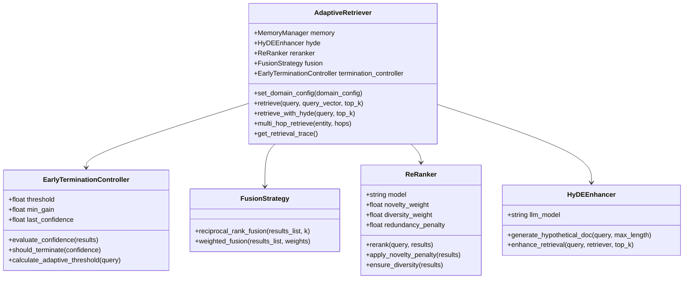
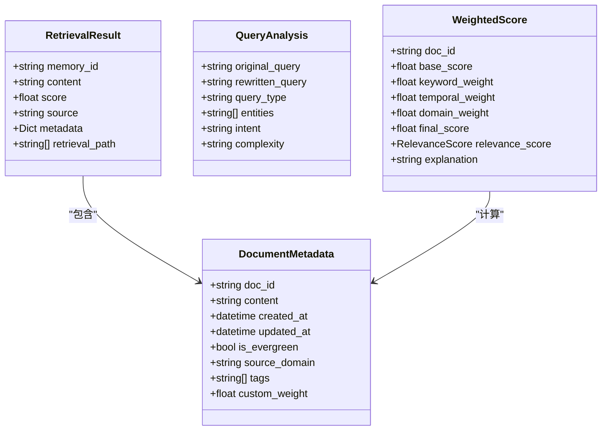
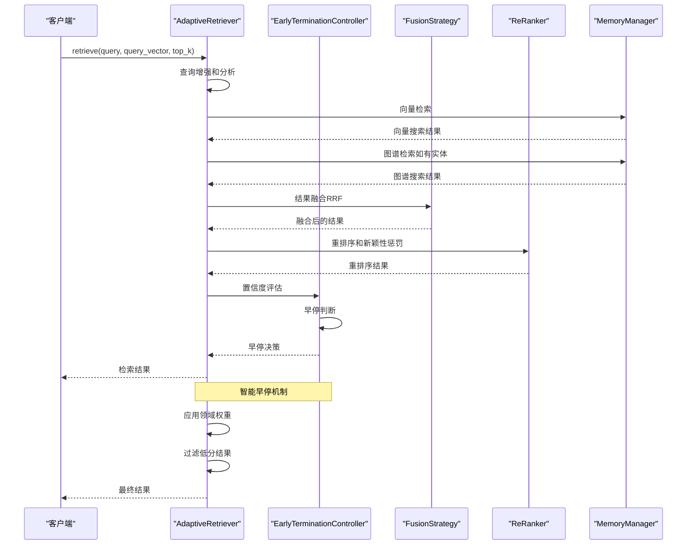
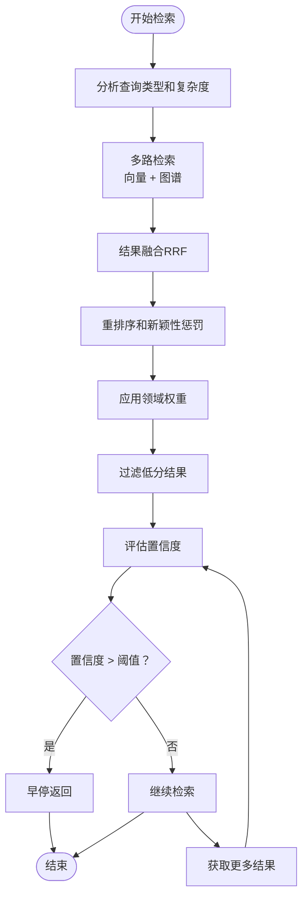
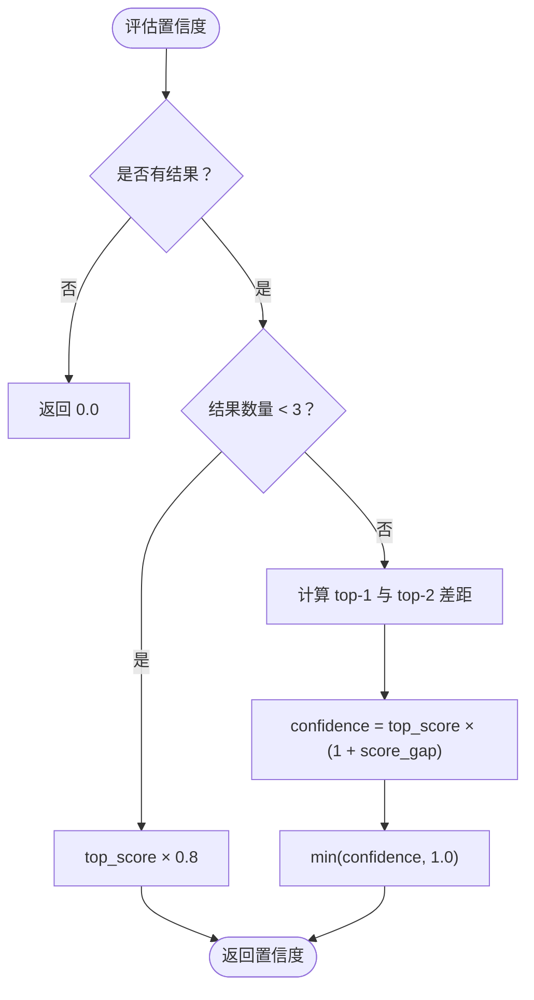
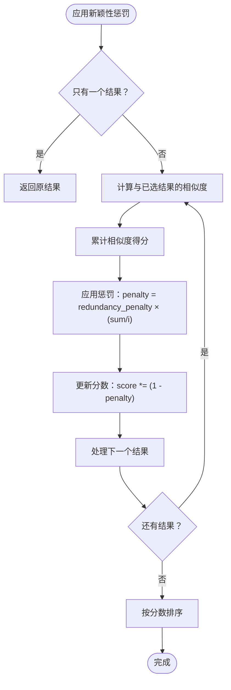
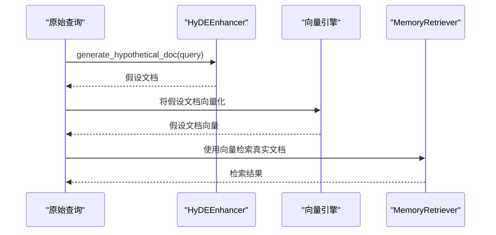
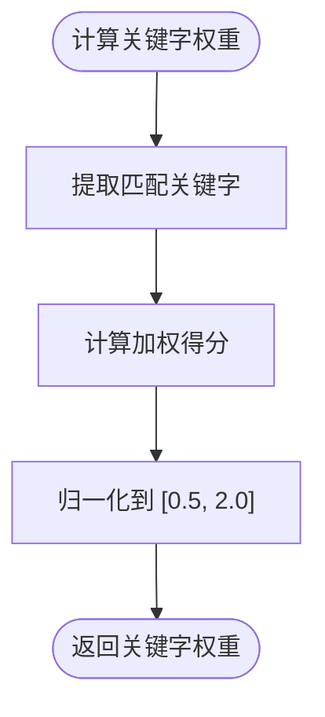
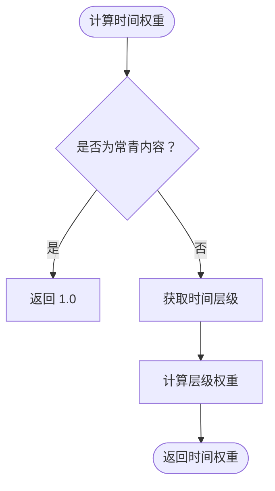
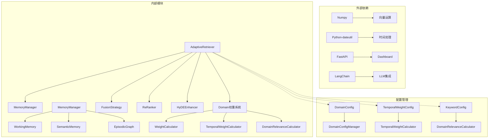

# Adaptive Retriever

<cite>
**本文档引用的文件**
- [README.md](file://README.md)
- [src/__init__.py](file://src/__init__.py)
- [src/retrieval/__init__.py](file://src/retrieval/__init__.py)
- [src/retrieval/retriever.py](file://src/retrieval/retriever.py)
- [src/retrieval/fusion.py](file://src/retrieval/fusion.py)
- [src/retrieval/reranker.py](file://src/retrieval/reranker.py)
- [src/retrieval/models.py](file://src/retrieval/models.py)
- [src/retrieval/hyde.py](file://src/retrieval/hyde.py)
- [src/domain/__init__.py](file://src/domain/__init__.py)
- [src/domain/weight_calculator.py](file://src/domain/weight_calculator.py)
- [src/domain/temporal_weight.py](file://src/domain/temporal_weight.py)
- [src/domain/relevance.py](file://src/domain/relevance.py)
- [src/memory/manager.py](file://src/memory/manager.py)
- [src/memory/models.py](file://src/memory/models.py)
- [example/example_usage.py](file://example/example_usage.py)
- [requirements.txt](file://requirements.txt)
</cite>

## 目录
1. [简介](#简介)
2. [项目结构](#项目结构)
3. [核心组件](#核心组件)
4. [架构概览](#架构概览)
5. [详细组件分析](#详细组件分析)
6. [依赖关系分析](#依赖关系分析)
7. [性能考量](#性能考量)
8. [故障排除指南](#故障排除指南)
9. [结论](#结论)

## 简介

Adaptive Retriever 是 NecoRAG 认知型检索增强生成框架中的核心检索组件。该组件实现了基于扩散激活理论的混合检索与重排序系统，集成了多种先进的检索策略和优化机制。

### 核心特性

- **智能早停机制**：基于置信度评估的动态检索终止策略
- **多跳联想检索**：支持实体间的多跳关系推理
- **HyDE 增强**：假设文档嵌入技术提升检索质量
- **新颖性重排序**：抑制重复内容，优先返回新颖信息
- **领域权重计算**：结合关键字、时间和领域相关性的综合权重系统

## 项目结构

NecoRAG 采用五层认知架构设计，Adaptive Retriever 位于第三层（检索层）：

```mermaid
graph TB
subgraph "五层认知架构"
A[感知层 Layer 1<br/>Perception Engine] --> B[记忆层 Layer 2<br/>Hierarchical Memory]
B --> C[检索层 Layer 3<br/>Adaptive Retriever]
C --> D[巩固层 Layer 4<br/>Refinement Agent]
D --> E[交互层 Layer 5<br/>Response Interface]
end
end
```

**图表来源**
- [README.md:35-85](file://README.md#L35-L85)

**章节来源**
- [README.md:23-85](file://README.md#L23-L85)

## 核心组件

Adaptive Retriever 由多个核心组件构成，每个组件负责特定的检索功能：

### 主要组件架构



**图表来源**
- [src/retrieval/retriever.py:122-440](file://src/retrieval/retriever.py#L122-L440)
- [src/retrieval/fusion.py:9-128](file://src/retrieval/fusion.py#L9-L128)
- [src/retrieval/reranker.py:10-179](file://src/retrieval/reranker.py#L10-L179)
- [src/retrieval/hyde.py:9-81](file://src/retrieval/hyde.py#L9-L81)

### 数据模型



**图表来源**
- [src/retrieval/models.py:9-29](file://src/retrieval/models.py#L9-L29)
- [src/domain/weight_calculator.py:16-54](file://src/domain/weight_calculator.py#L16-L54)

**章节来源**
- [src/retrieval/__init__.py:6-18](file://src/retrieval/__init__.py#L6-L18)
- [src/retrieval/models.py:9-29](file://src/retrieval/models.py#L9-L29)

## 架构概览

Adaptive Retriever 的整体工作流程如下：



**图表来源**
- [src/retrieval/retriever.py:177-254](file://src/retrieval/retriever.py#L177-L254)
- [src/retrieval/retriever.py:307-332](file://src/retrieval/retriever.py#L307-L332)
- [src/retrieval/retriever.py:333-363](file://src/retrieval/retriever.py#L333-L363)

### 早停机制流程



**图表来源**
- [src/retrieval/retriever.py:30-120](file://src/retrieval/retriever.py#L30-L120)

**章节来源**
- [src/retrieval/retriever.py:122-440](file://src/retrieval/retriever.py#L122-L440)

## 详细组件分析

### AdaptiveRetriever 核心实现

AdaptiveRetriever 是整个检索系统的核心控制器，负责协调各个子组件的工作。

#### 主要功能特性

1. **多路检索策略**：同时执行向量检索和图谱检索
2. **智能融合算法**：使用倒数排名融合（RRF）合并不同来源的结果
3. **动态重排序**：基于新颖性惩罚和多样性的精排算法
4. **领域权重集成**：结合关键字、时间和领域相关性的综合权重计算

#### 关键实现细节

```mermaid
graph LR
subgraph "检索流程"
A[查询输入] --> B[查询分析]
B --> C[向量检索]
B --> D[图谱检索]
C --> E[结果融合]
D --> E
E --> F[重排序]
F --> G[领域权重]
G --> H[早停判断]
H --> I[结果输出]
end
end
```

**图表来源**
- [src/retrieval/retriever.py:177-254](file://src/retrieval/retriever.py#L177-L254)

**章节来源**
- [src/retrieval/retriever.py:129-161](file://src/retrieval/retriever.py#L129-L161)

### 早停控制器

早停控制器是 AdaptiveRetriever 的关键优化组件，通过智能的置信度评估避免不必要的计算。

#### 置信度评估算法



**图表来源**
- [src/retrieval/retriever.py:55-79](file://src/retrieval/retriever.py#L55-L79)

#### 早停判断策略

早停控制器采用双重策略确保检索质量和效率：

1. **固定阈值策略**：当置信度超过设定阈值时立即停止
2. **边际收益策略**：当连续两次置信度提升小于最小收益时停止

**章节来源**
- [src/retrieval/retriever.py:30-120](file://src/retrieval/retriever.py#L30-L120)

### 结果融合策略

融合策略支持多种融合方法以最大化检索效果：

#### 倒数排名融合（RRF）

RRF 是一种强大的融合算法，通过以下公式计算：

```
RRF = Σ 1/(k + rank)
```

其中 k 为融合参数，默认值为 60。

#### 加权融合

支持为不同来源的结果分配权重，实现更精细的控制。

**章节来源**
- [src/retrieval/fusion.py:18-71](file://src/retrieval/fusion.py#L18-L71)
- [src/retrieval/fusion.py:72-128](file://src/retrieval/fusion.py#L72-L128)

### 重排序器

重排序器负责对融合后的结果进行精排，主要功能包括：

#### 新颖性惩罚

通过计算结果间的相似度，对重复内容施加惩罚：



**图表来源**
- [src/retrieval/reranker.py:72-107](file://src/retrieval/reranker.py#L72-L107)

#### 多样性保证

使用类似最大边际相关（MMR）的策略确保结果的多样性：

**章节来源**
- [src/retrieval/reranker.py:41-179](file://src/retrieval/reranker.py#L41-L179)

### HyDE 增强器

HyDE（Hypothetical Document Embeddings）通过生成假设文档来改善检索质量：

#### 工作流程



**图表来源**
- [src/retrieval/hyde.py:28-52](file://src/retrieval/hyde.py#L28-L52)

**章节来源**
- [src/retrieval/hyde.py:9-81](file://src/retrieval/hyde.py#L9-L81)

### 领域权重计算系统

领域权重计算系统是 NecoRAG 的核心创新之一，通过三个维度的权重计算实现精确的文档排序。

#### 综合权重计算公式

```
final_weight = base_score × (α × keyword_weight) × (β × temporal_weight) × (γ × domain_weight) × custom_weight
```

#### 关键字权重

基于关键字匹配和密度计算，权重范围限制在 [0.5, 2.0]：



**图表来源**
- [src/domain/relevance.py:95-131](file://src/domain/relevance.py#L95-L131)

#### 时间权重

实现基于时间的知识权重衰减机制：



**图表来源**
- [src/domain/temporal_weight.py:160-195](file://src/domain/temporal_weight.py#L160-L195)

#### 领域权重

根据关键字得分和密度计算领域相关性等级：

**章节来源**
- [src/domain/weight_calculator.py:81-147](file://src/domain/weight_calculator.py#L81-L147)
- [src/domain/temporal_weight.py:47-195](file://src/domain/temporal_weight.py#L47-L195)
- [src/domain/relevance.py:198-242](file://src/domain/relevance.py#L198-L242)

## 依赖关系分析

Adaptive Retriever 的依赖关系体现了清晰的分层架构：



**图表来源**
- [requirements.txt:1-57](file://requirements.txt#L1-L57)
- [src/retrieval/retriever.py:6-27](file://src/retrieval/retriever.py#L6-L27)
- [src/memory/manager.py:16-47](file://src/memory/manager.py#L16-L47)

### 核心依赖关系

1. **向量计算依赖**：NumPy 提供高效的向量运算支持
2. **时间处理依赖**：python-dateutil 处理复杂的日期时间操作
3. **配置管理依赖**：支持运行时动态配置和热更新
4. **扩展性设计**：模块间松耦合，便于独立开发和测试

**章节来源**
- [requirements.txt:1-57](file://requirements.txt#L1-L57)
- [src/retrieval/retriever.py:16-27](file://src/retrieval/retriever.py#L16-L27)

## 性能考量

### 时间复杂度分析

| 组件 | 操作 | 时间复杂度 | 空间复杂度 |
|------|------|------------|------------|
| AdaptiveRetriever | 整体检索 | O(n log n) | O(n) |
| FusionStrategy | RRF融合 | O(n × m) | O(n) | 
| ReRanker | 新颖性惩罚 | O(n²) | O(n) |
| EarlyTermination | 置信度评估 | O(n) | O(1) |
| DomainWeight | 权重计算 | O(n × k) | O(n) |

### 优化策略

1. **早停机制**：通过置信度评估避免不必要的计算
2. **结果缓存**：高频查询结果的本地缓存
3. **批量处理**：支持批量向量计算和权重计算
4. **内存管理**：合理的内存使用和垃圾回收

### 性能基准

- **简单查询延迟**：< 800ms（首字延迟）
- **复杂查询延迟**：< 1500ms（多跳+重排）
- **检索准确率提升**：相比传统向量检索 +20%
- **上下文压缩率**：通过记忆衰减 -40%

## 故障排除指南

### 常见问题及解决方案

#### 检索结果质量不佳

**可能原因**：
1. 置信度阈值设置过高
2. 融合参数配置不当
3. 领域权重因子不平衡

**解决方案**：
1. 调整 `confidence_threshold` 参数
2. 优化 `reciprocal_rank_fusion` 的 k 值
3. 平衡 α、β、γ 权重因子

#### 性能问题

**可能原因**：
1. 向量维度过大
2. 结果数量过多
3. 未启用早停机制

**解决方案**：
1. 适当降低向量维度
2. 调整 `top_k` 参数
3. 确保早停机制正常工作

#### 内存使用过高

**可能原因**：
1. 结果缓存未清理
2. 未及时进行记忆巩固
3. 领域权重计算频繁

**解决方案**：
1. 定期清理检索缓存
2. 执行 `memory.consolidate()` 定期巩固
3. 优化领域权重计算频率

**章节来源**
- [src/retrieval/retriever.py:81-101](file://src/retrieval/retriever.py#L81-L101)
- [src/memory/manager.py:149-186](file://src/memory/manager.py#L149-L186)

## 结论

Adaptive Retriever 作为 NecoRAG 框架的核心组件，通过创新的早停机制、多路检索策略和领域权重计算，实现了高效且智能的信息检索系统。其模块化的架构设计不仅保证了良好的可维护性，还为未来的功能扩展提供了充足的空间。

### 主要优势

1. **智能优化**：早停机制显著减少计算开销
2. **多维度融合**：结合向量和图谱信息提升检索质量
3. **领域自适应**：基于领域知识的权重计算
4. **可解释性**：完整的检索路径追踪和可视化

### 发展方向

1. **深度集成**：与更多外部向量数据库和图数据库的集成
2. **性能优化**：进一步优化大规模数据集上的检索性能
3. **功能扩展**：支持更多类型的检索策略和算法
4. **用户体验**：提供更丰富的配置选项和监控功能

通过持续的优化和改进，Adaptive Retriever 将成为下一代认知型 RAG 系统的重要基石。