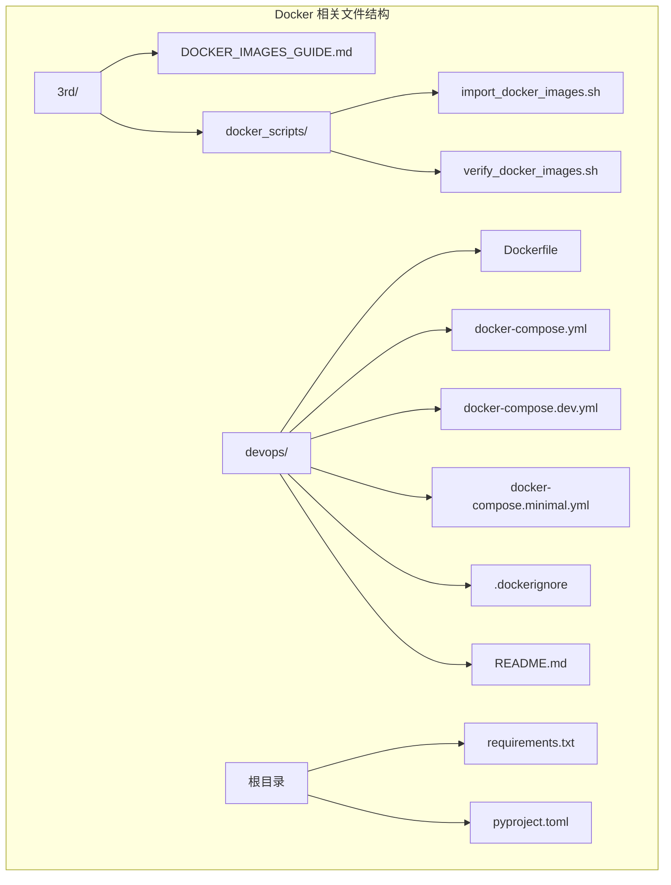
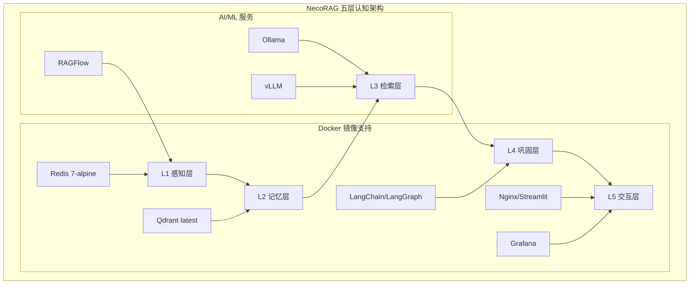
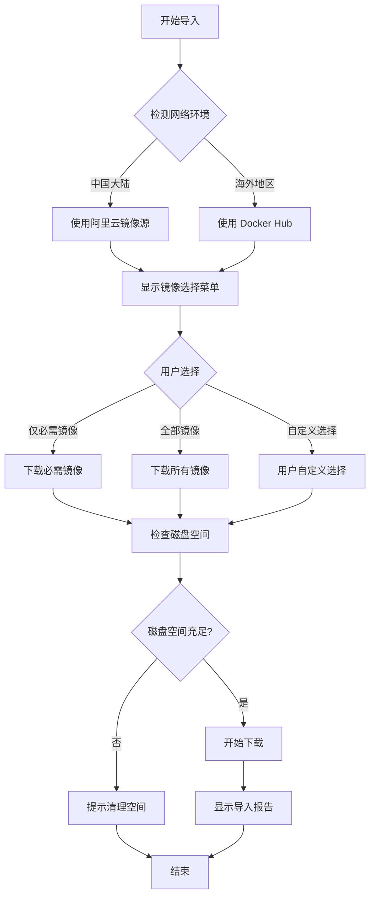
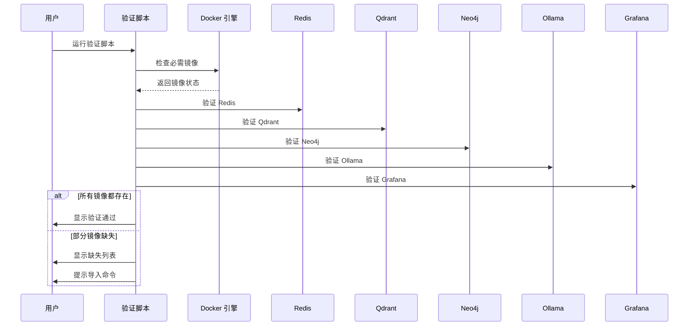
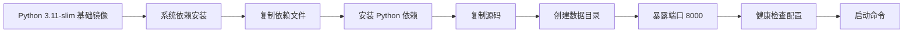
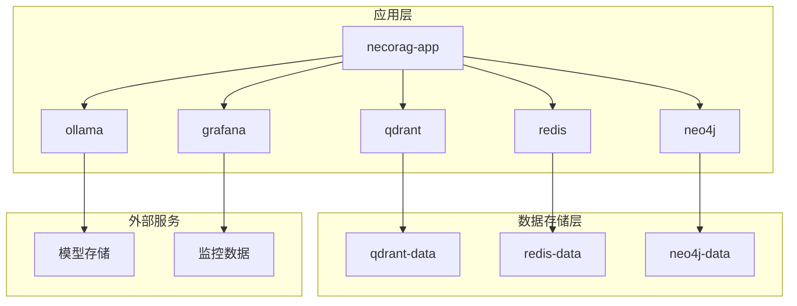

# Docker 镜像指南

<cite>
**本文档引用的文件**
- [DOCKER_IMAGES_GUIDE.md](file://3rd/DOCKER_IMAGES_GUIDE.md)
- [import_docker_images.sh](file://3rd/docker_scripts/import_docker_images.sh)
- [verify_docker_images.sh](file://3rd/docker_scripts/verify_docker_images.sh)
- [Dockerfile](file://devops/Dockerfile)
- [docker-compose.yml](file://devops/docker-compose.yml)
- [docker-compose.dev.yml](file://devops/docker-compose.dev.yml)
- [docker-compose.minimal.yml](file://devops/docker-compose.minimal.yml)
- [.dockerignore](file://devops/.dockerignore)
- [README.md](file://devops/README.md)
- [requirements.txt](file://requirements.txt)
- [pyproject.toml](file://pyproject.toml)
</cite>

## 目录
1. [简介](#简介)
2. [项目结构](#项目结构)
3. [核心组件](#核心组件)
4. [架构概览](#架构概览)
5. [详细组件分析](#详细组件分析)
6. [依赖关系分析](#依赖关系分析)
7. [性能考虑](#性能考虑)
8. [故障排除指南](#故障排除指南)
9. [结论](#结论)
10. [附录](#附录)

## 简介

NecoRAG 项目提供了完整的 Docker 镜像管理和部署解决方案。该指南详细介绍了如何高效地导入、管理和验证 Docker 镜像，以及如何使用这些镜像构建和运行 NecoRAG 认知型检索增强生成框架。

该项目采用多层架构设计，包括感知层(L1)、记忆层(L2)、检索层(L3)、巩固层(L4)和交互层(L5)，每层都有专门的 Docker 镜像支持。

## 项目结构

NecoRAG 项目的 Docker 相关文件主要分布在以下目录：



**图表来源**
- [DOCKER_IMAGES_GUIDE.md:1-50](file://3rd/DOCKER_IMAGES_GUIDE.md#L1-L50)
- [import_docker_images.sh:1-30](file://3rd/docker_scripts/import_docker_images.sh#L1-L30)
- [Dockerfile:1-20](file://devops/Dockerfile#L1-L20)

**章节来源**
- [DOCKER_IMAGES_GUIDE.md:1-100](file://3rd/DOCKER_IMAGES_GUIDE.md#L1-L100)
- [README.md:7-25](file://devops/README.md#L7-L25)

## 核心组件

### 必需镜像列表

NecoRAG 项目的核心必需镜像包括以下9个关键组件：

| 镜像名称 | 版本 | 大小 | 用途 | Docker Hub |
|---------|------|------|------|-----------|
| **redis** | `7-alpine` | ~25MB | L1 工作记忆与缓存 | [链接](https://hub.docker.com/_/redis) |
| **qdrant/qdrant** | `latest` | ~500MB | L2 语义向量数据库 | [链接](https://hub.docker.com/r/qdrant/qdrant) |
| **neo4j** | `5-community` | ~1.2GB | L3 情景图谱数据库 | [链接](https://hub.docker.com/_/neo4j) |
| **ollama/ollama** | `latest` | ~2GB | 本地 LLM 推理服务器 | [链接](https://hub.docker.com/r/ollama/ollama) |
| **vllm/vllm-openai** | `latest` | ~3GB | 高吞吐 LLM 推理服务 | [链接](https://hub.docker.com/r/vllm/vllm-openai) |
| **infiniflow/ragflow** | `latest` | ~1.5GB | 深度文档解析引擎 | [链接](https://hub.docker.com/r/infiniflow/ragflow) |
| **langchain/langgraph** | `latest` | ~800MB | 编排引擎（状态机） | [链接](https://hub.docker.com/r/langchain/langgraph) |
| **streamlit/streamlit** | `latest` | ~600MB | 前端/可视化界面 | [链接](https://hub.docker.com/r/streamlit/streamlit) |
| **grafana/grafana** | `latest` | ~300MB | 监控仪表盘 | [链接](https://hub.docker.com/r/grafana/grafana) |

**总计大小**: ~9.9GB

### 可选镜像

项目还提供了丰富的可选镜像，可根据具体需求选择：

#### 数据库与监控
- **milvusdb/milvus**: Milvus 向量数据库（备选）
- **memgraph/memgraph**: Memgraph 图数据库（备选）
- **prom/prometheus**: Prometheus 指标收集
- **apache/superset**: Superset 数据可视化

#### OCR 文档扫描
- **ocrmypdf/ocrmypdf**: PDF OCR 扫描与优化
- **tesseractshadow/tesseract4re**: Tesseract OCR 引擎
- **paddlepaddle/paddleocr**: PaddleOCR 多语言 OCR

#### 全文搜索引擎
- **elasticsearch/elasticsearch**: Elasticsearch 分布式搜索引擎
- **kibana/kibana**: Kibana 可视化仪表盘
- **docker.elastic.co/apm/apm-server**: APM Server 应用性能监控

**章节来源**
- [DOCKER_IMAGES_GUIDE.md:38-109](file://3rd/DOCKER_IMAGES_GUIDE.md#L38-L109)
- [import_docker_images.sh:21-32](file://3rd/docker_scripts/import_docker_images.sh#L21-L32)

## 架构概览

NecoRAG 采用了五层认知架构，每层都有对应的 Docker 镜像支持：



**图表来源**
- [DOCKER_IMAGES_GUIDE.md:387-403](file://3rd/DOCKER_IMAGES_GUIDE.md#L387-L403)
- [docker-compose.yml:4-164](file://devops/docker-compose.yml#L4-L164)

## 详细组件分析

### 镜像导入脚本

`import_docker_images.sh` 是一个智能的镜像导入工具，具有以下核心功能：

#### 网络智能检测
脚本能够自动检测用户的网络环境，并选择最优的镜像源：
- **中国大陆**: 使用阿里云镜像加速器
- **海外地区**: 使用 Docker Hub 官方镜像源

#### 镜像选择策略


**图表来源**
- [import_docker_images.sh:74-108](file://3rd/docker_scripts/import_docker_images.sh#L74-L108)
- [import_docker_images.sh:183-295](file://3rd/docker_scripts/import_docker_images.sh#L183-L295)

#### 镜像大小管理
脚本内置了详细的镜像大小信息，帮助用户合理规划磁盘空间：

**章节来源**
- [import_docker_images.sh:1-589](file://3rd/docker_scripts/import_docker_images.sh#L1-L589)

### 镜像验证脚本

`verify_docker_images.sh` 提供了完整的镜像验证功能：

#### 验证流程


**图表来源**
- [verify_docker_images.sh:38-61](file://3rd/docker_scripts/verify_docker_images.sh#L38-L61)

**章节来源**
- [verify_docker_images.sh:1-84](file://3rd/docker_scripts/verify_docker_images.sh#L1-L84)

### 应用容器配置

NecoRAG 的应用容器配置体现了现代化的 Docker 最佳实践：

#### Dockerfile 构建配置


**图表来源**
- [Dockerfile:10-39](file://devops/Dockerfile#L10-L39)

#### Docker Compose 服务编排
项目提供了三种不同的部署配置：

**章节来源**
- [Dockerfile:1-39](file://devops/Dockerfile#L1-L39)
- [docker-compose.yml:1-164](file://devops/docker-compose.yml#L1-L164)

## 依赖关系分析

### 镜像依赖关系



**图表来源**
- [docker-compose.yml:118-147](file://devops/docker-compose.yml#L118-L147)

### 环境变量配置

项目使用环境变量来管理不同环境的配置：

**章节来源**
- [docker-compose.yml:130-139](file://devops/docker-compose.yml#L130-L139)
- [README.md:89-122](file://devops/README.md#L89-L122)

## 性能考虑

### 镜像大小优化

NecoRAG 项目在镜像大小管理方面采用了多项优化策略：

#### 多阶段构建
- 使用 `python:3.11-slim` 作为基础镜像，减少基础系统开销
- 仅安装必要的系统依赖
- 使用 `--no-cache-dir` 参数避免缓存污染

#### 存储卷优化
- 为每个服务配置独立的数据卷
- 使用命名卷确保数据持久化
- 配置适当的权限和所有权

### 网络性能优化

#### 镜像源选择
脚本自动检测网络环境并选择最优镜像源：
- **中国大陆**: 阿里云镜像加速器，显著提升下载速度
- **海外地区**: Docker Hub 官方镜像源，保证稳定性

#### 并发下载管理
- 支持镜像大小估算和磁盘空间检查
- 提供详细的进度反馈
- 实现错误重试机制

**章节来源**
- [import_docker_images.sh:74-108](file://3rd/docker_scripts/import_docker_images.sh#L74-L108)
- [import_docker_images.sh:134-181](file://3rd/docker_scripts/import_docker_images.sh#L134-L181)

## 故障排除指南

### 常见问题及解决方案

#### Docker 环境问题
**症状**: 脚本提示 Docker 未安装或未运行

**解决方案**:
```bash
# 检查 Docker 状态
docker info

# 在不同操作系统上安装 Docker
# macOS
brew install --cask docker

# Ubuntu/Debian
sudo apt-get update
sudo apt-get install docker.io docker-compose

# CentOS/RHEL
sudo yum install docker docker-compose

# 启动 Docker 服务
sudo systemctl start docker
sudo systemctl enable docker
```

#### 网络连接问题
**症状**: 镜像拉取超时或失败

**解决方案**:
```bash
# 配置 Docker 镜像加速器（中国大陆）
sudo vi /etc/docker/daemon.json

# 添加阿里云加速器
{
  "registry-mirrors": [
    "https://docker.mirrors.ustc.edu.cn",
    "https://registry.docker-cn.com"
  ]
}

# 重启 Docker 服务
sudo systemctl daemon-reload
sudo systemctl restart docker
```

#### 磁盘空间不足
**症状**: "no space left on device" 错误

**解决方案**:
```bash
# 清理未使用的镜像
docker image prune -a

# 清理停止的容器
docker container prune

# 清理构建缓存
docker builder prune

# 查看磁盘使用情况
docker system df
```

#### 网络超时问题
**症状**: "context deadline exceeded" 错误

**解决方案**:
```bash
# 增加 Docker 拉取超时时间
export DOCKER_CLIENT_TIMEOUT=300
export COMPOSE_HTTP_TIMEOUT=300

# 使用国内镜像源
export USE_ALIYUN=true
```

**章节来源**
- [DOCKER_IMAGES_GUIDE.md:172-310](file://3rd/DOCKER_IMAGES_GUIDE.md#L172-L310)
- [import_docker_images.sh:134-181](file://3rd/docker_scripts/import_docker_images.sh#L134-L181)

## 结论

NecoRAG 项目的 Docker 镜像管理方案展现了现代容器化部署的最佳实践。通过智能的镜像导入脚本、完善的验证机制和灵活的部署配置，该项目为用户提供了高效、可靠的容器化解决方案。

### 主要优势

1. **智能化镜像管理**: 自动网络检测和镜像源选择
2. **灵活的部署模式**: 支持开发、生产、最小化等多种配置
3. **完善的监控体系**: 集成 Grafana 监控和健康检查
4. **性能优化**: 多项镜像大小和网络优化策略
5. **故障恢复**: 完善的错误处理和重试机制

### 最佳实践建议

1. **定期更新镜像**: 建议每月检查并更新镜像版本
2. **备份重要数据**: 定期备份数据卷和配置文件
3. **监控系统健康**: 利用内置的健康检查和监控功能
4. **合理规划资源**: 根据实际需求选择合适的部署配置
5. **文档维护**: 及时更新部署文档和配置说明

## 附录

### 快速启动命令

```bash
# 进入项目目录
cd 3rd

# 赋予执行权限
chmod +x import_docker_images.sh
chmod +x verify_docker_images.sh

# 导入所有必需镜像
./import_docker_images.sh

# 验证镜像完整性
./verify_docker_images.sh

# 启动完整服务
cd ../devops
docker-compose up -d
```

### 配置文件模板

项目提供了完整的配置文件模板，包括：
- Docker Compose 主配置文件
- 开发环境配置文件
- 最小化部署配置文件
- 环境变量模板
- Docker 忽略文件

**章节来源**
- [README.md:124-169](file://devops/README.md#L124-L169)
- [requirements.txt:1-161](file://requirements.txt#L1-L161)
- [pyproject.toml:1-101](file://pyproject.toml#L1-L101)