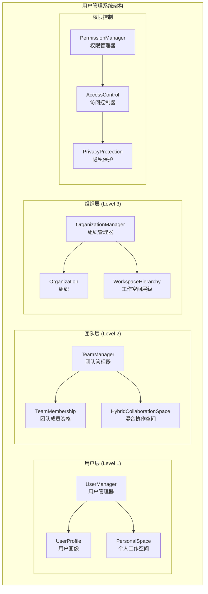
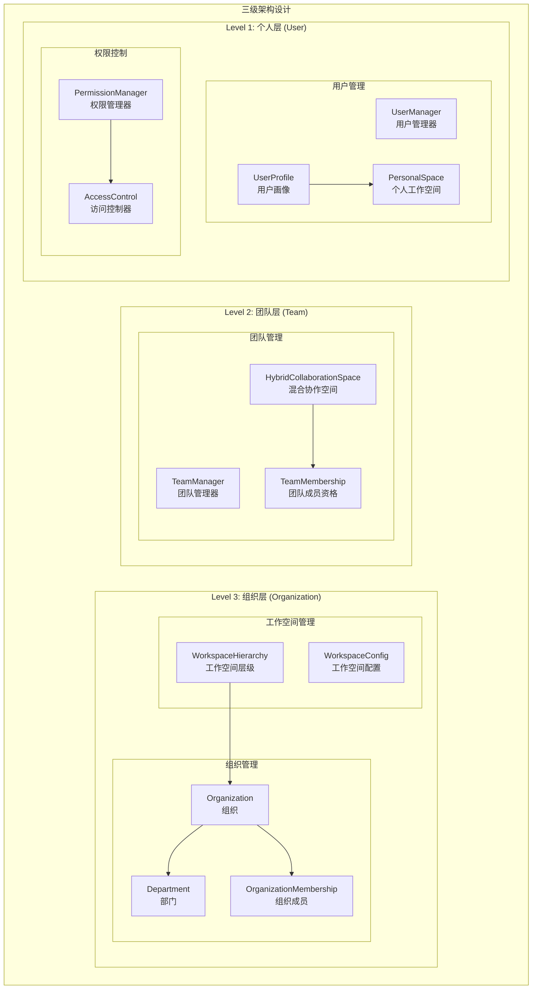
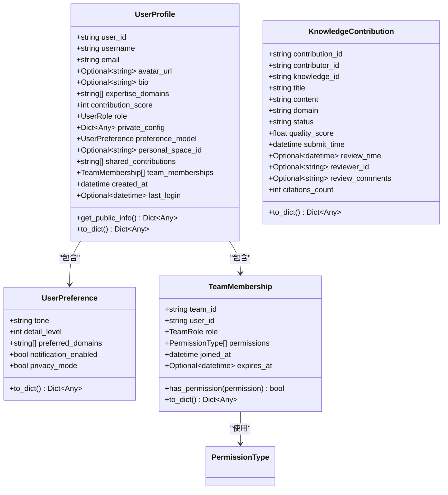
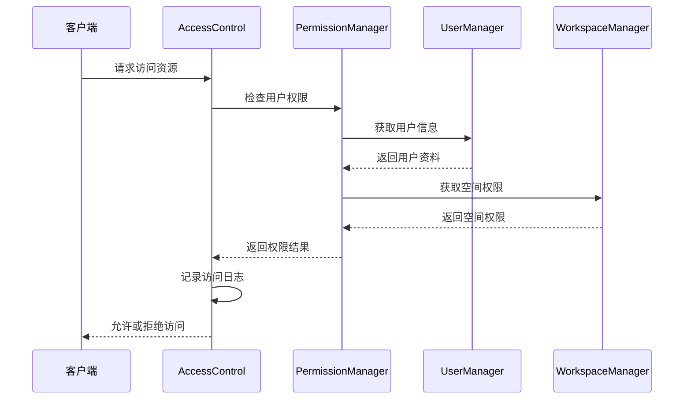
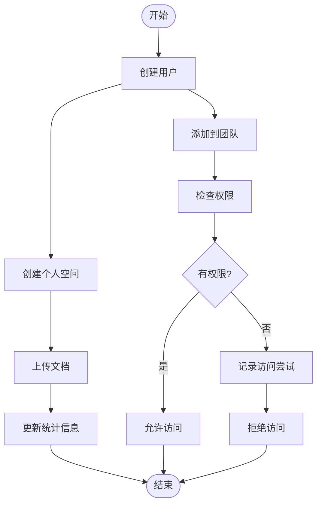
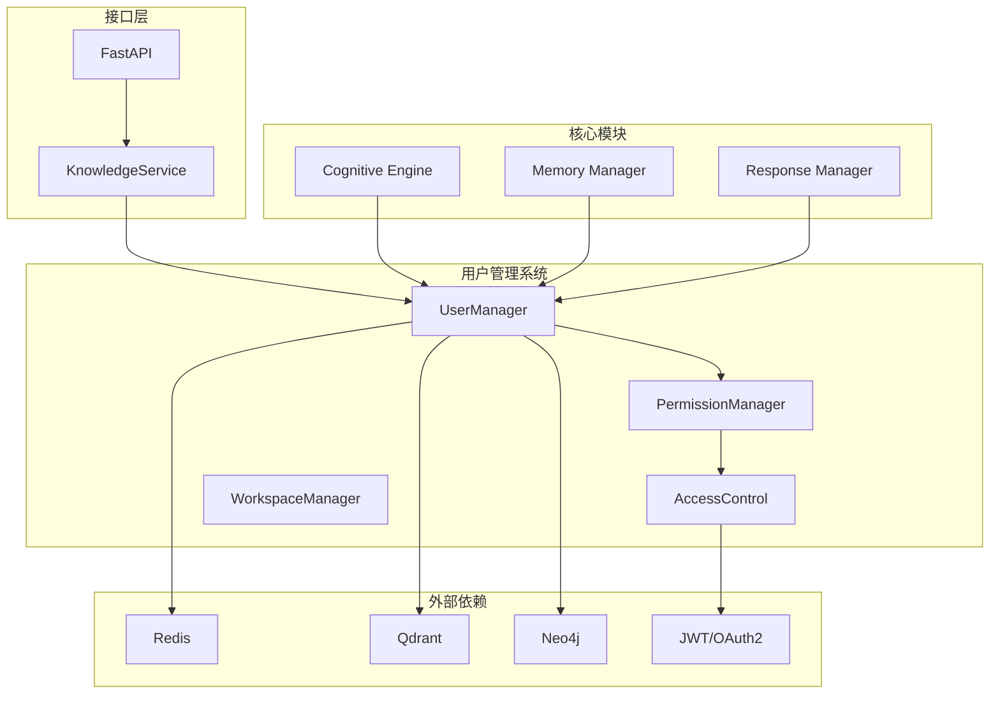

# 用户管理系统

<cite>
**本文档引用的文件**
- [README.md](file://README.md)
- [src/__init__.py](file://src/__init__.py)
- [src/workspace/user/manager.py](file://src/workspace/user/manager.py)
- [src/workspace/user/models.py](file://src/workspace/user/models.py)
- [src/workspace/user/permissions.py](file://src/workspace/user/permissions.py)
- [src/workspace/team/manager.py](file://src/workspace/team/manager.py)
- [src/workspace/team/models.py](file://src/workspace/team/models.py)
- [src/workspace/organization/org_manager.py](file://src/workspace/organization/org_manager.py)
- [src/workspace/organization/org_models.py](file://src/workspace/organization/org_models.py)
- [interface/api.py](file://interface/api.py)
- [interface/models.py](file://interface/models.py)
- [tests/test_user/test_multi_user_system.py](file://tests/test_user/test_multi_user_system.py)
</cite>

## 目录
1. [简介](#简介)
2. [项目结构](#项目结构)
3. [核心组件](#核心组件)
4. [架构概览](#架构概览)
5. [详细组件分析](#详细组件分析)
6. [依赖关系分析](#依赖关系分析)
7. [性能考虑](#性能考虑)
8. [故障排除指南](#故障排除指南)
9. [结论](#结论)

## 简介

NecoRAG 用户管理系统是一个基于认知科学理论构建的多层次用户管理框架，模拟人脑的双系统记忆理论和神经认知科学原理。该系统实现了从个人用户到团队协作再到组织管理的完整三级架构，支持多层权限控制、用户画像管理、知识空间管理等功能。

系统采用五层认知架构设计，每一层对应人脑认知机制的不同阶段，实现了从感知到交互的完整认知闭环。用户管理系统作为其中的重要组成部分，提供了完整的用户生命周期管理、权限控制和协作功能。

## 项目结构

用户管理系统位于 NecoRAG 项目的 `src/workspace` 目录下，采用分层架构设计：

**图表来源**
- [src/workspace/user/manager.py:1-422](file://src/workspace/user/manager.py#L1-L422)
- [src/workspace/team/manager.py:1-143](file://src/workspace/team/manager.py#L1-L143)
- [src/workspace/organization/org_manager.py:1-428](file://src/workspace/organization/org_manager.py#L1-L428)

**章节来源**
- [src/workspace/user/manager.py:1-422](file://src/workspace/user/manager.py#L1-L422)
- [src/workspace/team/manager.py:1-143](file://src/workspace/team/manager.py#L1-L143)
- [src/workspace/organization/org_manager.py:1-428](file://src/workspace/organization/org_manager.py#L1-L428)

## 核心组件

### 用户管理器 (UserManager)

用户管理器是用户系统的核心组件，负责用户生命周期管理：

- **用户创建与管理**：支持用户注册、信息更新、删除等基本操作
- **个人空间管理**：为每个用户创建独立的个人工作空间
- **贡献积分系统**：基于用户贡献行为的积分管理
- **GDPR合规**：支持用户数据删除和导出功能

### 权限管理器 (PermissionManager)

实现基于角色和属性的细粒度权限控制：

- **RBAC模型**：基于用户角色的权限分配
- **ABAC模型**：基于属性的访问控制
- **多层权限**：支持个人空间、公共空间、团队空间的差异化权限
- **动态权限评估**：根据上下文动态评估访问权限

### 工作空间管理器 (WorkspaceManager)

管理用户的工作空间，包括个人空间、公共空间和团队空间：

- **空间类型管理**：支持三种不同类型的协作空间
- **跨空间知识流动**：支持知识在不同空间间的同步和共享
- **权限继承**：基于用户在不同空间中的角色继承相应权限

**章节来源**
- [src/workspace/user/manager.py:22-422](file://src/workspace/user/manager.py#L22-L422)
- [src/workspace/user/permissions.py:29-368](file://src/workspace/user/permissions.py#L29-L368)

## 架构概览

用户管理系统采用三级架构设计，模拟人脑的认知层次：

**图表来源**
- [src/workspace/organization/org_models.py:96-300](file://src/workspace/organization/org_models.py#L96-L300)
- [src/workspace/team/models.py:55-112](file://src/workspace/team/models.py#L55-L112)
- [src/workspace/user/models.py:152-336](file://src/workspace/user/models.py#L152-L336)

## 详细组件分析

### 用户数据模型

用户系统的核心数据模型包括用户画像、权限类型、空间类型等：

**图表来源**
- [src/workspace/user/models.py:46-202](file://src/workspace/user/models.py#L46-L202)
- [src/workspace/user/models.py:205-336](file://src/workspace/user/models.py#L205-L336)

### 权限控制系统

权限控制系统实现了复杂的权限管理逻辑：

**图表来源**
- [src/workspace/user/permissions.py:182-312](file://src/workspace/user/permissions.py#L182-L312)
- [src/workspace/user/permissions.py:86-159](file://src/workspace/user/permissions.py#L86-L159)

### 工作空间管理流程

工作空间管理器协调不同层级的空间管理：

**图表来源**
- [src/workspace/user/manager.py:150-422](file://src/workspace/user/manager.py#L150-L422)

**章节来源**
- [src/workspace/user/models.py:13-336](file://src/workspace/user/models.py#L13-L336)
- [src/workspace/user/permissions.py:29-368](file://src/workspace/user/permissions.py#L29-L368)
- [src/workspace/user/manager.py:150-422](file://src/workspace/user/manager.py#L150-L422)

## 依赖关系分析

用户管理系统与其他模块的依赖关系：

**图表来源**
- [src/__init__.py:13-226](file://src/__init__.py#L13-L226)
- [interface/api.py:26-174](file://interface/api.py#L26-L174)

**章节来源**
- [src/__init__.py:13-226](file://src/__init__.py#L13-L226)
- [interface/api.py:26-174](file://interface/api.py#L26-L174)

## 性能考虑

用户管理系统在设计时充分考虑了性能优化：

### 缓存策略
- **内存缓存**：用户信息和权限数据的内存缓存
- **工作记忆集成**：利用工作记忆的TTL机制实现自动过期
- **批量操作**：支持批量用户操作以减少数据库压力

### 权限检查优化
- **权限预计算**：在用户登录时预计算常用权限
- **权限缓存**：基于用户ID的权限缓存
- **最小权限原则**：只缓存必要的权限信息

### 数据库优化
- **索引设计**：为常用查询字段建立索引
- **连接池**：数据库连接池管理
- **异步操作**：使用异步I/O减少阻塞

## 故障排除指南

### 常见问题及解决方案

**用户权限问题**
- 检查用户角色配置
- 验证团队成员资格
- 确认空间权限设置

**工作空间访问问题**
- 验证用户在团队中的角色
- 检查空间的访问权限配置
- 确认用户层级关系

**权限控制异常**
- 检查权限管理器配置
- 验证访问控制日志
- 确认审计日志记录

**章节来源**
- [src/workspace/user/permissions.py:182-368](file://src/workspace/user/permissions.py#L182-L368)
- [tests/test_user/test_multi_user_system.py:366-420](file://tests/test_user/test_multi_user_system.py#L366-L420)

## 结论

NecoRAG 用户管理系统是一个功能完整、架构清晰的多层次用户管理框架。系统采用认知科学理论指导设计，实现了从个人用户到组织管理的完整用户生命周期管理。

### 主要优势
- **分层架构设计**：清晰的三级架构，便于维护和扩展
- **完善的权限控制**：基于RBAC和ABAC的细粒度权限管理
- **GDPR合规**：支持用户数据删除和导出功能
- **可扩展性**：模块化设计，易于添加新功能
- **性能优化**：多种缓存和优化策略

### 技术特色
- **认知科学理论**：基于人脑记忆和认知机制的设计
- **多层权限控制**：支持复杂的企业级权限需求
- **工作空间管理**：灵活的协作空间管理机制
- **隐私保护**：内置的隐私保护和数据治理功能

该系统为构建现代企业级知识管理平台提供了坚实的技术基础，支持从个人知识管理到组织级知识协作的完整场景。