# 交互层模块

<cite>
**本文引用的文件**
- [src/retrieval/smart_routing/engine.py](file://src/retrieval/smart_routing/engine.py)
- [src/retrieval/smart_routing/intent_router.py](file://src/retrieval/smart_routing/intent_router.py)
- [src/retrieval/smart_routing/user_adapter.py](file://src/retrieval/smart_routing/user_adapter.py)
- [src/retrieval/smart_routing/cot_controller.py](file://src/retrieval/smart_routing/cot_controller.py)
- [src/retrieval/smart_routing/strategy_fusion.py](file://src/retrieval/smart_routing/strategy_fusion.py)
- [src/retrieval/smart_routing/early_stopping.py](file://src/retrieval/smart_routing/early_stopping.py)
- [src/retrieval/smart_routing/feedback_loop.py](file://src/retrieval/smart_routing/feedback_loop.py)
- [src/retrieval/smart_routing/example_usage.py](file://src/retrieval/smart_routing/example_usage.py)
- [src/response/interface.py](file://src/response/interface.py)
- [src/response/tone_adapter.py](file://src/response/tone_adapter.py)
- [src/response/detail_adapter.py](file://src/response/detail_adapter.py)
- [src/response/profile_manager.py](file://src/response/profile_manager.py)
- [src/response/visualizer.py](file://src/response/visualizer.py)
- [src/response/models.py](file://src/response/models.py)
- [src/core/protocols.py](file://src/core/protocols.py)
- [src/memory/manager.py](file://src/memory/manager.py)
- [src/refinement/models.py](file://src/refinement/models.py)
- [interface/api.py](file://interface/api.py)
- [interface/knowledge_service.py](file://interface/knowledge_service.py)
- [interface/main.py](file://interface/main.py)
- [src/necorag.py](file://src/necorag.py)
- [design/design.md](file://design/design.md)
- [src/retrieval/smart_routing/README.md](file://src/retrieval/smart_routing/README.md)
- [src/retrieval/smart_routing/IMPLEMENTATION_SUMMARY.md](file://src/retrieval/smart_routing/IMPLEMENTATION_SUMMARY.md)
</cite>

## 更新摘要
**变更内容**
- 交互层模块已被智能路由与策略融合引擎完全重构和替代
- 原有的响应接口核心、思维链可视化器、用户画像管理器、语气适配器等组件被整合到统一的三层决策架构中
- 新架构采用智能路由引擎统一处理意图识别、用户画像适配和策略融合
- 保留了原有的响应生成和思维链可视化功能，但实现方式已完全重构

## 目录
1. [简介](#简介)
2. [架构演进](#架构演进)
3. [智能路由引擎](#智能路由引擎)
4. [三层决策架构](#三层决策架构)
5. [核心组件详解](#核心组件详解)
6. [响应生成流程](#响应生成流程)
7. [用户画像与个性化](#用户画像与个性化)
8. [思维链可视化](#思维链可视化)
9. [性能优化与早停机制](#性能优化与早停机制)
10. [反馈学习系统](#反馈学习系统)
11. [集成与使用](#集成与使用)
12. [迁移指南](#迁移指南)
13. [API参考](#api参考)
14. [配置与参数](#配置与参数)
15. [故障排除](#故障排除)
16. [结论](#结论)

## 简介

交互层模块经历了重大架构演进，现已完全重构为智能路由与策略融合引擎。该引擎整合了语义意图分类、CoT思维链推理和用户画像三大核心能力，构建了智能化的检索-响应决策系统。

**核心设计理念**：
- **统一决策架构**：三层决策架构实现意图识别、用户画像适配和策略融合的统一管理
- **智能路由**：基于查询特征和用户偏好的动态策略选择
- **个性化响应**：结合用户画像和查询上下文的自适应输出
- **可解释性**：完整的思维链可视化和决策过程追踪
- **性能优化**：早停机制和降级策略确保响应效率

## 架构演进

### 从传统交互层到智能路由引擎

**传统交互层架构**：
```
用户查询 → 响应接口 → 语气适配器 → 详细程度适配器 → 用户画像管理器 → 思维链可视化器
```

**智能路由引擎架构**：
```
用户查询 → 智能路由引擎 → 多策略并行执行 → 结果融合 → 个性化响应 → 可解释性输出
```

### 架构升级优势

1. **统一决策**：所有决策逻辑集中在智能路由引擎中
2. **策略融合**：多策略并行执行和智能融合
3. **自适应学习**：基于反馈的在线学习和优化
4. **性能监控**：实时性能指标和早停机制
5. **可扩展性**：模块化设计便于功能扩展

## 智能路由引擎

### 引擎概述

智能路由与策略融合引擎是交互层模块的核心，负责整合所有子模块并提供统一的智能路由决策接口。

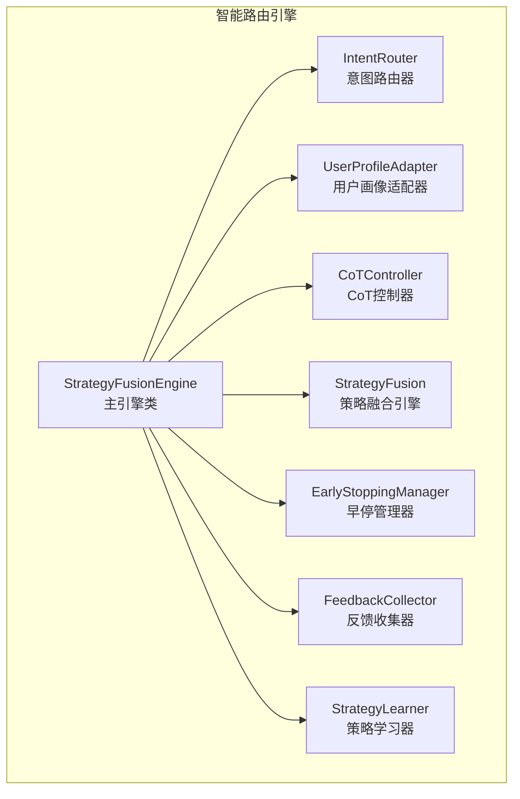

**图表来源**
- [src/retrieval/smart_routing/engine.py:34-62](file://src/retrieval/smart_routing/engine.py#L34-L62)

### 核心功能特性

1. **三层决策架构**：意图识别、用户画像、策略融合的分层决策
2. **多策略并行**：支持多种检索策略的并行执行和结果融合
3. **智能早停**：基于性能指标的动态早停和降级机制
4. **在线学习**：基于用户反馈的策略权重动态调整
5. **性能监控**：实时统计和性能指标追踪

**章节来源**
- [src/retrieval/smart_routing/engine.py:34-274](file://src/retrieval/smart_routing/engine.py#L34-L274)

## 三层决策架构

### 架构设计原理

智能路由引擎采用三层决策架构，每层都有明确的职责和决策逻辑：

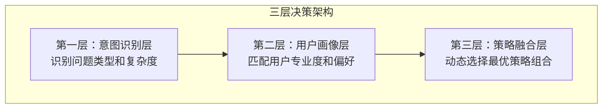

**图表来源**
- [design/design.md:661-684](file://design/design.md#L661-L684)

### 第一层：意图识别层

**功能**：识别查询的问题类型、复杂度和CoT触发判断

**7大类语义意图**：
- 事实查询 (FACTUAL_QUERY)
- 比较分析 (COMPARATIVE_ANALYSIS)
- 推理演绎 (REASONING_INFERENCE)
- 概念解释 (CONCEPT_EXPLANATION)
- 摘要总结 (SUMMARIZATION)
- 操作指导 (PROCEDURAL)
- 探索发散 (EXPLORATORY)

**复杂度评估**：基于查询长度、问句数量、连接词等特征进行0-1范围的复杂度评分。

**章节来源**
- [src/retrieval/smart_routing/intent_router.py:13-77](file://src/retrieval/smart_routing/intent_router.py#L13-L77)

### 第二层：用户画像层

**功能**：匹配用户专业度和偏好，进行个性化定制

**专业度分类**：
- 专家 (expert): ≥0.8
- 中级 (intermediate): 0.5-0.8
- 新手 (novice): <0.5

**风格偏好**：
- 详细度级别：简洁(CONCISE) / 平衡(BALANCED) / 详细(COMPREHENSIVE)
- 语调风格：正式(FORMAL) / 随意(CASUAL) / 幽默(HUMOROUS)
- 格式偏好：文本(TEXT) / 项目符号(BULLET_POINTS) / 表格(TABLE) / 图表(DIAGRAM)
- 引用风格：内联(INLINE) / 脚注(FOOTNOTE) / 尾注(ENDNOTE) / 无(NONE)

**章节来源**
- [src/retrieval/smart_routing/user_adapter.py:14-42](file://src/retrieval/smart_routing/user_adapter.py#L14-L42)

### 第三层：策略融合层

**功能**：动态选择最优策略组合，进行多策略并行执行和结果融合

**策略模板映射**：
- 事实查询：向量检索(0.7) + 关键词检索(0.3)
- 推理演绎：图谱多跳(0.4) + HyDE(0.3) + CoT推理(0.3)
- 概念解释：语义检索(0.6) + 层次化上下文(0.3) + 示例生成(0.1)

**章节来源**
- [src/retrieval/smart_routing/IMPLEMENTATION_SUMMARY.md:76-89](file://src/retrieval/smart_routing/IMPLEMENTATION_SUMMARY.md#L76-L89)

## 核心组件详解

### StrategyFusionEngine 主引擎

StrategyFusionEngine是智能路由引擎的核心协调者，负责整合各个子模块并执行完整的路由决策流程。

#### 核心职责

1. **路由决策**：综合意图识别、用户画像和策略模板进行决策
2. **策略执行**：协调多策略并行执行和结果融合
3. **性能监控**：实时统计和性能指标追踪
4. **学习更新**：基于反馈的策略权重动态调整

#### 决策流程

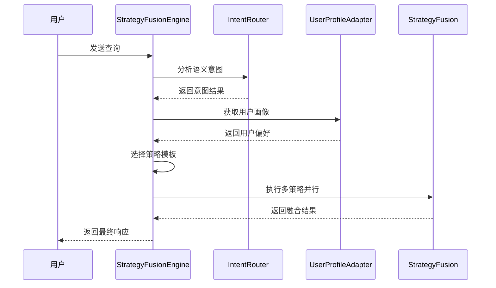

**图表来源**
- [src/retrieval/smart_routing/engine.py:68-129](file://src/retrieval/smart_routing/engine.py#L68-L129)

**章节来源**
- [src/retrieval/smart_routing/engine.py:34-274](file://src/retrieval/smart_routing/engine.py#L34-L274)

### 意图路由器 IntentRouter

IntentRouter负责语义意图分类、复杂度评估和策略模板映射。

#### 意图分类算法

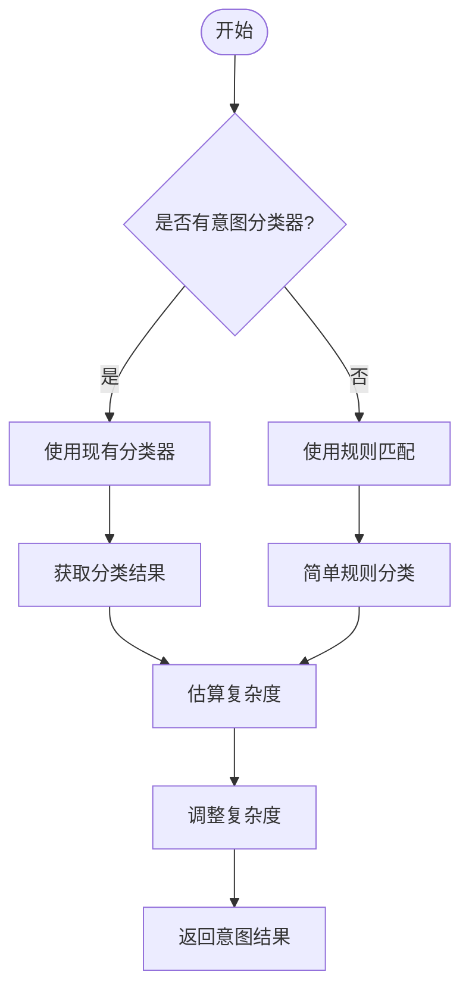

**图表来源**
- [src/retrieval/smart_routing/intent_router.py:115-155](file://src/retrieval/smart_routing/intent_router.py#L115-L155)

#### 复杂度评估因子

| 评估因子 | 计算方法 | 权重 |
|---------|---------|------|
| 查询长度 | min(len(query)/100, 1.0) × 0.3 | 0.3 |
| 问句数量 | min(question_marks/3, 1.0) × 0.4 | 0.4 |
| 连接词数量 | min(connector_count/5, 1.0) × 0.3 | 0.3 |

**章节来源**
- [src/retrieval/smart_routing/intent_router.py:200-238](file://src/retrieval/smart_routing/intent_router.py#L200-L238)

### 用户画像适配器 UserProfileAdapter

UserProfileAdapter负责用户画像的获取、管理和个性化定制。

#### 用户画像数据结构

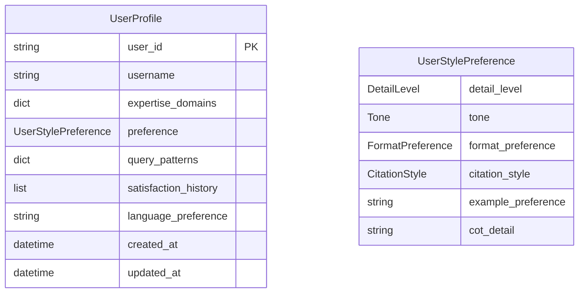

**图表来源**
- [src/retrieval/smart_routing/user_adapter.py:56-96](file://src/retrieval/smart_routing/user_adapter.py#L56-L96)

#### 个性化响应适配

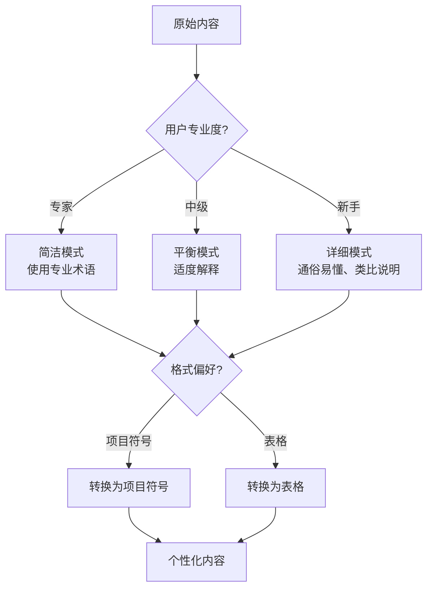

**图表来源**
- [src/retrieval/smart_routing/user_adapter.py:248-288](file://src/retrieval/smart_routing/user_adapter.py#L248-L288)

**章节来源**
- [src/retrieval/smart_routing/user_adapter.py:98-331](file://src/retrieval/smart_routing/user_adapter.py#L98-L331)

### CoT思维链控制器 CoTController

CoTController负责智能触发CoT思维链和动态深度调节。

#### CoT触发概率矩阵

| 意图类型 | 触发概率 | 复杂度调节 | 置信度调节 |
|---------|---------|-----------|-----------|
| 事实查询 | 0.1 | -0.2 | +0.15 |
| 比较分析 | 0.4 | -0.2 | +0.15 |
| 推理演绎 | 0.9 | +0.2 | +0.15 |
| 概念解释 | 0.5 | -0.2 | +0.15 |
| 摘要总结 | 0.3 | -0.2 | +0.15 |
| 操作指导 | 0.2 | -0.2 | +0.15 |
| 探索发散 | 0.7 | +0.2 | +0.15 |

#### CoT深度等级

| 等级 | 名称 | 步骤范围 | 特征 |
|------|------|---------|------|
| L1 | 精简版 | 1-2步 | 快速响应 |
| L2 | 标准版 | 3-4步 | 平衡效率 |
| L3 | 详细版 | 5-7步 | 深入分析 |
| L4 | 探索版 | 7+步 | 深度探索 |

**章节来源**
- [src/retrieval/smart_routing/cot_controller.py:41-107](file://src/retrieval/smart_routing/cot_controller.py#L41-L107)

### 策略融合引擎 StrategyFusion

StrategyFusion负责多策略并行执行和结果融合。

#### 多策略并行执行

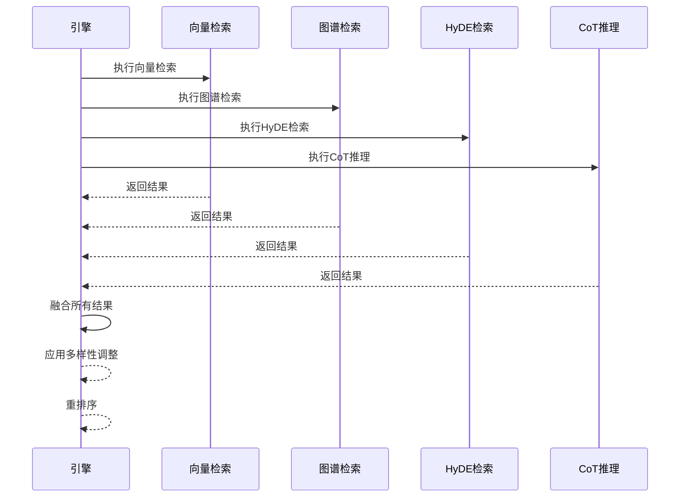

**图表来源**
- [src/retrieval/smart_routing/strategy_fusion.py:78-158](file://src/retrieval/smart_routing/strategy_fusion.py#L78-L158)

#### 结果融合算法

融合评分公式：
```
fusion_score(d) = Σ w_s × norm(score_s,d) × (1 + novelty_d) × diversity_penalty
```

其中：
- `w_s`：策略权重
- `norm(score_s,d)`：归一化分数
- `novelty_d`：新颖性加成
- `diversity_penalty`：多样性惩罚

**章节来源**
- [src/retrieval/smart_routing/strategy_fusion.py:217-271](file://src/retrieval/smart_routing/strategy_fusion.py#L217-L271)

## 响应生成流程

### 传统响应接口 vs 智能路由引擎

**传统响应接口流程**：
1. 获取用户画像
2. 确定详细程度
3. 语气适配
4. 详细程度适配
5. 生成思维链可视化
6. 更新用户画像

**智能路由引擎流程**：
1. 意图识别和复杂度评估
2. 用户画像适配和偏好调整
3. 策略模板选择和权重分配
4. 多策略并行执行
5. 结果融合和重排序
6. 个性化响应生成
7. 可解释性输出

### 响应生成算法

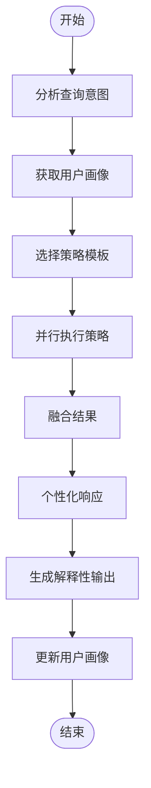

**图表来源**
- [src/retrieval/smart_routing/engine.py:68-129](file://src/retrieval/smart_routing/engine.py#L68-L129)

**章节来源**
- [src/retrieval/smart_routing/engine.py:170-195](file://src/retrieval/smart_routing/engine.py#L170-L195)

## 用户画像与个性化

### 用户画像数据模型

智能路由引擎采用增强的用户画像数据模型，支持更丰富的个性化能力。

#### 用户画像字段

| 字段名 | 类型 | 描述 | 默认值 |
|-------|------|------|-------|
| user_id | string | 用户唯一标识 | 必填 |
| username | string | 用户名 | null |
| expertise_domains | dict | 领域专业度映射 | {} |
| preference | UserStylePreference | 风格偏好 | 自动生成 |
| query_patterns | dict | 查询模式分析 | {} |
| satisfaction_history | list | 满意度历史 | [] |
| language_preference | string | 语言偏好 | "zh" |
| created_at | datetime | 创建时间 | 当前时间 |
| updated_at | datetime | 更新时间 | 当前时间 |

#### 专业度评估机制

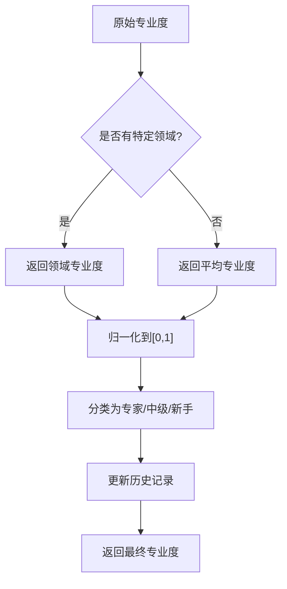

**图表来源**
- [src/retrieval/smart_routing/user_adapter.py:68-95](file://src/retrieval/smart_routing/user_adapter.py#L68-L95)

### 个性化响应策略

智能路由引擎根据用户画像实施多层次的个性化响应：

1. **专业度适配**：根据用户专业度调整详细程度和术语使用
2. **风格偏好适配**：根据用户偏好调整语气、格式和引用风格
3. **历史行为适配**：基于用户历史交互模式优化响应策略
4. **实时反馈适配**：根据用户反馈动态调整个性化参数

**章节来源**
- [src/retrieval/smart_routing/user_adapter.py:248-288](file://src/retrieval/smart_routing/user_adapter.py#L248-L288)

## 思维链可视化

### 可解释性输出设计

智能路由引擎保持了强大的可解释性输出能力，通过思维链可视化展示决策过程。

#### 思维链可视化组件

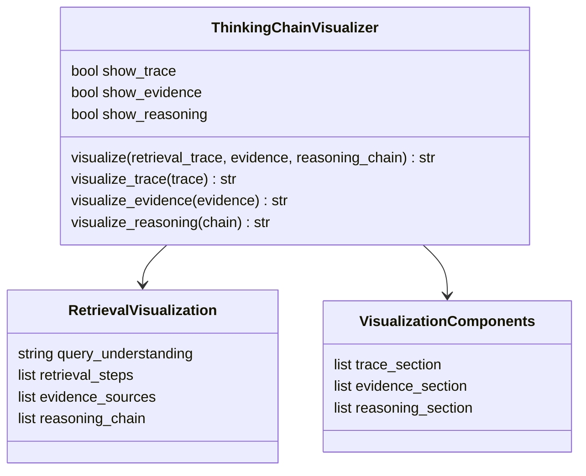

**图表来源**
- [src/response/visualizer.py:9-150](file://src/response/visualizer.py#L9-L150)

### 可解释性输出格式

思维链可视化包含三个核心部分：

1. **检索路径**：展示查询理解、实体识别、向量检索、图谱推理等步骤
2. **证据来源**：列出每个断言对应的证据ID和相关度
3. **推理过程**：展示多跳推理的逻辑链条

**章节来源**
- [src/response/visualizer.py:9-150](file://src/response/visualizer.py#L9-L150)

## 性能优化与早停机制

### 早停决策算法

智能路由引擎实现了智能的早停机制，基于多维度指标进行决策：

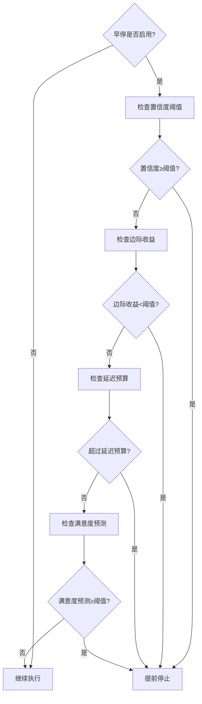

**图表来源**
- [src/retrieval/smart_routing/early_stopping.py:57-109](file://src/retrieval/smart_routing/early_stopping.py#L57-L109)

### 降级策略

当系统检测到性能压力时，智能路由引擎会自动应用降级策略：

| 降级等级 | 触发条件 | 降级动作 | 影响范围 |
|---------|---------|---------|---------|
| NONE | 正常运行 | 无降级 | 无 |
| LEVEL_1 | 延迟≥500ms | 减少并行策略数 | 降低响应质量 |
| LEVEL_2 | 延迟≥700ms | 跳过CoT推理 | 显著降低响应质量 |
| LEVEL_3 | 延迟≥900ms | 仅执行向量检索 | 严重降低响应质量 |
| LEVEL_4 | 延迟≥1000ms | 返回缓存或简化答案 | 基本功能降级 |

**章节来源**
- [src/retrieval/smart_routing/early_stopping.py:157-208](file://src/retrieval/smart_routing/early_stopping.py#L157-L208)

## 反馈学习系统

### 反馈信号收集

智能路由引擎建立了完整的反馈学习系统，支持显式和隐式反馈的收集和处理。

#### 反馈信号类型

| 信号类型 | 权重 | 描述 | 示例 |
|---------|------|------|------|
| explicit_rating | 1.0 | 显式评分 | 1-5星评价 |
| query_rewrite | 0.8 | 查询改写 | 重新搜索查询 |
| session_abandon | 0.7 | 会话放弃 | 用户离开页面 |
| re_search | 0.6 | 再次搜索 | 短时间内重新搜索 |
| dwell_time | 0.5 | 停留时长 | 页面停留时间 |
| citation_action | 0.9 | 引用行为 | 复制/分享内容 |

#### 在线学习算法

策略权重更新采用类似多臂赌博机(MAB)的算法：

```
new_weight = current_weight + α × prediction_error
prediction_error = reward - expected_reward
```

其中：
- `α`：学习率(默认0.1)
- `prediction_error`：预测误差
- `reward`：实际奖励(标准化到[-1,1])

**章节来源**
- [src/retrieval/smart_routing/feedback_loop.py:307-435](file://src/retrieval/smart_routing/feedback_loop.py#L307-L435)

## 集成与使用

### 基础使用示例

```python
import asyncio
from src.retrieval.smart_routing.engine import StrategyFusionEngine
from src.retrieval.smart_routing.intent_router import IntentRouter
from src.retrieval.smart_routing.user_adapter import UserProfileAdapter
from src.retrieval.smart_routing.cot_controller import CoTController
from src.retrieval.smart_routing.strategy_fusion import StrategyFusion
from src.retrieval.smart_routing.early_stopping import EarlyStoppingManager
from src.retrieval.smart_routing.feedback_loop import FeedbackCollector, StrategyLearner

async def main():
    # 初始化各个组件
    intent_router = IntentRouter()
    user_profile_adapter = UserProfileAdapter()
    cot_controller = CoTController()
    strategy_fusion = StrategyFusion()
    early_stopping = EarlyStoppingManager()
    feedback_collector = FeedbackCollector()
    strategy_learner = StrategyLearner(feedback_collector)
    
    # 创建智能路由引擎
    engine = StrategyFusionEngine(
        intent_router=intent_router,
        user_profile_adapter=user_profile_adapter,
        cot_controller=cot_controller,
        strategy_fusion=strategy_fusion,
        early_stopping=early_stopping,
        feedback_collector=feedback_collector,
        strategy_learner=strategy_learner,
    )
    
    # 执行查询路由
    query = "为什么微服务架构更适合大规模系统？"
    decision = await engine.route_query(
        query=query,
        user_id="user_123",
        session_context=None
    )
    
    print(f"意图类型：{decision.intent.intent_type}")
    print(f"置信度：{decision.confidence}")
    print(f"CoT启用：{decision.cot_enabled}")
    print(f"策略数量：{len(decision.strategies)}")

if __name__ == "__main__":
    asyncio.run(main())
```

**章节来源**
- [src/retrieval/smart_routing/example_usage.py:18-58](file://src/retrieval/smart_routing/example_usage.py#L18-L58)

### 与NecoRAG主框架集成

智能路由引擎已完全集成到NecoRAG主框架中：

```python
# NecoRAG主查询流程
def query(self, question: str, user_id: Optional[str] = None):
    # 意图分析和路由
    intent_result = self._intent_analyzer.analyze(question)
    
    # 智能路由决策
    routing_decision = await self.smart_routing_engine.route_query(
        query=question,
        user_id=user_id,
        session_context=intent_result
    )
    
    # 执行检索和响应生成
    results = await self.smart_routing_engine.execute_and_monitor(
        query=question,
        decision=routing_decision,
        retrieval_func=self._retrieval.retrieve
    )
    
    # 生成个性化响应
    response = self._response.respond(
        query=question,
        refinement_result=results,
        session_id=user_id
    )
    
    return response
```

**章节来源**
- [src/necorag.py:354-477](file://src/necorag.py#L354-L477)

## 迁移指南

### 从传统响应接口迁移到智能路由引擎

#### 主要变更

1. **API接口变更**：从ResponseInterface迁移到StrategyFusionEngine
2. **配置参数变更**：从简单参数变为复杂的配置对象
3. **响应流程变更**：从线性流程变为三层决策架构
4. **个性化机制变更**：从静态适配变为动态学习

#### 迁移步骤

1. **初始化变更**
   ```python
   # 传统方式
   response_interface = ResponseInterface(memory_manager)
   
   # 新方式
   engine = StrategyFusionEngine(
       intent_router=IntentRouter(),
       user_profile_adapter=UserProfileAdapter(memory_manager),
       cot_controller=CoTController(),
       strategy_fusion=StrategyFusion(),
       early_stopping=EarlyStoppingManager(),
       feedback_collector=FeedbackCollector(),
       strategy_learner=StrategyLearner(FeedbackCollector())
   )
   ```

2. **查询处理变更**
   ```python
   # 传统方式
   response = response_interface.respond(query, refinement_result, session_id)
   
   # 新方式
   decision = await engine.route_query(query, session_id)
   results = await engine.execute_and_monitor(query, decision, retrieval_func)
   # 响应生成保持兼容
   response = response_interface.respond(query, results, session_id)
   ```

3. **配置迁移**
   - 传统：简单参数配置
   - 新：复杂的配置对象和权重系统
   
4. **性能监控**
   - 传统：简单的统计信息
   - 新：全面的性能指标和早停机制

#### 兼容性保证

智能路由引擎保持了与传统响应接口的兼容性：

1. **响应格式兼容**：保持相同的Response对象结构
2. **思维链可视化**：完全兼容原有的可视化功能
3. **用户画像接口**：保持相同的用户画像管理接口
4. **API接口**：提供相同的查询接口

**章节来源**
- [src/retrieval/smart_routing/engine.py:68-129](file://src/retrieval/smart_routing/engine.py#L68-L129)

## API参考

### StrategyFusionEngine 主要方法

| 方法名 | 参数 | 返回值 | 描述 |
|--------|------|--------|------|
| `route_query` | query: str, user_id: Optional[str], session_context: Optional[Dict] | RoutingDecision | 执行智能路由决策 |
| `execute_and_monitor` | query: str, decision: RoutingDecision, retrieval_func | Dict | 执行检索并监控性能 |
| `update_from_feedback` | intent_type: str, strategy_id: str, reward: float, expected_reward: float | None | 从反馈中学习更新权重 |
| `get_stats` | - | Dict | 获取引擎统计信息 |

### RoutingDecision 数据结构

| 字段名 | 类型 | 描述 |
|--------|------|------|
| intent | IntentResult | 意图识别结果 |
| user_profile | Optional[Dict] | 用户画像 |
| strategies | List[StrategyWeight] | 策略权重列表 |
| cot_enabled | bool | 是否启用CoT |
| cot_depth | CoTDepth | CoT深度等级 |
| early_stop_config | Dict | 早停配置 |
| degradation_level | DegradationLevel | 降级等级 |
| confidence | float | 置信度 |
| processing_time_ms | int | 处理时间(ms) |

### 意图路由器 API

| 方法名 | 参数 | 返回值 | 描述 |
|--------|------|--------|------|
| `analyze_intent` | query: str, session_context: Optional[Dict] | IntentResult | 分析查询语义意图 |
| `get_strategy_template` | intent_type: IntentType | List[Dict] | 获取策略模板 |
| `should_trigger_cot` | intent_type: IntentType, complexity: float, confidence: float | bool | 判断是否触发CoT |

### 用户画像适配器 API

| 方法名 | 参数 | 返回值 | 描述 |
|--------|------|--------|------|
| `get_profile` | user_id: str | Optional[UserProfile] | 获取用户画像 |
| `update_profile` | user_id: str, updates: Dict, save_to_storage: bool | None | 更新用户画像 |
| `adapt_response_style` | content: str, user_profile: UserProfile, domain: Optional[str] | str | 适配响应风格 |
| `get_expertise_category` | expertise_level: float | str | 获取专业度分类 |

### CoT控制器 API

| 方法名 | 参数 | 返回值 | 描述 |
|--------|------|--------|------|
| `should_trigger_cot` | query: str, intent_type: str, complexity: float, confidence: float | bool | 判断是否触发CoT |
| `determine_depth` | query: str, user_profile: Optional[Dict], intent_result | CoTDepth | 确定CoT深度 |
| `get_max_steps_for_depth` | depth: CoTDepth | int | 获取指定深度的最大步骤数 |

### 策略融合引擎 API

| 方法名 | 参数 | 返回值 | 描述 |
|--------|------|--------|------|
| `execute_parallel` | query: str, strategies: List[StrategyWeight], cot_enabled: bool, cot_depth: Any, early_stop_callback | Dict | 并行执行多个策略 |
| `get_template_for_intent` | intent_type: str | List[StrategyWeight] | 获取意图对应的策略权重 |
| `_fuse_results` | results: List[RetrievalResult] | List[Dict] | 融合多个策略的结果 |

### 早停管理器 API

| 方法名 | 参数 | 返回值 | 描述 |
|--------|------|--------|------|
| `check_early_stop` | results: List[Any], elapsed_ms: int, config: Optional[Dict] | bool | 检查是否应该早停 |
| `get_degradation_level` | elapsed_ms: int | DegradationLevel | 获取降级等级 |
| `get_config` | intent_confidence: float, user_profile: Optional[Dict] | Dict | 获取动态配置 |
| `get_actions_for_level` | level: DegradationLevel | List[str] | 获取降级动作 |

### 反馈学习系统 API

| 方法名 | 参数 | 返回值 | 描述 |
|--------|------|--------|------|
| `collect_explicit_feedback` | user_id: str, query: str, results: List[Any], rating: int | FeedbackSignal | 收集显式反馈 |
| `collect_implicit_feedback` | query: str, results: List[Any], user_id: Optional[str], action_type: Optional[str], **kwargs | None | 收集隐式反馈 |
| `update_weights` | intent_type: str, strategy_id: str, reward: float, expected_reward: float | None | 更新策略权重 |
| `get_optimal_strategy` | intent_type: str, candidate_strategies: List[str] | str | 选择最优策略 |

## 配置与参数

### 智能路由引擎配置

#### EngineConfig 配置参数

| 参数名 | 类型 | 默认值 | 描述 |
|--------|------|--------|------|
| `intent_router` | IntentRouter | 必填 | 意图路由器实例 |
| `user_profile_adapter` | UserProfileAdapter | 必填 | 用户画像适配器实例 |
| `cot_controller` | CoTController | 必填 | CoT控制器实例 |
| `strategy_fusion` | StrategyFusion | 必填 | 策略融合引擎实例 |
| `early_stopping` | EarlyStoppingManager | 必填 | 早停管理器实例 |
| `feedback_collector` | FeedbackCollector | 必填 | 反馈收集器实例 |
| `strategy_learner` | StrategyLearner | 必填 | 策略学习器实例 |

#### EarlyStopConfig 配置参数

| 参数名 | 类型 | 默认值 | 描述 |
|--------|------|--------|------|
| `enabled` | bool | True | 是否启用早停 |
| `confidence_threshold` | float | 0.95 | 置信度阈值 |
| `diminishing_returns_threshold` | float | 0.02 | 边际收益阈值 |
| `latency_budget_ratio` | float | 0.8 | 延迟预算比例 |
| `satisfaction_threshold` | float | 4.5 | 满意度阈值 |
| `max_allowed_latency_ms` | int | 1000 | 最大允许延迟(ms) |
| `degradation_enabled` | bool | True | 是否启用降级 |
| `level1_latency_ms` | int | 500 | 降级1级延迟阈值 |
| `level2_latency_ms` | int | 700 | 降级2级延迟阈值 |
| `level3_latency_ms` | int | 900 | 降级3级延迟阈值 |
| `level4_latency_ms` | int | 1000 | 降级4级延迟阈值 |

#### FusionConfig 配置参数

| 参数名 | 类型 | 默认值 | 描述 |
|--------|------|--------|------|
| `diversity_enabled` | bool | True | 是否启用多样性 |
| `novelty_boost` | float | 0.1 | 新颖性加成 |
| `max_same_domain_ratio` | float | 0.6 | 同领域最大比例 |
| `min_cross_domain_count` | int | 2 | 跨领域最小数量 |
| `temporal_diversity` | bool | True | 是否启用时间多样性 |
| `source_diversity` | bool | True | 是否启用来源多样性 |

#### 用户偏好配置

| 参数名 | 类型 | 默认值 | 描述 |
|--------|------|--------|------|
| `detail_level` | DetailLevel | BALANCED | 详细度级别 |
| `tone` | Tone | FORMAL | 语调风格 |
| `format_preference` | FormatPreference | TEXT | 格式偏好 |
| `citation_style` | CitationStyle | INLINE | 引用风格 |
| `example_preference` | str | "moderate" | 示例偏好 |
| `cot_detail` | str | "standard" | CoT详细程度 |

### 性能监控配置

#### 统计信息字段

| 字段名 | 类型 | 描述 |
|--------|------|------|
| `total_requests` | int | 总请求数 |
| `avg_processing_time_ms` | float | 平均处理时间(ms) |
| `strategy_weights` | Dict | 策略权重配置 |
| `cot_trigger_rate` | float | CoT触发率 |

#### 学习统计字段

| 字段名 | 类型 | 描述 |
|--------|------|------|
| `total_updates` | int | 总更新次数 |
| `total_reward` | float | 总奖励值 |
| `avg_reward` | float | 平均奖励值 |
| `intent_distribution` | Dict | 意图分布统计 |

## 故障排除

### 常见问题及解决方案

#### 1. 智能路由引擎初始化失败

**症状**：引擎创建时报错
**可能原因**：
- 缺少必需的组件实例
- 配置参数错误
- 依赖服务不可用

**解决方法**：
```python
# 检查必需组件
required_components = ['intent_router', 'user_profile_adapter', 'cot_controller', 
                     'strategy_fusion', 'early_stopping', 'feedback_collector', 'strategy_learner']

for component in required_components:
    if locals().get(component) is None:
        raise ValueError(f"必需组件 {component} 未初始化")
```

#### 2. 意图识别准确率低

**症状**：意图分类结果不准确
**可能原因**：
- 意图分类器配置错误
- 规则匹配逻辑问题
- 训练数据不足

**解决方法**：
```python
# 检查意图分类器
if intent_router.intent_classifier:
    classification = intent_router.intent_classifier.classify(query)
    confidence = classification.get('confidence', 0.0)
    
    if confidence < 0.5:
        # 降级到规则匹配
        intent_type, confidence = intent_router._simple_rule_based_classification(query)
```

#### 3. 策略执行性能问题

**症状**：策略执行响应缓慢
**可能原因**：
- 并行策略过多
- 早停机制配置不当
- 检索器性能瓶颈

**解决方法**：
```python
# 调整早停配置
early_stop_config = EarlyStopConfig(
    enabled=True,
    confidence_threshold=0.9,
    max_allowed_latency_ms=500,  # 减少延迟阈值
)

# 减少并行策略数量
decision.strategies = decision.strategies[:3]  # 仅保留前3个策略
```

#### 4. 用户画像更新异常

**症状**：用户画像更新失败或数据不一致
**可能原因**：
- 记忆管理器连接问题
- 缓存同步问题
- 权限配置错误

**解决方法**：
```python
# 检查缓存状态
user_profile_adapter.clear_cache(user_id)

# 验证权限
if memory_manager:
    try:
        profile_data = memory_manager.get_user_profile(user_id)
        # 验证数据完整性
    except Exception as e:
        logger.error(f"用户画像读取失败: {e}")
```

#### 5. 反馈学习效果不佳

**症状**：策略权重更新不生效
**可能原因**：
- 学习率设置不当
- 反馈信号权重配置错误
- 策略权重范围限制

**解决方法**：
```python
# 调整学习参数
strategy_learner.learning_rate = 0.15  # 增大学习率

# 检查反馈信号
signal = feedback_collector.collect_explicit_feedback(
    user_id=user_id,
    query=query,
    results=results,
    rating=5
)

# 验证权重更新
await strategy_learner.update_weights(
    intent_type="reasoning_inference",
    strategy_id="graph_multi_hop",
    reward=signal.normalized_score(),
    expected_reward=0.6
)
```

**章节来源**
- [src/retrieval/smart_routing/engine.py:197-203](file://src/retrieval/smart_routing/engine.py#L197-L203)
- [src/retrieval/smart_routing/early_stopping.py:245-257](file://src/retrieval/smart_routing/early_stopping.py#L245-L257)

## 结论

智能路由与策略融合引擎代表了交互层模块的重大技术进步，通过三层决策架构实现了更加智能化和个性化的响应生成。

### 主要优势

1. **统一决策架构**：三层架构实现意图识别、用户画像和策略融合的统一管理
2. **智能路由决策**：基于查询特征和用户偏好的动态策略选择
3. **多策略并行执行**：提升响应效率和质量
4. **自适应学习能力**：基于反馈的在线学习和优化
5. **性能监控与早停**：确保系统稳定性和响应效率
6. **完整的可解释性**：思维链可视化展示决策过程

### 技术创新

1. **三层决策架构**：实现了真正的智能路由决策
2. **策略融合算法**：多策略并行执行和智能融合
3. **反馈学习系统**：基于用户反馈的持续优化
4. **性能监控机制**：实时性能指标和早停策略
5. **个性化响应适配**：多层次的个性化定制

### 未来发展方向

1. **强化学习优化**：引入强化学习算法优化策略选择
2. **多模态支持**：扩展到图像、音频等多模态交互
3. **情感计算**：集成情感分析和情感响应
4. **实时协作**：支持多人实时协作交互
5. **边缘计算**：优化移动端和边缘设备的性能

智能路由引擎不仅保持了原有交互层模块的所有功能，更重要的是通过技术创新实现了质的飞跃，为构建更加智能和人性化的交互系统奠定了坚实基础。