# 交互层模块

<cite>
**本文引用的文件**
- [src/response/interface.py](file://src/response/interface.py)
- [src/response/tone_adapter.py](file://src/response/tone_adapter.py)
- [src/response/detail_adapter.py](file://src/response/detail_adapter.py)
- [src/response/profile_manager.py](file://src/response/profile_manager.py)
- [src/response/visualizer.py](file://src/response/visualizer.py)
- [src/response/models.py](file://src/response/models.py)
- [src/core/protocols.py](file://src/core/protocols.py)
- [src/memory/manager.py](file://src/memory/manager.py)
- [src/refinement/models.py](file://src/refinement/models.py)
- [interface/api.py](file://interface/api.py)
- [interface/knowledge_service.py](file://interface/knowledge_service.py)
- [interface/main.py](file://interface/main.py)
- [wiki/wiki/交互层模块/交互层模块.md](file://wiki/wiki/交互层模块/交互层模块.md)
- [wiki/wiki/交互层模块/响应接口核心.md](file://wiki/wiki/交互层模块/响应接口核心.md)
- [wiki/wiki/交互层模块/思维链可视化.md](file://wiki/wiki/交互层模块/思维链可视化.md)
- [wiki/wiki/交互层模块/用户画像管理.md](file://wiki/wiki/交互层模块/用户画像管理.md)
</cite>

## 目录
1. [简介](#简介)
2. [项目结构](#项目结构)
3. [核心组件](#核心组件)
4. [架构概览](#架构概览)
5. [详细组件分析](#详细组件分析)
6. [依赖关系分析](#依赖关系分析)
7. [性能考虑](#性能考虑)
8. [故障排除指南](#故障排除指南)
9. [结论](#结论)
10. [附录](#附录)

## 简介

交互层模块是 NecoRAG 系统的核心组件，负责情境自适应生成与可解释性输出。该模块借鉴了猫通过呼噜声与人类交流的特性，专注于"表达"和"沟通"，提供人性化、可解释的交互体验。

交互层模块的主要设计理念包括：
- **情境自适应生成**：根据用户画像和查询上下文动态调整输出风格
- **可解释性输出**：展示 AI 的思考过程和决策依据
- **个性化体验**：基于用户历史交互建立个性化画像
- **多模态合成**：支持文本、图表、语音等多种输出形式

## 项目结构

交互层模块位于 `src/response/` 目录下，包含以下核心文件：

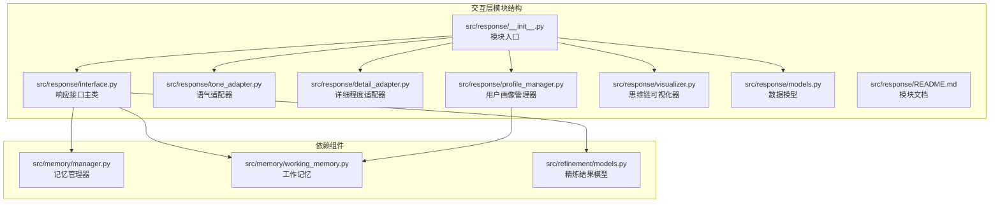

**图表来源**
- [src/response/__init__.py:1-23](file://src/response/__init__.py#L1-L23)
- [src/response/interface.py:16-54](file://src/response/interface.py#L16-L54)

**章节来源**
- [src/response/__init__.py:1-23](file://src/response/__init__.py#L1-L23)
- [src/response/README.md:1-398](file://src/response/README.md#L1-L398)

## 核心组件

交互层模块由五个核心组件构成，每个组件都有明确的职责和相互协作关系：

### 1. 响应接口主类 (ResponseInterface)
作为交互层的核心协调者，负责整合各个子组件并执行完整的响应生成流程。

### 2. 语气适配器 (ToneAdapter)
专门处理输出语气的适配和个性化注入，支持正式、友好、幽默三种风格。

### 3. 详细程度适配器 (DetailLevelAdapter)
根据查询复杂度和用户需求调整输出的详细程度，提供四个层次的输出格式。

### 4. 用户画像管理器 (UserProfileManager)
管理用户画像的创建、更新和分析，跟踪用户的交互历史和偏好。

### 5. 思维链可视化器 (ThinkingChainVisualizer)
生成可解释性的思维链可视化，展示 AI 的思考过程和决策依据。

**章节来源**
- [src/response/interface.py:16-132](file://src/response/interface.py#L16-L132)
- [src/response/tone_adapter.py:8-76](file://src/response/tone_adapter.py#L8-L76)
- [src/response/detail_adapter.py:8-56](file://src/response/detail_adapter.py#L8-L56)
- [src/response/profile_manager.py:10-100](file://src/response/profile_manager.py#L10-L100)
- [src/response/visualizer.py:9-72](file://src/response/visualizer.py#L9-L72)

## 架构概览

交互层模块采用分层架构设计，实现了高度的模块化和可扩展性：

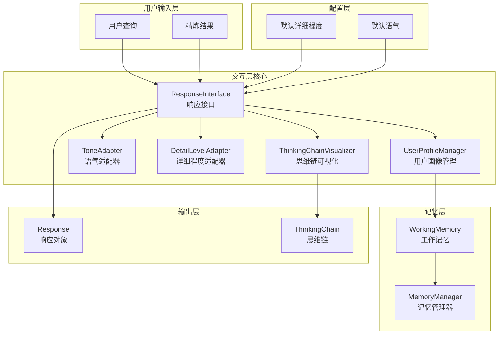

**图表来源**
- [src/response/interface.py:27-53](file://src/response/interface.py#L27-L53)
- [src/response/profile_manager.py:20-36](file://src/response/profile_manager.py#L20-L36)

### 控制流分析

交互层的响应生成遵循严格的顺序控制流程：

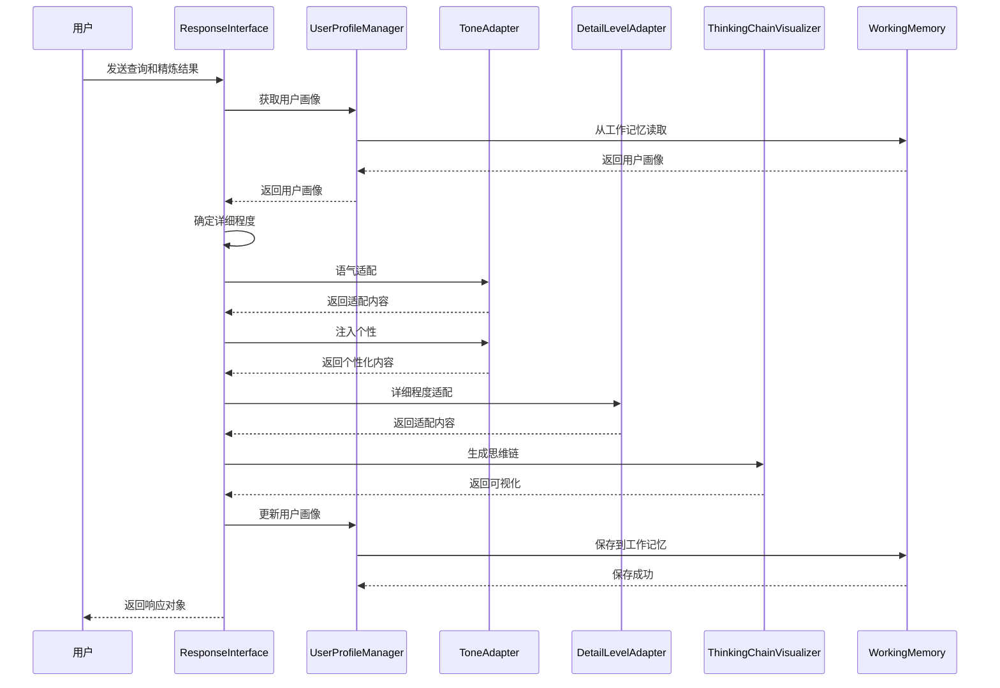

**图表来源**
- [src/response/interface.py:55-132](file://src/response/interface.py#L55-L132)
- [src/response/profile_manager.py:69-99](file://src/response/profile_manager.py#L69-L99)

## 详细组件分析

### 响应接口主类 (ResponseInterface)

ResponseInterface 是交互层的核心协调者，负责整合各个子组件并执行完整的响应生成流程。

#### 核心功能特性

1. **情境自适应生成**：根据用户画像和查询上下文动态调整输出风格
2. **用户画像适配**：基于历史交互数据个性化响应内容
3. **思维链可视化**：展示 AI 的思考过程和决策依据
4. **多模态输出**：支持文本、图表、语音等多种输出形式

#### 详细程度确定算法

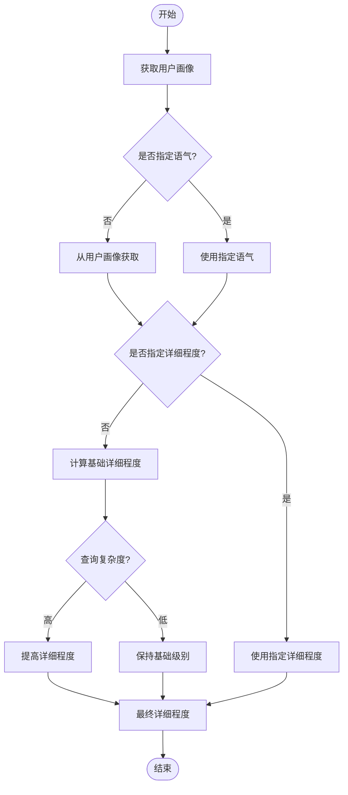

**图表来源**
- [src/response/interface.py:134-165](file://src/response/interface.py#L134-L165)

#### 详细程度映射规则

| 用户专业水平 | 基础级别 | 复杂查询调整 | 最终级别 |
|------------|---------|-------------|---------|
| 初学者 | 3 | +1 | 4 |
| 中级 | 2 | 不变 | 2 |
| 专家 | 1 | 不变 | 1 |

**章节来源**
- [src/response/interface.py:16-132](file://src/response/interface.py#L16-L132)

### 语气适配器 (ToneAdapter)

ToneAdapter 专门处理输出语气的适配和个性化注入，支持三种不同的语气风格。

#### 语气模板设计

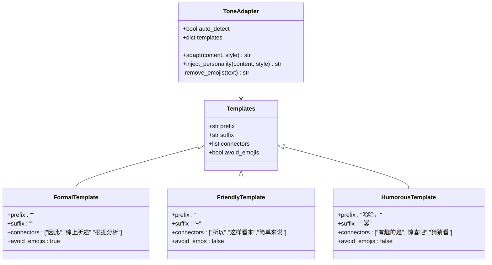

**图表来源**
- [src/response/tone_adapter.py:28-47](file://src/response/tone_adapter.py#L28-L47)

#### 语气适配流程

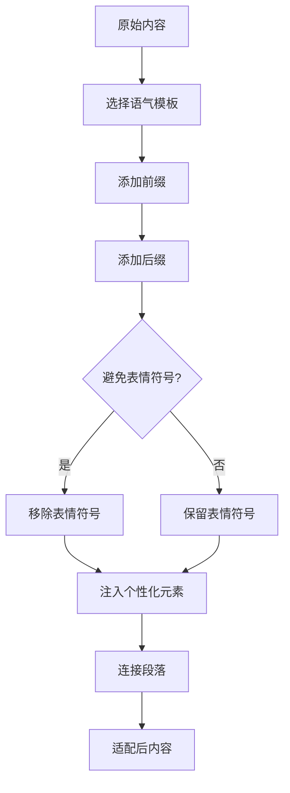

**图表来源**
- [src/response/tone_adapter.py:49-109](file://src/response/tone_adapter.py#L49-L109)

**章节来源**
- [src/response/tone_adapter.py:8-138](file://src/response/tone_adapter.py#L8-L138)

### 详细程度适配器 (DetailLevelAdapter)

DetailLevelAdapter 根据查询复杂度和用户需求调整输出的详细程度，提供四个层次的输出格式。

#### 详细程度层级设计

| 级别 | 名称 | 描述 | 适用场景 |
|------|------|------|----------|
| 1 | 简洁摘要 | 1-2句话总结 | 快速浏览、专家用户 |
| 2 | 标准回答 | 1段话+要点 | 日常查询、一般用户 |
| 3 | 详细解释 | 多段落+案例 | 学习研究、中级用户 |
| 4 | 深度分析 | 完整报告 | 专业分析、初学者 |

#### 内容适配算法

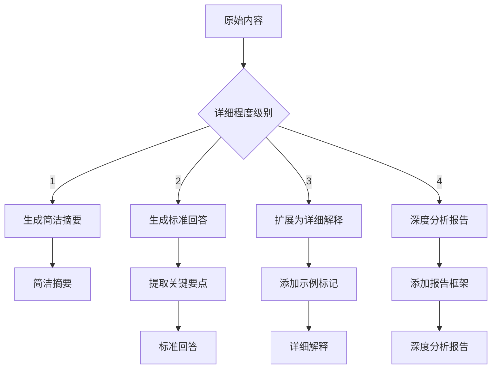

**图表来源**
- [src/response/detail_adapter.py:28-56](file://src/response/detail_adapter.py#L28-L56)

**章节来源**
- [src/response/detail_adapter.py:8-202](file://src/response/detail_adapter.py#L8-L202)

### 用户画像管理器 (UserProfileManager)

UserProfileManager 负责管理用户画像的创建、更新和分析，跟踪用户的交互历史和偏好。

#### 用户画像数据结构

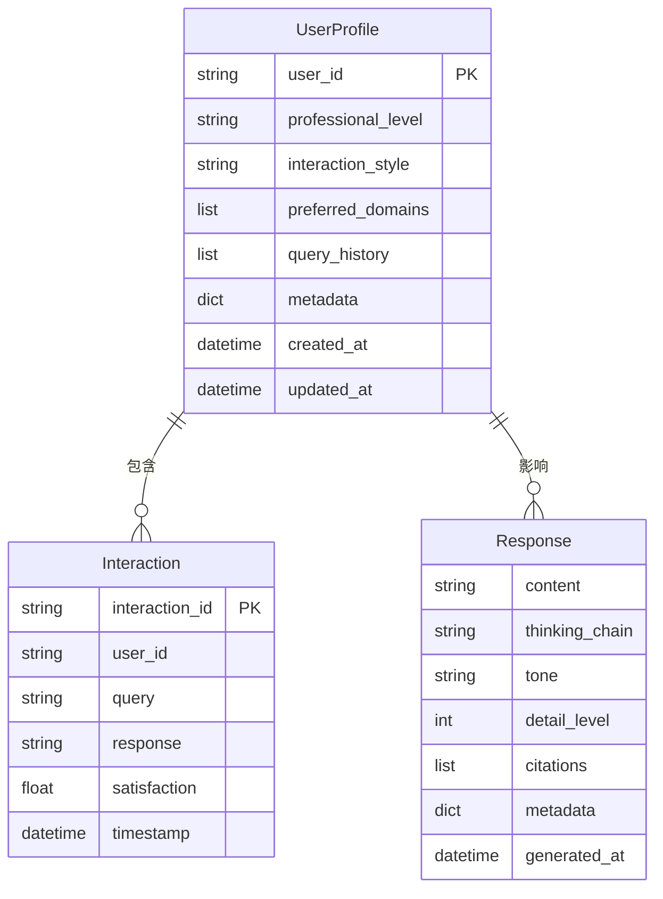

**图表来源**
- [src/response/models.py:10-44](file://src/response/models.py#L10-L44)

#### 画像更新机制

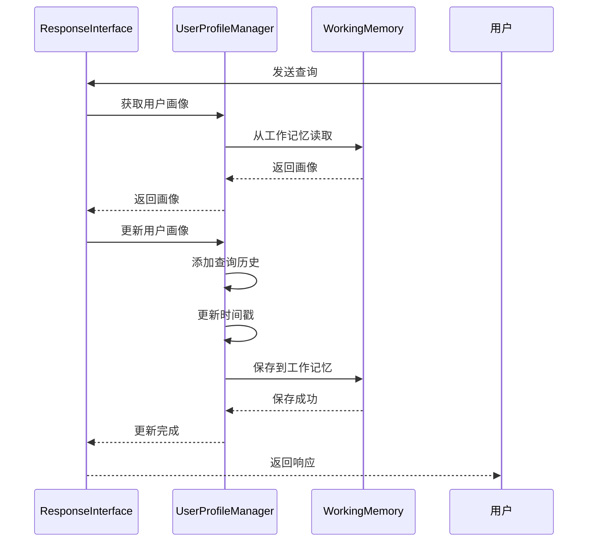

**图表来源**
- [src/response/profile_manager.py:69-99](file://src/response/profile_manager.py#L69-L99)

**章节来源**
- [src/response/profile_manager.py:10-165](file://src/response/profile_manager.py#L10-L165)

### 思维链可视化器 (ThinkingChainVisualizer)

ThinkingChainVisualizer 生成可解释性的思维链可视化，展示 AI 的思考过程和决策依据。

#### 可视化组件结构

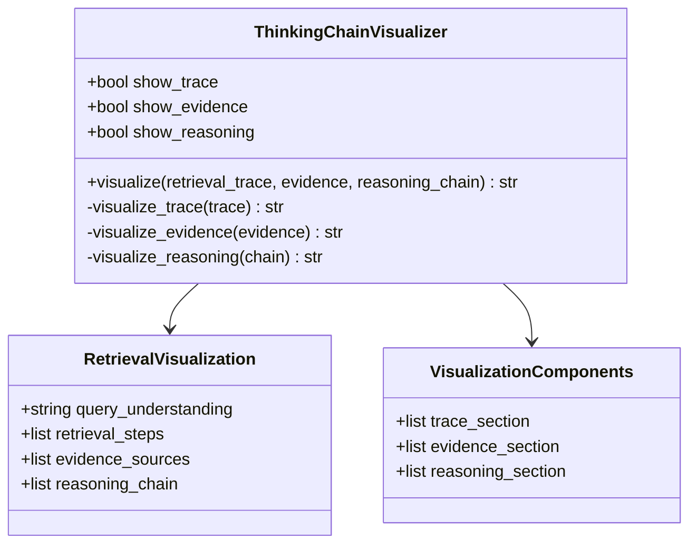

**图表来源**
- [src/response/visualizer.py:9-150](file://src/response/visualizer.py#L9-L150)

#### 可视化输出格式

思维链可视化包含三个核心部分：

1. **检索路径**：展示查询理解、实体识别、向量检索、图谱推理等步骤
2. **证据来源**：列出每个断言对应的证据ID和相关度
3. **推理过程**：展示多跳推理的逻辑链条

**章节来源**
- [src/response/visualizer.py:9-150](file://src/response/visualizer.py#L9-L150)

## 依赖关系分析

交互层模块的依赖关系体现了清晰的分层架构设计：

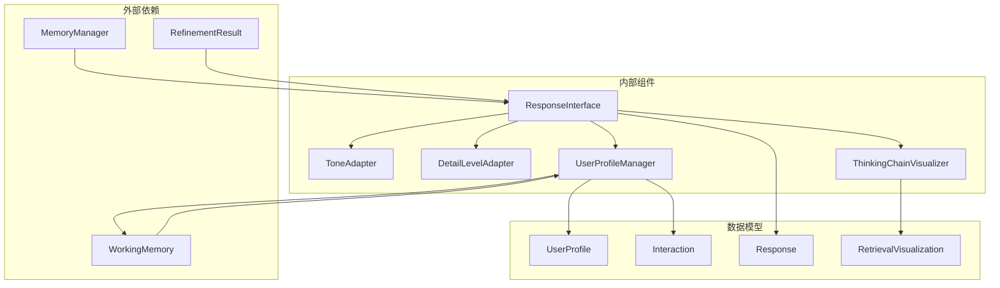

**图表来源**
- [src/response/interface.py:5-13](file://src/response/interface.py#L5-L13)
- [src/response/profile_manager.py:6-7](file://src/response/profile_manager.py#L6-L7)

### 组件耦合度分析

交互层模块采用了松耦合的设计原则：

1. **低耦合高内聚**：每个组件职责明确，内部实现相对独立
2. **接口标准化**：通过清晰的数据模型定义组件间的交互接口
3. **依赖注入**：通过构造函数注入依赖，便于测试和替换

### 循环依赖检查

经过分析，交互层模块不存在循环依赖：
- ResponseInterface 依赖各适配器和管理器
- 各适配器和管理器不依赖 ResponseInterface
- 所有组件都依赖于共享的数据模型

**章节来源**
- [src/response/interface.py:5-13](file://src/response/interface.py#L5-L13)
- [src/response/profile_manager.py:6-7](file://src/response/profile_manager.py#L6-L7)

## 性能考虑

交互层模块在设计时充分考虑了性能优化：

### 时间复杂度分析

1. **响应生成流程**：O(n) 时间复杂度，其中 n 为内容长度
2. **用户画像查询**：O(1) 平均时间复杂度（基于缓存）
3. **详细程度适配**：O(m) 时间复杂度，m 为段落数量
4. **思维链可视化**：O(p) 时间复杂度，p 为步骤数量

### 空间复杂度分析

1. **用户画像缓存**：O(h) 空间复杂度，h 为历史记录数
2. **内容适配**：O(n) 空间复杂度，n 为内容长度
3. **可视化输出**：O(s) 空间复杂度，s 为可视化字符串长度

### 性能优化策略

1. **缓存机制**：用户画像和配置信息缓存，减少重复计算
2. **延迟加载**：非必要的组件按需初始化
3. **批量处理**：支持批量用户画像更新
4. **异步处理**：可选的异步响应生成

## 故障排除指南

### 常见问题及解决方案

#### 1. 用户画像获取失败

**症状**：用户画像为空或默认值
**可能原因**：
- 工作记忆服务不可用
- 用户ID格式错误
- 缓存失效

**解决方法**：
- 检查工作记忆连接状态
- 验证用户ID格式
- 清理缓存并重新加载

#### 2. 语气适配异常

**症状**：输出语气不符合预期
**可能原因**：
- 语气模板配置错误
- 内容包含特殊字符
- Emoji处理异常

**解决方法**：
- 检查语气模板配置
- 验证输入内容编码
- 调整表情符号处理设置

#### 3. 详细程度适配问题

**症状**：输出过于简略或冗长
**可能原因**：
- 查询复杂度判断错误
- 用户专业水平识别偏差
- 详细程度映射配置不当

**解决方法**：
- 调整查询复杂度检测算法
- 更新用户专业水平识别逻辑
- 优化详细程度映射规则

#### 4. 思维链可视化缺失

**症状**：响应缺少可解释性信息
**可能原因**：
- 可视化组件禁用
- 精炼结果格式错误
- 输出格式配置问题

**解决方法**：
- 检查可视化组件启用状态
- 验证精炼结果数据结构
- 调整输出格式配置

**章节来源**
- [src/response/interface.py:134-224](file://src/response/interface.py#L134-L224)
- [src/response/tone_adapter.py:111-138](file://src/response/tone_adapter.py#L111-L138)
- [src/response/detail_adapter.py:158-202](file://src/response/detail_adapter.py#L158-L202)

## 结论

交互层模块通过精心设计的架构和算法，实现了情境自适应生成与可解释性输出的完美结合。该模块的主要优势包括：

1. **高度模块化**：清晰的组件分离和职责划分
2. **强可解释性**：完整的思维链可视化展示AI决策过程
3. **个性化体验**：基于用户画像的自适应输出
4. **性能优化**：合理的缓存和延迟加载策略
5. **扩展性强**：良好的接口设计便于功能扩展

未来可以考虑的改进方向：
- 强化学习优化个性化
- 多语言支持
- 情感计算集成
- 实时协作功能

## 附录

### API参考

#### ResponseInterface 方法

| 方法名 | 参数 | 返回值 | 描述 |
|--------|------|--------|------|
| `respond` | query, refinement_result, session_id, tone, detail_level | Response | 生成响应 |
| `get_user_preference` | user_id | dict | 获取用户偏好分析 |

#### ToneAdapter 方法

| 方法名 | 参数 | 返回值 | 描述 |
|--------|------|--------|------|
| `adapt` | content, style | str | 适配语气 |
| `inject_personality` | content, style | str | 注入个性化元素 |

#### DetailLevelAdapter 方法

| 方法名 | 参数 | 返回值 | 描述 |
|--------|------|--------|------|
| `adapt` | content, level | str | 适配详细程度 |
| `summarize` | content | str | 生成简洁摘要 |
| `expand` | content | str | 扩展为详细解释 |

### 配置选项

#### 用户画像管理器配置

| 参数名 | 类型 | 默认值 | 说明 |
|--------|------|--------|------|
| `profile_ttl` | int | 86400 | 画像 TTL（秒） |
| `max_history` | int | 100 | 最大历史记录数 |
| `style_detection` | bool | True | 自动风格检测 |

#### 语气适配器配置

| 参数名 | 类型 | 默认值 | 说明 |
|--------|------|--------|------|
| `default_tone` | str | "friendly" | 默认语气 |
| `auto_detect` | bool | True | 自动检测语气 |
| `personality_injection` | bool | True | 注入个性 |

#### 详细程度适配器配置

| 参数名 | 类型 | 默认值 | 说明 |
|--------|------|--------|------|
| `default_level` | int | 2 | 默认详细程度 |
| `auto_adjust` | bool | True | 自动调整 |

### 集成指南

#### 基本集成步骤

1. **初始化响应接口**
```python
from src.response.interface import ResponseInterface
from src.memory.manager import MemoryManager

memory_manager = MemoryManager()
response_interface = ResponseInterface(
    memory=memory_manager,
    default_tone="friendly",
    default_detail_level=2
)
```

2. **生成个性化响应**
```python
response = response_interface.respond(
    query="查询内容",
    refinement_result=refinement_result,
    session_id="user_123",
    tone="friendly",
    detail_level=3
)
```

3. **获取用户偏好**
```python
preference = response_interface.get_user_preference("user_123")
```

#### 与API服务集成

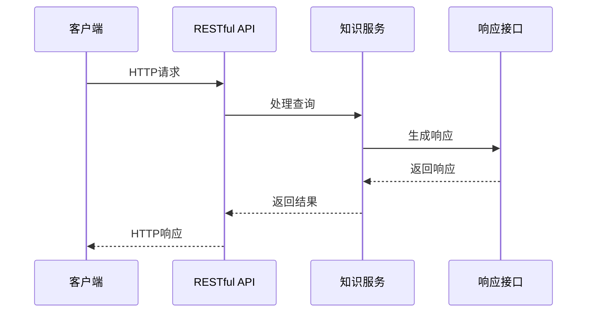

**图表来源**
- [interface/api.py:73-84](file://interface/api.py#L73-L84)
- [interface/knowledge_service.py:45-72](file://interface/knowledge_service.py#L45-L72)

#### WebSocket集成

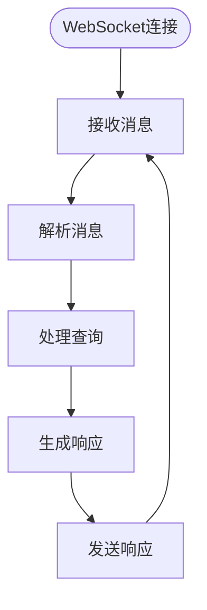

**图表来源**
- [interface/main.py:30-58](file://interface/main.py#L30-L58)

**章节来源**
- [interface/api.py:19-152](file://interface/api.py#L19-L152)
- [interface/knowledge_service.py:27-307](file://interface/knowledge_service.py#L27-L307)
- [interface/main.py:14-82](file://interface/main.py#L14-L82)