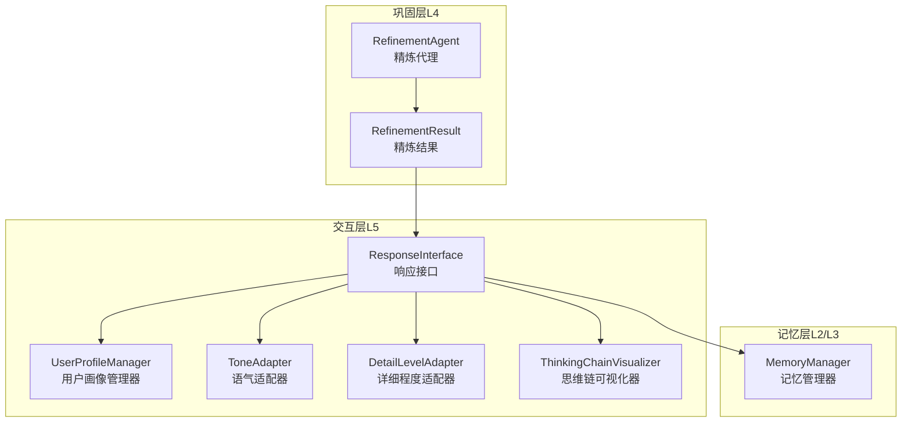
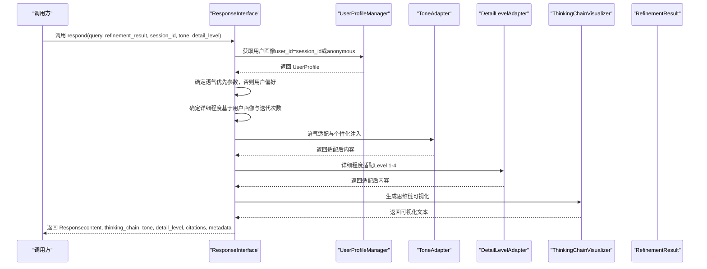
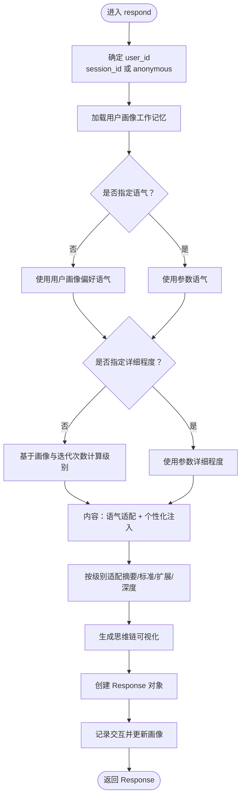
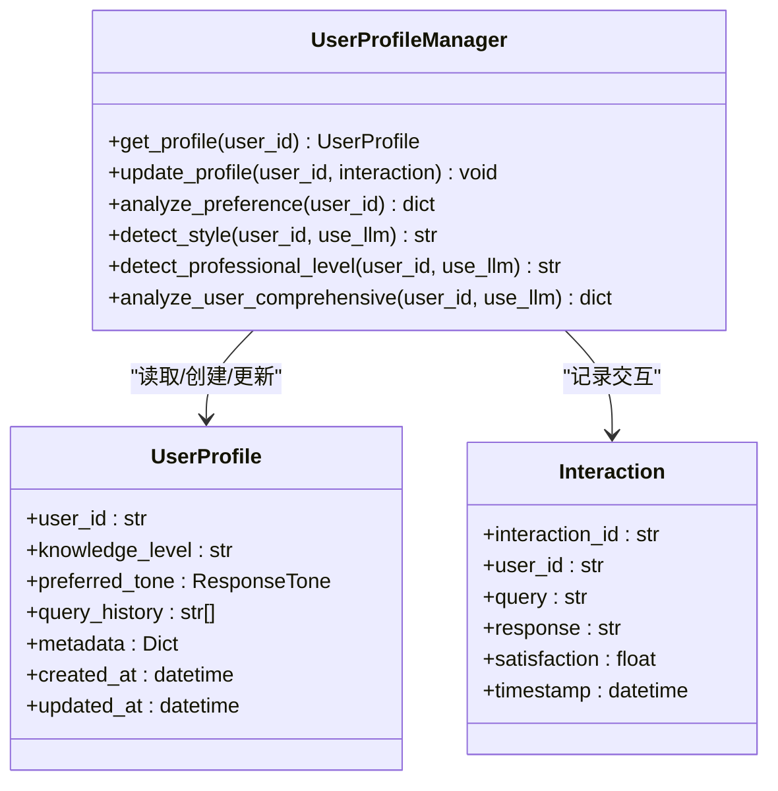
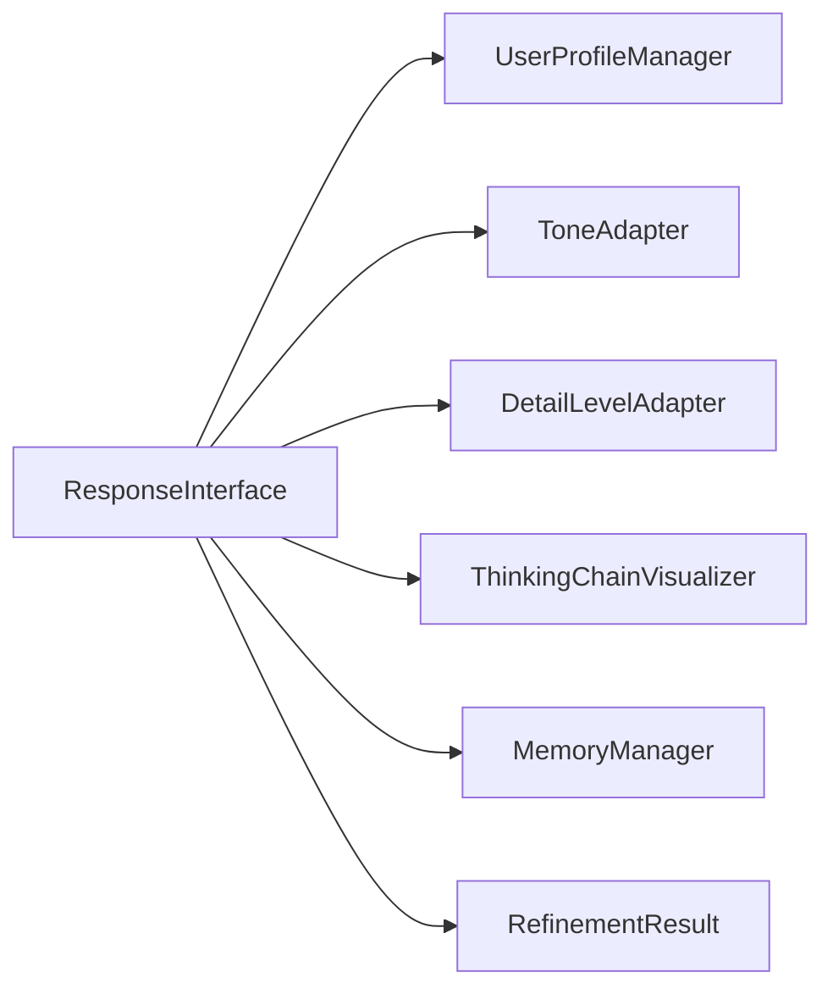
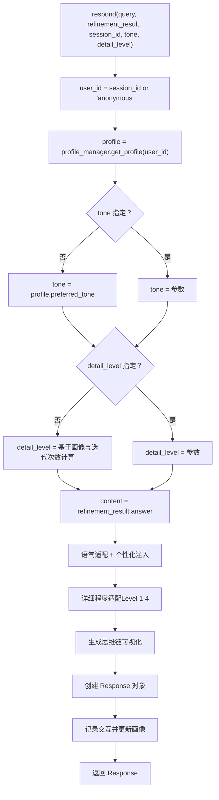

# 响应接口核心

<cite>
**本文引用的文件**
- [interface.py](file://src/response/interface.py)
- [__init__.py](file://src/response/__init__.py)
- [models.py](file://src/response/models.py)
- [detail_adapter.py](file://src/response/detail_adapter.py)
- [tone_adapter.py](file://src/response/tone_adapter.py)
- [visualizer.py](file://src/response/visualizer.py)
- [protocols.py](file://src/core/protocols.py)
- [models.py](file://src/refinement/models.py)
- [example_usage.py](file://example/example_usage.py)
- [manager.py](file://src/memory/manager.py)
- [agent.py](file://src/refinement/agent.py)
- [exceptions.py](file://src/core/exceptions.py)
</cite>

## 目录
1. [引言](#引言)
2. [项目结构](#项目结构)
3. [核心组件](#核心组件)
4. [架构总览](#架构总览)
5. [详细组件分析](#详细组件分析)
6. [依赖分析](#依赖分析)
7. [性能考量](#性能考量)
8. [故障排查指南](#故障排查指南)
9. [结论](#结论)
10. [附录](#附录)

## 引言
本文件围绕响应接口核心（ResponseInterface）展开，系统性阐述其设计架构、核心工作机制与使用方法。重点覆盖以下方面：
- 用户画像获取与偏好适配
- 语气风格与详细程度的自适应控制
- 思维链生成与可视化
- 用户ID处理策略（匿名与会话ID）
- 默认参数配置（LLM模型、默认语气、详细程度）
- 响应对象的创建与组织（内容、思维链、引用、元数据）
- 使用示例与最佳实践
- 错误处理机制与性能优化建议

## 项目结构
响应接口位于交互层（L5），负责将巩固层（L4）的精炼结果转化为情境自适应、可解释的最终响应，并通过思维链可视化提升透明度与可信度。

图表来源
- [interface.py:20-140](file://src/response/interface.py#L20-L140)
- [agent.py:20-164](file://src/refinement/agent.py#L20-L164)
- [manager.py:20-212](file://src/memory/manager.py#L20-L212)

章节来源
- [interface.py:20-140](file://src/response/interface.py#L20-L140)
- [__init__.py:6-27](file://src/response/__init__.py#L6-L27)

## 核心组件
- ResponseInterface：响应接口主类，协调用户画像、语气、详细程度与思维链生成，产出最终响应对象。
- UserProfileManager：用户画像管理与偏好分析，支持专业水平与交互风格检测。
- ToneAdapter：语气风格适配与个性化注入。
- DetailLevelAdapter：基于级别的内容扩展/摘要/深度分析，支持LLM增强与退化模式。
- ThinkingChainVisualizer：思维链可视化，展示检索路径、证据来源与推理过程。
- RefinementResult：巩固层输出的标准化结果，包含答案、置信度、引用与迭代次数等。
- MemoryManager：工作记忆上下文读写，支撑用户画像持久化。

章节来源
- [interface.py:20-140](file://src/response/interface.py#L20-L140)
- [profile_manager.py:20-174](file://src/response/profile_manager.py#L20-L174)
- [tone_adapter.py:8-138](file://src/response/tone_adapter.py#L8-L138)
- [detail_adapter.py:18-94](file://src/response/detail_adapter.py#L18-L94)
- [visualizer.py:9-150](file://src/response/visualizer.py#L9-L150)
- [models.py:38-47](file://src/refinement/models.py#L38-L47)
- [manager.py:20-212](file://src/memory/manager.py#L20-L212)

## 架构总览
响应接口的执行流从“查询+精炼结果”出发，经过用户画像与偏好分析，结合语气与详细程度适配，生成思维链可视化，最终封装为统一响应对象。

图表来源
- [interface.py:59-140](file://src/response/interface.py#L59-L140)
- [profile_manager.py:115-141](file://src/response/profile_manager.py#L115-L141)
- [tone_adapter.py:49-109](file://src/response/tone_adapter.py#L49-L109)
- [detail_adapter.py:64-94](file://src/response/detail_adapter.py#L64-L94)
- [visualizer.py:37-71](file://src/response/visualizer.py#L37-L71)

## 详细组件分析

### ResponseInterface 设计与流程
- 初始化：注入 MemoryManager、默认语气与详细程度，并创建子组件（用户画像管理、语气适配、详细程度适配、思维链可视化）。
- respond 主流程：
  - 用户ID策略：优先使用 session_id，否则回退为 anonymous。
  - 用户画像：从工作记忆上下文中读取或创建 UserProfile。
  - 语气确定：若未显式传入，则采用用户画像中的偏好语气。
  - 详细程度：若未显式传入，则基于用户画像与精炼迭代次数推断。
  - 内容适配：先语气适配，再个性化注入，最后按级别进行详细程度适配。
  - 思维链：基于查询、引用数量与精炼结果的置信度、迭代次数、幻觉检测状态生成可视化文本。
  - 响应对象：封装 content、thinking_chain、tone、detail_level、citations、metadata。
  - 更新画像：记录本次交互（交互ID、用户ID、查询、响应），写回工作记忆上下文。
- 辅助方法：
  - _determine_detail_level：依据用户专业水平与迭代次数动态调整详细程度。
  - _generate_thinking_chain：构建检索路径、证据来源与推理过程的可视化文本。
  - get_user_preference：返回用户偏好分析结果（关键词、交互风格、专业水平等）。

图表来源
- [interface.py:59-140](file://src/response/interface.py#L59-L140)
- [interface.py:142-173](file://src/response/interface.py#L142-L173)
- [interface.py:175-219](file://src/response/interface.py#L175-L219)

章节来源
- [interface.py:31-140](file://src/response/interface.py#L31-L140)

### 用户画像与偏好分析（UserProfileManager）
- 用户画像来源：工作记忆上下文；若不存在则创建默认画像。
- 专业水平检测：基于查询词汇与问题复杂度的规则检测，支持 LLM 增强模式。
- 交互风格检测：基于查询长度、关键词的规则检测，支持 LLM 增强模式。
- 偏好分析：统计高频关键词、交互风格与专业水平。
- 画像更新：记录交互历史、更新时间，写回工作记忆上下文。

图表来源
- [profile_manager.py:20-174](file://src/response/profile_manager.py#L20-L174)
- [protocols.py:282-298](file://src/core/protocols.py#L282-L298)
- [models.py:14-21](file://src/response/models.py#L14-L21)

章节来源
- [profile_manager.py:115-174](file://src/response/profile_manager.py#L115-L174)
- [protocols.py:282-298](file://src/core/protocols.py#L282-L298)

### 语气适配（ToneAdapter）
- 支持风格：正式（professional）、友好（friendly）、幽默（humorous）。
- 适配策略：为内容添加前后缀、连接词注入；正式风格可移除表情符号。
- 个性化注入：在段落之间插入风格化连接词，增强连贯性。

章节来源
- [tone_adapter.py:8-138](file://src/response/tone_adapter.py#L8-L138)

### 详细程度适配（DetailLevelAdapter）
- 级别定义：Level 1（简洁摘要）、Level 2（标准回答）、Level 3（详细解释）、Level 4（深度分析）。
- 适配逻辑：根据级别调用对应方法；支持 LLM 增强与退化模式（无 LLM 时使用规则处理）。
- 退化策略：摘要时提取首句或截断；扩展时添加结构化框架与示例提示；深度分析时输出结构化报告框架。

章节来源
- [detail_adapter.py:18-417](file://src/response/detail_adapter.py#L18-L417)

### 思维链可视化（ThinkingChainVisualizer）
- 可视化内容：检索路径、证据来源（最多5条）、推理过程（置信度、迭代次数、幻觉检测状态）。
- 输出形式：文本串与结构化对象（RetrievalVisualization）。

章节来源
- [visualizer.py:9-150](file://src/response/visualizer.py#L9-L150)

### 响应对象与数据模型
- Response：统一响应数据结构，包含 content、thinking_chain、tone、detail_level、citations、metadata 等。
- UserProfile/Interaction：用户画像与交互记录的数据模型，支撑画像管理与偏好分析。

章节来源
- [protocols.py:265-278](file://src/core/protocols.py#L265-L278)
- [models.py:13-31](file://src/response/models.py#L13-L31)

## 依赖分析
- 内部依赖：
  - ResponseInterface 依赖 MemoryManager（工作记忆上下文）、UserProfileManager、ToneAdapter、DetailLevelAdapter、ThinkingChainVisualizer。
  - 与 RefinementResult 解耦，仅依赖其标准化字段（answer、citations、confidence、iterations、hallucination_report）。
- 外部依赖：
  - LLM 客户端（可选）：用于增强语气与详细程度适配的 LLM 模式，未启用时退化为规则处理。
  - 日志：使用标准库日志记录关键事件与调试信息。

图表来源
- [interface.py:31-58](file://src/response/interface.py#L31-L58)
- [models.py:38-47](file://src/refinement/models.py#L38-L47)

章节来源
- [interface.py:31-58](file://src/response/interface.py#L31-L58)

## 性能考量
- 用户画像缓存：UserProfileManager 内置内存缓存，减少重复读取工作记忆的开销。
- 详细程度适配的退化模式：在无 LLM 场景下避免远程调用延迟，保证响应速度。
- 思维链生成：仅拼装固定模板与统计信息，复杂度低。
- 建议优化：
  - 对用户画像与思维链生成进行异步化与批量化处理（高并发场景）。
  - 对 LLM 调用增加超时与重试策略，避免阻塞主流程。
  - 对 RefinementResult 的 citations 数量进行上限控制，避免思维链过长影响渲染性能。

## 故障排查指南
- 当前实现中的异常处理现状：
  - 响应接口与各子组件未显式捕获异常，调用方需自行处理可能的异常。
  - 若用户画像或记忆上下文缺失，UserProfileManager.get_profile 将创建新画像；若工作记忆接口异常，可能导致 profile 无法读取或写入。
- 建议的异常处理策略：
  - 在 respond 中增加 try-except 包裹关键步骤，捕获与日志记录异常详情。
  - 对 MemoryManager、UserProfileManager、RefinementResult 的访问增加健壮性检查。
  - 对外部依赖（如 LLM 模型）的调用建议使用统一的异常类型，便于上层统一处理。
- 可参考的异常类型：
  - NecoRAGError 及其子类（如 GenerationError、RefinementError 等）可用于统一错误表达与传递。

章节来源
- [exceptions.py:10-200](file://src/core/exceptions.py#L10-L200)

## 结论
ResponseInterface 通过用户画像、语气风格与详细程度的自适应组合，实现了情境感知的交互响应；配合思维链可视化，显著提升了响应的可解释性与用户体验。当前实现以模块化设计为核心，耦合度低、扩展性强。建议在未来版本中完善异常处理与错误传播机制，以增强系统的鲁棒性与可观测性。

## 附录

### 默认参数与配置
- 默认 LLM 模型：字符串标识（默认值为 "default"）。
- 默认语气：friendly。
- 默认详细程度：2（标准回答）。
- 详细程度映射：基于用户画像的级别映射（初学者→3，中级→2，专家→1），并根据迭代次数进行上调。

章节来源
- [interface.py:31-58](file://src/response/interface.py#L31-L58)
- [interface.py:142-173](file://src/response/interface.py#L142-L173)

### 使用示例
- 初始化响应接口并生成个性化响应：
  - 步骤：创建 MemoryManager，准备 RefinementResult，初始化 ResponseInterface，调用 respond 生成 Response。
  - 示例路径：[example_usage.py:176-215](file://example/example_usage.py#L176-L215)

章节来源
- [example_usage.py:176-215](file://example/example_usage.py#L176-L215)

### 关键流程图（代码级）

图表来源
- [interface.py:59-140](file://src/response/interface.py#L59-L140)