# 响应接口核心

<cite>
**本文档引用的文件**
- [interface.py](file://src/response/interface.py)
- [models.py](file://src/response/models.py)
- [profile_manager.py](file://src/response/profile_manager.py)
- [detail_adapter.py](file://src/response/detail_adapter.py)
- [tone_adapter.py](file://src/response/tone_adapter.py)
- [visualizer.py](file://src/response/visualizer.py)
- [protocols.py](file://src/core/protocols.py)
- [models.py](file://src/refinement/models.py)
- [example_usage.py](file://example/example_usage.py)
- [__init__.py](file://src/response/__init__.py)
</cite>

## 目录
1. [简介](#简介)
2. [项目结构](#项目结构)
3. [核心组件](#核心组件)
4. [架构概览](#架构概览)
5. [详细组件分析](#详细组件分析)
6. [依赖关系分析](#依赖关系分析)
7. [性能考虑](#性能考虑)
8. [故障排除指南](#故障排除指南)
9. [结论](#结论)
10. [附录](#附录)

## 简介

响应接口核心（Response Interface Core）是 NecoRAG 五层认知架构中的交互层核心组件，负责将系统各层的处理结果转换为情境自适应的用户响应。该组件实现了以下核心功能：

- **情境自适应生成**：根据用户画像和查询上下文动态调整响应内容
- **用户画像适配**：基于用户历史交互分析其专业水平和偏好风格
- **多模态输出设计**：支持不同详细程度和语气风格的响应生成
- **思维链可视化**：提供可解释性的推理过程展示

响应接口通过整合记忆管理、用户画像分析、语气适配和详细程度控制等功能，为用户提供个性化、可解释且高质量的交互体验。

## 项目结构

响应接口核心位于 `src/response/` 目录下，包含以下关键文件：

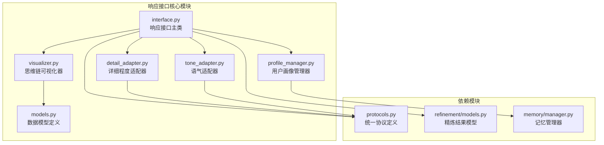

**图表来源**
- [interface.py:1-232](file://src/response/interface.py#L1-L232)
- [profile_manager.py:1-505](file://src/response/profile_manager.py#L1-L505)
- [detail_adapter.py:1-417](file://src/response/detail_adapter.py#L1-L417)
- [tone_adapter.py:1-138](file://src/response/tone_adapter.py#L1-L138)
- [visualizer.py:1-150](file://src/response/visualizer.py#L1-L150)

**章节来源**
- [interface.py:1-232](file://src/response/interface.py#L1-L232)
- [__init__.py:1-28](file://src/response/__init__.py#L1-L28)

## 核心组件

响应接口核心由五个主要组件构成，每个组件都有特定的功能职责：

### 1. ResponseInterface 主控制器
- **职责**：协调各个子组件，执行完整的响应生成流程
- **核心方法**：`respond()` 主响应生成方法
- **初始化参数**：记忆管理器、LLM模型、默认语气、默认详细程度

### 2. UserProfileManager 用户画像管理
- **职责**：管理用户画像，分析用户偏好和专业水平
- **功能**：专业水平检测、风格偏好分析、查询历史跟踪
- **支持模式**：基于规则的检测和LLM增强检测

### 3. DetailLevelAdapter 详细程度适配器
- **职责**：根据用户需求调整响应的详细程度
- **支持级别**：Level 1-4（简洁摘要到深度分析）
- **适配策略**：基于内容长度和查询复杂度的智能调整

### 4. ToneAdapter 语气适配器
- **职责**：调整响应的语气风格
- **支持风格**：正式、友好、幽默三种风格
- **个性化元素**：连接词注入和表情符号处理

### 5. ThinkingChainVisualizer 思维链可视化器
- **职责**：生成可解释性的推理过程可视化
- **展示内容**：检索路径、证据来源、推理过程
- **输出格式**：结构化文本和字典两种格式

**章节来源**
- [interface.py:20-140](file://src/response/interface.py#L20-L140)
- [profile_manager.py:20-141](file://src/response/profile_manager.py#L20-L141)
- [detail_adapter.py:18-94](file://src/response/detail_adapter.py#L18-L94)
- [tone_adapter.py:8-76](file://src/response/tone_adapter.py#L8-L76)
- [visualizer.py:9-71](file://src/response/visualizer.py#L9-L71)

## 架构概览

响应接口核心采用分层架构设计，通过明确的职责分离和模块化组织实现高度的可维护性和扩展性：

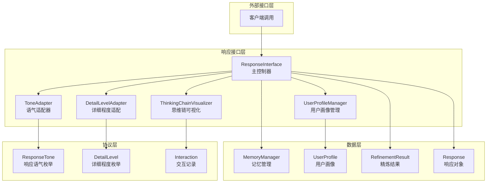

**图表来源**
- [interface.py:20-140](file://src/response/interface.py#L20-L140)
- [protocols.py:51-64](file://src/core/protocols.py#L51-L64)
- [models.py:13-31](file://src/response/models.py#L13-L31)

该架构实现了以下设计原则：

1. **单一职责原则**：每个组件专注于特定功能
2. **开闭原则**：对扩展开放，对修改封闭
3. **依赖倒置原则**：高层模块不依赖低层模块
4. **接口隔离原则**：小而专一的接口优于大而全的接口

## 详细组件分析

### ResponseInterface 类分析

ResponseInterface 是响应接口的核心控制器，负责协调各个子组件完成完整的响应生成流程。

#### 类结构图

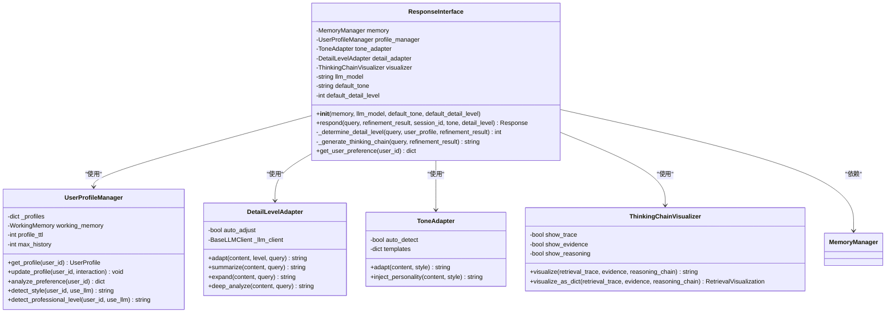

**图表来源**
- [interface.py:20-140](file://src/response/interface.py#L20-L140)
- [profile_manager.py:20-141](file://src/response/profile_manager.py#L20-L141)
- [detail_adapter.py:18-94](file://src/response/detail_adapter.py#L18-L94)
- [tone_adapter.py:8-76](file://src/response/tone_adapter.py#L8-L76)
- [visualizer.py:9-71](file://src/response/visualizer.py#L9-L71)

#### respond 方法工作流程

respond 方法是响应生成的核心流程，包含以下关键步骤：

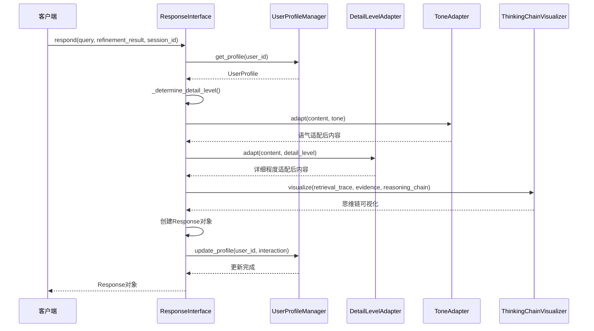

**图表来源**
- [interface.py:59-140](file://src/response/interface.py#L59-L140)

#### 详细程度确定算法

详细程度的确定基于多因素综合分析：

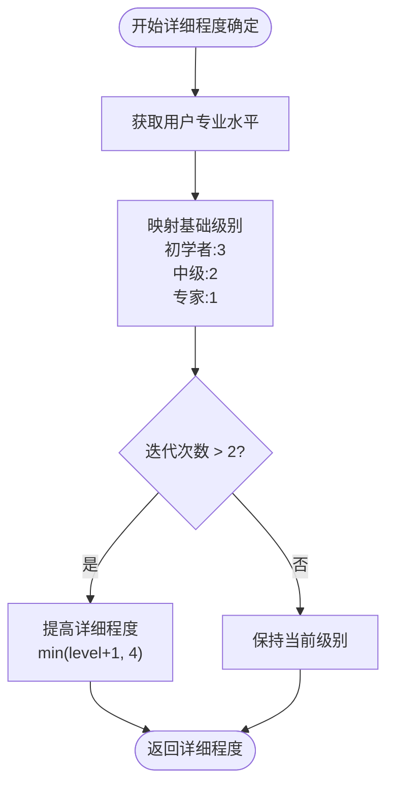

**图表来源**
- [interface.py:142-173](file://src/response/interface.py#L142-L173)

**章节来源**
- [interface.py:20-140](file://src/response/interface.py#L20-L140)
- [interface.py:142-173](file://src/response/interface.py#L142-L173)

### UserProfileManager 用户画像管理器

UserProfileManager 负责用户画像的创建、维护和分析，是情境自适应生成的基础。

#### 用户画像数据结构

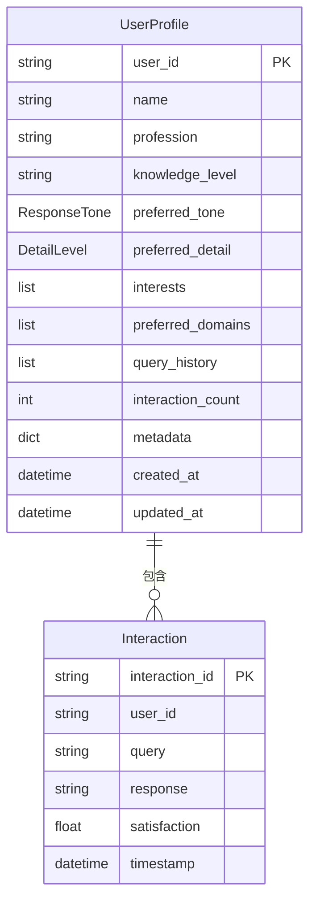

**图表来源**
- [protocols.py:282-298](file://src/core/protocols.py#L282-L298)
- [models.py:14-22](file://src/response/models.py#L14-L22)

#### 专业水平检测机制

系统支持两种专业水平检测模式：

1. **基于规则的检测**：使用关键词匹配和统计特征
2. **基于LLM的检测**：使用大语言模型进行高级分析

关键词检测映射表：
- **专家级别**：架构、分布式、微服务、可扩展性、算法等
- **中级级别**：API、数据库、框架、函数、类等  
- **初学者级别**：什么是、怎么、如何、基础、入门等

**章节来源**
- [profile_manager.py:20-141](file://src/response/profile_manager.py#L20-L141)
- [profile_manager.py:340-467](file://src/response/profile_manager.py#L340-L467)

### DetailLevelAdapter 详细程度适配器

DetailLevelAdapter 提供四种详细程度级别的内容适配功能：

#### 详细程度级别定义

| 级别 | 描述 | 特征 |
|------|------|------|
| Level 1 | 简洁摘要 | 1-2句话，直接答案 |
| Level 2 | 标准回答 | 1段话 + 要点 |
| Level 3 | 详细解释 | 多段落 + 案例 |
| Level 4 | 深度分析 | 完整报告 |

#### 适配策略对比

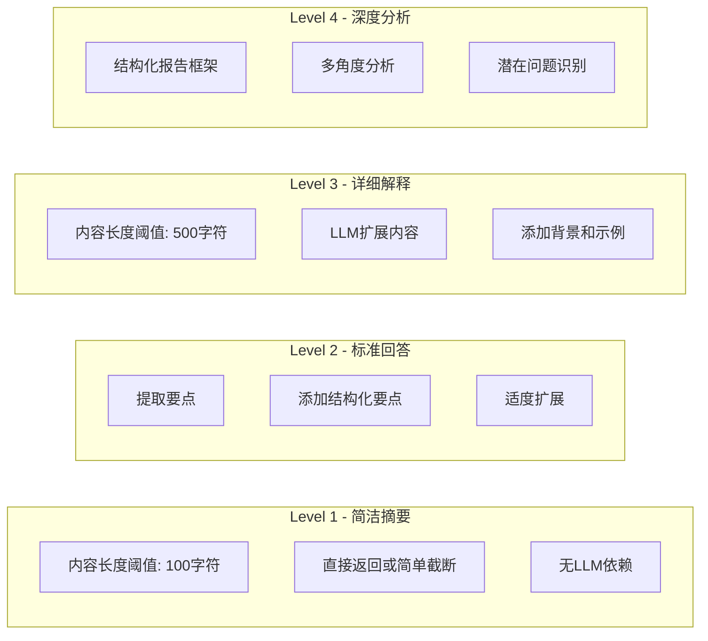

**图表来源**
- [detail_adapter.py:18-94](file://src/response/detail_adapter.py#L18-L94)

**章节来源**
- [detail_adapter.py:18-417](file://src/response/detail_adapter.py#L18-L417)

### ToneAdapter 语气适配器

ToneAdapter 提供三种不同的语气风格适配：

#### 语气风格配置

| 风格 | 前缀 | 后缀 | 连接词 | 表情符号 | 适用场景 |
|------|------|------|--------|----------|----------|
| 正式 | 无 | 无 | 因此、综上所述 | 禁止 | 商务、学术 |
| 友好 | 无 | ~ | 所以、这样看来 | 允许 | 日常交流 |
| 幽默 | 哈哈， | 😸 | 有趣的是、惊喜吧 | 允许 | 娱乐、创意 |

#### 个性化元素注入

语气适配不仅改变文本结构，还注入个性化的连接词和表达方式：

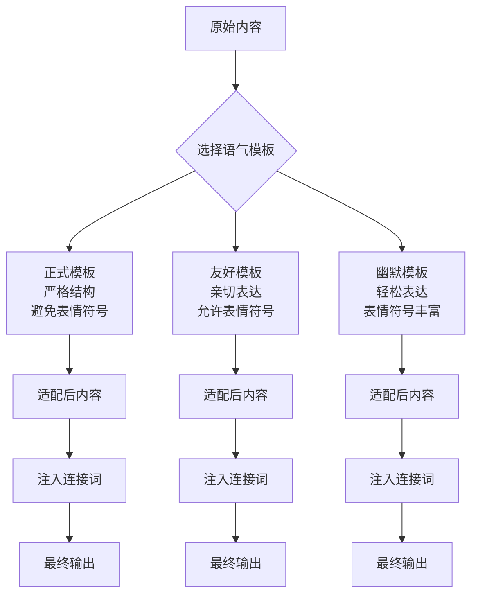

**图表来源**
- [tone_adapter.py:8-138](file://src/response/tone_adapter.py#L8-L138)

**章节来源**
- [tone_adapter.py:8-138](file://src/response/tone_adapter.py#L8-L138)

### ThinkingChainVisualizer 思维链可视化器

思维链可视化器提供可解释性的推理过程展示，帮助用户理解AI的思考过程。

#### 可视化内容结构

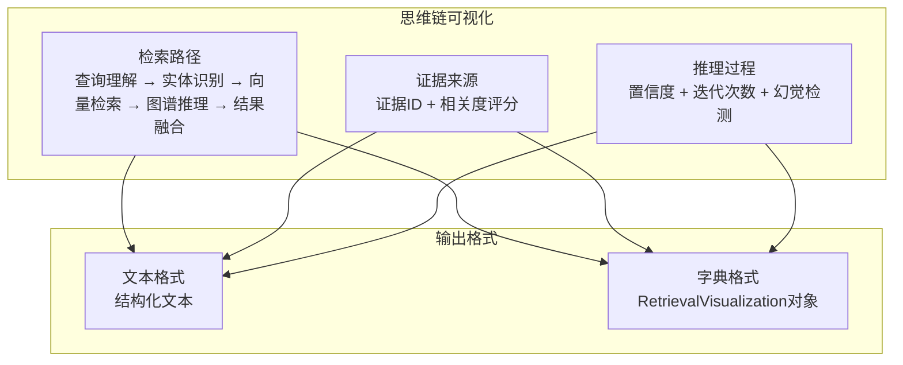

**图表来源**
- [visualizer.py:9-150](file://src/response/visualizer.py#L9-L150)

**章节来源**
- [visualizer.py:9-150](file://src/response/visualizer.py#L9-L150)

## 依赖关系分析

响应接口核心的依赖关系体现了清晰的分层架构和模块化设计：

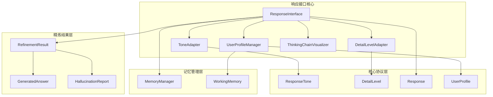

**图表来源**
- [interface.py:7-14](file://src/response/interface.py#L7-L14)
- [protocols.py:51-64](file://src/core/protocols.py#L51-L64)
- [models.py:10](file://src/response/models.py#L10)

### 外部依赖分析

响应接口核心对外部系统的依赖主要包括：

1. **LLM客户端**：用于高级检测和内容生成
2. **记忆管理器**：用户画像和查询历史存储
3. **工作记忆**：临时上下文信息存储
4. **统一协议**：数据类型和枚举定义

这些依赖通过接口抽象实现，支持灵活的替换和扩展。

**章节来源**
- [interface.py:7-14](file://src/response/interface.py#L7-L14)
- [profile_manager.py:16-17](file://src/response/profile_manager.py#L16-L17)
- [detail_adapter.py:14-15](file://src/response/detail_adapter.py#L14-L15)

## 性能考虑

响应接口核心在设计时充分考虑了性能优化和资源管理：

### 缓存策略
- **用户画像缓存**：内存中缓存用户画像，减少重复计算
- **LLM调用优化**：合理控制LLM调用频率，避免过度消耗
- **内容适配缓存**：对已适配的内容进行缓存

### 异步处理
- **LLM调用异步化**：支持异步LLM调用，提高响应速度
- **批量处理**：支持批量用户画像分析和更新

### 资源管理
- **内存使用优化**：限制查询历史长度，防止内存泄漏
- **连接池管理**：合理管理外部服务连接
- **超时控制**：设置合理的超时时间，避免阻塞

### 性能监控
- **执行时间统计**：记录各组件的执行时间
- **资源使用监控**：监控内存和CPU使用情况
- **错误率统计**：统计各组件的错误发生率

## 故障排除指南

### 常见问题及解决方案

#### 1. 用户画像获取失败
**症状**：`get_profile()` 方法抛出异常
**原因**：
- 工作记忆连接失败
- 用户ID格式不正确
- 缓存数据损坏

**解决方案**：
- 检查工作记忆配置
- 验证用户ID格式
- 清理缓存数据

#### 2. LLM调用失败
**症状**：详细程度适配或风格检测使用降级模式
**原因**：
- LLM服务不可用
- API密钥配置错误
- 网络连接问题

**解决方案**：
- 检查LLM服务状态
- 验证API配置
- 检查网络连接

#### 3. 响应生成超时
**症状**：`respond()` 方法执行时间过长
**原因**：
- LLM调用耗时过长
- 记忆查询复杂度过高
- 外部服务响应慢

**解决方案**：
- 优化查询条件
- 调整超时参数
- 实施缓存策略

### 调试工具

#### 日志分析
- **INFO级别**：响应生成开始和结束
- **DEBUG级别**：详细程度确定和适配过程
- **ERROR级别**：异常和错误信息

#### 性能分析
- **执行时间监控**：记录各组件耗时
- **内存使用监控**：跟踪内存占用
- **缓存命中率**：统计缓存效果

**章节来源**
- [interface.py:80-140](file://src/response/interface.py#L80-L140)
- [profile_manager.py:115-141](file://src/response/profile_manager.py#L115-L141)

## 结论

响应接口核心组件通过精心设计的架构和实现，成功地将复杂的认知架构转化为用户友好的交互体验。其主要优势包括：

1. **高度模块化**：清晰的职责分离和接口设计
2. **情境自适应**：基于用户画像和上下文的智能适配
3. **可解释性**：完整的思维链可视化和推理过程展示
4. **可扩展性**：支持LLM增强和多种适配策略
5. **性能优化**：合理的缓存策略和资源管理

该组件为 NecoRAG 系统提供了强大的交互能力，是实现真正智能对话体验的关键基础设施。

## 附录

### API参考

#### ResponseInterface 类

**构造函数**
```python
ResponseInterface(
    memory: MemoryManager,
    llm_model: str = "default",
    default_tone: str = "friendly",
    default_detail_level: int = 2
)
```

**主要方法**
- `respond(query, refinement_result, session_id=None, tone=None, detail_level=None) -> Response`
- `get_user_preference(user_id) -> dict`

**章节来源**
- [interface.py:31-66](file://src/response/interface.py#L31-L66)
- [interface.py:59-140](file://src/response/interface.py#L59-L140)

#### 使用示例

完整的使用流程参考示例代码：

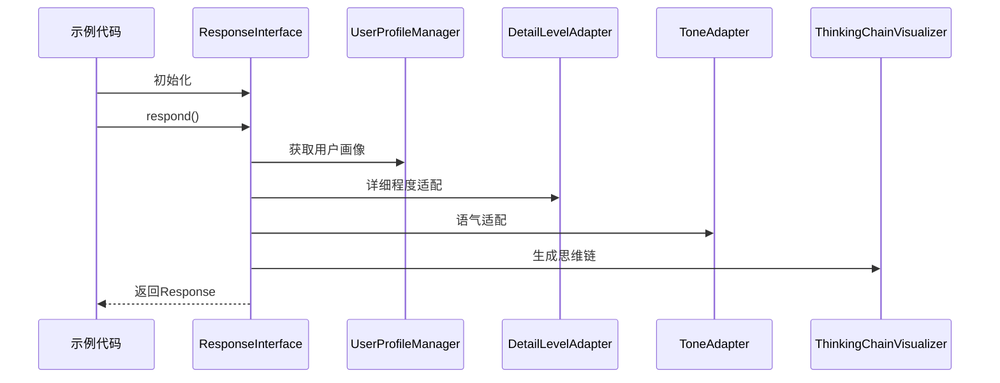

**图表来源**
- [example_usage.py:176-215](file://example/example_usage.py#L176-L215)

**章节来源**
- [example_usage.py:176-215](file://example/example_usage.py#L176-L215)