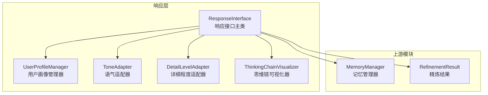
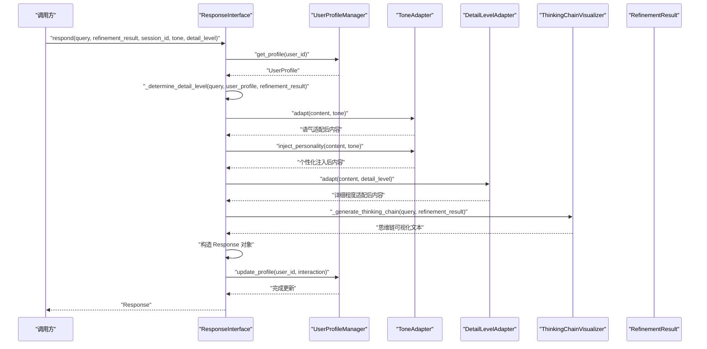
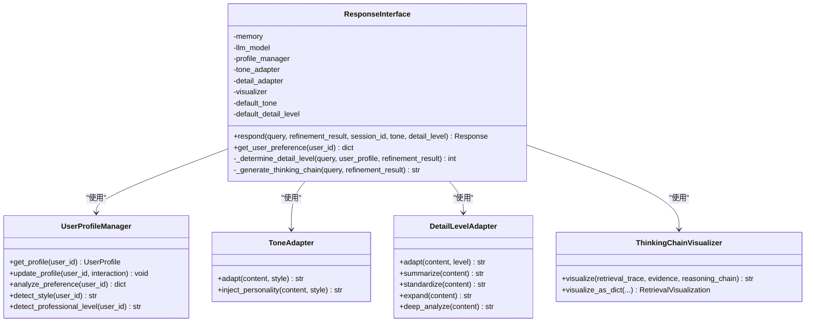
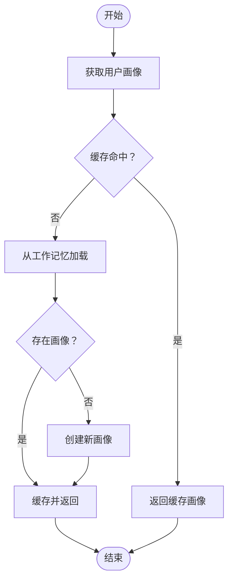
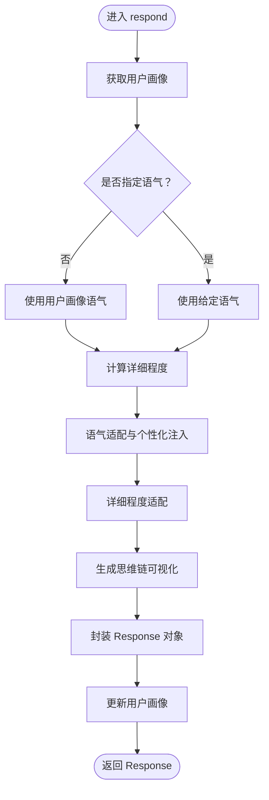
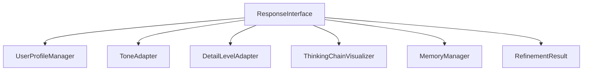

# 响应接口核心

<cite>
**本文引用的文件**
- [interface.py](file://src/response/interface.py)
- [models.py](file://src/response/models.py)
- [profile_manager.py](file://src/response/profile_manager.py)
- [detail_adapter.py](file://src/response/detail_adapter.py)
- [tone_adapter.py](file://src/response/tone_adapter.py)
- [visualizer.py](file://src/response/visualizer.py)
- [models.py](file://src/refinement/models.py)
- [manager.py](file://src/memory/manager.py)
- [example_usage.py](file://example/example_usage.py)
- [base.py](file://src/core/base.py)
- [exceptions.py](file://src/core/exceptions.py)
</cite>

## 目录
1. [简介](#简介)
2. [项目结构](#项目结构)
3. [核心组件](#核心组件)
4. [架构总览](#架构总览)
5. [详细组件分析](#详细组件分析)
6. [依赖关系分析](#依赖关系分析)
7. [性能考量](#性能考量)
8. [故障排查指南](#故障排查指南)
9. [结论](#结论)
10. [附录](#附录)

## 简介
本文件聚焦于响应接口核心组件 ResponseInterface 的设计与实现，系统阐述其在交互层的角色定位、响应生成的完整流程以及各子组件之间的协作机制。重点覆盖以下方面：
- respond 方法的工作原理：用户画像获取、语气确定、详细程度计算、内容适配与思维链可视化生成。
- 响应对象 Response 的数据结构与字段含义：content、thinking_chain、citations、metadata 等。
- 使用示例：如何通过 ResponseInterface 生成个性化的回答。
- 错误处理与异常情况策略：当前实现中的异常处理现状与建议。

## 项目结构
响应接口位于 src/response 目录下，围绕交互层构建，负责将上游精炼结果转化为情境自适应的最终响应，并提供可解释的思维链可视化。其直接依赖包括：
- 记忆管理器 MemoryManager（用于工作记忆上下文读写）
- 精炼结果 RefinementResult（来自巩固层）
- 用户画像管理器 UserProfileManager（用于用户偏好与历史）
- 语气适配器 ToneAdapter（语气风格与个性化注入）
- 详细程度适配器 DetailLevelAdapter（不同详细程度的输出形态）
- 思维链可视化器 ThinkingChainVisualizer（可解释性输出）

图表来源
- [interface.py:16-132](file://src/response/interface.py#L16-L132)
- [profile_manager.py:10-165](file://src/response/profile_manager.py#L10-L165)
- [tone_adapter.py:8-138](file://src/response/tone_adapter.py#L8-L138)
- [detail_adapter.py:8-202](file://src/response/detail_adapter.py#L8-L202)
- [visualizer.py:9-150](file://src/response/visualizer.py#L9-L150)
- [manager.py:16-195](file://src/memory/manager.py#L16-L195)
- [models.py:38-47](file://src/refinement/models.py#L38-L47)

章节来源
- [interface.py:16-132](file://src/response/interface.py#L16-L132)
- [profile_manager.py:10-165](file://src/response/profile_manager.py#L10-L165)
- [tone_adapter.py:8-138](file://src/response/tone_adapter.py#L8-L138)
- [detail_adapter.py:8-202](file://src/response/detail_adapter.py#L8-L202)
- [visualizer.py:9-150](file://src/response/visualizer.py#L9-L150)
- [manager.py:16-195](file://src/memory/manager.py#L16-L195)
- [models.py:38-47](file://src/refinement/models.py#L38-L47)

## 核心组件
- ResponseInterface：响应接口主类，负责整合用户画像、语气风格、详细程度与思维链可视化，生成最终响应对象。
- UserProfileManager：管理用户画像与交互历史，提供偏好分析与风格检测能力。
- ToneAdapter：根据预设模板对内容进行语气适配与个性化注入。
- DetailLevelAdapter：将内容按不同详细程度级别进行结构化改写。
- ThinkingChainVisualizer：将检索路径、证据来源与推理过程转化为可读的可视化文本。
- Response：响应数据模型，包含内容、思维链、引用、元数据等字段。

章节来源
- [interface.py:16-132](file://src/response/interface.py#L16-L132)
- [models.py:34-44](file://src/response/models.py#L34-L44)
- [profile_manager.py:10-165](file://src/response/profile_manager.py#L10-L165)
- [tone_adapter.py:8-138](file://src/response/tone_adapter.py#L8-L138)
- [detail_adapter.py:8-202](file://src/response/detail_adapter.py#L8-L202)
- [visualizer.py:9-150](file://src/response/visualizer.py#L9-L150)

## 架构总览
响应接口的调用序列展示了从输入到输出的关键步骤：获取用户画像、确定语气与详细程度、对内容进行语气与详细程度适配、生成思维链可视化、封装响应对象并更新用户画像。

图表来源
- [interface.py:55-132](file://src/response/interface.py#L55-L132)
- [profile_manager.py:41-100](file://src/response/profile_manager.py#L41-L100)
- [tone_adapter.py:49-109](file://src/response/tone_adapter.py#L49-L109)
- [detail_adapter.py:28-56](file://src/response/detail_adapter.py#L28-L56)
- [visualizer.py:37-71](file://src/response/visualizer.py#L37-L71)
- [models.py:38-47](file://src/refinement/models.py#L38-L47)

## 详细组件分析

### ResponseInterface 设计与实现
- 角色与职责
  - 整合用户画像、语气风格、详细程度与思维链可视化，形成情境自适应的最终响应。
  - 作为交互层的核心协调者，串联 UserProfileManager、ToneAdapter、DetailLevelAdapter、ThinkingChainVisualizer。
- 关键方法
  - respond：主流程入口，负责用户画像获取、语气与详细程度确定、内容适配、思维链生成与响应封装。
  - _determine_detail_level：基于用户专业水平与查询复杂度动态调整详细程度。
  - _generate_thinking_chain：构建检索路径、证据来源与推理过程的可视化文本。
  - get_user_preference：对外暴露用户偏好分析结果。
- 参数与默认值
  - memory：记忆管理器实例。
  - llm_model：LLM 模型标识，默认 "default"。
  - default_tone：默认语气风格，默认 "friendly"。
  - default_detail_level：默认详细程度，默认 2。
- 输出
  - 返回 Response 对象，包含 content、thinking_chain、tone、detail_level、citations、metadata 等字段。

图表来源
- [interface.py:16-132](file://src/response/interface.py#L16-L132)
- [profile_manager.py:10-165](file://src/response/profile_manager.py#L10-L165)
- [tone_adapter.py:8-138](file://src/response/tone_adapter.py#L8-L138)
- [detail_adapter.py:8-202](file://src/response/detail_adapter.py#L8-L202)
- [visualizer.py:9-150](file://src/response/visualizer.py#L9-L150)

章节来源
- [interface.py:16-132](file://src/response/interface.py#L16-L132)

### 用户画像与偏好分析（UserProfileManager）
- 用户画像数据结构
  - professional_level：专业水平（beginner/intermediate/expert）
  - interaction_style：交互风格（formal/friendly/humorous）
  - preferred_domains：偏好领域列表
  - query_history：查询历史列表
  - metadata：附加元数据
  - created_at/updated_at：创建与更新时间
- 核心功能
  - get_profile：从工作记忆加载或创建用户画像，并进行本地缓存。
  - update_profile：更新查询历史、时间戳与满意度（预留），并将画像写回工作记忆。
  - analyze_preference：统计关键词、查询总数、交互风格与专业水平。
  - detect_style/detect_professional_level：风格与专业水平检测（预留）。
- 与记忆系统的集成
  - 通过 working_memory.get_context(user_id) 与 add_context(user_id, {"profile": profile}) 读写上下文。

图表来源
- [profile_manager.py:41-67](file://src/response/profile_manager.py#L41-L67)

章节来源
- [profile_manager.py:10-165](file://src/response/profile_manager.py#L10-L165)

### 语气适配（ToneAdapter）
- 支持的语气风格
  - formal：正式严谨，避免表情符号，连接词偏向“因此”、“综上所述”。
  - friendly：亲切友好，连接词偏向“所以”、“这样看来”，允许表情符号。
  - humorous：幽默轻松，连接词偏向“有趣的是”、“惊喜吧”，带表情符号。
- 适配流程
  - adapt：根据模板添加前后缀、移除表情符号（如适用）。
  - inject_personality：在段落之间注入连接词，增强连贯性。
- 适用场景
  - 面向不同用户风格的个性化输出，提升交互体验。

章节来源
- [tone_adapter.py:8-138](file://src/response/tone_adapter.py#L8-L138)

### 详细程度适配（DetailLevelAdapter）
- 详细程度层级
  - Level 1：简洁摘要（1-2句话）
  - Level 2：标准回答（1段 + 要点）
  - Level 3：详细解释（多段 + 示例）
  - Level 4：深度分析（完整报告框架）
- 适配策略
  - adapt：根据 level 调用对应方法。
  - summarize/standardize/expand/deep_analyze：分别生成不同粒度的输出。
  - _extract_key_points/_format_key_points：抽取与格式化关键要点。
- 适用场景
  - 面向不同专业水平与查询复杂度的差异化输出。

章节来源
- [detail_adapter.py:8-202](file://src/response/detail_adapter.py#L8-L202)

### 思维链可视化（ThinkingChainVisualizer）
- 可视化内容
  - 检索路径：查询理解、语义检索、证据数量等。
  - 证据来源：证据 ID 与相关度。
  - 推理过程：置信度、迭代次数、幻觉检测状态等。
- 输出形式
  - visualize：返回可读的文本。
  - visualize_as_dict：返回结构化对象，便于进一步处理或持久化。
- 适用场景
  - 提升响应透明度与可解释性，帮助用户理解回答来源与推理过程。

章节来源
- [visualizer.py:9-150](file://src/response/visualizer.py#L9-L150)

### 响应对象数据结构（Response）
- 字段说明
  - content：最终生成的响应内容。
  - thinking_chain：思维链可视化文本。
  - tone：语气风格。
  - detail_level：详细程度级别。
  - citations：引用的证据 ID 列表。
  - metadata：元数据字典，包含 confidence、iterations、user_id 等。
  - generated_at：生成时间。
- 用途
  - 作为交互层的标准输出，承载内容、解释性信息与元数据。

章节来源
- [models.py:34-44](file://src/response/models.py#L34-L44)

### 详细流程：respond 方法
- 步骤分解
  - 用户画像获取：根据 session_id 或匿名标识获取 UserProfile。
  - 语气确定：若未显式指定，则从用户画像中读取交互风格。
  - 详细程度计算：基于用户专业水平与精炼结果的迭代次数动态调整。
  - 内容适配：先进行语气适配与个性化注入，再进行详细程度适配。
  - 思维链生成：构建检索路径、证据来源与推理过程的可视化文本。
  - 响应封装：创建 Response 对象，填充 content、thinking_chain、tone、detail_level、citations、metadata。
  - 用户画像更新：记录本次交互，更新查询历史与时间戳。
- 关键决策
  - 详细程度上限与下限保护（1-4）。
  - 语气风格模板的前后缀与表情符号策略。
  - 思维链的三部分构成与可配置开关。

图表来源
- [interface.py:55-132](file://src/response/interface.py#L55-L132)

章节来源
- [interface.py:55-132](file://src/response/interface.py#L55-L132)

### 使用示例：生成个性化回答
- 示例流程
  - 初始化 ResponseInterface，传入 MemoryManager、默认语气与默认详细程度。
  - 调用 respond，传入查询、精炼结果、会话 ID、语气与详细程度。
  - 输出响应内容与思维链可视化文本；可选获取用户偏好分析。
- 示例参考
  - 完整示例参见 example/example_usage.py 中的 example_response 函数。

章节来源
- [example_usage.py:176-215](file://example/example_usage.py#L176-L215)

## 依赖关系分析
- 组件耦合
  - ResponseInterface 与各子组件松耦合，通过方法调用实现协作。
  - UserProfileManager 依赖工作记忆接口，实现画像的读写与缓存。
  - ToneAdapter/DetailLevelAdapter/ThinkingChainVisualizer 为纯函数式组件，无外部状态依赖。
- 外部依赖
  - 记忆管理器 MemoryManager 提供工作记忆上下文。
  - 精炼结果 RefinementResult 提供答案、置信度、引用与迭代次数等信息。
- 潜在循环依赖
  - 当前实现未发现循环依赖，模块边界清晰。

图表来源
- [interface.py:16-132](file://src/response/interface.py#L16-L132)
- [profile_manager.py:10-165](file://src/response/profile_manager.py#L10-L165)
- [tone_adapter.py:8-138](file://src/response/tone_adapter.py#L8-L138)
- [detail_adapter.py:8-202](file://src/response/detail_adapter.py#L8-L202)
- [visualizer.py:9-150](file://src/response/visualizer.py#L9-L150)
- [manager.py:16-195](file://src/memory/manager.py#L16-L195)
- [models.py:38-47](file://src/refinement/models.py#L38-L47)

章节来源
- [interface.py:16-132](file://src/response/interface.py#L16-L132)
- [profile_manager.py:10-165](file://src/response/profile_manager.py#L10-L165)
- [tone_adapter.py:8-138](file://src/response/tone_adapter.py#L8-L138)
- [detail_adapter.py:8-202](file://src/response/detail_adapter.py#L8-L202)
- [visualizer.py:9-150](file://src/response/visualizer.py#L9-L150)
- [manager.py:16-195](file://src/memory/manager.py#L16-L195)
- [models.py:38-47](file://src/refinement/models.py#L38-L47)

## 性能考量
- 时间复杂度
  - respond 主流程为线性时间，涉及字符串处理与少量列表操作，整体开销可控。
  - 详细程度适配与思维链生成均为轻量级文本处理，不引入额外 IO。
- 空间复杂度
  - 用户画像缓存采用字典存储，受 max_history 限制，内存占用稳定。
  - 思维链可视化文本在内存中拼接，长度与证据数量线性相关。
- 优化建议
  - 对用户画像缓存增加 TTL 控制（已存在 profile_ttl），可结合定期清理策略。
  - 将模板与连接词等静态资源进行预编译，减少运行时字符串拼接成本。
  - 对长文本的详细程度适配可考虑分段处理，避免一次性处理超长字符串。

## 故障排查指南
- 当前实现中的异常处理现状
  - 响应接口与各子组件未显式捕获异常，调用方需自行处理可能的异常。
  - 若用户画像或记忆上下文缺失，UserProfileManager.get_profile 将创建新画像；若工作记忆接口异常，可能导致 profile 无法读取或写入。
- 建议的异常处理策略
  - 在 respond 中增加 try-except 包裹关键步骤，捕获与日志记录异常详情。
  - 对 MemoryManager、UserProfileManager、RefinementResult 的访问增加健壮性检查。
  - 对外部依赖（如 LLM 模型）的调用建议使用统一的异常类型，便于上层统一处理。
- 可参考的异常类型
  - NecoRAGError 及其子类（如 LLMError、GenerationError、RefinementError 等）可用于统一错误表达与传递。

章节来源
- [exceptions.py:10-389](file://src/core/exceptions.py#L10-L389)

## 结论
ResponseInterface 通过用户画像、语气风格与详细程度的自适应组合，实现了情境感知的交互响应；配合思维链可视化，显著提升了响应的可解释性与用户体验。当前实现以模块化设计为核心，耦合度低、扩展性强。建议在未来版本中完善异常处理与错误传播机制，以增强系统的鲁棒性与可观测性。

## 附录
- 相关抽象基类与协议
  - BaseResponseAdapter：响应适配器抽象，为响应层提供统一接口契约。
  - BaseLLMClient/BaseAsyncLLMClient：LLM 客户端抽象，为响应层提供生成与嵌入能力。
- 使用建议
  - 在生产环境中，建议为响应接口增加统一的异常处理与日志记录。
  - 对于高并发场景，可考虑对用户画像缓存与思维链生成进行异步化与批量化处理。

章节来源
- [base.py:554-572](file://src/core/base.py#L554-L572)
- [base.py:461-552](file://src/core/base.py#L461-L552)