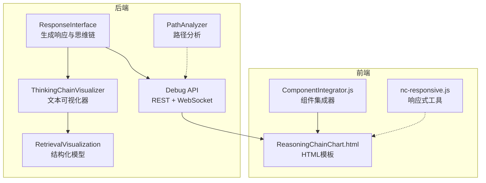
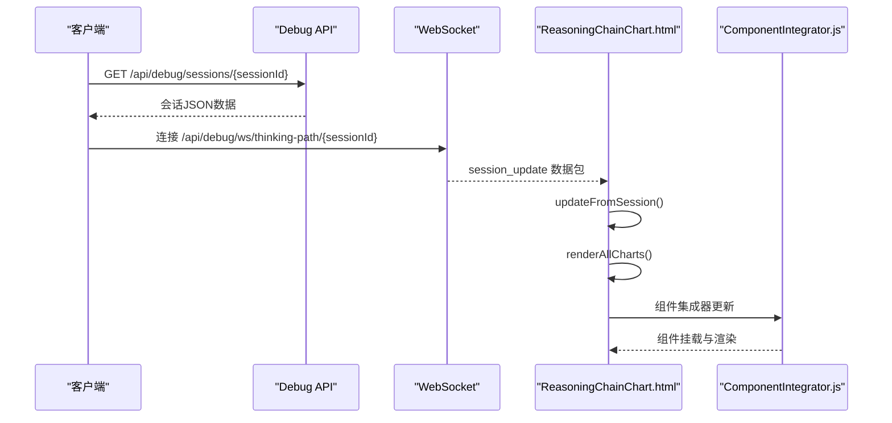
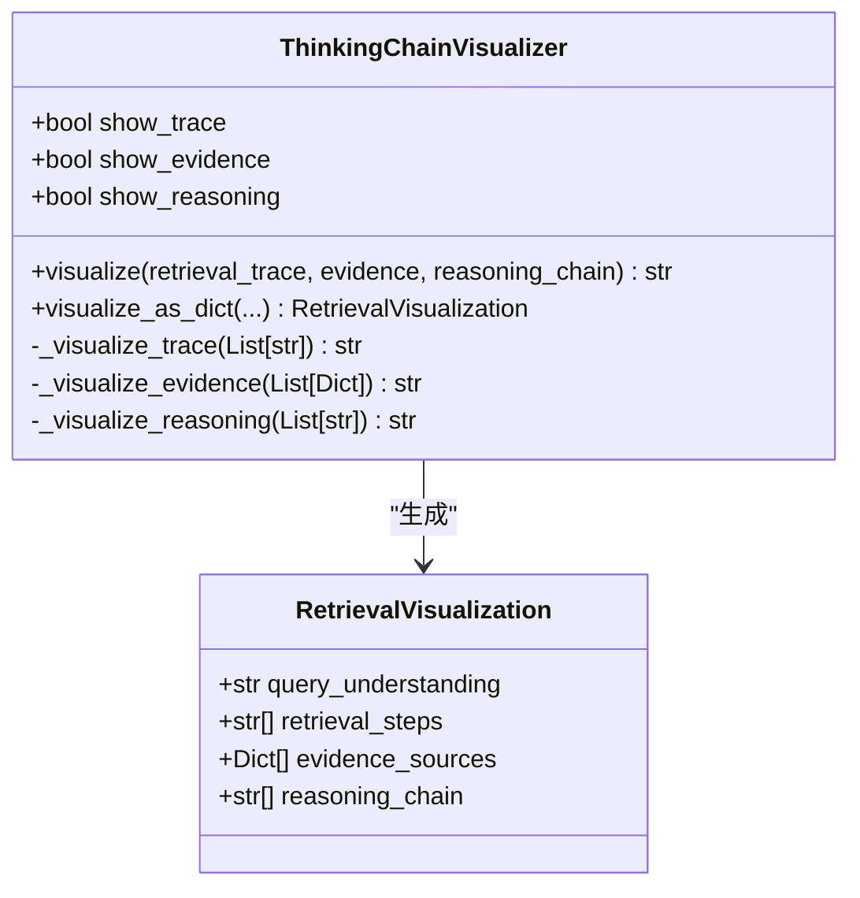
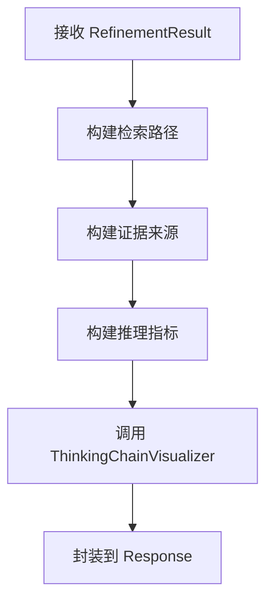
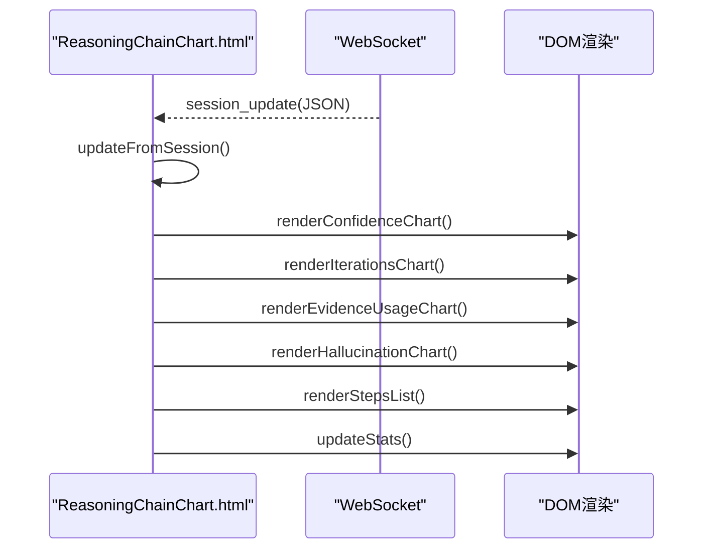
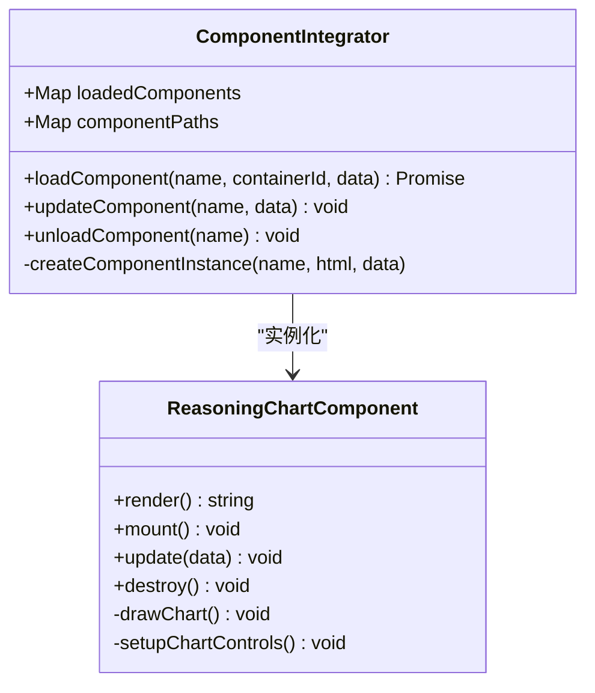
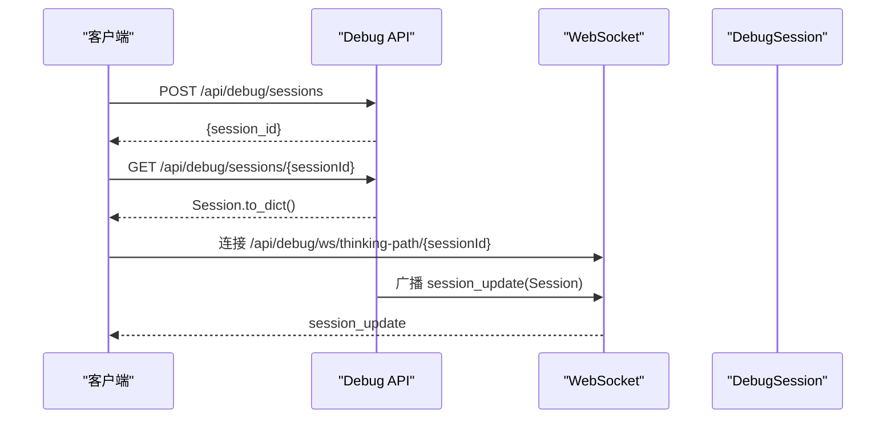
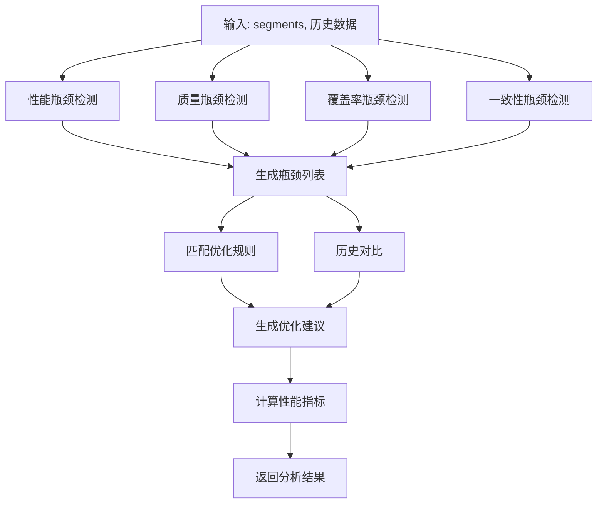

# 思维链可视化器

<cite>
**本文引用的文件**
- [src/response/visualizer.py](file://src/response/visualizer.py)
- [src/response/interface.py](file://src/response/interface.py)
- [src/response/models.py](file://src/response/models.py)
- [src/dashboard/components/ReasoningChainChart.html](file://src/dashboard/components/ReasoningChainChart.html)
- [src/dashboard/components/ComponentIntegrator.js](file://src/dashboard/components/ComponentIntegrator.js)
- [src/dashboard/debug/models.py](file://src/dashboard/debug/models.py)
- [src/dashboard/debug/api.py](file://src/dashboard/debug/api.py)
- [src/dashboard/debug/path_analyzer.py](file://src/dashboard/debug/path_analyzer.py)
- [src/dashboard/static/js/nc-responsive.js](file://src/dashboard/static/js/nc-responsive.js)
- [src/retrieval/models.py](file://src/retrieval/models.py)
</cite>

## 目录
1. [简介](#简介)
2. [项目结构](#项目结构)
3. [核心组件](#核心组件)
4. [架构总览](#架构总览)
5. [详细组件分析](#详细组件分析)
6. [依赖分析](#依赖分析)
7. [性能考量](#性能考量)
8. [故障排查指南](#故障排查指南)
9. [结论](#结论)
10. [附录](#附录)

## 简介
本文件为思维链可视化器组件的技术文档，聚焦可解释性AI输出的设计理念与实现方式，涵盖检索路径、证据来源与推理过程的可视化表示；深入阐述思维链图表的生成算法、节点布局与连接关系；解释可视化元素的层次结构、颜色编码与交互设计；并提供HTML模板生成、CSS样式定制与JavaScript交互功能的技术实现说明，以及可视化效果示例、配置选项与扩展开发指南。

## 项目结构
思维链可视化器横跨后端Python与前端HTML/JS两大层面：
- 后端负责生成结构化思维链数据（检索路径、证据来源、推理指标），并通过接口暴露给前端。
- 前端负责接收数据并渲染为交互式图表与列表，支持实时更新、排序、筛选与导出。



**图表来源**
- [src/response/interface.py:20-140](file://src/response/interface.py#L20-L140)
- [src/response/visualizer.py:9-150](file://src/response/visualizer.py#L9-L150)
- [src/response/models.py:24-31](file://src/response/models.py#L24-L31)
- [src/dashboard/debug/api.py:91-181](file://src/dashboard/debug/api.py#L91-L181)
- [src/dashboard/debug/path_analyzer.py:126-236](file://src/dashboard/debug/path_analyzer.py#L126-L236)
- [src/dashboard/components/ReasoningChainChart.html:1-857](file://src/dashboard/components/ReasoningChainChart.html#L1-L857)
- [src/dashboard/components/ComponentIntegrator.js:6-94](file://src/dashboard/components/ComponentIntegrator.js#L6-L94)
- [src/dashboard/static/js/nc-responsive.js:680-798](file://src/dashboard/static/js/nc-responsive.js#L680-L798)

**章节来源**
- [src/response/interface.py:20-140](file://src/response/interface.py#L20-L140)
- [src/response/visualizer.py:9-150](file://src/response/visualizer.py#L9-L150)
- [src/response/models.py:24-31](file://src/response/models.py#L24-L31)
- [src/dashboard/debug/api.py:91-181](file://src/dashboard/debug/api.py#L91-L181)
- [src/dashboard/debug/path_analyzer.py:126-236](file://src/dashboard/debug/path_analyzer.py#L126-L236)
- [src/dashboard/components/ReasoningChainChart.html:1-857](file://src/dashboard/components/ReasoningChainChart.html#L1-L857)
- [src/dashboard/components/ComponentIntegrator.js:6-94](file://src/dashboard/components/ComponentIntegrator.js#L6-L94)
- [src/dashboard/static/js/nc-responsive.js:680-798](file://src/dashboard/static/js/nc-responsive.js#L680-L798)

## 核心组件
- 思维链可视化器（ThinkingChainVisualizer）：将检索路径、证据来源与推理过程三部分组合为可读的文本输出，并可生成结构化对象用于前端渲染。
- 响应接口（ResponseInterface）：在生成最终响应的同时，调用可视化器生成思维链文本，并封装到响应对象中。
- 调试API（Debug API）：提供REST接口与WebSocket通道，向前端推送会话数据，支撑实时可视化。
- 前端组件（ReasoningChainChart.html + ComponentIntegrator.js）：负责渲染置信度趋势、迭代次数分布、证据使用矩阵与幻觉检测仪表盘，并提供交互控制。
- 路径分析器（PathAnalyzer）：对检索路径进行性能、质量、覆盖率与一致性瓶颈分析，辅助可视化与优化建议。

**章节来源**
- [src/response/visualizer.py:9-150](file://src/response/visualizer.py#L9-L150)
- [src/response/interface.py:20-140](file://src/response/interface.py#L20-L140)
- [src/dashboard/debug/api.py:91-181](file://src/dashboard/debug/api.py#L91-L181)
- [src/dashboard/components/ReasoningChainChart.html:506-800](file://src/dashboard/components/ReasoningChainChart.html#L506-L800)
- [src/dashboard/components/ComponentIntegrator.js:447-649](file://src/dashboard/components/ComponentIntegrator.js#L447-L649)
- [src/dashboard/debug/path_analyzer.py:126-236](file://src/dashboard/debug/path_analyzer.py#L126-L236)

## 架构总览
思维链可视化器的端到端流程如下：
- 后端生成阶段：ResponseInterface根据精炼结果构建检索路径、证据来源与推理指标，交由ThinkingChainVisualizer生成文本或结构化对象。
- 数据传输阶段：通过REST接口获取会话详情，或通过WebSocket订阅会话更新。
- 前端渲染阶段：ReasoningChainChart.html接收数据，渲染多维度图表与步骤列表；ComponentIntegrator.js负责组件加载与更新。
- 分析与优化：PathAnalyzer对路径进行瓶颈检测与性能趋势分析，辅助前端可视化优化。



**图表来源**
- [src/dashboard/debug/api.py:130-146](file://src/dashboard/debug/api.py#L130-L146)
- [src/dashboard/debug/api.py:214-258](file://src/dashboard/debug/api.py#L214-L258)
- [src/dashboard/components/ReasoningChainChart.html:515-542](file://src/dashboard/components/ReasoningChainChart.html#L515-L542)
- [src/dashboard/components/ComponentIntegrator.js:19-56](file://src/dashboard/components/ComponentIntegrator.js#L19-L56)

**章节来源**
- [src/dashboard/debug/api.py:130-146](file://src/dashboard/debug/api.py#L130-L146)
- [src/dashboard/debug/api.py:214-258](file://src/dashboard/debug/api.py#L214-L258)
- [src/dashboard/components/ReasoningChainChart.html:515-542](file://src/dashboard/components/ReasoningChainChart.html#L515-L542)
- [src/dashboard/components/ComponentIntegrator.js:19-56](file://src/dashboard/components/ComponentIntegrator.js#L19-L56)

## 详细组件分析

### 思维链可视化器（ThinkingChainVisualizer）
- 设计理念：将“检索路径—证据来源—推理过程”三部分以清晰的层级与标签呈现，便于用户理解AI如何从查询逐步构建到最终答案。
- 输出形式：
  - 文本可视化：按模块拼接，支持按需开关。
  - 结构化对象：返回RetrievalVisualization，便于前端渲染与交互。
- 关键算法：
  - 检索路径：顺序列表，强调“查询理解—检索—融合”的时间线。
  - 证据来源：限制展示数量（默认最多5条），优先展示高相关度证据。
  - 推理过程：包含置信度、迭代次数、幻觉检测等指标，统一格式便于扫描。



**图表来源**
- [src/response/visualizer.py:9-150](file://src/response/visualizer.py#L9-L150)
- [src/response/models.py:24-31](file://src/response/models.py#L24-L31)

**章节来源**
- [src/response/visualizer.py:9-150](file://src/response/visualizer.py#L9-L150)
- [src/response/models.py:24-31](file://src/response/models.py#L24-L31)

### 响应接口（ResponseInterface）
- 职责：在生成最终响应时，同时生成思维链可视化文本，并封装到响应对象中。
- 关键流程：
  - 生成检索路径：基于查询与精炼结果构建。
  - 生成证据来源：提取引用证据并标注相关度。
  - 生成推理指标：置信度、迭代次数、幻觉检测结果。
  - 调用可视化器：生成文本或结构化对象。



**图表来源**
- [src/response/interface.py:175-219](file://src/response/interface.py#L175-L219)
- [src/response/visualizer.py:37-71](file://src/response/visualizer.py#L37-L71)

**章节来源**
- [src/response/interface.py:175-219](file://src/response/interface.py#L175-L219)
- [src/response/visualizer.py:37-71](file://src/response/visualizer.py#L37-L71)

### 前端组件：思维链图表（ReasoningChainChart.html）
- 功能模块：
  - 置信度趋势：折线/柱状图，支持切换视图；悬停显示迭代、置信度与决策摘要。
  - 迭代次数分布：柱状图，支持排序。
  - 证据使用矩阵：网格矩阵，高亮使用过的证据单元格。
  - 幻觉检测：半圆形仪表盘，随概率动态旋转并变色。
  - 推理步骤详情：步骤列表，含置信度标签与证据标签。
- 交互控制：
  - 切换置信度视图、排序迭代次数、重置证据视图、刷新幻觉检测、导出步骤详情。
- 数据绑定：
  - 通过WebSocket接收session_update，解析reasoning_chain并渲染。



**图表来源**
- [src/dashboard/components/ReasoningChainChart.html:515-542](file://src/dashboard/components/ReasoningChainChart.html#L515-L542)
- [src/dashboard/components/ReasoningChainChart.html:557-564](file://src/dashboard/components/ReasoningChainChart.html#L557-L564)
- [src/dashboard/components/ReasoningChainChart.html:566-603](file://src/dashboard/components/ReasoningChainChart.html#L566-L603)
- [src/dashboard/components/ReasoningChainChart.html:605-640](file://src/dashboard/components/ReasoningChainChart.html#L605-L640)
- [src/dashboard/components/ReasoningChainChart.html:642-677](file://src/dashboard/components/ReasoningChainChart.html#L642-L677)
- [src/dashboard/components/ReasoningChainChart.html:679-701](file://src/dashboard/components/ReasoningChainChart.html#L679-L701)
- [src/dashboard/components/ReasoningChainChart.html:703-736](file://src/dashboard/components/ReasoningChainChart.html#L703-L736)
- [src/dashboard/components/ReasoningChainChart.html:738-754](file://src/dashboard/components/ReasoningChainChart.html#L738-L754)

**章节来源**
- [src/dashboard/components/ReasoningChainChart.html:506-800](file://src/dashboard/components/ReasoningChainChart.html#L506-L800)

### 组件集成器（ComponentIntegrator.js）
- 职责：动态加载HTML组件、创建组件实例、渲染到容器并挂载交互。
- 关键能力：
  - 组件映射与加载：根据组件名映射到静态HTML路径。
  - 实例化：针对不同组件创建对应类实例（如ReasoningChartComponent）。
  - 更新与卸载：支持更新数据、销毁组件。



**图表来源**
- [src/dashboard/components/ComponentIntegrator.js:6-94](file://src/dashboard/components/ComponentIntegrator.js#L6-L94)
- [src/dashboard/components/ComponentIntegrator.js:447-649](file://src/dashboard/components/ComponentIntegrator.js#L447-L649)

**章节来源**
- [src/dashboard/components/ComponentIntegrator.js:6-94](file://src/dashboard/components/ComponentIntegrator.js#L6-L94)
- [src/dashboard/components/ComponentIntegrator.js:447-649](file://src/dashboard/components/ComponentIntegrator.js#L447-L649)

### 调试API与WebSocket（Debug API）
- REST接口：
  - 创建会话、获取会话详情、完成/失败会话、添加检索步骤与证据、查询历史、分析路径、参数调优、统计信息等。
- WebSocket：
  - 订阅会话更新，推送session_update，前端据此刷新可视化。



**图表来源**
- [src/dashboard/debug/api.py:91-128](file://src/dashboard/debug/api.py#L91-L128)
- [src/dashboard/debug/api.py:130-146](file://src/dashboard/debug/api.py#L130-L146)
- [src/dashboard/debug/api.py:148-181](file://src/dashboard/debug/api.py#L148-L181)
- [src/dashboard/debug/api.py:214-258](file://src/dashboard/debug/api.py#L214-L258)

**章节来源**
- [src/dashboard/debug/api.py:91-181](file://src/dashboard/debug/api.py#L91-L181)
- [src/dashboard/debug/api.py:214-258](file://src/dashboard/debug/api.py#L214-L258)

### 路径分析器（PathAnalyzer）
- 职责：对检索路径进行性能、质量、覆盖率与一致性瓶颈检测，生成分析结果与优化建议。
- 关键算法：
  - 性能瓶颈：绝对耗时阈值、相对耗时占比、历史对比。
  - 质量瓶颈：成功率、质量分数、异常指标。
  - 覆盖率瓶颈：实体识别覆盖率。
  - 一致性瓶颈：结果融合一致性。
  - 趋势分析：最近多次运行的性能趋势与状态。



**图表来源**
- [src/dashboard/debug/path_analyzer.py:238-252](file://src/dashboard/debug/path_analyzer.py#L238-L252)
- [src/dashboard/debug/path_analyzer.py:254-293](file://src/dashboard/debug/path_analyzer.py#L254-L293)
- [src/dashboard/debug/path_analyzer.py:295-327](file://src/dashboard/debug/path_analyzer.py#L295-L327)
- [src/dashboard/debug/path_analyzer.py:329-351](file://src/dashboard/debug/path_analyzer.py#L329-L351)
- [src/dashboard/debug/path_analyzer.py:353-375](file://src/dashboard/debug/path_analyzer.py#L353-L375)
- [src/dashboard/debug/path_analyzer.py:425-454](file://src/dashboard/debug/path_analyzer.py#L425-L454)
- [src/dashboard/debug/path_analyzer.py:486-515](file://src/dashboard/debug/path_analyzer.py#L486-L515)
- [src/dashboard/debug/path_analyzer.py:517-540](file://src/dashboard/debug/path_analyzer.py#L517-L540)

**章节来源**
- [src/dashboard/debug/path_analyzer.py:126-236](file://src/dashboard/debug/path_analyzer.py#L126-L236)
- [src/dashboard/debug/path_analyzer.py:238-252](file://src/dashboard/debug/path_analyzer.py#L238-L252)
- [src/dashboard/debug/path_analyzer.py:254-293](file://src/dashboard/debug/path_analyzer.py#L254-L293)
- [src/dashboard/debug/path_analyzer.py:295-327](file://src/dashboard/debug/path_analyzer.py#L295-L327)
- [src/dashboard/debug/path_analyzer.py:329-351](file://src/dashboard/debug/path_analyzer.py#L329-L351)
- [src/dashboard/debug/path_analyzer.py:353-375](file://src/dashboard/debug/path_analyzer.py#L353-L375)
- [src/dashboard/debug/path_analyzer.py:425-454](file://src/dashboard/debug/path_analyzer.py#L425-L454)
- [src/dashboard/debug/path_analyzer.py:486-515](file://src/dashboard/debug/path_analyzer.py#L486-L515)
- [src/dashboard/debug/path_analyzer.py:517-540](file://src/dashboard/debug/path_analyzer.py#L517-L540)

## 依赖分析
- 后端依赖关系：
  - ResponseInterface依赖ThinkingChainVisualizer与精炼结果，生成Response对象。
  - ThinkingChainVisualizer依赖RetrievalVisualization数据模型。
  - Debug API依赖DebugSession、DebugQueryRecord、EvidenceInfo、RetrievalStep等模型。
- 前端依赖关系：
  - ReasoningChainChart.html依赖组件集成器与响应式工具库。
  - ComponentIntegrator.js依赖各组件HTML模板路径映射。

```mermaid
graph LR
ResponseInterface --> ThinkingChainVisualizer
ThinkingChainVisualizer --> RetrievalVisualization
ResponseInterface --> Debug API
Debug API --> DebugSession
Debug API --> DebugQueryRecord
Debug API --> EvidenceInfo
Debug API --> RetrievalStep
ReasoningChainChart --> ComponentIntegrator
ComponentIntegrator --> ReasoningChainChart
ReasoningChainChart --> nc-responsive
```

**图表来源**
- [src/response/interface.py:20-140](file://src/response/interface.py#L20-L140)
- [src/response/visualizer.py:9-150](file://src/response/visualizer.py#L9-L150)
- [src/response/models.py:24-31](file://src/response/models.py#L24-L31)
- [src/dashboard/debug/api.py:91-181](file://src/dashboard/debug/api.py#L91-L181)
- [src/dashboard/debug/models.py:185-276](file://src/dashboard/debug/models.py#L185-L276)
- [src/dashboard/components/ComponentIntegrator.js:6-94](file://src/dashboard/components/ComponentIntegrator.js#L6-L94)
- [src/dashboard/static/js/nc-responsive.js:680-798](file://src/dashboard/static/js/nc-responsive.js#L680-L798)

**章节来源**
- [src/response/interface.py:20-140](file://src/response/interface.py#L20-L140)
- [src/response/visualizer.py:9-150](file://src/response/visualizer.py#L9-L150)
- [src/response/models.py:24-31](file://src/response/models.py#L24-L31)
- [src/dashboard/debug/api.py:91-181](file://src/dashboard/debug/api.py#L91-L181)
- [src/dashboard/debug/models.py:185-276](file://src/dashboard/debug/models.py#L185-L276)
- [src/dashboard/components/ComponentIntegrator.js:6-94](file://src/dashboard/components/ComponentIntegrator.js#L6-L94)
- [src/dashboard/static/js/nc-responsive.js:680-798](file://src/dashboard/static/js/nc-responsive.js#L680-L798)

## 性能考量
- 时间复杂度
  - 可视化过程为线性遍历与拼接，时间复杂度 O(n)，n 为步骤数或证据条数。
- 空间复杂度
  - 输出字符串长度与输入规模线性相关，空间开销可控。
- 优化建议
  - 证据来源限制展示数量（当前最多 5 条），避免长列表影响可读性。
  - 可视化器支持按需开关各部分输出，减少冗余渲染。
  - 前端图表渲染采用事件驱动与增量更新，降低重绘成本。

**章节来源**
- [src/response/visualizer.py:257-264](file://src/response/visualizer.py#L257-L264)

## 故障排查指南
- 常见问题
  - 可视化为空：确认输入参数非空且对应开关已启用。
  - 证据来源缺失：检查 evidence 是否为字典列表，包含 source 与 score 键。
  - 推理过程异常：确认 reasoning_chain 为字符串列表，必要字段（如置信度、迭代次数）已正确填充。
  - WebSocket连接失败：检查会话ID与WebSocket路由是否正确。
- 调试建议
  - 在 ResponseInterface 中打印中间产物（检索路径、证据、推理链条），定位问题来源。
  - 使用 visualize_as_dict 生成结构化对象，便于前端调试与日志分析。
  - 通过Debug API的查询历史与统计接口，核对会话状态与性能指标。

**章节来源**
- [src/response/visualizer.py:268-275](file://src/response/visualizer.py#L268-L275)
- [src/response/interface.py:175-219](file://src/response/interface.py#L175-L219)
- [src/dashboard/debug/api.py:298-363](file://src/dashboard/debug/api.py#L298-L363)
- [src/dashboard/debug/api.py:453-502](file://src/dashboard/debug/api.py#L453-L502)

## 结论
思维链可视化器通过简洁直观的模板设计，将检索路径、证据来源与推理过程三部分有机整合，显著提升了系统的可解释性与用户信任度。其低耦合、可配置的特性使其易于扩展与定制，适用于多种查询类型与交互场景。结合路径分析器与前端交互组件，可实现从数据采集、分析到可视化的全链路闭环。

## 附录

### 可视化模板设计与格式规范
- 检索路径（retrieval_trace）
  - 形式：有序步骤列表，强调“查询理解—检索—融合”的时间线。
  - 建议：每步描述尽量简洁明确，突出关键动作与结果。
- 证据来源（evidence）
  - 形式：列表，每条包含来源标识与相关度评分（浮点数，保留两位小数）。
  - 建议：控制展示数量（默认最多 5 条），优先展示高相关度证据。
- 推理链条（reasoning_chain）
  - 形式：指标与结论列表，包含置信度、迭代次数、幻觉检测等。
  - 建议：使用统一的标签与数值格式，便于快速扫描与理解。

**章节来源**
- [src/response/visualizer.py:73-125](file://src/response/visualizer.py#L73-L125)
- [src/response/visualizer.py:127-149](file://src/response/visualizer.py#L127-L149)

### 可视化输出解读指南
- 检索路径
  - 用于理解 AI 如何从查询出发，逐步定位与融合证据。
- 证据来源
  - 用于判断答案依据的可靠性与覆盖面，关注相关度评分。
- 推理过程
  - 用于评估答案的可信度与生成过程的合理性，关注置信度与迭代次数。

**章节来源**
- [src/response/interface.py:167-211](file://src/response/interface.py#L167-L211)

### 自定义模板实现方法
- 方法一：继承与覆盖
  - 继承 ThinkingChainVisualizer，重写 _visualize_trace/_visualize_evidence/_visualize_reasoning，以适配特定格式。
- 方法二：策略模式
  - 将各部分渲染逻辑抽象为策略，通过配置切换不同模板风格。
- 方法三：结构化对象扩展
  - 使用 visualize_as_dict 返回的 RetrievalVisualization，配合前端渲染器实现多样化展示。

**章节来源**
- [src/response/visualizer.py:127-149](file://src/response/visualizer.py#L127-L149)

### HTML模板生成与CSS样式定制
- HTML模板生成
  - ReasoningChainChart.html 作为独立组件，通过 ComponentIntegrator.js 动态加载并渲染。
- CSS样式定制
  - 支持响应式断点与主题切换，可通过 nc-responsive.js 控制布局与主题。
  - 图表区域采用网格布局与卡片式设计，具备悬停与过渡动画效果。

**章节来源**
- [src/dashboard/components/ReasoningChainChart.html:1-857](file://src/dashboard/components/ReasoningChainChart.html#L1-L857)
- [src/dashboard/static/js/nc-responsive.js:680-798](file://src/dashboard/static/js/nc-responsive.js#L680-L798)

### JavaScript交互功能
- 交互控制
  - 切换置信度视图、排序迭代次数、重置证据视图、刷新幻觉检测、导出步骤详情。
- 数据绑定
  - 通过WebSocket接收 session_update，解析 reasoning_chain 并渲染。
- 组件生命周期
  - 组件加载、挂载、更新与销毁，确保资源释放与事件解绑。

**章节来源**
- [src/dashboard/components/ReasoningChainChart.html:506-800](file://src/dashboard/components/ReasoningChainChart.html#L506-L800)
- [src/dashboard/components/ComponentIntegrator.js:19-56](file://src/dashboard/components/ComponentIntegrator.js#L19-L56)

### 配置选项与扩展开发指南
- 配置选项
  - show_trace/show_evidence/show_reasoning：控制各部分是否显示。
  - 组件加载路径映射：ComponentIntegrator.js 中的 componentPaths。
  - 主题与断点：nc-responsive.js 提供的主题管理与响应式断点。
- 扩展开发
  - 新增可视化图表：在 ReasoningChainChart.html 中新增图表容器与渲染逻辑。
  - 新增组件：在 ComponentIntegrator.js 中注册组件路径与实例化逻辑。
  - 新增分析模块：在 PathAnalyzer 中扩展瓶颈检测与优化建议生成逻辑。

**章节来源**
- [src/response/visualizer.py:19-35](file://src/response/visualizer.py#L19-L35)
- [src/dashboard/components/ComponentIntegrator.js:9-13](file://src/dashboard/components/ComponentIntegrator.js#L9-L13)
- [src/dashboard/static/js/nc-responsive.js:128-236](file://src/dashboard/static/js/nc-responsive.js#L128-L236)
- [src/dashboard/debug/path_analyzer.py:138-163](file://src/dashboard/debug/path_analyzer.py#L138-L163)