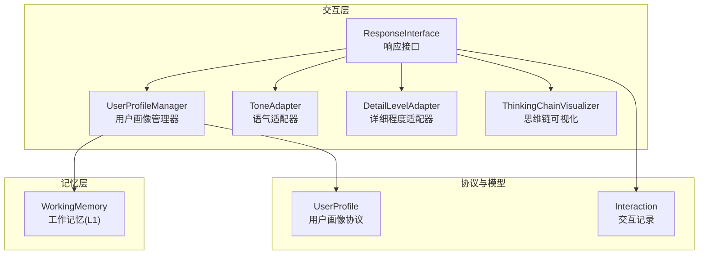
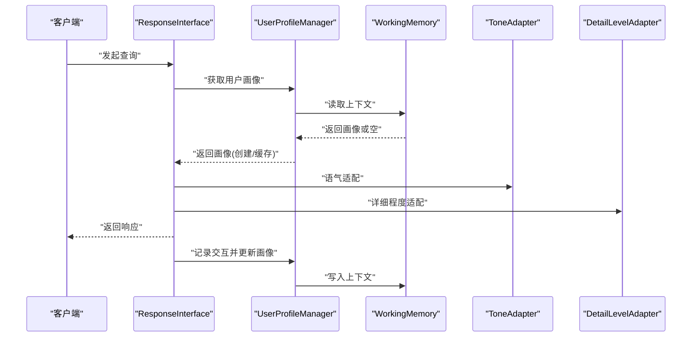
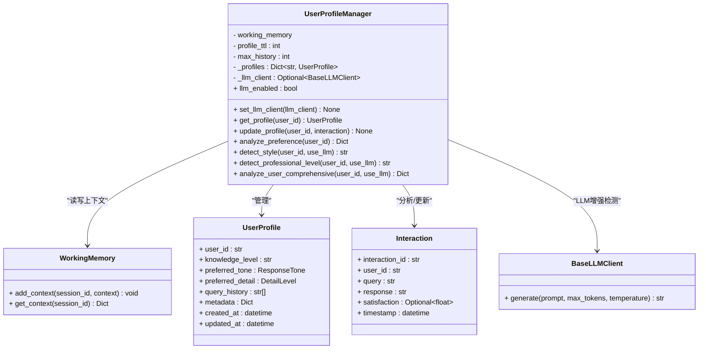
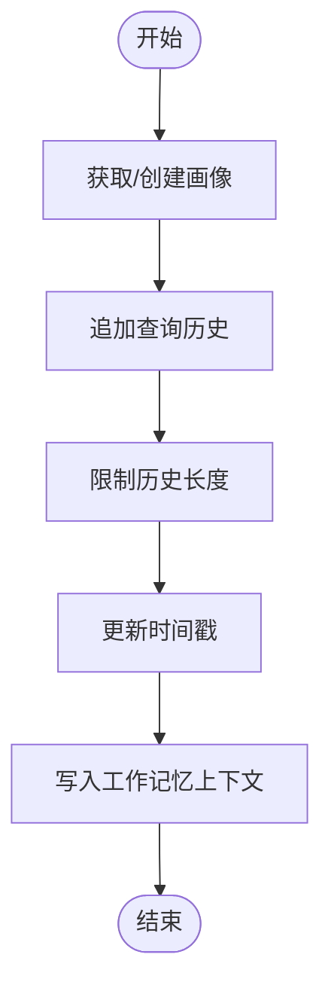
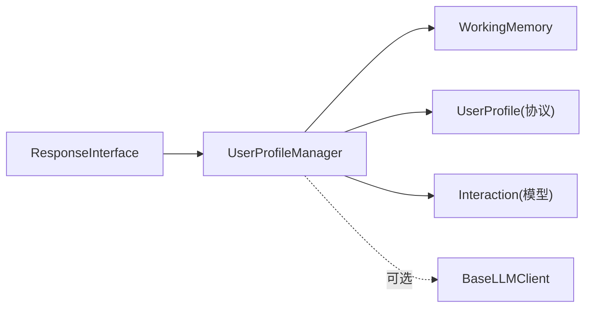

# 用户画像管理

<cite>
**本文引用的文件**
- [src/response/profile_manager.py](file://src/response/profile_manager.py)
- [src/response/interface.py](file://src/response/interface.py)
- [src/response/models.py](file://src/response/models.py)
- [src/core/protocols.py](file://src/core/protocols.py)
- [src/memory/working_memory.py](file://src/memory/working_memory.py)
- [src/adaptive/preference_predictor.py](file://src/adaptive/preference_predictor.py)
- [src/workspace/user/models.py](file://src/workspace/user/models.py)
- [src/workspace/user/manager.py](file://src/workspace/user/manager.py)
- [src/response/README.md](file://src/response/README.md)
- [tests/test_user/test_multi_user_system.py](file://tests/test_user/test_multi_user_system.py)
</cite>

## 目录
1. [简介](#简介)
2. [项目结构](#项目结构)
3. [核心组件](#核心组件)
4. [架构总览](#架构总览)
5. [详细组件分析](#详细组件分析)
6. [依赖分析](#依赖分析)
7. [性能考虑](#性能考虑)
8. [故障排查指南](#故障排查指南)
9. [结论](#结论)
10. [附录](#附录)

## 简介
本文件围绕用户画像管理功能，系统性阐述 UserProfileManager 类在交互层中的职责与实现，包括用户偏好识别、画像维护机制、画像构成要素、更新触发与策略、分析方法论、存储与访问接口、个性化应用示例、隐私与安全措施以及有效性与准确性评估方法。目标是帮助开发者与产品人员快速理解并正确使用该能力。

## 项目结构
用户画像管理主要分布在交互层与记忆层之间，通过工作记忆作为短期存储与缓存，结合协议层的统一数据模型，形成“读取/创建 → 分析/更新 → 适配输出”的闭环。

**图表来源**
- [src/response/interface.py:20-140](file://src/response/interface.py#L20-L140)
- [src/response/profile_manager.py:20-174](file://src/response/profile_manager.py#L20-L174)
- [src/memory/working_memory.py:11-120](file://src/memory/working_memory.py#L11-L120)
- [src/core/protocols.py:282-298](file://src/core/protocols.py#L282-L298)
- [src/response/models.py:13-31](file://src/response/models.py#L13-L31)

**章节来源**
- [src/response/interface.py:20-140](file://src/response/interface.py#L20-L140)
- [src/response/profile_manager.py:20-174](file://src/response/profile_manager.py#L20-L174)
- [src/memory/working_memory.py:11-120](file://src/memory/working_memory.py#L11-L120)
- [src/core/protocols.py:282-298](file://src/core/protocols.py#L282-L298)
- [src/response/models.py:13-31](file://src/response/models.py#L13-L31)

## 核心组件
- 用户画像管理器（UserProfileManager）
  - 负责画像的获取、更新、偏好分析与风格/专业水平检测
  - 支持规则检测与 LLM 增强两种模式
  - 以工作记忆为缓存与持久化入口
- 响应接口（ResponseInterface）
  - 在生成响应前后调用画像管理器，完成风格与详细程度的自适应
- 工作记忆（WorkingMemory）
  - 提供上下文读写，承载用户画像的短期缓存
- 协议与模型
  - UserProfile、Interaction 等统一数据结构，保证跨模块一致性

**章节来源**
- [src/response/profile_manager.py:20-174](file://src/response/profile_manager.py#L20-L174)
- [src/response/interface.py:20-140](file://src/response/interface.py#L20-L140)
- [src/memory/working_memory.py:11-120](file://src/memory/working_memory.py#L11-L120)
- [src/core/protocols.py:282-298](file://src/core/protocols.py#L282-L298)
- [src/response/models.py:13-31](file://src/response/models.py#L13-L31)

## 架构总览
用户画像管理贯穿“获取/创建画像 → 分析偏好 → 适配输出 → 更新画像”的流程，并在工作记忆中进行缓存与持久化。

**图表来源**
- [src/response/interface.py:59-140](file://src/response/interface.py#L59-L140)
- [src/response/profile_manager.py:115-174](file://src/response/profile_manager.py#L115-L174)
- [src/memory/working_memory.py:36-60](file://src/memory/working_memory.py#L36-L60)

## 详细组件分析

### UserProfileManager：用户偏好识别与画像维护
- 画像构成要素
  - 专业水平：beginner/intermediate/expert
  - 交互风格：concise/detailed/technical/popular（及默认 standard）
  - 偏好领域：来源于查询历史与关键词分析
  - 交互历史：query_history，受 max_history 限制
  - 元数据：created_at/updated_at 等
- 关键能力
  - 获取与缓存：优先从缓存命中，否则从工作记忆读取并回填缓存
  - 更新策略：追加查询历史、限制长度、更新时间；支持满意度字段占位（待实现）
  - 偏好分析：统计词频、计算交互风格与专业水平
  - 风格检测：规则模式匹配 + LLM 增强（退化为规则）
  - 专业水平检测：关键词权重 + 长度/复杂度启发式 + LLM 增强（退化为规则）
  - 综合分析：整合风格、专业水平、关键词与时间戳
- 触发条件
  - 每次响应生成后，通过 ResponseInterface 记录 Interaction 并调用 update_profile
- LLM 增强
  - 可选 BaseLLMClient，失败时自动退化为规则模式
- 存储与访问
  - 缓存：进程内字典 _profiles
  - 工作记忆：add_context/get_context 读写 profile
  - TTL：profile_ttl 未在工作记忆中直接使用，建议在上层或外部缓存实现

**图表来源**
- [src/response/profile_manager.py:20-505](file://src/response/profile_manager.py#L20-L505)
- [src/memory/working_memory.py:11-120](file://src/memory/working_memory.py#L11-L120)
- [src/core/protocols.py:282-298](file://src/core/protocols.py#L282-L298)
- [src/response/models.py:13-31](file://src/response/models.py#L13-L31)

**章节来源**
- [src/response/profile_manager.py:20-505](file://src/response/profile_manager.py#L20-L505)
- [src/response/models.py:13-31](file://src/response/models.py#L13-L31)
- [src/core/protocols.py:282-298](file://src/core/protocols.py#L282-L298)

### 偏好分析方法论
- 自然语言处理
  - 关键词提取与词频统计（过滤短词）
  - 正则模式匹配（简洁/详细/技术/通俗等）
- 机器学习模型
  - 可选 LLM 客户端进行风格与专业水平的增强判断
  - 失败时自动退化为规则模式，保证稳定性
- 行为模式识别
  - 基于查询长度、复杂度与关键词权重的启发式打分
  - 历史长度截断与时间戳更新，维持画像时效性

**章节来源**
- [src/response/profile_manager.py:175-505](file://src/response/profile_manager.py#L175-L505)

### 画像更新触发与策略
- 触发条件
  - 每次生成响应后，由 ResponseInterface 记录 Interaction 并调用 update_profile
- 更新策略
  - 追加查询历史并限制最大长度
  - 更新 updated_at
  - 将画像写回工作记忆上下文
- 动态调整机制
  - detect_style/detect_professional_level 支持 use_llm 参数
  - LLM 模式失败时自动回退规则模式

**图表来源**
- [src/response/profile_manager.py:143-174](file://src/response/profile_manager.py#L143-L174)
- [src/response/interface.py:129-140](file://src/response/interface.py#L129-L140)

**章节来源**
- [src/response/profile_manager.py:143-174](file://src/response/profile_manager.py#L143-L174)
- [src/response/interface.py:129-140](file://src/response/interface.py#L129-L140)

### 画像数据存储结构与访问接口
- 存储结构
  - UserProfile：统一协议模型，包含用户标识、知识水平、偏好语气/详细程度、查询历史、元数据等
  - 工作记忆上下文：以 user_id 为键，存储 {"profile": UserProfile}
  - 进程内缓存：UserProfileManager._profiles
- 访问接口
  - get_profile：优先缓存，其次工作记忆
  - update_profile：更新历史、时间与上下文
  - analyze_preference：词频统计与偏好汇总
  - detect_style/detect_professional_level：风格与专业水平检测
- 并发控制
  - 当前实现为单机进程内缓存，未见显式锁或分布式一致性处理
  - 建议在多实例部署时引入分布式缓存与锁，或在上层做幂等更新

**章节来源**
- [src/core/protocols.py:282-298](file://src/core/protocols.py#L282-L298)
- [src/memory/working_memory.py:36-60](file://src/memory/working_memory.py#L36-L60)
- [src/response/profile_manager.py:98-174](file://src/response/profile_manager.py#L98-L174)

### 个性化应用示例
- 响应风格定制
  - 依据 detect_style 返回风格，结合 ToneAdapter 注入语气与个性
- 内容推荐优化
  - 结合偏好领域与关键词，指导检索与融合策略（在其他模块中实现）
- 详细程度适配
  - 基于 detect_professional_level 与查询复杂度，由 ResponseInterface 决策 DetailLevel

**章节来源**
- [src/response/interface.py:80-140](file://src/response/interface.py#L80-L140)
- [src/response/profile_manager.py:210-467](file://src/response/profile_manager.py#L210-L467)

### 隐私保护与数据安全
- 用户画像与偏好
  - UserProfile 包含公开信息与私有配置（如密码哈希等），需遵循最小暴露原则
  - 建议对敏感字段进行脱敏或加密存储
- 查询记录与历史
  - 可按保留策略清理过期查询记录，遵循数据最小化原则
- 权限与合规
  - 用户资料更新接口支持隐私模式开关与通知配置
  - 建议结合权限模型与审计日志，满足合规要求

**章节来源**
- [src/workspace/user/models.py:152-202](file://src/workspace/user/models.py#L152-L202)
- [src/workspace/user/manager.py:70-95](file://src/workspace/user/manager.py#L70-L95)
- [src/workspace/user/permissions.py:314-356](file://src/workspace/user/permissions.py#L314-L356)

### 有效性与准确性评估
- 专业水平与风格检测
  - 可通过 LLM 增强模式与规则模式对比，统计准确率与一致性
- 偏好预测与学习
  - 参考自适应学习模块 PreferencePredictor，基于满意度历史与领域频率进行评估
- 个性化准确度
  - 可通过用户反馈与满意度指标量化个性化效果

**章节来源**
- [src/adaptive/preference_predictor.py:21-426](file://src/adaptive/preference_predictor.py#L21-L426)

## 依赖分析
- 组件耦合
  - ResponseInterface 依赖 UserProfileManager；UserProfileManager 依赖 WorkingMemory 与协议模型
  - LLM 客户端为可选依赖，失败时自动回退
- 外部依赖
  - 工作记忆后端（Redis/Qdrant/Neo4j）在 MemoryManager 中抽象，UserProfileManager 通过 WorkingMemory 接口访问

**图表来源**
- [src/response/interface.py:20-58](file://src/response/interface.py#L20-L58)
- [src/response/profile_manager.py:20-114](file://src/response/profile_manager.py#L20-L114)
- [src/memory/working_memory.py:11-35](file://src/memory/working_memory.py#L11-L35)
- [src/core/protocols.py:282-298](file://src/core/protocols.py#L282-L298)
- [src/response/models.py:13-31](file://src/response/models.py#L13-L31)

**章节来源**
- [src/response/interface.py:20-58](file://src/response/interface.py#L20-L58)
- [src/response/profile_manager.py:20-114](file://src/response/profile_manager.py#L20-L114)
- [src/memory/working_memory.py:11-35](file://src/memory/working_memory.py#L11-L35)
- [src/core/protocols.py:282-298](file://src/core/protocols.py#L282-L298)
- [src/response/models.py:13-31](file://src/response/models.py#L13-L31)

## 性能考虑
- 缓存策略
  - 进程内缓存命中率高，减少工作记忆读写开销
  - 建议在多实例部署时引入分布式缓存与失效策略
- 历史长度限制
  - max_history 控制内存占用与分析成本
- LLM 调用
  - 仅在 use_llm 为真时启用，失败自动回退，降低对下游系统的依赖风险
- 响应延迟
  - 偏好分析与风格检测为轻量计算，整体延迟可控

[本节为通用性能讨论，无需列出具体文件来源]

## 故障排查指南
- LLM 客户端不可用
  - 现象：风格/专业水平检测退化为规则模式
  - 处理：检查 LLM 配置与可用性，确认异常捕获逻辑
- 工作记忆读写失败
  - 现象：画像无法持久化或读取为空
  - 处理：检查 WorkingMemory 实现与连接状态
- 历史过长导致性能下降
  - 现象：分析耗时增加
  - 处理：调整 max_history 或定期清理旧数据
- 测试验证
  - 可参考多用户系统测试中对用户画像更新的断言，确保更新逻辑正确

**章节来源**
- [src/response/profile_manager.py:285-332](file://src/response/profile_manager.py#L285-L332)
- [src/response/profile_manager.py:421-467](file://src/response/profile_manager.py#L421-L467)
- [tests/test_user/test_multi_user_system.py:203-235](file://tests/test_user/test_multi_user_system.py#L203-L235)

## 结论
UserProfileManager 通过规则与 LLM 的双轨机制，实现了对用户专业水平与交互风格的稳健识别，并以工作记忆为缓存与持久化入口，配合 ResponseInterface 完成自适应输出。建议在生产环境中引入分布式缓存、合规与隐私保护措施，并结合反馈与满意度指标持续评估与优化个性化效果。

[本节为总结性内容，无需列出具体文件来源]

## 附录
- 相关文档与使用示例
  - 交互层模块文档对用户画像管理器有详细说明与类图
  - 响应接口 README 对用户画像参数与性能指标进行了说明

**章节来源**
- [src/response/README.md:240-398](file://src/response/README.md#L240-L398)