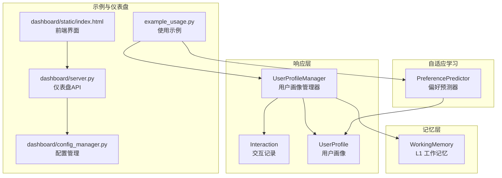
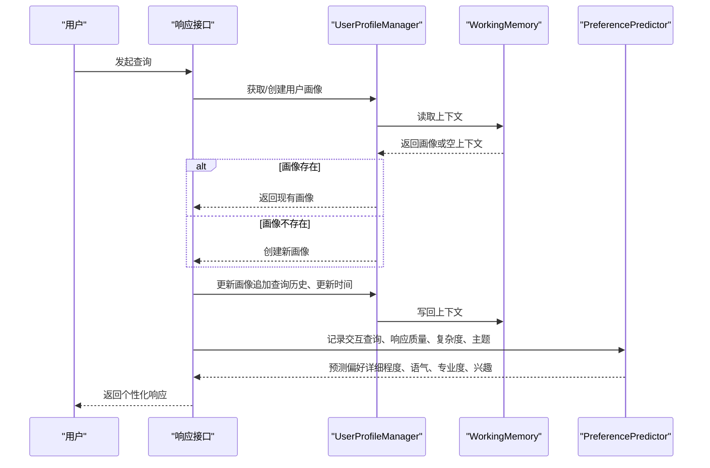
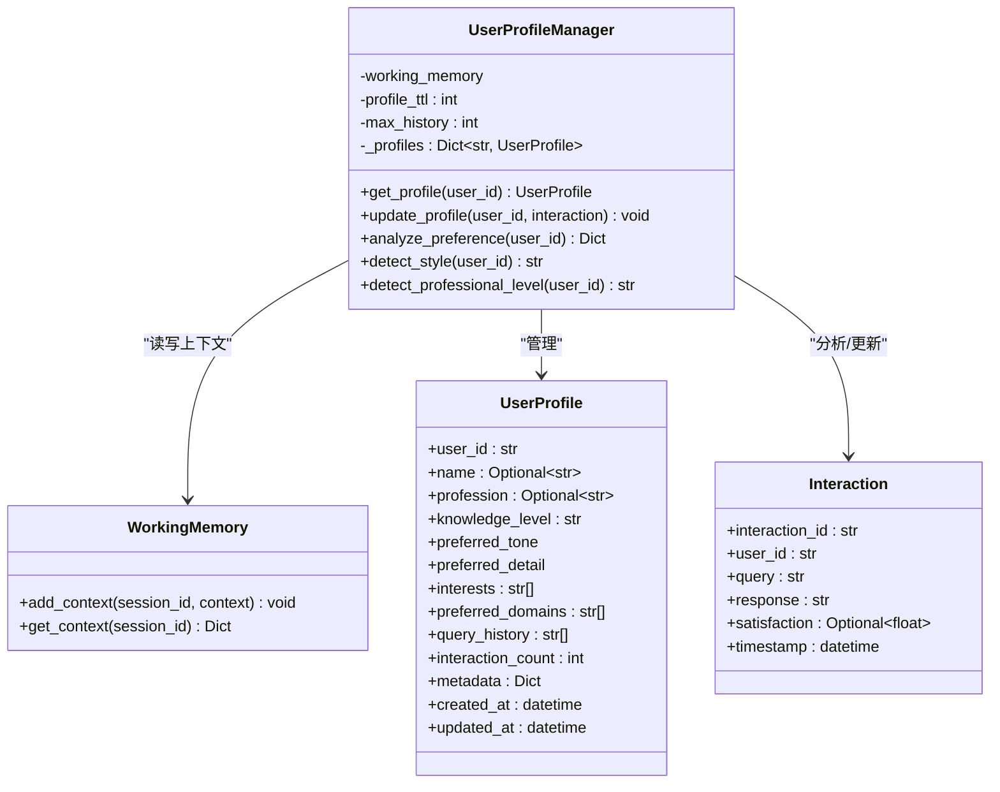
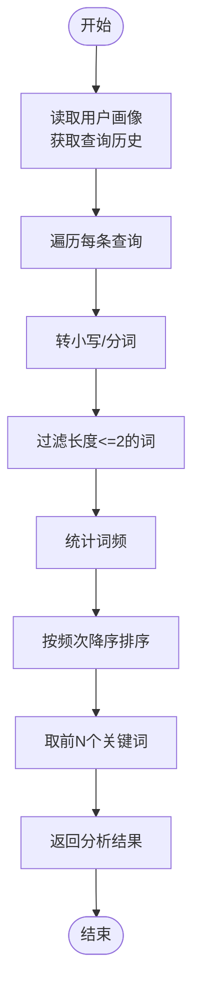
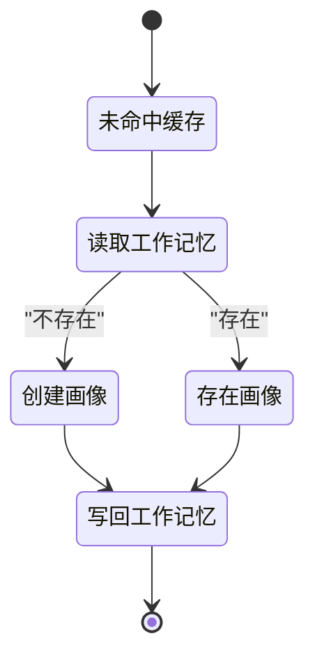
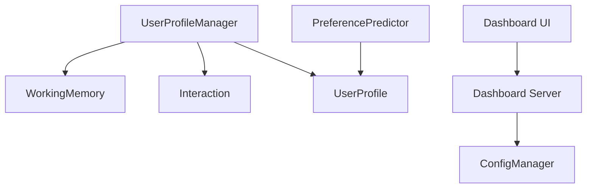

# 用户画像管理

<cite>
**本文引用的文件**
- [src/response/profile_manager.py](file://src/response/profile_manager.py)
- [src/response/models.py](file://src/response/models.py)
- [src/core/protocols.py](file://src/core/protocols.py)
- [src/memory/working_memory.py](file://src/memory/working_memory.py)
- [src/adaptive/preference_predictor.py](file://src/adaptive/preference_predictor.py)
- [example/example_usage.py](file://example/example_usage.py)
- [src/dashboard/server.py](file://src/dashboard/server.py)
- [src/dashboard/config_manager.py](file://src/dashboard/config_manager.py)
- [src/dashboard/static/index.html](file://src/dashboard/static/index.html)
</cite>

## 目录
1. [简介](#简介)
2. [项目结构](#项目结构)
3. [核心组件](#核心组件)
4. [架构总览](#架构总览)
5. [详细组件分析](#详细组件分析)
6. [依赖分析](#依赖分析)
7. [性能考虑](#性能考虑)
8. [故障排查指南](#故障排查指南)
9. [结论](#结论)
10. [附录](#附录)

## 简介
本文件围绕用户画像管理模块进行系统化说明，重点解释 UserProfileManager 类的设计与实现，阐述其如何从交互历史中提取与更新用户特征，并给出用户画像的核心要素（专业水平、交互风格、偏好设置等）的定义与计算方法。同时，文档覆盖用户画像的生命周期管理（创建、更新、持久化、清理），并结合现有实现提供用户偏好分析（Interaction）的原理与算法思路。最后，提供画像质量评估指标与个性化推荐效果的量化分析方法，并通过示例展示在不同场景下的应用。

## 项目结构
用户画像管理相关代码主要分布在以下模块：
- 响应层用户画像管理：UserProfileManager 负责用户画像的读取、更新、偏好分析与风格/专业水平检测
- 数据模型：Interaction 与 UserProfile 定义了交互记录与用户画像的数据结构
- 记忆层：WorkingMemory 提供 L1 工作记忆，作为用户画像的临时存储与上下文承载
- 自适应学习：PreferencePredictor 提供更丰富的用户偏好预测与画像更新逻辑
- 示例与仪表盘：example_usage.py 展示调用链路；dashboard 提供 Profile 的创建、激活、复制、导出与删除等操作

**图表来源**
- [src/response/profile_manager.py:10-165](file://src/response/profile_manager.py#L10-L165)
- [src/response/models.py:13-31](file://src/response/models.py#L13-L31)
- [src/core/protocols.py:282-298](file://src/core/protocols.py#L282-L298)
- [src/memory/working_memory.py:11-61](file://src/memory/working_memory.py#L11-L61)
- [src/adaptive/preference_predictor.py:21-223](file://src/adaptive/preference_predictor.py#L21-L223)
- [example/example_usage.py:176-216](file://example/example_usage.py#L176-L216)
- [src/dashboard/server.py:131-187](file://src/dashboard/server.py#L131-L187)
- [src/dashboard/config_manager.py:109-202](file://src/dashboard/config_manager.py#L109-L202)
- [src/dashboard/static/index.html:733-1009](file://src/dashboard/static/index.html#L733-L1009)

**章节来源**
- [src/response/profile_manager.py:1-165](file://src/response/profile_manager.py#L1-L165)
- [src/response/models.py:1-31](file://src/response/models.py#L1-L31)
- [src/core/protocols.py:280-298](file://src/core/protocols.py#L280-L298)
- [src/memory/working_memory.py:1-61](file://src/memory/working_memory.py#L1-L61)
- [src/adaptive/preference_predictor.py:1-223](file://src/adaptive/preference_predictor.py#L1-L223)
- [example/example_usage.py:176-216](file://example/example_usage.py#L176-L216)
- [src/dashboard/server.py:131-187](file://src/dashboard/server.py#L131-L187)
- [src/dashboard/config_manager.py:109-202](file://src/dashboard/config_manager.py#L109-L202)
- [src/dashboard/static/index.html:733-1009](file://src/dashboard/static/index.html#L733-L1009)

## 核心组件
- UserProfileManager：负责用户画像的获取、更新、偏好分析、风格与专业水平检测。支持从工作记忆加载/保存画像，维护本地缓存，限制历史长度，并预留满意度驱动的画像调整点。
- Interaction：交互记录，包含查询、响应、满意度、时间戳等字段，是画像更新与偏好分析的基础数据源。
- UserProfile：用户画像数据模型，包含用户标识、名称、职业、知识水平、偏好语气、偏好细节、兴趣、首选领域、查询历史、交互次数、元数据、创建/更新时间等。
- WorkingMemory：L1 工作记忆，提供会话上下文的临时存储与读取，支持 TTL 与条目上限控制。
- PreferencePredictor：自适应学习模块中的偏好预测器，提供更细粒度的画像更新（领域专业度、详细程度偏好、语气偏好、活跃时段、满意度历史等）与偏好预测。

**章节来源**
- [src/response/profile_manager.py:10-165](file://src/response/profile_manager.py#L10-L165)
- [src/response/models.py:13-31](file://src/response/models.py#L13-L31)
- [src/core/protocols.py:282-298](file://src/core/protocols.py#L282-L298)
- [src/memory/working_memory.py:11-61](file://src/memory/working_memory.py#L11-L61)
- [src/adaptive/preference_predictor.py:21-223](file://src/adaptive/preference_predictor.py#L21-L223)

## 架构总览
用户画像管理的整体流程如下：
- 交互发生后，系统记录 Interaction
- UserProfileManager 从 WorkingMemory 获取/创建 UserProfile
- 更新查询历史、时间戳与满意度（预留扩展点）
- 将 UserProfile 写回 WorkingMemory，以供后续会话复用
- PreferencePredictor 基于交互历史与领域检测，更新用户画像并预测偏好
- Dashboard 提供 Profile 的创建、激活、复制、导出与删除等管理能力

**图表来源**
- [src/response/profile_manager.py:41-100](file://src/response/profile_manager.py#L41-L100)
- [src/memory/working_memory.py:36-61](file://src/memory/working_memory.py#L36-L61)
- [src/adaptive/preference_predictor.py:64-128](file://src/adaptive/preference_predictor.py#L64-L128)

**章节来源**
- [src/response/profile_manager.py:41-100](file://src/response/profile_manager.py#L41-L100)
- [src/memory/working_memory.py:36-61](file://src/memory/working_memory.py#L36-L61)
- [src/adaptive/preference_predictor.py:64-128](file://src/adaptive/preference_predictor.py#L64-L128)

## 详细组件分析

### UserProfileManager 类设计与实现
- 设计目标
  - 管理用户画像生命周期：按需创建、缓存、持久化到工作记忆
  - 分析用户偏好：基于查询历史提取关键词，统计热门词与交互总量
  - 风格与专业水平检测：当前为占位实现，预留基于历史的检测逻辑
- 关键方法
  - get_profile：优先从本地缓存获取；若未命中，从 WorkingMemory 获取；否则创建新画像并写入缓存
  - update_profile：追加查询历史、限制历史长度、更新时间、写回工作记忆（满意度更新为 TODO）
  - analyze_preference：统计关键词频次，输出前 N 热门词、总查询数、当前交互风格与专业水平
  - detect_style/detect_professional_level：当前返回画像字段，未来可替换为基于历史的检测算法
- 生命周期管理
  - 缓存：进程内字典缓存，键为 user_id
  - 持久化：通过 WorkingMemory 的 add_context/get_context 实现 L1 临时持久化
  - 清理：WorkingMemory 支持 TTL 与条目上限，避免无限增长

**图表来源**
- [src/response/profile_manager.py:10-165](file://src/response/profile_manager.py#L10-L165)
- [src/memory/working_memory.py:11-61](file://src/memory/working_memory.py#L11-L61)
- [src/core/protocols.py:282-298](file://src/core/protocols.py#L282-L298)
- [src/response/models.py:13-22](file://src/response/models.py#L13-L22)

**章节来源**
- [src/response/profile_manager.py:10-165](file://src/response/profile_manager.py#L10-L165)
- [src/core/protocols.py:282-298](file://src/core/protocols.py#L282-L298)
- [src/response/models.py:13-22](file://src/response/models.py#L13-L22)
- [src/memory/working_memory.py:11-61](file://src/memory/working_memory.py#L11-L61)

### 用户偏好分析（Interaction）实现原理与算法
- 数据来源
  - Interaction.query 作为偏好分析的输入文本
- 关键步骤
  - 文本预处理：转小写、切分为词
  - 过滤短词：长度小于等于 2 的词过滤，降低噪声
  - 统计词频：累计出现次数
  - 排序与截断：按频次降序，取前 N（如 10）个关键词
- 输出
  - top_keywords：前 N 热门关键词及频次
  - total_queries：查询历史总条数
  - interaction_style/professional_level：当前画像字段（占位）

**图表来源**
- [src/response/profile_manager.py:101-134](file://src/response/profile_manager.py#L101-L134)

**章节来源**
- [src/response/profile_manager.py:101-134](file://src/response/profile_manager.py#L101-L134)

### 用户画像核心要素与计算方法
- 专业水平（knowledge_level）
  - 当前实现：UserProfile 中为字符串枚举（beginner/intermediate/expert），由外部配置或策略决定
  - 建议扩展：结合 PreferencePredictor 的领域专业度估计（expertise_scores）与查询复杂度趋势（query_complexity_trend）动态推断
- 交互风格（interaction_style）
  - 当前实现：占位返回 UserProfile 字段
  - 建议扩展：基于查询历史的复杂度、关键词分布、满意度变化等特征，采用规则或分类模型进行检测
- 偏好设置（preferred_tone、preferred_detail）
  - 当前实现：UserProfile 字段
  - 建议扩展：PreferencePredictor 已提供 preferred_tone 与 preferred_detail_level 的更新逻辑，可直接复用
- 兴趣与领域（interests、preferred_domains）
  - 当前实现：UserProfile 字段
  - 建议扩展：结合领域关键词检测（DOMAIN_KEYWORDS）与 topic_frequency，定期更新 Top 兴趣

**章节来源**
- [src/core/protocols.py:282-298](file://src/core/protocols.py#L282-L298)
- [src/adaptive/preference_predictor.py:130-172](file://src/adaptive/preference_predictor.py#L130-L172)

### 用户画像生命周期管理
- 创建
  - 若 WorkingMemory 中不存在 profile，则创建新的 UserProfile
- 更新
  - 追加查询历史，限制最大长度
  - 更新 updated_at
  - 写回 WorkingMemory
- 持久化
  - WorkingMemory 作为 L1 临时存储，适合会话内复用
- 清理
  - WorkingMemory 支持 TTL 与条目上限，避免无限增长
  - PreferencePredictor 提供周期性偏好更新与历史窗口管理

**图表来源**
- [src/response/profile_manager.py:41-100](file://src/response/profile_manager.py#L41-L100)
- [src/memory/working_memory.py:36-61](file://src/memory/working_memory.py#L36-L61)

**章节来源**
- [src/response/profile_manager.py:41-100](file://src/response/profile_manager.py#L41-L100)
- [src/memory/working_memory.py:22-61](file://src/memory/working_memory.py#L22-L61)

### 仪表盘与 Profile 管理
- API 能力
  - 创建、更新、删除、激活、复制、导出、导入 Profile
- 前端界面
  - 列表渲染、激活状态标记、创建/删除模态框、统计信息展示
- 与用户画像的关系
  - Profile 作为配置载体，可影响响应层的偏好策略与风格参数

**章节来源**
- [src/dashboard/server.py:131-187](file://src/dashboard/server.py#L131-L187)
- [src/dashboard/config_manager.py:109-202](file://src/dashboard/config_manager.py#L109-L202)
- [src/dashboard/static/index.html:733-1009](file://src/dashboard/static/index.html#L733-L1009)

## 依赖分析
- 组件耦合
  - UserProfileManager 依赖 WorkingMemory 进行上下文读写
  - PreferencePredictor 独立维护用户画像，但与 UserProfile 数据结构兼容
  - Interaction 与 UserProfile 在数据层面解耦，通过管理器与预测器进行连接
- 外部依赖
  - Dashboard 通过 HTTP API 与配置管理器交互，间接影响用户画像策略

**图表来源**
- [src/response/profile_manager.py:10-165](file://src/response/profile_manager.py#L10-L165)
- [src/memory/working_memory.py:11-61](file://src/memory/working_memory.py#L11-L61)
- [src/adaptive/preference_predictor.py:21-223](file://src/adaptive/preference_predictor.py#L21-L223)
- [src/dashboard/server.py:131-187](file://src/dashboard/server.py#L131-L187)
- [src/dashboard/config_manager.py:109-202](file://src/dashboard/config_manager.py#L109-L202)

**章节来源**
- [src/response/profile_manager.py:10-165](file://src/response/profile_manager.py#L10-L165)
- [src/memory/working_memory.py:11-61](file://src/memory/working_memory.py#L11-L61)
- [src/adaptive/preference_predictor.py:21-223](file://src/adaptive/preference_predictor.py#L21-L223)
- [src/dashboard/server.py:131-187](file://src/dashboard/server.py#L131-L187)
- [src/dashboard/config_manager.py:109-202](file://src/dashboard/config_manager.py#L109-L202)

## 性能考虑
- 缓存策略
  - UserProfileManager 使用进程内字典缓存，减少重复读取与构造开销
- 历史长度限制
  - 通过 max_history 控制查询历史长度，避免内存膨胀
- 工作记忆 TTL
  - WorkingMemory 的 TTL 与条目上限有助于自动清理过期数据
- 偏好更新频率
  - PreferencePredictor 通过 preference_update_interval 控制周期性更新成本

**章节来源**
- [src/response/profile_manager.py:20-36](file://src/response/profile_manager.py#L20-L36)
- [src/memory/working_memory.py:22-34](file://src/memory/working_memory.py#L22-L34)
- [src/adaptive/preference_predictor.py:121-123](file://src/adaptive/preference_predictor.py#L121-L123)

## 故障排查指南
- 画像未更新
  - 检查 update_profile 是否被调用，确认 Interaction 参数正确传入
  - 确认 WorkingMemory 的 add_context 调用是否成功
- 偏好分析为空
  - 检查查询历史是否为空或全部被过滤（短词过滤）
  - 确认 analyze_preference 的 topN 截断逻辑
- 风格/专业水平检测异常
  - 当前为占位实现，需补充基于历史的检测算法
- Dashboard 操作失败
  - 检查 API 返回状态与错误信息，确认 Profile ID 存在且配置有效

**章节来源**
- [src/response/profile_manager.py:69-100](file://src/response/profile_manager.py#L69-L100)
- [src/response/profile_manager.py:101-164](file://src/response/profile_manager.py#L101-L164)
- [src/dashboard/server.py:131-187](file://src/dashboard/server.py#L131-L187)
- [src/dashboard/config_manager.py:109-202](file://src/dashboard/config_manager.py#L109-L202)

## 结论
用户画像管理模块通过 UserProfileManager 与 WorkingMemory 实现了画像的快速创建、缓存与临时持久化；通过 Interaction 与 PreferencePredictor 提供了从交互历史中提取偏好的能力，并为风格与专业水平检测预留了扩展空间。结合 Dashboard 的 Profile 管理能力，系统实现了从配置到执行再到可视化的完整闭环。建议后续完善风格与专业水平的检测算法、引入更丰富的偏好特征与反馈机制，并持续优化历史长度与更新频率以平衡性能与准确性。

## 附录

### 用户画像质量评估指标与个性化推荐效果量化
- 个性化准确度
  - 基于用户满意度历史计算：对每个用户的满意度序列求均值得到个体准确度，再对全体用户取平均
- 专家度分布与语气分布
  - 基于领域专业度估计与偏好语气统计，得到整体分布，用于评估策略有效性
- 交互趋势与活跃度
  - 通过活跃时段统计与交互次数趋势，评估用户画像的时效性与稳定性

**章节来源**
- [src/adaptive/preference_predictor.py:403-425](file://src/adaptive/preference_predictor.py#L403-L425)
- [src/adaptive/preference_predictor.py:352-401](file://src/adaptive/preference_predictor.py#L352-L401)

### 应用实例
- 示例调用链
  - 通过 example_usage.py 展示从感知、记忆、检索、精炼到响应的完整流程，并在响应阶段调用用户偏好分析
- 仪表盘操作
  - 通过 Dashboard 创建/激活/复制/导出/删除 Profile，观察用户画像策略在不同配置下的差异

**章节来源**
- [example/example_usage.py:176-216](file://example/example_usage.py#L176-L216)
- [src/dashboard/server.py:131-187](file://src/dashboard/server.py#L131-L187)
- [src/dashboard/static/index.html:733-1009](file://src/dashboard/static/index.html#L733-L1009)