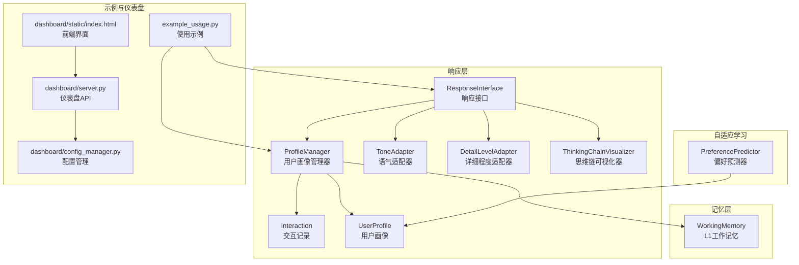
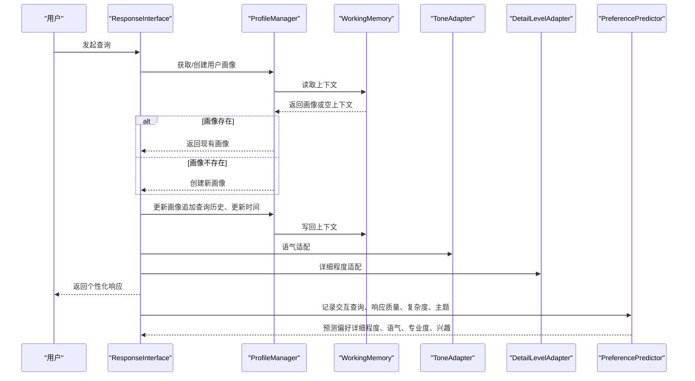
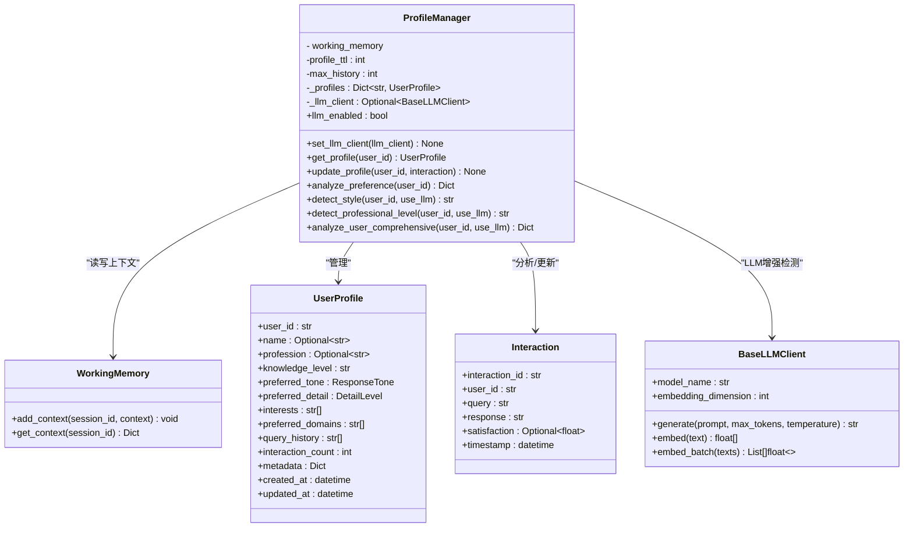
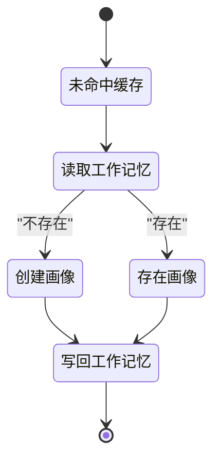
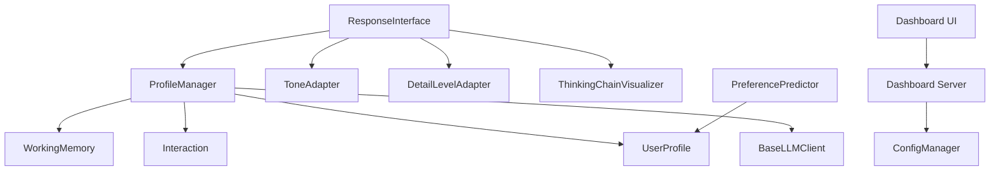

# 用户画像管理

<cite>
**本文引用的文件**
- [src/response/profile_manager.py](file://src/response/profile_manager.py)
- [src/response/models.py](file://src/response/models.py)
- [src/response/interface.py](file://src/response/interface.py)
- [src/response/detail_adapter.py](file://src/response/detail_adapter.py)
- [src/response/tone_adapter.py](file://src/response/tone_adapter.py)
- [src/response/visualizer.py](file://src/response/visualizer.py)
- [src/core/protocols.py](file://src/core/protocols.py)
- [src/core/base.py](file://src/core/base.py)
- [src/memory/working_memory.py](file://src/memory/working_memory.py)
- [src/adaptive/preference_predictor.py](file://src/adaptive/preference_predictor.py)
- [example/example_usage.py](file://example/example_usage.py)
- [src/dashboard/server.py](file://src/dashboard/server.py)
- [src/dashboard/config_manager.py](file://src/dashboard/config_manager.py)
- [src/dashboard/static/index.html](file://src/dashboard/static/index.html)
</cite>

## 目录
1. [简介](#简介)
2. [项目结构](#项目结构)
3. [核心组件](#核心组件)
4. [架构总览](#架构总览)
5. [详细组件分析](#详细组件分析)
6. [依赖分析](#依赖分析)
7. [性能考虑](#性能考虑)
8. [故障排查指南](#故障排查指南)
9. [结论](#结论)
10. [附录](#附录)

## 简介
本文件围绕用户画像管理模块进行系统化说明，重点解释ProfileManager类的设计与实现，阐述其如何从交互历史中提取与更新用户特征，并给出用户画像的核心要素（专业水平、交互风格、偏好设置等）的定义与计算方法。该模块现已支持现代化的LLM增强模式，能够动态检测用户的知识水平和沟通风格偏好，提供个性化响应生成。同时，文档覆盖用户画像的生命周期管理（创建、更新、持久化、清理），并结合现有实现提供用户偏好分析（Interaction）的原理与算法思路。最后，提供画像质量评估指标与个性化推荐效果的量化分析方法，并通过示例展示在不同场景下的应用。

## 项目结构
用户画像管理相关代码主要分布在以下模块：
- 响应层用户画像管理：ProfileManager负责用户画像的读取、更新、偏好分析与风格/专业水平检测，支持LLM增强模式
- 数据模型：Interaction与UserProfile定义了交互记录与用户画像的数据结构
- 响应接口：ResponseInterface集成了ProfileManager，实现情境自适应生成和个性化响应
- 适配器：ToneAdapter和DetailLevelAdapter提供语气和详细程度的个性化适配
- 可视化：ThinkingChainVisualizer展示思维链可视化
- 记忆层：WorkingMemory提供L1工作记忆，作为用户画像的临时存储与上下文承载
- 自适应学习：PreferencePredictor提供更丰富的用户偏好预测与画像更新逻辑
- 示例与仪表盘：example_usage.py展示调用链路；dashboard提供Profile的创建、激活、复制、导出与删除等操作

**图表来源**
- [src/response/profile_manager.py:1-505](file://src/response/profile_manager.py#L1-L505)
- [src/response/interface.py:1-232](file://src/response/interface.py#L1-L232)
- [src/response/models.py:1-31](file://src/response/models.py#L1-L31)
- [src/response/detail_adapter.py:1-417](file://src/response/detail_adapter.py#L1-L417)
- [src/response/tone_adapter.py:1-138](file://src/response/tone_adapter.py#L1-L138)
- [src/response/visualizer.py:1-150](file://src/response/visualizer.py#L1-L150)
- [src/memory/working_memory.py:11-61](file://src/memory/working_memory.py#L11-L61)
- [src/adaptive/preference_predictor.py:21-223](file://src/adaptive/preference_predictor.py#L21-L223)
- [example/example_usage.py:176-216](file://example/example_usage.py#L176-L216)
- [src/dashboard/server.py:131-187](file://src/dashboard/server.py#L131-L187)
- [src/dashboard/config_manager.py:109-202](file://src/dashboard/config_manager.py#L109-L202)
- [src/dashboard/static/index.html:733-1009](file://src/dashboard/static/index.html#L733-L1009)

**章节来源**
- [src/response/profile_manager.py:1-505](file://src/response/profile_manager.py#L1-L505)
- [src/response/interface.py:1-232](file://src/response/interface.py#L1-L232)
- [src/response/models.py:1-31](file://src/response/models.py#L1-L31)
- [src/response/detail_adapter.py:1-417](file://src/response/detail_adapter.py#L1-L417)
- [src/response/tone_adapter.py:1-138](file://src/response/tone_adapter.py#L1-L138)
- [src/response/visualizer.py:1-150](file://src/response/visualizer.py#L1-L150)
- [src/memory/working_memory.py:1-61](file://src/memory/working_memory.py#L1-L61)
- [src/adaptive/preference_predictor.py:1-223](file://src/adaptive/preference_predictor.py#L1-L223)
- [example/example_usage.py:176-216](file://example/example_usage.py#L176-L216)
- [src/dashboard/server.py:131-187](file://src/dashboard/server.py#L131-L187)
- [src/dashboard/config_manager.py:109-202](file://src/dashboard/config_manager.py#L109-L202)
- [src/dashboard/static/index.html:733-1009](file://src/dashboard/static/index.html#L733-L1009)

## 核心组件
- ProfileManager：现代化的用户画像管理器，负责用户画像的获取、更新、偏好分析、风格与专业水平检测。支持LLM增强模式和规则退化模式，提供动态用户画像管理能力。
- Interaction：交互记录，包含查询、响应、满意度、时间戳等字段，是画像更新与偏好分析的基础数据源。
- UserProfile：用户画像数据模型，包含用户标识、名称、职业、知识水平、偏好语气、偏好详细程度、兴趣、首选领域、查询历史、交互次数、元数据、创建/更新时间等。
- ResponseInterface：响应接口，集成了ProfileManager，实现情境自适应生成和个性化响应。
- ToneAdapter：语气适配器，支持正式、友好、幽默等多种语气风格的个性化适配。
- DetailLevelAdapter：详细程度适配器，支持1-4级详细程度的个性化内容适配。
- ThinkingChainVisualizer：思维链可视化器，展示检索路径、证据来源和推理过程。
- WorkingMemory：L1工作记忆，提供会话上下文的临时存储与读取，支持TTL与条目上限控制。
- PreferencePredictor：自适应学习模块中的偏好预测器，提供更细粒度的画像更新（领域专业度、详细程度偏好、语气偏好、活跃时段、满意度历史等）与偏好预测。

**章节来源**
- [src/response/profile_manager.py:1-505](file://src/response/profile_manager.py#L1-L505)
- [src/response/models.py:13-31](file://src/response/models.py#L13-L31)
- [src/response/interface.py:20-232](file://src/response/interface.py#L20-L232)
- [src/response/detail_adapter.py:18-417](file://src/response/detail_adapter.py#L18-L417)
- [src/response/tone_adapter.py:8-138](file://src/response/tone_adapter.py#L8-L138)
- [src/response/visualizer.py:9-150](file://src/response/visualizer.py#L9-L150)
- [src/memory/working_memory.py:11-61](file://src/memory/working_memory.py#L11-L61)
- [src/adaptive/preference_predictor.py:21-223](file://src/adaptive/preference_predictor.py#L21-L223)

## 架构总览
用户画像管理的整体流程如下：
- 交互发生后，系统记录Interaction
- ProfileManager从WorkingMemory获取/创建UserProfile
- 更新查询历史、时间戳与满意度（预留扩展点）
- 将UserProfile写回WorkingMemory，以供后续会话复用
- ResponseInterface使用ProfileManager进行情境自适应生成
- PreferencePredictor基于交互历史与领域检测，更新用户画像并预测偏好
- Dashboard提供Profile的创建、激活、复制、导出与删除等管理能力

**图表来源**
- [src/response/interface.py:59-140](file://src/response/interface.py#L59-L140)
- [src/response/profile_manager.py:115-174](file://src/response/profile_manager.py#L115-L174)
- [src/memory/working_memory.py:36-61](file://src/memory/working_memory.py#L36-L61)
- [src/adaptive/preference_predictor.py:64-128](file://src/adaptive/preference_predictor.py#L64-L128)

**章节来源**
- [src/response/interface.py:59-140](file://src/response/interface.py#L59-L140)
- [src/response/profile_manager.py:115-174](file://src/response/profile_manager.py#L115-L174)
- [src/memory/working_memory.py:36-61](file://src/memory/working_memory.py#L36-L61)
- [src/adaptive/preference_predictor.py:64-128](file://src/adaptive/preference_predictor.py#L64-L128)

## 详细组件分析

### ProfileManager 类设计与实现
- 设计目标
  - 管理用户画像生命周期：按需创建、缓存、持久化到工作记忆
  - 分析用户偏好：基于查询历史提取关键词，统计热门词与交互总量
  - 风格与专业水平检测：支持规则检测和LLM增强检测两种模式
  - 动态用户画像管理：支持实时更新和综合分析
- 关键方法
  - get_profile：优先从本地缓存获取；若未命中，从WorkingMemory获取；否则创建新画像并写入缓存
  - update_profile：追加查询历史、限制历史长度、更新时间、写回工作记忆（满意度更新为TODO）
  - analyze_preference：统计关键词频次，输出前N热门词、总查询数、当前交互风格与专业水平
  - detect_style：检测用户交互风格，支持规则检测和LLM检测模式
  - detect_professional_level：检测用户专业水平，支持规则检测和LLM检测模式
  - analyze_user_comprehensive：综合分析用户画像，返回完整的分析结果
- 生命周期管理
  - 缓存：进程内字典缓存，键为user_id
  - 持久化：通过WorkingMemory的add_context/get_context实现L1临时持久化
  - 清理：WorkingMemory支持TTL与条目上限，避免无限增长

**图表来源**
- [src/response/profile_manager.py:20-505](file://src/response/profile_manager.py#L20-L505)
- [src/memory/working_memory.py:11-61](file://src/memory/working_memory.py#L11-L61)
- [src/core/protocols.py:282-298](file://src/core/protocols.py#L282-L298)
- [src/response/models.py:13-22](file://src/response/models.py#L13-L22)
- [src/core/base.py:542-604](file://src/core/base.py#L542-L604)

**章节来源**
- [src/response/profile_manager.py:20-505](file://src/response/profile_manager.py#L20-L505)
- [src/core/protocols.py:282-298](file://src/core/protocols.py#L282-L298)
- [src/response/models.py:13-22](file://src/response/models.py#L13-L22)
- [src/memory/working_memory.py:11-61](file://src/memory/working_memory.py#L11-L61)
- [src/core/base.py:542-604](file://src/core/base.py#L542-L604)

### 用户偏好分析（Interaction）实现原理与算法
- 数据来源
  - Interaction.query作为偏好分析的输入文本
- 关键步骤
  - 文本预处理：转小写、切分为词
  - 过滤短词：长度小于等于2的词过滤，降低噪声
  - 统计词频：累计出现次数
  - 排序与截断：按频次降序，取前N个关键词
- 输出
  - top_keywords：前N热门关键词及频次
  - total_queries：查询历史总条数
  - interaction_style：当前画像的偏好语气
  - professional_level：当前画像的专业水平

**图表来源**
- [src/response/profile_manager.py:175-208](file://src/response/profile_manager.py#L175-L208)

**章节来源**
- [src/response/profile_manager.py:175-208](file://src/response/profile_manager.py#L175-L208)

### 用户画像核心要素与计算方法
- 专业水平（knowledge_level）
  - 当前实现：UserProfile中为字符串枚举（beginner/intermediate/expert），由外部配置或策略决定
  - LLM增强检测：通过关键词匹配和查询复杂度分析，使用规则检测和LLM检测两种模式
  - 规则检测：基于专家关键词、中级关键词、初学者关键词的权重计算
  - LLM检测：使用提示词让LLM判断用户的专业水平
- 交互风格（interaction_style）
  - 当前实现：占位返回UserProfile的preferred_tone字段
  - LLM增强检测：通过关键词模式匹配和查询长度分析，支持简洁、详细、技术性、通俗化四种风格
  - 规则检测：基于正则表达式模式匹配和查询长度阈值
  - LLM检测：使用提示词让LLM分析用户偏好的回答风格
- 偏好设置（preferred_tone、preferred_detail）
  - 当前实现：UserProfile字段
  - 建议扩展：PreferencePredictor已提供preferred_tone与preferred_detail的更新逻辑，可直接复用
- 兴趣与领域（interests、preferred_domains）
  - 当前实现：UserProfile字段
  - 建议扩展：结合领域关键词检测与topic_frequency，定期更新Top兴趣

**章节来源**
- [src/core/protocols.py:282-298](file://src/core/protocols.py#L282-L298)
- [src/adaptive/preference_predictor.py:130-172](file://src/adaptive/preference_predictor.py#L130-L172)
- [src/response/profile_manager.py:340-467](file://src/response/profile_manager.py#L340-L467)

### 用户画像生命周期管理
- 创建
  - 若WorkingMemory中不存在profile，则创建新的UserProfile
- 更新
  - 追加查询历史，限制最大长度
  - 更新updated_at
  - 写回WorkingMemory
- 持久化
  - WorkingMemory作为L1临时存储，适合会话内复用
- 清理
  - WorkingMemory支持TTL与条目上限，避免无限增长
  - PreferencePredictor提供周期性偏好更新与历史窗口管理

**图表来源**
- [src/response/profile_manager.py:115-174](file://src/response/profile_manager.py#L115-L174)
- [src/memory/working_memory.py:36-61](file://src/memory/working_memory.py#L36-L61)

**章节来源**
- [src/response/profile_manager.py:115-174](file://src/response/profile_manager.py#L115-L174)
- [src/memory/working_memory.py:22-61](file://src/memory/working_memory.py#L22-L61)

### 响应接口与个性化生成
- 设计目标
  - 集成ProfileManager实现情境自适应生成
  - 基于用户画像确定语气和详细程度
  - 提供思维链可视化
- 关键功能
  - respond：生成个性化响应，包括语气适配、详细程度适配、思维链可视化
  - _determine_detail_level：基于用户专业水平和查询复杂度确定详细程度
  - get_user_preference：获取用户偏好分析结果
- 个性化策略
  - 语气选择：优先使用用户偏好，否则使用默认值
  - 详细程度：初学者3级，中级2级，专家1级，复杂查询可提升级别
  - 内容适配：使用ToneAdapter和DetailLevelAdapter进行个性化适配

**章节来源**
- [src/response/interface.py:20-232](file://src/response/interface.py#L20-L232)
- [src/response/detail_adapter.py:18-417](file://src/response/detail_adapter.py#L18-L417)
- [src/response/tone_adapter.py:8-138](file://src/response/tone_adapter.py#L8-L138)

### 仪表盘与 Profile 管理
- API能力
  - 创建、更新、删除、激活、复制、导出、导入Profile
- 前端界面
  - 列表渲染、激活状态标记、创建/删除模态框、统计信息展示
- 与用户画像的关系
  - Profile作为配置载体，可影响响应层的偏好策略与风格参数

**章节来源**
- [src/dashboard/server.py:131-187](file://src/dashboard/server.py#L131-L187)
- [src/dashboard/config_manager.py:109-202](file://src/dashboard/config_manager.py#L109-L202)
- [src/dashboard/static/index.html:733-1009](file://src/dashboard/static/index.html#L733-L1009)

## 依赖分析
- 组件耦合
  - ProfileManager依赖WorkingMemory进行上下文读写
  - ResponseInterface集成ProfileManager实现个性化响应
  - PreferencePredictor独立维护用户画像，但与UserProfile数据结构兼容
  - Interaction与UserProfile在数据层面解耦，通过管理器与预测器进行连接
- 外部依赖
  - BaseLLMClient为ProfileManager提供LLM增强检测能力
  - Dashboard通过HTTP API与配置管理器交互，间接影响用户画像策略

**图表来源**
- [src/response/profile_manager.py:1-505](file://src/response/profile_manager.py#L1-L505)
- [src/response/interface.py:1-232](file://src/response/interface.py#L1-L232)
- [src/response/detail_adapter.py:1-417](file://src/response/detail_adapter.py#L1-L417)
- [src/response/tone_adapter.py:1-138](file://src/response/tone_adapter.py#L1-L138)
- [src/response/visualizer.py:1-150](file://src/response/visualizer.py#L1-L150)
- [src/memory/working_memory.py:11-61](file://src/memory/working_memory.py#L11-L61)
- [src/adaptive/preference_predictor.py:21-223](file://src/adaptive/preference_predictor.py#L21-L223)
- [src/core/base.py:542-604](file://src/core/base.py#L542-L604)
- [src/dashboard/server.py:131-187](file://src/dashboard/server.py#L131-L187)
- [src/dashboard/config_manager.py:109-202](file://src/dashboard/config_manager.py#L109-L202)

**章节来源**
- [src/response/profile_manager.py:1-505](file://src/response/profile_manager.py#L1-L505)
- [src/response/interface.py:1-232](file://src/response/interface.py#L1-L232)
- [src/response/detail_adapter.py:1-417](file://src/response/detail_adapter.py#L1-L417)
- [src/response/tone_adapter.py:1-138](file://src/response/tone_adapter.py#L1-L138)
- [src/response/visualizer.py:1-150](file://src/response/visualizer.py#L1-L150)
- [src/memory/working_memory.py:11-61](file://src/memory/working_memory.py#L11-L61)
- [src/adaptive/preference_predictor.py:21-223](file://src/adaptive/preference_predictor.py#L21-L223)
- [src/core/base.py:542-604](file://src/core/base.py#L542-L604)
- [src/dashboard/server.py:131-187](file://src/dashboard/server.py#L131-L187)
- [src/dashboard/config_manager.py:109-202](file://src/dashboard/config_manager.py#L109-L202)

## 性能考虑
- 缓存策略
  - ProfileManager使用进程内字典缓存，减少重复读取与构造开销
- 历史长度限制
  - 通过max_history控制查询历史长度，避免内存膨胀
- LLM调用优化
  - 提供LLM退化模式，在LLM不可用时自动切换到规则检测
  - 使用温度参数和令牌限制控制LLM调用成本
- 工作记忆TTL
  - WorkingMemory的TTL与条目上限有助于自动清理过期数据
- 偏好更新频率
  - PreferencePredictor通过preference_update_interval控制周期性更新成本

**章节来源**
- [src/response/profile_manager.py:77-114](file://src/response/profile_manager.py#L77-L114)
- [src/memory/working_memory.py:22-34](file://src/memory/working_memory.py#L22-L34)
- [src/adaptive/preference_predictor.py:121-123](file://src/adaptive/preference_predictor.py#L121-L123)

## 故障排查指南
- 画像未更新
  - 检查update_profile是否被调用，确认Interaction参数正确传入
  - 确认WorkingMemory的add_context调用是否成功
- 偏好分析为空
  - 检查查询历史是否为空或全部被过滤（短词过滤）
  - 确认analyze_preference的topN截断逻辑
- LLM检测异常
  - 检查BaseLLMClient是否正确初始化
  - 确认LLM调用是否抛出异常，系统会自动退化到规则检测
- 风格/专业水平检测异常
  - 当前为占位实现，需补充基于历史的检测算法
  - 检查关键词匹配和模式检测逻辑
- Dashboard操作失败
  - 检查API返回状态与错误信息，确认Profile ID存在且配置有效

**章节来源**
- [src/response/profile_manager.py:143-174](file://src/response/profile_manager.py#L143-L174)
- [src/response/profile_manager.py:285-332](file://src/response/profile_manager.py#L285-L332)
- [src/response/profile_manager.py:421-467](file://src/response/profile_manager.py#L421-L467)
- [src/dashboard/server.py:131-187](file://src/dashboard/server.py#L131-L187)
- [src/dashboard/config_manager.py:109-202](file://src/dashboard/config_manager.py#L109-L202)

## 结论
用户画像管理模块通过ProfileManager与WorkingMemory实现了现代化的动态画像管理，支持LLM增强模式和规则退化模式，能够智能检测用户的专业水平和沟通风格偏好。通过ResponseInterface集成，系统实现了情境自适应生成和个性化响应。结合ToneAdapter、DetailLevelAdapter和ThinkingChainVisualizer，提供了完整的个性化体验。PreferencePredictor进一步增强了画像的准确性。结合Dashboard的Profile管理能力，系统实现了从配置到执行再到可视化的完整闭环。建议后续完善检测算法、引入更丰富的偏好特征与反馈机制，并持续优化LLM调用成本与历史长度管理以平衡性能与准确性。

## 附录

### 用户画像质量评估指标与个性化推荐效果量化
- 个性化准确度
  - 基于用户满意度历史计算：对每个用户的满意度序列求均值得到个体准确度，再对全体用户取平均
- 专家度分布与语气分布
  - 基于领域专业度估计与偏好语气统计，得到整体分布，用于评估策略有效性
- 交互趋势与活跃度
  - 通过活跃时段统计与交互次数趋势，评估用户画像的时效性与稳定性
- LLM检测准确性
  - 通过对比规则检测与LLM检测的结果一致性，评估LLM增强模式的有效性

**章节来源**
- [src/adaptive/preference_predictor.py:403-425](file://src/adaptive/preference_predictor.py#L403-L425)
- [src/adaptive/preference_predictor.py:352-401](file://src/adaptive/preference_predictor.py#L352-L401)
- [src/response/profile_manager.py:285-332](file://src/response/profile_manager.py#L285-L332)
- [src/response/profile_manager.py:421-467](file://src/response/profile_manager.py#L421-L467)

### 应用实例
- 示例调用链
  - 通过example_usage.py展示从感知、记忆、检索、精炼到响应的完整流程，并在响应阶段调用用户偏好分析
- 仪表盘操作
  - 通过Dashboard创建/激活/复制/导出/删除Profile，观察用户画像策略在不同配置下的差异
- LLM增强模式演示
  - 展示规则检测与LLM检测的对比效果，以及自动退化机制的工作原理

**章节来源**
- [example/example_usage.py:176-216](file://example/example_usage.py#L176-L216)
- [src/dashboard/server.py:131-187](file://src/dashboard/server.py#L131-L187)
- [src/dashboard/static/index.html:733-1009](file://src/dashboard/static/index.html#L733-L1009)
- [src/response/profile_manager.py:285-332](file://src/response/profile_manager.py#L285-L332)
- [src/response/profile_manager.py:421-467](file://src/response/profile_manager.py#L421-L467)