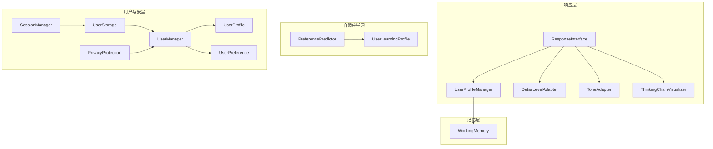
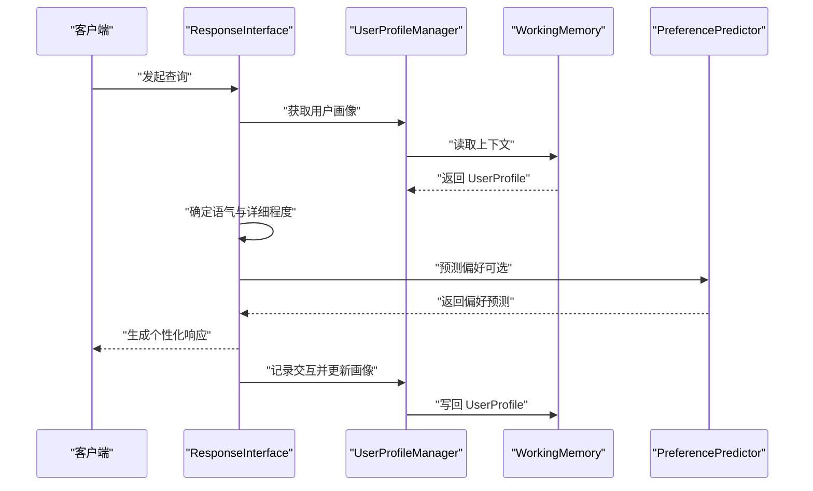
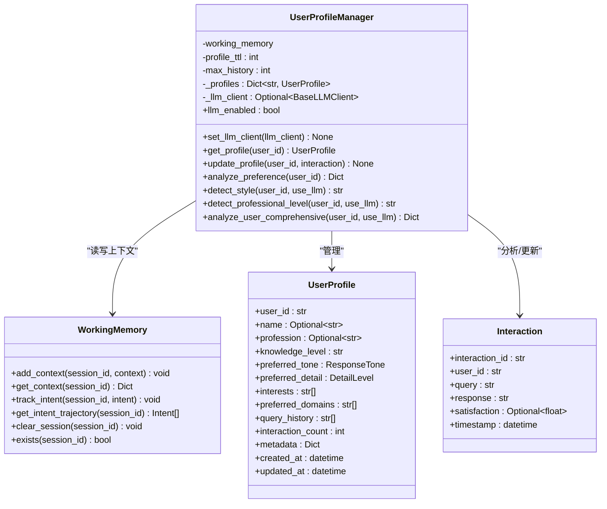
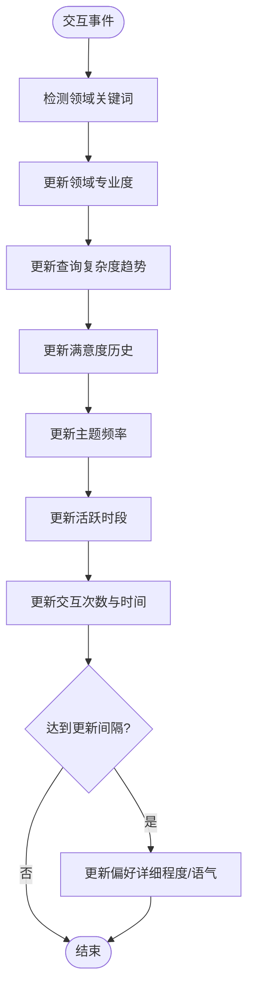
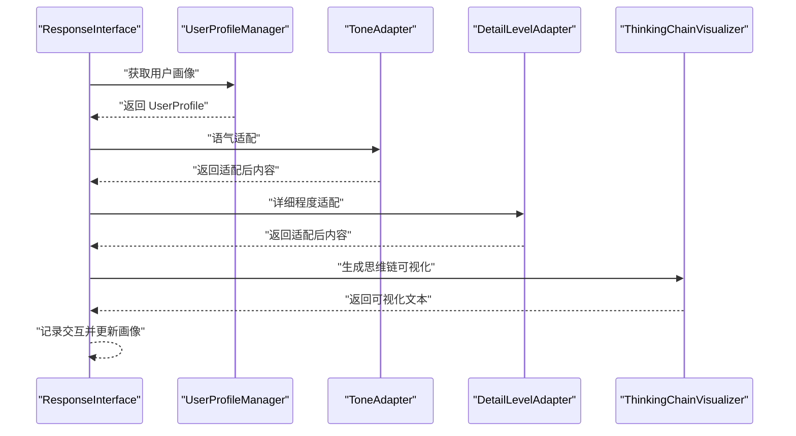
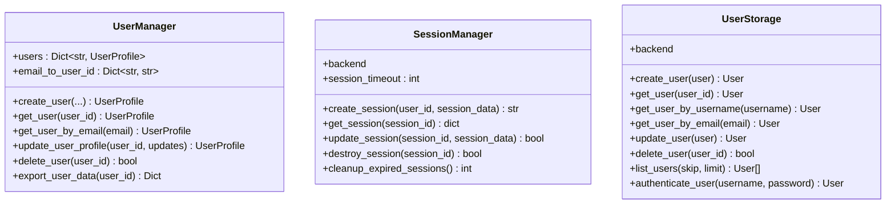
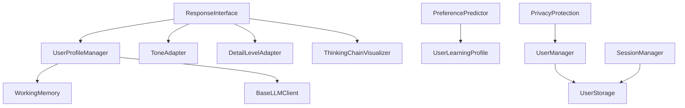

# 用户画像管理器

<cite>
**本文引用的文件**
- [src/response/profile_manager.py](file://src/response/profile_manager.py)
- [src/response/models.py](file://src/response/models.py)
- [src/response/interface.py](file://src/response/interface.py)
- [src/response/detail_adapter.py](file://src/response/detail_adapter.py)
- [src/response/tone_adapter.py](file://src/response/tone_adapter.py)
- [src/response/visualizer.py](file://src/response/visualizer.py)
- [src/memory/working_memory.py](file://src/memory/working_memory.py)
- [src/adaptive/preference_predictor.py](file://src/adaptive/preference_predictor.py)
- [src/adaptive/models.py](file://src/adaptive/models.py)
- [src/core/protocols.py](file://src/core/protocols.py)
- [src/user/models.py](file://src/user/models.py)
- [src/user/manager.py](file://src/user/manager.py)
- [src/security/storage.py](file://src/security/storage.py)
- [src/user/permissions.py](file://src/user/permissions.py)
- [wiki/wiki/交互层模块/用户画像管理.md](file://wiki/wiki/交互层模块/用户画像管理.md)
</cite>

## 目录
1. [简介](#简介)
2. [项目结构](#项目结构)
3. [核心组件](#核心组件)
4. [架构总览](#架构总览)
5. [详细组件分析](#详细组件分析)
6. [依赖关系分析](#依赖关系分析)
7. [性能考虑](#性能考虑)
8. [故障排查指南](#故障排查指南)
9. [结论](#结论)
10. [附录](#附录)

## 简介
本文件面向用户画像管理器组件，系统化阐述 UserProfile、Interaction 等核心实体的定义与关系，以及用户偏好建模、知识水平评估与个性化推荐机制。文档覆盖用户行为追踪、偏好分析与画像更新的实现原理，包含用户ID管理、会话状态维护与隐私保护的技术方案，并提供画像数据结构示例、分析算法与配置管理指南。

## 项目结构
用户画像管理相关代码主要分布在以下模块：
- 响应层用户画像管理：UserProfileManager 负责用户画像的读取、更新、偏好分析与风格/专业水平检测，支持 LLM 增强模式
- 数据模型：Interaction 与 UserProfile 定义了交互记录与用户画像的数据结构
- 响应接口：ResponseInterface 集成 UserProfileManager，实现情境自适应生成和个性化响应
- 适配器：ToneAdapter 和 DetailLevelAdapter 提供语气和详细程度的个性化适配
- 可视化：ThinkingChainVisualizer 展示思维链可视化
- 记忆层：WorkingMemory 提供 L1 工作记忆，作为用户画像的临时存储与上下文承载
- 自适应学习：PreferencePredictor 提供更丰富的用户偏好预测与画像更新逻辑
- 示例与仪表盘：example_usage.py 展示调用链路；dashboard 提供 Profile 的创建、激活、复制、导出与删除等操作

**图表来源**
- [src/response/profile_manager.py:20-505](file://src/response/profile_manager.py#L20-L505)
- [src/response/interface.py:20-232](file://src/response/interface.py#L20-L232)
- [src/memory/working_memory.py:11-120](file://src/memory/working_memory.py#L11-L120)
- [src/adaptive/preference_predictor.py:21-426](file://src/adaptive/preference_predictor.py#L21-L426)
- [src/user/manager.py:22-422](file://src/user/manager.py#L22-L422)
- [src/security/storage.py:13-209](file://src/security/storage.py#L13-L209)

**章节来源**
- [src/response/profile_manager.py:115-174](file://src/response/profile_manager.py#L115-L174)
- [src/response/models.py:13-31](file://src/response/models.py#L13-L31)
- [src/response/interface.py:59-140](file://src/response/interface.py#L59-L140)
- [src/memory/working_memory.py:36-95](file://src/memory/working_memory.py#L36-L95)
- [src/adaptive/preference_predictor.py:58-124](file://src/adaptive/preference_predictor.py#L58-L124)
- [src/user/manager.py:22-147](file://src/user/manager.py#L22-L147)
- [src/security/storage.py:145-204](file://src/security/storage.py#L145-L204)

## 核心组件
- UserProfileManager：负责用户画像的获取、更新、偏好分析与风格/专业水平检测，支持 LLM 增强模式与规则退化模式
- WorkingMemory：提供 L1 工作记忆，存储会话上下文与用户意图轨迹，支持 TTL 与会话清理
- PreferencePredictor：基于交互历史预测用户偏好，更新详细程度与语气偏好，支持反馈驱动的调整
- ResponseInterface：集成 UserProfileManager，实现情境自适应生成与个性化响应
- UserManagement：提供用户创建、更新、删除与数据导出能力，遵循隐私保护与数据可携带权
- SessionManager：提供会话创建、获取、更新与销毁，支持会话超时与过期清理

**章节来源**
- [src/response/profile_manager.py:20-505](file://src/response/profile_manager.py#L20-L505)
- [src/memory/working_memory.py:11-120](file://src/memory/working_memory.py#L11-L120)
- [src/adaptive/preference_predictor.py:21-426](file://src/adaptive/preference_predictor.py#L21-L426)
- [src/response/interface.py:20-232](file://src/response/interface.py#L20-L232)
- [src/user/manager.py:22-147](file://src/user/manager.py#L22-L147)
- [src/security/storage.py:145-204](file://src/security/storage.py#L145-L204)

## 架构总览
用户画像管理的整体流程如下：
- 交互发生后，系统记录 Interaction
- UserProfileManager 从 WorkingMemory 获取/创建 UserProfile
- 更新查询历史、时间戳与满意度（预留扩展点）
- 将 UserProfile 写回 WorkingMemory，以供后续会话复用
- ResponseInterface 使用 UserProfileManager 进行情境自适应生成
- PreferencePredictor 基于交互历史与领域检测，更新用户画像并预测偏好
- Dashboard 提供 Profile 的创建、激活、复制、导出与删除等管理能力

**图表来源**
- [src/response/interface.py:59-140](file://src/response/interface.py#L59-L140)
- [src/response/profile_manager.py:115-174](file://src/response/profile_manager.py#L115-L174)
- [src/memory/working_memory.py:36-60](file://src/memory/working_memory.py#L36-L60)
- [src/adaptive/preference_predictor.py:174-223](file://src/adaptive/preference_predictor.py#L174-L223)

**章节来源**
- [src/response/interface.py:59-140](file://src/response/interface.py#L59-L140)
- [src/response/profile_manager.py:115-174](file://src/response/profile_manager.py#L115-L174)
- [src/adaptive/preference_predictor.py:174-223](file://src/adaptive/preference_predictor.py#L174-L223)

## 详细组件分析

### 用户画像管理器（UserProfileManager）
- 职责
  - 获取与缓存用户画像
  - 更新查询历史与元数据
  - 基于规则与 LLM 检测用户风格与专业水平
  - 综合分析用户偏好并返回结果
- 关键算法
  - 风格检测：基于正则模式与查询长度阈值的规则检测，支持 LLM 增强
  - 专业水平检测：基于关键词权重与查询复杂度的规则检测，支持 LLM 增强
  - 偏好分析：统计查询关键词频次，返回前 N 热门关键词与交互总数
- 数据结构
  - UserProfile：包含用户标识、知识水平、偏好语气、详细程度、兴趣与领域、查询历史、元数据与时间戳
  - Interaction：包含交互标识、用户标识、查询、响应、满意度与时间戳

**图表来源**
- [src/response/profile_manager.py:20-505](file://src/response/profile_manager.py#L20-L505)
- [src/memory/working_memory.py:11-120](file://src/memory/working_memory.py#L11-L120)
- [src/core/protocols.py:282-298](file://src/core/protocols.py#L282-L298)
- [src/response/models.py:13-31](file://src/response/models.py#L13-L31)

**章节来源**
- [src/response/profile_manager.py:20-505](file://src/response/profile_manager.py#L20-L505)
- [src/core/protocols.py:282-298](file://src/core/protocols.py#L282-L298)
- [src/response/models.py:13-31](file://src/response/models.py#L13-L31)

### 偏好预测与画像更新（PreferencePredictor）
- 职责
  - 基于交互历史更新用户学习画像
  - 预测用户偏好（详细程度、语气、兴趣领域）
  - 根据反馈调整偏好模型
  - 估算用户专业度与查询复杂度
- 关键算法
  - 领域检测：基于关键词映射识别查询涉及的领域
  - 专业度估计：综合领域专业度与查询复杂度趋势
  - 偏好更新：基于查询复杂度趋势与满意度历史更新详细程度与语气偏好
  - 反馈驱动：根据用户显式/隐式反馈调整偏好设置
- 数据结构
  - UserLearningProfile：包含领域专业度、详细程度偏好、语气偏好、查询复杂度趋势、满意度历史、活跃时段、主题频率等

**图表来源**
- [src/adaptive/preference_predictor.py:64-124](file://src/adaptive/preference_predictor.py#L64-L124)
- [src/adaptive/preference_predictor.py:151-173](file://src/adaptive/preference_predictor.py#L151-L173)
- [src/adaptive/models.py:124-159](file://src/adaptive/models.py#L124-L159)

**章节来源**
- [src/adaptive/preference_predictor.py:64-124](file://src/adaptive/preference_predictor.py#L64-L124)
- [src/adaptive/preference_predictor.py:151-173](file://src/adaptive/preference_predictor.py#L151-L173)
- [src/adaptive/models.py:124-159](file://src/adaptive/models.py#L124-L159)

### 响应接口与个性化适配（ResponseInterface）
- 职责
  - 基于用户画像与精炼结果生成个性化响应
  - 通过适配器调整语气与详细程度
  - 生成思维链可视化
- 关键流程
  - 获取用户画像并确定语气与详细程度
  - 应用语气与详细程度适配
  - 生成思维链可视化
  - 记录交互并更新用户画像

**图表来源**
- [src/response/interface.py:59-140](file://src/response/interface.py#L59-L140)
- [src/response/tone_adapter.py:8-138](file://src/response/tone_adapter.py#L8-L138)
- [src/response/detail_adapter.py:18-417](file://src/response/detail_adapter.py#L18-L417)
- [src/response/visualizer.py:9-150](file://src/response/visualizer.py#L9-L150)

**章节来源**
- [src/response/interface.py:59-140](file://src/response/interface.py#L59-L140)

### 用户ID管理与会话状态维护
- 用户ID管理
  - UserManager 提供用户创建、更新、删除与数据导出能力
  - 支持通过用户名与邮箱检索用户
  - 遵循隐私保护与数据可携带权
- 会话状态维护
  - SessionManager 提供会话创建、获取、更新与销毁
  - 支持会话超时与过期清理
  - UserStorage 提供用户数据的持久化存储与索引管理

**图表来源**
- [src/user/manager.py:22-147](file://src/user/manager.py#L22-L147)
- [src/security/storage.py:145-204](file://src/security/storage.py#L145-L204)
- [src/security/storage.py:13-143](file://src/security/storage.py#L13-L143)

**章节来源**
- [src/user/manager.py:22-147](file://src/user/manager.py#L22-L147)
- [src/security/storage.py:145-204](file://src/security/storage.py#L145-L204)
- [src/security/storage.py:13-143](file://src/security/storage.py#L13-L143)

### 隐私保护与数据治理
- 隐私保护
  - PrivacyProtection 提供个人数据加解密、查询内容匿名化与过期数据清理能力
  - 支持基于保留期限的数据保留策略
- 数据治理
  - 用户偏好与画像数据遵循最小化原则
  - 支持用户删除与数据导出请求

**章节来源**
- [src/user/permissions.py:314-356](file://src/user/permissions.py#L314-L356)

## 依赖关系分析
- 组件耦合
  - ResponseInterface 依赖 UserProfileManager 与适配器组件
  - UserProfileManager 依赖 WorkingMemory 与 LLM 客户端（可选）
  - PreferencePredictor 依赖自适应学习配置与用户学习画像
  - UserManager 与 SessionManager/Storage 共同构成用户与会话管理
- 外部依赖
  - LLM 客户端接口用于高级检测与增强
  - 记忆层后端用于会话上下文与意图轨迹存储

**图表来源**
- [src/response/interface.py:51-54](file://src/response/interface.py#L51-L54)
- [src/response/profile_manager.py:96-96](file://src/response/profile_manager.py#L96-L96)
- [src/adaptive/preference_predictor.py:55-56](file://src/adaptive/preference_predictor.py#L55-L56)
- [src/user/manager.py:26-26](file://src/user/manager.py#L26-L26)
- [src/security/storage.py:148-149](file://src/security/storage.py#L148-L149)

**章节来源**
- [src/response/interface.py:51-54](file://src/response/interface.py#L51-L54)
- [src/response/profile_manager.py:96-96](file://src/response/profile_manager.py#L96-L96)
- [src/adaptive/preference_predictor.py:55-56](file://src/adaptive/preference_predictor.py#L55-L56)
- [src/user/manager.py:26-26](file://src/user/manager.py#L26-L26)
- [src/security/storage.py:148-149](file://src/security/storage.py#L148-L149)

## 性能考虑
- 缓存与存储
  - UserProfileManager 内置画像缓存，减少重复读取
  - WorkingMemory 支持 TTL 与会话清理，避免内存膨胀
- 算法复杂度
  - 偏好分析采用词频统计与排序，时间复杂度与查询历史长度线性相关
  - 专业水平与风格检测基于规则匹配与阈值判断，时间复杂度较低
- LLM 调用
  - 建议控制 LLM 调用频率与批量处理，避免影响响应延迟
  - 提供规则退化模式，保证在 LLM 不可用时仍可运行

## 故障排查指南
- 画像为空或默认值
  - 检查 WorkingMemory 是否正确写入 UserProfile
  - 确认用户 ID 是否与会话 ID 对应
- LLM 检测失败
  - 检查 LLM 客户端初始化与可用性
  - 查看异常日志并确认提示词格式
- 偏好预测不准确
  - 检查交互历史是否足够
  - 确认反馈信号是否正确传递
- 会话状态异常
  - 检查 SessionManager 的超时设置与过期清理
  - 确认会话键值与用户 ID 的映射关系

**章节来源**
- [src/response/profile_manager.py:329-331](file://src/response/profile_manager.py#L329-L331)
- [src/adaptive/preference_predictor.py:264-268](file://src/adaptive/preference_predictor.py#L264-L268)
- [src/security/storage.py:167-193](file://src/security/storage.py#L167-L193)

## 结论
用户画像管理模块通过 UserProfileManager 与 WorkingMemory 实现了现代化的动态画像管理，支持 LLM 增强模式和规则退化模式，能够智能检测用户的专业水平和沟通风格偏好。通过 ResponseInterface 集成，系统实现了情境自适应生成和个性化响应。结合 ToneAdapter、DetailLevelAdapter 和 ThinkingChainVisualizer，提供了完整的个性化体验。PreferencePredictor 进一步增强了画像的准确性。结合 UserManager、SessionManager 与隐私保护机制，系统实现了从配置到执行再到可视化的完整闭环。建议后续完善检测算法、引入更丰富的偏好特征与反馈机制，并持续优化 LLM 调用成本与历史长度管理以平衡性能与准确性。

## 附录

### 用户画像质量评估指标与个性化推荐效果量化
- 个性化准确度
  - 基于用户满意度历史计算：对每个用户的满意度序列求均值得到个体准确度，再对全体用户取平均
- 专家度分布与语气分布
  - 基于领域专业度估计与偏好语气统计，得到整体分布，用于评估策略有效性
- 交互趋势与活跃度
  - 通过活跃时段统计与交互次数趋势，评估用户画像的时效性与稳定性
- LLM 检测准确性
  - 通过对比规则检测与 LLM 检测的结果一致性，评估 LLM 增强模式的有效性

**章节来源**
- [src/adaptive/preference_predictor.py:403-425](file://src/adaptive/preference_predictor.py#L403-L425)
- [src/adaptive/preference_predictor.py:352-401](file://src/adaptive/preference_predictor.py#L352-L401)
- [src/response/profile_manager.py:285-332](file://src/response/profile_manager.py#L285-L332)
- [src/response/profile_manager.py:421-467](file://src/response/profile_manager.py#L421-L467)