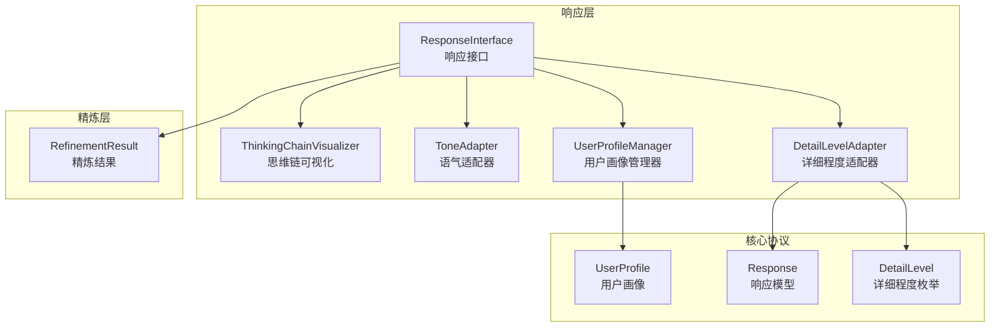
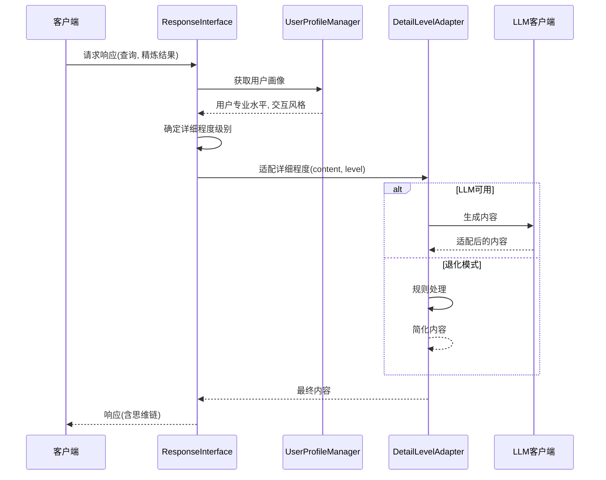
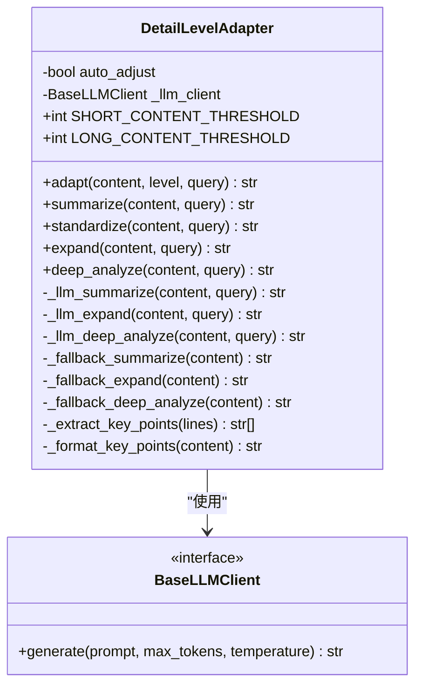
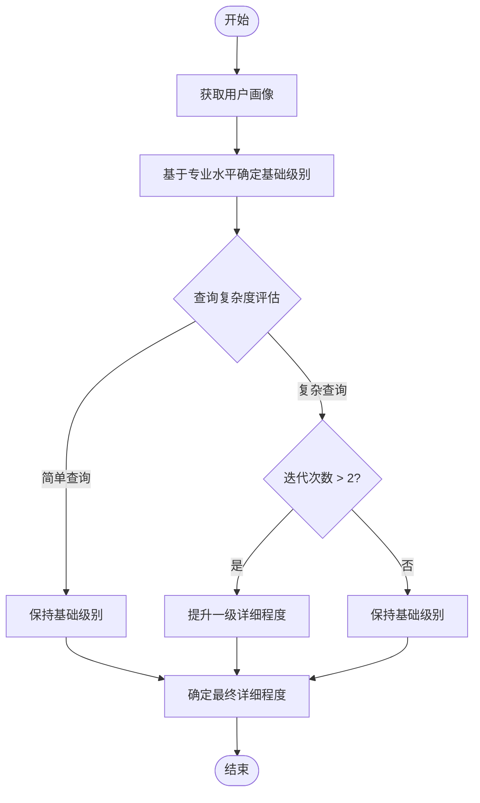
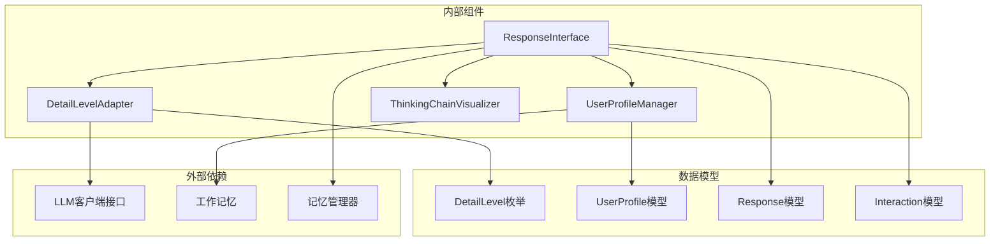

# 详细程度控制器

<cite>
**本文引用的文件**
- [src/response/detail_adapter.py](file://src/response/detail_adapter.py)
- [src/response/interface.py](file://src/response/interface.py)
- [src/response/profile_manager.py](file://src/response/profile_manager.py)
- [src/response/models.py](file://src/response/models.py)
- [src/core/protocols.py](file://src/core/protocols.py)
- [src/adaptive/preference_predictor.py](file://src/adaptive/preference_predictor.py)
- [src/adaptive/config.py](file://src/adaptive/config.py)
- [wiki/核心架构设计/五层认知架构/交互层 (L5)/详细程度控制器.md](file://wiki/核心架构设计/五层认知架构/交互层 (L5)/详细程度控制器.md)
- [wiki/交互层模块/交互层模块.md](file://wiki/交互层模块/交互层模块.md)
</cite>

## 目录
1. [简介](#简介)
2. [项目结构](#项目结构)
3. [核心组件](#核心组件)
4. [架构总览](#架构总览)
5. [详细组件分析](#详细组件分析)
6. [依赖关系分析](#依赖关系分析)
7. [性能考量](#性能考量)
8. [故障排除指南](#故障排除指南)
9. [结论](#结论)
10. [附录](#附录)

## 简介
详细程度控制器是交互层响应系统的核心模块，负责根据用户画像、查询复杂度和迭代次数等因素，动态选择合适的详细程度级别，并在LLM增强模式与规则退化模式之间无缝切换。该控制器提供四级详细程度调节机制：简要概述（Level 1）、标准回答（Level 2）、详细解释（Level 3）与深度分析（Level 4），并通过内容压缩与扩展技术实现信息筛选、解释深化与示例补充，满足不同用户群体的需求。

## 项目结构
详细程度控制器位于响应层，与用户画像管理、响应接口、语气适配器、思维链可视化等组件协同工作，形成从用户需求到内容输出的完整适配流程。

**图表来源**
- [src/response/interface.py:20-58](file://src/response/interface.py#L20-L58)
- [src/response/detail_adapter.py:18-29](file://src/response/detail_adapter.py#L18-L29)
- [src/response/profile_manager.py:20-31](file://src/response/profile_manager.py#L20-L31)

**章节来源**
- [src/response/__init__.py:1-28](file://src/response/__init__.py#L1-L28)
- [src/response/interface.py:20-58](file://src/response/interface.py#L20-L58)

## 核心组件
- DetailLevelAdapter类：负责具体的详细程度适配逻辑，支持四种详细程度级别（Level 1-4），并提供LLM增强模式与规则退化模式。
- UserProfileManager类：分析用户专业水平和交互风格，为详细程度选择提供依据。
- ResponseInterface类：协调整个详细程度控制流程，实现智能决策与内容适配。

**章节来源**
- [src/response/detail_adapter.py:18-94](file://src/response/detail_adapter.py#L18-L94)
- [src/response/profile_manager.py:20-141](file://src/response/profile_manager.py#L20-L141)
- [src/response/interface.py:20-173](file://src/response/interface.py#L20-L173)

## 架构总览
详细程度控制器采用分层架构设计，实现了从用户需求到内容输出的完整适配流程。响应接口负责获取用户画像、确定详细程度级别、执行内容适配与思维链可视化，并在LLM可用时调用详细程度适配器生成内容，在不可用时回退到规则处理模式。

**图表来源**
- [src/response/interface.py:59-140](file://src/response/interface.py#L59-L140)
- [src/response/detail_adapter.py:64-94](file://src/response/detail_adapter.py#L64-L94)

## 详细组件分析

### DetailLevelAdapter类详解
DetailLevelAdapter是详细程度控制器的核心实现，提供了完整的四层级内容适配能力。其类结构设计如下：

**图表来源**
- [src/response/detail_adapter.py:18-417](file://src/response/detail_adapter.py#L18-L417)

#### 四级详细程度特点
- Level 1：简洁摘要（1-2句话）
  - 适用场景：快速信息获取、移动端浏览、紧急查询
  - 特点：高度概括，去除冗余信息，保留核心要点
  - 实现策略：内容长度阈值判断 + LLM摘要生成 + 退化模式处理
- Level 2：标准回答（1段话 + 要点）
  - 适用场景：日常咨询、一般性问题、平衡信息密度
  - 特点：完整但不过度详细，包含关键要点列表
  - 实现策略：内容分析 + 要点提取 + 结构化组织
- Level 3：详细解释（多段落 + 案例）
  - 适用场景：学习场景、需要理解背景、复杂概念解释
  - 特点：包含背景说明、具体示例、注意事项
  - 实现策略：LLM扩展 + 结构化框架 + 补充说明
- Level 4：深度分析（完整报告）
  - 适用场景：研究分析、决策支持、学术探讨
  - 特点：多角度分析、潜在问题识别、延伸思考
  - 实现策略：完整分析框架 + 多维度思考 + 结构化报告

#### 决策流程
详细程度确定算法基于用户专业水平映射与查询复杂度评估，结合迭代次数影响因子，形成动态调整机制。

**图表来源**
- [src/response/interface.py:142-173](file://src/response/interface.py#L142-L173)

算法核心要素：
- 用户专业水平映射：初学者→Level 3，中级→Level 2，专家→Level 1
- 查询复杂度评估：基于精炼迭代次数和查询长度
- 迭代次数影响因子：每次迭代增加0.5级详细程度，最多+1级

**章节来源**
- [src/response/detail_adapter.py:95-417](file://src/response/detail_adapter.py#L95-L417)
- [src/response/interface.py:142-173](file://src/response/interface.py#L142-L173)

### UserProfileManager类分析
UserProfileManager负责用户画像分析和偏好检测，支持专业水平检测与交互风格偏好分析，并提供LLM增强模式与规则退化模式。

- 专业水平检测：基于关键词匹配与查询复杂度，支持初学者、中级用户、专家级别
- 风格偏好分析：基于查询历史与正则模式，支持简洁、详细、技术性、通俗化风格
- 查询历史跟踪：维护用户交互历史，支持TTL缓存与最大历史记录数

### ResponseInterface类分析
ResponseInterface协调整个详细程度控制流程，实现智能决策与内容适配：
- 基于用户画像的详细程度映射
- 查询复杂度评估
- 迭代次数影响因子
- 语气适配与思维链可视化

**章节来源**
- [src/response/interface.py:20-232](file://src/response/interface.py#L20-L232)

## 依赖关系分析
详细程度控制器与其他系统组件的依赖关系如下：

**图表来源**
- [src/response/detail_adapter.py:12-16](file://src/response/detail_adapter.py#L12-L16)
- [src/response/profile_manager.py:14-17](file://src/response/profile_manager.py#L14-L17)
- [src/response/interface.py:7-14](file://src/response/interface.py#L7-L14)

**章节来源**
- [src/core/protocols.py:58-64](file://src/core/protocols.py#L58-L64)
- [src/response/models.py:13-31](file://src/response/models.py#L13-L31)

## 性能考量
详细程度控制器在性能方面具有以下特点：
- Level 1：O(n) - 简单字符串处理
- Level 2：O(n) - 内容分析 + 要点提取
- Level 3：O(n log n) - LLM调用 + 内容扩展
- Level 4：O(n log n) - LLM调用 + 深度分析

内存使用：
- 内容适配：按需处理，内存占用与内容长度线性相关
- 用户画像：缓存机制，支持TTL过期
- LLM调用：异步处理，避免阻塞主线程

优化策略：
- 阈值优化：合理设置内容长度阈值，减少不必要的LLM调用
- 缓存机制：用户画像和LLM响应结果缓存
- 降级处理：LLM不可用时的规则处理模式

## 故障排除指南
常见问题及解决方案：
- LLM调用失败
  - 症状：详细程度适配器抛出异常或返回错误内容
  - 解决方案：检查LLM客户端连接状态、验证API密钥和权限、实施退化模式处理
- 用户画像为空
  - 症状：专业水平检测返回默认值
  - 解决方案：确认用户ID正确传递、检查工作记忆配置、验证查询历史记录
- 详细程度不匹配
  - 症状：用户期望与实际输出不符
  - 解决方案：调整默认详细程度参数、优化专业水平检测算法、增加用户反馈机制

**章节来源**
- [src/response/detail_adapter.py:142-144](file://src/response/detail_adapter.py#L142-L144)
- [src/response/profile_manager.py:329-331](file://src/response/profile_manager.py#L329-L331)

## 结论
详细程度控制器通过四级详细程度调节机制与智能判断算法，实现了对不同用户群体需求的精准适配。其LLM增强模式与规则退化模式相结合的设计，既保证了高质量内容生成的可能性，又确保了在资源受限环境下的稳定性。通过用户画像管理与响应接口的协同，系统能够根据用户专业水平、查询复杂度与迭代次数等因素，动态调整详细程度，提供个性化的响应体验。

## 附录

### 不同用户群体的详细程度配置指南
- 初学者（Beginner）
  - 适用场景：学习入门、基础概念理解
  - 推荐级别：Level 3（详细解释）
  - 配置建议：开启LLM增强模式，使用友好语气；关注示例补充与背景说明
- 中级用户（Intermediate）
  - 适用场景：日常咨询、实践应用、平衡信息密度
  - 推荐级别：Level 2（标准回答）
  - 配置建议：平衡详细程度与信息密度；提供关键要点列表
- 专家（Expert）
  - 适用场景：快速信息获取、紧急查询、高层决策
  - 推荐级别：Level 1（简洁摘要）
  - 配置建议：使用简洁语气；减少冗余信息，突出核心要点
- 研究人员/分析师
  - 适用场景：深度分析、决策支持、学术探讨
  - 推荐级别：Level 4（深度分析）
  - 配置建议：启用完整分析框架；提供多角度分析与延伸思考

### 详细程度控制的效果评估与质量保证措施
- 效果评估指标
  - 用户满意度：通过显式/隐式反馈收集，计算个性化准确度
  - 响应质量：基于置信度、迭代次数与幻觉检测结果
  - 性能指标：响应时间、内存使用与LLM调用成功率
- 质量保证措施
  - 自适应学习：基于用户交互历史预测偏好，实现越用越智能
  - 反馈闭环：收集用户显式/隐式反馈，形成学习闭环
  - 集体智慧：从多用户交互中提取共性智慧，优化系统表现
  - 配置管理：提供积极学习、保守学习与最小配置三种模式，适应不同场景需求

**章节来源**
- [src/adaptive/preference_predictor.py:174-224](file://src/adaptive/preference_predictor.py#L174-L224)
- [src/adaptive/config.py:86-155](file://src/adaptive/config.py#L86-L155)