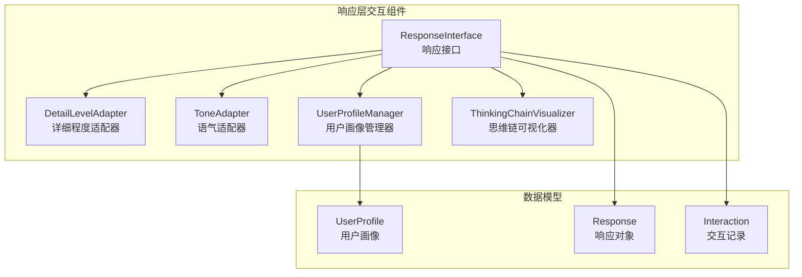
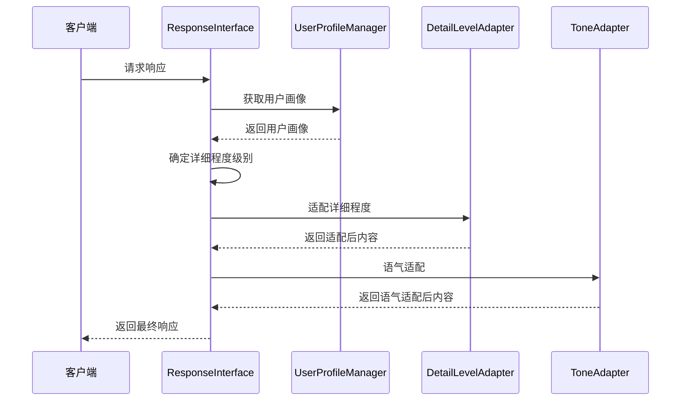
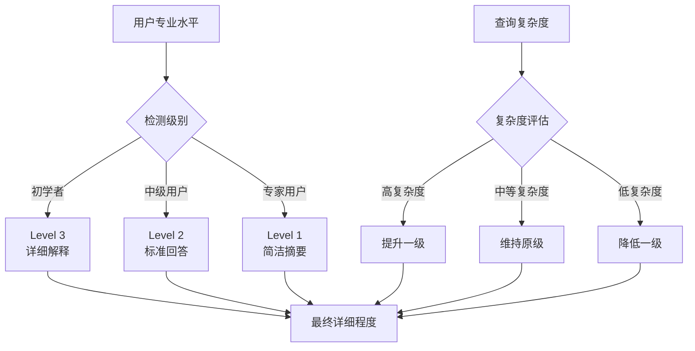
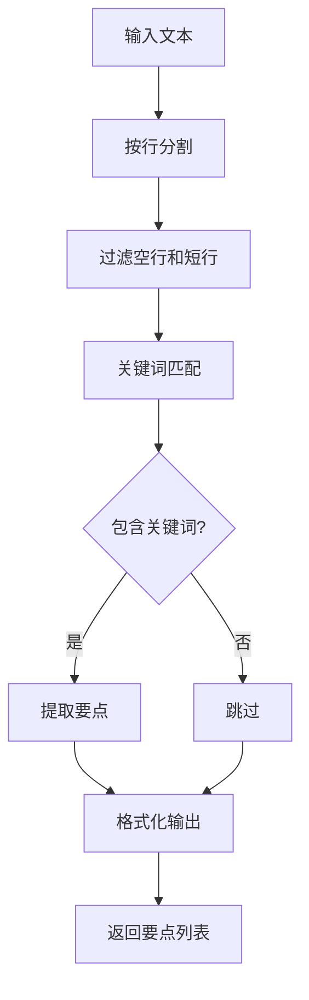
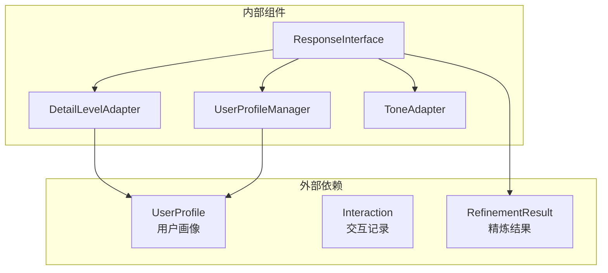
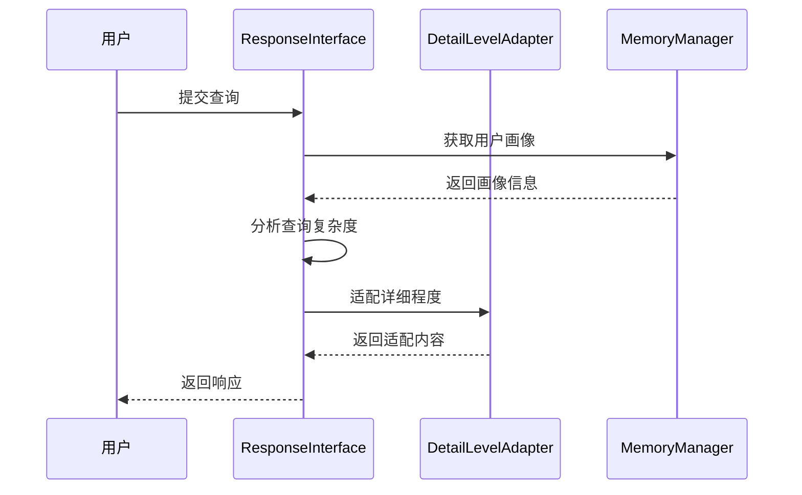

# 详细程度适配器

<cite>
**本文档引用的文件**
- [detail_adapter.py](file://src/response/detail_adapter.py)
- [interface.py](file://src/response/interface.py)
- [profile_manager.py](file://src/response/profile_manager.py)
- [models.py](file://src/response/models.py)
- [tone_adapter.py](file://src/response/tone_adapter.py)
- [example_usage.py](file://example/example_usage.py)
- [design.md](file://design/design.md)
- [README.md](file://README.md)
</cite>

## 目录
1. [简介](#简介)
2. [项目结构](#项目结构)
3. [核心组件](#核心组件)
4. [架构概览](#架构概览)
5. [详细组件分析](#详细组件分析)
6. [依赖关系分析](#依赖关系分析)
7. [性能考虑](#性能考虑)
8. [故障排除指南](#故障排除指南)
9. [结论](#结论)
10. [附录](#附录)

## 简介

详细程度适配器是 NecoRAG 框架交互层的重要组成部分，负责根据用户画像和查询复杂度动态调整输出内容的详细程度。该模块实现了从简洁摘要到深度分析的四级详细程度适配，为用户提供个性化的信息呈现体验。

NecoRAG 框架采用五层认知架构设计，详细程度适配器作为交互层的核心组件，与用户画像管理器、语气适配器等组件协同工作，实现情境自适应的智能响应生成。

## 项目结构

详细程度适配器模块位于响应层的交互组件中，与用户画像管理、语气适配等功能模块共同构成完整的交互适配体系。

**图表来源**
- [interface.py:16-54](file://src/response/interface.py#L16-L54)
- [detail_adapter.py:8-26](file://src/response/detail_adapter.py#L8-L26)
- [profile_manager.py:10-40](file://src/response/profile_manager.py#L10-L40)

**章节来源**
- [README.md:333-377](file://README.md#L333-L377)
- [design.md:711-721](file://design.md#L711-L721)

## 核心组件

详细程度适配器模块包含以下核心组件：

### DetailLevelAdapter 类
- **功能**：根据指定级别对内容进行详细程度适配
- **支持级别**：1-4级详细程度
- **适配策略**：简洁摘要、标准回答、详细解释、深度分析

### 用户画像管理器
- **功能**：管理用户画像信息，跟踪用户偏好和交互历史
- **专业水平检测**：识别用户的学术或专业水平
- **交互风格分析**：分析用户的交互偏好

### 响应接口
- **功能**：协调各个适配器组件，生成最终响应
- **详细程度确定**：基于用户画像和查询复杂度确定详细程度级别
- **思维链生成**：创建可解释性的思维链可视化

**章节来源**
- [detail_adapter.py:8-56](file://src/response/detail_adapter.py#L8-L56)
- [profile_manager.py:10-165](file://src/response/profile_manager.py#L10-L165)
- [interface.py:16-133](file://src/response/interface.py#L16-L133)

## 架构概览

详细程度适配器在整个 NecoRAG 框架中扮演着关键角色，通过与用户画像管理器的协作，实现个性化的详细程度控制。

**图表来源**
- [interface.py:55-133](file://src/response/interface.py#L55-L133)
- [detail_adapter.py:28-56](file://src/response/detail_adapter.py#L28-L56)
- [profile_manager.py:41-67](file://src/response/profile_manager.py#L41-L67)

## 详细组件分析

### 详细程度级别定义

详细程度适配器定义了四个级别的详细程度，每个级别都有明确的内容特点和适用场景：

#### 级别1：简洁摘要
- **内容特点**：1-2句话的精炼总结
- **适用场景**：快速浏览、时间紧迫、高层决策
- **实现策略**：提取原文第一句，确保信息密度最大化

#### 级别2：标准回答
- **内容特点**：完整段落 + 关键要点列表
- **适用场景**：日常咨询、一般性查询、平衡详细度需求
- **实现策略**：添加要点标记，突出核心信息

#### 级别3：详细解释
- **内容特点**：多段落内容 + 示例标注
- **适用场景**：学习场景、需要深入理解、教学目的
- **实现策略**：添加段落分隔和示例标记

#### 级别4：深度分析
- **内容特点**：完整报告结构
- **适用场景**：研究分析、专业讨论、正式场合
- **实现策略**：标准化报告格式，包含摘要、详细内容、关键要点、延伸思考

### 专业水平专业化适配机制

详细程度适配器通过用户画像中的专业水平字段实现差异化处理：

**图表来源**
- [interface.py:151-165](file://src/response/interface.py#L151-L165)

### 复杂查询场景下的自动提升算法

系统通过分析精炼代理的迭代次数来判断查询复杂度：

| 迭代次数 | 复杂度等级 | 详细程度调整 |
|---------|-----------|-------------|
| ≤ 1次 | 简单查询 | 不提升 |
| 2次 | 中等复杂度 | 保持不变 |
| > 2次 | 高复杂度 | 提升一级（最多提升两级） |

这种设计确保了复杂查询能够获得足够的详细程度，而简单查询不会被过度复杂化。

### 关键要点提取算法

详细程度适配器实现了智能的关键要点提取功能：

**图表来源**
- [detail_adapter.py:158-182](file://src/response/detail_adapter.py#L158-L182)

**章节来源**
- [detail_adapter.py:57-157](file://src/response/detail_adapter.py#L57-L157)
- [interface.py:134-165](file://src/response/interface.py#L134-L165)

## 依赖关系分析

详细程度适配器模块的依赖关系相对简单，主要依赖于响应层的数据模型和用户画像管理器：

**图表来源**
- [models.py:10-44](file://src/response/models.py#L10-L44)
- [interface.py:16-54](file://src/response/interface.py#L16-L54)

**章节来源**
- [models.py:10-53](file://src/response/models.py#L10-L53)
- [interface.py:16-54](file://src/response/interface.py#L16-L54)

## 性能考虑

详细程度适配器在设计时充分考虑了性能优化：

### 时间复杂度分析
- **简洁摘要**：O(n) - 基于句子分割的线性处理
- **标准回答**：O(n) - 包含要点提取的线性处理
- **详细解释**：O(n) - 段落处理和示例标注
- **深度分析**：O(n) - 标准化报告生成

### 空间复杂度分析
- 所有操作均为原地字符串处理，空间复杂度为 O(n)
- 关键要点提取使用列表存储，最大长度受输入文本限制

### 优化策略
- 使用高效的字符串分割和连接操作
- 避免不必要的中间变量创建
- 实现早期退出机制（如空文本快速返回）

## 故障排除指南

### 常见问题及解决方案

#### 问题1：详细程度级别超出范围
**症状**：输入级别小于1或大于4时的行为
**解决方案**：系统自动将级别规范化到1-4范围内

#### 问题2：用户画像缺失
**症状**：用户画像获取失败导致的适配异常
**解决方案**：自动创建默认用户画像，包含标准的专业水平和交互风格

#### 问题3：复杂查询适配不当
**症状**：高复杂度查询未获得足够详细程度
**解决方案**：检查精炼代理的迭代次数配置，确保正确传递复杂度信息

**章节来源**
- [detail_adapter.py:43-46](file://src/response/detail_adapter.py#L43-L46)
- [profile_manager.py:61-66](file://src/response/profile_manager.py#L61-L66)

## 结论

详细程度适配器模块通过精心设计的四级详细程度系统和智能化的专业水平适配机制，为 NecoRAG 框架提供了强大的情境自适应能力。该模块不仅实现了从简洁摘要到深度分析的完整覆盖，更重要的是通过用户画像和查询复杂度的综合分析，为不同类型的用户提供了个性化的信息呈现体验。

模块的设计体现了以下核心优势：
- **灵活性**：支持1-4级详细程度的动态调整
- **智能化**：基于用户画像和查询复杂度的自动适配
- **可扩展性**：为未来功能增强预留了充足的空间
- **性能优化**：高效的算法实现确保了良好的响应性能

## 附录

### 使用示例

详细程度适配器在完整的工作流程中发挥着重要作用：

**图表来源**
- [example_usage.py:176-216](file://example/example_usage.py#L176-L216)

### 配置选项

详细程度适配器支持以下配置选项：
- `auto_adjust`: 是否启用自动调整功能
- `default_detail_level`: 默认详细程度级别
- `professional_level`: 用户专业水平映射表