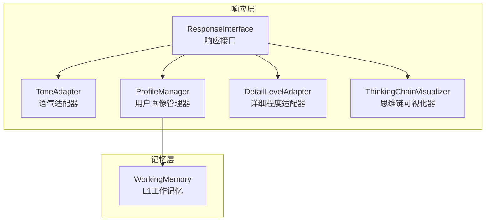
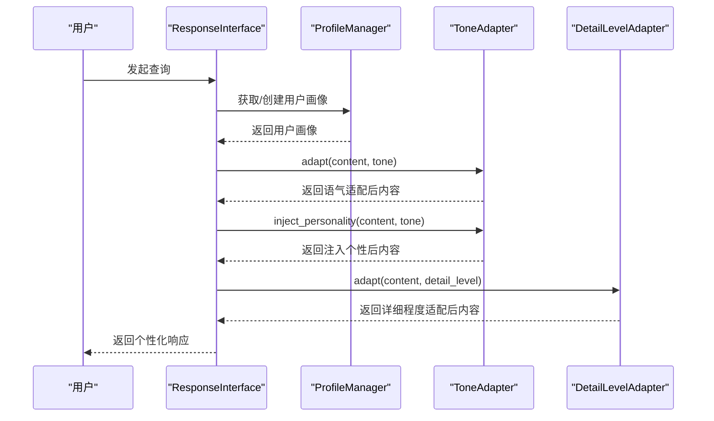
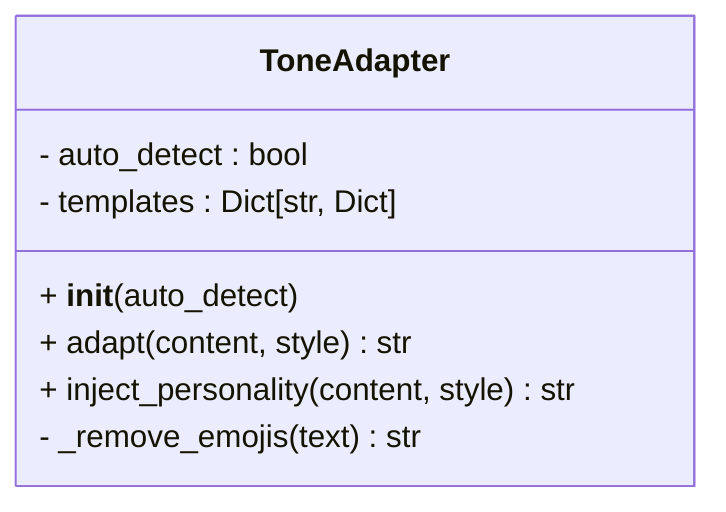
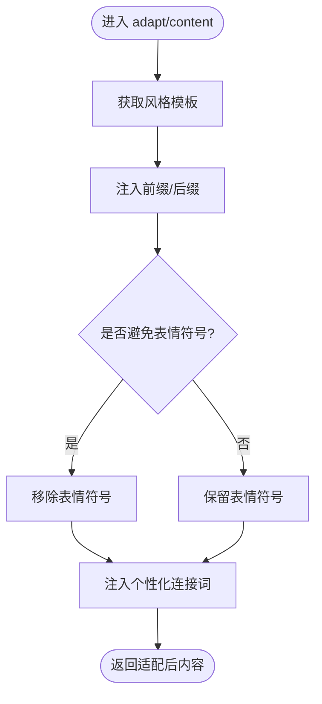
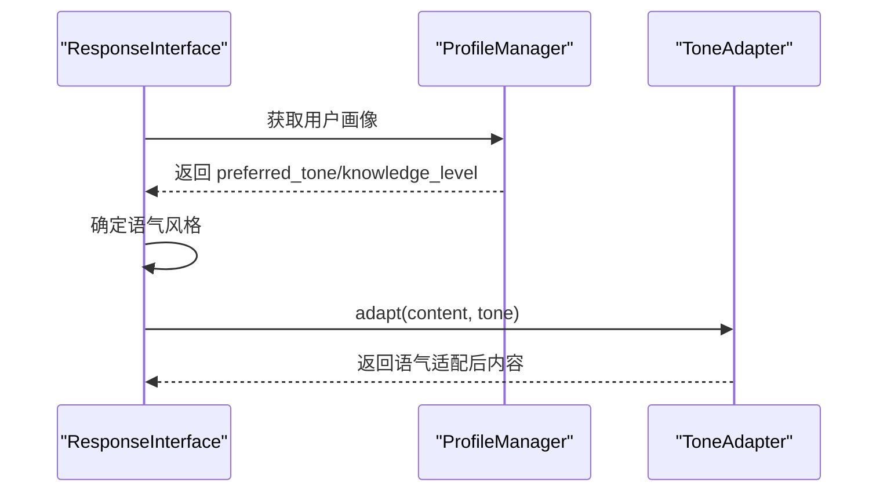
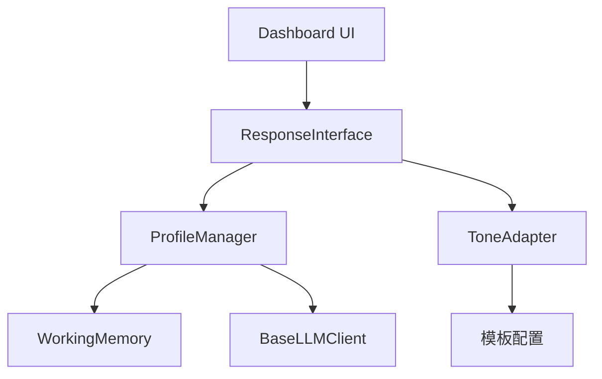

# 语气适配器

<cite>
**本文引用的文件**
- [src/response/tone_adapter.py](file://src/response/tone_adapter.py)
- [src/response/interface.py](file://src/response/interface.py)
- [src/response/profile_manager.py](file://src/response/profile_manager.py)
- [src/response/detail_adapter.py](file://src/response/detail_adapter.py)
- [src/response/models.py](file://src/response/models.py)
- [src/core/protocols.py](file://src/core/protocols.py)
- [src/dashboard/static/index.html](file://src/dashboard/static/index.html)
- [example/example_usage.py](file://example/example_usage.py)
- [wiki/wiki/交互层模块/用户画像管理.md](file://wiki/wiki/交互层模块/用户画像管理.md)
</cite>

## 目录
1. [简介](#简介)
2. [项目结构](#项目结构)
3. [核心组件](#核心组件)
4. [架构总览](#架构总览)
5. [详细组件分析](#详细组件分析)
6. [依赖分析](#依赖分析)
7. [性能考虑](#性能考虑)
8. [故障排查指南](#故障排查指南)
9. [结论](#结论)
10. [附录](#附录)

## 简介
本文件围绕语气适配器组件进行系统化说明，重点解释ToneAdapter类的设计与实现，阐述其如何基于用户画像与上下文动态选择合适的语气表达，包括正式、友好、幽默等预设语气风格的特征与应用场景。文档覆盖语气适配器的核心算法与实现原理，包括语气模板定义、转换规则与注入机制，并结合用户画像管理模块（ProfileManager）与响应接口（ResponseInterface）展示完整的自适应生成流程。此外，文档还提供语气强度调节、情感色彩控制与个性化定制的技术实现思路，包含配置选项与最佳实践指南。

## 项目结构
语气适配器位于响应层（Response Layer），与用户画像管理器（ProfileManager）、详细程度适配器（DetailLevelAdapter）共同构成情境自适应生成的核心组件。其在整体架构中的位置如下：

**图表来源**
- [src/response/tone_adapter.py:1-138](file://src/response/tone_adapter.py#L1-L138)
- [src/response/interface.py:1-232](file://src/response/interface.py#L1-L232)
- [src/response/profile_manager.py:1-505](file://src/response/profile_manager.py#L1-L505)
- [src/response/detail_adapter.py:1-417](file://src/response/detail_adapter.py#L1-L417)

**章节来源**
- [src/response/tone_adapter.py:1-138](file://src/response/tone_adapter.py#L1-L138)
- [src/response/interface.py:1-232](file://src/response/interface.py#L1-L232)
- [src/response/profile_manager.py:1-505](file://src/response/profile_manager.py#L1-L505)
- [src/response/detail_adapter.py:1-417](file://src/response/detail_adapter.py#L1-L417)

## 核心组件
- ToneAdapter：语气适配器，支持正式（formal）、友好（friendly）、幽默（humorous）等多种语气风格的个性化适配。通过模板化配置实现语气注入、连接词注入与表情符号控制。
- ProfileManager：用户画像管理器，负责用户画像的获取、更新、偏好分析与风格检测，支持规则检测与LLM增强检测两种模式，为语气适配提供上下文依据。
- ResponseInterface：响应接口，集成ProfileManager与ToneAdapter，实现情境自适应生成与个性化响应。
- DetailLevelAdapter：详细程度适配器，支持1-4级详细程度的个性化内容适配，与语气适配器协同工作。
- UserProfile：用户画像数据模型，包含用户标识、知识水平、偏好语气、查询历史等字段，驱动语气与详细程度的选择策略。
- ThinkingChainVisualizer：思维链可视化器，展示检索路径、证据来源与推理过程，增强响应的可解释性。

**章节来源**
- [src/response/tone_adapter.py:8-138](file://src/response/tone_adapter.py#L8-L138)
- [src/response/profile_manager.py:20-505](file://src/response/profile_manager.py#L20-L505)
- [src/response/interface.py:20-232](file://src/response/interface.py#L20-L232)
- [src/response/detail_adapter.py:18-417](file://src/response/detail_adapter.py#L18-L417)
- [src/response/models.py:13-31](file://src/response/models.py#L13-L31)
- [src/core/protocols.py:282-298](file://src/core/protocols.py#L282-L298)

## 架构总览
语气适配器在响应生成流程中的作用如下：
- 响应接口（ResponseInterface）根据用户画像（ProfileManager）确定语气风格与详细程度。
- 语气适配器（ToneAdapter）对原始内容进行语气注入与个性化连接词注入。
- 详细程度适配器（DetailLevelAdapter）对内容进行长度与结构的扩展或摘要。
- 思维链可视化器（ThinkingChainVisualizer）生成可解释性的思维链文本。

**图表来源**
- [src/response/interface.py:59-140](file://src/response/interface.py#L59-L140)
- [src/response/profile_manager.py:115-174](file://src/response/profile_manager.py#L115-L174)
- [src/response/tone_adapter.py:49-109](file://src/response/tone_adapter.py#L49-L109)
- [src/response/detail_adapter.py:64-94](file://src/response/detail_adapter.py#L64-L94)

**章节来源**
- [src/response/interface.py:59-140](file://src/response/interface.py#L59-L140)
- [src/response/profile_manager.py:115-174](file://src/response/profile_manager.py#L115-L174)
- [src/response/tone_adapter.py:49-109](file://src/response/tone_adapter.py#L49-L109)
- [src/response/detail_adapter.py:64-94](file://src/response/detail_adapter.py#L64-L94)

## 详细组件分析

### ToneAdapter 类设计与实现
- 设计目标
  - 支持多种语气风格（正式、友好、幽默）的模板化注入。
  - 提供前缀/后缀注入、连接词注入与表情符号控制。
  - 通过模板配置实现语气强度与情感色彩的可控调节。
- 关键方法
  - adapt：根据指定风格对内容进行前缀/后缀注入与表情符号处理。
  - inject_personality：在多段内容中注入连接词，增强语气的连贯性与个性化。
  - _remove_emojis：移除文本中的表情符号，满足正式场合的语气要求。
- 模板配置
  - 每种风格包含前缀、后缀、连接词集合与表情符号控制标志。
  - 正式风格避免表情符号，友好风格保留表情符号，幽默风格增加趣味性前缀与后缀。

**图表来源**
- [src/response/tone_adapter.py:8-138](file://src/response/tone_adapter.py#L8-L138)

**章节来源**
- [src/response/tone_adapter.py:8-138](file://src/response/tone_adapter.py#L8-L138)

### 语气风格定义与特征
- 正式（formal）
  - 特征：严谨、客观、无表情符号，适合商务、学术与合规场景。
  - 应用场景：企业咨询、法律建议、技术规范说明。
  - 模板特点：无前缀/后缀，避免表情符号，连接词偏向正式逻辑。
- 友好（friendly）
  - 特征：亲切、自然、适度表情符号，适合客服、教育与日常交流。
  - 应用场景：用户引导、教学讲解、社区问答。
  - 模板特点：保留表情符号，连接词偏向口语化表达。
- 幽默（humorous）
  - 特征：轻松、趣味、带表情符号，适合娱乐、创意与社交场景。
  - 应用场景：品牌互动、创意写作、休闲问答。
  - 模板特点：增加趣味性前缀与后缀，连接词富有趣味性。

**章节来源**
- [src/response/tone_adapter.py:28-47](file://src/response/tone_adapter.py#L28-L47)

### 语气适配算法与实现原理
- 语气注入流程
  - 选择模板：根据风格参数获取对应模板配置。
  - 前缀/后缀注入：在内容前后添加风格化标记。
  - 表情符号处理：根据模板标志决定移除或保留表情符号。
- 个性化连接词注入
  - 多段内容处理：在段落之间注入连接词，增强语气的连贯性。
  - 连接词选择：从模板中选取首个连接词，确保风格一致性。
- 情感色彩控制
  - 通过模板中的连接词集合与表情符号控制标志实现情感色彩的显式控制。
  - 正式风格强调逻辑性，友好风格强调亲和力，幽默风格强调趣味性。

**图表来源**
- [src/response/tone_adapter.py:49-109](file://src/response/tone_adapter.py#L49-L109)
- [src/response/tone_adapter.py:111-138](file://src/response/tone_adapter.py#L111-L138)

**章节来源**
- [src/response/tone_adapter.py:49-109](file://src/response/tone_adapter.py#L49-L109)
- [src/response/tone_adapter.py:111-138](file://src/response/tone_adapter.py#L111-L138)

### 与用户画像的动态适配
- 语气选择策略
  - 优先使用用户画像中的偏好语气（ProfileManager）。
  - 若未指定或为空，使用默认语气（ResponseInterface）。
- 专业水平与语气联动
  - 初学者：倾向友好风格，便于理解与接受。
  - 专家：倾向正式风格，强调准确性与专业性。
  - 中级用户：根据查询复杂度与上下文动态调整。
- 交互历史与语气偏好
  - 通过分析用户查询历史，识别用户偏好的沟通风格与专业水平，指导语气选择。

**图表来源**
- [src/response/interface.py:86-104](file://src/response/interface.py#L86-L104)
- [src/response/profile_manager.py:210-284](file://src/response/profile_manager.py#L210-L284)

**章节来源**
- [src/response/interface.py:86-104](file://src/response/interface.py#L86-L104)
- [src/response/profile_manager.py:210-284](file://src/response/profile_manager.py#L210-L284)

### 与详细程度适配的协同
- 语气与详细程度的组合策略
  - 友好风格 + 标准详细程度：适合大多数日常场景。
  - 正式风格 + 详细解释：适合需要权威性与完整性的场景。
  - 幽默风格 + 简洁摘要：适合轻松交流与快速获取要点。
- 适配顺序
  - 先进行语气适配，再进行详细程度适配，确保语气与内容结构的协调一致。

**章节来源**
- [src/response/interface.py:102-107](file://src/response/interface.py#L102-L107)
- [src/response/detail_adapter.py:64-94](file://src/response/detail_adapter.py#L64-L94)

## 依赖分析
- 组件耦合
  - ToneAdapter独立于其他组件，仅依赖模板配置与表情符号处理逻辑。
  - ResponseInterface依赖ProfileManager与ToneAdapter，实现情境自适应生成。
  - ProfileManager与WorkingMemory协作，提供用户画像的读写与持久化。
- 外部依赖
  - BaseLLMClient为ProfileManager提供LLM增强检测能力，间接影响语气选择的准确性。
  - Dashboard通过前端界面提供默认语气与详细程度的配置入口。

**图表来源**
- [src/response/tone_adapter.py:1-138](file://src/response/tone_adapter.py#L1-L138)
- [src/response/interface.py:1-232](file://src/response/interface.py#L1-L232)
- [src/response/profile_manager.py:1-505](file://src/response/profile_manager.py#L1-L505)
- [src/dashboard/static/index.html:647-667](file://src/dashboard/static/index.html#L647-L667)

**章节来源**
- [src/response/tone_adapter.py:1-138](file://src/response/tone_adapter.py#L1-L138)
- [src/response/interface.py:1-232](file://src/response/interface.py#L1-L232)
- [src/response/profile_manager.py:1-505](file://src/response/profile_manager.py#L1-L505)
- [src/dashboard/static/index.html:647-667](file://src/dashboard/static/index.html#L647-L667)

## 性能考虑
- 模板查找与注入
  - 模板查找为O(1)哈希表操作，注入逻辑为线性扫描，整体复杂度低。
- 表情符号处理
  - 表情符号移除采用字符码范围判断，时间复杂度为O(n)，其中n为文本长度。
- 个性化连接词注入
  - 多段内容处理为O(m)，其中m为段落数量，通常较小。
- 与LLM的集成
  - 语气适配器本身不依赖LLM，ProfileManager在检测风格与专业水平时可选择LLM增强模式，需注意调用成本与退化策略。

**章节来源**
- [src/response/tone_adapter.py:111-138](file://src/response/tone_adapter.py#L111-L138)
- [src/response/profile_manager.py:285-332](file://src/response/profile_manager.py#L285-L332)

## 故障排查指南
- 语气未生效
  - 检查tone参数是否正确传递至ResponseInterface。
  - 确认用户画像中的preferred_tone是否为空或无效。
- 表情符号未按预期移除
  - 检查模板中avoid_emojis标志是否正确设置。
  - 确认表情符号处理逻辑是否被调用。
- 连接词注入异常
  - 检查内容是否为多段落格式，连接词注入仅对多段落有效。
  - 确认模板中的连接词集合是否为空。
- LLM增强模式异常
  - 检查BaseLLMClient是否正确初始化与可用。
  - 确认LLM调用是否抛出异常，系统会自动退化到规则检测。

**章节来源**
- [src/response/interface.py:86-104](file://src/response/interface.py#L86-L104)
- [src/response/tone_adapter.py:71-75](file://src/response/tone_adapter.py#L71-L75)
- [src/response/tone_adapter.py:94-109](file://src/response/tone_adapter.py#L94-L109)
- [src/response/profile_manager.py:329-332](file://src/response/profile_manager.py#L329-L332)

## 结论
语气适配器通过模板化配置与注入机制，实现了对正式、友好、幽默等语气风格的灵活适配。结合用户画像管理器与响应接口，系统能够在不同场景下动态选择合适的语气表达，提升用户体验与交互效果。通过表情符号控制与连接词注入，语气适配器不仅实现了语气强度与情感色彩的可控调节，还提供了个性化定制的技术实现思路。建议在实际应用中结合业务场景与用户画像，合理配置默认语气与详细程度，并通过仪表盘进行参数调优与效果评估。

## 附录

### 语气风格对比示例
- 正式风格示例
  - 输入：原始内容（无表情符号）
  - 输出：注入正式前缀/后缀，避免表情符号，连接词偏向正式逻辑
- 友好风格示例
  - 输入：原始内容（可含表情符号）
  - 输出：保留表情符号，注入友好连接词，增强亲和力
- 幽默风格示例
  - 输入：原始内容（可含表情符号）
  - 输出：增加趣味性前缀/后缀，注入幽默连接词，提升趣味性

**章节来源**
- [src/response/tone_adapter.py:28-47](file://src/response/tone_adapter.py#L28-L47)
- [src/response/tone_adapter.py:49-109](file://src/response/tone_adapter.py#L49-L109)

### 配置选项与最佳实践
- 默认语气配置
  - 通过仪表盘前端界面设置默认语气（正式/友好/幽默）。
  - 在响应接口中设置默认语气参数，确保未指定时的统一行为。
- 个性化定制
  - 基于用户画像的偏好语气与专业水平，动态调整语气风格。
  - 结合查询复杂度与上下文，选择合适的详细程度与语气组合。
- 最佳实践
  - 初学者场景优先使用友好风格，便于理解与接受。
  - 专家场景优先使用正式风格，强调准确性与专业性。
  - 日常交流场景可使用幽默风格，提升互动性与趣味性。
  - 注意表情符号的使用场景，正式场合避免表情符号。

**章节来源**
- [src/dashboard/static/index.html:647-667](file://src/dashboard/static/index.html#L647-L667)
- [src/response/interface.py:31-58](file://src/response/interface.py#L31-L58)
- [src/response/profile_manager.py:340-467](file://src/response/profile_manager.py#L340-L467)