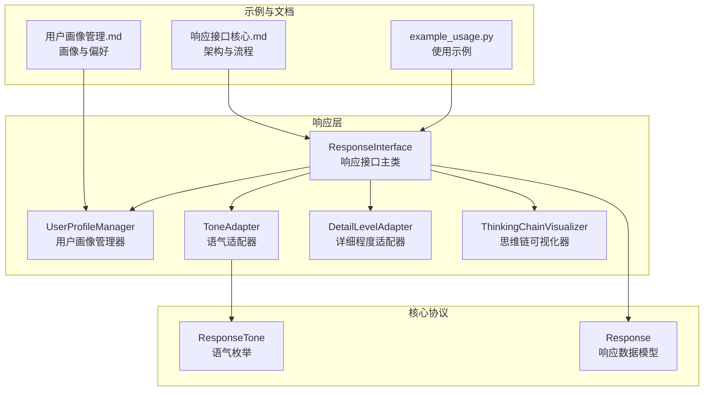
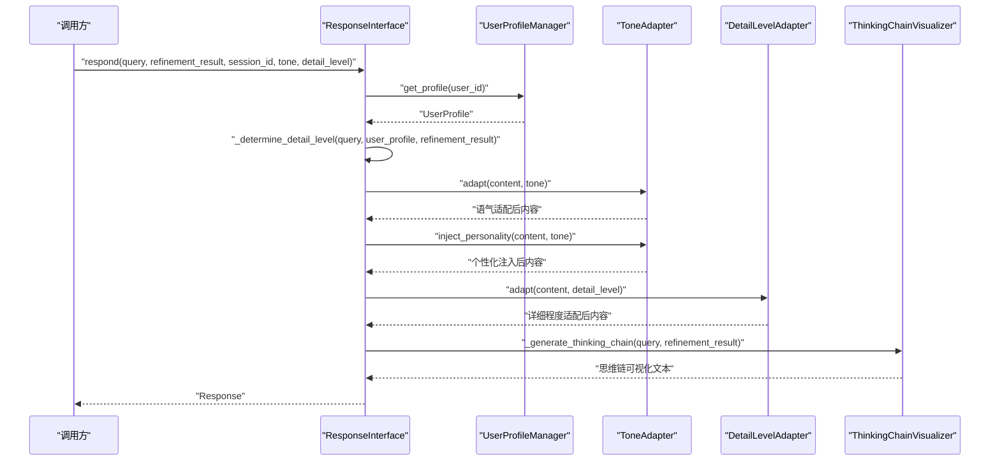
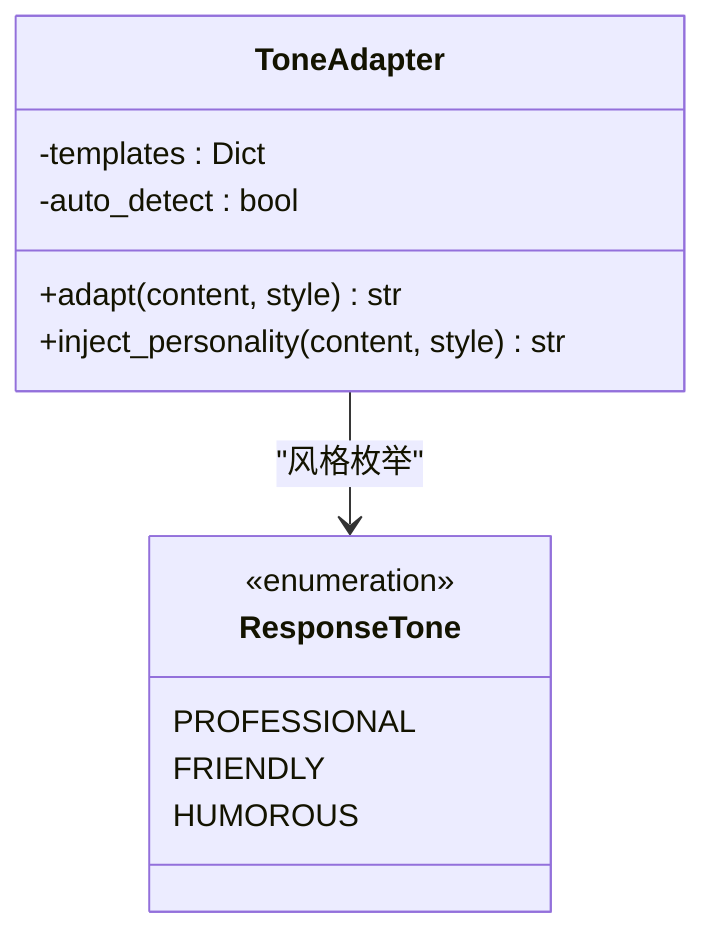
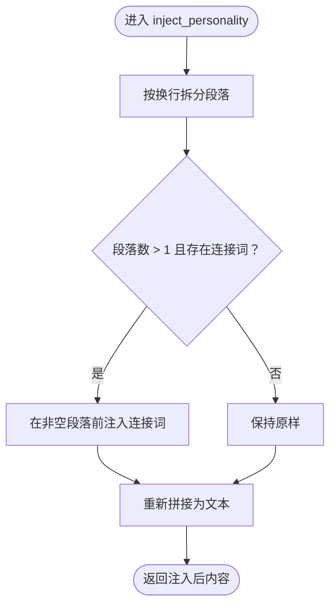
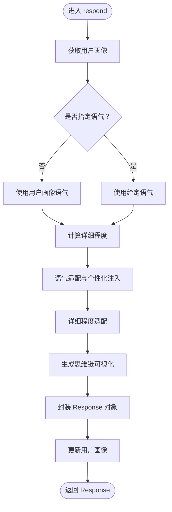
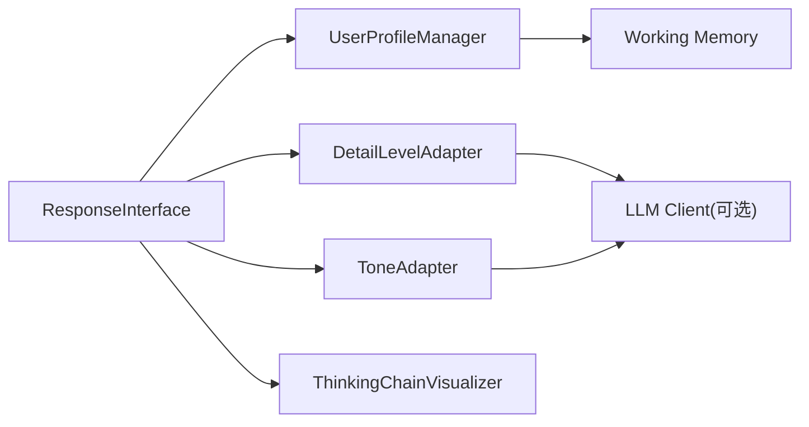

# 语气适配器

<cite>
**本文引用的文件**
- [tone_adapter.py](file://src/response/tone_adapter.py)
- [interface.py](file://src/response/interface.py)
- [profile_manager.py](file://src/response/profile_manager.py)
- [models.py](file://src/response/models.py)
- [protocols.py](file://src/core/protocols.py)
- [example_usage.py](file://example/example_usage.py)
- [响应接口核心.md](file://wiki/wiki/交互层模块/响应接口核心.md)
- [用户画像管理.md](file://wiki/wiki/交互层模块/用户画像管理.md)
</cite>

## 目录
1. [简介](#简介)
2. [项目结构](#项目结构)
3. [核心组件](#核心组件)
4. [架构总览](#架构总览)
5. [详细组件分析](#详细组件分析)
6. [依赖关系分析](#依赖关系分析)
7. [性能考量](#性能考量)
8. [故障排查指南](#故障排查指南)
9. [结论](#结论)
10. [附录](#附录)

## 简介
本文件聚焦于语气适配器（ToneAdapter）的设计与实现，系统阐述其在交互层的角色定位、多语气风格支持机制与适配算法，以及与用户画像、响应接口的协作关系。重点覆盖以下方面：
- ToneAdapter 的多语气风格模板与适配流程：正式严谨、亲切友好、幽默轻松的模板与注入策略。
- 语气注入机制：个性化语言特征与表达习惯的应用，包括连接词注入与表情符号策略。
- 语气适配的决策逻辑：基于用户画像与查询上下文的动态选择策略，以及与响应接口的集成方式。
- 语气转换的具体实现方法：词汇替换、句式调整与语调变化的实现思路与边界。
- 不同场景下的语气选择指南与最佳实践：面向初学者、专家与日常咨询的语气策略。
- 语气适配的质量评估与用户反馈收集机制：基于满意度与偏好分析的闭环优化。

## 项目结构
语气适配器位于响应层（src/response），与用户画像管理器（UserProfileManager）、响应接口（ResponseInterface）、详细程度适配器（DetailLevelAdapter）共同组成交互层的个性化输出管线。其直接依赖包括：
- 协调组件：ResponseInterface 负责整合用户画像、语气与详细程度，生成最终响应。
- 用户画像：UserProfileManager 提供用户偏好与历史，驱动语气风格的动态选择。
- 数据模型：ResponseTone（枚举）与 Response（数据模型）定义语气风格与响应结构。
- 示例与文档：example_usage.py 展示完整调用链；wiki 文档提供架构与流程说明。

图表来源
- [interface.py:16-132](file://src/response/interface.py#L16-L132)
- [profile_manager.py:10-165](file://src/response/profile_manager.py#L10-L165)
- [tone_adapter.py:8-138](file://src/response/tone_adapter.py#L8-L138)
- [protocols.py:51-64](file://src/core/protocols.py#L51-L64)
- [models.py:265-278](file://src/response/models.py#L265-L278)
- [example_usage.py:176-215](file://example/example_usage.py#L176-L215)
- [响应接口核心.md:46-83](file://wiki/wiki/交互层模块/响应接口核心.md#L46-L83)
- [用户画像管理.md:36-45](file://wiki/wiki/交互层模块/用户画像管理.md#L36-L45)

章节来源
- [响应接口核心.md:37-84](file://wiki/wiki/交互层模块/响应接口核心.md#L37-L84)
- [用户画像管理.md:36-45](file://wiki/wiki/交互层模块/用户画像管理.md#L36-L45)

## 核心组件
- ToneAdapter：根据预设模板对内容进行语气适配与个性化注入，支持正式、友好、幽默三种风格。
- ResponseInterface：响应接口主类，负责整合用户画像、语气风格、详细程度与思维链可视化，生成最终响应对象。
- UserProfileManager：管理用户画像与交互历史，提供偏好分析与风格检测能力（当前实现中，语气偏好通过 UserProfile.preferred_tone 提供）。
- ResponseTone（枚举）：定义语气风格（PROFESSIONAL、FRIENDLY、HUMOROUS）。
- Response（数据模型）：响应对象，包含 content、thinking_chain、tone、detail_level、citations、metadata 等字段。

章节来源
- [tone_adapter.py:8-138](file://src/response/tone_adapter.py#L8-L138)
- [interface.py:16-132](file://src/response/interface.py#L16-L132)
- [profile_manager.py:10-165](file://src/response/profile_manager.py#L10-L165)
- [protocols.py:51-64](file://src/core/protocols.py#L51-L64)
- [models.py:265-278](file://src/response/models.py#L265-L278)

## 架构总览
语气适配器在响应接口的调用序列中承担“个性化注入”的角色：在确定语气风格后，先进行语气适配（添加前后缀、表情符号策略），再进行个性化注入（段落间连接词注入），最后进行详细程度适配与思维链可视化生成。

图表来源
- [interface.py:55-132](file://src/response/interface.py#L55-L132)
- [profile_manager.py:41-100](file://src/response/profile_manager.py#L41-L100)
- [tone_adapter.py:49-109](file://src/response/tone_adapter.py#L49-L109)
- [models.py:38-47](file://src/refinement/models.py#L38-L47)

章节来源
- [响应接口核心.md:104-137](file://wiki/wiki/交互层模块/响应接口核心.md#L104-L137)

## 详细组件分析

### ToneAdapter：多语气风格支持与适配算法
- 支持的语气风格
  - formal：正式严谨，避免表情符号，连接词偏向“因此”、“综上所述”。
  - friendly：亲切友好，连接词偏向“所以”、“这样看来”，允许表情符号。
  - humorous：幽默轻松，连接词偏向“有趣的是”、“惊喜吧”，带表情符号。
- 适配流程
  - adapt：根据模板添加前后缀、移除表情符号（如适用）。
  - inject_personality：在段落之间注入连接词，增强连贯性。
- 适用场景
  - 面向不同用户风格的个性化输出，提升交互体验。

图表来源
- [tone_adapter.py:8-138](file://src/response/tone_adapter.py#L8-L138)
- [protocols.py:51-64](file://src/core/protocols.py#L51-L64)

章节来源
- [tone_adapter.py:8-138](file://src/response/tone_adapter.py#L8-L138)
- [响应接口核心.md:248-258](file://wiki/wiki/交互层模块/响应接口核心.md#L248-L258)

### 语气注入机制：个性化语言特征与表达习惯
- 个性化注入策略
  - 连接词注入：在段落之间注入风格化的连接词，增强内容连贯性。
  - 表情符号策略：根据风格模板决定是否保留或移除表情符号。
- 适用范围
  - 适用于多段文本的衔接与风格统一，避免生硬的段落分割。

图表来源
- [tone_adapter.py:94-109](file://src/response/tone_adapter.py#L94-L109)

章节来源
- [tone_adapter.py:77-109](file://src/response/tone_adapter.py#L77-L109)

### 语气适配的决策逻辑：基于用户画像与查询上下文的动态选择
- 用户画像驱动
  - ResponseInterface 在未显式指定语气时，从用户画像中读取 preferred_tone。
  - UserProfileManager 提供用户偏好分析（当前实现中，语气偏好通过 UserProfile.preferred_tone 提供）。
- 查询上下文影响
  - ResponseInterface 根据查询复杂度与精炼结果迭代次数动态调整详细程度，间接影响语气的表达密度与风格强度。
- 与响应接口的集成
  - ResponseInterface 在 respond 流程中先确定语气，再进行内容适配与思维链生成。

图表来源
- [interface.py:55-132](file://src/response/interface.py#L55-L132)
- [profile_manager.py:115-174](file://src/response/profile_manager.py#L115-L174)

章节来源
- [interface.py:59-140](file://src/response/interface.py#L59-L140)
- [用户画像管理.md:361-379](file://wiki/wiki/交互层模块/用户画像管理.md#L361-L379)

### 语气转换的具体实现方法：词汇替换、句式调整与语调变化
- 词汇替换
  - 通过连接词模板替换为风格化表达，如“因此/综上所述/根据分析”等。
- 句式调整
  - 在段落间注入连接词，改善句子间的过渡与连贯性。
- 语调变化
  - 通过前后缀与表情符号策略体现语调差异（正式/友好/幽默）。
- 实现边界
  - 当前实现为轻量级文本处理，不涉及深层语义变换与语法重写。

章节来源
- [tone_adapter.py:28-47](file://src/response/tone_adapter.py#L28-L47)
- [tone_adapter.py:94-109](file://src/response/tone_adapter.py#L94-L109)

### 不同场景下的语气选择指南与最佳实践
- 场景一：面向初学者（知识水平 beginner）
  - 建议：使用 friendly 或 humorous 风格，连接词偏向“所以”、“这样看来”、“简单来说”，适当保留表情符号，提升亲和力。
- 场景二：面向专家（知识水平 expert）
  - 建议：使用 formal 风格，连接词偏向“因此”、“综上所述”、“根据分析”，避免表情符号，强调严谨性。
- 场景三：日常咨询与客服
  - 建议：使用 friendly 风格，连接词偏向“所以”、“这样看来”，允许表情符号，提升用户体验。
- 场景四：创意与娱乐场景
  - 建议：使用 humorous 风格，连接词偏向“有趣的是”、“惊喜吧”，带表情符号，增强趣味性。
- 最佳实践
  - 明确用户画像与查询上下文，避免跨风格混用。
  - 在段落间注入连接词时注意语义连贯性，避免过度装饰。
  - 对正式场景严格控制表情符号使用，确保专业性。

章节来源
- [响应接口核心.md:248-258](file://wiki/wiki/交互层模块/响应接口核心.md#L248-L258)
- [用户画像管理.md:306-323](file://wiki/wiki/交互层模块/用户画像管理.md#L306-L323)

### 语气适配的质量评估与用户反馈收集机制
- 质量评估指标
  - 用户满意度：通过 Interaction.satisfaction 字段记录用户对语气与内容的满意度。
  - 偏好分析：UserProfileManager.analyze_preference 输出 top_keywords、total_queries、interaction_style、professional_level 等，辅助评估语气适配效果。
- 反馈收集
  - ResponseInterface 在生成响应后记录 Interaction，UserProfileManager.update_profile 将交互历史写回工作记忆，形成闭环。
- 优化建议
  - 基于满意度序列计算个体与全局准确度，持续优化语气风格与连接词策略。
  - 引入 LLM 增强模式进行风格检测与偏好预测，提升个性化精度。

章节来源
- [models.py:13-22](file://src/response/models.py#L13-L22)
- [profile_manager.py:143-174](file://src/response/profile_manager.py#L143-L174)
- [用户画像管理.md:488-497](file://wiki/wiki/交互层模块/用户画像管理.md#L488-L497)

## 依赖关系分析
- 组件耦合
  - ResponseInterface 依赖 UserProfileManager、ToneAdapter、DetailLevelAdapter、ThinkingChainVisualizer。
  - ToneAdapter 依赖 ResponseTone（枚举）与模板配置，无外部状态依赖。
- 外部依赖
  - 记忆管理器 MemoryManager 提供工作记忆上下文。
  - 精炼结果 RefinementResult 提供答案、置信度、引用与迭代次数等信息。
- 潜在循环依赖
  - 当前实现未发现循环依赖，模块边界清晰。

图表来源
- [interface.py:31-58](file://src/response/interface.py#L31-L58)
- [profile_manager.py:77-96](file://src/response/profile_manager.py#L77-L96)
- [tone_adapter.py:18-25](file://src/response/tone_adapter.py#L18-L25)

章节来源
- [响应接口核心.md:354-399](file://wiki/wiki/交互层模块/响应接口核心.md#L354-L399)

## 性能考量
- 时间复杂度
  - adapt 与 inject_personality 均为线性时间，涉及字符串处理与少量列表操作，整体开销可控。
  - emoji 移除通过字符码范围扫描实现，时间复杂度与文本长度线性相关。
- 空间复杂度
  - 模板与连接词等静态资源占用固定空间，运行时仅进行字符串拼接与列表处理。
- 优化建议
  - 对模板与连接词等静态资源进行预编译，减少运行时字符串拼接成本。
  - 对长文本的连接词注入可考虑分段处理，避免一次性处理超长字符串。
  - 将表情符号移除逻辑与连接词注入逻辑合并，减少重复扫描。

章节来源
- [tone_adapter.py:111-138](file://src/response/tone_adapter.py#L111-L138)
- [响应接口核心.md:400-411](file://wiki/wiki/交互层模块/响应接口核心.md#L400-L411)

## 故障排查指南
- 当前实现中的异常处理现状
  - 响应接口与各子组件未显式捕获异常，调用方需自行处理可能的异常。
  - 若用户画像或记忆上下文缺失，UserProfileManager.get_profile 将创建新画像；若工作记忆接口异常，可能导致 profile 无法读取或写入。
- 建议的异常处理策略
  - 在 respond 中增加 try-except 包裹关键步骤，捕获与日志记录异常详情。
  - 对 MemoryManager、UserProfileManager、RefinementResult 的访问增加健壮性检查。
  - 对外部依赖（如 LLM 模型）的调用建议使用统一的异常类型，便于上层统一处理。
- 可参考的异常类型
  - NecoRAGError 及其子类（如 LLMError、GenerationError、RefinementError 等）可用于统一错误表达与传递。

章节来源
- [响应接口核心.md:412-422](file://wiki/wiki/交互层模块/响应接口核心.md#L412-L422)

## 结论
ToneAdapter 通过多风格模板与轻量级文本处理，实现了情境感知的语气适配与个性化注入。结合 ResponseInterface 的用户画像驱动与详细程度自适应，系统在交互层提供了可解释、可定制的个性化响应能力。当前实现以模块化设计为核心，耦合度低、扩展性强。建议在未来版本中完善异常处理与错误传播机制，引入 LLM 增强模式以提升语气检测与偏好预测的准确性，并持续优化 emoji 移除与连接词注入的性能与语义连贯性。

## 附录
- 使用示例：通过 example_usage.py 展示从感知、记忆、检索、精炼到响应的完整流程，并在响应阶段调用用户偏好分析。
- 相关抽象基类与协议：BaseResponseAdapter、BaseLLMClient/BaseAsyncLLMClient，为响应层提供统一接口契约与生成能力。

章节来源
- [example_usage.py:176-215](file://example/example_usage.py#L176-L215)
- [响应接口核心.md:429-436](file://wiki/wiki/交互层模块/响应接口核心.md#L429-L436)