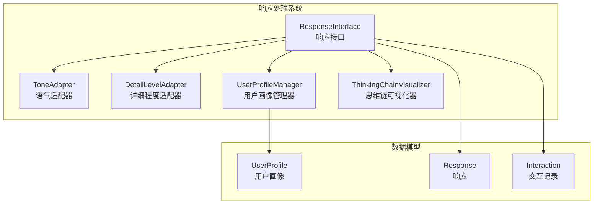
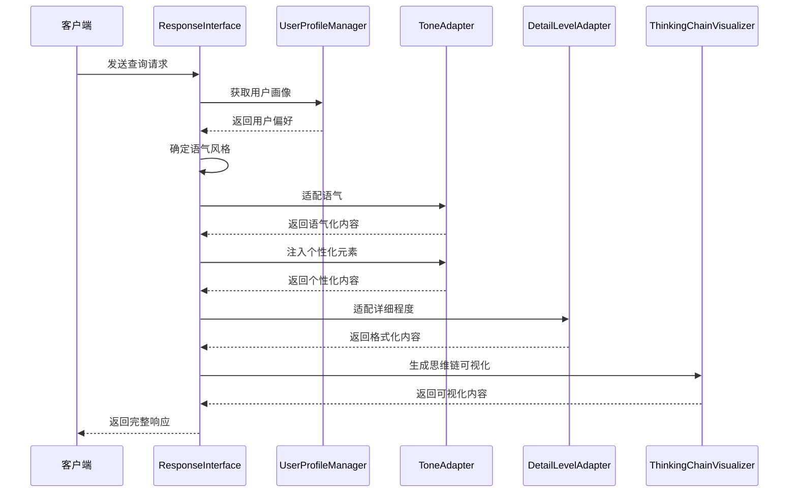
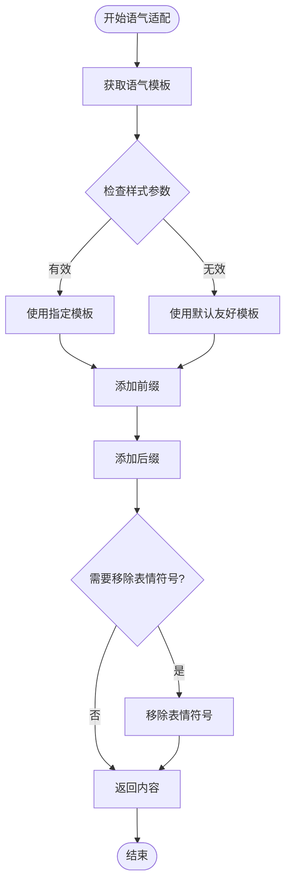
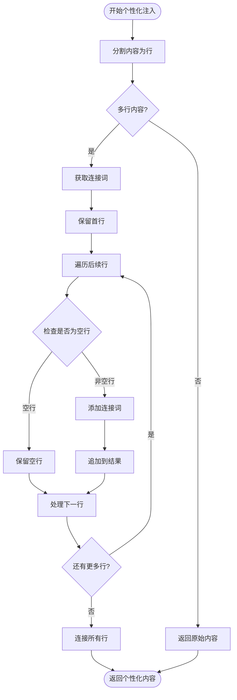
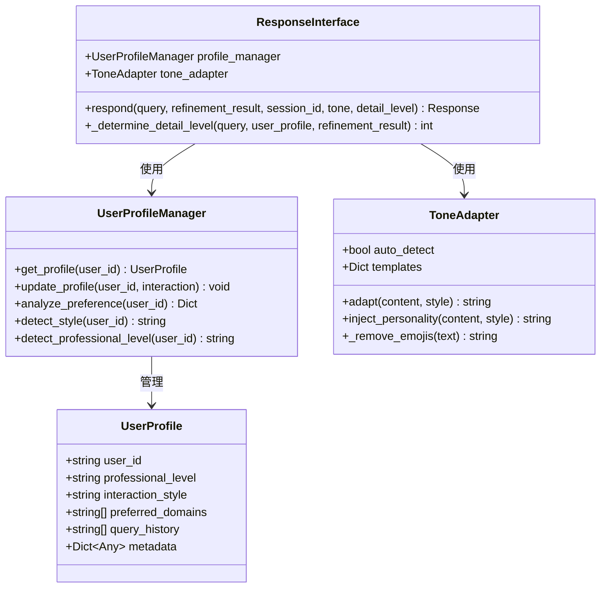
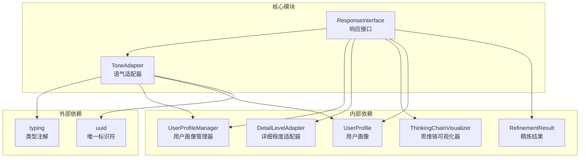

# 语气适配器

<cite>
**本文档引用的文件**
- [tone_adapter.py](file://src/response/tone_adapter.py)
- [interface.py](file://src/response/interface.py)
- [models.py](file://src/response/models.py)
- [profile_manager.py](file://src/response/profile_manager.py)
- [visualizer.py](file://src/response/visualizer.py)
- [__init__.py](file://src/response/__init__.py)
- [example_usage.py](file://example/example_usage.py)
</cite>

## 目录
1. [简介](#简介)
2. [项目结构](#项目结构)
3. [核心组件](#核心组件)
4. [架构概览](#架构概览)
5. [详细组件分析](#详细组件分析)
6. [依赖关系分析](#依赖关系分析)
7. [性能考虑](#性能考虑)
8. [故障排除指南](#故障排除指南)
9. [结论](#结论)

## 简介

语气适配器模块是 NecoRAG 框架中的一个关键组件，负责根据不同的语气风格调整输出内容，使 AI 交互更加人性化和情境化。该模块支持多种语气风格，包括正式、友好和幽默，能够根据用户画像和交互场景自动选择合适的表达方式。

语气适配器的核心设计理念是通过模板驱动的方式实现内容的语调转换，同时保持内容的技术准确性和完整性。它不仅能够调整语言风格，还能通过个性化注入增强用户体验的真实感和连贯性。

## 项目结构

语气适配器模块位于响应处理系统的中心位置，与用户画像管理、详细程度适配和思维链可视化等组件协同工作。

**图表来源**
- [interface.py:16-54](file://src/response/interface.py#L16-L54)
- [tone_adapter.py:8-47](file://src/response/tone_adapter.py#L8-L47)
- [profile_manager.py:10-39](file://src/response/profile_manager.py#L10-L39)

**章节来源**
- [interface.py:16-54](file://src/response/interface.py#L16-L54)
- [__init__.py:13-22](file://src/response/__init__.py#L13-L22)

## 核心组件

### ToneAdapter 类

ToneAdapter 是语气适配器的核心类，提供了完整的语气转换功能。它支持三种预定义的语气风格，并通过模板系统实现灵活的内容调整。

#### 主要特性
- **多风格支持**：正式、友好、幽默三种语气风格
- **模板驱动**：基于配置的语气模板系统
- **个性化注入**：智能的连接词和修饰语注入
- **表情符号控制**：根据不同语气风格控制表情符号的使用

#### 关键方法
- `adapt()`: 核心语气适配方法
- `inject_personality()`: 个性化元素注入
- `_remove_emojis()`: 表情符号移除辅助方法

**章节来源**
- [tone_adapter.py:8-138](file://src/response/tone_adapter.py#L8-L138)

## 架构概览

语气适配器在整个响应处理流程中扮演着重要的角色，它与响应接口、用户画像管理器和其他组件紧密协作。

**图表来源**
- [interface.py:55-132](file://src/response/interface.py#L55-L132)
- [tone_adapter.py:49-109](file://src/response/tone_adapter.py#L49-L109)

**章节来源**
- [interface.py:55-132](file://src/response/interface.py#L55-L132)

## 详细组件分析

### ToneAdapter 类设计分析

ToneAdapter 采用模板驱动的设计模式，通过预定义的模板配置实现不同语气风格的内容转换。

#### 语气模板系统

每个语气风格都有对应的模板配置，包含以下要素：

| 模板要素 | 正式风格 | 友好风格 | 幽默风格 |
|---------|---------|---------|---------|
| 前缀 | 空 | 空 | "哈哈，" |
| 后缀 | 空 | "~" | " 😸" |
| 连接词 | ["因此","综上所述","根据分析"] | ["所以","这样看来","简单来说"] | ["有趣的是","惊喜吧","猜猜看"] |
| 表情符号控制 | True | False | False |

#### 语气适配算法

**图表来源**
- [tone_adapter.py:49-75](file://src/response/tone_adapter.py#L49-L75)

#### 个性化注入机制

个性化注入通过智能连接词和修饰语增强内容的连贯性和真实感：

**图表来源**
- [tone_adapter.py:77-109](file://src/response/tone_adapter.py#L77-L109)

**章节来源**
- [tone_adapter.py:8-138](file://src/response/tone_adapter.py#L8-L138)

### 语气风格详解

#### 正式风格 (Formal)
正式风格适用于商务沟通、学术讨论和技术文档等正式场合。其特点包括：
- 严谨的语言表达
- 避免使用表情符号
- 使用正式的连接词
- 保持客观中性的语调

#### 友好风格 (Friendly)
友好风格是最常用的语气，适用于大多数日常交互场景。其特点包括：
- 亲切自然的表达
- 适当的表情符号使用
- 简洁明了的语言
- 适合广泛用户群体

#### 幽默风格 (Humorous)
幽默风格用于轻松愉快的交互场景，能够增加用户的参与感和满意度。其特点包括：
- 幽默的开头和结尾
- 有趣的连接词
- 适度的表情符号使用
- 适合年轻用户群体

**章节来源**
- [tone_adapter.py:28-47](file://src/response/tone_adapter.py#L28-L47)

### 与用户画像的集成

语气适配器与用户画像管理系统深度集成，能够根据用户的历史行为和偏好自动调整语气风格。

**图表来源**
- [models.py:10-44](file://src/response/models.py#L10-L44)
- [profile_manager.py:10-165](file://src/response/profile_manager.py#L10-L165)
- [interface.py:16-54](file://src/response/interface.py#L16-L54)

**章节来源**
- [models.py:10-44](file://src/response/models.py#L10-L44)
- [profile_manager.py:10-165](file://src/response/profile_manager.py#L10-L165)
- [interface.py:16-54](file://src/response/interface.py#L16-L54)

## 依赖关系分析

语气适配器模块具有清晰的依赖关系，主要依赖于响应接口和用户画像管理器。

**图表来源**
- [tone_adapter.py:5-6](file://src/response/tone_adapter.py#L5-L6)
- [interface.py:5-13](file://src/response/interface.py#L5-L13)

**章节来源**
- [tone_adapter.py:5-6](file://src/response/tone_adapter.py#L5-L6)
- [interface.py:5-13](file://src/response/interface.py#L5-L13)

## 性能考虑

### 时间复杂度分析

语气适配器的操作主要涉及字符串处理和简单的模板匹配，具有以下时间复杂度特征：

- **adapt() 方法**: O(n)，其中 n 是内容长度
- **inject_personality() 方法**: O(m)，其中 m 是行数
- **_remove_emojis() 方法**: O(k)，其中 k 是字符数量

### 空间复杂度分析

- **模板存储**: O(1)，固定大小的字典结构
- **内容处理**: O(n)，创建新的字符串对象
- **表情符号范围**: O(1)，固定大小的范围列表

### 优化建议

1. **批量处理**: 对于大量内容的处理，可以考虑批量适配以减少函数调用开销
2. **缓存机制**: 对于重复的语气转换，可以实现简单的缓存机制
3. **内存优化**: 对于超长内容，可以考虑流式处理而非一次性加载到内存

## 故障排除指南

### 常见问题及解决方案

#### 问题1：语气风格不生效
**症状**: 设置了特定语气但输出内容没有变化
**可能原因**:
- 传递的样式参数不在支持范围内
- 用户画像覆盖了默认设置

**解决方案**:
- 检查样式参数是否为 "formal"、"friendly" 或 "humorous"
- 确认用户画像中的 interaction_style 设置

#### 问题2：表情符号处理异常
**症状**: 表情符号没有被正确移除或保留
**可能原因**:
- Unicode 范围定义不完整
- 输入文本包含特殊表情符号

**解决方案**:
- 扩展表情符号 Unicode 范围定义
- 添加更精确的表情符号检测逻辑

#### 问题3：个性化注入效果不佳
**症状**: 连接词注入后内容显得生硬
**可能原因**:
- 连接词与内容主题不匹配
- 注入时机不当

**解决方案**:
- 根据内容主题选择更合适的连接词
- 优化连接词注入的位置和频率

**章节来源**
- [tone_adapter.py:111-137](file://src/response/tone_adapter.py#L111-L137)

## 结论

语气适配器模块通过精心设计的模板系统和智能的个性化注入机制，为 NecoRAG 框架提供了强大的语调转换能力。其模块化的设计使得扩展新的语气风格变得相对简单，而与用户画像管理系统的深度集成则确保了用户体验的一致性和个性化。

该模块的成功之处在于平衡了灵活性与实用性：既能够满足不同场景下的语气需求，又保持了实现的简洁性和维护的便利性。随着框架的发展，语气适配器可以进一步扩展以支持更多的语气风格和更复杂的个性化需求。

通过合理使用语气适配器，开发者可以创建更加人性化和情境化的 AI 交互体验，提升用户满意度和系统的整体质量。