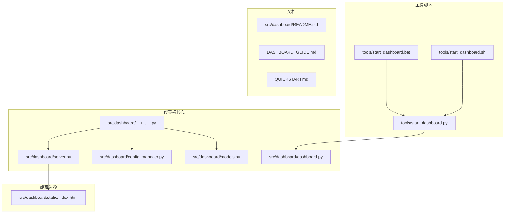
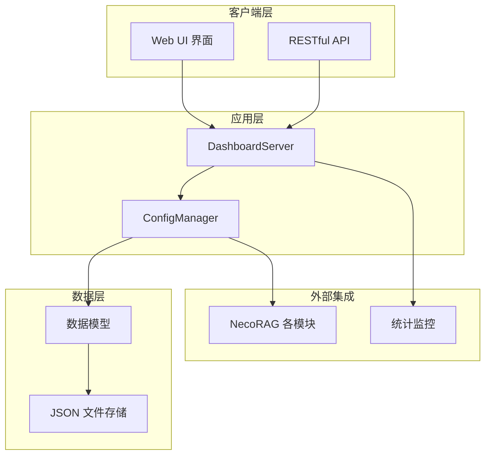
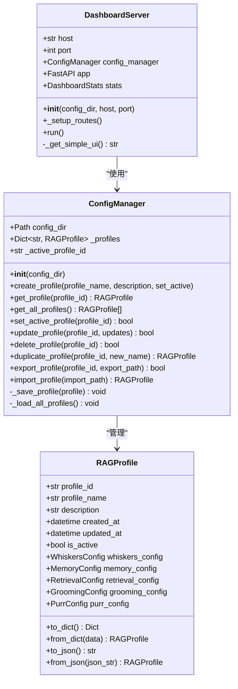
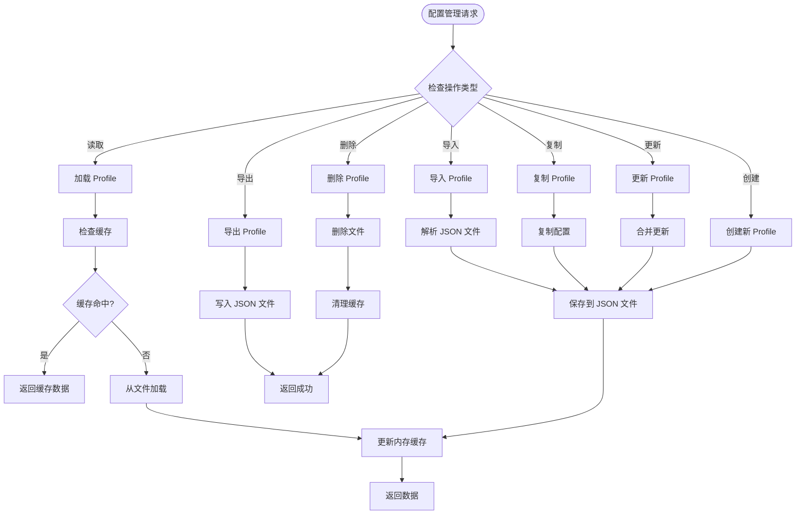
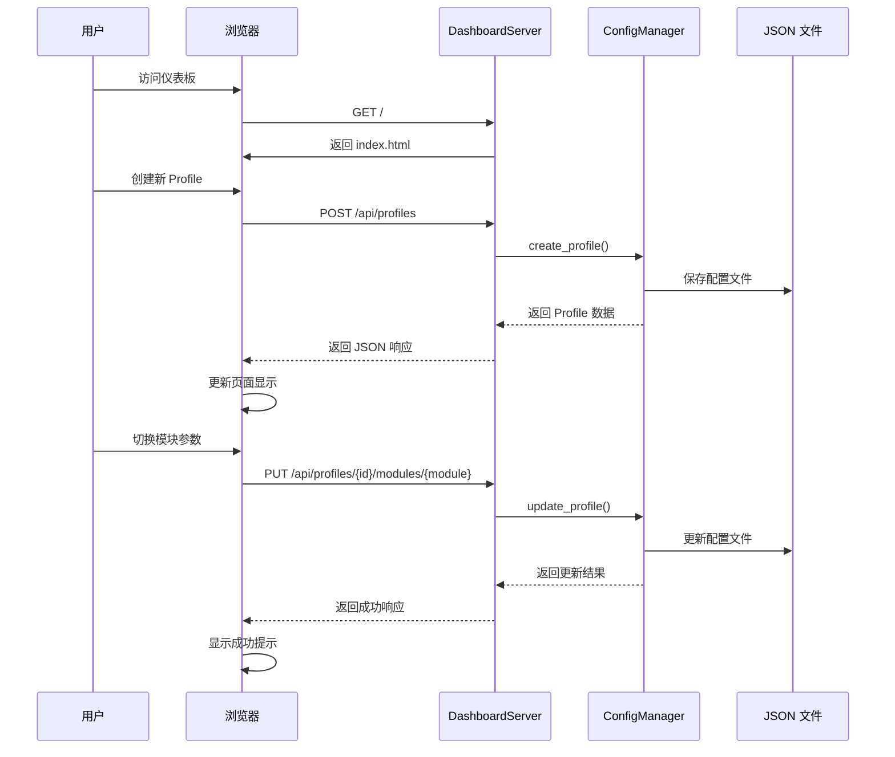
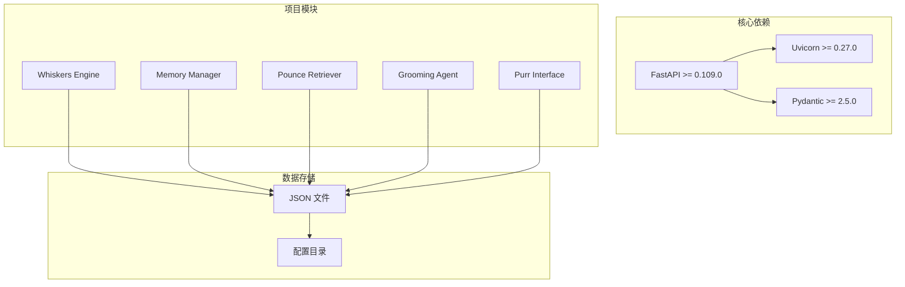

# 仪表板管理界面

<cite>
**本文档引用的文件**
- [src/dashboard/README.md](file://src/dashboard/README.md)
- [DASHBOARD_GUIDE.md](file://DASHBOARD_GUIDE.md)
- [QUICKSTART.md](file://QUICKSTART.md)
- [src/dashboard/__init__.py](file://src/dashboard/__init__.py)
- [src/dashboard/dashboard.py](file://src/dashboard/dashboard.py)
- [src/dashboard/server.py](file://src/dashboard/server.py)
- [src/dashboard/config_manager.py](file://src/dashboard/config_manager.py)
- [src/dashboard/models.py](file://src/dashboard/models.py)
- [src/dashboard/static/index.html](file://src/dashboard/static/index.html)
- [tools/start_dashboard.py](file://tools/start_dashboard.py)
- [tools/start_dashboard.bat](file://tools/start_dashboard.bat)
- [tools/start_dashboard.sh](file://tools/start_dashboard.sh)
- [requirements.txt](file://requirements.txt)
- [example/example_usage.py](file://example/example_usage.py)
</cite>

## 目录
1. [简介](#简介)
2. [项目结构](#项目结构)
3. [核心组件](#核心组件)
4. [架构概览](#架构概览)
5. [详细组件分析](#详细组件分析)
6. [依赖分析](#依赖分析)
7. [性能考虑](#性能考虑)
8. [故障排除指南](#故障排除指南)
9. [结论](#结论)
10. [附录](#附录)

## 简介
NecoRAG Dashboard 是一个基于 FastAPI 的 Web 管理界面，用于配置和管理 NecoRAG 各个模块的参数。该仪表板提供了直观的图形界面，允许用户创建、编辑、切换和管理多个配置 Profile，同时提供实时统计监控功能。

## 项目结构
仪表板系统采用模块化设计，主要包含以下核心目录和文件：



**图表来源**
- [src/dashboard/__init__.py:1-16](file://src/dashboard/__init__.py#L1-L16)
- [src/dashboard/server.py:1-393](file://src/dashboard/server.py#L1-L393)
- [src/dashboard/config_manager.py:1-315](file://src/dashboard/config_manager.py#L1-L315)
- [src/dashboard/models.py:1-231](file://src/dashboard/models.py#L1-L231)

**章节来源**
- [src/dashboard/README.md:1-417](file://src/dashboard/README.md#L1-L417)
- [DASHBOARD_GUIDE.md:1-309](file://DASHBOARD_GUIDE.md#L1-L309)
- [QUICKSTART.md:1-325](file://QUICKSTART.md#L1-L325)

## 核心组件
仪表板系统由四个核心组件构成，每个组件负责特定的功能领域：

### 1. DashboardServer - 服务器核心
DashboardServer 是整个系统的中枢，负责：
- FastAPI 应用实例管理
- RESTful API 路由注册
- Web UI 静态文件服务
- CORS 跨域配置
- 统计信息管理

### 2. ConfigManager - 配置管理器
ConfigManager 提供完整的配置生命周期管理：
- Profile 创建、读取、更新、删除
- 配置导入导出功能
- 活动配置切换
- 配置缓存机制
- JSON 文件持久化

### 3. 数据模型系统
系统包含完整的数据模型层次结构：
- ModuleType 枚举定义模块类型
- ModuleConfig 基础配置模型
- 五个专用配置类（Whiskers、Memory、Retrieval、Grooming、Purr）
- RAGProfile 综合配置容器
- DashboardStats 实时统计模型

### 4. Web UI 界面
提供现代化的用户界面：
- 响应式设计适配各种设备
- 模块化配置编辑器
- 实时统计面板
- Profile 管理界面
- 模态对话框和提示系统

**章节来源**
- [src/dashboard/server.py:43-93](file://src/dashboard/server.py#L43-L93)
- [src/dashboard/config_manager.py:14-41](file://src/dashboard/config_manager.py#L14-L41)
- [src/dashboard/models.py:12-231](file://src/dashboard/models.py#L12-L231)
- [src/dashboard/static/index.html:1-800](file://src/dashboard/static/index.html#L1-L800)

## 架构概览
仪表板采用分层架构设计，确保了良好的可维护性和扩展性：



**图表来源**
- [src/dashboard/server.py:94-253](file://src/dashboard/server.py#L94-L253)
- [src/dashboard/config_manager.py:25-41](file://src/dashboard/config_manager.py#L25-L41)
- [src/dashboard/models.py:163-231](file://src/dashboard/models.py#L163-L231)

系统的核心特点：
- **模块化设计**：每个组件职责明确，便于独立开发和测试
- **配置驱动**：所有功能通过配置文件管理，支持动态切换
- **实时监控**：内置统计系统提供运行时状态反馈
- **API 驱动**：完整的 RESTful API 支持自动化集成

## 详细组件分析

### DashboardServer 组件分析
DashboardServer 是仪表板的核心服务器实现，采用面向对象的设计模式：



**图表来源**
- [src/dashboard/server.py:43-93](file://src/dashboard/server.py#L43-L93)
- [src/dashboard/config_manager.py:14-41](file://src/dashboard/config_manager.py#L14-L41)
- [src/dashboard/models.py:163-219](file://src/dashboard/models.py#L163-L219)

#### API 路由设计
DashboardServer 提供了完整的 API 路由体系：

**Profile 管理路由**
- GET `/api/profiles` - 获取所有 Profile
- GET `/api/profiles/{profile_id}` - 获取指定 Profile
- POST `/api/profiles` - 创建新 Profile
- PUT `/api/profiles/{profile_id}` - 更新 Profile
- DELETE `/api/profiles/{profile_id}` - 删除 Profile
- POST `/api/profiles/{profile_id}/activate` - 激活 Profile
- POST `/api/profiles/{profile_id}/duplicate` - 复制 Profile
- POST `/api/profiles/{profile_id}/export` - 导出 Profile
- POST `/api/profiles/import` - 导入 Profile

**模块参数管理路由**
- GET `/api/profiles/{profile_id}/modules/{module}` - 获取模块参数
- PUT `/api/profiles/{profile_id}/modules/{module}` - 更新模块参数

**统计信息路由**
- GET `/api/stats` - 获取统计信息
- POST `/api/stats/reset` - 重置统计信息

**章节来源**
- [src/dashboard/server.py:94-253](file://src/dashboard/server.py#L94-L253)

### ConfigManager 组件分析
ConfigManager 实现了完整的配置管理功能，采用缓存机制提高性能：



**图表来源**
- [src/dashboard/config_manager.py:42-315](file://src/dashboard/config_manager.py#L42-L315)

#### 配置缓存机制
ConfigManager 采用了智能缓存策略：
- **内存缓存**：所有加载的 Profile 存储在 `_profiles` 字典中
- **文件持久化**：每次配置变更都会同步到 JSON 文件
- **活动配置跟踪**：维护 `_active_profile_id` 指向当前活动的 Profile
- **自动加载**：启动时自动扫描配置目录并加载所有 Profile

**章节来源**
- [src/dashboard/config_manager.py:25-41](file://src/dashboard/config_manager.py#L25-L41)
- [src/dashboard/config_manager.py:279-315](file://src/dashboard/config_manager.py#L279-L315)

### 数据模型系统分析
数据模型系统采用 Python 的 dataclass 特性，提供了类型安全和序列化支持：

```mermaid
classDiagram
class ModuleType {
<<enumeration>>
WHISKERS
MEMORY
RETRIEVAL
GROOMING
PURR
}
class ModuleConfig {
+ModuleType module_type
+str module_name
+str description
+Dict~str, Any~ parameters
+bool enabled
+datetime last_updated
+to_dict() Dict
+from_dict(data) ModuleConfig
}
class WhiskersConfig {
+parameters : {
chunk_size : 512
chunk_overlap : 50
enable_ocr : True
vector_model : "BGE-M3"
vector_size : 1024
}
}
class MemoryConfig {
+parameters : {
l1_ttl : 3600
l1_max_session_items : 1000
l2_vector_size : 1024
decay_rate : 0.1
archive_threshold : 0.05
}
}
class RetrievalConfig {
+parameters : {
top_k : 10
pounce_threshold : 0.85
hyde_enabled : True
reranker_model : "BGE-Reranker-v2"
}
}
class GroomingConfig {
+parameters : {
min_confidence : 0.7
hallucination_threshold : 0.6
max_iterations : 3
}
}
class PurrConfig {
+parameters : {
default_tone : "friendly"
default_detail_level : 2
show_trace : True
show_evidence : True
}
}
class RAGProfile {
+str profile_id
+str profile_name
+str description
+datetime created_at
+datetime updated_at
+bool is_active
+WhiskersConfig whiskers_config
+MemoryConfig memory_config
+RetrievalConfig retrieval_config
+GroomingConfig grooming_config
+PurrConfig purr_config
}
ModuleConfig <|-- WhiskersConfig
ModuleConfig <|-- MemoryConfig
ModuleConfig <|-- RetrievalConfig
ModuleConfig <|-- GroomingConfig
ModuleConfig <|-- PurrConfig
RAGProfile --> WhiskersConfig
RAGProfile --> MemoryConfig
RAGProfile --> RetrievalConfig
RAGProfile --> GroomingConfig
RAGProfile --> PurrConfig
```

**图表来源**
- [src/dashboard/models.py:12-231](file://src/dashboard/models.py#L12-L231)

#### 模块参数配置
每个模块都有其特定的参数配置，涵盖了从感知到交互的完整流程：

**Whiskers Engine 参数**
- 文档分块大小：512-1024 字符
- OCR 启用：True/False
- 向量模型：BGE-M3 或其他嵌入模型
- 向量维度：1024 维

**Memory 参数**
- L1 记忆 TTL：3600 秒
- 记忆衰减速率：0.1
- 归档阈值：0.05
- L2 向量维度：1024

**Retrieval 参数**
- 检索数量：10 个结果
- 扑击阈值：0.85
- HyDE 启用：True
- 重排序模型：BGE-Reranker-v2

**Grooming 参数**
- 最低置信度：0.7
- 幻觉阈值：0.6
- 最大迭代次数：3

**Purr 参数**
- 默认语气：friendly
- 默认详细程度：2
- 可视化开关：显示检索路径和证据来源

**章节来源**
- [src/dashboard/models.py:47-160](file://src/dashboard/models.py#L47-L160)

### Web UI 界面分析
仪表板提供了现代化的响应式用户界面：



**图表来源**
- [src/dashboard/server.py:239-253](file://src/dashboard/server.py#L239-L253)
- [src/dashboard/config_manager.py:42-166](file://src/dashboard/config_manager.py#L42-L166)

#### 用户交互流程
仪表板的用户交互遵循清晰的流程设计：

**Profile 管理流程**
1. 用户访问仪表板主页
2. 系统自动加载所有可用的 Profile
3. 用户可以选择创建新 Profile 或编辑现有 Profile
4. 修改后的配置立即保存到 JSON 文件
5. 用户可以激活任意 Profile 作为当前运行配置

**模块参数配置流程**
1. 用户从左侧选择目标 Profile
2. 切换到相应的模块标签页
3. 修改参数值并点击保存按钮
4. 系统验证参数有效性并保存到文件
5. 配置变更立即生效

**统计信息监控流程**
1. 仪表板底部显示实时统计信息
2. 统计信息每 5 秒自动刷新一次
3. 用户可以手动点击刷新按钮
4. 支持重置统计信息功能

**章节来源**
- [src/dashboard/static/index.html:715-800](file://src/dashboard/static/index.html#L715-L800)

## 依赖分析
仪表板系统的依赖关系相对简单，主要依赖于 FastAPI 生态系统：



**图表来源**
- [requirements.txt:7-11](file://requirements.txt#L7-L11)

### 外部模块集成
仪表板设计为与 NecoRAG 的其他模块无缝集成：

**模块间依赖关系**
- Dashboard 依赖 ConfigManager 来管理配置
- ConfigManager 依赖各个模块的数据模型
- Web UI 通过 API 与服务器通信
- 服务器通过 ConfigManager 访问模块配置

**配置文件格式**
所有配置以 JSON 格式存储，具有以下结构特征：
- 每个 Profile 存储为单独的 JSON 文件
- 文件名为 `{profile_id}.json`
- 包含完整的配置信息和元数据
- 支持导入导出功能

**章节来源**
- [requirements.txt:1-57](file://requirements.txt#L1-L57)
- [src/dashboard/config_manager.py:279-289](file://src/dashboard/config_manager.py#L279-L289)

## 性能考虑
仪表板系统在设计时充分考虑了性能优化：

### 缓存策略
- **内存缓存**：ConfigManager 将所有加载的 Profile 缓存在内存中
- **文件缓存**：避免重复读取磁盘文件，提高响应速度
- **配置更新**：每次更新都会同步到文件，确保数据一致性

### 异步处理
- **定时刷新**：统计信息每 5 秒自动刷新一次
- **异步 API**：所有 API 调用都是异步处理
- **非阻塞操作**：文件 I/O 操作不会阻塞主线程

### 内存管理
- **数据模型优化**：使用 dataclass 减少内存开销
- **参数验证**：在保存前进行参数验证，避免无效配置
- **垃圾回收**：Python 自动管理内存，无需手动干预

## 故障排除指南

### 常见启动问题
**问题：端口被占用**
- **症状**：启动时出现端口绑定错误
- **解决方案**：更改端口号或关闭占用端口的程序
- **命令示例**：`python start_dashboard.py --port 8081`

**问题：配置目录权限不足**
- **症状**：配置文件无法保存或读取
- **解决方案**：检查目录权限或使用管理员权限运行
- **命令示例**：`python start_dashboard.py --config-dir /tmp/necorag_configs`

**问题：Python 环境问题**
- **症状**：模块导入失败或版本不兼容
- **解决方案**：确保安装了正确的依赖版本
- **命令示例**：`pip install -r requirements.txt`

### API 调用问题
**问题：Profile ID 不存在**
- **症状**：API 返回 404 错误
- **解决方案**：先获取所有 Profile 列表，确认正确的 ID
- **调试命令**：`curl http://localhost:8000/api/profiles`

**问题：参数验证失败**
- **症状**：更新配置时返回参数错误
- **解决方案**：检查参数类型和范围是否正确
- **参考**：查看参数说明表格中的有效值范围

### Web UI 问题
**问题：页面加载失败**
- **症状**：仪表板页面空白或加载缓慢
- **解决方案**：检查网络连接和服务器状态
- **调试**：查看浏览器开发者工具的网络面板

**问题：配置保存失败**
- **症状**：修改配置后无法保存
- **解决方案**：检查配置目录是否有写入权限
- **验证**：尝试手动创建测试文件

**章节来源**
- [src/dashboard/README.md:381-412](file://src/dashboard/README.md#L381-L412)
- [DASHBOARD_GUIDE.md:288-305](file://DASHBOARD_GUIDE.md#L288-L305)

## 结论
NecoRAG Dashboard 提供了一个功能完整、易于使用的配置管理界面。通过模块化设计和清晰的架构，系统实现了以下目标：

**核心优势**
- **易用性**：直观的 Web 界面和丰富的交互功能
- **灵活性**：支持多环境配置管理和动态切换
- **可扩展性**：模块化设计便于添加新功能
- **可靠性**：完善的错误处理和故障恢复机制

**技术特色**
- 基于 FastAPI 的高性能 API 服务
- 智能缓存机制提升性能
- 完整的配置生命周期管理
- 实时统计监控功能

**未来发展方向**
- WebSocket 实时推送统计信息
- 参数推荐系统
- A/B 测试功能
- 权限管理和审计日志
- 更丰富的可视化图表

该仪表板为 NecoRAG 框架提供了优秀的管理界面，简化了复杂系统的配置和监控工作。

## 附录

### 启动方法汇总
**方法一：Python 模块方式**
```bash
python -m necorag.dashboard.dashboard
```

**方法二：脚本启动**
```bash
python start_dashboard.py
```

**方法三：批处理文件（Windows）**
```batch
start_dashboard.bat
```

**方法四：Shell 脚本（Linux/Mac）**
```bash
./start_dashboard.sh
```

### 配置选项
**主机地址**：默认 `0.0.0.0`，可通过 `--host` 参数自定义
**端口号**：默认 `8000`，可通过 `--port` 参数自定义
**配置目录**：默认 `./configs`，可通过 `--config-dir` 参数自定义

### API 使用示例
**获取所有 Profiles**
```bash
curl http://localhost:8000/api/profiles
```

**创建新 Profile**
```bash
curl -X POST http://localhost:8000/api/profiles \
  -H "Content-Type: application/json" \
  -d '{"profile_name": "测试配置", "description": "测试用"}'
```

**更新模块参数**
```bash
curl -X PUT http://localhost:8000/api/profiles/{profile_id}/modules/retrieval \
  -H "Content-Type: application/json" \
  -d '{
    "module": "retrieval",
    "parameters": {
      "top_k": 20,
      "pounce_threshold": 0.88
    }
  }'
```

**获取统计信息**
```bash
curl http://localhost:8000/api/stats
```