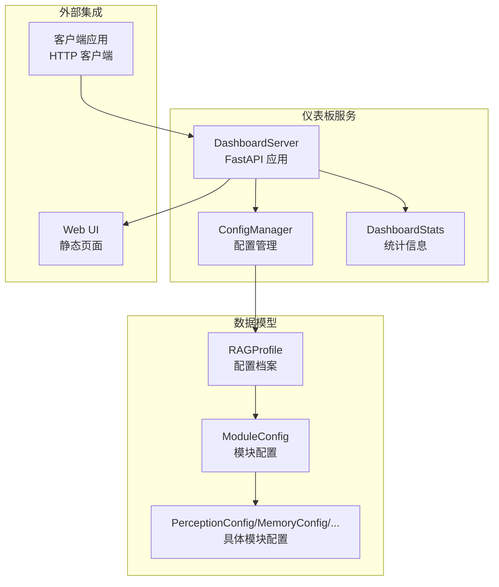
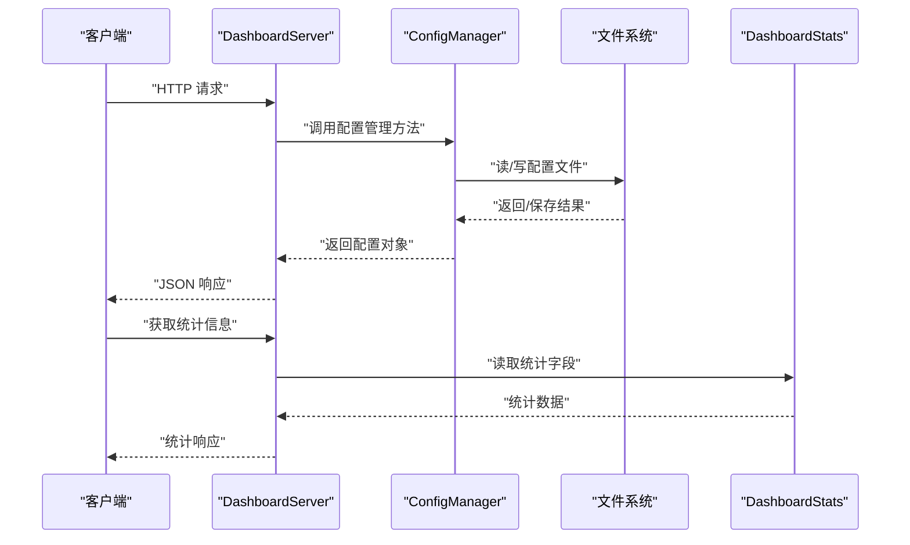
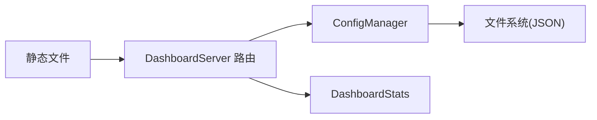

# API 参考手册

<cite>
**本文档引用的文件**
- [server.py](file://src/dashboard/server.py)
- [models.py](file://src/dashboard/models.py)
- [config_manager.py](file://src/dashboard/config_manager.py)
- [dashboard.py](file://src/dashboard/dashboard.py)
- [README.md](file://src/dashboard/README.md)
- [DASHBOARD_GUIDE.md](file://DASHBOARD_GUIDE.md)
- [README.md](file://README.md)
- [models.py](file://src/response/models.py)
- [profile_manager.py](file://src/response/profile_manager.py)
</cite>

## 目录
1. [简介](#简介)
2. [项目结构](#项目结构)
3. [核心组件](#核心组件)
4. [架构总览](#架构总览)
5. [详细组件分析](#详细组件分析)
6. [依赖关系分析](#依赖关系分析)
7. [性能考量](#性能考量)
8. [故障排除指南](#故障排除指南)
9. [结论](#结论)
10. [附录](#附录)

## 简介
本参考手册面向仪表板系统的 API，提供完整的 RESTful API 规范，涵盖 Profile 管理、模块参数管理、统计信息等接口。文档同时解释认证机制、安全考虑、版本管理与兼容性，并给出客户端集成指南与最佳实践。

## 项目结构
仪表板系统基于 FastAPI 构建，核心入口位于 dashboard 模块，提供 Web UI 与 REST API；配置管理由 ConfigManager 负责，数据模型定义在 models 中。

图表来源
- [server.py:43-93](file://src/dashboard/server.py#L43-L93)
- [config_manager.py:14-41](file://src/dashboard/config_manager.py#L14-L41)
- [models.py:164-231](file://src/dashboard/models.py#L164-L231)

章节来源
- [server.py:43-93](file://src/dashboard/server.py#L43-L93)
- [config_manager.py:14-41](file://src/dashboard/config_manager.py#L14-L41)
- [models.py:164-231](file://src/dashboard/models.py#L164-L231)

## 核心组件
- DashboardServer：FastAPI 应用与路由注册，提供 Profile 管理、模块参数管理、统计信息与 Web UI。
- ConfigManager：负责 Profile 的创建、读取、更新、删除、复制、导入导出、活动配置切换。
- RAGProfile 与 ModuleConfig：定义配置档案与模块配置的数据结构及序列化。
- DashboardStats：统计信息聚合对象。

章节来源
- [server.py:43-93](file://src/dashboard/server.py#L43-L93)
- [config_manager.py:14-41](file://src/dashboard/config_manager.py#L14-L41)
- [models.py:164-231](file://src/dashboard/models.py#L164-L231)

## 架构总览
仪表板 API 采用分层架构：Web UI 与客户端通过 HTTP 访问 FastAPI 路由；路由调用 ConfigManager 完成配置持久化与读取；统计数据由 DashboardStats 提供。

图表来源
- [server.py:94-253](file://src/dashboard/server.py#L94-L253)
- [config_manager.py:279-315](file://src/dashboard/config_manager.py#L279-L315)

## 详细组件分析

### Profile 管理 API
提供对配置档案的全生命周期管理。

- 获取所有 Profile
  - 方法与路径：GET /api/profiles
  - 响应：Profile 数组（每个元素为字典）
  - 状态码：200 成功；404 无活动配置时获取活动 Profile 会返回 404
  - 示例：参见 [DASHBOARD_GUIDE.md:96-119](file://DASHBOARD_GUIDE.md#L96-L119)

- 获取单个 Profile
  - 方法与路径：GET /api/profiles/{profile_id}
  - 路径参数：profile_id（字符串）
  - 响应：指定 Profile 的字典表示
  - 状态码：200 成功；404 未找到
  - 示例：参见 [DASHBOARD_GUIDE.md:96-119](file://DASHBOARD_GUIDE.md#L96-L119)

- 获取活动 Profile
  - 方法与路径：GET /api/profiles/active
  - 响应：当前活动 Profile 的字典表示
  - 状态码：200 成功；404 无活动配置
  - 示例：参见 [DASHBOARD_GUIDE.md:96-119](file://DASHBOARD_GUIDE.md#L96-L119)

- 创建 Profile
  - 方法与路径：POST /api/profiles
  - 请求体：CreateProfileRequest（profile_name, description）
  - 响应：新建 Profile 的字典表示
  - 状态码：200 成功；400/422 参数错误时可能返回 400/422
  - 示例：参见 [DASHBOARD_GUIDE.md:100-104](file://DASHBOARD_GUIDE.md#L100-L104)

- 更新 Profile
  - 方法与路径：PUT /api/profiles/{profile_id}
  - 路径参数：profile_id（字符串）
  - 请求体：UpdateProfileRequest（可选字段：profile_name, description, whiskers_config, memory_config, retrieval_config, grooming_config, purr_config）
  - 响应：更新后的 Profile 字典
  - 状态码：200 成功；404 未找到
  - 示例：参见 [DASHBOARD_GUIDE.md:105-113](file://DASHBOARD_GUIDE.md#L105-L113)

- 删除 Profile
  - 方法与路径：DELETE /api/profiles/{profile_id}
  - 路径参数：profile_id（字符串）
  - 响应：{"message": "Profile deleted"}
  - 状态码：200 成功；404 未找到
  - 示例：参见 [DASHBOARD_GUIDE.md:117-119](file://DASHBOARD_GUIDE.md#L117-L119)

- 激活 Profile
  - 方法与路径：POST /api/profiles/{profile_id}/activate
  - 路径参数：profile_id（字符串）
  - 响应：{"message": "Profile activated"}
  - 状态码：200 成功；404 未找到
  - 示例：参见 [DASHBOARD_GUIDE.md:114-116](file://DASHBOARD_GUIDE.md#L114-L116)

- 复制 Profile
  - 方法与路径：POST /api/profiles/{profile_id}/duplicate
  - 路径参数：profile_id（字符串），查询参数：new_name（字符串）
  - 响应：复制得到的新 Profile 字典
  - 状态码：200 成功；404 未找到
  - 示例：参见 [DASHBOARD_GUIDE.md:117-119](file://DASHBOARD_GUIDE.md#L117-L119)

- 导出 Profile
  - 方法与路径：POST /api/profiles/{profile_id}/export
  - 路径参数：profile_id（字符串），查询参数：export_path（字符串）
  - 响应：{"message": "Profile exported"}
  - 状态码：200 成功；400 导出失败
  - 示例：参见 [DASHBOARD_GUIDE.md:117-119](file://DASHBOARD_GUIDE.md#L117-L119)

- 导入 Profile
  - 方法与路径：POST /api/profiles/import
  - 查询参数：import_path（字符串）
  - 响应：导入的 Profile 字典
  - 状态码：200 成功；400 导入失败
  - 示例：参见 [DASHBOARD_GUIDE.md:117-119](file://DASHBOARD_GUIDE.md#L117-L119)

章节来源
- [server.py:99-180](file://src/dashboard/server.py#L99-L180)
- [DASHBOARD_GUIDE.md:94-119](file://DASHBOARD_GUIDE.md#L94-L119)

### 模块参数管理 API
提供对五大模块参数的读取与更新。

- 获取模块参数
  - 方法与路径：GET /api/profiles/{profile_id}/modules/{module}
  - 路径参数：profile_id（字符串），module（枚举：whiskers, memory, retrieval, grooming, purr）
  - 响应：包含 module、parameters、description 的字典
  - 状态码：200 成功；404 未找到；400 模块名无效
  - 示例：参见 [DASHBOARD_GUIDE.md:124-137](file://DASHBOARD_GUIDE.md#L124-L137)

- 更新模块参数
  - 方法与路径：PUT /api/profiles/{profile_id}/modules/{module}
  - 路径参数：profile_id（字符串），module（枚举：whiskers, memory, retrieval, grooming, purr）
  - 请求体：ModuleParametersUpdate（module: 字符串，parameters: 键值对）
  - 响应：{"message": "Module parameters updated"}
  - 状态码：200 成功；404 未找到；400 模块名无效
  - 示例：参见 [DASHBOARD_GUIDE.md:127-137](file://DASHBOARD_GUIDE.md#L127-L137)

章节来源
- [server.py:183-216](file://src/dashboard/server.py#L183-L216)
- [DASHBOARD_GUIDE.md:121-137](file://DASHBOARD_GUIDE.md#L121-L137)

### 统计信息 API
提供系统运行统计与重置功能。

- 获取统计信息
  - 方法与路径：GET /api/stats
  - 响应：包含 total_documents、total_chunks、total_queries、active_sessions、memory_usage、performance_metrics 的字典
  - 状态码：200 成功
  - 示例：参见 [DASHBOARD_GUIDE.md:141-147](file://DASHBOARD_GUIDE.md#L141-L147)

- 重置统计信息
  - 方法与路径：POST /api/stats/reset
  - 响应：{"message": "Stats reset"}
  - 状态码：200 成功
  - 示例：参见 [DASHBOARD_GUIDE.md:145-147](file://DASHBOARD_GUIDE.md#L145-L147)

章节来源
- [server.py:219-236](file://src/dashboard/server.py#L219-L236)
- [DASHBOARD_GUIDE.md:139-147](file://DASHBOARD_GUIDE.md#L139-L147)

### Web UI
- 根路径：GET /
  - 响应：返回仪表板 UI HTML
  - 状态码：200 成功
  - 静态资源：/static 目录下的静态文件

章节来源
- [server.py:239-253](file://src/dashboard/server.py#L239-L253)

### 数据模型与参数说明
- RAGProfile：包含 profile_id、profile_name、description、created_at、updated_at、is_active 以及五个模块配置字段。
- ModuleConfig：包含 module_type、module_name、description、parameters、enabled、last_updated。
- 具体模块配置：PerceptionConfig、MemoryConfig、RetrievalConfig、RefinementConfig、ResponseConfig。
- DashboardStats：包含 total_documents、total_chunks、total_queries、active_sessions、memory_usage、query_history、performance_metrics。

章节来源
- [models.py:164-231](file://src/dashboard/models.py#L164-L231)

## 依赖关系分析
仪表板服务的路由依赖 ConfigManager 完成配置持久化与读取；统计信息由 DashboardStats 提供；Web UI 通过静态文件服务提供前端界面。

图表来源
- [server.py:94-253](file://src/dashboard/server.py#L94-L253)
- [config_manager.py:279-315](file://src/dashboard/config_manager.py#L279-L315)

章节来源
- [server.py:94-253](file://src/dashboard/server.py#L94-L253)
- [config_manager.py:279-315](file://src/dashboard/config_manager.py#L279-L315)

## 性能考量
- 配置缓存：ConfigManager 内部维护配置缓存，避免频繁读取文件，提升性能。
- 批量更新：建议在客户端侧合并多次参数更新，减少 API 调用次数。
- 统计刷新：Web UI 定时轮询统计信息，建议根据实际需求调整刷新频率。

章节来源
- [README.md:330-338](file://README.md#L330-L338)

## 故障排除指南
- 404 未找到：确认 profile_id 是否正确，先调用“获取所有 Profile”接口获取有效 ID。
- 400 导入/导出失败：检查 import_path/export_path 的文件路径与权限。
- 无法启动：检查端口是否被占用，或更换端口后重试。
- 配置保存失败：检查配置目录写入权限或更换目录。

章节来源
- [server.py:108-118](file://src/dashboard/server.py#L108-L118)
- [server.py:168-171](file://src/dashboard/server.py#L168-L171)
- [README.md:383-405](file://README.md#L383-L405)

## 结论
仪表板 API 提供了完整的配置管理与监控能力，支持多环境配置、模块参数动态调整与实时统计展示。通过清晰的 RESTful 接口与直观的 Web UI，开发者可以高效地进行系统配置与运维。

## 附录

### 认证机制与安全考虑
- CORS：已启用跨域支持，允许任意来源、方法与头。
- 认证：当前实现未包含内置认证机制，建议在生产环境中结合反向代理或网关添加认证与授权。
- 传输安全：建议在生产环境使用 HTTPS 以保护数据传输。

章节来源
- [server.py:79-86](file://src/dashboard/server.py#L79-L86)

### API 版本管理与兼容性
- 版本：应用版本为 1.0.0。
- 兼容性：当前 API 为 v1，遵循语义化版本管理，后续变更将通过新增版本号体现。

章节来源
- [server.py:73-77](file://src/dashboard/server.py#L73-L77)

### 客户端集成指南与最佳实践
- 启动方式：支持命令行参数启动与 Python 模块方式启动。
- 集成步骤：
  1) 获取活动 Profile：调用 GET /api/profiles/active。
  2) 读取模块参数：调用 GET /api/profiles/{profile_id}/modules/{module}。
  3) 更新模块参数：调用 PUT /api/profiles/{profile_id}/modules/{module}。
  4) 保存配置：调用 PUT /api/profiles/{profile_id}。
  5) 查看统计：调用 GET /api/stats。
- 最佳实践：
  - 使用批量更新减少 API 调用。
  - 在客户端缓存常用配置，避免频繁请求。
  - 使用定时任务定期拉取统计信息，避免阻塞主线程。

章节来源
- [dashboard.py:10-27](file://src/dashboard/dashboard.py#L10-L27)
- [DASHBOARD_GUIDE.md:149-185](file://DASHBOARD_GUIDE.md#L149-L185)

### 用户画像管理（扩展）
- UserProfileManager：提供用户画像的获取、更新、偏好分析与风格检测。
- 数据模型：UserProfile、Interaction、Response、RetrievalVisualization。

章节来源
- [profile_manager.py:10-165](file://src/response/profile_manager.py#L10-L165)
- [models.py:10-53](file://src/response/models.py#L10-L53)