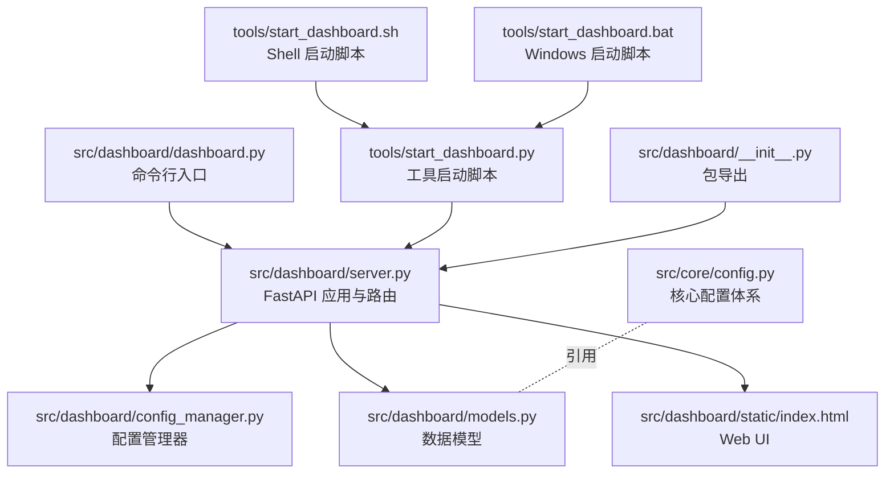
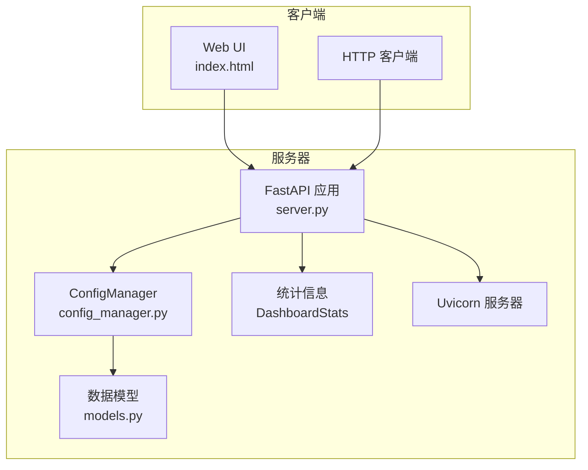
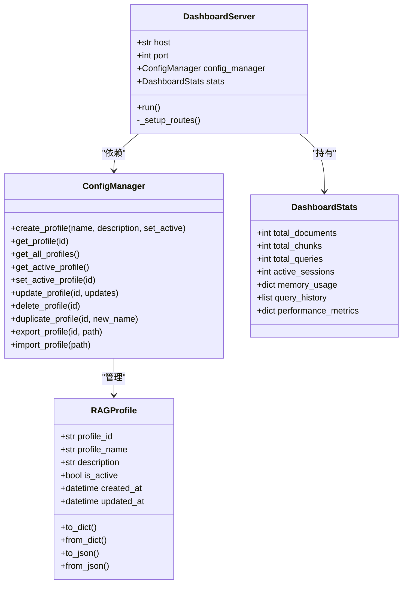
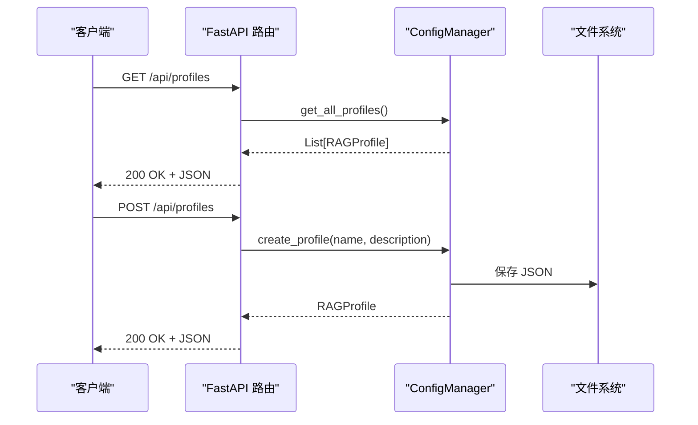
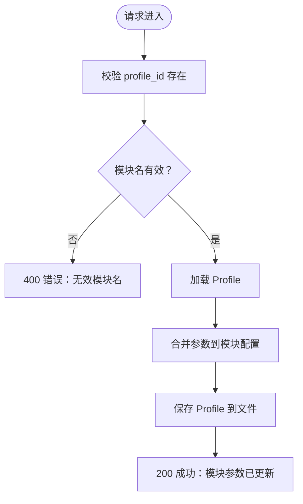
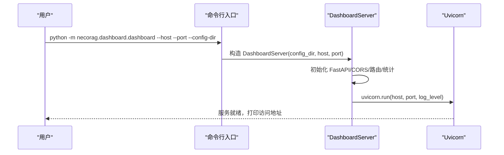
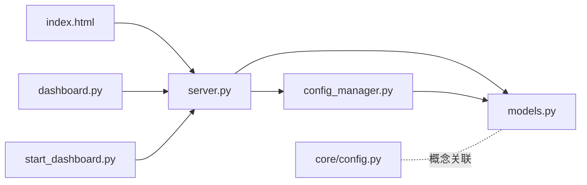

# Dashboard 服务器

<cite>
**本文引用的文件**
- [server.py](file://src/dashboard/server.py)
- [dashboard.py](file://src/dashboard/dashboard.py)
- [models.py](file://src/dashboard/models.py)
- [config_manager.py](file://src/dashboard/config_manager.py)
- [index.html](file://src/dashboard/static/index.html)
- [DASHBOARD_GUIDE.md](file://DASHBOARD_GUIDE.md)
- [README.md](file://src/dashboard/README.md)
- [start_dashboard.py](file://tools/start_dashboard.py)
- [start_dashboard.sh](file://tools/start_dashboard.sh)
- [start_dashboard.bat](file://tools/start_dashboard.bat)
- [__init__.py](file://src/dashboard/__init__.py)
- [config.py](file://src/core/config.py)
</cite>

## 目录
1. [简介](#简介)
2. [项目结构](#项目结构)
3. [核心组件](#核心组件)
4. [架构总览](#架构总览)
5. [详细组件分析](#详细组件分析)
6. [依赖关系分析](#依赖关系分析)
7. [性能考虑](#性能考虑)
8. [故障排查指南](#故障排查指南)
9. [结论](#结论)
10. [附录](#附录)

## 简介
本文件为 NecoRAG Dashboard 服务器组件的详细技术文档，涵盖 FastAPI 服务器实现架构、路由设计、中间件配置（CORS）、RESTful API 端点、Profile 管理、模块参数管理、统计信息 API、服务器启动流程、配置选项与运行参数、API 调用示例、错误处理机制以及性能优化与安全最佳实践。文档面向开发者与运维人员，帮助快速理解与使用 Dashboard 服务器。

## 项目结构
Dashboard 服务器位于 src/dashboard 目录，主要由以下模块组成：
- 服务器入口与 FastAPI 应用：server.py
- 启动脚本：dashboard.py
- 数据模型与配置：models.py
- 配置管理器：config_manager.py
- Web UI 静态资源：static/index.html
- 工具启动脚本：tools/start_dashboard.py、start_dashboard.sh、start_dashboard.bat
- 包导出：__init__.py
- 与核心配置体系的关系：core/config.py

图表来源
- [server.py:1-393](file://src/dashboard/server.py#L1-L393)
- [config_manager.py:1-315](file://src/dashboard/config_manager.py#L1-L315)
- [models.py:1-231](file://src/dashboard/models.py#L1-L231)
- [index.html:1-1026](file://src/dashboard/static/index.html#L1-L1026)
- [dashboard.py:1-31](file://src/dashboard/dashboard.py#L1-L31)
- [start_dashboard.py:1-56](file://tools/start_dashboard.py#L1-L56)
- [start_dashboard.sh:1-26](file://tools/start_dashboard.sh#L1-L26)
- [start_dashboard.bat:1-30](file://tools/start_dashboard.bat#L1-L30)
- [__init__.py:1-16](file://src/dashboard/__init__.py#L1-L16)
- [config.py:1-370](file://src/core/config.py#L1-L370)

章节来源
- [server.py:1-393](file://src/dashboard/server.py#L1-L393)
- [dashboard.py:1-31](file://src/dashboard/dashboard.py#L1-L31)
- [models.py:1-231](file://src/dashboard/models.py#L1-L231)
- [config_manager.py:1-315](file://src/dashboard/config_manager.py#L1-L315)
- [index.html:1-1026](file://src/dashboard/static/index.html#L1-L1026)
- [start_dashboard.py:1-56](file://tools/start_dashboard.py#L1-L56)
- [start_dashboard.sh:1-26](file://tools/start_dashboard.sh#L1-L26)
- [start_dashboard.bat:1-30](file://tools/start_dashboard.bat#L1-L30)
- [__init__.py:1-16](file://src/dashboard/__init__.py#L1-L16)
- [config.py:1-370](file://src/core/config.py#L1-L370)

## 核心组件
- DashboardServer：基于 FastAPI 的 Web 服务器，负责注册路由、配置 CORS、挂载静态资源、启动 Uvicorn 服务。
- ConfigManager：负责 Profile 的创建、读取、更新、删除、复制、导入导出、活动 Profile 切换与持久化。
- RAGProfile 与 ModuleConfig：定义 Profile 结构与各模块配置的数据模型。
- DashboardStats：提供统计信息聚合与重置能力。
- Web UI：提供直观的 Profile 管理与参数配置界面，支持模块切换、参数编辑、统计展示等。

章节来源
- [server.py:43-93](file://src/dashboard/server.py#L43-L93)
- [config_manager.py:14-41](file://src/dashboard/config_manager.py#L14-L41)
- [models.py:164-231](file://src/dashboard/models.py#L164-L231)
- [README.md:1-417](file://src/dashboard/README.md#L1-L417)

## 架构总览
Dashboard 服务器采用“控制器-服务-模型”三层结构：
- 控制器层：FastAPI 路由处理器，负责请求解析、参数校验、异常处理与响应。
- 服务层：ConfigManager，封装配置业务逻辑与持久化。
- 模型层：RAGProfile、ModuleConfig、DashboardStats，定义数据结构与序列化。

图表来源
- [server.py:72-93](file://src/dashboard/server.py#L72-L93)
- [config_manager.py:14-41](file://src/dashboard/config_manager.py#L14-L41)
- [models.py:164-231](file://src/dashboard/models.py#L164-L231)

## 详细组件分析

### FastAPI 服务器与路由设计
- 应用初始化：设置标题、描述、版本，并创建 FastAPI 实例。
- CORS 配置：允许任意源、凭证、方法与头，便于跨域访问。
- 路由注册：集中于 _setup_routes，包含 Profile 管理、模块参数管理、统计信息与 Web UI。
- 静态资源：挂载 static 目录，提供 UI 资源。
- 启动：通过 uvicorn.run(host, port, log_level) 启动服务。

图表来源
- [server.py:43-93](file://src/dashboard/server.py#L43-L93)
- [config_manager.py:14-41](file://src/dashboard/config_manager.py#L14-L41)
- [models.py:164-231](file://src/dashboard/models.py#L164-L231)

章节来源
- [server.py:72-93](file://src/dashboard/server.py#L72-L93)
- [server.py:94-253](file://src/dashboard/server.py#L94-L253)

### 中间件与 CORS 设置
- CORS 中间件：允许任意来源、方法与头，支持凭据，满足前端跨域访问需求。
- 安全建议：生产环境中建议限制 allow_origins 为可信域名，仅开放必要方法与头。

章节来源
- [server.py:79-86](file://src/dashboard/server.py#L79-L86)

### Profile 管理 API
- 获取所有 Profiles：GET /api/profiles
- 获取单个 Profile：GET /api/profiles/{profile_id}
- 获取活动 Profile：GET /api/profiles/active
- 创建 Profile：POST /api/profiles
- 更新 Profile：PUT /api/profiles/{profile_id}
- 删除 Profile：DELETE /api/profiles/{profile_id}
- 激活 Profile：POST /api/profiles/{profile_id}/activate
- 复制 Profile：POST /api/profiles/{profile_id}/duplicate
- 导出 Profile：POST /api/profiles/{profile_id}/export
- 导入 Profile：POST /api/profiles/import

图表来源
- [server.py:99-179](file://src/dashboard/server.py#L99-L179)
- [config_manager.py:42-74](file://src/dashboard/config_manager.py#L42-L74)

章节来源
- [server.py:99-179](file://src/dashboard/server.py#L99-L179)
- [config_manager.py:42-194](file://src/dashboard/config_manager.py#L42-L194)

### 模块参数管理 API
- 获取模块参数：GET /api/profiles/{profile_id}/modules/{module}
- 更新模块参数：PUT /api/profiles/{profile_id}/modules/{module}

支持模块：whiskers、memory、retrieval、grooming、purr。更新时将参数合并到对应模块配置。

图表来源
- [server.py:183-216](file://src/dashboard/server.py#L183-L216)
- [config_manager.py:135-166](file://src/dashboard/config_manager.py#L135-L166)

章节来源
- [server.py:183-216](file://src/dashboard/server.py#L183-L216)
- [config_manager.py:135-166](file://src/dashboard/config_manager.py#L135-L166)

### 统计信息 API
- 获取统计信息：GET /api/stats
- 重置统计信息：POST /api/stats/reset

统计字段：文档总数、块总数、查询总数、活动会话、内存使用、查询历史、性能指标。

章节来源
- [server.py:219-236](file://src/dashboard/server.py#L219-L236)
- [models.py:221-231](file://src/dashboard/models.py#L221-L231)

### Web UI 与静态资源
- 根路径：返回 Web UI 或回退的简单 HTML。
- 静态资源：/static 目录挂载，提供 UI 资源。
- UI 功能：Profile 列表、参数编辑器、活动切换、统计面板、定时刷新。

章节来源
- [server.py:239-253](file://src/dashboard/server.py#L239-L253)
- [server.py:254-377](file://src/dashboard/server.py#L254-L377)
- [index.html:1-1026](file://src/dashboard/static/index.html#L1-L1026)

### 服务器启动流程与运行参数
- 命令行入口：dashboard.py 支持 --host、--port、--config-dir 参数。
- 工具启动脚本：tools/start_dashboard.py 提供相同参数。
- Shell/Windows 启动脚本：start_dashboard.sh、start_dashboard.bat 提供便捷启动。
- 启动行为：创建 DashboardServer 实例并调用 run()，打印访问地址与 API 文档地址。

图表来源
- [dashboard.py:10-26](file://src/dashboard/dashboard.py#L10-L26)
- [server.py:379-392](file://src/dashboard/server.py#L379-L392)
- [start_dashboard.py:16-51](file://tools/start_dashboard.py#L16-L51)

章节来源
- [dashboard.py:10-26](file://src/dashboard/dashboard.py#L10-L26)
- [start_dashboard.py:16-51](file://tools/start_dashboard.py#L16-L51)
- [start_dashboard.sh:16-25](file://tools/start_dashboard.sh#L16-L25)
- [start_dashboard.bat:18-27](file://tools/start_dashboard.bat#L18-L27)
- [server.py:379-392](file://src/dashboard/server.py#L379-L392)

## 依赖关系分析
- server.py 依赖 config_manager.py 与 models.py。
- config_manager.py 依赖 models.py，并使用文件系统进行持久化。
- Web UI 依赖 server.py 提供的 API。
- 启动脚本与命令行入口均指向 DashboardServer。
- 核心配置体系（core/config.py）与 Dashboard 的数据模型存在概念关联，但不直接耦合。

图表来源
- [server.py:15-16](file://src/dashboard/server.py#L15-L16)
- [config_manager.py](file://src/dashboard/config_manager.py#L11)
- [models.py:1-10](file://src/dashboard/models.py#L1-L10)
- [index.html:1-1026](file://src/dashboard/static/index.html#L1-L1026)
- [dashboard.py:6-7](file://src/dashboard/dashboard.py#L6-L7)
- [start_dashboard.py](file://tools/start_dashboard.py#L13)
- [config.py:1-370](file://src/core/config.py#L1-L370)

章节来源
- [server.py:15-16](file://src/dashboard/server.py#L15-L16)
- [config_manager.py](file://src/dashboard/config_manager.py#L11)
- [models.py:1-10](file://src/dashboard/models.py#L1-L10)
- [config.py:1-370](file://src/core/config.py#L1-L370)

## 性能考虑
- 配置缓存：ConfigManager 在内存中缓存所有 Profile，避免频繁磁盘 IO。
- 批量更新：建议使用模块参数更新接口一次性提交多个参数，减少 API 调用次数。
- 定时刷新：UI 使用定时器每 5 秒刷新统计信息，可根据实际需求调整频率。
- 静态资源：通过 Uvicorn 静态文件挂载提供 UI 资源，减少额外中间层开销。
- CORS：生产环境建议收紧 allow_origins，仅允许受信任来源，降低跨域风险与不必要的头部处理。

章节来源
- [config_manager.py:35-40](file://src/dashboard/config_manager.py#L35-L40)
- [server.py:79-86](file://src/dashboard/server.py#L79-L86)
- [index.html:729-730](file://src/dashboard/static/index.html#L729-L730)

## 故障排查指南
- 无法访问 Dashboard：检查端口是否被占用，或使用 --port 参数更换端口。
- 配置保存失败：检查配置目录写权限，或使用 --config-dir 指定可写目录。
- API 返回 404：确认 Profile ID 是否正确，先调用获取所有 Profiles 接口获取有效 ID。
- 导入/导出失败：检查文件路径与权限，确认 JSON 格式正确。
- CORS 问题：生产环境需限制 allow_origins，仅允许受信任域名。

章节来源
- [DASHBOARD_GUIDE.md:281-305](file://DASHBOARD_GUIDE.md#L281-L305)
- [server.py:108-110](file://src/dashboard/server.py#L108-L110)
- [server.py:168-170](file://src/dashboard/server.py#L168-L170)
- [server.py:176-178](file://src/dashboard/server.py#L176-L178)

## 结论
Dashboard 服务器以 FastAPI 为核心，结合 ConfigManager 与数据模型，提供了完整的 Profile 管理、模块参数配置与统计信息展示能力。其路由设计清晰、中间件配置合理、启动流程简洁，适合在开发与生产环境中快速部署与使用。建议在生产环境中收紧 CORS 策略、优化参数更新策略并加强日志与监控，以提升安全性与可观测性。

## 附录

### API 端点一览
- Profile 管理
  - GET /api/profiles
  - GET /api/profiles/{profile_id}
  - GET /api/profiles/active
  - POST /api/profiles
  - PUT /api/profiles/{profile_id}
  - DELETE /api/profiles/{profile_id}
  - POST /api/profiles/{profile_id}/activate
  - POST /api/profiles/{profile_id}/duplicate
  - POST /api/profiles/{profile_id}/export
  - POST /api/profiles/import
- 模块参数管理
  - GET /api/profiles/{profile_id}/modules/{module}
  - PUT /api/profiles/{profile_id}/modules/{module}
- 统计信息
  - GET /api/stats
  - POST /api/stats/reset
- Web UI
  - GET /
  - GET /static/*

章节来源
- [server.py:99-236](file://src/dashboard/server.py#L99-L236)
- [server.py:239-253](file://src/dashboard/server.py#L239-L253)

### 运行参数
- --host：监听地址，默认 0.0.0.0
- --port：监听端口，默认 8000
- --config-dir：配置文件目录，默认 ./configs

章节来源
- [dashboard.py:12-15](file://src/dashboard/dashboard.py#L12-L15)
- [start_dashboard.py:20-40](file://tools/start_dashboard.py#L20-L40)

### Web UI 功能要点
- Profile 列表与活动状态高亮
- 模块参数编辑器（感知、记忆、检索、巩固、交互）
- 统计面板与定时刷新
- 创建、删除、激活、保存配置等操作按钮

章节来源
- [index.html:446-692](file://src/dashboard/static/index.html#L446-L692)
- [server.py:254-377](file://src/dashboard/server.py#L254-L377)