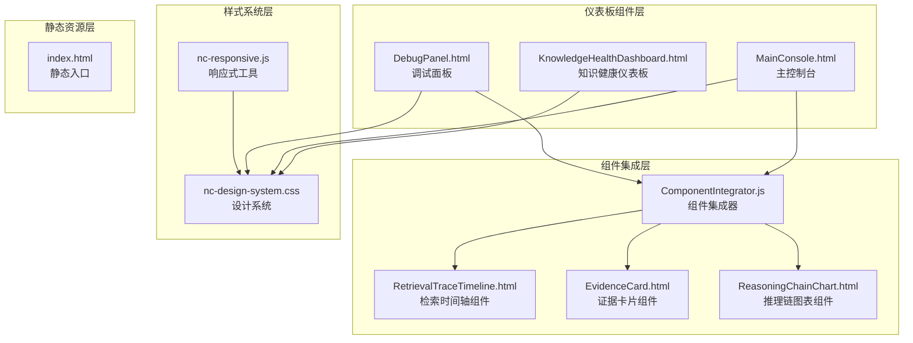
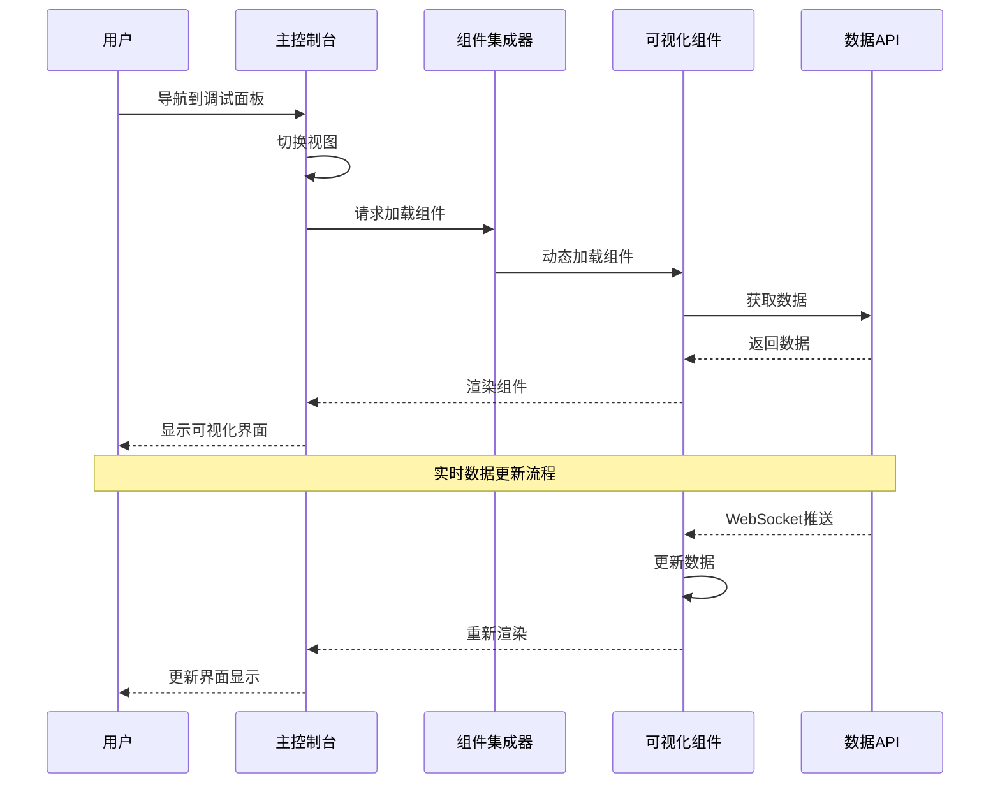
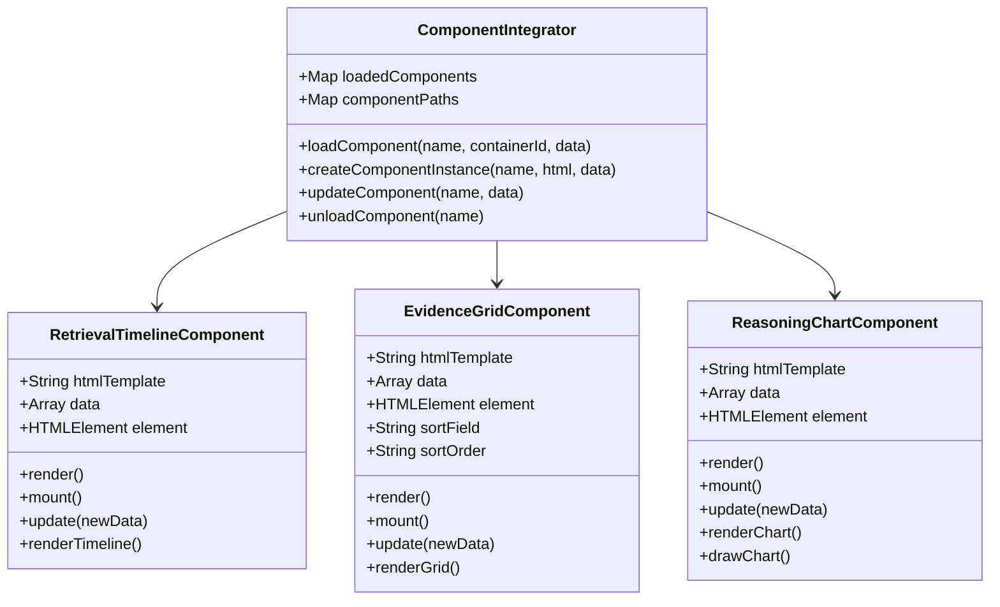
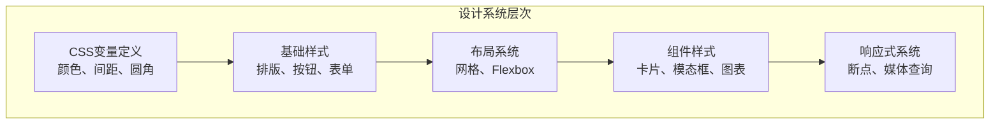
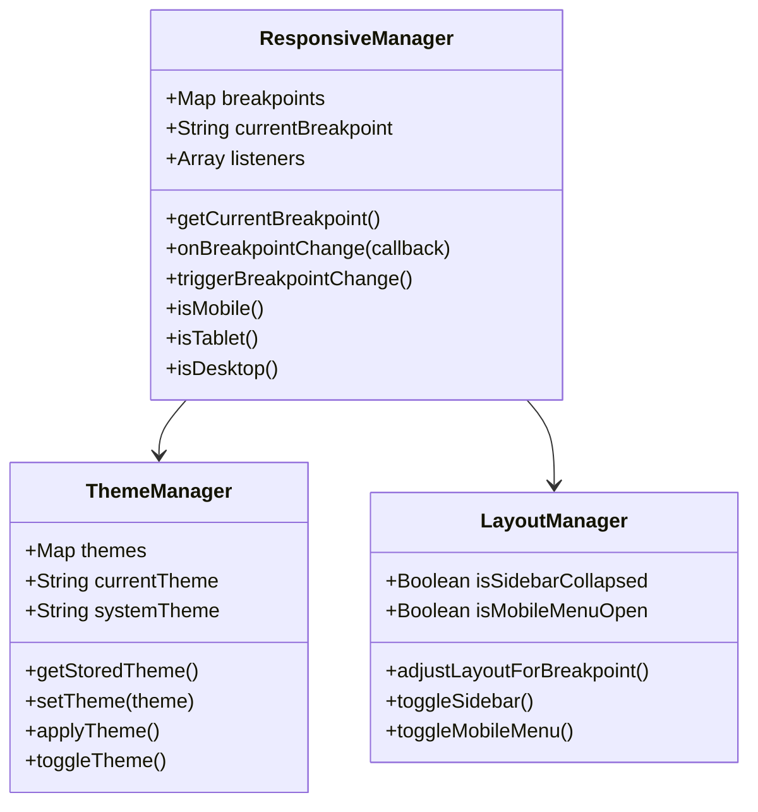
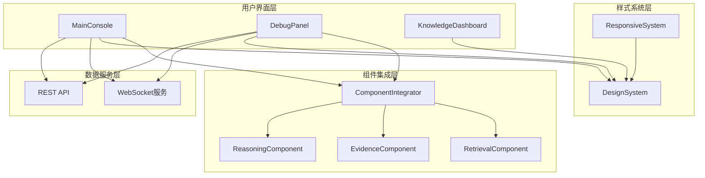

# UI组件系统

<cite>
**本文档引用的文件**
- [MainConsole.html](file://src/dashboard/components/MainConsole.html)
- [DebugPanel.html](file://src/dashboard/components/DebugPanel.html)
- [KnowledgeHealthDashboard.html](file://src/dashboard/components/KnowledgeHealthDashboard.html)
- [ComponentIntegrator.js](file://src/dashboard/components/ComponentIntegrator.js)
- [nc-design-system.css](file://src/dashboard/static/css/nc-design-system.css)
- [nc-responsive.js](file://src/dashboard/static/js/nc-responsive.js)
- [RetrievalTraceTimeline.html](file://src/dashboard/components/RetrievalTraceTimeline.html)
- [EvidenceCard.html](file://src/dashboard/components/EvidenceCard.html)
- [ReasoningChainChart.html](file://src/dashboard/components/ReasoningChainChart.html)
- [index.html](file://src/dashboard/static/index.html)
</cite>

## 目录
1. [引言](#引言)
2. [项目结构](#项目结构)
3. [核心组件](#核心组件)
4. [架构概览](#架构概览)
5. [详细组件分析](#详细组件分析)
6. [依赖关系分析](#依赖关系分析)
7. [性能考虑](#性能考虑)
8. [故障排除指南](#故障排除指南)
9. [结论](#结论)

## 引言

NecoRAG仪表板UI组件系统是一个基于Web的可视化监控和调试平台，为人工智能系统提供实时的状态监控、性能分析和调试功能。该系统采用模块化设计，通过统一的设计语言和响应式布局，为用户提供直观的数据可视化体验。

系统主要包含三个核心界面组件：主控制台（MainConsole.html）、调试面板（DebugPanel.html）和知识健康仪表板（KnowledgeHealthDashboard.html），以及一套完整的组件集成机制和样式系统。

## 项目结构

仪表板UI组件系统采用清晰的分层架构，按照功能模块进行组织：

**图表来源**
- [MainConsole.html:1-755](file://src/dashboard/components/MainConsole.html#L1-L755)
- [DebugPanel.html:1-899](file://src/dashboard/components/DebugPanel.html#L1-L899)
- [KnowledgeHealthDashboard.html:1-892](file://src/dashboard/components/KnowledgeHealthDashboard.html#L1-L892)
- [ComponentIntegrator.js:1-656](file://src/dashboard/components/ComponentIntegrator.js#L1-L656)

**章节来源**
- [MainConsole.html:1-755](file://src/dashboard/components/MainConsole.html#L1-L755)
- [DebugPanel.html:1-899](file://src/dashboard/components/DebugPanel.html#L1-L899)
- [KnowledgeHealthDashboard.html:1-892](file://src/dashboard/components/KnowledgeHealthDashboard.html#L1-L892)

## 核心组件

### 主控制台组件（MainConsole）

主控制台是仪表板的核心界面，提供系统状态监控和导航功能。其设计特点包括：

- **响应式布局**：支持桌面、平板和移动设备的自适应显示
- **主题系统**：内置明暗主题切换功能
- **实时数据更新**：通过WebSocket连接实现实时状态同步
- **模块化导航**：支持多个功能模块的快速切换

### 调试面板组件（DebugPanel）

调试面板专注于AI系统的调试和分析功能：

- **会话管理**：支持多会话的创建、管理和监控
- **实时调试**：通过WebSocket提供实时的推理过程跟踪
- **组件化架构**：使用组件集成器动态加载可视化组件
- **多视图支持**：提供概览、检索路径、证据来源、推理过程等多种视图

### 知识健康仪表板组件（KnowledgeHealthDashboard）

专门用于监控知识库健康状况的可视化界面：

- **综合健康评分**：提供知识库的整体健康度评估
- **多维度分析**：涵盖知识量、增长趋势、领域覆盖等多个指标
- **可视化图表**：使用SVG绘制仪表盘、趋势图和雷达图
- **实时更新**：定期从API获取最新数据进行更新

**章节来源**
- [MainConsole.html:310-540](file://src/dashboard/components/MainConsole.html#L310-L540)
- [DebugPanel.html:284-409](file://src/dashboard/components/DebugPanel.html#L284-L409)
- [KnowledgeHealthDashboard.html:485-591](file://src/dashboard/components/KnowledgeHealthDashboard.html#L485-L591)

## 架构概览

系统采用组件化的架构设计，通过统一的组件集成器实现模块间的解耦：

**图表来源**
- [ComponentIntegrator.js:19-56](file://src/dashboard/components/ComponentIntegrator.js#L19-L56)
- [DebugPanel.html:734-774](file://src/dashboard/components/DebugPanel.html#L734-L774)

**章节来源**
- [ComponentIntegrator.js:6-94](file://src/dashboard/components/ComponentIntegrator.js#L6-L94)

## 详细组件分析

### 组件集成器（ComponentIntegrator）

组件集成器是整个系统的核心架构组件，负责动态加载和管理各种可视化组件：

**图表来源**
- [ComponentIntegrator.js:6-94](file://src/dashboard/components/ComponentIntegrator.js#L6-L94)
- [ComponentIntegrator.js:99-261](file://src/dashboard/components/ComponentIntegrator.js#L99-L261)
- [ComponentIntegrator.js:266-445](file://src/dashboard/components/ComponentIntegrator.js#L266-L445)
- [ComponentIntegrator.js:450-649](file://src/dashboard/components/ComponentIntegrator.js#L450-L649)

组件集成器的主要功能包括：

- **动态组件加载**：根据组件名称动态加载对应的HTML模板
- **组件实例管理**：维护已加载组件的实例和状态
- **数据绑定**：支持组件数据的更新和重新渲染
- **生命周期管理**：提供组件的创建、更新和销毁功能

**章节来源**
- [ComponentIntegrator.js:1-656](file://src/dashboard/components/ComponentIntegrator.js#L1-L656)

### 检索时间轴组件（RetrievalTraceTimeline）

检索时间轴组件专门用于展示AI系统的检索过程：

- **步骤可视化**：以时间轴形式展示检索的各个步骤
- **状态指示**：通过不同颜色和图标表示步骤状态
- **交互功能**：支持步骤的点击和高亮显示
- **实时更新**：通过WebSocket接收实时的步骤更新

### 证据网格组件（EvidenceCard）

证据网格组件用于展示和管理AI系统的证据来源：

- **网格布局**：采用响应式网格布局展示多个证据卡片
- **质量分类**：根据相关度对证据进行质量分类
- **过滤功能**：支持按来源和质量的多维度过滤
- **排序功能**：支持按相关度、时间和来源的排序

### 推理链图表组件（ReasoningChainChart）

推理链图表组件提供推理过程的可视化分析：

- **多图表组合**：包含置信度趋势、迭代次数分布、证据使用矩阵等图表
- **交互式图表**：支持图表的切换、排序和重置功能
- **统计分析**：提供推理过程的关键统计指标
- **幻觉检测**：通过仪表盘形式展示幻觉检测结果

**章节来源**
- [RetrievalTraceTimeline.html:1-572](file://src/dashboard/components/RetrievalTraceTimeline.html#L1-L572)
- [EvidenceCard.html:1-740](file://src/dashboard/components/EvidenceCard.html#L1-L740)
- [ReasoningChainChart.html:1-857](file://src/dashboard/components/ReasoningChainChart.html#L1-L857)

### 设计系统（nc-design-system.css）

设计系统提供了统一的视觉语言和组件规范：

**图表来源**
- [nc-design-system.css:6-106](file://src/dashboard/static/css/nc-design-system.css#L6-L106)
- [nc-design-system.css:108-123](file://src/dashboard/static/css/nc-design-system.css#L108-L123)

设计系统的核心特性：

- **CSS变量系统**：使用CSS自定义属性实现主题和样式的统一管理
- **响应式断点**：定义了完整的响应式断点系统
- **组件化样式**：提供完整的UI组件样式规范
- **暗色主题支持**：内置完整的明暗主题切换机制

**章节来源**
- [nc-design-system.css:1-680](file://src/dashboard/static/css/nc-design-system.css#L1-L680)

### 响应式工具库（nc-responsive.js）

响应式工具库提供了完整的响应式解决方案：

**图表来源**
- [nc-responsive.js:6-126](file://src/dashboard/static/js/nc-responsive.js#L6-L126)
- [nc-responsive.js:128-236](file://src/dashboard/static/js/nc-responsive.js#L128-L236)
- [nc-responsive.js:238-391](file://src/dashboard/static/js/nc-responsive.js#L238-L391)

响应式工具库的功能包括：

- **断点管理**：提供完整的响应式断点检测和管理
- **主题切换**：支持明暗主题的自动切换和手动控制
- **布局管理**：根据屏幕尺寸自动调整布局结构
- **事件系统**：提供断点变化和主题变化的事件监听

**章节来源**
- [nc-responsive.js:1-822](file://src/dashboard/static/js/nc-responsive.js#L1-L822)

## 依赖关系分析

系统各组件之间的依赖关系呈现清晰的层次结构：

**图表来源**
- [MainConsole.html:542-753](file://src/dashboard/components/MainConsole.html#L542-L753)
- [DebugPanel.html:411-800](file://src/dashboard/components/DebugPanel.html#L411-L800)
- [ComponentIntegrator.js:19-56](file://src/dashboard/components/ComponentIntegrator.js#L19-L56)

**章节来源**
- [MainConsole.html:542-753](file://src/dashboard/components/MainConsole.html#L542-L753)
- [DebugPanel.html:411-800](file://src/dashboard/components/DebugPanel.html#L411-L800)

## 性能考虑

系统在设计时充分考虑了性能优化：

### 组件懒加载
- 仅在需要时加载和渲染组件
- 使用Map缓存已加载的组件实例
- 支持组件的动态卸载和内存释放

### 数据更新优化
- WebSocket连接实现数据的实时推送
- 定时轮询与实时推送相结合
- 数据更新时只更新变化的部分

### 样式性能
- CSS变量减少样式计算开销
- 预编译的CSS减少运行时计算
- 响应式断点预定义避免运行时计算

### 渲染优化
- 虚拟滚动支持大数据集的高效渲染
- 防抖和节流机制优化用户交互响应
- CSS硬件加速优化动画性能

## 故障排除指南

### 常见问题及解决方案

**组件加载失败**
- 检查组件路径配置是否正确
- 确认组件HTML文件是否存在
- 验证网络连接和权限设置

**WebSocket连接问题**
- 检查服务器端WebSocket服务状态
- 验证防火墙和代理设置
- 确认客户端连接URL配置

**样式显示异常**
- 检查CSS文件加载状态
- 验证浏览器兼容性
- 确认CSS变量定义完整性

**响应式布局问题**
- 检查断点配置是否正确
- 验证媒体查询语法
- 确认移动端触摸事件处理

**章节来源**
- [ComponentIntegrator.js:52-55](file://src/dashboard/components/ComponentIntegrator.js#L52-L55)
- [nc-responsive.js:116-125](file://src/dashboard/static/js/nc-responsive.js#L116-L125)

## 结论

NecoRAG仪表板UI组件系统通过模块化的设计和组件化的架构，为AI系统的监控和调试提供了完整的技术解决方案。系统具有以下优势：

**设计优势**
- 统一的设计语言和响应式布局
- 完整的主题系统和视觉规范
- 清晰的组件层次和职责分离

**技术优势**
- 动态组件加载和管理机制
- 实时数据更新和交互功能
- 完善的错误处理和故障恢复

**扩展性**
- 插件化的组件架构支持功能扩展
- 标准化的API接口便于集成
- 灵活的配置系统支持定制化需求

该系统为AI系统的开发、调试和运维提供了强大的可视化支持，通过持续的优化和改进，能够满足复杂应用场景的需求。