# 专用组件集合

<cite>
**本文档引用的文件**
- [EvidenceCard.html](file://src/dashboard/components/EvidenceCard.html)
- [ReasoningChainChart.html](file://src/dashboard/components/ReasoningChainChart.html)
- [RecommendationEngine.html](file://src/dashboard/components/RecommendationEngine.html)
- [ABTesting.html](file://src/dashboard/components/ABTesting.html)
- [ParameterTuning.html](file://src/dashboard/components/ParameterTuning.html)
- [PathAnalysis.html](file://src/dashboard/components/PathAnalysis.html)
- [RetrievalTraceTimeline.html](file://src/dashboard/components/RetrievalTraceTimeline.html)
- [ComponentIntegrator.js](file://src/dashboard/components/ComponentIntegrator.js)
- [api.py](file://src/dashboard/debug/api.py)
- [models.py](file://src/dashboard/models.py)
</cite>

## 目录
1. [引言](#引言)
2. [项目结构](#项目结构)
3. [核心组件](#核心组件)
4. [架构概览](#架构概览)
5. [详细组件分析](#详细组件分析)
6. [依赖关系分析](#依赖关系分析)
7. [性能考虑](#性能考虑)
8. [故障排除指南](#故障排除指南)
9. [结论](#结论)

## 引言

专用组件集合是NecoRAG智能问答系统的核心可视化组件库，包含7个专门设计的前端组件，用于展示和分析系统的各项功能表现。这些组件通过统一的集成框架实现了模块化的组件管理和实时数据更新，为开发者和用户提供了一个完整的调试和分析平台。

本组件集合涵盖了证据来源可视化、推理过程分析、推荐引擎界面、A/B测试管理、参数调优面板、路径分析工具和检索轨迹时间轴等核心功能模块，每个组件都经过精心设计，具有独特的视觉效果和交互体验。

## 项目结构

专用组件集合位于项目的`src/dashboard/components/`目录下，采用模块化组织方式：

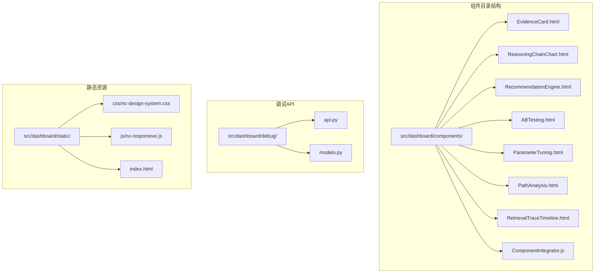

**图表来源**
- [EvidenceCard.html:1-740](file://src/dashboard/components/EvidenceCard.html#L1-L740)
- [ComponentIntegrator.js:1-656](file://src/dashboard/components/ComponentIntegrator.js#L1-L656)

**章节来源**
- [EvidenceCard.html:1-740](file://src/dashboard/components/EvidenceCard.html#L1-L740)
- [ComponentIntegrator.js:1-656](file://src/dashboard/components/ComponentIntegrator.js#L1-L656)

## 核心组件

专用组件集合包含以下7个核心组件，每个组件都有其特定的功能定位和设计特色：

### 组件功能概览

| 组件名称 | 主要功能 | 数据来源 | 交互特性 |
|---------|----------|----------|----------|
| EvidenceCard | 证据来源可视化展示 | 会话调试数据 | 实时过滤、排序、分页 |
| ReasoningChainChart | 推理过程图表分析 | 推理链数据 | 多维度图表、动态更新 |
| RecommendationEngine | 优化建议引擎界面 | 推荐算法结果 | 实时建议、模式检测 |
| ABTesting | A/B测试管理面板 | 测试配置数据 | 实时状态更新、统计分析 |
| ParameterTuning | 参数调优面板 | 参数配置数据 | 实时参数调整、实验管理 |
| PathAnalysis | 路径分析工具 | 路径分析结果 | 可视化路径、瓶颈识别 |
| RetrievalTraceTimeline | 检索路径时间轴 | 检索步骤数据 | 实时时间轴、进度跟踪 |

### 设计架构

所有组件采用统一的设计语言和交互模式：

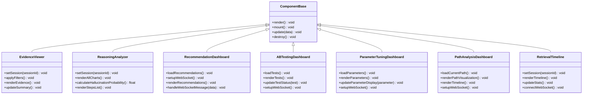

**图表来源**
- [EvidenceCard.html:414-740](file://src/dashboard/components/EvidenceCard.html#L414-L740)
- [ReasoningChainChart.html:506-800](file://src/dashboard/components/ReasoningChainChart.html#L506-L800)
- [RecommendationEngine.html:644-800](file://src/dashboard/components/RecommendationEngine.html#L644-L800)
- [ABTesting.html:582-800](file://src/dashboard/components/ABTesting.html#L582-L800)
- [ParameterTuning.html:520-800](file://src/dashboard/components/ParameterTuning.html#L520-L800)
- [PathAnalysis.html:479-800](file://src/dashboard/components/PathAnalysis.html#L479-L800)
- [RetrievalTraceTimeline.html:299-572](file://src/dashboard/components/RetrievalTraceTimeline.html#L299-L572)

**章节来源**
- [ComponentIntegrator.js:6-94](file://src/dashboard/components/ComponentIntegrator.js#L6-L94)

## 架构概览

专用组件集合采用分层架构设计，通过统一的集成器管理各个组件的生命周期：

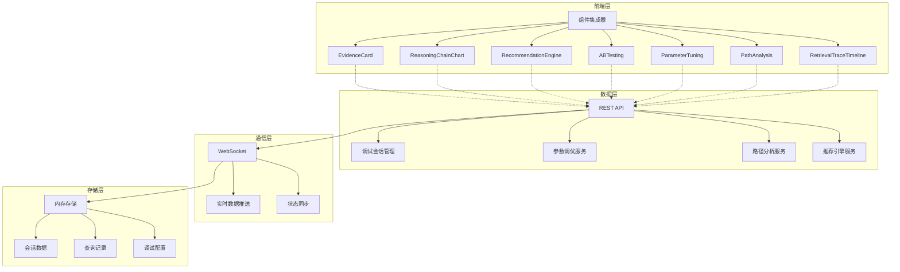

**图表来源**
- [ComponentIntegrator.js:1-656](file://src/dashboard/components/ComponentIntegrator.js#L1-L656)
- [api.py:1-557](file://src/dashboard/debug/api.py#L1-L557)

### 数据流架构

组件间的数据流遵循统一的模式：

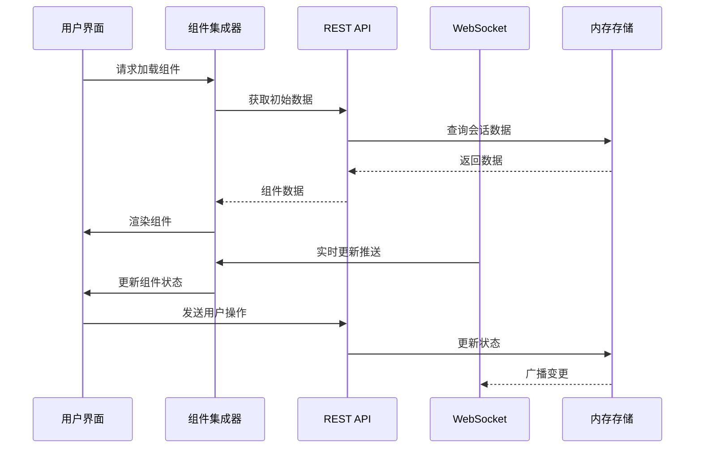

**图表来源**
- [ComponentIntegrator.js:19-56](file://src/dashboard/components/ComponentIntegrator.js#L19-L56)
- [api.py:130-146](file://src/dashboard/debug/api.py#L130-L146)

**章节来源**
- [api.py:1-557](file://src/dashboard/debug/api.py#L1-L557)
- [models.py:1-232](file://src/dashboard/models.py#L1-L232)

## 详细组件分析

### EvidenceCard组件分析

EvidenceCard组件专注于证据来源的可视化展示，提供了完整的证据管理界面：

#### 核心功能特性

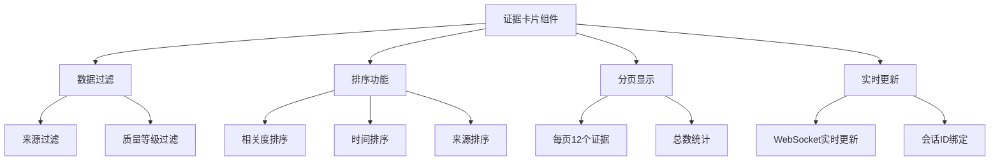

**图表来源**
- [EvidenceCard.html:414-740](file://src/dashboard/components/EvidenceCard.html#L414-L740)

#### 数据结构设计

组件使用以下数据结构来管理证据信息：

| 字段名 | 类型 | 描述 | 示例值 |
|--------|------|------|--------|
| evidence_id | String | 证据唯一标识符 | "evidence_001" |
| content | String | 证据内容 | "检索到的相关文档内容" |
| source | String | 证据来源类型 | "vector/graph/hyde/web" |
| relevance_score | Float | 相关度评分 | 0.85 |
| retrieval_time | String | 检索时间 | "2024-01-15T10:30:00Z" |
| source_url | String | 来源链接 | "https://example.com" |
| evidence_type | String | 证据类型 | "document/paragraph" |

#### 交互逻辑

组件实现了完整的用户交互流程：

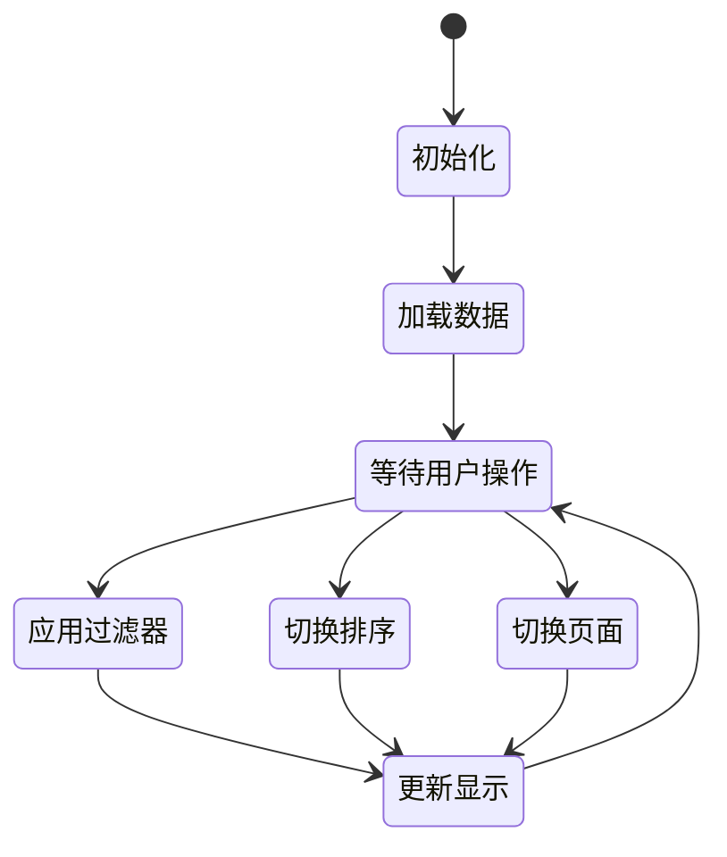

**图表来源**
- [EvidenceCard.html:471-520](file://src/dashboard/components/EvidenceCard.html#L471-L520)

**章节来源**
- [EvidenceCard.html:1-740](file://src/dashboard/components/EvidenceCard.html#L1-L740)

### ReasoningChainChart组件分析

ReasoningChainChart组件提供推理过程的多维度可视化分析：

#### 图表组件设计

组件包含四个核心图表区域：

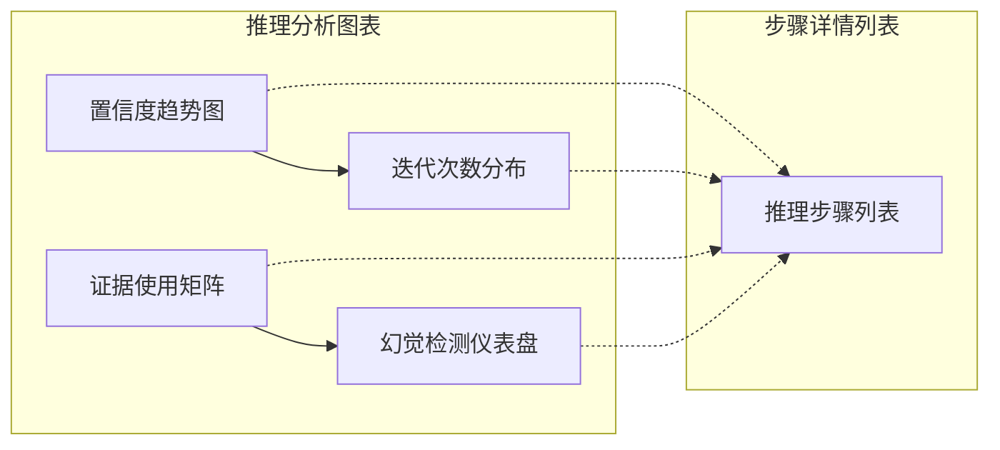

**图表来源**
- [ReasoningChainChart.html:506-800](file://src/dashboard/components/ReasoningChainChart.html#L506-L800)

#### 置信度趋势分析

置信度趋势图采用线条和点状结合的方式展示推理过程：

| 图表元素 | 功能描述 | 交互特性 |
|----------|----------|----------|
| 趋势线条 | 展示置信度随迭代变化 | 悬停显示详细信息 |
| 点状标记 | 标识每次迭代的置信度 | 不同颜色表示置信度等级 |
| 悬停提示 | 显示迭代详情和决策内容 | 实时信息展示 |
| 视图切换 | 支持线条图和柱状图切换 | 动态图表渲染 |

#### 证据使用矩阵

证据使用矩阵采用网格布局展示证据在不同迭代中的使用情况：

| 矩阵维度 | 描述 | 视觉编码 |
|----------|------|----------|
| 行方向 | 推理迭代步骤 | 时间序列排列 |
| 列方向 | 使用的证据ID | 证据标识符 |
| 单元格状态 | 证据使用情况 | ✓表示使用，空白表示未使用 |
| 颜色编码 | 使用程度 | 绿色表示完全使用，黄色表示部分使用 |

#### 幻觉检测仪表盘

幻觉检测采用半圆形仪表盘设计：

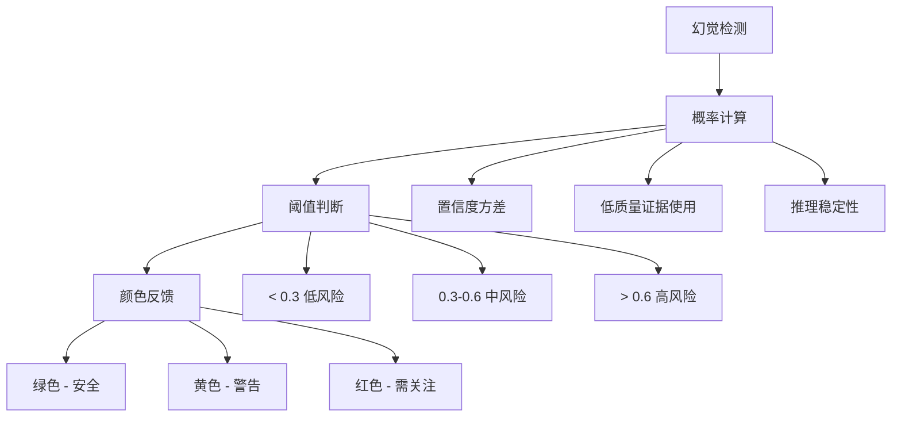

**图表来源**
- [ReasoningChainChart.html:679-701](file://src/dashboard/components/ReasoningChainChart.html#L679-L701)

**章节来源**
- [ReasoningChainChart.html:1-857](file://src/dashboard/components/ReasoningChainChart.html#L1-L857)

### RecommendationEngine组件分析

RecommendationEngine组件提供智能化的优化建议生成和管理界面：

#### 布局架构设计

组件采用双面板布局设计：

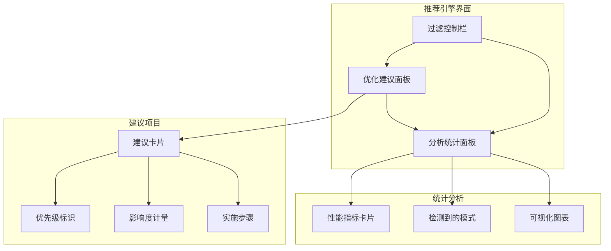

**图表来源**
- [RecommendationEngine.html:644-800](file://src/dashboard/components/RecommendationEngine.html#L644-L800)

#### 建议分类体系

组件支持多种建议类型的分类：

| 建议类型 | 优先级 | 影响范围 | 实施难度 |
|----------|--------|----------|----------|
| 性能优化 | Critical/High/Medium/Low | 系统性能 | 低/中/高 |
| 质量提升 | Critical/High/Medium/Low | 输出质量 | 低/中/高 |
| 成本优化 | Critical/High/Medium/Low | 运行成本 | 低/中/高 |
| 可扩展性 | Critical/High/Medium/Low | 系统扩展 | 低/中/高 |

#### 实时数据更新机制

组件通过WebSocket实现实时数据更新：

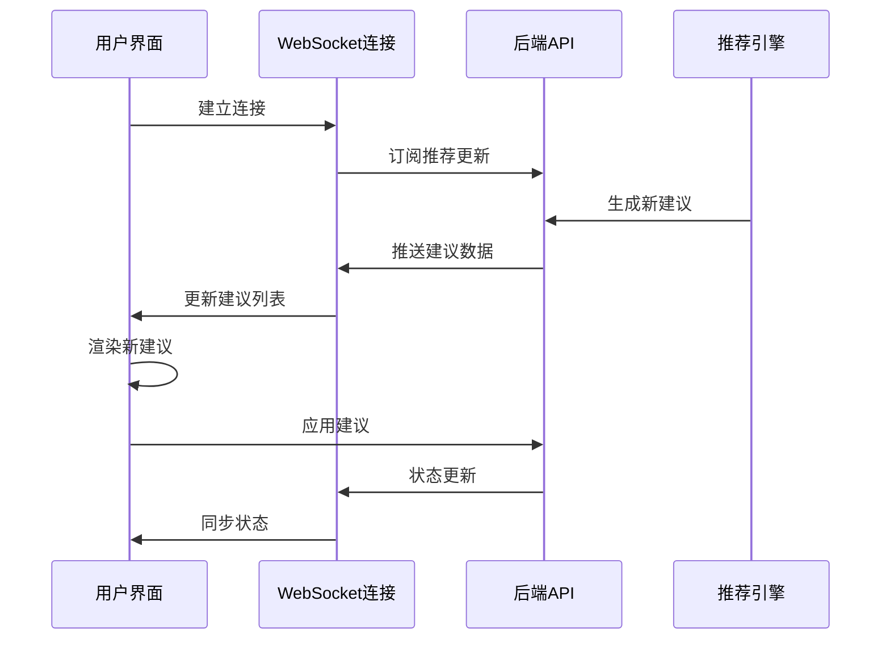

**图表来源**
- [RecommendationEngine.html:694-716](file://src/dashboard/components/RecommendationEngine.html#L694-L716)

**章节来源**
- [RecommendationEngine.html:1-1192](file://src/dashboard/components/RecommendationEngine.html#L1-L1192)

### ABTesting组件分析

ABTesting组件提供完整的A/B测试管理功能：

#### 测试管理界面

组件采用双面板设计，左侧显示测试列表，右侧显示统计概览：

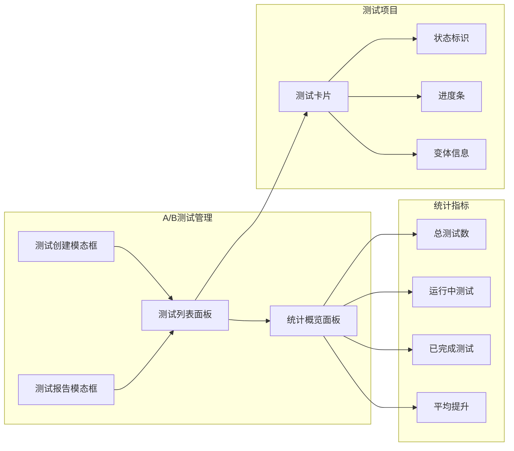

**图表来源**
- [ABTesting.html:582-800](file://src/dashboard/components/ABTesting.html#L582-L800)

#### 测试状态管理

组件支持完整的测试生命周期管理：

| 测试状态 | 颜色标识 | 功能权限 | 描述 |
|----------|----------|----------|------|
| Pending | 蓝色 | 启动测试 | 待启动状态，可启动测试 |
| Running | 黄色 | 暂停测试 | 测试进行中，可暂停 |
| Paused | 灰色 | 恢复测试 | 测试暂停，可恢复 |
| Completed | 绿色 | 查看报告 | 测试完成，可查看报告 |
| Failed | 红色 | 重新启动 | 测试失败，可重新启动 |

#### 变体配置管理

组件支持多变体测试配置：

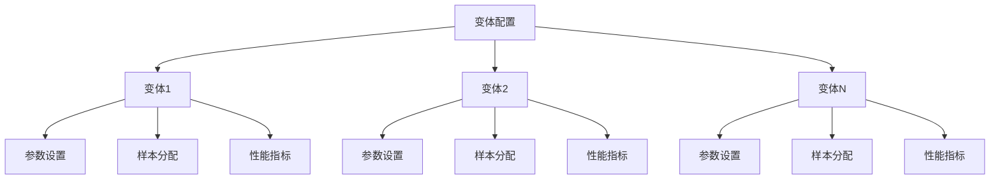

**图表来源**
- [ABTesting.html:582-800](file://src/dashboard/components/ABTesting.html#L582-L800)

**章节来源**
- [ABTesting.html:1-1160](file://src/dashboard/components/ABTesting.html#L1-L1160)

### ParameterTuning组件分析

ParameterTuning组件提供参数调优的可视化界面：

#### 参数配置面板

组件采用分类布局展示不同类型的参数配置：

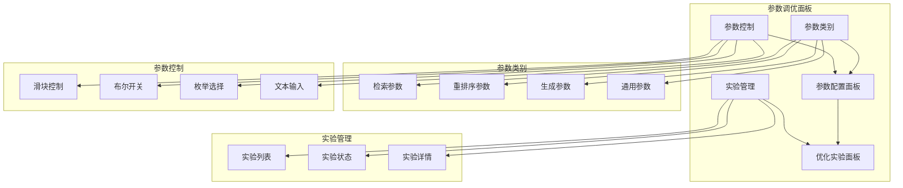

**图表来源**
- [ParameterTuning.html:520-800](file://src/dashboard/components/ParameterTuning.html#L520-L800)

#### 参数类型支持

组件支持多种参数类型的可视化控制：

| 参数类型 | 控制组件 | 数值范围 | 特殊功能 |
|----------|----------|----------|----------|
| Integer | 滑块 | 整数范围 | 实时数值显示 |
| Float | 滑块 | 浮点范围 | 精确小数位控制 |
| Boolean | 复选框 | true/false | 简洁切换 |
| Enum | 下拉选择 | 预定义集合 | 类型安全 |
| Text | 文本输入 | 字符串 | 自由编辑 |

#### 实验优化策略

组件支持不同的参数优化策略：

| 优化策略 | 描述 | 适用场景 | 复杂度 |
|----------|----------|----------|--------|
| Grid Search | 网格遍历所有参数组合 | 参数空间较小 | 高 |
| Random Search | 随机采样参数组合 | 参数空间较大 | 中 |
| Bayesian Optimization | 贝叶斯优化 | 高成本评估 | 中高 |
| Genetic Algorithm | 遗传算法 | 复杂多峰优化 | 高 |

**章节来源**
- [ParameterTuning.html:1-1013](file://src/dashboard/components/ParameterTuning.html#L1-L1013)

### PathAnalysis组件分析

PathAnalysis组件提供路径分析和瓶颈识别功能：

#### 可视化分析架构

组件采用双面板设计，左侧显示性能概览，右侧显示瓶颈分析：

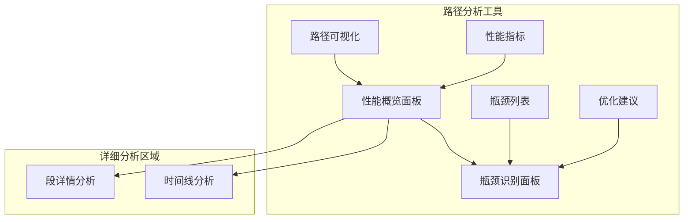

**图表来源**
- [PathAnalysis.html:479-800](file://src/dashboard/components/PathAnalysis.html#L479-L800)

#### 路径可视化设计

组件采用节点连接图展示推理路径：

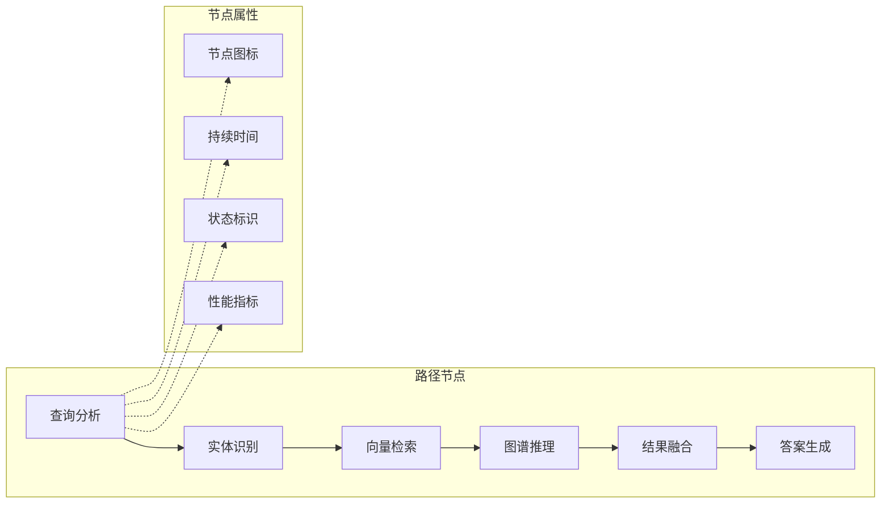

#### 瓶颈识别算法

组件采用多维度指标识别路径瓶颈：

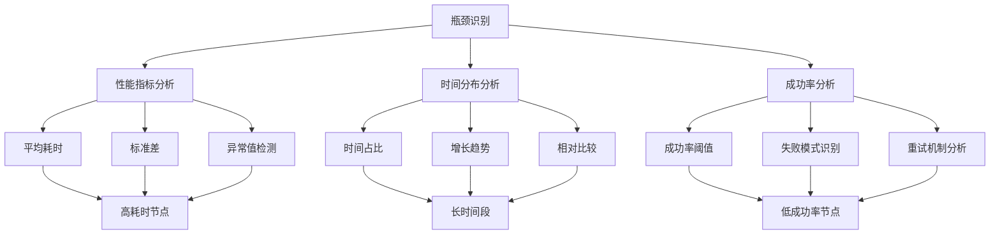

**图表来源**
- [PathAnalysis.html:626-662](file://src/dashboard/components/PathAnalysis.html#L626-L662)

**章节来源**
- [PathAnalysis.html:1-971](file://src/dashboard/components/PathAnalysis.html#L1-L971)

### RetrievalTraceTimeline组件分析

RetrievalTraceTimeline组件专注于检索过程的时间轴展示：

#### 时间轴设计模式

组件采用经典的时间轴布局设计：

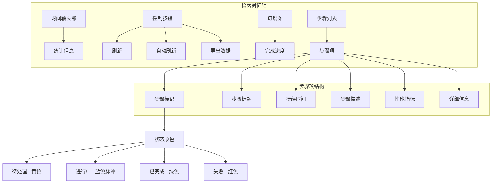

**图表来源**
- [RetrievalTraceTimeline.html:299-572](file://src/dashboard/components/RetrievalTraceTimeline.html#L299-L572)

#### 实时更新机制

组件通过WebSocket实现实时数据更新：

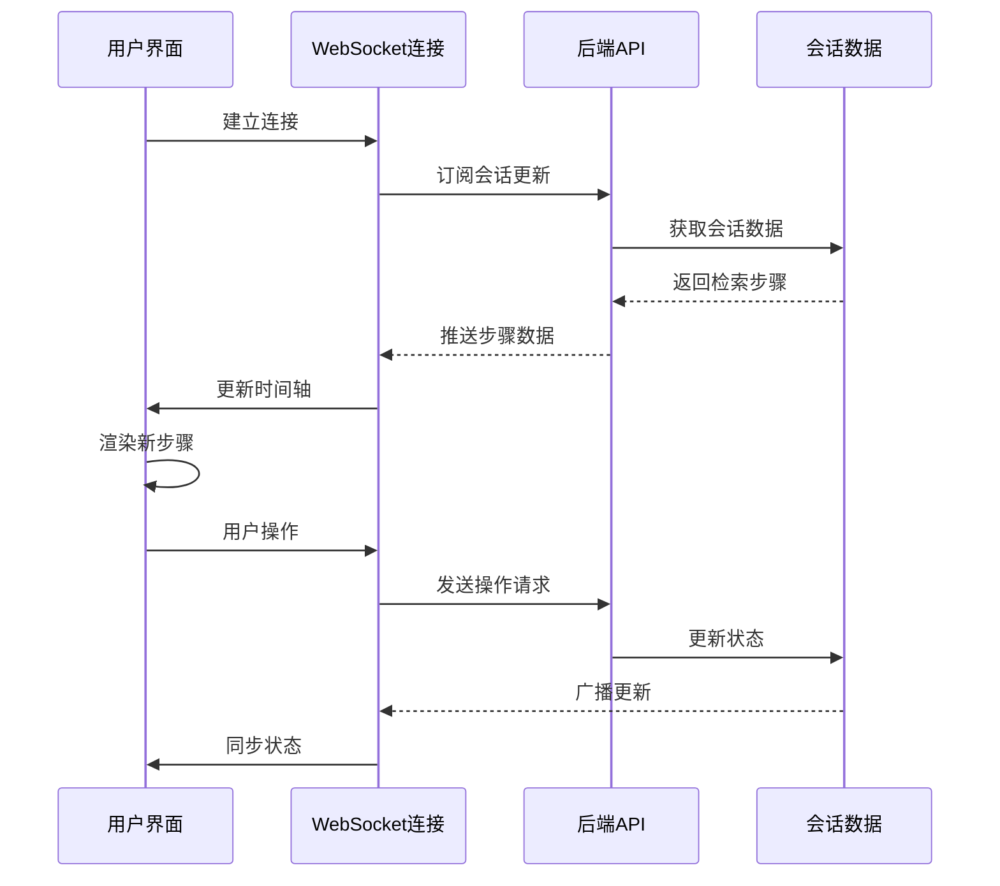

**图表来源**
- [RetrievalTraceTimeline.html:316-341](file://src/dashboard/components/RetrievalTraceTimeline.html#L316-L341)

#### 性能指标展示

组件支持多种性能指标的可视化展示：

| 指标类型 | 展示方式 | 阈值判断 | 颜色编码 |
|----------|----------|----------|----------|
| 延迟(Latency) | 数值显示 | >1.0s | 红色高风险 |
| 吞吐量(Throughput) | 数值显示 | <10 req/s | 红色高风险 |
| 准确率(Accuracy) | 百分比 | <80% | 红色高风险 |
| 结果数量 | 计数器 | - | 绿色正常 |
| 平均分数 | 浮点数 | - | 绿色正常 |

**章节来源**
- [RetrievalTraceTimeline.html:1-572](file://src/dashboard/components/RetrievalTraceTimeline.html#L1-L572)

## 依赖关系分析

专用组件集合的依赖关系呈现清晰的层次结构：

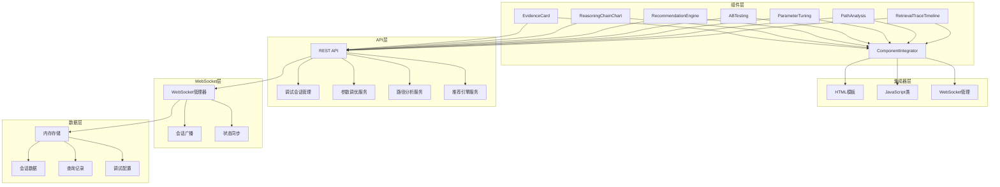

**图表来源**
- [ComponentIntegrator.js:1-656](file://src/dashboard/components/ComponentIntegrator.js#L1-L656)
- [api.py:1-557](file://src/dashboard/debug/api.py#L1-L557)

### 组件耦合度分析

各组件之间的耦合度保持在较低水平，主要通过以下方式实现解耦：

1. **统一接口规范**：所有组件都实现相同的生命周期接口
2. **数据驱动渲染**：组件通过数据更新而非直接调用实现交互
3. **事件驱动架构**：组件间通过事件系统进行通信
4. **配置化管理**：组件行为通过配置参数控制

### 外部依赖分析

组件集合对外部依赖主要包括：

| 依赖类型 | 依赖组件 | 版本要求 | 用途说明 |
|----------|----------|----------|----------|
| JavaScript库 | WebSocket API | 原生支持 | 实时数据通信 |
| HTML模板 | 原生HTML/CSS | 无版本要求 | 组件结构定义 |
| CSS样式 | 原生CSS | 无版本要求 | 组件样式渲染 |
| 后端API | FastAPI | >= 0.95.0 | 数据服务接口 |
| WebSocket | 标准协议 | 无版本要求 | 实时状态同步 |

**章节来源**
- [ComponentIntegrator.js:1-656](file://src/dashboard/components/ComponentIntegrator.js#L1-L656)
- [api.py:1-557](file://src/dashboard/debug/api.py#L1-L557)

## 性能考虑

专用组件集合在设计时充分考虑了性能优化：

### 内存管理

组件采用虚拟滚动和懒加载技术减少内存占用：

- **证据卡片**：每页最多12个证据，支持无限滚动
- **推理步骤**：仅渲染当前可见的步骤，支持分页加载
- **参数控制**：按需渲染不同类型的参数控制组件
- **时间轴**：动态计算节点位置，避免不必要的DOM操作

### 网络优化

组件通过以下方式优化网络性能：

- **批量数据请求**：组件初始化时一次性获取所需数据
- **WebSocket长连接**：避免频繁的HTTP请求开销
- **增量更新**：只更新发生变化的数据部分
- **缓存策略**：合理利用浏览器缓存机制

### 渲染优化

组件采用高效的渲染策略：

- **虚拟DOM**：使用轻量级的DOM操作减少重排重绘
- **防抖节流**：对高频事件进行防抖处理
- **异步渲染**：大组件采用异步渲染避免阻塞主线程
- **懒执行**：非关键操作延迟执行

## 故障排除指南

### 常见问题诊断

#### 组件加载失败

**症状**：组件无法正常显示或报错

**可能原因**：
1. HTML模板加载失败
2. JavaScript类定义缺失
3. WebSocket连接异常
4. API请求超时

**解决方案**：
1. 检查网络连接和API可达性
2. 验证组件路径配置正确性
3. 查看浏览器控制台错误信息
4. 确认WebSocket服务正常运行

#### 数据更新异常

**症状**：组件数据显示不正确或不更新

**可能原因**：
1. WebSocket连接断开
2. 数据格式不匹配
3. 组件状态同步失败
4. 缓存数据过期

**解决方案**：
1. 重新建立WebSocket连接
2. 检查数据格式和字段映射
3. 手动触发数据刷新
4. 清除浏览器缓存

#### 性能问题

**症状**：组件响应缓慢或卡顿

**可能原因**：
1. 数据量过大导致渲染压力
2. 频繁的DOM操作
3. 未优化的事件监听器
4. 内存泄漏

**解决方案**：
1. 实施数据分页和虚拟滚动
2. 优化DOM操作和事件处理
3. 移除不需要的事件监听器
4. 定期检查内存使用情况

### 调试工具使用

组件集合提供了完善的调试工具：

```javascript
// 启用调试模式
function enableDebugMode() {
    // 设置调试标志
    localStorage.setItem('debugMode', 'true');
    
    // 在控制台输出调试信息
    console.log('调试模式已启用');
    
    // 监听组件状态变化
    document.addEventListener('componentUpdate', (event) => {
        console.log('组件更新:', event.detail);
    });
}

// 数据导出功能
function exportComponentData(componentName) {
    const component = componentIntegrator.loadedComponents.get(componentName);
    if (component && component.data) {
        const dataStr = JSON.stringify(component.data, null, 2);
        const dataBlob = new Blob([dataStr], {type: 'application/json'});
        const url = URL.createObjectURL(dataBlob);
        const a = document.createElement('a');
        a.href = url;
        a.download = `${componentName}-data.json`;
        a.click();
        URL.revokeObjectURL(url);
    }
}
```

**章节来源**
- [ComponentIntegrator.js:1-656](file://src/dashboard/components/ComponentIntegrator.js#L1-L656)

## 结论

专用组件集合为NecoRAG智能问答系统提供了一套完整、高效、易用的可视化分析工具。通过模块化设计和统一的集成架构，各组件实现了高度的内聚性和松耦合性，为系统的可维护性和可扩展性奠定了坚实基础。

### 主要优势

1. **模块化设计**：每个组件独立开发、独立部署，便于维护和升级
2. **统一架构**：通过组件集成器实现标准化的组件管理
3. **实时更新**：基于WebSocket的实时数据更新机制
4. **用户体验**：直观的可视化界面和丰富的交互功能
5. **性能优化**：采用多种优化技术确保良好的用户体验

### 技术特色

- **多维度数据分析**：支持从不同角度分析系统性能和行为
- **实时监控**：提供实时的状态监控和异常检测
- **智能建议**：基于分析结果提供针对性的优化建议
- **灵活配置**：支持多种配置选项满足不同使用场景

### 未来发展

专用组件集合将继续演进，计划增加的功能包括：

- 更多的可视化图表类型
- 增强的机器学习分析能力
- 更丰富的交互功能
- 更好的移动端适配
- 更完善的性能监控功能

这套组件集合不仅为当前的系统提供了强大的可视化分析能力，也为未来的功能扩展和技术演进提供了良好的基础架构。