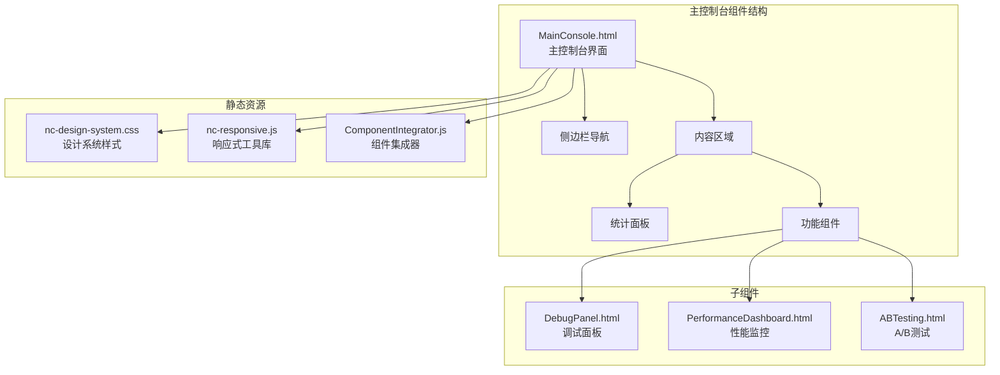
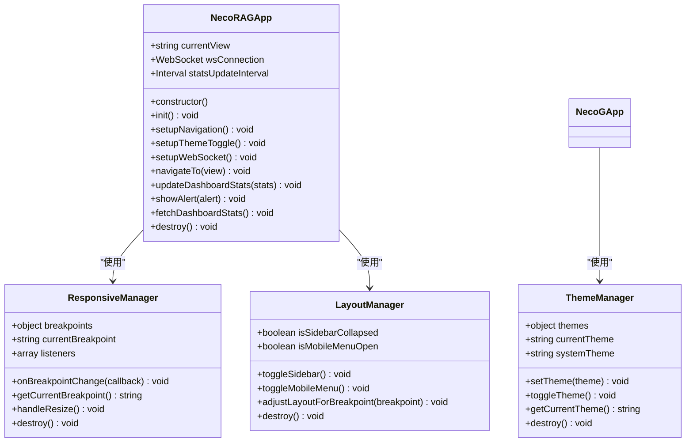
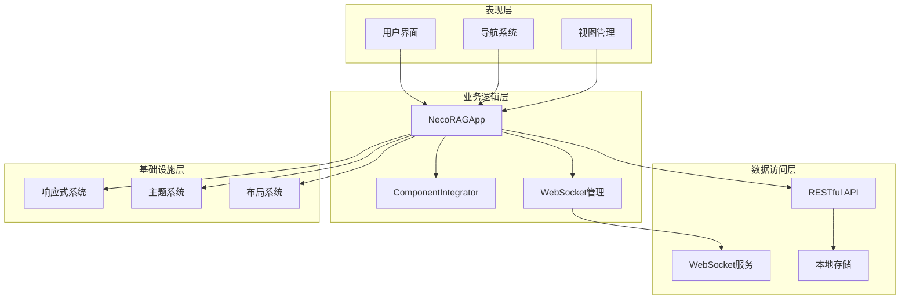
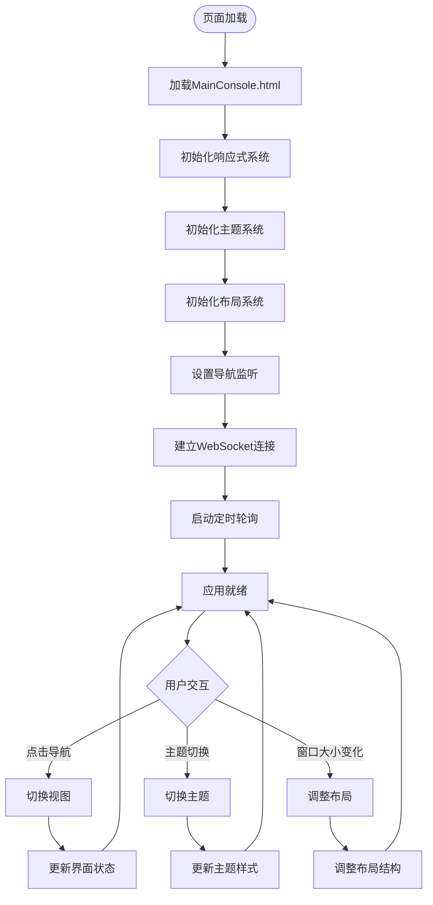
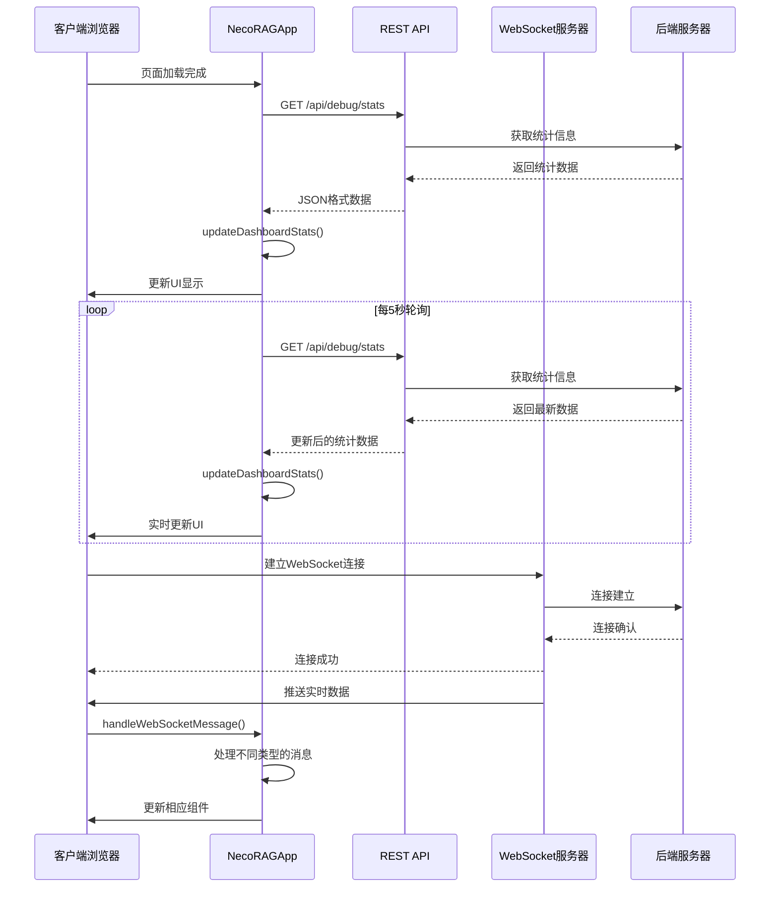
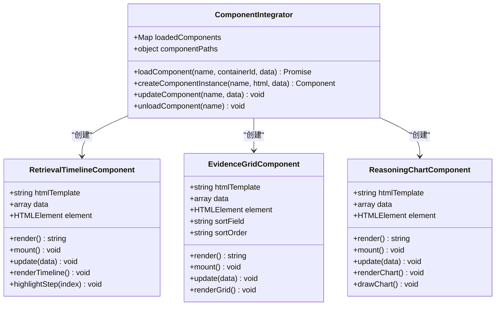
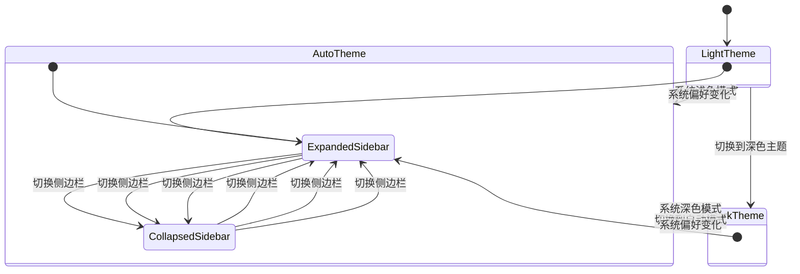
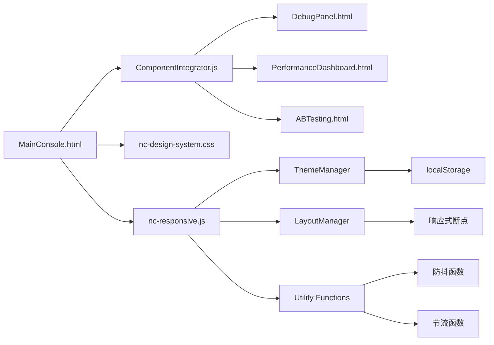
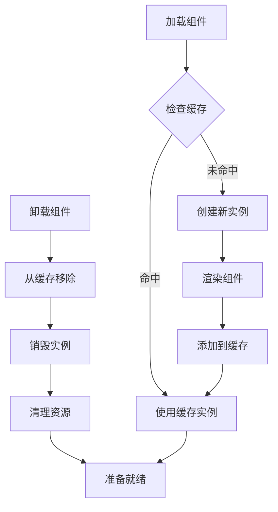

# 主控制台组件

<cite>
**本文档引用的文件**
- [MainConsole.html](file://src/dashboard/components/MainConsole.html)
- [nc-responsive.js](file://src/dashboard/static/js/nc-responsive.js)
- [nc-design-system.css](file://src/dashboard/static/css/nc-design-system.css)
- [ComponentIntegrator.js](file://src/dashboard/components/ComponentIntegrator.js)
- [DebugPanel.html](file://src/dashboard/components/DebugPanel.html)
- [PerformanceDashboard.html](file://src/dashboard/components/PerformanceDashboard.html)
- [ABTesting.html](file://src/dashboard/components/ABTesting.html)
- [server.py](file://src/dashboard/server.py)
- [models.py](file://src/dashboard/models.py)
</cite>

## 目录
1. [引言](#引言)
2. [项目结构](#项目结构)
3. [核心组件](#核心组件)
4. [架构概览](#架构概览)
5. [详细组件分析](#详细组件分析)
6. [依赖关系分析](#依赖关系分析)
7. [性能考虑](#性能考虑)
8. [故障排除指南](#故障排除指南)
9. [结论](#结论)

## 引言

主控制台组件是 NecoRAG 系统的核心用户界面，提供了一个统一的仪表板平台，用于监控和管理整个 RAG（Retrieval-Augmented Generation）系统的运行状态。该组件采用现代化的响应式设计，支持多设备访问，并集成了实时监控、调试面板、性能分析等多个功能模块。

## 项目结构

主控制台组件位于 `src/dashboard/components/` 目录下，采用模块化的架构设计：



**图表来源**
- [MainConsole.html:1-755](file://src/dashboard/components/MainConsole.html#L1-L755)
- [nc-responsive.js:1-822](file://src/dashboard/static/js/nc-responsive.js#L1-L822)

**章节来源**
- [MainConsole.html:1-755](file://src/dashboard/components/MainConsole.html#L1-L755)
- [server.py:371-418](file://src/dashboard/server.py#L371-L418)

## 核心组件

### 主应用架构

主控制台采用 MVVM（Model-View-ViewModel）架构模式，通过 NecoRAGApp 类管理整个应用的状态和交互逻辑。



**图表来源**
- [MainConsole.html:544-755](file://src/dashboard/components/MainConsole.html#L544-L755)
- [nc-responsive.js:6-126](file://src/dashboard/static/js/nc-responsive.js#L6-L126)
- [nc-responsive.js:128-236](file://src/dashboard/static/js/nc-responsive.js#L128-L236)
- [nc-responsive.js:238-391](file://src/dashboard/static/js/nc-responsive.js#L238-L391)

### 响应式设计系统

系统实现了完整的响应式设计，支持从移动端到桌面端的全平台适配：

| 设备类型 | 断点范围 | 特性 |
|---------|----------|------|
| 移动设备 | 0-639px | 隐藏侧边栏，显示汉堡菜单，单列布局 |
| 平板设备 | 640-1023px | 可折叠侧边栏，双列布局 |
| 桌面设备 | 1024px+ | 展开侧边栏，多列布局 |

**章节来源**
- [nc-responsive.js:8-15](file://src/dashboard/static/js/nc-responsive.js#L8-L15)
- [MainConsole.html:216-270](file://src/dashboard/components/MainConsole.html#L216-L270)

## 架构概览

主控制台采用分层架构设计，各层职责明确，耦合度低：



**图表来源**
- [MainConsole.html:544-755](file://src/dashboard/components/MainConsole.html#L544-L755)
- [server.py:113-418](file://src/dashboard/server.py#L113-L418)
- [nc-responsive.js:781-799](file://src/dashboard/static/js/nc-responsive.js#L781-L799)

**章节来源**
- [server.py:51-108](file://src/dashboard/server.py#L51-L108)
- [models.py:222-232](file://src/dashboard/models.py#L222-L232)

## 详细组件分析

### 主控制台界面结构

主控制台采用经典的三栏布局设计，包含侧边栏导航、主内容区域和顶部工具栏：



**图表来源**
- [MainConsole.html:553-755](file://src/dashboard/components/MainConsole.html#L553-L755)
- [nc-responsive.js:24-58](file://src/dashboard/static/js/nc-responsive.js#L24-L58)

### 导航系统实现

导航系统采用数据驱动的方式，通过 `data-view` 属性实现视图切换：

| 导航项 | 对应视图 | 图标 | 功能描述 |
|--------|----------|------|----------|
| 仪表板 | dashboard | 📊 | 系统状态概览 |
| 调试面板 | debug-panel | 🔍 | 实时调试会话 |
| 性能监控 | performance | ⚡ | 系统性能指标 |
| 路径分析 | path-analysis | 🔗 | 检索路径追踪 |
| A/B测试 | ab-testing | 🧪 | 实验对比分析 |
| 参数调优 | parameter-tuning | ⚙️ | 系统参数优化 |
| 优化建议 | recommendations | 💡 | 智能优化建议 |
| 查询历史 | history | 📜 | 历史查询记录 |
| 系统设置 | settings | 🛠️ | 系统配置管理 |

**章节来源**
- [MainConsole.html:317-362](file://src/dashboard/components/MainConsole.html#L317-L362)
- [MainConsole.html:618-658](file://src/dashboard/components/MainConsole.html#L618-L658)

### 实时监控功能

系统实现了多层次的实时监控机制：



**图表来源**
- [MainConsole.html:697-711](file://src/dashboard/components/MainConsole.html#L697-L711)
- [MainConsole.html:587-605](file://src/dashboard/components/MainConsole.html#L587-L605)

**章节来源**
- [MainConsole.html:587-616](file://src/dashboard/components/MainConsole.html#L587-L616)
- [MainConsole.html:697-711](file://src/dashboard/components/MainConsole.html#L697-L711)

### 组件集成系统

ComponentIntegrator 负责动态加载和管理各种可视化组件：



**图表来源**
- [ComponentIntegrator.js:6-94](file://src/dashboard/components/ComponentIntegrator.js#L6-L94)
- [ComponentIntegrator.js:99-261](file://src/dashboard/components/ComponentIntegrator.js#L99-L261)
- [ComponentIntegrator.js:266-445](file://src/dashboard/components/ComponentIntegrator.js#L266-L445)
- [ComponentIntegrator.js:450-649](file://src/dashboard/components/ComponentIntegrator.js#L450-L649)

**章节来源**
- [ComponentIntegrator.js:19-56](file://src/dashboard/components/ComponentIntegrator.js#L19-L56)
- [ComponentIntegrator.js:61-72](file://src/dashboard/components/ComponentIntegrator.js#L61-L72)

### 主题和布局系统

系统提供了完整的主题切换和布局适配功能：



**图表来源**
- [nc-responsive.js:128-236](file://src/dashboard/static/js/nc-responsive.js#L128-L236)
- [nc-responsive.js:238-391](file://src/dashboard/static/js/nc-responsive.js#L238-L391)

**章节来源**
- [nc-responsive.js:128-236](file://src/dashboard/static/js/nc-responsive.js#L128-L236)
- [nc-responsive.js:238-391](file://src/dashboard/static/js/nc-responsive.js#L238-L391)

## 依赖关系分析

### 外部依赖

主控制台组件依赖以下外部资源：

| 依赖项 | 版本 | 用途 | 说明 |
|--------|------|------|------|
| FastAPI | 0.100.0+ | Web框架 | 提供RESTful API和WebSocket支持 |
| Uvicorn | 0.23.0+ | ASGI服务器 | 生产级ASGI服务器 |
| Python | 3.8+ | 运行环境 | 支持asyncio和现代Python特性 |
| WebSocket | RFC 6455 | 实时通信 | 支持双向实时数据传输 |

### 内部模块依赖



**图表来源**
- [MainConsole.html:542-542](file://src/dashboard/components/MainConsole.html#L542-L542)
- [nc-responsive.js:781-799](file://src/dashboard/static/js/nc-responsive.js#L781-L799)

**章节来源**
- [server.py:6-20](file://src/dashboard/server.py#L6-L20)
- [nc-responsive.js:781-799](file://src/dashboard/static/js/nc-responsive.js#L781-L799)

## 性能考虑

### 响应式性能优化

系统采用了多项性能优化策略：

1. **懒加载机制**：侧边栏和内容区域采用延迟加载，减少初始渲染时间
2. **虚拟滚动**：对于大量数据的组件实现虚拟滚动，避免DOM节点过多
3. **防抖和节流**：对窗口大小变化和滚动事件进行优化处理
4. **缓存策略**：组件实例和样式表进行缓存，避免重复创建

### 内存管理



**图表来源**
- [ComponentIntegrator.js:19-56](file://src/dashboard/components/ComponentIntegrator.js#L19-L56)
- [ComponentIntegrator.js:87-94](file://src/dashboard/components/ComponentIntegrator.js#L87-L94)

**章节来源**
- [ComponentIntegrator.js:19-94](file://src/dashboard/components/ComponentIntegrator.js#L19-L94)
- [nc-responsive.js:617-627](file://src/dashboard/static/js/nc-responsive.js#L617-L627)

## 故障排除指南

### 常见问题及解决方案

| 问题类型 | 症状 | 可能原因 | 解决方案 |
|----------|------|----------|----------|
| 页面加载失败 | 白屏或空白页面 | HTML文件缺失 | 检查MainConsole.html是否存在 |
| WebSocket连接失败 | 实时数据不更新 | 网络连接问题 | 检查防火墙设置和网络连接 |
| 主题切换无效 | 主题不生效 | localStorage权限问题 | 检查浏览器隐私设置 |
| 组件加载失败 | 子组件显示空白 | API接口异常 | 检查后端服务状态 |
| 响应式布局异常 | 移动端显示错乱 | CSS样式冲突 | 检查自定义样式覆盖 |

### 调试工具

系统提供了多种调试工具和日志输出：

```javascript
// 主应用调试
console.log('应用初始化完成');
console.log('当前视图:', this.currentView);
console.log('WebSocket状态:', this.wsConnection.readyState);

// 响应式系统调试
console.log('断点变化:', event);
console.log('当前断点:', responsiveManager.getBreakpoint());

// 组件调试
console.log('组件加载状态:', this.loadedComponents.size);
console.log('组件数据:', component.data);
```

**章节来源**
- [MainConsole.html:720-728](file://src/dashboard/components/MainConsole.html#L720-L728)
- [nc-responsive.js:68-82](file://src/dashboard/static/js/nc-responsive.js#L68-L82)

## 结论

主控制台组件是一个功能完整、架构清晰的现代化Web应用。它通过模块化的设计实现了高度的可维护性和扩展性，同时提供了优秀的用户体验和响应式适配能力。

### 主要优势

1. **架构设计优秀**：采用MVVM模式和分层架构，职责分离明确
2. **响应式体验佳**：完整的移动端适配和主题系统
3. **实时监控完善**：WebSocket和轮询机制确保数据实时性
4. **组件化开发**：可复用的组件系统便于功能扩展
5. **性能优化到位**：懒加载、缓存和内存管理策略

### 技术亮点

- **实时数据流**：通过WebSocket实现实时状态更新
- **动态组件加载**：按需加载子组件，提升性能
- **主题系统**：支持明暗主题切换和系统偏好检测
- **响应式布局**：自适应不同设备屏幕尺寸
- **事件驱动**：基于自定义事件的组件间通信

该组件为整个NecoRAG系统的可视化管理提供了坚实的基础，为后续的功能扩展和性能优化奠定了良好的技术基础。