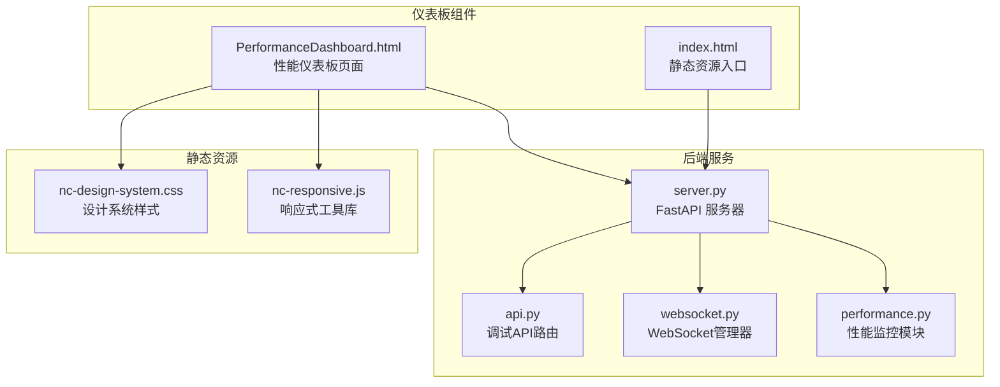
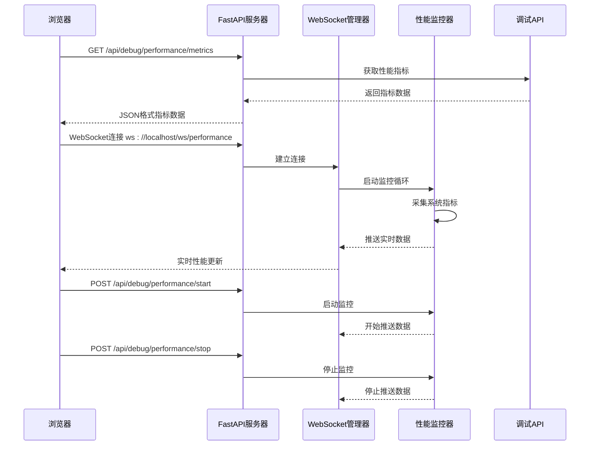
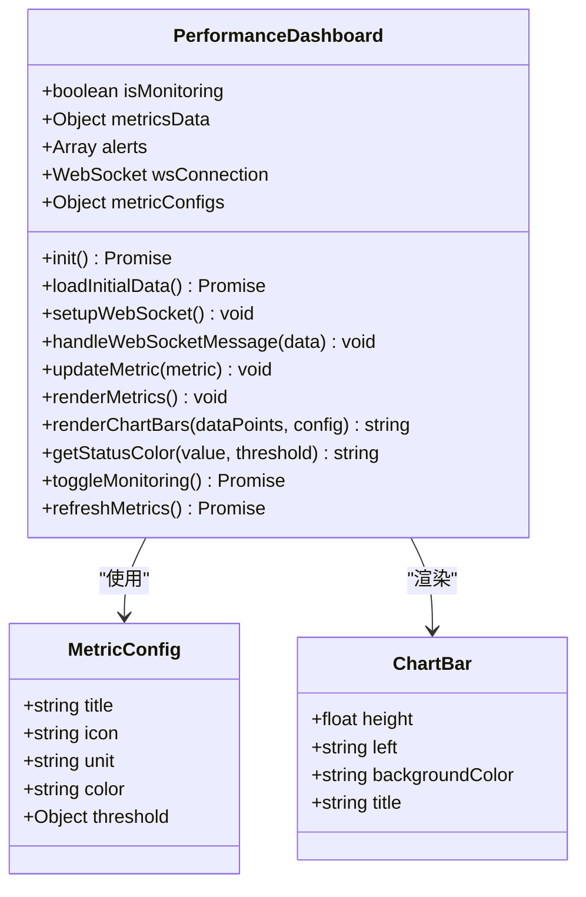
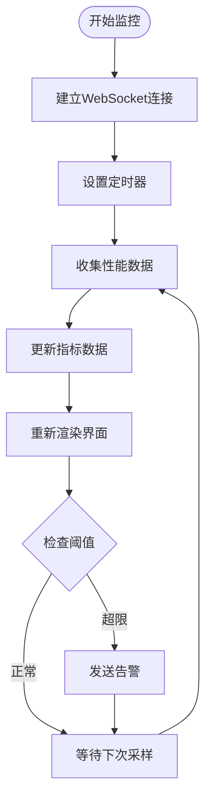
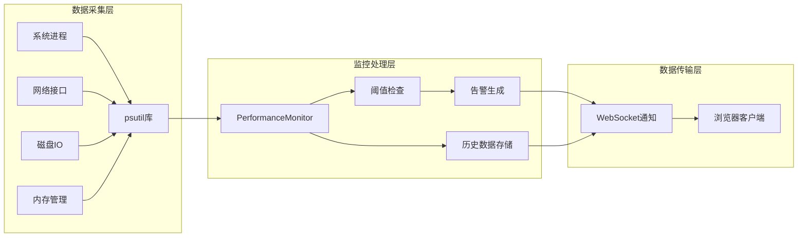
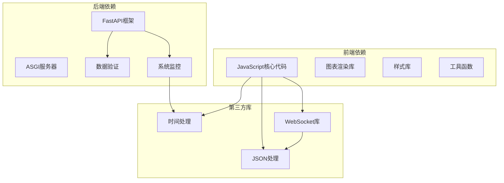

# 性能仪表板组件

<cite>
**本文档引用的文件**
- [PerformanceDashboard.html](file://src/dashboard/components/PerformanceDashboard.html)
- [server.py](file://src/dashboard/server.py)
- [performance.py](file://src/dashboard/debug/performance.py)
- [api.py](file://src/dashboard/debug/api.py)
- [websocket.py](file://src/dashboard/debug/websocket.py)
- [models.py](file://src/dashboard/models.py)
- [config_manager.py](file://src/dashboard/config_manager.py)
- [index.html](file://src/dashboard/static/index.html)
- [nc-design-system.css](file://src/dashboard/static/css/nc-design-system.css)
- [nc-responsive.js](file://src/dashboard/static/js/nc-responsive.js)
</cite>

## 目录
1. [项目概述](#项目概述)
2. [项目结构](#项目结构)
3. [核心组件](#核心组件)
4. [架构总览](#架构总览)
5. [详细组件分析](#详细组件分析)
6. [依赖关系分析](#依赖关系分析)
7. [性能考虑](#性能考虑)
8. [故障排除指南](#故障排除指南)
9. [结论](#结论)

## 项目概述

性能仪表板组件是 NecoRAG 仪表板系统的核心监控模块，负责实时展示系统性能指标、历史趋势分析和告警管理。该组件采用前后端分离架构，前端使用纯 HTML+JavaScript 实现，后端基于 FastAPI 提供 RESTful API 和 WebSocket 通信。

该组件主要监控以下关键性能指标：
- CPU 使用率
- 内存使用率  
- 响应时间
- 吞吐量（QPS）
- 错误率

并通过阈值告警机制提供实时告警通知。

## 项目结构



**图表来源**
- [PerformanceDashboard.html:1-669](file://src/dashboard/components/PerformanceDashboard.html#L1-L669)
- [server.py:1-568](file://src/dashboard/server.py#L1-L568)
- [api.py:1-557](file://src/dashboard/debug/api.py#L1-L557)

**章节来源**
- [PerformanceDashboard.html:1-669](file://src/dashboard/components/PerformanceDashboard.html#L1-L669)
- [server.py:1-568](file://src/dashboard/server.py#L1-L568)

## 核心组件

### 性能仪表板核心类

PerformanceDashboard 类是整个组件的核心，负责：

1. **数据管理**：维护性能指标数据、告警信息和配置
2. **实时更新**：通过 WebSocket 接收实时性能数据
3. **渲染控制**：动态生成指标卡片和图表
4. **用户交互**：处理开始/停止监控、手动刷新等操作

### 性能监控系统

性能监控系统包含三个核心模块：

1. **PerformanceMonitor**：系统级性能监控，收集 CPU、内存、网络等系统指标
2. **ErrorHandler**：错误处理和恢复机制
3. **PerformanceOptimizer**：性能优化策略执行器

### WebSocket 通信层

WebSocket 管理器提供实时双向通信：
- 连接管理
- 消息广播
- 会话订阅
- 心跳检测

**章节来源**
- [PerformanceDashboard.html:310-651](file://src/dashboard/components/PerformanceDashboard.html#L310-L651)
- [performance.py:103-658](file://src/dashboard/debug/performance.py#L103-L658)
- [websocket.py:49-554](file://src/dashboard/debug/websocket.py#L49-L554)

## 架构总览



**图表来源**
- [PerformanceDashboard.html:357-450](file://src/dashboard/components/PerformanceDashboard.html#L357-L450)
- [server.py:335-370](file://src/dashboard/server.py#L335-L370)
- [performance.py:130-155](file://src/dashboard/debug/performance.py#L130-L155)

## 详细组件分析

### 性能仪表板页面结构



**图表来源**
- [PerformanceDashboard.html:310-558](file://src/dashboard/components/PerformanceDashboard.html#L310-L558)

#### 指标卡片组件

每个指标卡片包含以下结构：
- **头部区域**：图标、指标名称、当前数值
- **统计区域**：平均值、最大值、最小值、数据点数量
- **图表区域**：柱状图展示最近10个数据点

#### 实时数据更新机制



**图表来源**
- [PerformanceDashboard.html:380-450](file://src/dashboard/components/PerformanceDashboard.html#L380-L450)
- [performance.py:248-300](file://src/dashboard/debug/performance.py#L248-L300)

**章节来源**
- [PerformanceDashboard.html:310-558](file://src/dashboard/components/PerformanceDashboard.html#L310-L558)

### WebSocket 通信协议

WebSocket 消息类型定义：

| 消息类型 | 数据结构 | 用途 |
|---------|----------|------|
| metric_update | `{metric_type: string, value: number, timestamp: string}` | 实时性能指标更新 |
| alert_triggered | `{alert_id: string, severity: string, message: string, timestamp: string}` | 新告警触发 |
| alert_resolved | `{alert_id: string, resolution_time: string}` | 告警解决 |

### 性能监控数据流



**图表来源**
- [performance.py:156-247](file://src/dashboard/debug/performance.py#L156-L247)
- [websocket.py:200-260](file://src/dashboard/debug/websocket.py#L200-L260)

**章节来源**
- [performance.py:103-372](file://src/dashboard/debug/performance.py#L103-L372)
- [websocket.py:49-260](file://src/dashboard/debug/websocket.py#L49-L260)

### API 接口设计

| 端点 | 方法 | 描述 | 响应格式 |
|------|------|------|----------|
| `/api/debug/performance/metrics` | GET | 获取性能指标数据 | JSON |
| `/api/debug/performance/alerts` | GET | 获取告警列表 | JSON |
| `/api/debug/performance/start` | POST | 开始监控 | JSON |
| `/api/debug/performance/stop` | POST | 停止监控 | JSON |
| `/api/debug/ws/performance` | WebSocket | 实时性能数据流 | JSON |

**章节来源**
- [server.py:335-370](file://src/dashboard/server.py#L335-L370)
- [api.py:509-528](file://src/dashboard/debug/api.py#L509-L528)

## 依赖关系分析



**图表来源**
- [PerformanceDashboard.html:309-667](file://src/dashboard/components/PerformanceDashboard.html#L309-L667)
- [server.py:6-19](file://src/dashboard/server.py#L6-L19)

### 核心依赖关系

1. **前端依赖**：
   - 原生 JavaScript，无需外部库
   - 内置 WebSocket 支持
   - CSS 自定义属性实现主题切换

2. **后端依赖**：
   - FastAPI：Web 服务器和路由管理
   - Uvicorn：ASGI 服务器
   - psutil：系统资源监控
   - Pydantic：数据模型验证

3. **通信协议**：
   - RESTful API：HTTP/1.1
   - WebSocket：实时双向通信
   - JSON：数据序列化

**章节来源**
- [PerformanceDashboard.html:1-669](file://src/dashboard/components/PerformanceDashboard.html#L1-L669)
- [server.py:1-568](file://src/dashboard/server.py#L1-L568)

## 性能考虑

### 前端性能优化

1. **内存管理**
   - 限制历史数据点数量（默认100个）
   - 及时清理定时器和事件监听器
   - 使用虚拟滚动避免大量DOM节点

2. **渲染优化**
   - 批量DOM更新减少重排
   - CSS动画硬件加速
   - 懒加载非关键资源

3. **网络优化**
   - HTTP/2 多路复用
   - 压缩响应数据
   - 连接池复用

### 后端性能优化

1. **并发处理**
   - 异步I/O操作
   - 事件驱动架构
   - 连接池管理

2. **资源管理**
   - 进程池限制
   - 内存使用监控
   - 文件描述符管理

3. **监控开销**
   - 采样频率可配置
   - 指标聚合减少存储
   - 缓存热点数据

## 故障排除指南

### 常见问题及解决方案

#### 1. WebSocket 连接失败

**症状**：仪表板显示连接失败或数据不更新

**排查步骤**：
1. 检查服务器端口是否正确开放
2. 验证防火墙设置
3. 查看浏览器开发者工具网络面板
4. 检查服务器日志

**解决方案**：
```javascript
// 自动重连机制
this.wsConnection.onclose = () => {
    setTimeout(() => this.setupWebSocket(), 5000);
};
```

#### 2. 性能数据为空

**症状**：指标卡片显示"等待数据"

**排查步骤**：
1. 确认性能监控服务已启动
2. 检查 `/api/debug/performance/metrics` 接口响应
3. 验证系统权限是否足够

**解决方案**：
```javascript
// 初始数据加载失败处理
try {
    const response = await fetch('/api/debug/performance/metrics');
    const data = await response.json();
    this.metricsData = data.metrics || {};
    this.renderMetrics();
} catch (error) {
    console.error('加载初始数据失败:', error);
    // 显示错误提示
    this.showError('数据加载失败，请稍后重试');
}
```

#### 3. 告警不触发

**症状**：阈值超限但无告警通知

**排查步骤**：
1. 检查阈值配置是否合理
2. 验证告警回调函数注册
3. 查看性能监控日志

**解决方案**：
```python
# 告警触发检查
async def _check_thresholds(self, metrics: PerformanceMetrics):
    alerts = []
    
    # CPU使用率检查
    if metrics.cpu_percent >= self.thresholds['cpu_critical']:
        alerts.append({
            'type': 'cpu',
            'level': 'critical',
            'message': f'CPU使用率过高: {metrics.cpu_percent:.1f}%'
        })
    
    # 触发告警回调
    if alerts:
        for alert in alerts:
            await self._trigger_alert(alert)
```

**章节来源**
- [PerformanceDashboard.html:375-377](file://src/dashboard/components/PerformanceDashboard.html#L375-L377)
- [performance.py:248-300](file://src/dashboard/debug/performance.py#L248-L300)

## 结论

性能仪表板组件通过精心设计的架构实现了高效的性能监控和可视化展示。其主要优势包括：

1. **实时性强**：基于 WebSocket 的双向通信确保数据实时更新
2. **可视化丰富**：多种图表类型满足不同监控需求
3. **扩展性好**：模块化设计便于功能扩展和定制
4. **可靠性高**：完善的错误处理和自动重连机制

该组件为 NecoRAG 系统提供了全面的性能监控能力，能够帮助开发者和运维人员及时发现和解决性能问题，确保系统的稳定运行。