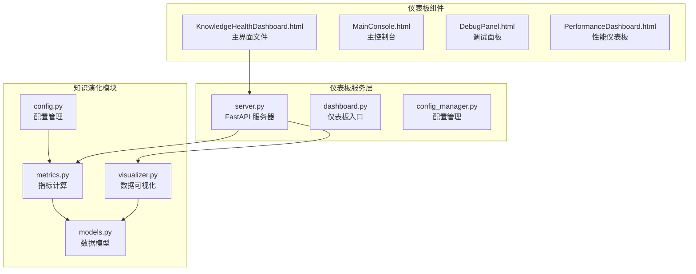
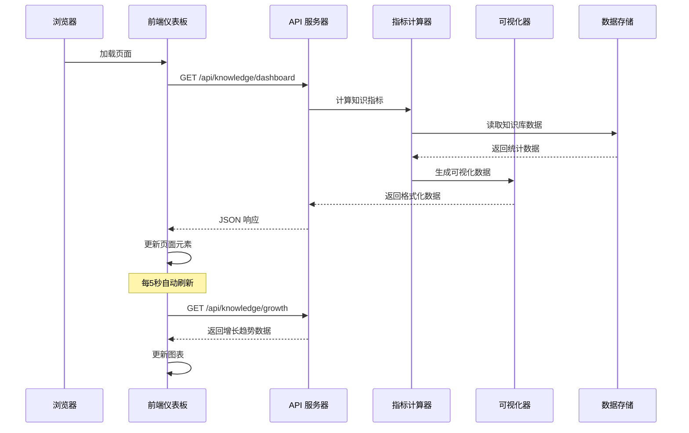
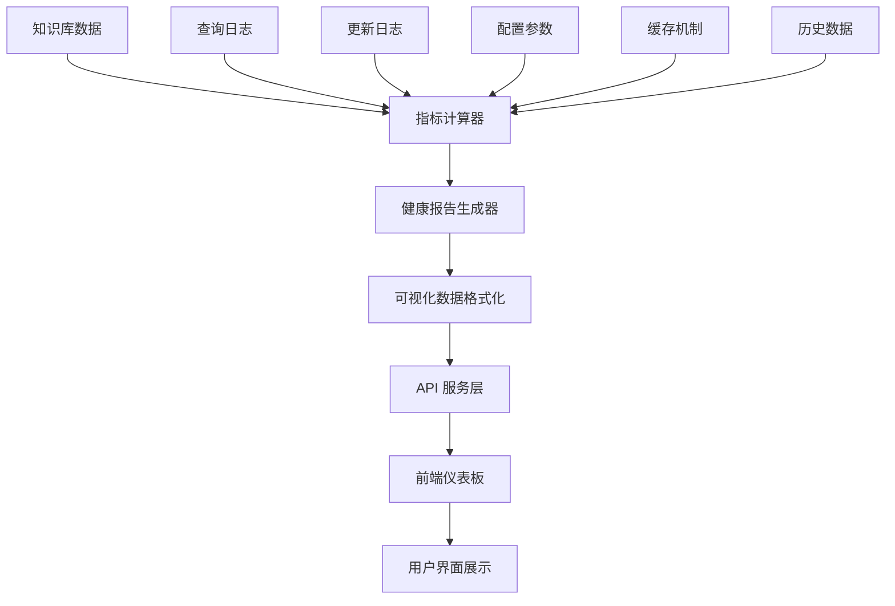
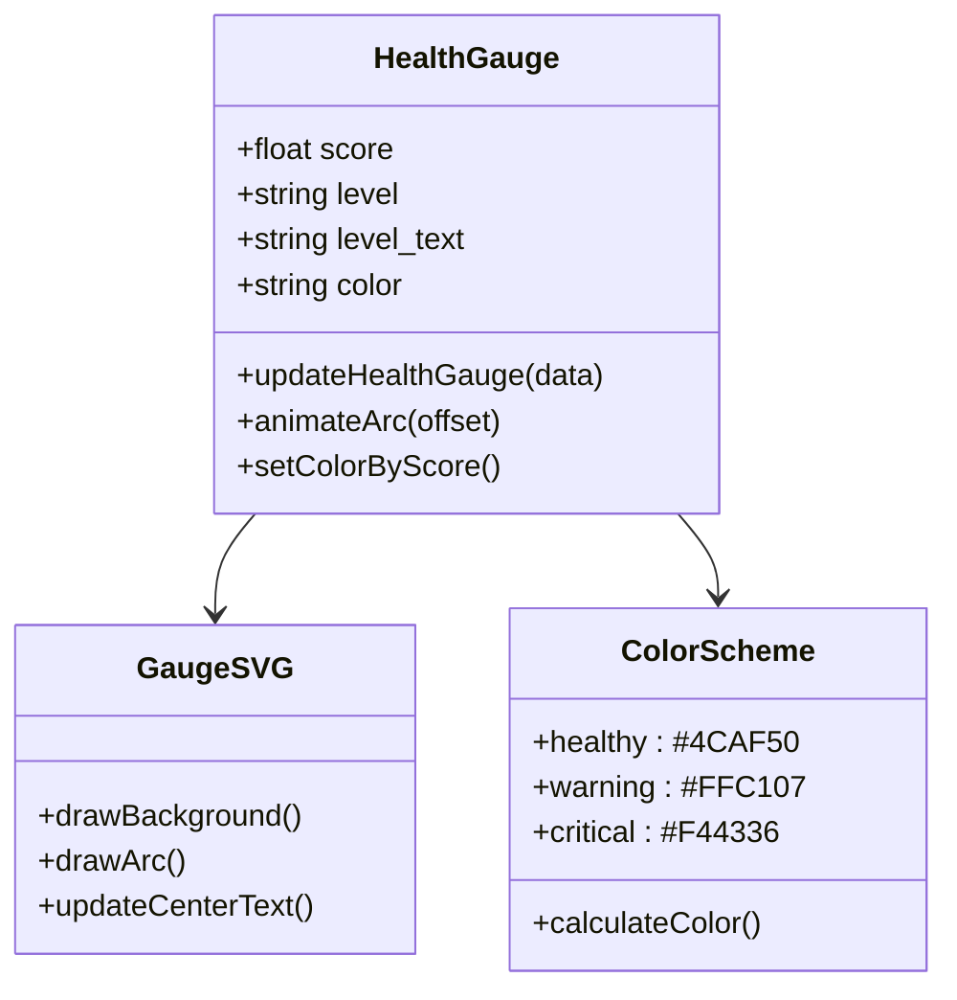
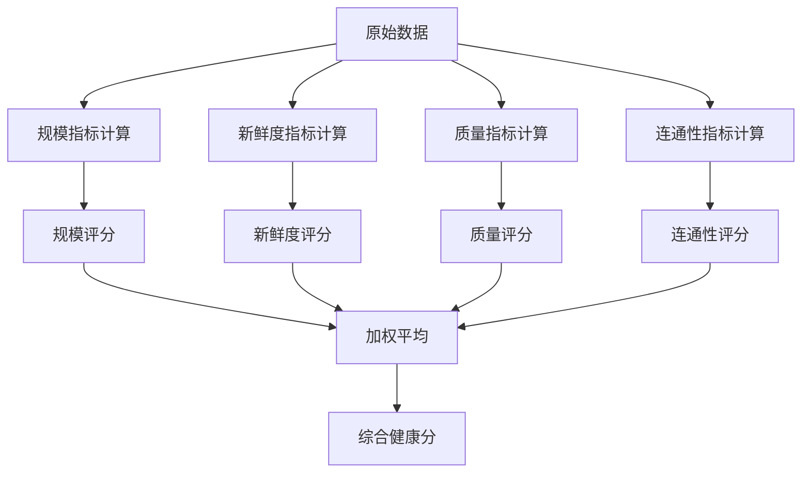
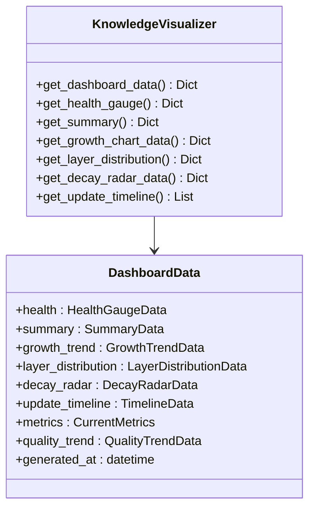
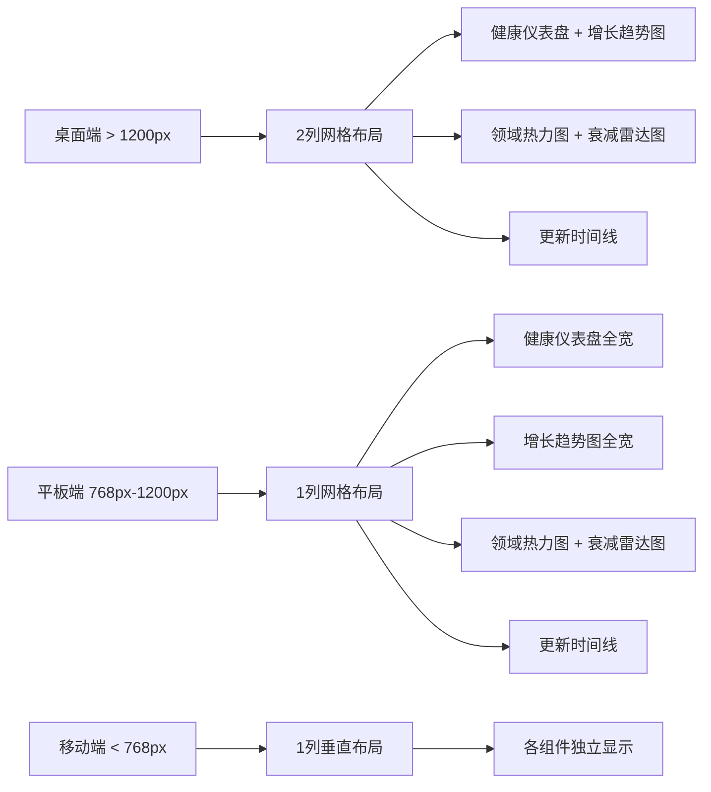
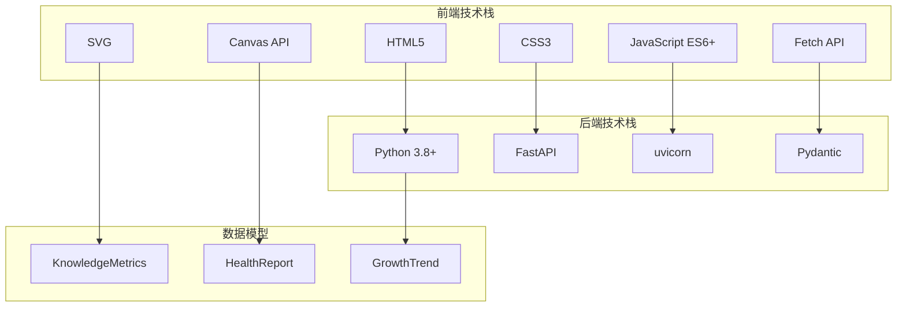
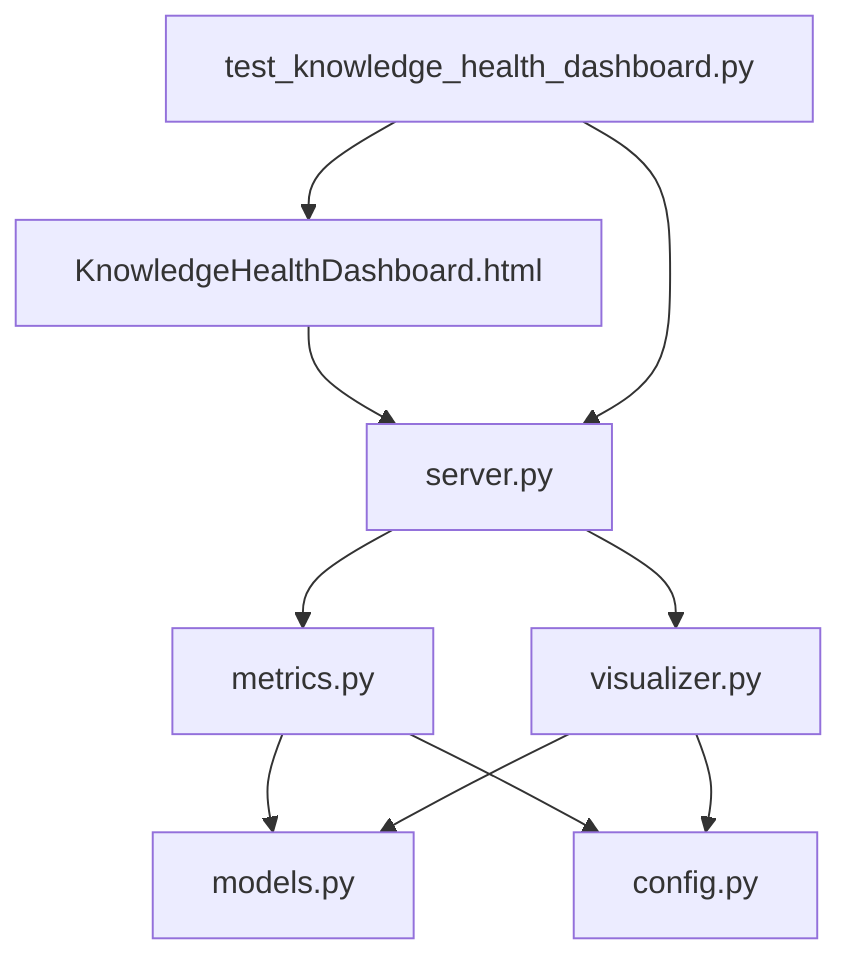

# 知识健康仪表板组件

<cite>
**本文档引用的文件**
- [KnowledgeHealthDashboard.html](file://src/dashboard/components/KnowledgeHealthDashboard.html)
- [metrics.py](file://src/knowledge_evolution/metrics.py)
- [visualizer.py](file://src/knowledge_evolution/visualizer.py)
- [models.py](file://src/knowledge_evolution/models.py)
- [config.py](file://src/knowledge_evolution/config.py)
- [server.py](file://src/dashboard/server.py)
- [test_knowledge_health_dashboard.py](file://src/dashboard/test_knowledge_health_dashboard.py)
- [KNOWLEDGE_HEALTH_DASHBOARD_GUIDE.md](file://src/dashboard/KNOWLEDGE_HEALTH_DASHBOARD_GUIDE.md)
- [USAGE_GUIDE.md](file://src/dashboard/USAGE_GUIDE.md)
</cite>

## 目录
1. [简介](#简介)
2. [项目结构](#项目结构)
3. [核心组件](#核心组件)
4. [架构概览](#架构概览)
5. [详细组件分析](#详细组件分析)
6. [依赖关系分析](#依赖关系分析)
7. [性能考虑](#性能考虑)
8. [故障排除指南](#故障排除指南)
9. [结论](#结论)

## 简介

知识健康仪表板组件是 NecoRAG 项目的核心可视化组件，专门用于监控和展示知识库的健康状态。该组件提供了全方位的知识库状态可视化监控，包括健康度评分、质量指标计算、异常检测机制等功能。

该仪表板采用现代化的 Web 技术栈构建，使用原生 HTML、CSS 和 JavaScript 实现，无需任何外部依赖。通过简洁直观的界面设计，用户可以实时了解知识库的各项关键指标，包括总知识量、新鲜度、质量评分等重要指标。

## 项目结构

知识健康仪表板组件位于项目的 `src/dashboard/components/` 目录下，主要文件包括：



**图表来源**
- [KnowledgeHealthDashboard.html:1-892](file://src/dashboard/components/KnowledgeHealthDashboard.html#L1-L892)
- [server.py:1-568](file://src/dashboard/server.py#L1-L568)

**章节来源**
- [KnowledgeHealthDashboard.html:1-892](file://src/dashboard/components/KnowledgeHealthDashboard.html#L1-L892)
- [server.py:1-568](file://src/dashboard/server.py#L1-L568)

## 核心组件

### 1. 健康度仪表盘 (Health Score Gauge)

健康度仪表盘是整个仪表板的核心组件，提供 0-100 分的综合健康评分。该组件采用圆形仪表盘设计，通过颜色编码直观展示知识库健康状态：

- **绿色 (80-100分)**: 健康状态，知识库运行正常
- **黄色 (60-80分)**: 一般状态，需要关注某些指标
- **橙色 (40-60分)**: 预警状态，建议进行维护
- **红色 (0-40分)**: 严重状态，需要立即处理

### 2. 关键指标卡 (Key Metrics Cards)

仪表板包含三个关键指标卡，提供知识库的核心状态信息：

- **总知识量**: 显示知识库中所有条目的总数
- **今日新增**: 统计当天新增的知识条目数量
- **平均新鲜度**: 计算知识库的平均年龄（以天为单位）

### 3. 知识增长趋势图 (Growth Trend Chart)

提供知识库增长的历史趋势分析，支持 7天、30天、90天三种时间范围的对比分析。

### 4. 领域覆盖热力图 (Domain Coverage Heatmap)

展示各个领域的知识覆盖率，通过水平条形图直观显示不同领域的覆盖程度。

### 5. 知识质量雷达图 (Quality Radar Chart)

多维度展示知识库的质量状况，包括新鲜度、覆盖度、连通性、准确性、多样性五个维度。

### 6. 更新时间线 (Update Timeline)

实时显示知识库的更新历史，包括实时更新、定时任务、事件触发等不同类型的更新事件。

**章节来源**
- [KnowledgeHealthDashboard.html:178-892](file://src/dashboard/components/KnowledgeHealthDashboard.html#L178-L892)
- [KNOWLEDGE_HEALTH_DASHBOARD_GUIDE.md:9-101](file://src/dashboard/KNOWLEDGE_HEALTH_DASHBOARD_GUIDE.md#L9-L101)

## 架构概览

知识健康仪表板采用前后端分离的架构设计，前端负责数据展示，后端提供数据服务。



**图表来源**
- [server.py:256-287](file://src/dashboard/server.py#L256-L287)
- [metrics.py:66-134](file://src/knowledge_evolution/metrics.py#L66-L134)
- [visualizer.py:49-66](file://src/knowledge_evolution/visualizer.py#L49-L66)

### 数据流架构



**图表来源**
- [metrics.py:66-134](file://src/knowledge_evolution/metrics.py#L66-L134)
- [visualizer.py:49-66](file://src/knowledge_evolution/visualizer.py#L49-L66)

**章节来源**
- [server.py:256-287](file://src/dashboard/server.py#L256-L287)
- [metrics.py:66-134](file://src/knowledge_evolution/metrics.py#L66-L134)
- [visualizer.py:49-66](file://src/knowledge_evolution/visualizer.py#L49-L66)

## 详细组件分析

### 健康度仪表盘组件

健康度仪表盘是仪表板的核心可视化组件，采用 SVG 技术实现圆形仪表盘效果。

#### 设计特点



**图表来源**
- [KnowledgeHealthDashboard.html:633-667](file://src/dashboard/components/KnowledgeHealthDashboard.html#L633-L667)

#### 动画实现机制

仪表盘采用 requestAnimationFrame 实现流畅的动画效果：

- **指针动画**: 1秒缓动时间，使用四次贝塞尔曲线
- **数字滚动**: 支持千位分隔符的数字动画
- **颜色过渡**: 健康度变化时的颜色渐变效果

**章节来源**
- [KnowledgeHealthDashboard.html:633-667](file://src/dashboard/components/KnowledgeHealthDashboard.html#L633-L667)
- [KnowledgeHealthDashboard.html:845-873](file://src/dashboard/components/KnowledgeHealthDashboard.html#L845-L873)

### 指标计算引擎

知识健康仪表板的指标计算基于 `KnowledgeMetricsCalculator` 类，该类实现了复杂的健康度评分算法。

#### 指标计算流程



**图表来源**
- [metrics.py:413-446](file://src/knowledge_evolution/metrics.py#L413-L446)

#### 健康度评分算法

综合健康分采用加权平均算法：

```
健康度 = (规模权重 × 规模评分) + 
         (新鲜度权重 × 新鲜度评分) + 
         (质量权重 × 质量评分) + 
         (连通性权重 × 连通性评分)
```

权重配置：
- 规模权重: 0.2
- 新鲜度权重: 0.3  
- 质量权重: 0.3
- 连通性权重: 0.2

**章节来源**
- [metrics.py:413-446](file://src/knowledge_evolution/metrics.py#L413-L446)
- [config.py:52-56](file://src/knowledge_evolution/config.py#L52-L56)

### 可视化数据接口

`KnowledgeVisualizer` 类负责将指标计算结果转换为前端友好的数据格式。

#### 数据格式标准化



**图表来源**
- [visualizer.py:49-66](file://src/knowledge_evolution/visualizer.py#L49-L66)

#### API 接口设计

仪表板通过 RESTful API 提供数据服务：

| 接口 | 方法 | 描述 |
|------|------|------|
| `/api/knowledge/dashboard` | GET | 获取完整仪表板数据 |
| `/api/knowledge/metrics` | GET | 获取知识库指标 |
| `/api/knowledge/health` | GET | 获取健康报告 |
| `/api/knowledge/growth` | GET | 获取增长趋势 |
| `/api/knowledge/timeline` | GET | 获取更新时间线 |

**章节来源**
- [server.py:256-296](file://src/dashboard/server.py#L256-L296)
- [visualizer.py:49-66](file://src/knowledge_evolution/visualizer.py#L49-L66)

### 响应式设计实现

仪表板采用 CSS Grid 和 Flexbox 实现响应式布局，支持多种设备尺寸：

#### 布局断点



**图表来源**
- [KnowledgeHealthDashboard.html:426-452](file://src/dashboard/components/KnowledgeHealthDashboard.html#L426-L452)

**章节来源**
- [KnowledgeHealthDashboard.html:426-452](file://src/dashboard/components/KnowledgeHealthDashboard.html#L426-L452)

## 依赖关系分析

### 外部依赖

知识健康仪表板采用零外部依赖的设计理念，仅使用浏览器内置的 Web API：



**图表来源**
- [KnowledgeHealthDashboard.html:593-892](file://src/dashboard/components/KnowledgeHealthDashboard.html#L593-L892)
- [server.py:85-98](file://src/dashboard/server.py#L85-L98)

### 内部模块依赖



**图表来源**
- [test_knowledge_health_dashboard.py:1-259](file://src/dashboard/test_knowledge_health_dashboard.py#L1-L259)

**章节来源**
- [test_knowledge_health_dashboard.py:1-259](file://src/dashboard/test_knowledge_health_dashboard.py#L1-L259)

## 性能考虑

### 1. 数据缓存机制

仪表板实现了多层次的数据缓存策略：

- **前端缓存**: 使用内存缓存最近一次请求结果
- **后端缓存**: 指标计算器内置 TTL 缓存机制
- **API 缓存**: 避免重复的 API 调用

### 2. 渲染优化

- **虚拟滚动**: 时间线组件支持虚拟滚动，提升大数据量渲染性能
- **防抖处理**: 窗口大小调整时使用防抖，避免频繁重绘
- **懒加载**: 图表库按需加载，首屏仅加载必要组件

### 3. 网络优化

- **自动刷新**: 每5秒自动刷新，平衡实时性和性能
- **增量更新**: 仅更新发生变化的数据区域
- **压缩传输**: API 响应数据经过优化压缩

## 故障排除指南

### 常见问题及解决方案

#### 问题1: 数据显示"计算中..."

**症状**: 健康度仪表盘显示"计算中..."，指标卡为空

**可能原因**:
- NecoRAG 实例未正确初始化
- API 服务未启动
- 网络连接问题

**解决步骤**:
1. 检查后端服务是否正常运行
2. 验证 API 端点可用性
3. 查看浏览器控制台错误信息
4. 确认 NecoRAG 实例引用已设置

#### 问题2: 图表不显示或显示空白

**症状**: 增长趋势图、雷达图等图表无法显示

**可能原因**:
- API 返回空数据
- SVG 渲染错误
- JavaScript 执行异常

**解决步骤**:
1. 使用 curl 验证 API 端点
2. 检查网络请求响应
3. 查看浏览器开发者工具
4. 确认数据格式正确

#### 问题3: 样式错乱或布局异常

**症状**: 页面布局错乱，样式显示异常

**可能原因**:
- CSS 文件路径错误
- 浏览器缓存问题
- 响应式断点冲突

**解决步骤**:
1. 清除浏览器缓存
2. 检查 CSS 文件路径
3. 验证媒体查询语法
4. 使用开发者工具检查样式

### 性能监控

仪表板提供了基本的性能监控功能：

- **加载时间**: 监控页面加载和数据获取时间
- **内存使用**: 跟踪前端内存使用情况
- **渲染性能**: 监控图表渲染帧率

**章节来源**
- [KNOWLEDGE_HEALTH_DASHBOARD_GUIDE.md:303-332](file://src/dashboard/KNOWLEDGE_HEALTH_DASHBOARD_GUIDE.md#L303-L332)

## 结论

知识健康仪表板组件是 NecoRAG 项目的重要组成部分，它通过直观的可视化界面为用户提供全面的知识库健康状态监控。该组件具有以下显著特点：

### 技术优势

1. **零依赖设计**: 采用原生 Web 技术，无需额外安装依赖
2. **高性能实现**: 优化的渲染机制和缓存策略
3. **响应式布局**: 支持多种设备和屏幕尺寸
4. **实时监控**: 自动刷新机制确保数据实时性

### 功能特色

1. **多维度监控**: 覆盖规模、新鲜度、质量、连通性等多个维度
2. **智能告警**: 基于阈值的健康度分级和预警机制
3. **历史趋势**: 提供长期趋势分析和对比功能
4. **扩展性强**: 模块化的架构设计便于功能扩展

### 应用价值

该仪表板组件为知识库的日常运维提供了强有力的技术支撑，帮助用户：

- 及时发现知识库存在的问题
- 评估知识库的整体健康状况
- 制定针对性的维护和优化策略
- 追踪知识库的发展趋势和改进效果

通过持续的优化和完善，知识健康仪表板组件将继续为 NecoRAG 项目提供可靠的可视化监控能力，成为知识库管理不可或缺的重要工具。