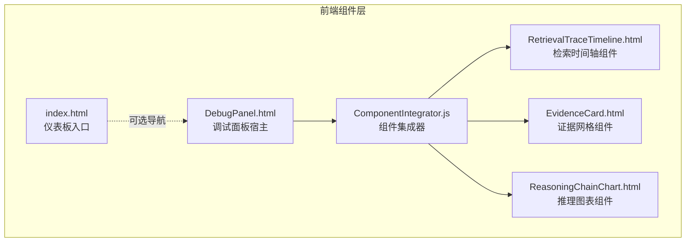
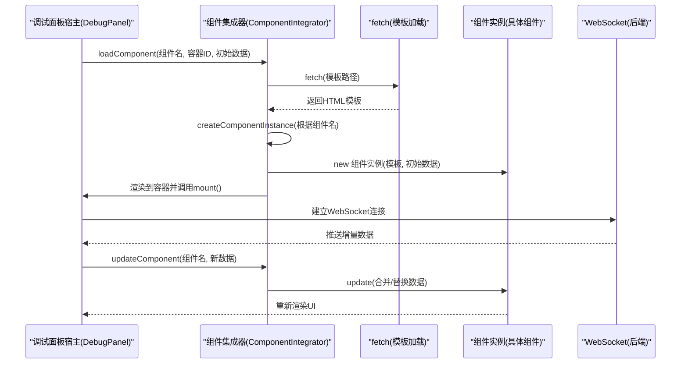
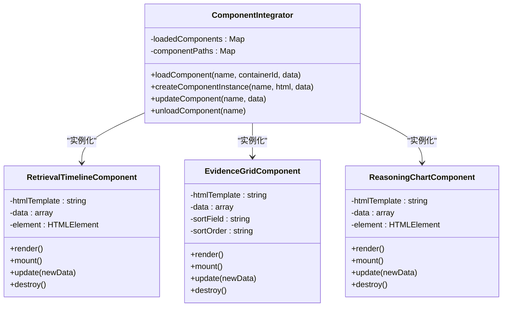
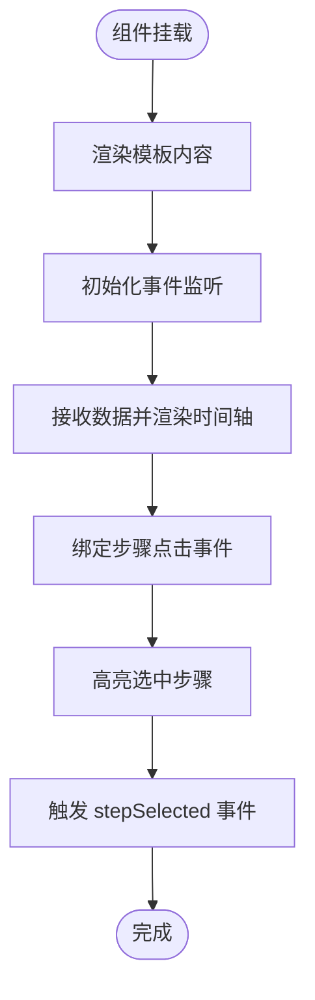
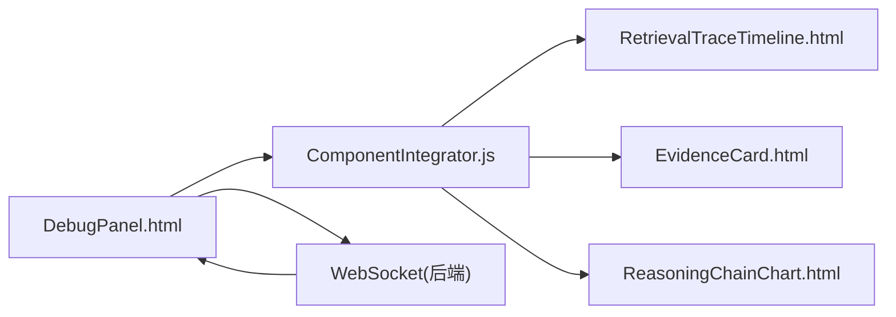

# 组件集成器

<cite>
**本文引用的文件**
- [ComponentIntegrator.js](file://src/dashboard/components/ComponentIntegrator.js)
- [RetrievalTraceTimeline.html](file://src/dashboard/components/RetrievalTraceTimeline.html)
- [EvidenceCard.html](file://src/dashboard/components/EvidenceCard.html)
- [ReasoningChainChart.html](file://src/dashboard/components/ReasoningChainChart.html)
- [DebugPanel.html](file://src/dashboard/components/DebugPanel.html)
- [index.html](file://src/dashboard/static/index.html)
</cite>

## 目录
1. [引言](#引言)
2. [项目结构](#项目结构)
3. [核心组件](#核心组件)
4. [架构总览](#架构总览)
5. [详细组件分析](#详细组件分析)
6. [依赖关系分析](#依赖关系分析)
7. [性能考虑](#性能考虑)
8. [故障排除指南](#故障排除指南)
9. [结论](#结论)
10. [附录](#附录)

## 引言
本文件面向组件集成器的开发者与维护者，系统性阐述 ComponentIntegrator.js 的架构设计、动态加载机制、生命周期管理、依赖注入模式、组件间通信协议与数据传递机制，并给出扩展与自定义开发指南、最佳实践与性能优化策略，以及与 HTML 模板的绑定机制与事件处理系统说明。

## 项目结构
组件集成器位于前端仪表板组件目录，配合多个可视化组件模板共同构成调试面板的动态可视化子系统：
- 组件集成器：负责动态加载、实例化、渲染与销毁可视化组件
- 组件模板：每个组件以独立 HTML 文件形式存在，包含模板结构与内嵌脚本
- 调试面板：作为宿主页面，通过集成器加载目标组件并驱动数据更新

**图表来源**
- [ComponentIntegrator.js:1-656](file://src/dashboard/components/ComponentIntegrator.js#L1-L656)
- [RetrievalTraceTimeline.html:1-572](file://src/dashboard/components/RetrievalTraceTimeline.html#L1-L572)
- [EvidenceCard.html:1-740](file://src/dashboard/components/EvidenceCard.html#L1-L740)
- [ReasoningChainChart.html:1-857](file://src/dashboard/components/ReasoningChainChart.html#L1-L857)
- [DebugPanel.html:1-899](file://src/dashboard/components/DebugPanel.html#L1-L899)
- [index.html:1-1026](file://src/dashboard/static/index.html#L1-L1026)

**章节来源**
- [ComponentIntegrator.js:1-656](file://src/dashboard/components/ComponentIntegrator.js#L1-L656)
- [DebugPanel.html:411-412](file://src/dashboard/components/DebugPanel.html#L411-L412)

## 核心组件
- 组件集成器（ComponentIntegrator）
  - 负责组件的动态加载、实例化、渲染、更新与销毁
  - 维护已加载组件的缓存映射，避免重复加载
  - 提供统一的组件注册表（组件名到模板路径的映射）

- 组件模板（RetrievalTimelineComponent、EvidenceGridComponent、ReasoningChartComponent）
  - 每个组件封装自身的渲染逻辑、挂载逻辑、交互事件与销毁逻辑
  - 通过 HTML 模板字符串与内联脚本实现可视化展示与用户交互

- 调试面板宿主（DebugPanel.html）
  - 作为组件的承载页面，负责会话管理、WebSocket 数据流接入与组件加载调度
  - 通过集成器加载目标组件并驱动其数据更新

**章节来源**
- [ComponentIntegrator.js:6-94](file://src/dashboard/components/ComponentIntegrator.js#L6-L94)
- [ComponentIntegrator.js:99-261](file://src/dashboard/components/ComponentIntegrator.js#L99-L261)
- [ComponentIntegrator.js:266-445](file://src/dashboard/components/ComponentIntegrator.js#L266-L445)
- [ComponentIntegrator.js:450-649](file://src/dashboard/components/ComponentIntegrator.js#L450-L649)
- [DebugPanel.html:733-774](file://src/dashboard/components/DebugPanel.html#L733-L774)

## 架构总览
组件集成器采用“模板驱动 + 动态加载 + 生命周期管理”的架构模式：
- 模板驱动：组件以独立 HTML 文件存在，包含结构与样式，便于复用与维护
- 动态加载：运行时通过 fetch 获取模板内容，解析为组件实例
- 生命周期管理：组件实例在挂载、更新、销毁阶段执行相应逻辑
- 通信协议：宿主页面通过 WebSocket 推送增量数据，组件接收后更新自身状态

**图表来源**
- [ComponentIntegrator.js:19-56](file://src/dashboard/components/ComponentIntegrator.js#L19-L56)
- [ComponentIntegrator.js:61-72](file://src/dashboard/components/ComponentIntegrator.js#L61-L72)
- [DebugPanel.html:733-774](file://src/dashboard/components/DebugPanel.html#L733-L774)
- [DebugPanel.html:429-454](file://src/dashboard/components/DebugPanel.html#L429-L454)

## 详细组件分析

### 组件集成器（ComponentIntegrator）
- 功能职责
  - 动态加载：根据组件名查找模板路径，通过 fetch 获取模板内容
  - 实例化：根据组件名选择对应的组件类，传入模板与初始数据
  - 渲染与挂载：将组件渲染后的 HTML 写入目标容器，并调用组件的 mount 方法
  - 更新与销毁：提供 updateComponent 与 unloadComponent 接口，支持增量更新与资源释放
  - 缓存管理：使用 Map 缓存已加载组件，避免重复实例化

- 关键方法
  - loadComponent：动态加载与初始化组件
  - createComponentInstance：组件工厂，按名称返回具体组件类实例
  - updateComponent：更新已有组件的数据
  - unloadComponent：销毁组件并清理缓存

- 错误处理
  - 对未知组件名、模板加载失败、实例化异常等情况进行捕获与日志输出

**图表来源**
- [ComponentIntegrator.js:6-94](file://src/dashboard/components/ComponentIntegrator.js#L6-L94)
- [ComponentIntegrator.js:99-261](file://src/dashboard/components/ComponentIntegrator.js#L99-L261)
- [ComponentIntegrator.js:266-445](file://src/dashboard/components/ComponentIntegrator.js#L266-L445)
- [ComponentIntegrator.js:450-649](file://src/dashboard/components/ComponentIntegrator.js#L450-L649)

**章节来源**
- [ComponentIntegrator.js:6-94](file://src/dashboard/components/ComponentIntegrator.js#L6-L94)
- [ComponentIntegrator.js:19-56](file://src/dashboard/components/ComponentIntegrator.js#L19-L56)
- [ComponentIntegrator.js:61-72](file://src/dashboard/components/ComponentIntegrator.js#L61-L72)

### 检索时间轴组件（RetrievalTimelineComponent）
- 渲染逻辑
  - 从模板中提取主要内容，渲染为时间轴结构
  - 支持空状态占位与步骤高亮交互

- 交互与事件
  - 点击步骤项触发自定义事件 stepSelected，携带步骤索引与数据
  - 提供高亮与统计信息展示

- 数据处理
  - 计算总耗时、步骤数量等统计
  - 根据状态映射不同样式类

**图表来源**
- [ComponentIntegrator.js:106-131](file://src/dashboard/components/ComponentIntegrator.js#L106-L131)
- [ComponentIntegrator.js:243-254](file://src/dashboard/components/ComponentIntegrator.js#L243-L254)

**章节来源**
- [ComponentIntegrator.js:99-261](file://src/dashboard/components/ComponentIntegrator.js#L99-L261)

### 证据网格组件（EvidenceGridComponent）
- 渲染逻辑
  - 支持按来源与质量过滤、按字段排序
  - 展示证据卡片，包含标题、摘要、元数据与操作按钮

- 交互与事件
  - 提供查看详情、固定证据等操作
  - 支持排序字段切换与排序方向切换

- 数据处理
  - 计算平均相关度、质量等级分类
  - 截断长文本，提升可读性

**章节来源**
- [ComponentIntegrator.js:266-445](file://src/dashboard/components/ComponentIntegrator.js#L266-L445)

### 推理图表组件（ReasoningChartComponent）
- 渲染逻辑
  - 使用 Canvas 绘制置信度趋势曲线
  - 支持多种图表类型（置信度、迭代次数、幻觉检测）

- 交互与事件
  - 支持图表类型切换、关键点标注与悬停提示
  - 计算收敛速度与幻觉概率

- 数据处理
  - 绘制坐标系网格、曲线与关键点
  - 基于方差与平均置信度估算收敛速度

**章节来源**
- [ComponentIntegrator.js:450-649](file://src/dashboard/components/ComponentIntegrator.js#L450-L649)

### 调试面板宿主（DebugPanel.html）
- 组件加载流程
  - 在标签页切换或刷新时，通过集成器加载对应组件
  - 将初始数据传入组件，随后通过 WebSocket 接收增量更新

- WebSocket 通信
  - 建立连接后订阅会话，接收检索步骤、证据、推理与性能指标等增量数据
  - 根据消息类型调用组件的 update 方法

- 事件与交互
  - 提供新建会话、自动刷新、过滤与排序等交互能力
  - 通过全局函数与组件内部方法协作

**章节来源**
- [DebugPanel.html:733-774](file://src/dashboard/components/DebugPanel.html#L733-L774)
- [DebugPanel.html:429-454](file://src/dashboard/components/DebugPanel.html#L429-L454)
- [DebugPanel.html:794-822](file://src/dashboard/components/DebugPanel.html#L794-L822)

## 依赖关系分析
- 组件集成器对组件模板的依赖
  - 通过组件名到模板路径的映射进行动态加载
  - 通过工厂方法创建具体组件实例

- 宿主页面对集成器的依赖
  - 调试面板作为宿主，集中管理会话、WebSocket 与组件加载
  - 通过集成器实现组件的解耦与可扩展

- 组件内部的依赖
  - 组件内部封装了 DOM 操作、事件绑定与数据渲染逻辑
  - 通过自定义事件与宿主页面进行松耦合通信

**图表来源**
- [ComponentIntegrator.js:9-14](file://src/dashboard/components/ComponentIntegrator.js#L9-L14)
- [DebugPanel.html:411-412](file://src/dashboard/components/DebugPanel.html#L411-L412)
- [DebugPanel.html:429-454](file://src/dashboard/components/DebugPanel.html#L429-L454)

**章节来源**
- [ComponentIntegrator.js:9-14](file://src/dashboard/components/ComponentIntegrator.js#L9-L14)
- [DebugPanel.html:411-412](file://src/dashboard/components/DebugPanel.html#L411-L412)

## 性能考虑
- 模板加载与缓存
  - 使用 Map 缓存已加载组件，避免重复请求与实例化
  - 建议在组件切换频繁的场景下预热常用组件

- 渲染优化
  - 组件内部采用最小化 DOM 更新策略，仅在必要时重绘
  - Canvas 图表组件在数据量较大时，建议分批绘制或降采样

- 事件处理
  - 组件内部事件绑定集中在 mount 阶段，销毁时需确保移除监听器
  - 宿主页面的自动刷新应设置合理的轮询间隔，避免过度请求

- WebSocket 数据流
  - 建议对高频更新的数据进行节流或去抖，减少 UI 重绘压力
  - 对大数据包进行分片传输或压缩，降低带宽占用

[本节为通用指导，无需代码引用]

## 故障排除指南
- 组件加载失败
  - 检查组件名是否在注册表中，确认模板路径正确
  - 查看网络请求状态与模板内容是否完整

- 组件实例化异常
  - 确认组件类构造函数签名与模板/数据格式一致
  - 检查模板中是否存在未定义的 DOM 节点或样式冲突

- WebSocket 断连与重连
  - 宿主页面应具备自动重连机制，并在断开时提示用户
  - 对消息类型进行校验，避免异常数据导致组件崩溃

- 内存泄漏
  - 组件销毁时需清理定时器、事件监听器与 DOM 引用
  - 使用集成器的 unloadComponent 方法统一管理组件生命周期

**章节来源**
- [ComponentIntegrator.js:52-56](file://src/dashboard/components/ComponentIntegrator.js#L52-L56)
- [DebugPanel.html:443-448](file://src/dashboard/components/DebugPanel.html#L443-L448)
- [ComponentIntegrator.js:87-94](file://src/dashboard/components/ComponentIntegrator.js#L87-L94)

## 结论
ComponentIntegrator.js 通过“模板驱动 + 动态加载 + 生命周期管理”的架构，实现了调试面板中可视化组件的灵活集成与高效运行。其清晰的职责划分、完善的错误处理与可扩展的设计，使得组件的注册、初始化与销毁流程稳定可靠；同时，与宿主页面的松耦合通信机制保证了数据流的顺畅与交互体验的流畅。遵循本文提供的最佳实践与性能优化策略，可进一步提升系统的稳定性与用户体验。

[本节为总结性内容，无需代码引用]

## 附录

### 组件扩展与自定义开发指南
- 新增组件步骤
  - 在组件注册表中添加组件名与模板路径映射
  - 实现组件类，提供 render、mount、update、destroy 方法
  - 在宿主页面中调用集成器的 loadComponent 与 updateComponent

- 数据传递规范
  - 组件通过构造函数接收初始数据，update 方法接收增量数据
  - 宿主页面通过 WebSocket 推送结构化的增量数据，组件自行合并与渲染

- 事件处理规范
  - 组件内部通过自定义事件向外广播状态变更
  - 宿主页面监听事件并协调其他组件或执行业务逻辑

**章节来源**
- [ComponentIntegrator.js:9-14](file://src/dashboard/components/ComponentIntegrator.js#L9-L14)
- [ComponentIntegrator.js:61-72](file://src/dashboard/components/ComponentIntegrator.js#L61-L72)
- [ComponentIntegrator.js:77-82](file://src/dashboard/components/ComponentIntegrator.js#L77-L82)
- [ComponentIntegrator.js:87-94](file://src/dashboard/components/ComponentIntegrator.js#L87-L94)