# 调试面板组件

<cite>
**本文档引用的文件**
- [DebugPanel.html](file://src/dashboard/components/DebugPanel.html)
- [ComponentIntegrator.js](file://src/dashboard/components/ComponentIntegrator.js)
- [api.py](file://src/dashboard/debug/api.py)
- [websocket.py](file://src/dashboard/debug/websocket.py)
- [models.py](file://src/dashboard/debug/models.py)
- [connection.py](file://src/dashboard/debug/connection.py)
- [performance.py](file://src/dashboard/debug/performance.py)
- [analyzer.py](file://src/dashboard/debug/analyzer.py)
- [tuning.py](file://src/dashboard/debug/tuning.py)
- [enhanced_error_handler.py](file://src/dashboard/debug/enhanced_error_handler.py)
- [path_analyzer.py](file://src/dashboard/debug/path_analyzer.py)
- [ab_testing.py](file://src/dashboard/debug/ab_testing.py)
- [recommendation.py](file://src/dashboard/debug/recommendation.py)
</cite>

## 目录
1. [项目概述](#项目概述)
2. [项目结构](#项目结构)
3. [核心组件](#核心组件)
4. [架构概览](#架构概览)
5. [详细组件分析](#详细组件分析)
6. [依赖关系分析](#依赖关系分析)
7. [性能考虑](#性能考虑)
8. [故障排除指南](#故障排除指南)
9. [结论](#结论)

## 项目概述

调试面板组件是NecoRAG系统中的核心可视化调试工具，提供实时监控、性能分析和系统诊断功能。该组件通过Web界面展示复杂的调试信息，包括检索路径追踪、证据来源分析、推理过程可视化和性能指标监控。

该系统采用前后端分离架构，前端使用HTML/CSS/JavaScript构建交互式界面，后端基于FastAPI提供RESTful API和WebSocket实时通信服务。系统支持多维度的调试信息展示，包括会话管理、实时数据推送、错误处理和性能监控等功能。

## 项目结构

调试面板组件位于`src/dashboard/components/`目录下，主要包含以下文件：

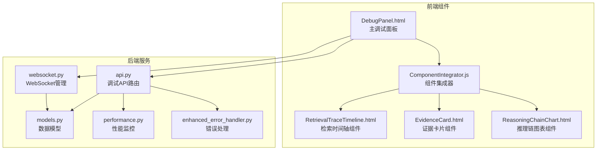

**图表来源**
- [DebugPanel.html:1-899](file://src/dashboard/components/DebugPanel.html#L1-L899)
- [ComponentIntegrator.js:1-656](file://src/dashboard/components/ComponentIntegrator.js#L1-L656)
- [api.py:1-557](file://src/dashboard/debug/api.py#L1-L557)
- [websocket.py:1-554](file://src/dashboard/debug/websocket.py#L1-L554)

**章节来源**
- [DebugPanel.html:1-899](file://src/dashboard/components/DebugPanel.html#L1-L899)
- [ComponentIntegrator.js:1-656](file://src/dashboard/components/ComponentIntegrator.js#L1-L656)

## 核心组件

### 调试面板主界面

调试面板采用现代化的UI设计，提供响应式的布局和丰富的交互功能：

- **头部工具栏**：显示连接状态、提供新建会话和自动刷新功能
- **侧边栏会话列表**：展示所有调试会话，支持会话选择和状态显示
- **主视图区域**：包含多个标签页，分别展示不同类型的调试信息

### 组件集成器

ComponentIntegrator.js负责动态加载和管理各种可视化组件：

- **动态组件加载**：支持检索时间轴、证据网格和推理图表等组件的动态加载
- **组件生命周期管理**：提供组件的创建、更新、销毁等完整生命周期管理
- **数据绑定**：支持组件与后端数据的双向绑定和实时更新

### WebSocket通信层

WebSocket管理器提供实时数据推送功能：

- **连接管理**：支持多个客户端的并发连接管理
- **消息路由**：根据消息类型将数据分发到相应的订阅者
- **会话订阅**：支持按会话粒度的数据订阅和推送

**章节来源**
- [DebugPanel.html:414-800](file://src/dashboard/components/DebugPanel.html#L414-L800)
- [ComponentIntegrator.js:6-94](file://src/dashboard/components/ComponentIntegrator.js#L6-L94)
- [websocket.py:49-130](file://src/dashboard/debug/websocket.py#L49-L130)

## 架构概览

系统采用分层架构设计，确保各组件之间的松耦合和高内聚：

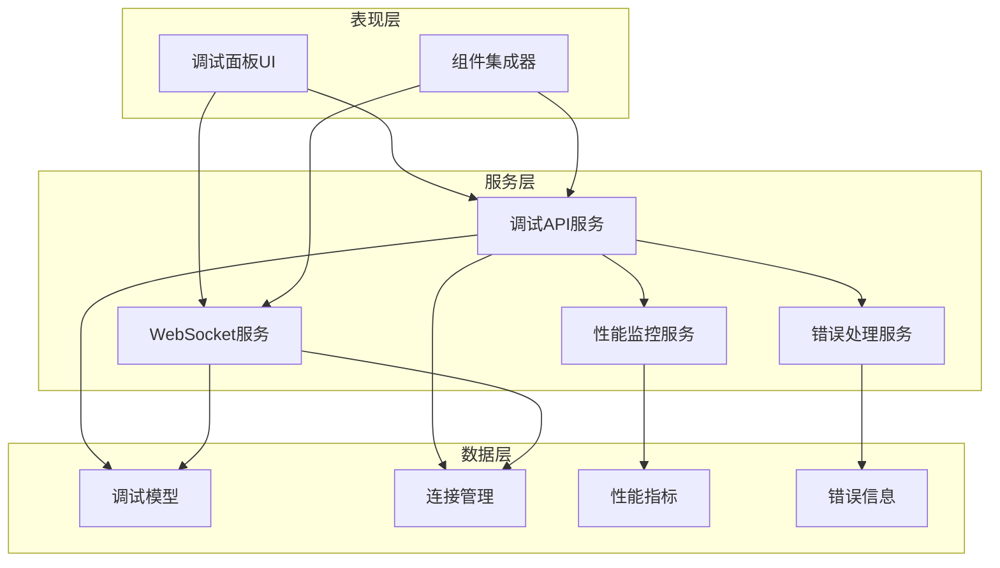

**图表来源**
- [api.py:22-25](file://src/dashboard/debug/api.py#L22-L25)
- [websocket.py:49-66](file://src/dashboard/debug/websocket.py#L49-L66)
- [models.py:13-336](file://src/dashboard/debug/models.py#L13-L336)
- [performance.py:103-155](file://src/dashboard/debug/performance.py#L103-L155)

系统的核心交互流程如下：

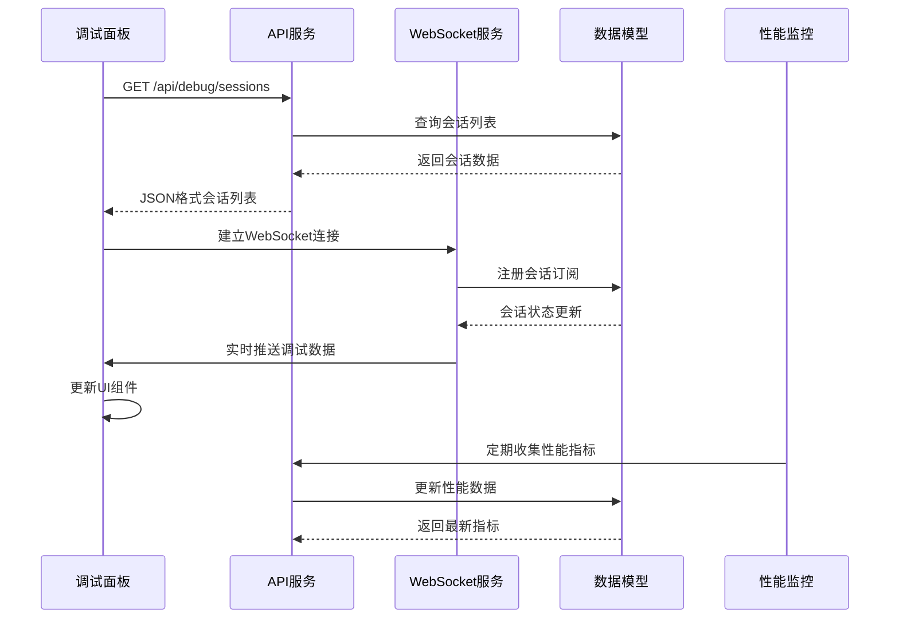

**图表来源**
- [api.py:91-146](file://src/dashboard/debug/api.py#L91-L146)
- [websocket.py:92-130](file://src/dashboard/debug/websocket.py#L92-L130)
- [performance.py:130-155](file://src/dashboard/debug/performance.py#L130-L155)

## 详细组件分析

### 调试面板UI组件

调试面板采用现代化的CSS设计，提供丰富的视觉效果和交互体验：

#### 样式系统设计

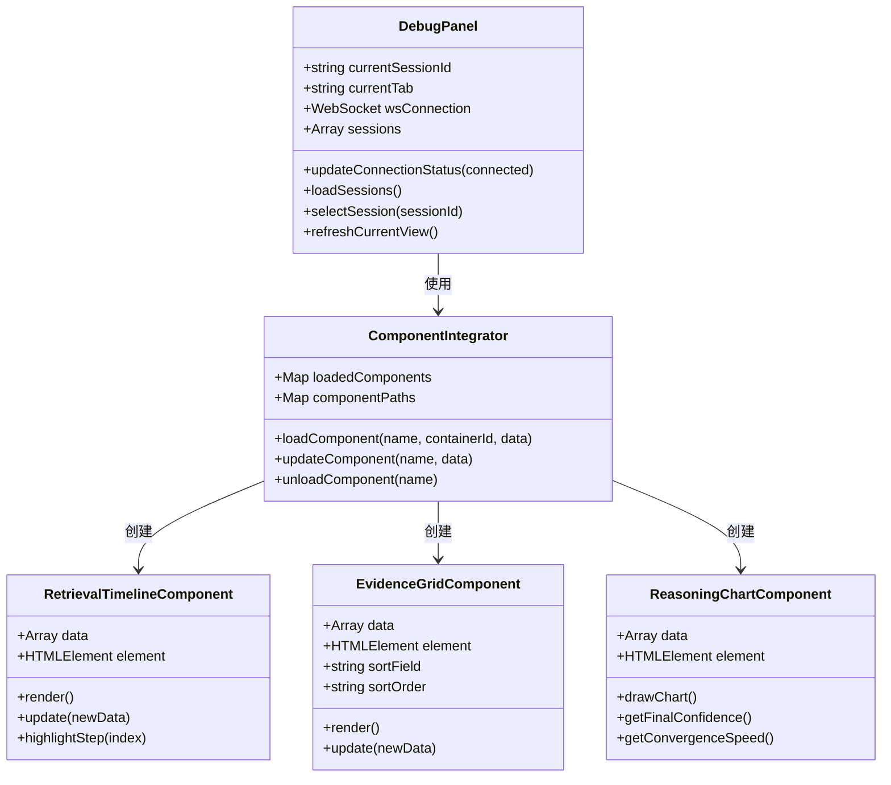

**图表来源**
- [DebugPanel.html:414-800](file://src/dashboard/components/DebugPanel.html#L414-L800)
- [ComponentIntegrator.js:6-94](file://src/dashboard/components/ComponentIntegrator.js#L6-L94)

#### 交互功能实现

调试面板提供多种交互功能：

- **会话管理**：支持新建、选择、刷新调试会话
- **标签页切换**：支持概览、检索路径、证据来源、推理过程、性能指标等视图切换
- **自动刷新**：支持定时自动刷新功能
- **实时监控**：通过WebSocket实现实时数据更新

### 数据模型系统

系统采用数据类设计，提供强类型的数据结构：

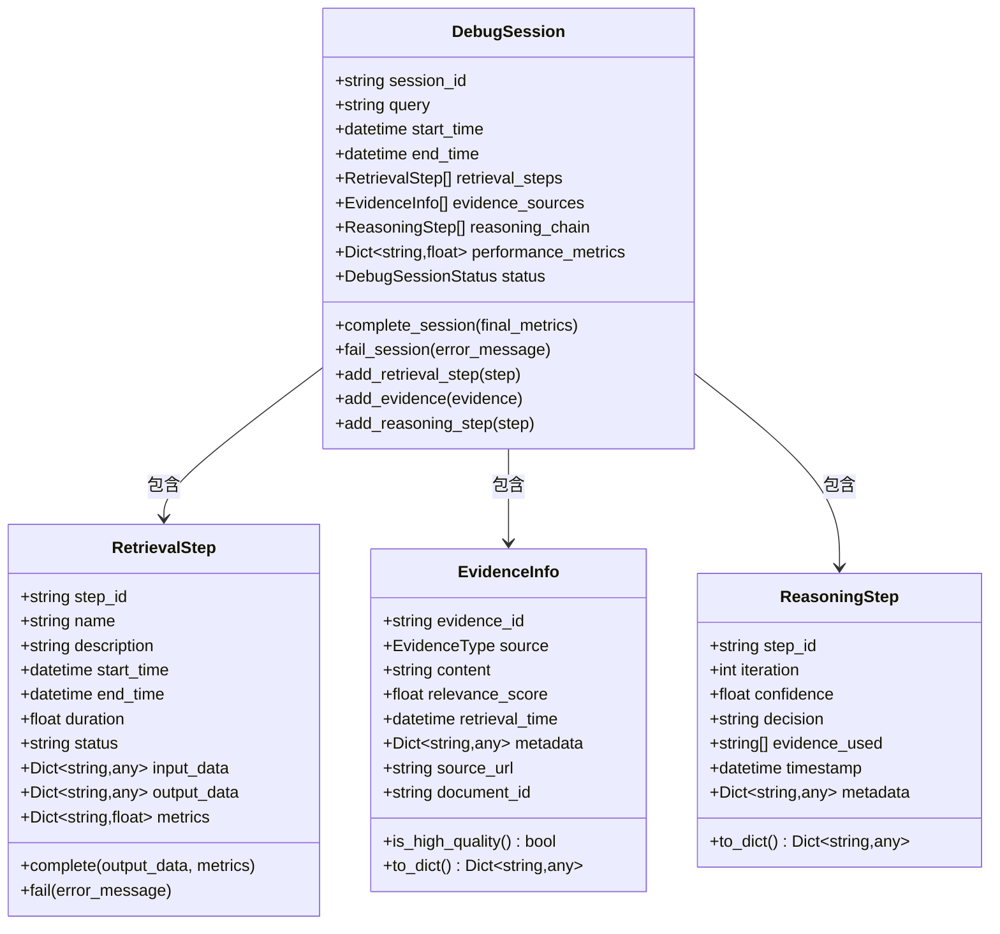

**图表来源**
- [models.py:186-276](file://src/dashboard/debug/models.py#L186-L276)
- [models.py:78-144](file://src/dashboard/debug/models.py#L78-L144)
- [models.py:29-75](file://src/dashboard/debug/models.py#L29-L75)
- [models.py:147-183](file://src/dashboard/debug/models.py#L147-L183)

### WebSocket通信协议

系统使用标准化的消息协议进行实时通信：

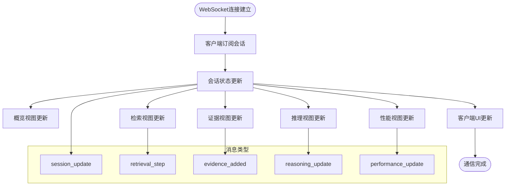

**图表来源**
- [websocket.py:200-261](file://src/dashboard/debug/websocket.py#L200-L261)
- [DebugPanel.html:470-489](file://src/dashboard/components/DebugPanel.html#L470-L489)

### 性能监控系统

系统提供全面的性能监控能力：

#### 性能指标收集

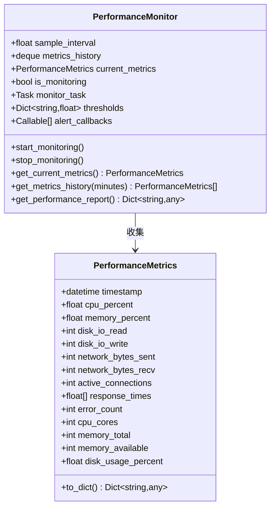

**图表来源**
- [performance.py:19-77](file://src/dashboard/debug/performance.py#L19-L77)
- [performance.py:103-155](file://src/dashboard/debug/performance.py#L103-L155)

#### 错误处理机制

系统采用多层次的错误处理策略：

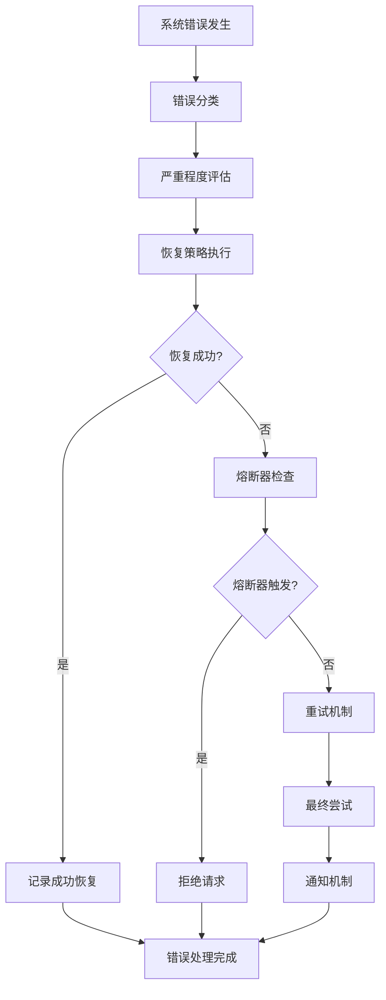

**图表来源**
- [enhanced_error_handler.py:72-169](file://src/dashboard/debug/enhanced_error_handler.py#L72-L169)
- [enhanced_error_handler.py:296-331](file://src/dashboard/debug/enhanced_error_handler.py#L296-L331)

### 分析引擎系统

系统提供多种分析能力：

#### 路径分析器

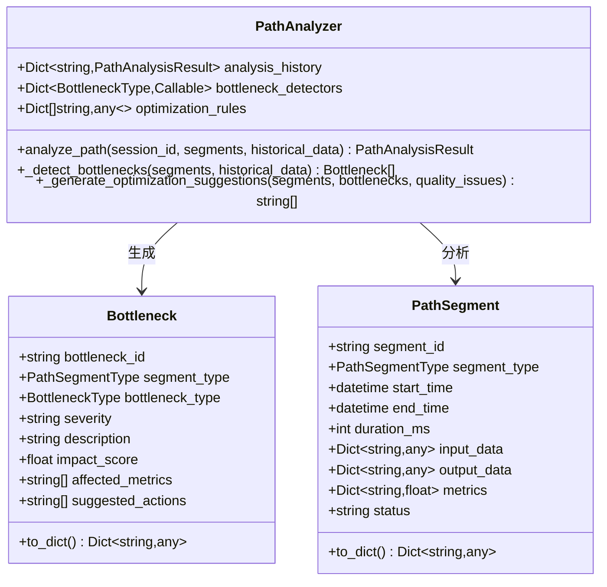

**图表来源**
- [path_analyzer.py:126-237](file://src/dashboard/debug/path_analyzer.py#L126-L237)
- [path_analyzer.py:97-124](file://src/dashboard/debug/path_analyzer.py#L97-L124)

#### 参数调优系统

系统支持智能的参数调优功能：

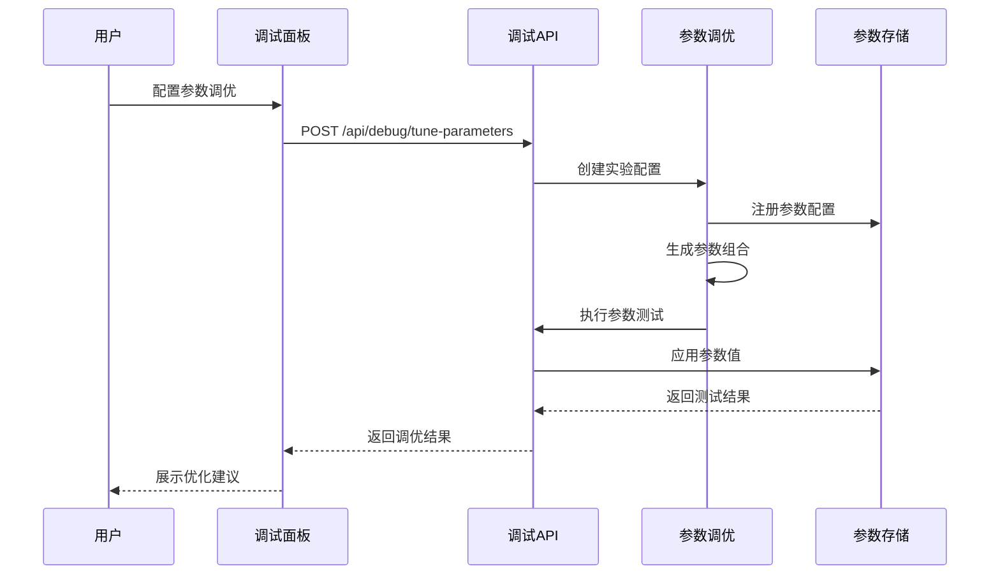

**图表来源**
- [tuning.py:286-332](file://src/dashboard/debug/tuning.py#L286-L332)
- [tuning.py:414-446](file://src/dashboard/debug/tuning.py#L414-L446)

**章节来源**
- [DebugPanel.html:414-800](file://src/dashboard/components/DebugPanel.html#L414-L800)
- [models.py:13-336](file://src/dashboard/debug/models.py#L13-L336)
- [websocket.py:19-554](file://src/dashboard/debug/websocket.py#L19-L554)
- [performance.py:103-658](file://src/dashboard/debug/performance.py#L103-L658)
- [enhanced_error_handler.py:72-558](file://src/dashboard/debug/enhanced_error_handler.py#L72-L558)
- [path_analyzer.py:126-628](file://src/dashboard/debug/path_analyzer.py#L126-L628)
- [tuning.py:115-600](file://src/dashboard/debug/tuning.py#L115-L600)

## 依赖关系分析

系统采用模块化设计，各组件之间存在清晰的依赖关系：

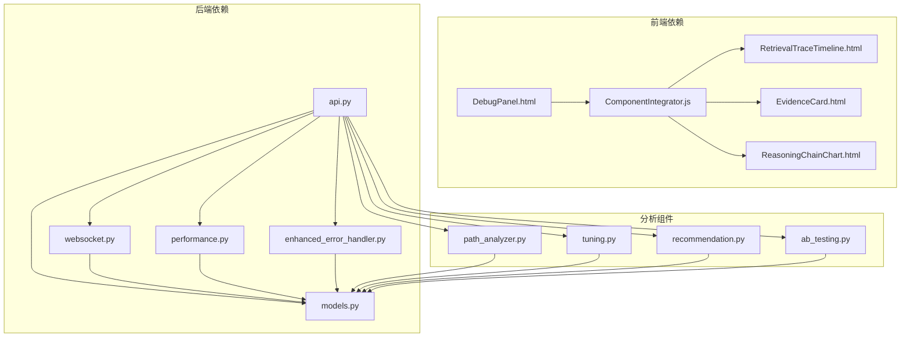

**图表来源**
- [api.py:6-25](file://src/dashboard/debug/api.py#L6-L25)
- [websocket.py:13-14](file://src/dashboard/debug/websocket.py#L13-L14)
- [path_analyzer.py:10-14](file://src/dashboard/debug/path_analyzer.py#L10-L14)
- [tuning.py:10-14](file://src/dashboard/debug/tuning.py#L10-L14)
- [recommendation.py:9-15](file://src/dashboard/debug/recommendation.py#L9-L15)

### 数据流分析

系统内部的数据流遵循清晰的处理管道：

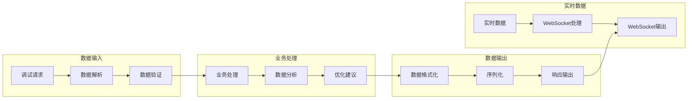

**图表来源**
- [api.py:91-181](file://src/dashboard/debug/api.py#L91-L181)
- [websocket.py:200-261](file://src/dashboard/debug/websocket.py#L200-L261)

**章节来源**
- [api.py:1-557](file://src/dashboard/debug/api.py#L1-L557)
- [websocket.py:1-554](file://src/dashboard/debug/websocket.py#L1-L554)
- [path_analyzer.py:165-237](file://src/dashboard/debug/path_analyzer.py#L165-L237)

## 性能考虑

系统在设计时充分考虑了性能优化：

### 前端性能优化

- **组件懒加载**：使用ComponentIntegrator实现组件的按需加载
- **虚拟滚动**：对于大量数据的列表使用虚拟滚动技术
- **防抖节流**：对高频操作使用防抖和节流机制
- **缓存策略**：合理使用浏览器缓存减少重复请求

### 后端性能优化

- **连接池管理**：WebSocket连接采用池化管理减少资源消耗
- **异步处理**：大量使用async/await确保非阻塞操作
- **批量处理**：支持批量数据处理减少网络往返
- **内存管理**：及时清理不再使用的数据结构

### 监控指标

系统提供全面的性能监控指标：

- **响应时间**：跟踪API请求和WebSocket消息的响应时间
- **吞吐量**：监控系统的处理能力和并发性能
- **资源使用**：CPU、内存、磁盘和网络使用情况
- **错误率**：系统错误的发生频率和类型分布

## 故障排除指南

### 常见问题诊断

#### 连接问题

**症状**：调试面板无法连接到后端服务
**诊断步骤**：
1. 检查网络连接状态
2. 验证WebSocket连接URL配置
3. 查看浏览器开发者工具的网络面板
4. 检查后端服务日志

**解决方案**：
- 确认服务端口和主机配置正确
- 检查防火墙和代理设置
- 验证SSL证书配置（如使用HTTPS）

#### 数据加载问题

**症状**：会话数据无法正常加载
**诊断步骤**：
1. 检查API端点可用性
2. 验证数据库连接状态
3. 查看请求响应状态码

**解决方案**：
- 重启后端服务
- 检查数据库连接池配置
- 清理缓存数据

#### 实时更新问题

**症状**：WebSocket消息无法正常接收
**诊断步骤**：
1. 检查WebSocket连接状态
2. 验证消息格式和协议版本
3. 查看订阅关系配置

**解决方案**：
- 重新建立WebSocket连接
- 检查消息路由配置
- 验证会话订阅状态

### 错误处理机制

系统提供完善的错误处理机制：

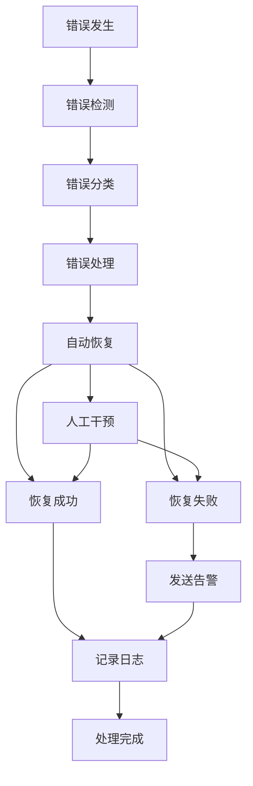

**图表来源**
- [enhanced_error_handler.py:135-169](file://src/dashboard/debug/enhanced_error_handler.py#L135-L169)

**章节来源**
- [enhanced_error_handler.py:135-558](file://src/dashboard/debug/enhanced_error_handler.py#L135-L558)

## 结论

调试面板组件是一个功能完整、架构清晰的可视化调试工具。系统通过模块化设计实现了高度的可扩展性和可维护性，同时提供了丰富的性能监控和错误处理能力。

### 主要优势

1. **模块化架构**：清晰的组件分离和依赖管理
2. **实时通信**：基于WebSocket的高效实时数据传输
3. **可视化展示**：多种图表和组件提供直观的数据展示
4. **智能分析**：内置的分析引擎提供深度的数据洞察
5. **错误处理**：多层次的错误处理和恢复机制

### 扩展建议

1. **插件系统**：可以进一步扩展组件系统支持第三方插件
2. **配置管理**：提供更灵活的配置管理和热重载机制
3. **性能优化**：持续优化大数据量场景下的性能表现
4. **安全增强**：加强访问控制和数据加密机制
5. **移动端适配**：优化移动端的用户体验

该调试面板组件为NecoRAG系统的开发和运维提供了强大的支持，是系统可观测性的重要组成部分。