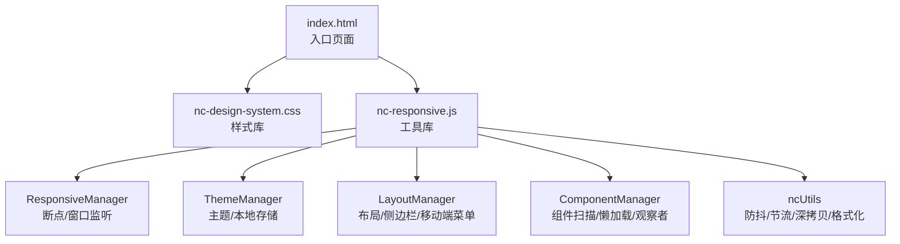
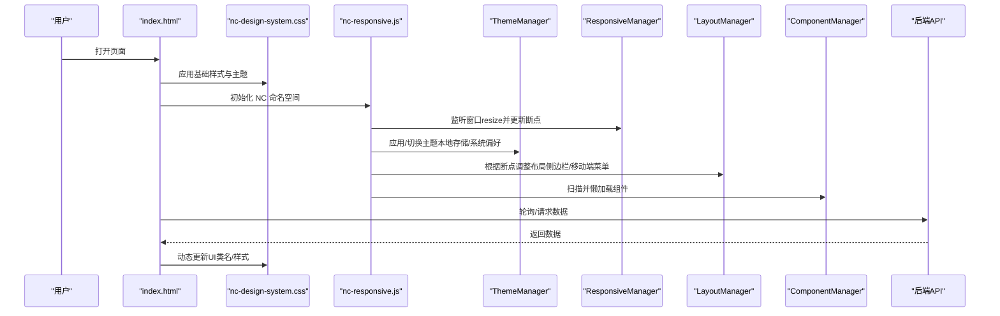
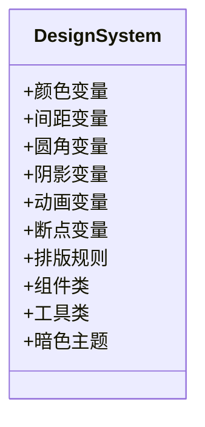
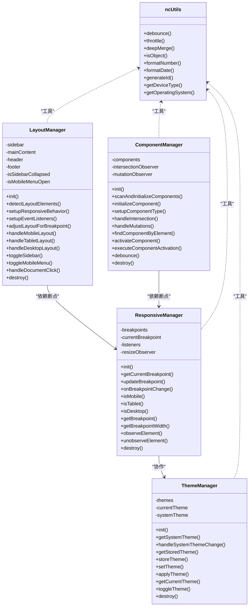
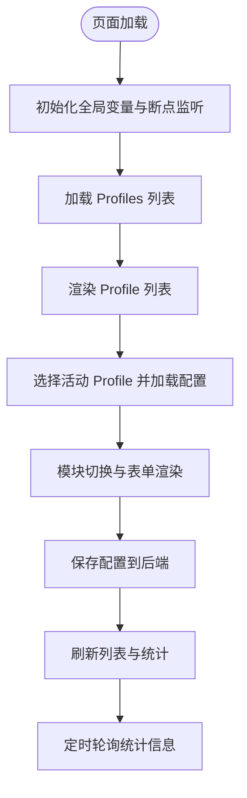

# 静态资源管理

<cite>
**本文引用的文件**
- [nc-design-system.css](file://src/dashboard/static/css/nc-design-system.css)
- [nc-responsive.js](file://src/dashboard/static/js/nc-responsive.js)
- [index.html](file://src/dashboard/static/index.html)
- [version_manager.py](file://tools/version_manager.py)
- [pyproject.toml](file://pyproject.toml)
- [仪表板界面.md](file://wiki/wiki/仪表板系统/仪表板界面.md)
- [IMPLEMENTATION_SUMMARY.md](file://src/dashboard/IMPLEMENTATION_SUMMARY.md)
</cite>

## 目录
1. [引言](#引言)
2. [项目结构](#项目结构)
3. [核心组件](#核心组件)
4. [架构总览](#架构总览)
5. [详细组件分析](#详细组件分析)
6. [依赖关系分析](#依赖关系分析)
7. [性能考量](#性能考量)
8. [故障排查指南](#故障排查指南)
9. [结论](#结论)
10. [附录](#附录)

## 引言
本文件面向静态资源管理系统，聚焦于调试面板的CSS样式系统与JavaScript工具库的实现与设计规范，涵盖主题系统、响应式断点、DOM与事件处理、工具函数、资源组织与命名规范、版本管理与CDN部署策略、跨浏览器兼容与性能优化建议等。目标是帮助开发者快速理解并高效维护该静态资源体系。

## 项目结构
静态资源位于仪表盘的静态目录中，采用“按功能域”组织方式：
- CSS：集中于 nc-design-system.css，提供主题、排版、组件、布局、工具类与暗色主题支持。
- JS：集中于 nc-responsive.js，提供响应式断点管理、主题管理、布局管理、组件管理与工具函数。
- HTML：index.html 作为仪表盘入口页面，内嵌基础样式与交互逻辑，并通过全局 NC 命名空间暴露工具库。



**图表来源**
- [index.html](file://src/dashboard/static/index.html)
- [nc-design-system.css](file://src/dashboard/static/css/nc-design-system.css)
- [nc-responsive.js](file://src/dashboard/static/js/nc-responsive.js)

**章节来源**
- [index.html](file://src/dashboard/static/index.html)
- [nc-design-system.css](file://src/dashboard/static/css/nc-design-system.css)
- [nc-responsive.js](file://src/dashboard/static/js/nc-responsive.js)

## 核心组件
- 主题系统与CSS变量：通过 :root 定义颜色、间距、圆角、阴影、动画与断点，支持暗色主题媒体查询。
- 响应式断点：JS断点与CSS媒体查询协同，提供 xs/sm/md/lg/xl/xxl 六档断点。
- DOM与事件：通过全局命名空间 NC 暴露实例，统一事件监听与生命周期管理。
- 工具函数：防抖、节流、深合并、格式化、设备检测等，提升开发效率与性能。

**章节来源**
- [nc-design-system.css](file://src/dashboard/static/css/nc-design-system.css)
- [nc-responsive.js](file://src/dashboard/static/js/nc-responsive.js)

## 架构总览
静态资源的控制流如下：
- 页面加载：index.html 注入基础样式与脚本，随后初始化 NC 命名空间。
- 样式应用：nc-design-system.css 通过CSS变量与媒体查询提供主题与响应式能力。
- 交互与适配：nc-responsive.js 通过 ResponsiveManager、ThemeManager、LayoutManager、ComponentManager 提供断点监听、主题切换、布局适配与组件懒加载。
- 数据驱动：index.html 通过 Fetch API 与后端交互，动态更新 UI。



**图表来源**
- [index.html](file://src/dashboard/static/index.html)
- [nc-design-system.css](file://src/dashboard/static/css/nc-design-system.css)
- [nc-responsive.js](file://src/dashboard/static/js/nc-responsive.js)

## 详细组件分析

### CSS样式系统：nc-design-system.css
- 主题与语义化颜色：通过 --nc-* 变量定义主色、成功/警告/危险、灰阶与语义色，统一背景、表面、边框、文本与阴影。
- 间距与圆角：提供 xs/sm/md/lg/xl/2xl/3xl 与 sm/md/lg/xl/full 等多档间距与圆角，保证一致的视觉节奏。
- 阴影与动画：定义 sm/md/lg/xl 四档阴影与 fast/normal/slow 三档过渡，提升交互反馈。
- 断点系统：定义 sm/md/lg/xl/2xl 共五档断点，配合媒体查询实现响应式网格与布局。
- 排版系统：提供标题与正文的字号、字重、行高、字距规范，确保可读性与层级感。
- 组件系统：按钮、卡片、表单、网格、Flex、Badge、Toast、Modal、图表容器等，均以类名组合实现。
- 工具类：提供对齐、字体粗细、圆角、阴影、截断、过渡等常用工具类。
- 暗色主题：通过 prefers-color-scheme: dark 的媒体查询覆盖颜色变量，实现自动暗色主题。



**图表来源**
- [nc-design-system.css](file://src/dashboard/static/css/nc-design-system.css)

**章节来源**
- [nc-design-system.css](file://src/dashboard/static/css/nc-design-system.css)

### JavaScript工具库：nc-responsive.js
- ResponsiveManager：负责断点检测、窗口与容器变化监听、断点变更事件派发、设备类型判断、ResizeObserver集成与销毁。
- ThemeManager：负责主题存储与读取（localStorage）、系统主题监听（prefers-color-scheme）、主题切换与自定义事件派发。
- LayoutManager：负责布局元素检测、断点变化响应、侧边栏/移动端菜单切换、点击外部关闭、滚动锁定与事件派发。
- ComponentManager：负责组件扫描（nc-component属性）、IntersectionObserver懒加载、MutationObserver DOM变化监听、组件激活事件与特定类型组件初始化（图表/表格/表单/卡片）。
- ncUtils：提供防抖、节流、深合并、对象判断、数字/日期格式化、ID生成、设备/系统检测等通用工具。



**图表来源**
- [nc-responsive.js](file://src/dashboard/static/js/nc-responsive.js)

**章节来源**
- [nc-responsive.js](file://src/dashboard/static/js/nc-responsive.js)

### HTML入口：index.html
- 基础样式：内联基础样式，定义容器、卡片、按钮、模态框、Toast、统计网格等。
- 响应式：针对移动端的栅格与表单项布局调整。
- 交互逻辑：模块切换、Profile 管理、配置保存/删除/激活、统计刷新、Toast 提示等。
- 数据驱动：通过 Fetch API 与后端交互，定时刷新统计信息。



**图表来源**
- [index.html](file://src/dashboard/static/index.html)

**章节来源**
- [index.html](file://src/dashboard/static/index.html)

## 依赖关系分析
- CSS与JS的耦合：JS通过断点与主题类名影响CSS变量与媒体查询表现；CSS通过类名驱动JS组件行为。
- HTML与JS：index.html 通过 NC 命名空间调用 JS 实例，实现断点、主题、布局与组件管理。
- 版本与部署：版本号由 tools/version_manager.py 管理，pyproject.toml 统一声明，用于构建与发布流程。

```mermaid
graph LR
CSS["nc-design-system.css"] <- --> JS["nc-responsive.js"]
HTML["index.html"] --> JS
JS --> CSS
VM["version_manager.py"] --> POM["pyproject.toml"]
```

**图表来源**
- [nc-design-system.css](file://src/dashboard/static/css/nc-design-system.css)
- [nc-responsive.js](file://src/dashboard/static/js/nc-responsive.js)
- [index.html](file://src/dashboard/static/index.html)
- [version_manager.py](file://tools/version_manager.py)
- [pyproject.toml](file://pyproject.toml)

**章节来源**
- [nc-design-system.css](file://src/dashboard/static/css/nc-design-system.css)
- [nc-responsive.js](file://src/dashboard/static/js/nc-responsive.js)
- [index.html](file://src/dashboard/static/index.html)
- [version_manager.py](file://tools/version_manager.py)
- [pyproject.toml](file://pyproject.toml)

## 性能考量
- 懒加载与可见性：ComponentManager 使用 IntersectionObserver 控制组件初始化时机，减少首屏负担。
- 防抖与节流：ncUtils 提供防抖与节流，降低高频事件（如滚动、窗口resize）对主线程的压力。
- CSS变量与媒体查询：通过CSS变量与媒体查询实现主题与断点切换，避免频繁DOM操作。
- 组件销毁：各管理器提供 destroy 方法，释放事件监听与观察者，防止内存泄漏。
- 资源体积：index.html 采用内联样式与脚本，适合单页仪表盘场景；若需CDN部署，建议拆分为独立CSS/JS并开启压缩与缓存。

[本节为通用性能建议，不直接分析具体文件]

## 故障排查指南
- 主题不生效：确认系统主题偏好与本地存储设置；检查 :root 类名与暗色主题媒体查询。
- 断点不触发：检查窗口resize监听与断点宽度映射；确认媒体查询与类名拼写。
- 组件未懒加载：检查 nc-component 属性与 IntersectionObserver 支持；确认组件激活事件派发。
- 交互异常：检查事件绑定与命名空间暴露；确认 destroy 生命周期清理。
- 跨浏览器兼容：根据 wiki 文档建议引入 polyfill 支持 Promise 与 Fetch；确保 CSS Grid/Flexbox 在目标浏览器可用。

**章节来源**
- [仪表板界面.md](file://wiki/wiki/仪表板系统/仪表板界面.md)

## 结论
该静态资源系统以CSS变量与媒体查询为核心，结合JS断点、主题、布局与组件管理，形成统一的设计语言与响应式体验。通过工具函数与观察者模式，系统在保证性能的同时提供了良好的可维护性与扩展性。建议在生产环境中进一步完善CDN部署、缓存策略与跨浏览器兼容方案。

[本节为总结性内容，不直接分析具体文件]

## 附录

### 响应式断点定义
- JS断点：xs(0)、sm(640)、md(768)、lg(1024)、xl(1280)、xxl(1536)
- CSS断点：sm(640px)、md(768px)、lg(1024px)、xl(1280px)、2xl(1536px)

**章节来源**
- [nc-design-system.css](file://src/dashboard/static/css/nc-design-system.css)
- [nc-responsive.js](file://src/dashboard/static/js/nc-responsive.js)

### 主题系统与暗色主题
- 主题枚举：light/dark/auto
- 存储：localStorage 中的 nc-theme 键
- 应用：通过 documentElement 的 theme-light/theme-dark 类名切换
- 媒体查询：prefers-color-scheme: dark 自动适配

**章节来源**
- [nc-responsive.js](file://src/dashboard/static/js/nc-responsive.js)
- [nc-design-system.css](file://src/dashboard/static/css/nc-design-system.css)

### 资源组织与命名规范
- CSS：nc-前缀类名，语义化命名（如 nc-btn、nc-card、nc-grid、nc-badge）
- JS：类名以大驼峰，实例挂载至 window.NC 命名空间
- HTML：组件通过 nc-component 属性标识，配合懒加载与激活事件

**章节来源**
- [nc-design-system.css](file://src/dashboard/static/css/nc-design-system.css)
- [nc-responsive.js](file://src/dashboard/static/js/nc-responsive.js)
- [index.html](file://src/dashboard/static/index.html)

### 资源优化与缓存策略
- 压缩与合并：CSS/JS 压缩与合并，减少请求数与体积
- 缓存头：静态资源设置长缓存（ETag/Last-Modified），版本化文件名
- CDN：静态资源走CDN，回源使用版本化文件名，避免缓存污染
- 按需加载：组件懒加载与按需引入第三方库（如图表库）

[本节为通用优化建议，不直接分析具体文件]

### 跨浏览器兼容性
- 建议支持现代浏览器（Chrome/Firefox/Safari Edge），使用原生 Promise 与 Fetch API
- 对于旧版浏览器，引入 polyfill 以支持 Promise 与 Fetch
- 响应式布局使用 CSS Grid 与 Flexbox，确保在主流移动设备上的良好体验

**章节来源**
- [仪表板界面.md](file://wiki/wiki/仪表板系统/仪表板界面.md)

### 版本管理与CDN部署策略
- 版本管理：tools/version_manager.py 提供版本号读取、递增、同步与批量更新
- 版本声明：pyproject.toml 中 version 字段与 VERSION 文件保持一致
- 部署策略：版本号参与文件名哈希，CDN缓存失效后自动拉取新版本

**章节来源**
- [version_manager.py](file://tools/version_manager.py)
- [pyproject.toml](file://pyproject.toml)
- [IMPLEMENTATION_SUMMARY.md](file://src/dashboard/IMPLEMENTATION_SUMMARY.md)