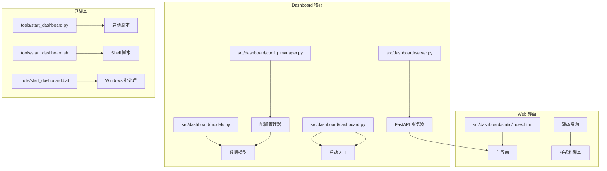
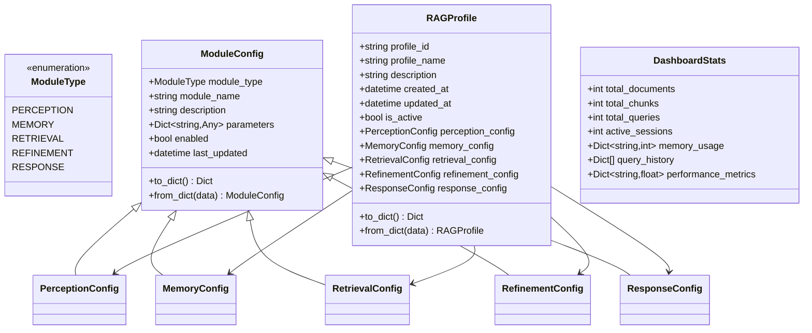
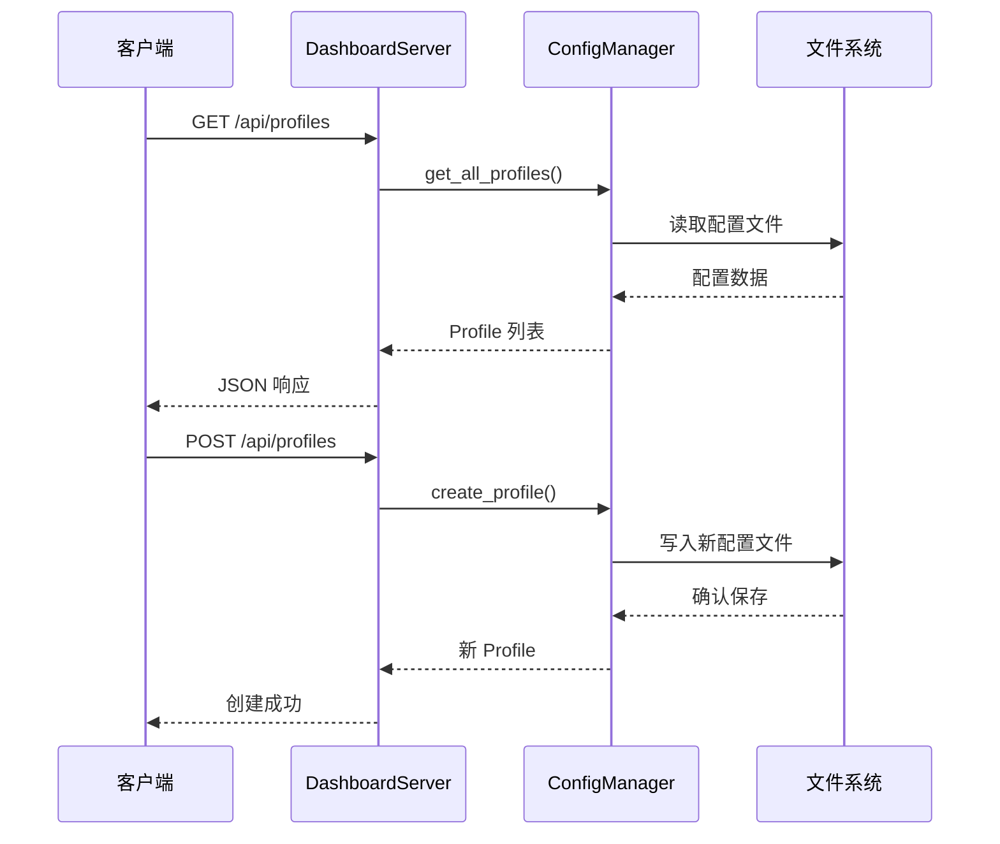
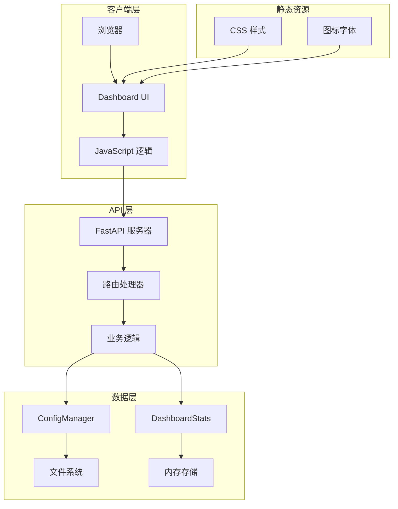
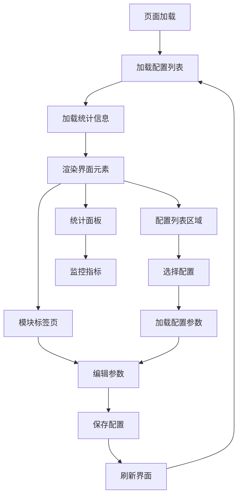
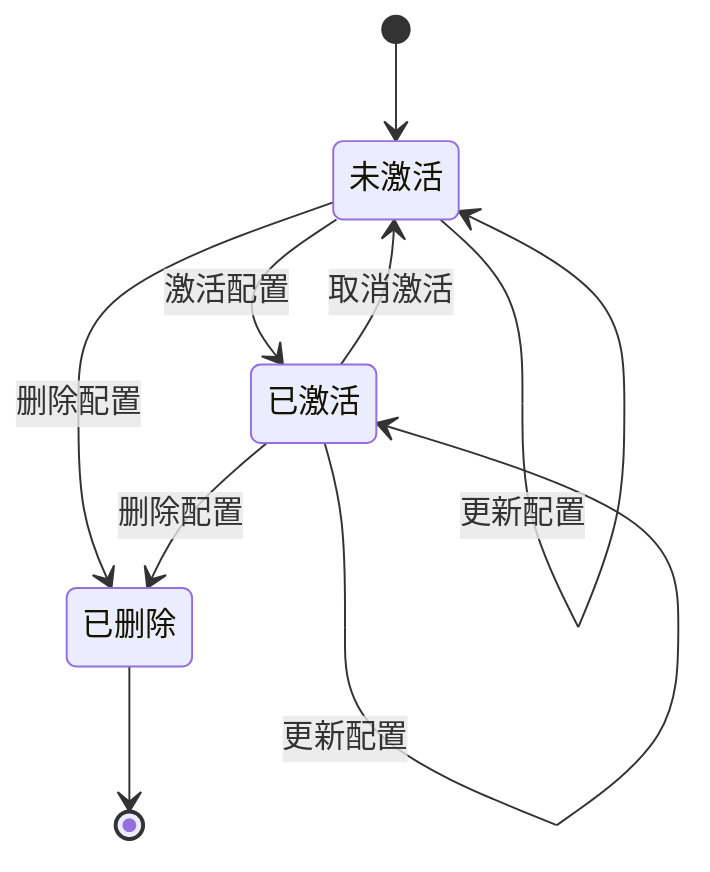
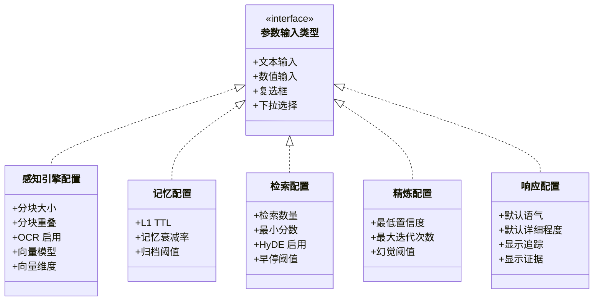
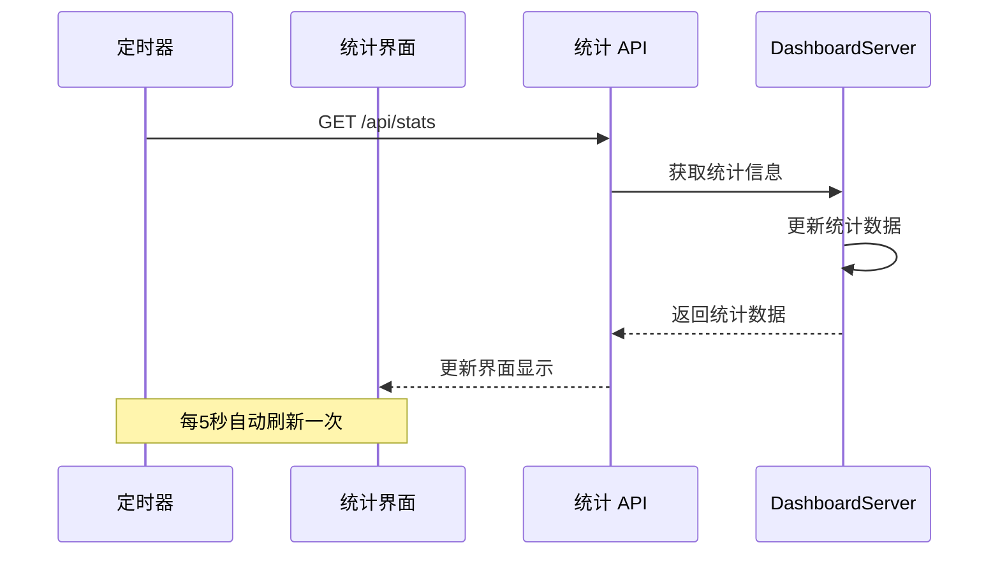
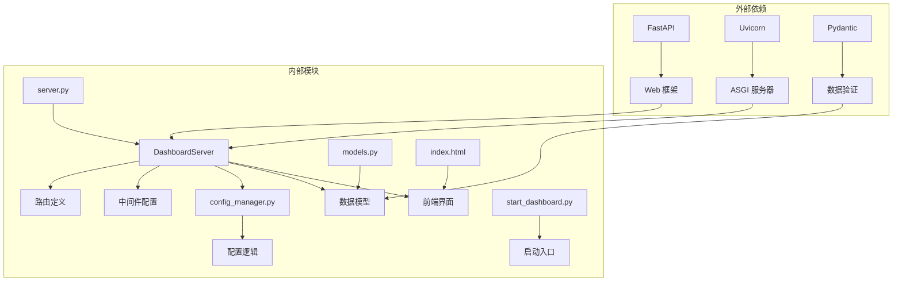

# Web 界面

<cite>
**本文档引用的文件**
- [index.html](file://src/dashboard/static/index.html)
- [dashboard.py](file://src/dashboard/dashboard.py)
- [models.py](file://src/dashboard/models.py)
- [config_manager.py](file://src/dashboard/config_manager.py)
- [server.py](file://src/dashboard/server.py)
- [README.md](file://src/dashboard/README.md)
- [DASHBOARD_GUIDE.md](file://DASHBOARD_GUIDE.md)
- [start_dashboard.py](file://tools/start_dashboard.py)
- [start_dashboard.sh](file://tools/start_dashboard.sh)
</cite>

## 目录
1. [简介](#简介)
2. [项目结构](#项目结构)
3. [核心组件](#核心组件)
4. [架构概览](#架构概览)
5. [详细组件分析](#详细组件分析)
6. [依赖关系分析](#依赖关系分析)
7. [性能考虑](#性能考虑)
8. [故障排除指南](#故障排除指南)
9. [结论](#结论)

## 简介

NecoRAG Dashboard 是一个基于 FastAPI 的现代化 Web 管理界面，专为 NecoRAG 认知型 RAG 框架设计。该界面提供了直观的用户界面，用于配置和管理 NecoRAG 的五个核心模块参数，包括感知引擎、层级记忆、自适应检索、精炼代理和响应接口。

Dashboard 采用响应式设计，支持多种设备访问，提供实时统计监控、配置文件管理和参数调优功能。用户可以通过图形界面轻松管理多个配置 Profile，并在不同环境间切换配置。

## 项目结构

NecoRAG Dashboard 项目采用清晰的分层架构，主要包含以下核心目录和文件：

**图表来源**
- [server.py:1-393](file://src/dashboard/server.py#L1-L393)
- [models.py:1-231](file://src/dashboard/models.py#L1-L231)
- [config_manager.py:1-315](file://src/dashboard/config_manager.py#L1-L315)

### 主要组件职责

- **server.py**: FastAPI 服务器实现，提供 RESTful API 和 Web UI
- **models.py**: 定义数据模型，包括配置 Profile 和统计信息
- **config_manager.py**: 配置管理逻辑，处理配置的创建、更新、删除和持久化
- **index.html**: 主要的 Web 界面，包含用户交互和数据绑定
- **dashboard.py**: 命令行启动入口，提供参数配置选项

**章节来源**
- [server.py:1-393](file://src/dashboard/server.py#L1-L393)
- [models.py:1-231](file://src/dashboard/models.py#L1-L231)
- [config_manager.py:1-315](file://src/dashboard/config_manager.py#L1-L315)

## 核心组件

### 数据模型系统

Dashboard 使用 Python 的 dataclass 系统来定义强类型的数据模型，确保配置数据的完整性和一致性。

**图表来源**
- [models.py:12-231](file://src/dashboard/models.py#L12-L231)

### 配置管理器

配置管理器负责处理所有配置相关的操作，包括创建、加载、更新、删除和持久化配置文件。

**图表来源**
- [server.py:99-148](file://src/dashboard/server.py#L99-L148)
- [config_manager.py:42-75](file://src/dashboard/config_manager.py#L42-L75)

**章节来源**
- [models.py:1-231](file://src/dashboard/models.py#L1-L231)
- [config_manager.py:1-315](file://src/dashboard/config_manager.py#L1-L315)

## 架构概览

Dashboard 采用前后端分离的架构设计，前端使用纯 HTML/CSS/JavaScript，后端使用 FastAPI 提供 RESTful API。

**图表来源**
- [server.py:72-93](file://src/dashboard/server.py#L72-L93)
- [index.html:715-1026](file://src/dashboard/static/index.html#L715-L1026)

### API 接口设计

Dashboard 提供了完整的 RESTful API 接口，支持所有配置管理操作：

| 端点 | 方法 | 描述 | 请求体 | 响应 |
|------|------|------|--------|------|
| `/api/profiles` | GET | 获取所有配置 | 无 | Profile 数组 |
| `/api/profiles` | POST | 创建新配置 | CreateProfileRequest | 新 Profile |
| `/api/profiles/{id}` | PUT | 更新配置 | UpdateProfileRequest | 更新后的 Profile |
| `/api/profiles/{id}` | DELETE | 删除配置 | 无 | 成功消息 |
| `/api/profiles/{id}/activate` | POST | 激活配置 | 无 | 激活结果 |
| `/api/profiles/{id}/modules/{module}` | GET | 获取模块参数 | 无 | 模块参数 |
| `/api/profiles/{id}/modules/{module}` | PUT | 更新模块参数 | ModuleParametersUpdate | 更新结果 |
| `/api/stats` | GET | 获取统计信息 | 无 | DashboardStats |
| `/api/stats/reset` | POST | 重置统计信息 | 无 | 重置结果 |

**章节来源**
- [server.py:94-253](file://src/dashboard/server.py#L94-L253)

## 详细组件分析

### 主界面布局设计

Dashboard 采用现代化的卡片式布局，提供清晰的信息层次结构和直观的操作流程。

**图表来源**
- [index.html:724-731](file://src/dashboard/static/index.html#L724-L731)
- [index.html:734-749](file://src/dashboard/static/index.html#L734-L749)

#### 布局结构分析

界面采用两列布局设计：

**左侧区域**：
- **配置列表卡片**: 显示所有可用的配置 Profile，支持选择和激活
- **统计信息卡片**: 实时显示系统运行状态和性能指标

**右侧区域**：
- **模块配置面板**: 支持五个核心模块的参数配置
- **标签页导航**: 切换不同的模块配置界面

**章节来源**
- [index.html:442-691](file://src/dashboard/static/index.html#L442-L691)

### Profile 管理界面

Profile 管理是 Dashboard 的核心功能之一，提供了完整的配置生命周期管理。

#### Profile 操作流程

1. **创建 Profile**: 用户输入名称和描述，系统生成唯一 ID
2. **编辑 Profile**: 修改基本信息或模块参数
3. **激活 Profile**: 设置为当前活动配置
4. **删除 Profile**: 彻底移除配置文件
5. **复制 Profile**: 基于现有配置创建新配置

**章节来源**
- [index.html:971-1002](file://src/dashboard/static/index.html#L971-L1002)
- [server.py:121-148](file://src/dashboard/server.py#L121-L148)

### 配置编辑界面

配置编辑界面提供了直观的参数调整功能，支持多种输入类型：

**图表来源**
- [index.html:505-688](file://src/dashboard/static/index.html#L505-L688)

#### 参数验证机制

界面内置了基本的参数验证功能：

- **数值范围验证**: 确保数值在合理范围内
- **必填字段检查**: 防止空值提交
- **类型匹配**: 确保输入类型正确
- **实时反馈**: 提供即时的用户反馈

**章节来源**
- [index.html:870-887](file://src/dashboard/static/index.html#L870-L887)

### 统计信息展示界面

统计信息界面提供了系统运行状态的实时监控，帮助用户了解系统性能和使用情况。

**图表来源**
- [index.html:729-731](file://src/dashboard/static/index.html#L729-L731)
- [index.html:934-946](file://src/dashboard/static/index.html#L934-L946)

#### 统计指标说明

| 指标名称 | 描述 | 更新频率 |
|----------|------|----------|
| 文档总数 | 系统中存储的文档数量 | 实时 |
| 块总数 | 文档分块后的总数量 | 实时 |
| 查询总数 | 系统处理的查询数量 | 实时 |
| 活动会话 | 当前活跃的用户会话数 | 实时 |
| 内存使用 | 各层级记忆的内存使用情况 | 实时 |
| 性能指标 | 系统性能相关指标 | 实时 |

**章节来源**
- [server.py:219-236](file://src/dashboard/server.py#L219-L236)
- [models.py:222-231](file://src/dashboard/models.py#L222-L231)

## 依赖关系分析

Dashboard 的依赖关系相对简单，主要依赖于 FastAPI 框架和标准库。

**图表来源**
- [server.py:6-16](file://src/dashboard/server.py#L6-L16)
- [dashboard.py:6-26](file://src/dashboard/dashboard.py#L6-L26)

### 关键依赖说明

- **FastAPI**: 提供高性能的 Web 框架和自动 API 文档生成功能
- **Uvicorn**: ASGI 服务器，支持异步请求处理
- **Pydantic**: 数据验证和序列化库
- **Pathlib**: 跨平台的文件路径处理
- **JSON**: 配置文件的序列化和反序列化

**章节来源**
- [server.py:6-16](file://src/dashboard/server.py#L6-L16)
- [config_manager.py:6-11](file://src/dashboard/config_manager.py#L6-L11)

## 性能考虑

Dashboard 在设计时充分考虑了性能优化，采用了多种策略来提升用户体验：

### 前端性能优化

1. **静态资源缓存**: CSS 和 JavaScript 文件采用浏览器缓存机制
2. **响应式设计**: 优化移动端访问体验
3. **异步加载**: 使用异步 JavaScript 函数避免阻塞界面
4. **事件委托**: 减少事件监听器的数量

### 后端性能优化

1. **配置缓存**: 内存中缓存所有加载的配置文件
2. **批量操作**: 支持批量更新配置参数
3. **连接池**: 数据库连接复用
4. **压缩传输**: API 响应内容压缩

### 性能监控

Dashboard 提供了内置的性能监控功能，可以跟踪以下指标：

- **API 响应时间**: 各个接口的响应延迟
- **内存使用**: 服务器内存占用情况
- **并发连接**: 同时处理的请求数量
- **错误率**: API 调用失败的比例

## 故障排除指南

### 常见问题及解决方案

#### 问题 1: Dashboard 无法启动

**症状**: 启动命令执行后无响应或报错

**可能原因**:
- 端口被其他程序占用
- Python 版本不兼容
- 依赖包缺失

**解决方案**:
1. 检查端口占用情况：`netstat -an | grep :8000`
2. 升级 Python 版本至 3.9+
3. 重新安装依赖：`pip install -r requirements.txt`

#### 问题 2: 配置保存失败

**症状**: 点击保存按钮后提示保存失败

**可能原因**:
- 配置目录权限不足
- 磁盘空间不足
- 文件锁定

**解决方案**:
1. 检查配置目录权限：`ls -la configs/`
2. 确保磁盘有足够空间
3. 重启服务器进程

#### 问题 3: API 调用返回 404

**症状**: 浏览器直接访问 API 返回 404 错误

**可能原因**:
- 路径拼写错误
- 服务器未启动
- CORS 配置问题

**解决方案**:
1. 确认 API 路径正确
2. 检查服务器状态：`curl http://localhost:8000/`
3. 检查浏览器控制台的 CORS 错误

#### 问题 4: 界面显示异常

**症状**: 页面布局错乱或样式丢失

**可能原因**:
- CSS 文件加载失败
- 浏览器缓存问题
- 网络连接不稳定

**解决方案**:
1. 清除浏览器缓存
2. 检查网络连接
3. 直接访问静态文件路径

**章节来源**
- [DASHBOARD_GUIDE.md:381-405](file://DASHBOARD_GUIDE.md#L381-L405)

### 调试技巧

1. **启用详细日志**: 在启动时添加 `--log-level debug`
2. **使用 API 测试工具**: 推荐使用 Postman 或 curl 测试 API
3. **检查浏览器开发者工具**: 查看网络请求和控制台错误
4. **验证配置文件格式**: 确保 JSON 格式正确

## 结论

NecoRAG Dashboard 提供了一个功能完整、设计优雅的 Web 管理界面，有效简化了复杂的 RAG 框架配置管理工作。通过模块化的架构设计和直观的用户界面，用户可以轻松地管理多个配置 Profile，并实时监控系统运行状态。

该 Dashboard 的主要优势包括：

- **易用性**: 直观的界面设计和清晰的操作流程
- **功能性**: 完整的配置管理功能和实时监控
- **可扩展性**: 基于模块化设计，易于添加新功能
- **可靠性**: 完善的错误处理和故障恢复机制

未来的发展方向包括 WebSocket 实时监控、参数推荐系统、A/B 测试功能和权限管理等高级特性，将进一步提升用户体验和管理效率。