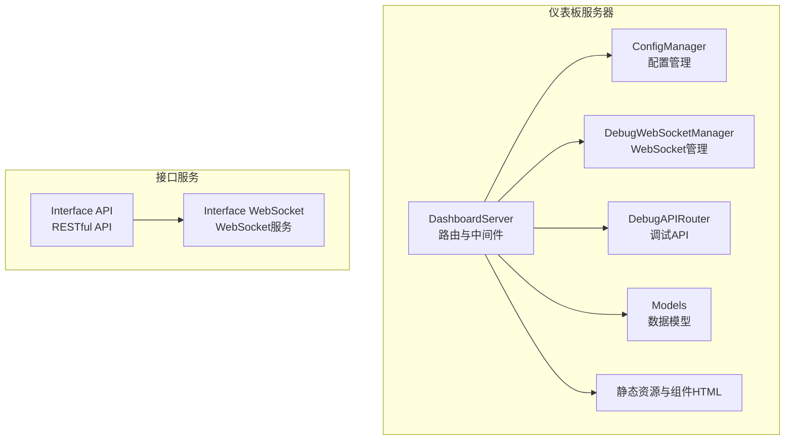
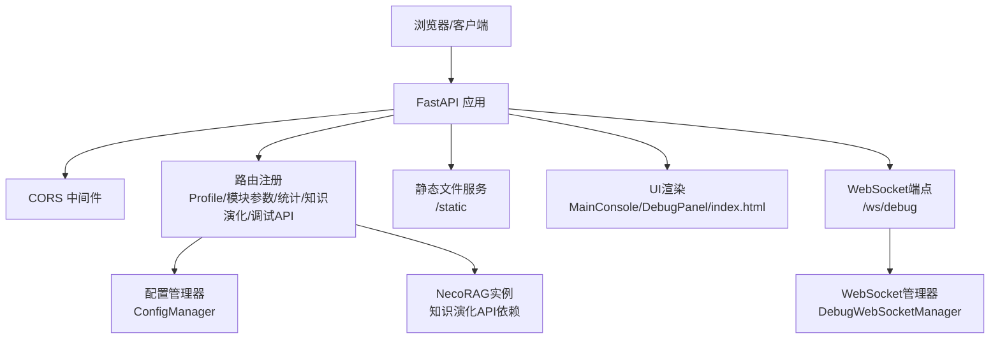
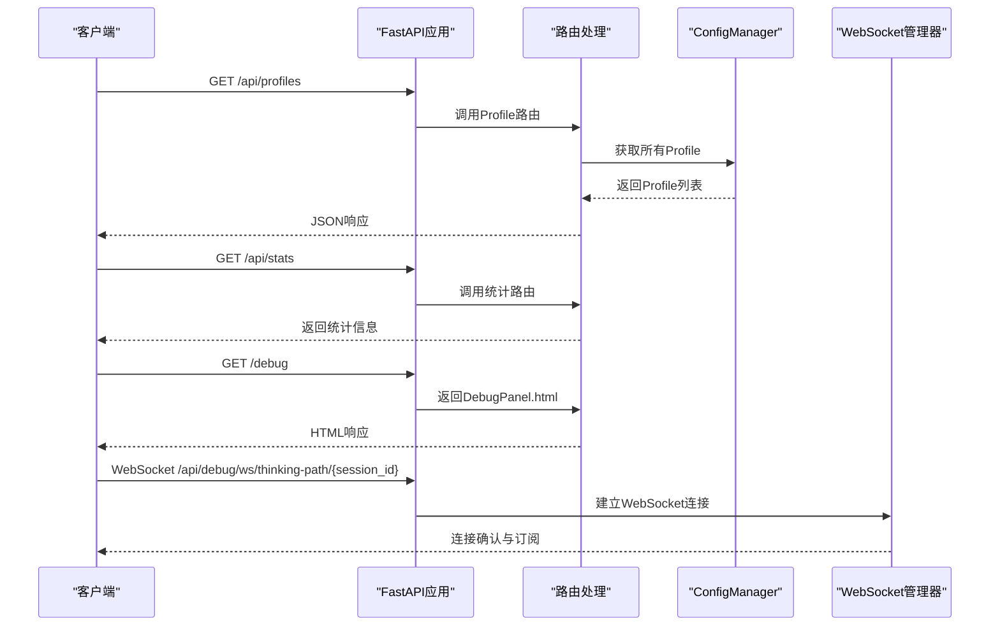
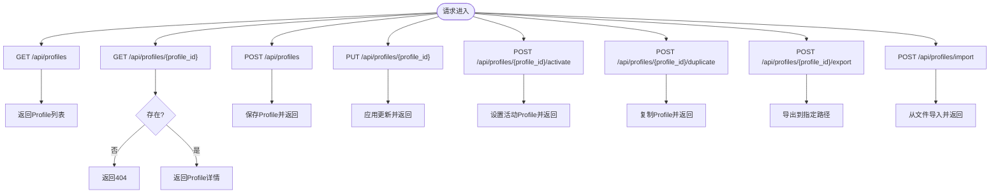
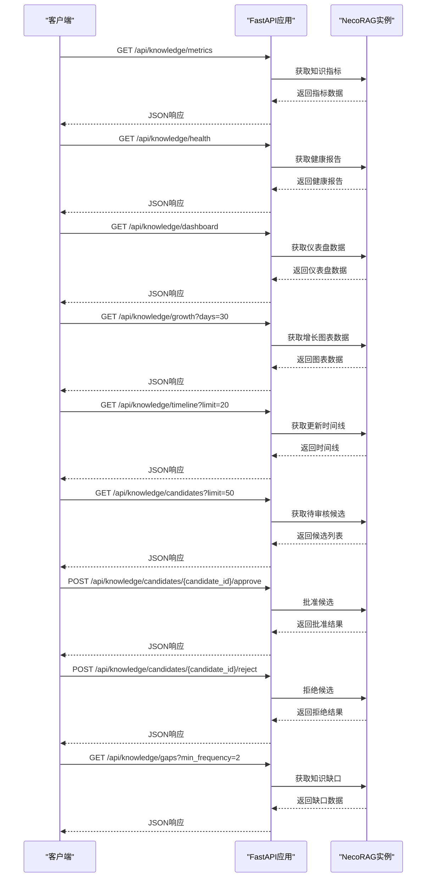
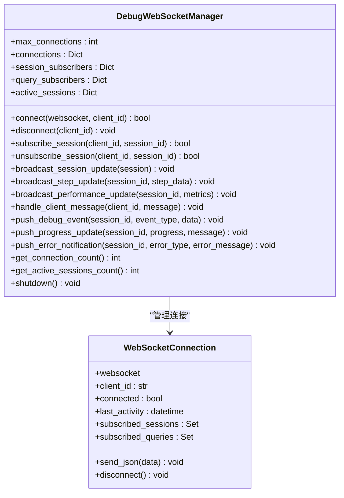
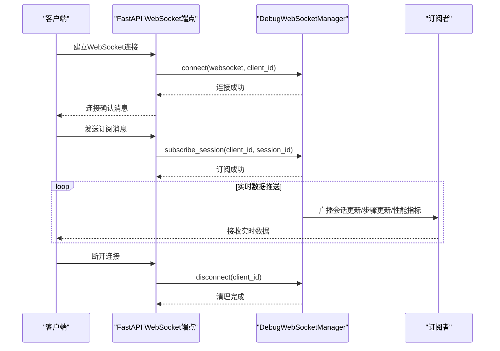
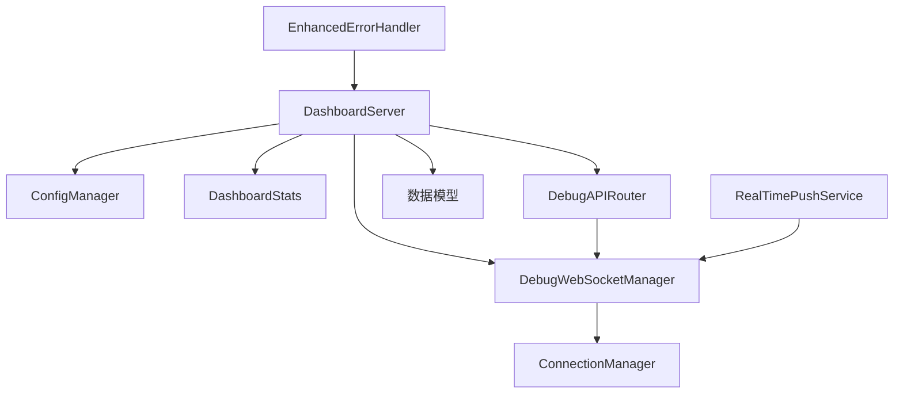

# Web服务器

<cite>
**本文引用的文件**
- [src/dashboard/server.py](file://src/dashboard/server.py)
- [src/dashboard/dashboard.py](file://src/dashboard/dashboard.py)
- [src/dashboard/config_manager.py](file://src/dashboard/config_manager.py)
- [src/dashboard/models.py](file://src/dashboard/models.py)
- [src/dashboard/static/index.html](file://src/dashboard/static/index.html)
- [src/dashboard/components/MainConsole.html](file://src/dashboard/components/MainConsole.html)
- [src/dashboard/components/DebugPanel.html](file://src/dashboard/components/DebugPanel.html)
- [src/dashboard/debug/websocket.py](file://src/dashboard/debug/websocket.py)
- [src/dashboard/debug/api.py](file://src/dashboard/debug/api.py)
- [src/dashboard/debug/models.py](file://src/dashboard/debug/models.py)
- [src/dashboard/debug/connection.py](file://src/dashboard/debug/connection.py)
- [src/dashboard/debug/push_service.py](file://src/dashboard/debug/push_service.py)
- [src/dashboard/debug/enhanced_error_handler.py](file://src/dashboard/debug/enhanced_error_handler.py)
- [interface/api.py](file://interface/api.py)
- [interface/main.py](file://interface/main.py)
</cite>

## 目录
1. [引言](#引言)
2. [项目结构](#项目结构)
3. [核心组件](#核心组件)
4. [架构总览](#架构总览)
5. [详细组件分析](#详细组件分析)
6. [依赖关系分析](#依赖关系分析)
7. [性能考虑](#性能考虑)
8. [故障排除指南](#故障排除指南)
9. [结论](#结论)
10. [附录](#附录)

## 引言
本文件为仪表板Web服务器的详细实现文档，基于FastAPI框架构建，涵盖RESTful API设计与实现、CORS中间件配置、静态文件服务、WebSocket连接管理与实时通信、Web UI界面渲染与静态资源提供、以及服务器启动与配置的最佳实践。文档还总结了错误处理与异常管理的实现细节，并提供面向非技术读者的渐进式理解路径。

## 项目结构
仪表板Web服务器位于src/dashboard目录，采用“功能模块+组件”的组织方式：
- 服务器与路由：DashboardServer封装FastAPI应用、路由注册、CORS配置、静态文件挂载与UI渲染。
- 配置管理：ConfigManager负责Profile的增删改查、导入导出、活动Profile切换与模块参数更新。
- 调试面板：DebugWebSocketManager、DebugAPIRouter、调试数据模型与实时推送服务共同构成调试面板的实时通信与数据流。
- Web UI：静态资源与组件HTML模板，支持响应式布局与多视图切换。
- 接口服务：interface目录提供独立的RESTful API与WebSocket服务组合方案，便于对比与扩展。

**图表来源**
- [src/dashboard/server.py:51-108](file://src/dashboard/server.py#L51-L108)
- [src/dashboard/config_manager.py:14-41](file://src/dashboard/config_manager.py#L14-L41)
- [src/dashboard/debug/websocket.py:49-91](file://src/dashboard/debug/websocket.py#L49-L91)
- [src/dashboard/debug/api.py:21-29](file://src/dashboard/debug/api.py#L21-L29)
- [src/dashboard/models.py:22-232](file://src/dashboard/models.py#L22-L232)
- [src/dashboard/static/index.html:1-800](file://src/dashboard/static/index.html#L1-L800)
- [src/dashboard/components/MainConsole.html:1-755](file://src/dashboard/components/MainConsole.html#L1-L755)
- [src/dashboard/components/DebugPanel.html:1-800](file://src/dashboard/components/DebugPanel.html#L1-L800)
- [interface/api.py:26-164](file://interface/api.py#L26-L164)
- [interface/main.py:14-79](file://interface/main.py#L14-L79)

**章节来源**
- [src/dashboard/server.py:51-108](file://src/dashboard/server.py#L51-L108)
- [src/dashboard/dashboard.py:10-27](file://src/dashboard/dashboard.py#L10-L27)

## 核心组件
- DashboardServer：FastAPI应用主体，负责CORS配置、路由注册、静态文件挂载、UI渲染与服务器启动。
- ConfigManager：Profile生命周期管理、模块参数更新、导入导出与活动Profile切换。
- DebugWebSocketManager：WebSocket连接管理、订阅/退订、消息广播、清理任务与实时推送。
- DebugAPIRouter：调试面板所需的REST API端点集合，包括会话管理、证据与推理更新、统计信息等。
- 数据模型：RAGProfile、ModuleConfig、调试会话与证据等数据结构。
- Web UI：静态CSS/JS与组件HTML，提供响应式布局与多视图切换。
- 接口服务：独立的RESTful API与WebSocket服务组合，便于并行开发与部署。

**章节来源**
- [src/dashboard/server.py:51-108](file://src/dashboard/server.py#L51-L108)
- [src/dashboard/config_manager.py:14-41](file://src/dashboard/config_manager.py#L14-L41)
- [src/dashboard/debug/websocket.py:49-91](file://src/dashboard/debug/websocket.py#L49-L91)
- [src/dashboard/debug/api.py:21-29](file://src/dashboard/debug/api.py#L21-L29)
- [src/dashboard/models.py:22-232](file://src/dashboard/models.py#L22-L232)
- [src/dashboard/static/index.html:1-800](file://src/dashboard/static/index.html#L1-L800)
- [src/dashboard/components/MainConsole.html:1-755](file://src/dashboard/components/MainConsole.html#L1-L755)
- [src/dashboard/components/DebugPanel.html:1-800](file://src/dashboard/components/DebugPanel.html#L1-L800)
- [interface/api.py:26-164](file://interface/api.py#L26-L164)
- [interface/main.py:14-79](file://interface/main.py#L14-L79)

## 架构总览
仪表板Web服务器采用“单体FastAPI应用 + 调试WebSocket + Web UI”的架构。DashboardServer集中管理路由、中间件与静态资源；ConfigManager提供配置持久化与活动Profile管理；调试面板通过独立的WebSocket端点与API路由实现实时数据推送与会话管理；Web UI通过静态文件与组件HTML提供丰富的前端体验。

**图表来源**
- [src/dashboard/server.py:84-108](file://src/dashboard/server.py#L84-L108)
- [src/dashboard/server.py:113-370](file://src/dashboard/server.py#L113-L370)
- [src/dashboard/server.py:414-418](file://src/dashboard/server.py#L414-L418)
- [src/dashboard/debug/websocket.py:49-91](file://src/dashboard/debug/websocket.py#L49-L91)
- [src/dashboard/config_manager.py:14-41](file://src/dashboard/config_manager.py#L14-L41)

## 详细组件分析

### FastAPI服务器与路由系统
- 应用初始化：创建FastAPI实例，设置标题、描述与版本信息。
- CORS配置：允许任意来源、凭证、方法与头，便于跨域访问。
- 路由注册：集中定义Profile管理、模块参数管理、统计信息、知识演化、调试API与WebSocket端点。
- 静态文件服务：挂载/static目录，提供CSS/JS与图片等静态资源。
- UI渲染：根据请求路径返回HTML页面或简单UI。

**图表来源**
- [src/dashboard/server.py:84-108](file://src/dashboard/server.py#L84-L108)
- [src/dashboard/server.py:113-370](file://src/dashboard/server.py#L113-L370)
- [src/dashboard/server.py:371-418](file://src/dashboard/server.py#L371-L418)
- [src/dashboard/config_manager.py:88-96](file://src/dashboard/config_manager.py#L88-L96)
- [src/dashboard/debug/websocket.py:92-130](file://src/dashboard/debug/websocket.py#L92-L130)

**章节来源**
- [src/dashboard/server.py:84-108](file://src/dashboard/server.py#L84-L108)
- [src/dashboard/server.py:113-370](file://src/dashboard/server.py#L113-L370)
- [src/dashboard/server.py:371-418](file://src/dashboard/server.py#L371-L418)

### CORS中间件与静态文件服务
- CORS中间件：允许任意来源与头，支持凭证与所有HTTP方法，便于前端与后端分离部署。
- 静态文件挂载：将/static目录映射为静态资源，供UI与组件使用。

**章节来源**
- [src/dashboard/server.py:91-98](file://src/dashboard/server.py#L91-L98)
- [src/dashboard/server.py:414-418](file://src/dashboard/server.py#L414-L418)

### Profile管理API
- 获取所有Profile、获取单个Profile、获取活动Profile。
- 创建、更新、删除Profile。
- 激活、复制、导出、导入Profile。
- 模块参数读取与更新（whiskers/memory/retrieval/grooming/purr）。

**图表来源**
- [src/dashboard/server.py:118-199](file://src/dashboard/server.py#L118-L199)
- [src/dashboard/config_manager.py:42-75](file://src/dashboard/config_manager.py#L42-L75)
- [src/dashboard/config_manager.py:135-167](file://src/dashboard/config_manager.py#L135-L167)
- [src/dashboard/config_manager.py:108-134](file://src/dashboard/config_manager.py#L108-L134)
- [src/dashboard/config_manager.py:195-229](file://src/dashboard/config_manager.py#L195-L229)
- [src/dashboard/config_manager.py:230-252](file://src/dashboard/config_manager.py#L230-L252)
- [src/dashboard/config_manager.py:253-278](file://src/dashboard/config_manager.py#L253-L278)

**章节来源**
- [src/dashboard/server.py:118-199](file://src/dashboard/server.py#L118-L199)
- [src/dashboard/config_manager.py:42-75](file://src/dashboard/config_manager.py#L42-L75)
- [src/dashboard/config_manager.py:108-134](file://src/dashboard/config_manager.py#L108-L134)
- [src/dashboard/config_manager.py:135-167](file://src/dashboard/config_manager.py#L135-L167)
- [src/dashboard/config_manager.py:195-229](file://src/dashboard/config_manager.py#L195-L229)
- [src/dashboard/config_manager.py:230-252](file://src/dashboard/config_manager.py#L230-L252)
- [src/dashboard/config_manager.py:253-278](file://src/dashboard/config_manager.py#L253-L278)

### 模块参数管理API
- 读取指定模块参数（whiskers/memory/retrieval/grooming/purr）。
- 更新模块参数（合并到对应模块配置）。

**章节来源**
- [src/dashboard/server.py:202-235](file://src/dashboard/server.py#L202-L235)

### 统计信息API
- 获取系统统计信息（文档数、块数、查询数、活动会话、内存使用、性能指标）。
- 重置统计信息。

**章节来源**
- [src/dashboard/server.py:238-255](file://src/dashboard/server.py#L238-L255)
- [src/dashboard/models.py:222-232](file://src/dashboard/models.py#L222-L232)

### 知识演化API
- 获取知识库指标、健康报告、仪表盘完整数据。
- 获取增长趋势与更新时间线。
- 获取待审核候选、批准/拒绝候选。
- 获取知识缺口。

**图表来源**
- [src/dashboard/server.py:258-334](file://src/dashboard/server.py#L258-L334)

**章节来源**
- [src/dashboard/server.py:258-334](file://src/dashboard/server.py#L258-L334)

### 调试面板API与WebSocket
- 调试API路由：会话创建、完成、失败、步骤添加、证据添加、查询历史、路径分析、参数调优、统计信息、健康检查等。
- WebSocket端点：/api/debug/ws/thinking-path/{session_id}，支持连接建立、订阅会话、消息处理与断开清理。
- WebSocket管理器：连接池管理、订阅映射、广播机制、清理任务与实时推送。

**图表来源**
- [src/dashboard/debug/websocket.py:49-91](file://src/dashboard/debug/websocket.py#L49-L91)
- [src/dashboard/debug/websocket.py:19-47](file://src/dashboard/debug/websocket.py#L19-L47)

**章节来源**
- [src/dashboard/debug/api.py:91-181](file://src/dashboard/debug/api.py#L91-L181)
- [src/dashboard/debug/api.py:214-259](file://src/dashboard/debug/api.py#L214-L259)
- [src/dashboard/debug/api.py:261-296](file://src/dashboard/debug/api.py#L261-L296)
- [src/dashboard/debug/api.py:298-364](file://src/dashboard/debug/api.py#L298-L364)
- [src/dashboard/debug/api.py:366-451](file://src/dashboard/debug/api.py#L366-L451)
- [src/dashboard/debug/api.py:453-529](file://src/dashboard/debug/api.py#L453-L529)
- [src/dashboard/debug/api.py:530-544](file://src/dashboard/debug/api.py#L530-L544)
- [src/dashboard/debug/api.py:545-557](file://src/dashboard/debug/api.py#L545-L557)
- [src/dashboard/debug/websocket.py:92-130](file://src/dashboard/debug/websocket.py#L92-L130)
- [src/dashboard/debug/websocket.py:149-199](file://src/dashboard/debug/websocket.py#L149-L199)
- [src/dashboard/debug/websocket.py:200-261](file://src/dashboard/debug/websocket.py#L200-L261)
- [src/dashboard/debug/websocket.py:284-321](file://src/dashboard/debug/websocket.py#L284-L321)
- [src/dashboard/debug/websocket.py:322-350](file://src/dashboard/debug/websocket.py#L322-L350)
- [src/dashboard/debug/websocket.py:351-373](file://src/dashboard/debug/websocket.py#L351-L373)
- [src/dashboard/debug/websocket.py:398-421](file://src/dashboard/debug/websocket.py#L398-L421)
- [src/dashboard/debug/websocket.py:422-437](file://src/dashboard/debug/websocket.py#L422-L437)

### WebSocket连接建立与管理流程

**图表来源**
- [src/dashboard/server.py:340-370](file://src/dashboard/server.py#L340-L370)
- [src/dashboard/debug/websocket.py:92-130](file://src/dashboard/debug/websocket.py#L92-L130)
- [src/dashboard/debug/websocket.py:149-199](file://src/dashboard/debug/websocket.py#L149-L199)
- [src/dashboard/debug/websocket.py:200-261](file://src/dashboard/debug/websocket.py#L200-L261)

**章节来源**
- [src/dashboard/server.py:340-370](file://src/dashboard/server.py#L340-L370)
- [src/dashboard/debug/websocket.py:92-130](file://src/dashboard/debug/websocket.py#L92-L130)
- [src/dashboard/debug/websocket.py:149-199](file://src/dashboard/debug/websocket.py#L149-L199)
- [src/dashboard/debug/websocket.py:200-261](file://src/dashboard/debug/websocket.py#L200-L261)

### Web UI界面渲染与静态资源
- 主控制台：MainConsole.html，提供仪表板布局、主题切换、WebSocket连接状态与统计信息刷新。
- 调试面板：DebugPanel.html，提供调试会话列表、实时数据展示与组件加载。
- 简单UI：当组件HTML不存在时回退到简单HTML页面。
- 静态资源：CSS/JS与index.html，提供响应式设计与交互逻辑。

**章节来源**
- [src/dashboard/components/MainConsole.html:1-755](file://src/dashboard/components/MainConsole.html#L1-L755)
- [src/dashboard/components/DebugPanel.html:1-800](file://src/dashboard/components/DebugPanel.html#L1-L800)
- [src/dashboard/static/index.html:1-800](file://src/dashboard/static/index.html#L1-L800)
- [src/dashboard/server.py:371-418](file://src/dashboard/server.py#L371-L418)

### 服务器启动与配置最佳实践
- 命令行参数：host、port、config-dir，便于不同环境部署。
- 启动流程：创建DashboardServer实例，设置NecoRAG实例引用，运行uvicorn服务器。
- 接口服务：独立RESTful API与WebSocket服务，支持并行开发与部署。

**章节来源**
- [src/dashboard/dashboard.py:10-27](file://src/dashboard/dashboard.py#L10-L27)
- [src/dashboard/server.py:544-558](file://src/dashboard/server.py#L544-L558)
- [interface/main.py:14-79](file://interface/main.py#L14-L79)
- [interface/api.py:167-171](file://interface/api.py#L167-L171)

### 错误处理与异常管理
- HTTP异常：在Profile管理与知识演化API中对不存在资源与初始化状态进行明确的HTTP错误响应。
- WebSocket异常：捕获连接与消息处理异常，记录日志并断开连接。
- 增强错误处理：提供错误分类、严重程度评估、自动恢复策略、通知通道与熔断器机制，支持上下文增强与统计分析。

**章节来源**
- [src/dashboard/server.py:128-130](file://src/dashboard/server.py#L128-L130)
- [src/dashboard/server.py:163-166](file://src/dashboard/server.py#L163-L166)
- [src/dashboard/server.py:261-263](file://src/dashboard/server.py#L261-L263)
- [src/dashboard/debug/websocket.py:366-368](file://src/dashboard/debug/websocket.py#L366-L368)
- [src/dashboard/debug/enhanced_error_handler.py:135-169](file://src/dashboard/debug/enhanced_error_handler.py#L135-L169)
- [src/dashboard/debug/enhanced_error_handler.py:296-312](file://src/dashboard/debug/enhanced_error_handler.py#L296-L312)
- [src/dashboard/debug/enhanced_error_handler.py:440-487](file://src/dashboard/debug/enhanced_error_handler.py#L440-L487)

## 依赖关系分析
仪表板服务器内部模块之间的依赖关系如下：

**图表来源**
- [src/dashboard/server.py:51-108](file://src/dashboard/server.py#L51-L108)
- [src/dashboard/config_manager.py:14-41](file://src/dashboard/config_manager.py#L14-L41)
- [src/dashboard/models.py:222-232](file://src/dashboard/models.py#L222-L232)
- [src/dashboard/debug/websocket.py:49-91](file://src/dashboard/debug/websocket.py#L49-L91)
- [src/dashboard/debug/api.py:21-29](file://src/dashboard/debug/api.py#L21-L29)
- [src/dashboard/debug/connection.py:315-339](file://src/dashboard/debug/connection.py#L315-L339)
- [src/dashboard/debug/push_service.py:16-28](file://src/dashboard/debug/push_service.py#L16-L28)
- [src/dashboard/debug/enhanced_error_handler.py:488-489](file://src/dashboard/debug/enhanced_error_handler.py#L488-L489)

**章节来源**
- [src/dashboard/server.py:51-108](file://src/dashboard/server.py#L51-L108)
- [src/dashboard/config_manager.py:14-41](file://src/dashboard/config_manager.py#L14-L41)
- [src/dashboard/models.py:222-232](file://src/dashboard/models.py#L222-L232)
- [src/dashboard/debug/websocket.py:49-91](file://src/dashboard/debug/websocket.py#L49-L91)
- [src/dashboard/debug/api.py:21-29](file://src/dashboard/debug/api.py#L21-L29)
- [src/dashboard/debug/connection.py:315-339](file://src/dashboard/debug/connection.py#L315-L339)
- [src/dashboard/debug/push_service.py:16-28](file://src/dashboard/debug/push_service.py#L16-L28)
- [src/dashboard/debug/enhanced_error_handler.py:488-489](file://src/dashboard/debug/enhanced_error_handler.py#L488-L489)

## 性能考虑
- WebSocket连接池与广播锁：使用异步广播与并发任务，避免阻塞主线程。
- 清理任务：定期清理不活跃连接，降低内存占用。
- 实时推送节流：在推送证据与推理数据时加入延迟，避免过度推送。
- 静态资源缓存：通过静态文件服务提供缓存友好的资源访问。
- 统计信息定时刷新：前端定时轮询统计信息，减少不必要的实时推送压力。

**章节来源**
- [src/dashboard/debug/websocket.py:66-67](file://src/dashboard/debug/websocket.py#L66-L67)
- [src/dashboard/debug/websocket.py:398-421](file://src/dashboard/debug/websocket.py#L398-L421)
- [src/dashboard/debug/push_service.py:134-157](file://src/dashboard/debug/push_service.py#L134-L157)
- [src/dashboard/static/index.html:1-800](file://src/dashboard/static/index.html#L1-L800)
- [src/dashboard/components/MainConsole.html:544-717](file://src/dashboard/components/MainConsole.html#L544-L717)

## 故障排除指南
- CORS问题：确认CORS中间件配置允许来源、方法与头；检查前端与后端域名一致。
- WebSocket连接失败：检查端点路径、连接状态与异常日志；确认WebSocket管理器初始化。
- Profile操作失败：检查Profile是否存在、参数更新键名是否正确、文件权限是否足够。
- 知识演化API错误：确认NecoRAG实例已设置且可视化组件可用。
- 增强错误处理：利用错误分类与恢复策略，结合通知通道与熔断器机制定位问题。

**章节来源**
- [src/dashboard/server.py:91-98](file://src/dashboard/server.py#L91-L98)
- [src/dashboard/server.py:340-370](file://src/dashboard/server.py#L340-L370)
- [src/dashboard/server.py:261-263](file://src/dashboard/server.py#L261-L263)
- [src/dashboard/config_manager.py:135-167](file://src/dashboard/config_manager.py#L135-L167)
- [src/dashboard/debug/enhanced_error_handler.py:135-169](file://src/dashboard/debug/enhanced_error_handler.py#L135-L169)
- [src/dashboard/debug/enhanced_error_handler.py:296-312](file://src/dashboard/debug/enhanced_error_handler.py#L296-L312)

## 结论
仪表板Web服务器以FastAPI为核心，结合CORS中间件、静态文件服务与WebSocket实时通信，实现了Profile管理、模块参数调优、统计信息展示与知识演化监控的完整能力。通过清晰的模块划分与完善的错误处理机制，系统具备良好的可维护性与扩展性。建议在生产环境中进一步完善安全策略、监控告警与性能优化措施。

## 附录
- 接口服务组合：独立RESTful API与WebSocket服务，便于并行开发与部署。
- 数据模型：统一的Profile与模块配置模型，支持灵活的参数管理。
- 调试组件：丰富的调试面板组件与实时推送服务，便于问题诊断与性能分析。

**章节来源**
- [interface/api.py:26-164](file://interface/api.py#L26-L164)
- [interface/main.py:14-79](file://interface/main.py#L14-L79)
- [src/dashboard/models.py:22-232](file://src/dashboard/models.py#L22-L232)
- [src/dashboard/debug/push_service.py:16-28](file://src/dashboard/debug/push_service.py#L16-L28)
- [src/dashboard/debug/models.py:186-277](file://src/dashboard/debug/models.py#L186-L277)