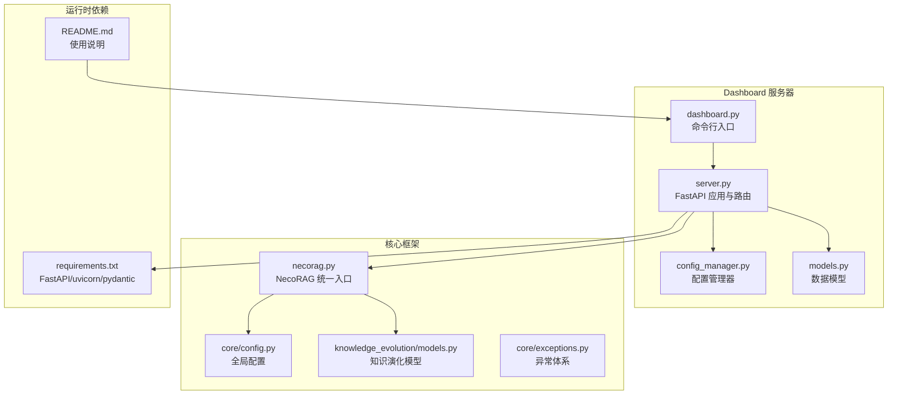
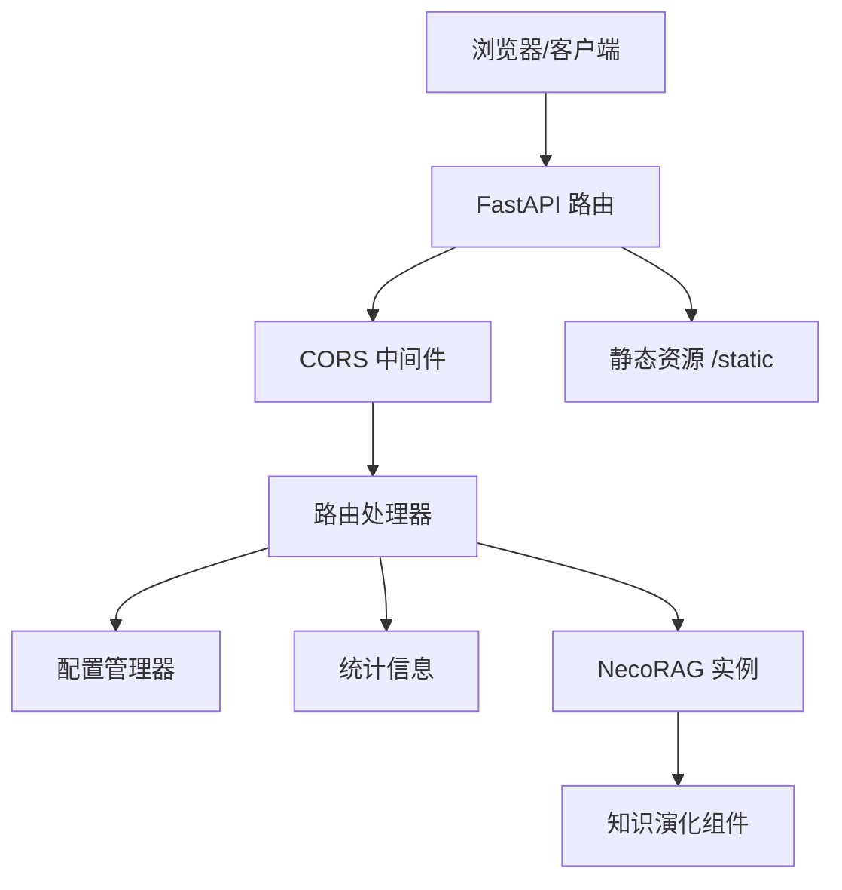
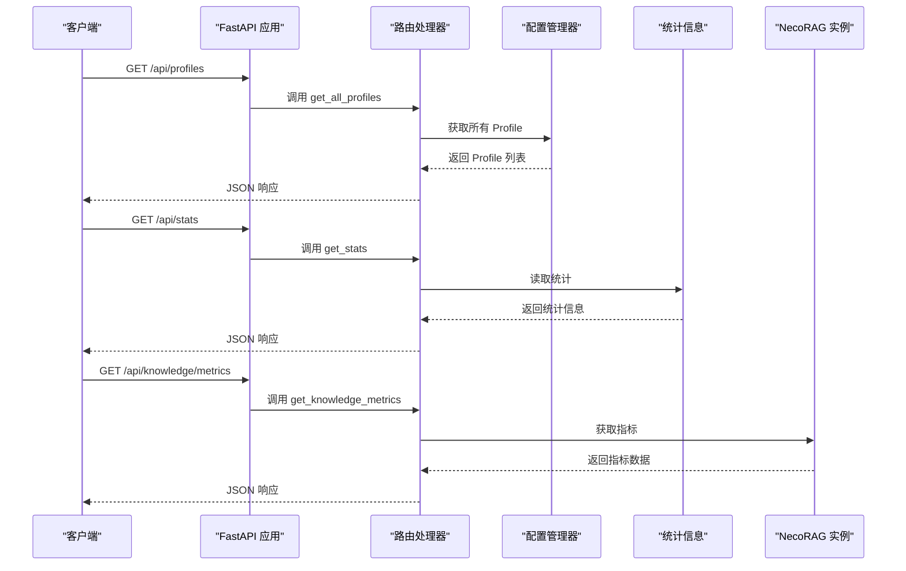
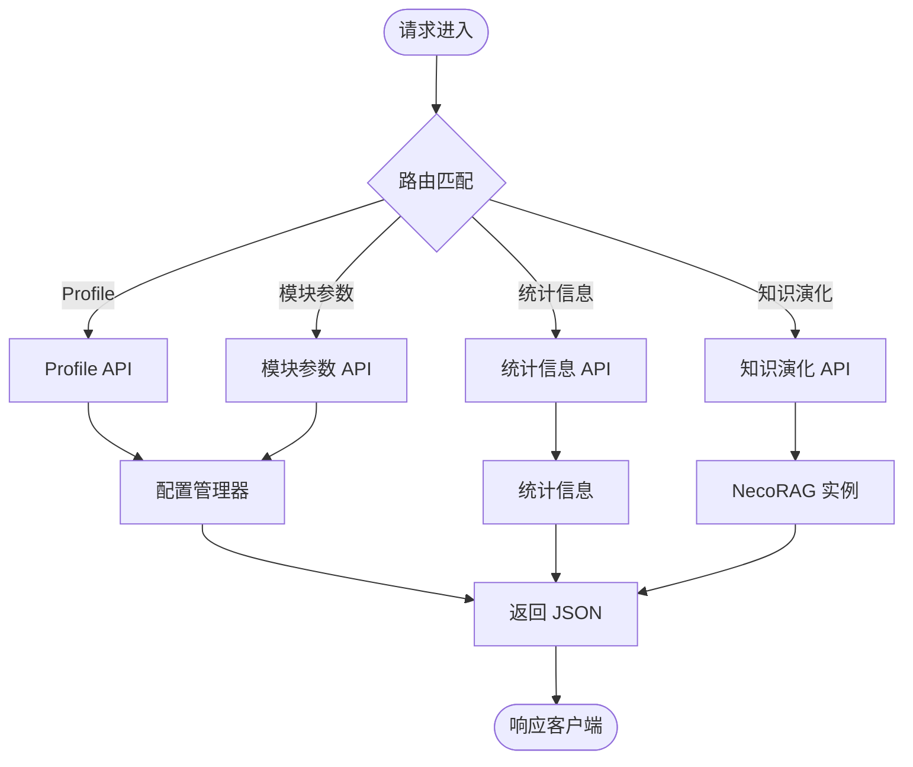
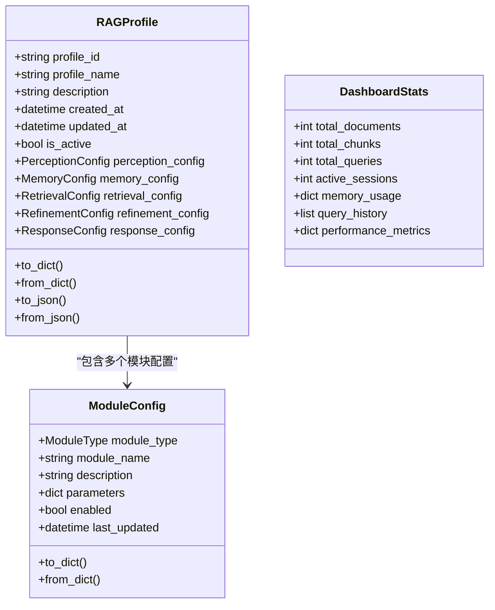
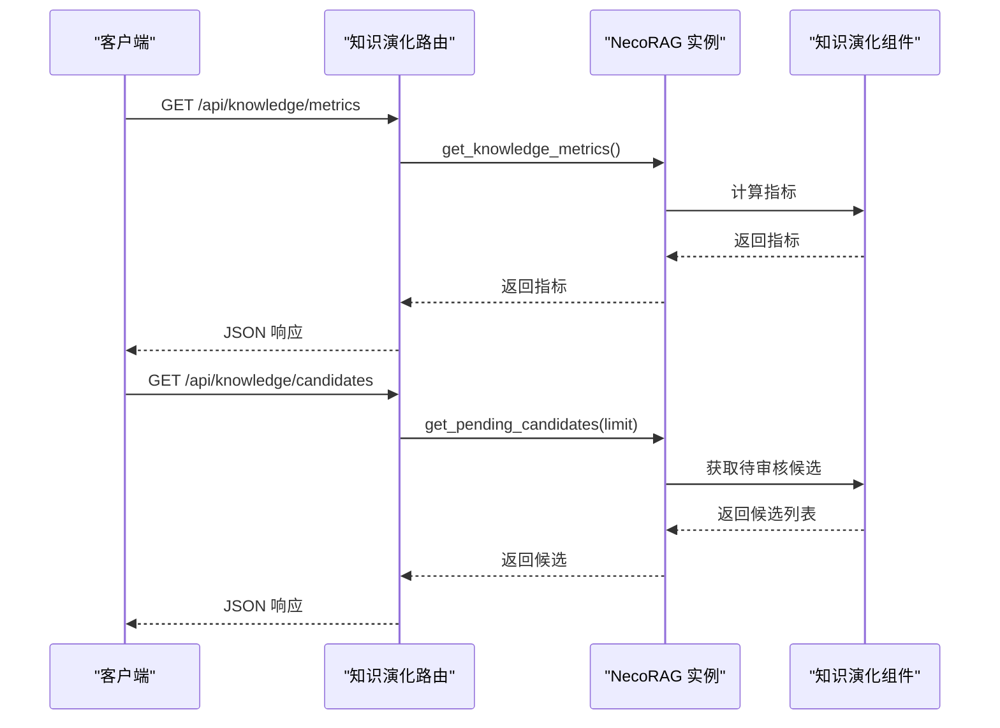
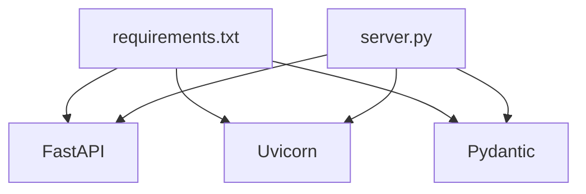

# Web服务器

<cite>
**本文引用的文件**
- [src/dashboard/server.py](file://src/dashboard/server.py)
- [src/dashboard/dashboard.py](file://src/dashboard/dashboard.py)
- [src/dashboard/config_manager.py](file://src/dashboard/config_manager.py)
- [src/dashboard/models.py](file://src/dashboard/models.py)
- [src/necorag.py](file://src/necorag.py)
- [src/core/config.py](file://src/core/config.py)
- [src/knowledge_evolution/models.py](file://src/knowledge_evolution/models.py)
- [src/core/exceptions.py](file://src/core/exceptions.py)
- [requirements.txt](file://requirements.txt)
- [README.md](file://README.md)
</cite>

## 目录
1. [简介](#简介)
2. [项目结构](#项目结构)
3. [核心组件](#核心组件)
4. [架构总览](#架构总览)
5. [详细组件分析](#详细组件分析)
6. [依赖分析](#依赖分析)
7. [性能考虑](#性能考虑)
8. [故障排查指南](#故障排查指南)
9. [结论](#结论)
10. [附录](#附录)

## 简介
本章节概述 NecoRAG 的 Web 服务器模块，重点围绕基于 FastAPI 的 Dashboard 服务器实现，讲解其路由注册机制、CORS 配置与中间件设置、RESTful API 设计与实现、Profile 管理、模块参数管理、统计信息与知识演化等核心功能，并提供服务器启动配置、主机绑定与端口设置的使用指南，以及错误处理机制、HTTP 状态码与异常管理的最佳实践，最后给出扩展服务器功能与新增 API 端点的方法。

## 项目结构
Dashboard 服务器位于 src/dashboard 目录，主要由以下文件构成：
- server.py：FastAPI 应用与路由定义、CORS 中间件、UI 静态资源挂载、服务器启动入口
- dashboard.py：命令行启动入口，支持 --host、--port、--config-dir 参数
- config_manager.py：Profile 的增删改查、导入导出、活动 Profile 切换
- models.py：Dashboard 数据模型（Profile、模块配置、统计信息）

**图表来源**
- [src/dashboard/server.py](file://src/dashboard/server.py)
- [src/dashboard/dashboard.py](file://src/dashboard/dashboard.py)
- [src/dashboard/config_manager.py](file://src/dashboard/config_manager.py)
- [src/dashboard/models.py](file://src/dashboard/models.py)
- [src/necorag.py](file://src/necorag.py)
- [src/core/config.py](file://src/core/config.py)
- [src/knowledge_evolution/models.py](file://src/knowledge_evolution/models.py)
- [src/core/exceptions.py](file://src/core/exceptions.py)
- [requirements.txt](file://requirements.txt)
- [README.md](file://README.md)

**章节来源**
- [src/dashboard/server.py](file://src/dashboard/server.py)
- [src/dashboard/dashboard.py](file://src/dashboard/dashboard.py)
- [src/dashboard/config_manager.py](file://src/dashboard/config_manager.py)
- [src/dashboard/models.py](file://src/dashboard/models.py)
- [README.md](file://README.md)

## 核心组件
- FastAPI 应用与路由注册：在构造函数中创建 FastAPI 实例，配置标题、描述、版本；注册 Profile 管理、模块参数管理、统计信息、知识演化、Web UI 等路由；设置 CORS 中间件；挂载静态资源。
- 配置管理器：负责 Profile 的创建、读取、更新、删除、复制、导入导出、活动 Profile 切换与持久化。
- 数据模型：定义 Profile、模块配置、统计信息等数据结构，支持序列化/反序列化。
- NecoRAG 集成：通过 set_necorag 注入 NecoRAG 实例，开放知识演化相关 API。
- 启动入口：命令行参数解析，支持 host、port、config-dir。

**章节来源**
- [src/dashboard/server.py](file://src/dashboard/server.py)
- [src/dashboard/config_manager.py](file://src/dashboard/config_manager.py)
- [src/dashboard/models.py](file://src/dashboard/models.py)
- [src/necorag.py](file://src/necorag.py)
- [src/dashboard/dashboard.py](file://src/dashboard/dashboard.py)

## 架构总览
Dashboard 服务器采用分层设计：
- 表现层：FastAPI 路由与响应模型
- 业务层：配置管理器与统计信息
- 集成层：与 NecoRAG 核心交互，暴露知识演化 API
- 外部依赖：uvicorn 作为 ASGI 服务器，CORS 支持跨域

**图表来源**
- [src/dashboard/server.py](file://src/dashboard/server.py)
- [src/dashboard/config_manager.py](file://src/dashboard/config_manager.py)
- [src/necorag.py](file://src/necorag.py)

## 详细组件分析

### FastAPI 应用与路由注册
- 应用初始化：设置 title/description/version，创建 app 实例。
- CORS 配置：允许任意源、凭证、方法与头，满足前端跨域需求。
- 路由注册：集中于 _setup_routes 方法，按功能域划分：
  - Profile 管理：列出、获取、创建、更新、删除、激活、复制、导出、导入
  - 模块参数管理：按 Profile 获取/更新 whiskers/memory/retrieval/grooming/purr 模块参数
  - 统计信息：获取与重置
  - 知识演化：指标、健康报告、仪表盘数据、增长趋势、时间线、待审核候选、审批/拒绝、知识缺口
  - Web UI：根路径返回 UI，/static 挂载静态资源
- 服务器启动：uvicorn.run(host, port)，打印访问与文档链接

**图表来源**
- [src/dashboard/server.py](file://src/dashboard/server.py)
- [src/dashboard/config_manager.py](file://src/dashboard/config_manager.py)
- [src/dashboard/models.py](file://src/dashboard/models.py)
- [src/necorag.py](file://src/necorag.py)

**章节来源**
- [src/dashboard/server.py](file://src/dashboard/server.py)

### CORS 配置与中间件设置
- 在应用初始化时添加 CORSMiddleware，允许任意来源、凭证、方法与头，确保前端跨域访问 API。
- 该中间件对所有路由生效，无需逐个装饰器声明。

**章节来源**
- [src/dashboard/server.py](file://src/dashboard/server.py)

### RESTful API 设计与实现
- Profile 管理 API
  - GET /api/profiles：返回所有 Profile 的字典列表
  - GET /api/profiles/{profile_id}：按 ID 获取 Profile
  - GET /api/profiles/active：获取当前活动 Profile
  - POST /api/profiles：创建 Profile
  - PUT /api/profiles/{profile_id}：更新 Profile
  - DELETE /api/profiles/{profile_id}：删除 Profile
  - POST /api/profiles/{profile_id}/activate：激活 Profile
  - POST /api/profiles/{profile_id}/duplicate：复制 Profile
  - POST /api/profiles/{profile_id}/export：导出 Profile
  - POST /api/profiles/import：导入 Profile
- 模块参数管理 API
  - GET /api/profiles/{profile_id}/modules/{module}：获取指定模块参数
  - PUT /api/profiles/{profile_id}/modules/{module}：更新模块参数
- 统计信息 API
  - GET /api/stats：获取统计信息
  - POST /api/stats/reset：重置统计信息
- 知识演化 API
  - GET /api/knowledge/metrics：知识库指标
  - GET /api/knowledge/health：健康报告
  - GET /api/knowledge/dashboard：仪表盘完整数据
  - GET /api/knowledge/growth：增长趋势（days 参数）
  - GET /api/knowledge/timeline：更新时间线（limit 参数）
  - GET /api/knowledge/candidates：待审核候选（limit 参数）
  - POST /api/knowledge/candidates/{candidate_id}/approve：批准候选
  - POST /api/knowledge/candidates/{candidate_id}/reject：拒绝候选（reason 可选）
  - GET /api/knowledge/gaps：知识缺口（min_frequency 参数）

**图表来源**
- [src/dashboard/server.py](file://src/dashboard/server.py)
- [src/dashboard/config_manager.py](file://src/dashboard/config_manager.py)
- [src/dashboard/models.py](file://src/dashboard/models.py)
- [src/necorag.py](file://src/necorag.py)

**章节来源**
- [src/dashboard/server.py](file://src/dashboard/server.py)

### 配置管理器与数据模型
- 配置管理器
  - 负责 Profile 的创建、读取、更新、删除、复制、导入导出、活动 Profile 切换与持久化到 JSON 文件
  - 支持并发访问的缓存与文件同步
- 数据模型
  - RAGProfile：包含多个模块配置与活动状态
  - ModuleConfig 及具体模块配置（感知、记忆、检索、精炼、响应）
  - DashboardStats：统计信息聚合

**图表来源**
- [src/dashboard/models.py](file://src/dashboard/models.py)

**章节来源**
- [src/dashboard/config_manager.py](file://src/dashboard/config_manager.py)
- [src/dashboard/models.py](file://src/dashboard/models.py)

### 知识演化与 NecoRAG 集成
- 通过 set_necorag 注入 NecoRAG 实例，开放知识演化相关 API
- 知识演化数据模型：候选条目、更新任务、变更日志、指标、健康报告、查询记录、增长趋势等

**图表来源**
- [src/dashboard/server.py](file://src/dashboard/server.py)
- [src/necorag.py](file://src/necorag.py)
- [src/knowledge_evolution/models.py](file://src/knowledge_evolution/models.py)

**章节来源**
- [src/necorag.py](file://src/necorag.py)
- [src/knowledge_evolution/models.py](file://src/knowledge_evolution/models.py)

### Web UI 与静态资源
- 根路径返回内置或外部 index.html
- /static 挂载静态资源目录，支持前端资源访问
- 内置简单 UI 作为后备方案

**章节来源**
- [src/dashboard/server.py](file://src/dashboard/server.py)

### 服务器启动配置、主机绑定与端口设置
- 命令行入口：支持 --host、--port、--config-dir 参数
- 服务器启动：uvicorn.run(host, port, log_level)，打印访问地址与 API 文档地址

**章节来源**
- [src/dashboard/dashboard.py](file://src/dashboard/dashboard.py)
- [src/dashboard/server.py](file://src/dashboard/server.py)
- [README.md](file://README.md)

## 依赖分析
- 运行时依赖：FastAPI、Uvicorn、Pydantic
- 服务器启动与运行：uvicorn 作为 ASGI 服务器承载 FastAPI 应用
- 版本要求：requirements.txt 明确了依赖版本范围

**图表来源**
- [requirements.txt](file://requirements.txt)
- [src/dashboard/server.py](file://src/dashboard/server.py)

**章节来源**
- [requirements.txt](file://requirements.txt)
- [src/dashboard/server.py](file://src/dashboard/server.py)

## 性能考虑
- 路由与中间件：CORS 对所有路由生效，注意在生产环境中限制 allow_origins 以提升安全性与性能
- 静态资源：/static 挂载需结合 CDN 或反向代理进行缓存优化
- 统计信息：DashboardStats 为内存态聚合，若需持久化可扩展至数据库
- 知识演化：增长趋势与时间线查询可能涉及大量数据，建议分页与缓存策略

[本节为通用指导，无需特定文件引用]

## 故障排查指南
- HTTP 状态码与异常
  - 404：Profile 不存在、候选不存在或已处理
  - 500：NecoRAG 未初始化
  - 400：导入/导出失败、无效模块名
- 异常管理
  - 服务器内部使用 HTTPException 抛出标准错误
  - NecoRAG 核心定义了统一异常体系，便于上层捕获与处理
- 日志与可观测性
  - uvicorn 启动时设置 log_level="info"，可在容器或 systemd 中进一步配置

**章节来源**
- [src/dashboard/server.py](file://src/dashboard/server.py)
- [src/core/exceptions.py](file://src/core/exceptions.py)

## 结论
NecoRAG 的 Web 服务器模块以 FastAPI 为核心，提供了完整的 Dashboard 功能：Profile 管理、模块参数配置、统计信息展示与知识演化 API。通过合理的路由组织、CORS 配置与中间件设置，以及清晰的数据模型与异常管理，形成了易于扩展与维护的架构。结合命令行启动参数与 uvicorn 服务器，可快速部署并对外提供 RESTful API 与 Web UI。

[本节为总结，无需特定文件引用]

## 附录

### 扩展服务器功能与新增 API 端点
- 新增路由
  - 在 _setup_routes 中添加新的路由装饰器与处理器
  - 使用 Pydantic 模型定义请求/响应结构
- 新增数据模型
  - 在 models.py 中定义新的数据类，支持 to_dict/from_dict 序列化
- 集成现有组件
  - 如需访问配置管理器：self.config_manager
  - 如需访问统计信息：self.stats
  - 如需访问 NecoRAG：self._necorag
- 中间件与 CORS
  - 若需限制跨域来源，修改 CORSMiddleware 的 allow_origins
- 启动与部署
  - 通过 dashboard.py 或命令行参数启动
  - 生产环境建议使用反向代理与 HTTPS

**章节来源**
- [src/dashboard/server.py](file://src/dashboard/server.py)
- [src/dashboard/models.py](file://src/dashboard/models.py)
- [src/dashboard/dashboard.py](file://src/dashboard/dashboard.py)