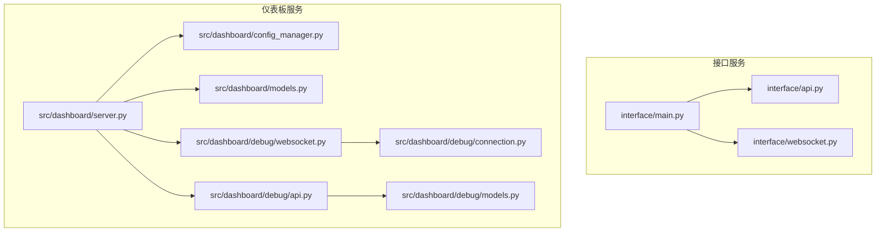
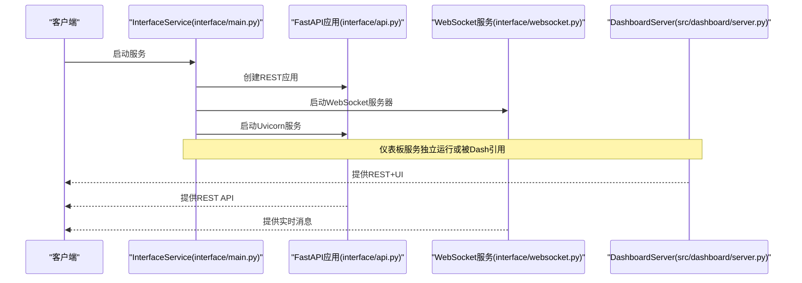
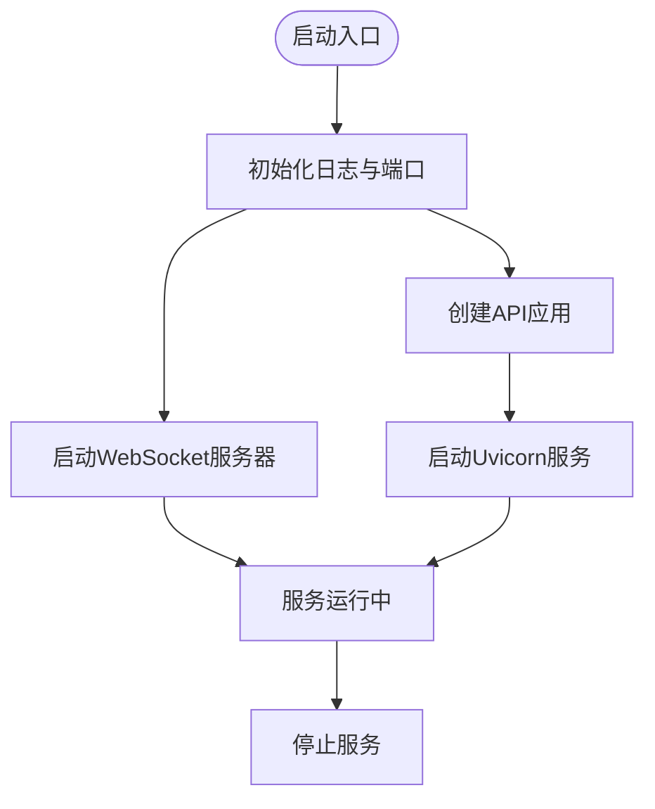
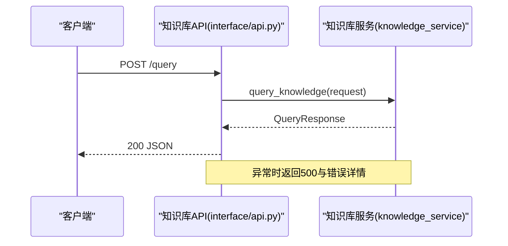
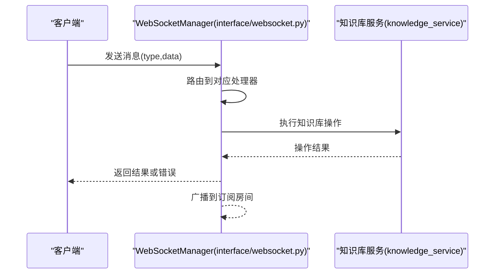
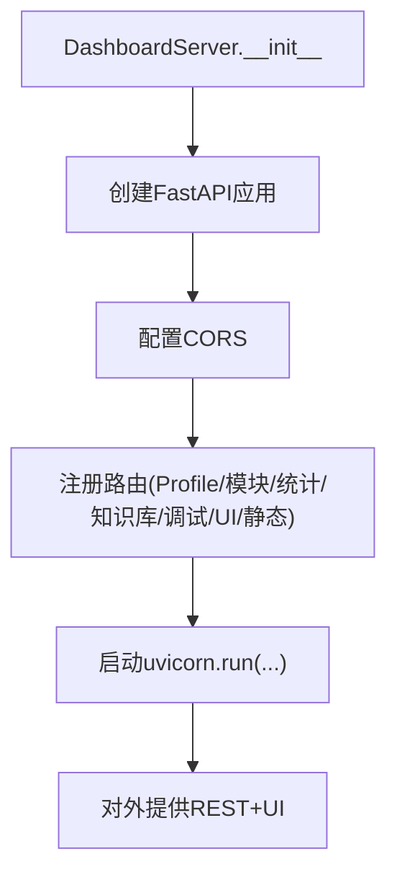
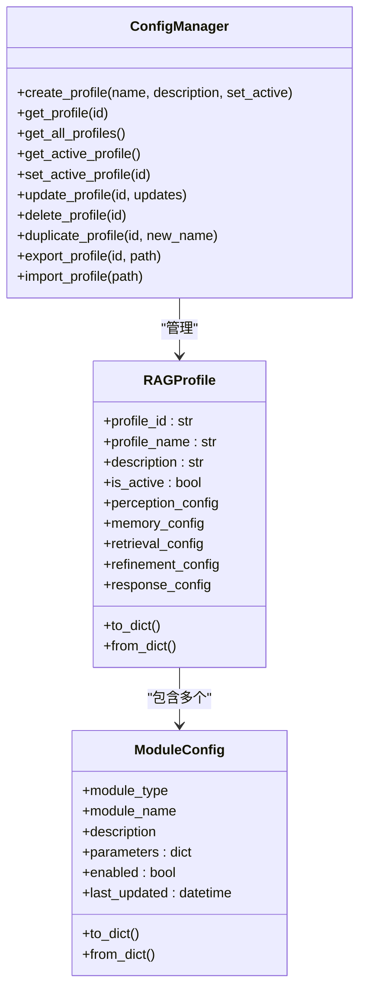
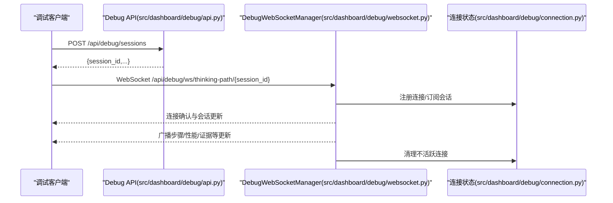
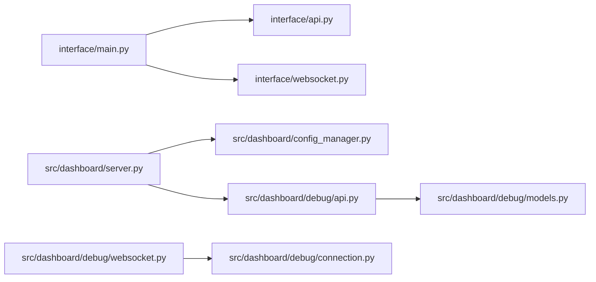

# Web服务器

<cite>
**本文引用的文件**
- [interface/main.py](file://interface/main.py)
- [interface/api.py](file://interface/api.py)
- [interface/models.py](file://interface/models.py)
- [interface/websocket.py](file://interface/websocket.py)
- [src/dashboard/server.py](file://src/dashboard/server.py)
- [src/dashboard/config_manager.py](file://src/dashboard/config_manager.py)
- [src/dashboard/models.py](file://src/dashboard/models.py)
- [src/dashboard/debug/api.py](file://src/dashboard/debug/api.py)
- [src/dashboard/debug/websocket.py](file://src/dashboard/debug/websocket.py)
- [src/dashboard/debug/connection.py](file://src/dashboard/debug/connection.py)
- [src/dashboard/debug/models.py](file://src/dashboard/debug/models.py)
</cite>

## 目录
1. [引言](#引言)
2. [项目结构](#项目结构)
3. [核心组件](#核心组件)
4. [架构总览](#架构总览)
5. [详细组件分析](#详细组件分析)
6. [依赖分析](#依赖分析)
7. [性能考虑](#性能考虑)
8. [故障排查指南](#故障排查指南)
9. [结论](#结论)
10. [附录](#附录)

## 引言
本文件面向Web服务器模块，系统性梳理基于FastAPI的RESTful API与WebSocket服务实现，涵盖路由设计、中间件配置、CORS跨域、静态文件服务、错误处理、启动流程、配置参数与运行时监控，并提供API参考、使用示例与性能优化建议。读者无需深入底层即可理解如何扩展与维护该Web服务器。

## 项目结构
Web服务器相关代码主要分布在以下位置：
- 接口服务入口与并发启动：interface/main.py
- 独立REST API服务：interface/api.py
- API数据模型：interface/models.py
- WebSocket服务：interface/websocket.py
- 仪表板FastAPI服务器：src/dashboard/server.py
- 仪表板配置管理：src/dashboard/config_manager.py
- 仪表板数据模型：src/dashboard/models.py
- 调试API路由与WebSocket：src/dashboard/debug/api.py、src/dashboard/debug/websocket.py、src/dashboard/debug/connection.py、src/dashboard/debug/models.py

**图表来源**
- [interface/main.py:14-82](file://interface/main.py#L14-L82)
- [interface/api.py:19-162](file://interface/api.py#L19-L162)
- [interface/websocket.py:18-299](file://interface/websocket.py#L18-L299)
- [src/dashboard/server.py:51-568](file://src/dashboard/server.py#L51-L568)
- [src/dashboard/config_manager.py:14-315](file://src/dashboard/config_manager.py#L14-L315)
- [src/dashboard/models.py:165-232](file://src/dashboard/models.py#L165-L232)
- [src/dashboard/debug/api.py:21-557](file://src/dashboard/debug/api.py#L21-L557)
- [src/dashboard/debug/websocket.py:49-554](file://src/dashboard/debug/websocket.py#L49-L554)
- [src/dashboard/debug/connection.py:315-595](file://src/dashboard/debug/connection.py#L315-L595)
- [src/dashboard/debug/models.py:186-336](file://src/dashboard/debug/models.py#L186-L336)

**章节来源**
- [interface/main.py:14-82](file://interface/main.py#L14-L82)
- [src/dashboard/server.py:51-568](file://src/dashboard/server.py#L51-L568)

## 核心组件
- 接口服务主类：负责REST API与WebSocket的统一启动与生命周期管理。
- FastAPI仪表板服务器：提供配置管理、模块参数管理、统计信息、知识库监控、调试面板与UI。
- 配置管理器：Profile的增删改查、导入导出、活动Profile切换。
- 调试API与WebSocket：调试会话、证据、推理步骤的实时推送与订阅。
- WebSocket管理器：连接管理、订阅分组、广播、清理与健康检查。
- API模型：查询、插入、更新、删除、健康状态等请求/响应模型。
- 连接状态管理：连接类型、状态、健康检查、告警与统计。

**章节来源**
- [interface/main.py:14-82](file://interface/main.py#L14-L82)
- [src/dashboard/server.py:51-568](file://src/dashboard/server.py#L51-L568)
- [src/dashboard/config_manager.py:14-315](file://src/dashboard/config_manager.py#L14-L315)
- [src/dashboard/debug/api.py:21-557](file://src/dashboard/debug/api.py#L21-L557)
- [src/dashboard/debug/websocket.py:49-554](file://src/dashboard/debug/websocket.py#L49-L554)
- [src/dashboard/debug/connection.py:315-595](file://src/dashboard/debug/connection.py#L315-L595)
- [interface/models.py:11-85](file://interface/models.py#L11-L85)

## 架构总览
下图展示了接口服务与仪表板服务的启动与协作关系，以及REST API、WebSocket与调试系统的交互。

**图表来源**
- [interface/main.py:30-78](file://interface/main.py#L30-L78)
- [interface/api.py:19-162](file://interface/api.py#L19-L162)
- [interface/websocket.py:27-51](file://interface/websocket.py#L27-L51)
- [src/dashboard/server.py:544-557](file://src/dashboard/server.py#L544-L557)

## 详细组件分析

### 接口服务与启动流程
- InterfaceService负责：
  - 初始化日志、创建REST API应用、启动WebSocket服务器、启动Uvicorn服务。
  - 支持异步启动与优雅停止。
- 启动参数：
  - API端口与WebSocket端口可配置，默认8000/8001。
- 错误处理：
  - 捕获键盘中断与异常，记录日志并清理资源。

**图表来源**
- [interface/main.py:30-78](file://interface/main.py#L30-L78)

**章节来源**
- [interface/main.py:14-82](file://interface/main.py#L14-L82)

### FastAPI RESTful API（知识库接口）
- 应用创建与文档：
  - 标题、描述、版本、OpenAPI文档与ReDoc文档路径。
- CORS中间件：
  - 允许任意来源、凭据、方法与头。
- 根路径与健康检查：
  - 根路径返回欢迎信息与文档链接。
  - 健康检查聚合知识库服务状态。
- 核心端点：
  - 查询、插入、更新、删除、统计、查询建议。
- 错误处理：
  - 捕获内部异常并返回500与详细错误信息。

**图表来源**
- [interface/api.py:19-162](file://interface/api.py#L19-L162)

**章节来源**
- [interface/api.py:19-162](file://interface/api.py#L19-L162)
- [interface/models.py:35-85](file://interface/models.py#L35-L85)

### WebSocket服务（实时知识库操作）
- 连接管理：
  - 维护客户端集合、房间订阅、心跳与错误处理。
- 消息路由：
  - query/insert/update/delete/subscribe/unsubscribe/ping等类型分发。
- 广播与通知：
  - 成功操作后广播给订阅者，如“插入/更新/删除”事件。
- 连接清理：
  - 断开连接时清理订阅与客户端映射。

**图表来源**
- [interface/websocket.py:38-299](file://interface/websocket.py#L38-L299)

**章节来源**
- [interface/websocket.py:18-299](file://interface/websocket.py#L18-L299)

### 仪表板FastAPI服务器（DashboardServer）
- 应用与中间件：
  - 标题、描述、版本；CORS允许任意来源与头。
- 路由分层：
  - Profile管理：创建、查询、激活、复制、导入导出。
  - 模块参数管理：按模块读取/更新参数。
  - 统计信息：获取与重置。
  - 知识库监控：指标、健康报告、仪表盘数据、增长趋势、时间线、候选审核、缺口分析。
  - 调试面板：包含调试API路由与WebSocket端点。
  - Web UI：主控制台、调试控制台、调试面板、知识库健康仪表盘。
  - 静态文件：/static挂载。
- WebSocket调试端点：
  - /api/debug/ws/thinking-path/{session_id}，建立连接、订阅会话、消息处理与断开清理。
- 启动方式：
  - uvicorn.run(host, port, log_level)。

**图表来源**
- [src/dashboard/server.py:51-568](file://src/dashboard/server.py#L51-L568)

**章节来源**
- [src/dashboard/server.py:51-568](file://src/dashboard/server.py#L51-L568)

### 配置管理器（ConfigManager）
- 功能：
  - 创建、读取、更新、删除、复制、导入、导出Profile。
  - 活动Profile切换与持久化。
- 数据模型：
  - RAGProfile包含感知、记忆、检索、精炼、响应等模块配置。
  - 模块配置包含类型、名称、描述、参数、启用状态与最后更新时间。

**图表来源**
- [src/dashboard/config_manager.py:14-315](file://src/dashboard/config_manager.py#L14-L315)
- [src/dashboard/models.py:165-232](file://src/dashboard/models.py#L165-L232)

**章节来源**
- [src/dashboard/config_manager.py:14-315](file://src/dashboard/config_manager.py#L14-L315)
- [src/dashboard/models.py:165-232](file://src/dashboard/models.py#L165-L232)

### 调试API与WebSocket（Debug）
- 调试API路由：
  - 会话创建、查询、完成、失败、步骤与证据管理、查询历史、路径分析、参数调优、统计与健康检查。
- 调试WebSocket：
  - 连接建立、订阅会话、广播会话/步骤/性能/查询历史、心跳与清理。
- 连接状态管理：
  - 连接类型、状态枚举，健康检查器注册、告警处理、统计与清理任务。

**图表来源**
- [src/dashboard/debug/api.py:91-557](file://src/dashboard/debug/api.py#L91-L557)
- [src/dashboard/debug/websocket.py:92-554](file://src/dashboard/debug/websocket.py#L92-L554)
- [src/dashboard/debug/connection.py:315-595](file://src/dashboard/debug/connection.py#L315-L595)

**章节来源**
- [src/dashboard/debug/api.py:21-557](file://src/dashboard/debug/api.py#L21-L557)
- [src/dashboard/debug/websocket.py:49-554](file://src/dashboard/debug/websocket.py#L49-L554)
- [src/dashboard/debug/connection.py:315-595](file://src/dashboard/debug/connection.py#L315-L595)
- [src/dashboard/debug/models.py:186-336](file://src/dashboard/debug/models.py#L186-L336)

## 依赖分析
- 组件耦合：
  - DashboardServer依赖ConfigManager与调试组件；调试API与WebSocket相互配合。
  - 接口服务通过独立模块提供REST与WebSocket，便于解耦。
- 外部依赖：
  - FastAPI、Uvicorn、websockets、pydantic。
- 中间件：
  - CORS中间件贯穿REST与仪表板应用。

**图表来源**
- [interface/main.py:14-82](file://interface/main.py#L14-L82)
- [src/dashboard/server.py:51-568](file://src/dashboard/server.py#L51-L568)
- [src/dashboard/debug/api.py:21-557](file://src/dashboard/debug/api.py#L21-L557)
- [src/dashboard/debug/websocket.py:49-554](file://src/dashboard/debug/websocket.py#L49-L554)
- [src/dashboard/debug/connection.py:315-595](file://src/dashboard/debug/connection.py#L315-L595)

**章节来源**
- [interface/main.py:14-82](file://interface/main.py#L14-L82)
- [src/dashboard/server.py:51-568](file://src/dashboard/server.py#L51-L568)

## 性能考虑
- 启动与并发：
  - 使用Uvicorn异步运行，接口服务通过asyncio并发启动REST与WebSocket。
- 路由与序列化：
  - 使用Pydantic模型进行输入校验与序列化，减少运行时错误与类型转换成本。
- WebSocket广播：
  - 使用锁与gather并行发送，降低广播延迟。
- 清理与资源：
  - WebSocket清理任务定期断开不活跃连接，避免资源泄露。
- 建议：
  - 在高并发场景下，结合限流、连接池与异步I/O优化。
  - 对热点端点增加缓存与指标埋点，结合Prometheus/Grafana监控。

[本节为通用建议，无需具体文件分析]

## 故障排查指南
- 健康检查：
  - REST API提供健康检查端点，返回组件状态与运行时间。
- 错误处理：
  - API层捕获异常并返回500与错误详情；WebSocket对消息格式与处理异常进行记录与错误回传。
- 调试WebSocket：
  - 提供连接确认、心跳、订阅与广播能力，便于定位问题。
- 连接状态监控：
  - 连接健康监控器支持注册检查器、告警处理与统计查询。

**章节来源**
- [interface/api.py:49-71](file://interface/api.py#L49-L71)
- [interface/websocket.py:52-67](file://interface/websocket.py#L52-L67)
- [src/dashboard/debug/websocket.py:318-321](file://src/dashboard/debug/websocket.py#L318-L321)
- [src/dashboard/debug/connection.py:137-176](file://src/dashboard/debug/connection.py#L137-L176)

## 结论
本Web服务器模块以FastAPI为核心，结合CORS、静态文件与WebSocket，构建了可扩展的REST+UI+实时通信平台。通过清晰的路由分层、完善的模型与错误处理、以及调试与连接管理能力，开发者可快速扩展配置管理、知识库监控与调试功能。

[本节为总结，无需具体文件分析]

## 附录

### API参考（RESTful）
- 根路径
  - GET /：返回欢迎信息与文档链接
- 健康检查
  - GET /health：返回服务与组件健康状态
- 查询
  - POST /query：请求体为查询模型，响应为查询结果模型
- 插入
  - POST /insert：批量插入知识条目
- 更新
  - PUT /update：按ID更新知识条目
- 删除
  - DELETE /delete：按ID列表删除知识条目
- 统计
  - GET /stats：返回知识库统计信息
- 查询建议
  - GET /suggestions/{query}：返回相关查询建议

**章节来源**
- [interface/api.py:40-151](file://interface/api.py#L40-L151)
- [interface/models.py:22-85](file://interface/models.py#L22-L85)

### API参考（仪表板）
- Profile管理
  - GET /api/profiles
  - GET /api/profiles/{profile_id}
  - GET /api/profiles/active
  - POST /api/profiles
  - PUT /api/profiles/{profile_id}
  - DELETE /api/profiles/{profile_id}
  - POST /api/profiles/{profile_id}/activate
  - POST /api/profiles/{profile_id}/duplicate
  - POST /api/profiles/{profile_id}/export
  - POST /api/profiles/import
- 模块参数管理
  - GET /api/profiles/{profile_id}/modules/{module}
  - PUT /api/profiles/{profile_id}/modules/{module}
- 统计信息
  - GET /api/stats
  - POST /api/stats/reset
- 知识库监控
  - GET /api/knowledge/metrics
  - GET /api/knowledge/health
  - GET /api/knowledge/dashboard
  - GET /api/knowledge/growth
  - GET /api/knowledge/timeline
  - GET /api/knowledge/candidates
  - POST /api/knowledge/candidates/{candidate_id}/approve
  - POST /api/knowledge/candidates/{candidate_id}/reject
  - GET /api/knowledge/gaps
- 调试面板
  - include_router(DebugAPIRouter)
  - WebSocket /api/debug/ws/thinking-path/{session_id}

**章节来源**
- [src/dashboard/server.py:113-418](file://src/dashboard/server.py#L113-L418)

### 使用示例
- 启动接口服务
  - 运行入口，创建REST应用与WebSocket服务器，启动Uvicorn。
- 启动仪表板
  - 创建DashboardServer，配置CORS与路由，挂载静态文件，启动uvicorn。

**章节来源**
- [interface/main.py:75-82](file://interface/main.py#L75-L82)
- [src/dashboard/server.py:560-567](file://src/dashboard/server.py#L560-L567)