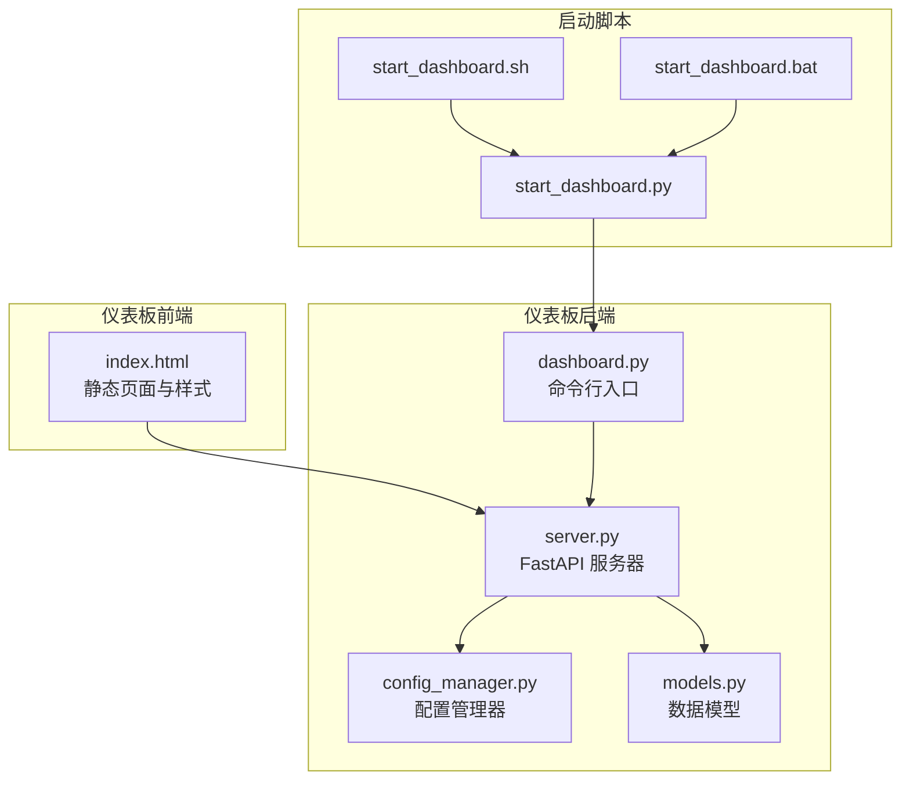
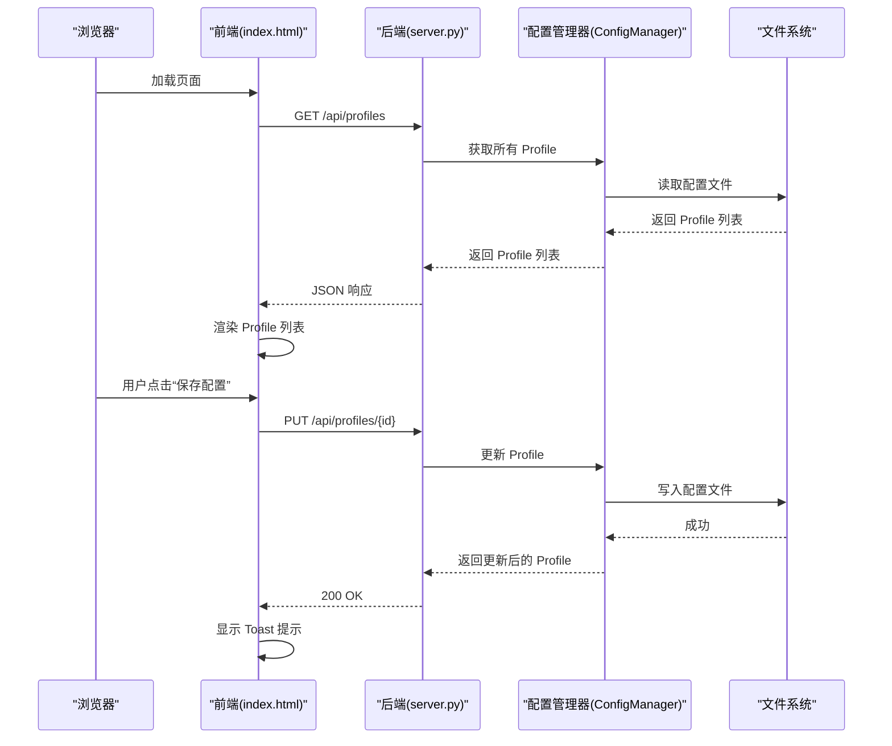
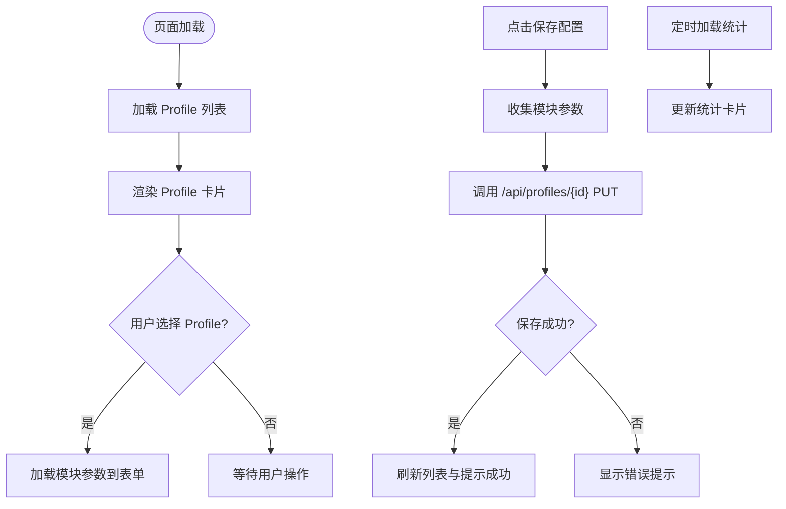
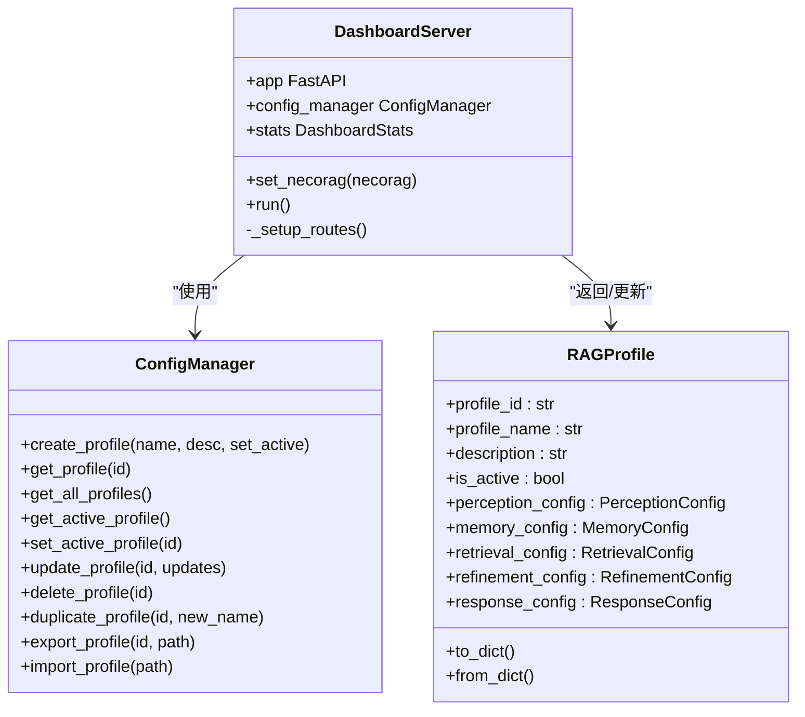
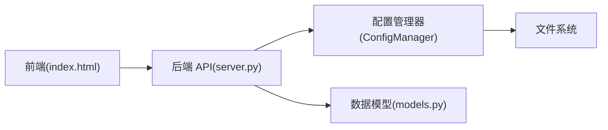

# 仪表板界面

<cite>
**本文档引用的文件**
- [index.html](file://src/dashboard/static/index.html)
- [dashboard.py](file://src/dashboard/dashboard.py)
- [models.py](file://src/dashboard/models.py)
- [config_manager.py](file://src/dashboard/config_manager.py)
- [server.py](file://src/dashboard/server.py)
- [DASHBOARD_GUIDE.md](file://DASHBOARD_GUIDE.md)
- [README.md](file://src/dashboard/README.md)
- [start_dashboard.py](file://tools/start_dashboard.py)
- [start_dashboard.sh](file://tools/start_dashboard.sh)
- [start_dashboard.bat](file://tools/start_dashboard.bat)
</cite>

## 目录
1. [简介](#简介)
2. [项目结构](#项目结构)
3. [核心组件](#核心组件)
4. [架构总览](#架构总览)
5. [详细组件分析](#详细组件分析)
6. [依赖关系分析](#依赖关系分析)
7. [性能考虑](#性能考虑)
8. [故障排除指南](#故障排除指南)
9. [结论](#结论)
10. [附录](#附录)

## 简介
本文件为 NecoRAG 仪表板界面的详细技术文档，涵盖静态 HTML 页面结构与样式设计、响应式布局与交互元素、JavaScript 前端逻辑（API 调用、数据渲染、实时更新）、用户界面使用指南（Profile 管理、配置查看、统计信息展示）、界面定制化与主题切换、扩展新配置项与监控指标的方法，以及浏览器兼容性与性能优化建议。文档面向开发者与运维人员，帮助快速理解并高效使用仪表板。

## 项目结构
仪表板相关代码主要位于 `src/dashboard/` 目录，包含静态资源、后端服务与数据模型；同时提供跨平台启动脚本位于 `tools/` 目录。

**图表来源**
- [index.html](file://src/dashboard/static/index.html)
- [server.py](file://src/dashboard/server.py)
- [config_manager.py](file://src/dashboard/config_manager.py)
- [models.py](file://src/dashboard/models.py)
- [dashboard.py](file://src/dashboard/dashboard.py)
- [start_dashboard.py](file://tools/start_dashboard.py)
- [start_dashboard.sh](file://tools/start_dashboard.sh)
- [start_dashboard.bat](file://tools/start_dashboard.bat)

**章节来源**
- [index.html](file://src/dashboard/static/index.html)
- [server.py](file://src/dashboard/server.py)
- [config_manager.py](file://src/dashboard/config_manager.py)
- [models.py](file://src/dashboard/models.py)
- [dashboard.py](file://src/dashboard/dashboard.py)
- [start_dashboard.py](file://tools/start_dashboard.py)
- [start_dashboard.sh](file://tools/start_dashboard.sh)
- [start_dashboard.bat](file://tools/start_dashboard.bat)

## 核心组件
- 静态页面与样式：提供响应式布局、卡片式 UI、标签页切换、模态框与提示等交互元素。
- 前端 JavaScript：负责 API 调用、Profile 列表渲染、模块参数编辑、统计信息实时刷新、Toast 提示等。
- 后端 FastAPI 服务器：提供 RESTful API，管理 Profile、模块参数与统计信息，并托管静态页面。
- 配置管理器：负责 Profile 的创建、加载、保存、切换、导入导出与复制。
- 数据模型：定义模块类型、配置结构与统计信息的数据类。

**章节来源**
- [index.html](file://src/dashboard/static/index.html)
- [server.py](file://src/dashboard/server.py)
- [config_manager.py](file://src/dashboard/config_manager.py)
- [models.py](file://src/dashboard/models.py)

## 架构总览
仪表板采用前后端分离架构：前端通过 AJAX 调用后端 API 获取与更新配置，后端以 FastAPI 提供 REST 接口并托管静态页面。

**图表来源**
- [index.html](file://src/dashboard/static/index.html)
- [server.py](file://src/dashboard/server.py)
- [config_manager.py](file://src/dashboard/config_manager.py)

## 详细组件分析

### 静态页面与样式设计
- 布局结构：采用容器包裹 + 网格布局，左侧为 Profile 列表与统计卡片，右侧为模块配置与标签页。
- 卡片与按钮：统一的圆角、阴影与渐变背景，按钮具备悬停与禁用态。
- 表单控件：文本输入、数字输入、复选框、下拉选择，配合提示信息与对齐布局。
- 模态框：创建 Profile 的弹窗，包含表单与操作按钮。
- Toast 提示：固定定位的提示消息，带滑入动画。
- 响应式设计：在小屏设备上自动切换为单列布局，表单项垂直排列，适配移动端体验。

**章节来源**
- [index.html](file://src/dashboard/static/index.html)

### JavaScript 前端逻辑
- 初始化与定时刷新：DOM 加载完成后加载 Profile 与统计信息，并每 5 秒刷新一次统计。
- Profile 管理：
  - 加载：调用 `/api/profiles` 获取列表，渲染为可点击卡片，高亮活动 Profile。
  - 选择：点击卡片后加载对应 Profile 的模块参数到表单。
  - 激活：调用 `/api/profiles/{id}/activate` 设置活动 Profile。
  - 删除：调用 `/api/profiles/{id}` 删除选中 Profile。
  - 创建：弹出模态框，提交 `/api/profiles` 创建新 Profile。
- 模块配置：
  - 标签页切换：通过 `switchModule()` 控制模块内容显示。
  - 表单填充：`loadModuleConfig()` 将参数映射到对应表单控件。
  - 参数收集：`getModuleConfig()` 从表单收集参数，区分数字与布尔值。
  - 保存：调用 `/api/profiles/{id}` PUT 更新整个 Profile。
- 统计信息：
  - 加载：调用 `/api/stats` 获取统计，更新卡片数字。
  - 重置：调用 `/api/stats/reset` 清空统计。
- 交互反馈：Toast 提示成功/失败消息；空状态占位；确认对话框防止误删。

**图表来源**
- [index.html](file://src/dashboard/static/index.html)

**章节来源**
- [index.html](file://src/dashboard/static/index.html)

### 后端 API 与数据流
- Profile 管理 API：获取列表、获取单个、创建、更新、删除、激活、复制、导入导出。
- 模块参数 API：按 Profile 获取/更新指定模块参数。
- 统计信息 API：获取与重置统计。
- Web UI：返回静态页面并挂载静态文件服务。

**图表来源**
- [server.py](file://src/dashboard/server.py)
- [config_manager.py](file://src/dashboard/config_manager.py)
- [models.py](file://src/dashboard/models.py)

**章节来源**
- [server.py](file://src/dashboard/server.py)
- [config_manager.py](file://src/dashboard/config_manager.py)
- [models.py](file://src/dashboard/models.py)

### 数据模型与配置结构
- 模块类型枚举：感知、记忆、检索、精炼、响应、知识演化。
- 模块配置基类：包含模块类型、名称、描述、参数字典、启用状态与最后更新时间。
- 具体模块配置：感知、记忆、检索、精炼、响应分别定义默认参数。
- RAG Profile：包含五个模块配置与元数据，支持序列化/反序列化。
- 统计信息：包含文档/块/查询/会话计数、内存使用与性能指标。

**章节来源**
- [models.py](file://src/dashboard/models.py)

### 启动与部署
- 命令行入口：解析主机、端口与配置目录参数，创建并运行服务器。
- 跨平台启动脚本：提供 Python、Shell 与批处理三种启动方式，自动输出访问地址与 API 文档地址。

**章节来源**
- [dashboard.py](file://src/dashboard/dashboard.py)
- [start_dashboard.py](file://tools/start_dashboard.py)
- [start_dashboard.sh](file://tools/start_dashboard.sh)
- [start_dashboard.bat](file://tools/start_dashboard.bat)

## 依赖关系分析
- 前端依赖后端 API：页面通过 fetch 调用后端接口，后端依赖配置管理器与文件系统持久化。
- 后端依赖关系：FastAPI 应用依赖配置管理器与数据模型；静态文件通过静态文件服务挂载。
- 模块耦合：前端与后端通过 REST 接口解耦；配置管理器与文件系统耦合，便于持久化。

**图表来源**
- [index.html](file://src/dashboard/static/index.html)
- [server.py](file://src/dashboard/server.py)
- [config_manager.py](file://src/dashboard/config_manager.py)
- [models.py](file://src/dashboard/models.py)

**章节来源**
- [index.html](file://src/dashboard/static/index.html)
- [server.py](file://src/dashboard/server.py)
- [config_manager.py](file://src/dashboard/config_manager.py)
- [models.py](file://src/dashboard/models.py)

## 性能考虑
- 前端性能
  - 减少 DOM 操作：批量渲染 Profile 列表，避免逐项插入。
  - 表单参数收集：仅在保存时收集，避免频繁读取。
  - 定时刷新：统计信息每 5 秒刷新一次，可根据实际需求调整频率。
- 后端性能
  - 配置缓存：配置管理器缓存已加载的 Profile，减少磁盘 IO。
  - 参数验证：建议在更新前进行参数范围校验，避免无效写入。
  - 批量更新：对大量参数更新使用批量接口，减少 API 调用次数。
- 响应式优化
  - 图片与字体：使用系统字体栈，减少外部资源请求。
  - 动画与阴影：适度使用，避免低端设备卡顿。

[本节为通用性能建议，不直接分析具体文件]

## 故障排除指南
- 无法访问 Dashboard
  - 检查端口是否被占用，尝试更换端口或关闭占用进程。
  - 确认防火墙放行端口。
- 配置保存失败
  - 检查配置目录写权限，必要时更换目录或提升权限。
- API 返回 404
  - 确认 Profile ID 存在，先获取列表再使用正确 ID。
- 统计信息不更新
  - 检查定时刷新逻辑是否正常，确认网络连接与后端服务状态。

**章节来源**
- [DASHBOARD_GUIDE.md](file://DASHBOARD_GUIDE.md)
- [README.md](file://src/dashboard/README.md)

## 结论
仪表板界面通过清晰的前后端职责划分，提供了直观易用的配置管理与监控能力。前端采用响应式设计与轻量交互，后端以 FastAPI 提供稳定 API 与静态资源托管。结合配置管理器与数据模型，实现了 Profile 生命周期管理与模块参数的灵活配置。通过合理的性能优化与故障排查策略，可满足多环境部署与持续运维的需求。

[本节为总结性内容，不直接分析具体文件]

## 附录

### 用户界面使用指南
- 访问 Dashboard 与 API 文档
  - 访问地址：http://localhost:8000
  - API 文档：http://localhost:8000/docs
- 创建配置 Profile
  - 点击“新建 Profile”，填写名称与描述，点击“创建”。
- 配置模块参数
  - 从左侧列表选择 Profile，切换模块标签，修改参数后点击“保存配置”。
- 激活 Profile
  - 选择目标 Profile，点击“激活”，使其成为当前运行配置。
- 查看统计信息
  - 统计面板实时显示文档总数、块总数、查询总数与活动会话数。

**章节来源**
- [DASHBOARD_GUIDE.md](file://DASHBOARD_GUIDE.md)

### 界面定制化与主题切换
- 样式定制
  - 可在 HTML 中修改 CSS 变量与颜色方案，实现主题切换。
  - 响应式断点可在媒体查询中调整，适配不同屏幕尺寸。
- 交互增强
  - 可扩展 Toast 提示类型与动画，增加确认对话框的自定义文案。
  - 可添加本地存储，记住用户上次选择的模块与筛选条件。

**章节来源**
- [index.html](file://src/dashboard/static/index.html)

### 扩展新配置项与监控指标
- 新增模块参数
  - 在对应模块配置类中添加参数键值，更新默认值与注释。
  - 在前端 HTML 中新增表单项，确保 ID 与后端参数键一致。
  - 在前端 JavaScript 中完善 `loadModuleConfig()` 与 `getModuleConfig()` 的映射。
- 新增监控指标
  - 在数据模型中扩展统计信息字段，更新后端 API 返回结构。
  - 在前端统计面板新增卡片与数据绑定逻辑。
  - 在定时刷新逻辑中调用新的 API 并更新 UI。

**章节来源**
- [models.py](file://src/dashboard/models.py)
- [index.html](file://src/dashboard/static/index.html)
- [server.py](file://src/dashboard/server.py)

### 浏览器兼容性建议
- 建议支持现代浏览器（Chrome/Firefox/Safari Edge），使用原生 Promise 与 Fetch API。
- 对于旧版浏览器，可引入 polyfill 以支持 Promise 与 Fetch。
- 响应式布局使用 CSS Grid 与 Flexbox，确保在主流移动设备上的良好体验。

[本节为通用兼容性建议，不直接分析具体文件]