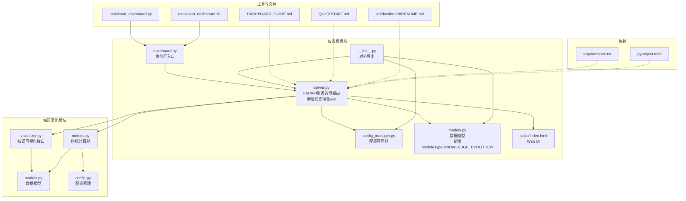
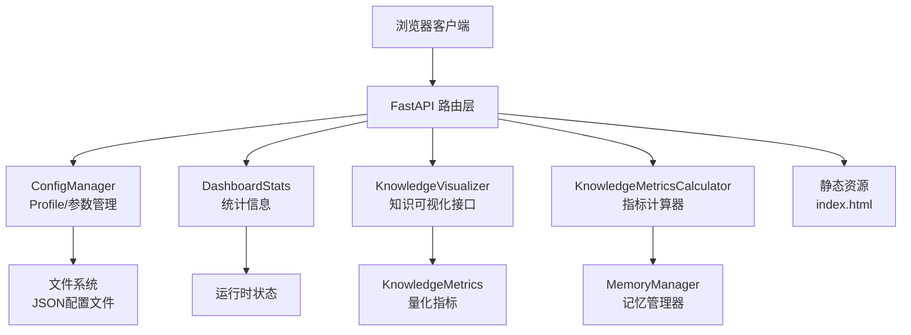
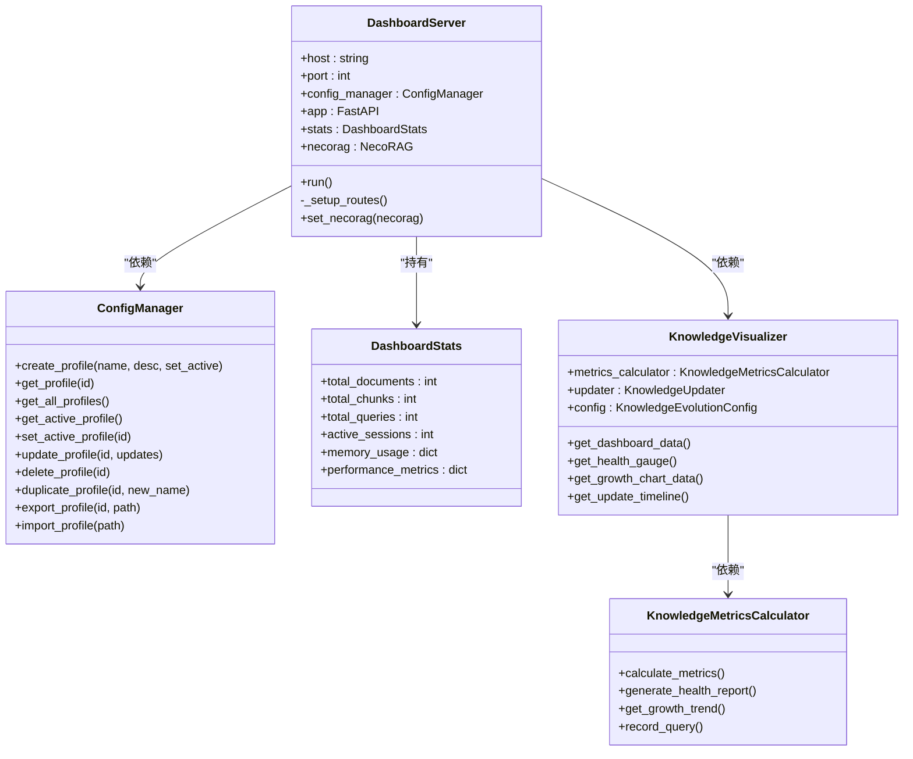
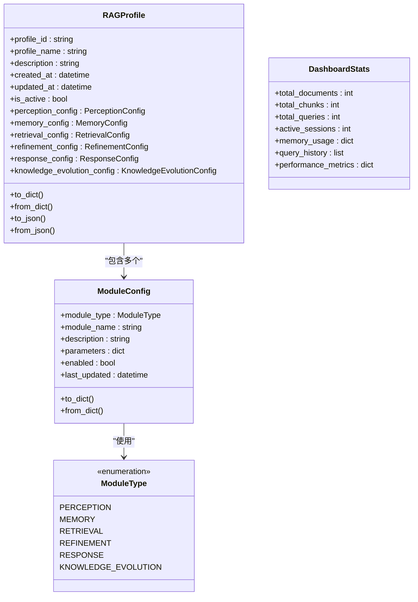
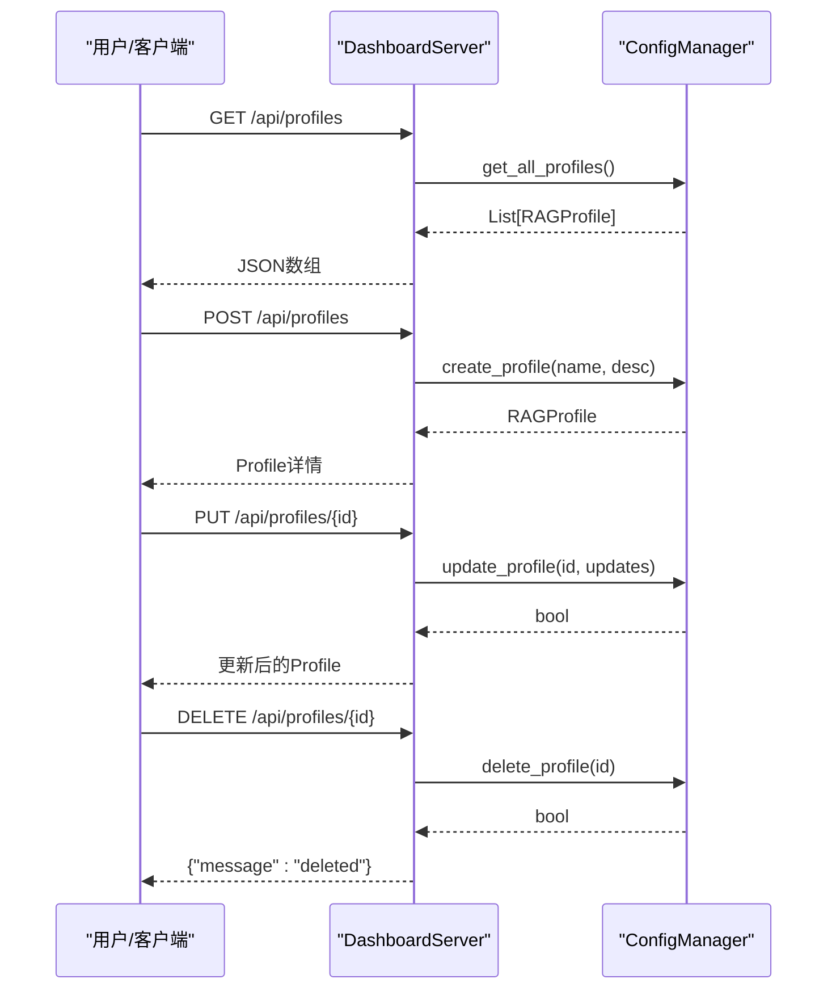
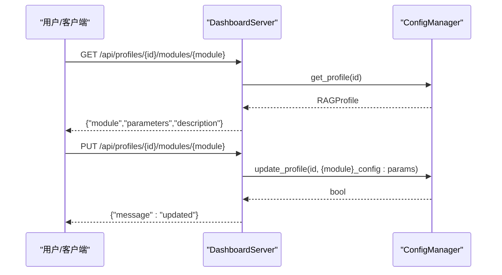
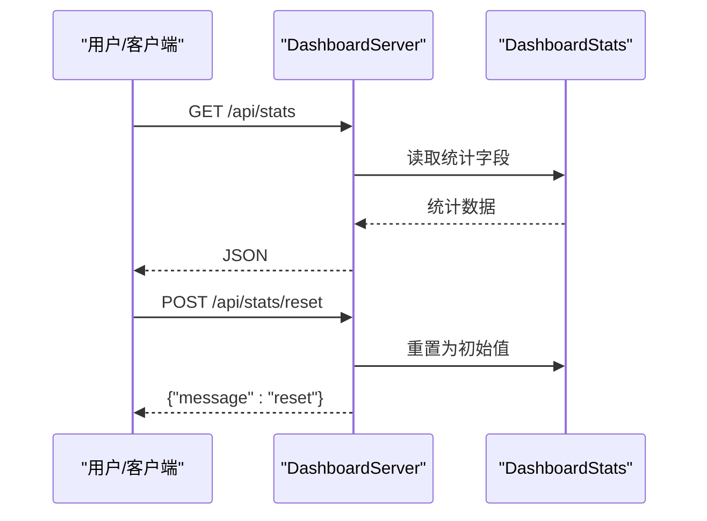
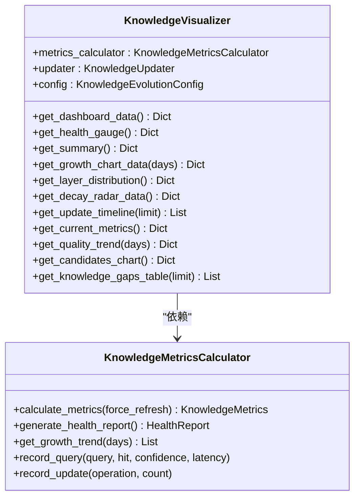
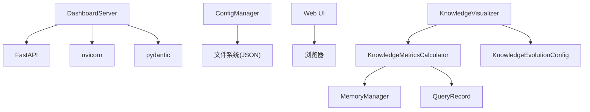

# 仪表板系统

<cite>
**本文引用的文件**
- [src/dashboard/__init__.py](file://src/dashboard/__init__.py)
- [src/dashboard/dashboard.py](file://src/dashboard/dashboard.py)
- [src/dashboard/server.py](file://src/dashboard/server.py)
- [src/dashboard/config_manager.py](file://src/dashboard/config_manager.py)
- [src/dashboard/models.py](file://src/dashboard/models.py)
- [src/dashboard/static/index.html](file://src/dashboard/static/index.html)
- [src/dashboard/README.md](file://src/dashboard/README.md)
- [src/knowledge_evolution/visualizer.py](file://src/knowledge_evolution/visualizer.py)
- [src/knowledge_evolution/metrics.py](file://src/knowledge_evolution/metrics.py)
- [src/knowledge_evolution/models.py](file://src/knowledge_evolution/models.py)
- [src/knowledge_evolution/config.py](file://src/knowledge_evolution/config.py)
- [DASHBOARD_GUIDE.md](file://DASHBOARD_GUIDE.md)
- [QUICKSTART.md](file://QUICKSTART.md)
- [requirements.txt](file://requirements.txt)
- [pyproject.toml](file://pyproject.toml)
- [tools/start_dashboard.py](file://tools/start_dashboard.py)
- [tools/start_dashboard.sh](file://tools/start_dashboard.sh)
</cite>

## 更新摘要
**所做更改**
- 新增知识演化系统仪表板集成章节，涵盖健康度监控、增长趋势分析、更新时间线等核心功能
- 更新架构总览图，展示知识演化模块与仪表板的集成关系
- 新增知识演化API接口文档，包括指标获取、健康报告、仪表盘数据等
- 更新数据模型，新增ModuleType.KNOWLEDGE_EVOLUTION枚举值
- 新增知识演化可视化组件，支持多种图表类型的实时数据展示

## 目录
1. [简介](#简介)
2. [项目结构](#项目结构)
3. [核心组件](#核心组件)
4. [架构总览](#架构总览)
5. [详细组件分析](#详细组件分析)
6. [知识演化系统集成](#知识演化系统集成)
7. [依赖分析](#依赖分析)
8. [性能考虑](#性能考虑)
9. [故障排查指南](#故障排查指南)
10. [结论](#结论)
11. [附录](#附录)

## 简介
本文件面向仪表板系统（Dashboard）的使用者与开发者，系统性阐述其架构、配置管理API、Web界面与统计监控能力，并提供安装部署、使用说明、实时监控技术实现以及扩展与定制化的指导。仪表板基于FastAPI构建，提供RESTful API与Web UI，支持Profile管理、模块参数配置、统计信息展示与实时刷新。

**更新** 新增知识演化系统的仪表板集成，支持实时监控和报告功能，包括健康度仪表盘、增长趋势分析、更新时间线等核心监控组件。

## 项目结构
仪表板位于src/dashboard目录，包含以下关键模块：
- server.py：FastAPI服务器与路由定义，新增知识演化API接口
- config_manager.py：Profile与模块参数的持久化与管理
- models.py：数据模型（Profile、模块配置、统计信息），新增ModuleType.KNOWLEDGE_EVOLUTION
- static/index.html：前端UI页面
- dashboard.py：命令行入口脚本
- __init__.py：对外暴露的API入口
- README.md：仪表板API与使用说明
- DASHBOARD_GUIDE.md：快速指南与使用手册
- QUICKSTART.md：快速开始与常见问题
- tools/start_dashboard.py、start_dashboard.sh：启动脚本

**更新** 新增知识演化模块集成，包括KnowledgeVisualizer、KnowledgeMetricsCalculator等核心组件。

**图表来源**
- [src/dashboard/server.py:94-289](file://src/dashboard/server.py#L94-L289)
- [src/dashboard/models.py:12-20](file://src/dashboard/models.py#L12-L20)
- [src/knowledge_evolution/visualizer.py:18-47](file://src/knowledge_evolution/visualizer.py#L18-L47)
- [src/knowledge_evolution/metrics.py:20-63](file://src/knowledge_evolution/metrics.py#L20-L63)

## 核心组件
- DashboardServer：基于FastAPI的Web服务器，提供Profile管理、模块参数管理、统计信息API与Web UI，**新增**知识演化API接口。
- ConfigManager：负责Profile的创建、加载、更新、删除、复制、导入导出与活动状态切换。
- 数据模型：RAGProfile、ModuleConfig、DashboardStats等，支撑配置与统计信息的数据结构，**新增**ModuleType.KNOWLEDGE_EVOLUTION枚举值。
- Web UI：静态页面，提供Profile列表、模块参数编辑、统计面板与交互按钮。
- 启动入口：dashboard.py与tools/start_dashboard.py提供多种启动方式。
- **新增** KnowledgeVisualizer：知识库可视化数据接口，为仪表板提供健康度仪表盘、增长曲线、热力图等可视化数据。
- **新增** KnowledgeMetricsCalculator：知识库量化指标计算器，持续计算健康度指标与维度报告。

**更新** 新增知识演化系统的核心组件，提供完整的监控与可视化功能。

**章节来源**
- [src/dashboard/server.py:94-289](file://src/dashboard/server.py#L94-L289)
- [src/dashboard/config_manager.py:14-41](file://src/dashboard/config_manager.py#L14-L41)
- [src/dashboard/models.py:12-20](file://src/dashboard/models.py#L12-L20)
- [src/knowledge_evolution/visualizer.py:18-66](file://src/knowledge_evolution/visualizer.py#L18-L66)
- [src/knowledge_evolution/metrics.py:20-63](file://src/knowledge_evolution/metrics.py#L20-L63)

## 架构总览
仪表板采用"服务端API + 前端UI"的架构，后端通过FastAPI提供RESTful接口，前端通过静态HTML与JavaScript与后端交互，实现Profile管理、模块参数配置与统计信息展示。

**更新** 新增知识演化系统集成，通过KnowledgeVisualizer和KnowledgeMetricsCalculator提供实时监控数据。

**图表来源**
- [src/dashboard/server.py:94-289](file://src/dashboard/server.py#L94-L289)
- [src/knowledge_evolution/visualizer.py:49-66](file://src/knowledge_evolution/visualizer.py#L49-L66)
- [src/knowledge_evolution/metrics.py:65-133](file://src/knowledge_evolution/metrics.py#L65-L133)

## 详细组件分析

### DashboardServer（FastAPI服务器）
- 职责：初始化FastAPI应用、注册CORS、挂载静态文件、注册路由、启动uvicorn服务。
- 路由分类：
  - Profile管理：获取全部、获取指定、获取活动、创建、更新、删除、激活、复制、导出、导入。
  - 模块参数：获取指定模块参数、更新模块参数。
  - 统计信息：获取统计、重置统计。
  - **新增** 知识演化API：获取知识库指标、健康报告、仪表盘数据、增长趋势、更新时间线。
  - Web UI：返回index.html或简单UI。
- 统计信息：DashboardStats对象，包含文档数、块数、查询数、活动会话、内存使用、性能指标等。

**更新** 新增知识演化API接口，包括/get_knowledge_metrics、/get_knowledge_health、/get_knowledge_dashboard等路由。

**图表来源**
- [src/dashboard/server.py:94-289](file://src/dashboard/server.py#L94-L289)
- [src/knowledge_evolution/visualizer.py:18-66](file://src/knowledge_evolution/visualizer.py#L18-L66)
- [src/knowledge_evolution/metrics.py:20-63](file://src/knowledge_evolution/metrics.py#L20-L63)

**章节来源**
- [src/dashboard/server.py:94-289](file://src/dashboard/server.py#L94-L289)
- [src/dashboard/server.py:250-289](file://src/dashboard/server.py#L250-L289)

### ConfigManager（配置管理器）
- 职责：管理Profile生命周期、活动状态、参数更新、导入导出、文件持久化。
- 关键方法：
  - create_profile：创建并保存Profile，可选设为活动。
  - get_profile/get_all_profiles/get_active_profile/set_active_profile：查询与切换活动。
  - update_profile：更新Profile基本信息与模块参数。
  - delete_profile：删除Profile文件并清理缓存。
  - duplicate_profile：复制Profile并保存。
  - export_profile/import_profile：导出/导入Profile到JSON文件。
- 缓存策略：内存缓存所有Profile，首次加载时扫描配置目录并建立活动状态。

**章节来源**
- [src/dashboard/config_manager.py:14-41](file://src/dashboard/config_manager.py#L14-L41)
- [src/dashboard/config_manager.py:135-166](file://src/dashboard/config_manager.py#L135-L166)

### 数据模型（RAGProfile、ModuleConfig、DashboardStats）
- RAGProfile：包含profile_id、profile_name、description、created_at、updated_at、is_active及五大模块配置字段。
- ModuleConfig：模块通用配置，包含module_type、module_name、description、parameters、enabled、last_updated。
- **更新** ModuleType：新增KNOWLEDGE_EVOLUTION枚举值，支持知识演化模块配置。
- DashboardStats：统计信息载体，包含文档数、块数、查询数、活动会话、内存使用、性能指标等。

**更新** 新增ModuleType.KNOWLEDGE_EVOLUTION枚举值，支持知识演化模块的配置管理。

**图表来源**
- [src/dashboard/models.py:12-20](file://src/dashboard/models.py#L12-L20)
- [src/dashboard/models.py:164-231](file://src/dashboard/models.py#L164-L231)

**章节来源**
- [src/dashboard/models.py:12-20](file://src/dashboard/models.py#L12-L20)
- [src/dashboard/models.py:164-231](file://src/dashboard/models.py#L164-L231)

### Web UI（静态页面与交互）
- 页面结构：头部（标题与操作按钮）、左侧Profile列表、右侧模块参数编辑区、底部统计面板。
- 交互逻辑：
  - 加载Profile列表与活动状态高亮。
  - 选择Profile后加载对应模块参数并允许编辑。
  - 点击"保存配置"调用更新模块参数API。
  - 点击"激活"调用激活Profile API。
  - 定时刷新统计信息。
- 模态框：创建Profile弹窗。
- 响应式设计：适配移动端。

**章节来源**
- [src/dashboard/static/index.html:715-731](file://src/dashboard/static/index.html#L715-L731)

### API流程（Profile管理）

**图表来源**
- [src/dashboard/server.py:111-160](file://src/dashboard/server.py#L111-L160)
- [src/dashboard/config_manager.py:42-74](file://src/dashboard/config_manager.py#L42-L74)

**章节来源**
- [src/dashboard/server.py:111-160](file://src/dashboard/server.py#L111-L160)
- [src/dashboard/config_manager.py:42-74](file://src/dashboard/config_manager.py#L42-L74)

### API流程（模块参数管理）

**图表来源**
- [src/dashboard/server.py:195-227](file://src/dashboard/server.py#L195-L227)
- [src/dashboard/config_manager.py:135-166](file://src/dashboard/config_manager.py#L135-L166)

**章节来源**
- [src/dashboard/server.py:195-227](file://src/dashboard/server.py#L195-L227)
- [src/dashboard/config_manager.py:135-166](file://src/dashboard/config_manager.py#L135-L166)

### API流程（统计信息）

**图表来源**
- [src/dashboard/server.py:231-247](file://src/dashboard/server.py#L231-L247)
- [src/dashboard/models.py:221-231](file://src/dashboard/models.py#L221-L231)

**章节来源**
- [src/dashboard/server.py:231-247](file://src/dashboard/server.py#L231-L247)
- [src/dashboard/models.py:221-231](file://src/dashboard/models.py#L221-L231)

## 知识演化系统集成

### KnowledgeVisualizer（知识可视化接口）
- 职责：为仪表板提供知识库可视化所需的数据格式，包括健康度仪表盘、增长曲线、热力图等。
- 核心功能：
  - get_dashboard_data：获取仪表盘完整数据，包含健康度、摘要、增长趋势、层级分布、衰减雷达、更新时间线、指标数据、质量趋势等。
  - get_health_gauge：获取健康度仪表盘数据，包含综合评分、等级、维度评分、警告与建议。
  - get_growth_chart_data：获取知识增长曲线数据，支持指定统计天数。
  - get_update_timeline：获取更新时间线数据，支持限制返回数量。
- 数据格式：所有方法返回标准化的字典格式，便于前端渲染。

**新增** 知识演化系统的核心可视化组件，提供完整的监控数据接口。

**图表来源**
- [src/knowledge_evolution/visualizer.py:18-66](file://src/knowledge_evolution/visualizer.py#L18-L66)
- [src/knowledge_evolution/metrics.py:65-133](file://src/knowledge_evolution/metrics.py#L65-L133)

**章节来源**
- [src/knowledge_evolution/visualizer.py:18-66](file://src/knowledge_evolution/visualizer.py#L18-L66)
- [src/knowledge_evolution/visualizer.py:49-66](file://src/knowledge_evolution/visualizer.py#L49-L66)

### KnowledgeMetricsCalculator（指标计算器）
- 职责：持续计算知识库的健康度指标，提供综合评分和维度报告。
- 核心功能：
  - calculate_metrics：计算当前知识库量化指标，包含规模、新鲜度、质量、健康度等维度。
  - generate_health_report：生成知识库健康报告，包含各维度评分与警告建议。
  - get_growth_trend：获取知识增长趋势数据。
  - record_query：记录查询用于统计分析。
  - record_update：记录更新操作用于增长趋势统计。
- 缓存机制：支持指标缓存，提高性能。
- 历史数据：维护指标历史，支持趋势分析。

**新增** 知识演化系统的核心指标计算组件，提供完整的量化分析能力。

**章节来源**
- [src/knowledge_evolution/metrics.py:20-63](file://src/knowledge_evolution/metrics.py#L20-L63)
- [src/knowledge_evolution/metrics.py:65-133](file://src/knowledge_evolution/metrics.py#L65-L133)

### 数据模型（知识演化相关）
- KnowledgeMetrics：知识库量化指标，包含规模、新鲜度、质量、健康度等维度指标。
- HealthReport：知识库健康报告，包含综合健康分、各维度评分、警告与建议。
- KnowledgeCandidate：知识候选条目，用于待审查的知识条目管理。
- UpdateTask：更新任务，用于批量更新任务的跟踪与管理。
- ChangeLogEntry：变更日志条目，记录知识库的变更历史。

**新增** 知识演化系统的核心数据模型，支撑完整的监控与分析功能。

**章节来源**
- [src/knowledge_evolution/models.py:194-272](file://src/knowledge_evolution/models.py#L194-L272)
- [src/knowledge_evolution/models.py:275-309](file://src/knowledge_evolution/models.py#L275-L309)
- [src/knowledge_evolution/models.py:63-103](file://src/knowledge_evolution/models.py#L63-L103)

### 知识演化API接口
- 获取知识库指标：GET /api/knowledge/metrics
- 获取健康报告：GET /api/knowledge/health  
- 获取仪表盘数据：GET /api/knowledge/dashboard
- 获取增长趋势：GET /api/knowledge/growth?days=30
- 获取更新时间线：GET /api/knowledge/timeline?limit=20

**新增** 完整的知识演化API接口，支持实时监控与报告功能。

**章节来源**
- [src/dashboard/server.py:250-289](file://src/dashboard/server.py#L250-L289)

## 依赖分析
- 运行时依赖：FastAPI、uvicorn、pydantic等。
- 项目打包：pyproject.toml定义了包元数据与核心依赖。
- 启动方式：支持命令行参数、模块方式、脚本方式与Shell脚本。
- **新增** 知识演化依赖：KnowledgeEvolutionConfig、KnowledgeMetricsCalculator、KnowledgeVisualizer等组件。

**更新** 新增知识演化系统的依赖关系，包括配置管理、指标计算、可视化等核心组件。

**图表来源**
- [requirements.txt:8-10](file://requirements.txt#L8-L10)
- [src/knowledge_evolution/visualizer.py:43-45](file://src/knowledge_evolution/visualizer.py#L43-L45)
- [src/knowledge_evolution/metrics.py:42-43](file://src/knowledge_evolution/metrics.py#L42-L43)

**章节来源**
- [requirements.txt:8-10](file://requirements.txt#L8-L10)
- [src/knowledge_evolution/visualizer.py:43-45](file://src/knowledge_evolution/visualizer.py#L43-L45)
- [src/knowledge_evolution/metrics.py:42-43](file://src/knowledge_evolution/metrics.py#L42-L43)

## 性能考虑
- 配置缓存：ConfigManager在内存中缓存所有Profile，避免频繁IO。
- 参数更新：update_profile仅更新指定模块参数，减少写入开销。
- 统计刷新：前端定时轮询（5秒），可根据实际需求调整频率。
- **新增** 指标缓存：KnowledgeMetricsCalculator支持指标缓存，提高性能。
- **新增** 异步处理：知识演化API支持异步处理，避免阻塞主线程。
- 部署建议：生产环境建议使用反向代理与HTTPS，限制并发与超时。

**更新** 新增知识演化系统的性能优化建议，包括指标缓存和异步处理。

## 故障排查指南
- Dashboard无法访问
  - 检查端口占用：netstat/lsof查看8000端口；更换端口或释放端口。
  - 检查防火墙与安全组设置。
- 配置保存失败
  - 确认配置目录有写权限；更换config-dir。
- API返回404
  - 确认Profile ID存在；先获取列表再使用具体ID。
- **新增** 知识演化API错误
  - 检查NecoRAG实例是否正确初始化。
  - 确认KnowledgeVisualizer和KnowledgeMetricsCalculator配置正确。
  - 验证记忆管理器连接状态。
- 启动失败
  - 确认Python版本与依赖安装；参考requirements.txt与pyproject.toml。

**更新** 新增知识演化系统的故障排查指南。

**章节来源**
- [DASHBOARD_GUIDE.md:288-305](file://DASHBOARD_GUIDE.md#L288-L305)

## 结论
仪表板系统提供了完整的配置管理与监控能力，具备良好的扩展性与易用性。通过Profile与模块参数的灵活配置、丰富的API与直观的Web UI，能够满足多环境管理、参数调优与实时监控的需求。

**更新** 新增知识演化系统的仪表板集成，提供了完整的实时监控与报告功能，包括健康度监控、增长趋势分析、更新时间线等核心组件，进一步增强了系统的监控能力。

后续可进一步引入WebSocket实时推送、参数推荐、A/B测试与权限审计等高级功能。

## 附录

### 安装与部署
- 安装依赖：pip install -r requirements.txt
- 快速启动：python -m necorag.dashboard.dashboard 或 python start_dashboard.py
- 自定义端口/主机/配置目录：通过命令行参数传入
- Shell脚本：Linux/Mac执行start_dashboard.sh

**章节来源**
- [QUICKSTART.md:5-13](file://QUICKSTART.md#L5-L13)
- [tools/start_dashboard.py:16-51](file://tools/start_dashboard.py#L16-L51)
- [tools/start_dashboard.sh:16-25](file://tools/start_dashboard.sh#L16-L25)

### Web界面使用说明
- 访问地址：http://localhost:8000（UI）、http://localhost:8000/docs（API文档）
- 创建Profile：点击"新建 Profile"，填写名称与描述
- 配置模块参数：选择Profile后切换模块Tab，修改参数并保存
- 激活Profile：点击"激活"，成为当前运行配置
- 查看统计：底部统计面板实时刷新

**章节来源**
- [DASHBOARD_GUIDE.md:59-91](file://DASHBOARD_GUIDE.md#L59-L91)

### 配置管理API使用
- Profile管理：获取全部、创建、更新、删除、激活、复制、导出、导入
- 模块参数：获取与更新whiskers/memory/retrieval/refinement/response模块参数
- 统计信息：获取与重置

**章节来源**
- [src/dashboard/README.md:86-203](file://src/dashboard/README.md#L86-L203)

### 实时监控与统计展示技术实现
- 前端定时轮询：每5秒刷新统计信息
- 后端统计聚合：DashboardStats对象承载统计数据
- **新增** 知识演化监控：通过KnowledgeVisualizer提供实时可视化数据
- 实时优化建议：可引入WebSocket实现事件驱动推送

**更新** 新增知识演化系统的实时监控技术实现。

**章节来源**
- [src/dashboard/static/index.html:729-731](file://src/dashboard/static/index.html#L729-L731)
- [src/knowledge_evolution/visualizer.py:49-66](file://src/knowledge_evolution/visualizer.py#L49-L66)

### 扩展与定制化指导
- 新增模块参数：在对应ModuleConfig类中添加参数字段与默认值
- 新增模块：新增ModuleConfig子类并在RAGProfile中引用
- 自定义UI：修改static/index.html中的参数输入与布局
- API扩展：在server.py中注册新路由并实现业务逻辑
- 配置迁移：使用export/import功能进行跨环境迁移
- **新增** 知识演化扩展：集成KnowledgeVisualizer和KnowledgeMetricsCalculator组件

**更新** 新增知识演化系统的扩展与定制化指导。

**章节来源**
- [src/dashboard/models.py:46-161](file://src/dashboard/models.py#L46-L161)
- [src/knowledge_evolution/visualizer.py:18-66](file://src/knowledge_evolution/visualizer.py#L18-L66)
- [src/knowledge_evolution/metrics.py:20-63](file://src/knowledge_evolution/metrics.py#L20-L63)

### 知识演化系统API使用
- 获取知识库指标：GET /api/knowledge/metrics
- 获取健康报告：GET /api/knowledge/health
- 获取仪表盘数据：GET /api/knowledge/dashboard
- 获取增长趋势：GET /api/knowledge/growth?days=30
- 获取更新时间线：GET /api/knowledge/timeline?limit=20

**新增** 完整的知识演化系统API使用说明。

**章节来源**
- [src/dashboard/server.py:250-289](file://src/dashboard/server.py#L250-L289)