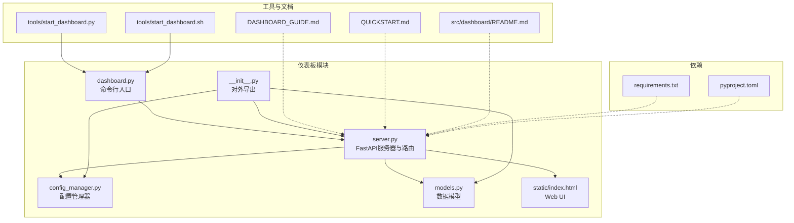
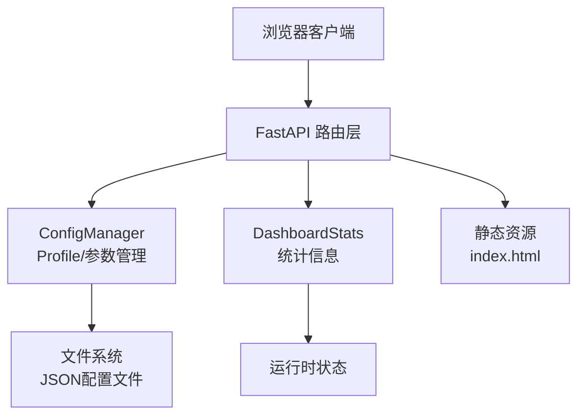
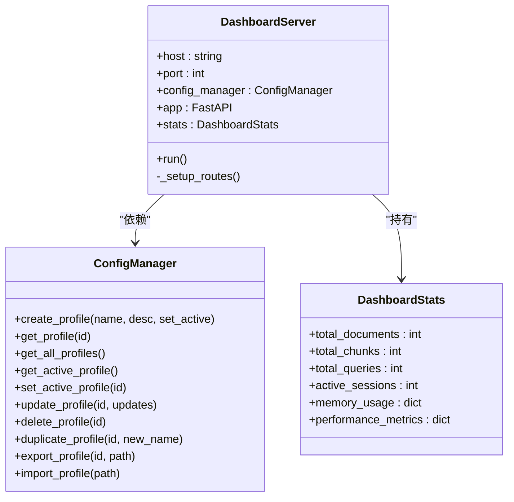
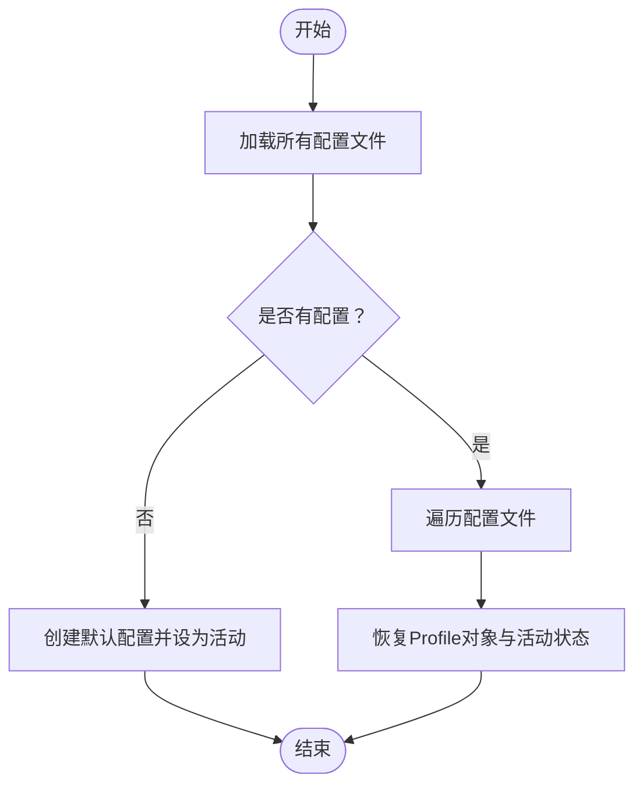
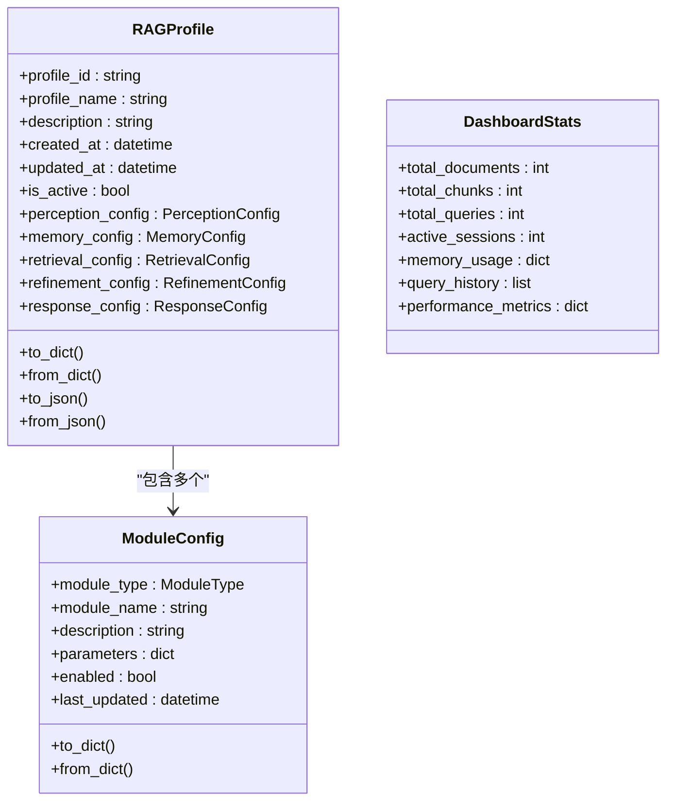
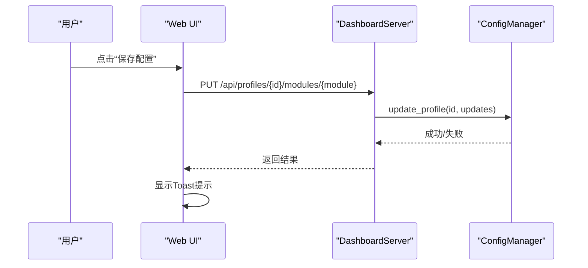
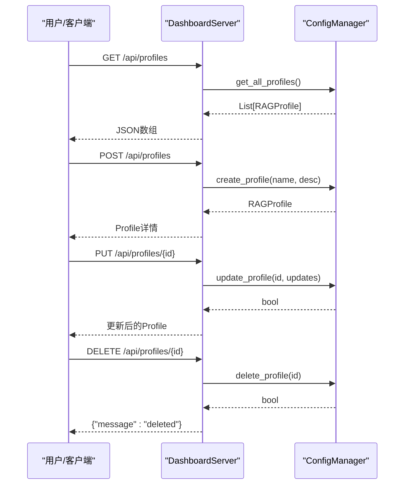
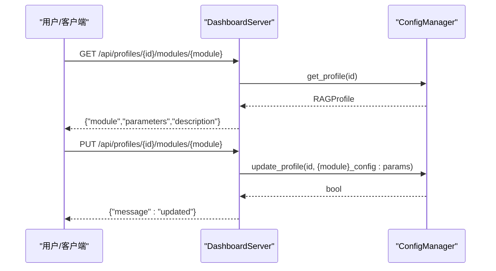
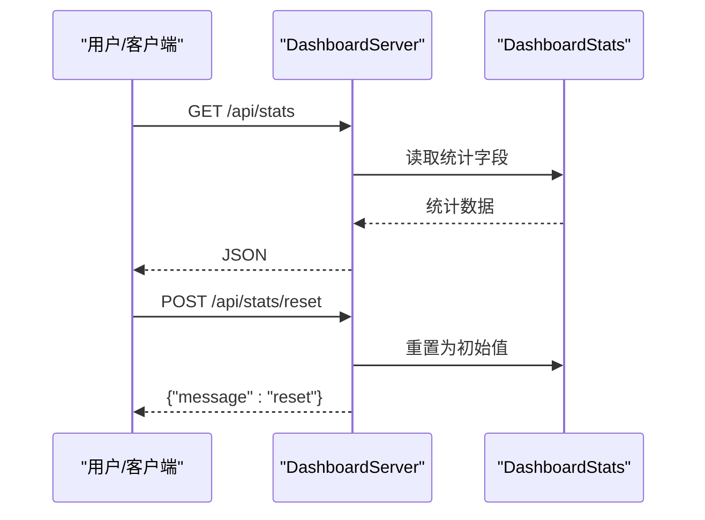
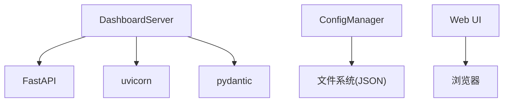

# 仪表板系统

<cite>
**本文引用的文件**
- [src/dashboard/__init__.py](file://src/dashboard/__init__.py)
- [src/dashboard/dashboard.py](file://src/dashboard/dashboard.py)
- [src/dashboard/server.py](file://src/dashboard/server.py)
- [src/dashboard/config_manager.py](file://src/dashboard/config_manager.py)
- [src/dashboard/models.py](file://src/dashboard/models.py)
- [src/dashboard/static/index.html](file://src/dashboard/static/index.html)
- [src/dashboard/README.md](file://src/dashboard/README.md)
- [DASHBOARD_GUIDE.md](file://DASHBOARD_GUIDE.md)
- [QUICKSTART.md](file://QUICKSTART.md)
- [requirements.txt](file://requirements.txt)
- [pyproject.toml](file://pyproject.toml)
- [tools/start_dashboard.py](file://tools/start_dashboard.py)
- [tools/start_dashboard.sh](file://tools/start_dashboard.sh)
</cite>

## 目录
1. [简介](#简介)
2. [项目结构](#项目结构)
3. [核心组件](#核心组件)
4. [架构总览](#架构总览)
5. [详细组件分析](#详细组件分析)
6. [依赖分析](#依赖分析)
7. [性能考虑](#性能考虑)
8. [故障排查指南](#故障排查指南)
9. [结论](#结论)
10. [附录](#附录)

## 简介
本文件面向仪表板系统（Dashboard）的使用者与开发者，系统性阐述其架构、配置管理API、Web界面与统计监控能力，并提供安装部署、使用说明、实时监控技术实现以及扩展与定制化的指导。仪表板基于FastAPI构建，提供RESTful API与Web UI，支持Profile管理、模块参数配置、统计信息展示与实时刷新。

## 项目结构
仪表板位于src/dashboard目录，包含以下关键模块：
- server.py：FastAPI服务器与路由定义
- config_manager.py：Profile与模块参数的持久化与管理
- models.py：数据模型（Profile、模块配置、统计信息）
- static/index.html：前端UI页面
- dashboard.py：命令行入口脚本
- __init__.py：对外暴露的API入口
- README.md：仪表板API与使用说明
- DASHBOARD_GUIDE.md：快速指南与使用手册
- QUICKSTART.md：快速开始与常见问题
- tools/start_dashboard.py、start_dashboard.sh：启动脚本

图表来源
- [src/dashboard/server.py:43-93](file://src/dashboard/server.py#L43-L93)
- [src/dashboard/config_manager.py:14-41](file://src/dashboard/config_manager.py#L14-L41)
- [src/dashboard/models.py:164-231](file://src/dashboard/models.py#L164-L231)
- [src/dashboard/static/index.html:1-120](file://src/dashboard/static/index.html#L1-L120)
- [src/dashboard/dashboard.py:10-30](file://src/dashboard/dashboard.py#L10-L30)
- [src/dashboard/__init__.py:6-15](file://src/dashboard/__init__.py#L6-L15)
- [tools/start_dashboard.py:16-51](file://tools/start_dashboard.py#L16-L51)
- [tools/start_dashboard.sh:16-25](file://tools/start_dashboard.sh#L16-L25)
- [requirements.txt:8-10](file://requirements.txt#L8-L10)
- [pyproject.toml:27-30](file://pyproject.toml#L27-L30)

章节来源
- [src/dashboard/__init__.py:1-16](file://src/dashboard/__init__.py#L1-L16)
- [src/dashboard/dashboard.py:10-30](file://src/dashboard/dashboard.py#L10-L30)
- [src/dashboard/server.py:43-93](file://src/dashboard/server.py#L43-L93)
- [src/dashboard/config_manager.py:14-41](file://src/dashboard/config_manager.py#L14-L41)
- [src/dashboard/models.py:164-231](file://src/dashboard/models.py#L164-L231)
- [src/dashboard/static/index.html:1-120](file://src/dashboard/static/index.html#L1-L120)
- [src/dashboard/README.md:1-417](file://src/dashboard/README.md#L1-L417)
- [DASHBOARD_GUIDE.md:1-309](file://DASHBOARD_GUIDE.md#L1-L309)
- [QUICKSTART.md:1-325](file://QUICKSTART.md#L1-L325)
- [requirements.txt:8-10](file://requirements.txt#L8-L10)
- [pyproject.toml:27-30](file://pyproject.toml#L27-L30)
- [tools/start_dashboard.py:16-51](file://tools/start_dashboard.py#L16-L51)
- [tools/start_dashboard.sh:16-25](file://tools/start_dashboard.sh#L16-L25)

## 核心组件
- DashboardServer：基于FastAPI的Web服务器，提供Profile管理、模块参数管理、统计信息API与Web UI。
- ConfigManager：负责Profile的创建、加载、更新、删除、复制、导入导出与活动状态切换。
- 数据模型：RAGProfile、ModuleConfig、DashboardStats等，支撑配置与统计信息的数据结构。
- Web UI：静态页面，提供Profile列表、模块参数编辑、统计面板与交互按钮。
- 启动入口：dashboard.py与tools/start_dashboard.py提供多种启动方式。

章节来源
- [src/dashboard/server.py:43-93](file://src/dashboard/server.py#L43-L93)
- [src/dashboard/config_manager.py:14-41](file://src/dashboard/config_manager.py#L14-L41)
- [src/dashboard/models.py:164-231](file://src/dashboard/models.py#L164-L231)
- [src/dashboard/static/index.html:424-731](file://src/dashboard/static/index.html#L424-L731)
- [src/dashboard/dashboard.py:10-30](file://src/dashboard/dashboard.py#L10-L30)
- [tools/start_dashboard.py:16-51](file://tools/start_dashboard.py#L16-L51)

## 架构总览
仪表板采用“服务端API + 前端UI”的架构，后端通过FastAPI提供RESTful接口，前端通过静态HTML与JavaScript与后端交互，实现Profile管理、模块参数配置与统计信息展示。

图表来源
- [src/dashboard/server.py:94-253](file://src/dashboard/server.py#L94-L253)
- [src/dashboard/config_manager.py:25-41](file://src/dashboard/config_manager.py#L25-L41)
- [src/dashboard/models.py:221-231](file://src/dashboard/models.py#L221-L231)
- [src/dashboard/static/index.html:424-731](file://src/dashboard/static/index.html#L424-L731)

## 详细组件分析

### DashboardServer（FastAPI服务器）
- 职责：初始化FastAPI应用、注册CORS、挂载静态文件、注册路由、启动uvicorn服务。
- 路由分类：
  - Profile管理：获取全部、获取指定、获取活动、创建、更新、删除、激活、复制、导出、导入。
  - 模块参数：获取指定模块参数、更新模块参数。
  - 统计信息：获取统计、重置统计。
  - Web UI：返回index.html或简单UI。
- 统计信息：DashboardStats对象，包含文档数、块数、查询数、活动会话、内存使用、性能指标等。

图表来源
- [src/dashboard/server.py:43-93](file://src/dashboard/server.py#L43-L93)
- [src/dashboard/config_manager.py:14-41](file://src/dashboard/config_manager.py#L14-L41)
- [src/dashboard/models.py:221-231](file://src/dashboard/models.py#L221-L231)

章节来源
- [src/dashboard/server.py:43-93](file://src/dashboard/server.py#L43-L93)
- [src/dashboard/server.py:94-253](file://src/dashboard/server.py#L94-L253)
- [src/dashboard/server.py:379-393](file://src/dashboard/server.py#L379-L393)

### ConfigManager（配置管理器）
- 职责：管理Profile生命周期、活动状态、参数更新、导入导出、文件持久化。
- 关键方法：
  - create_profile：创建并保存Profile，可选设为活动。
  - get_profile/get_all_profiles/get_active_profile/set_active_profile：查询与切换活动。
  - update_profile：更新Profile基本信息与模块参数。
  - delete_profile：删除Profile文件并清理缓存。
  - duplicate_profile：复制Profile并保存。
  - export_profile/import_profile：导出/导入Profile到JSON文件。
- 缓存策略：内存缓存所有Profile，首次加载时扫描配置目录并建立活动状态。

图表来源
- [src/dashboard/config_manager.py:290-315](file://src/dashboard/config_manager.py#L290-L315)

章节来源
- [src/dashboard/config_manager.py:14-41](file://src/dashboard/config_manager.py#L14-L41)
- [src/dashboard/config_manager.py:135-166](file://src/dashboard/config_manager.py#L135-L166)
- [src/dashboard/config_manager.py:290-315](file://src/dashboard/config_manager.py#L290-L315)

### 数据模型（RAGProfile、ModuleConfig、DashboardStats）
- RAGProfile：包含profile_id、profile_name、description、created_at、updated_at、is_active及五大模块配置字段。
- ModuleConfig：模块通用配置，包含module_type、module_name、description、parameters、enabled、last_updated。
- DashboardStats：统计信息载体，包含文档数、块数、查询数、活动会话、内存使用、性能指标等。

图表来源
- [src/dashboard/models.py:164-231](file://src/dashboard/models.py#L164-L231)

章节来源
- [src/dashboard/models.py:16-44](file://src/dashboard/models.py#L16-L44)
- [src/dashboard/models.py:164-231](file://src/dashboard/models.py#L164-L231)

### Web UI（静态页面与交互）
- 页面结构：头部（标题与操作按钮）、左侧Profile列表、右侧模块参数编辑区、底部统计面板。
- 交互逻辑：
  - 加载Profile列表与活动状态高亮。
  - 选择Profile后加载对应模块参数并允许编辑。
  - 点击“保存配置”调用更新模块参数API。
  - 点击“激活”调用激活Profile API。
  - 定时刷新统计信息。
- 模态框：创建Profile弹窗。
- 响应式设计：适配移动端。

图表来源
- [src/dashboard/static/index.html:715-731](file://src/dashboard/static/index.html#L715-L731)
- [src/dashboard/server.py:200-216](file://src/dashboard/server.py#L200-L216)
- [src/dashboard/config_manager.py:135-166](file://src/dashboard/config_manager.py#L135-L166)

章节来源
- [src/dashboard/static/index.html:424-731](file://src/dashboard/static/index.html#L424-L731)
- [src/dashboard/server.py:239-253](file://src/dashboard/server.py#L239-L253)

### API流程（Profile管理）

图表来源
- [src/dashboard/server.py:99-148](file://src/dashboard/server.py#L99-L148)
- [src/dashboard/config_manager.py:42-74](file://src/dashboard/config_manager.py#L42-L74)
- [src/dashboard/config_manager.py:135-166](file://src/dashboard/config_manager.py#L135-L166)
- [src/dashboard/config_manager.py:168-193](file://src/dashboard/config_manager.py#L168-L193)

章节来源
- [src/dashboard/server.py:99-148](file://src/dashboard/server.py#L99-L148)
- [src/dashboard/config_manager.py:42-74](file://src/dashboard/config_manager.py#L42-L74)
- [src/dashboard/config_manager.py:135-166](file://src/dashboard/config_manager.py#L135-L166)
- [src/dashboard/config_manager.py:168-193](file://src/dashboard/config_manager.py#L168-L193)

### API流程（模块参数管理）

图表来源
- [src/dashboard/server.py:183-216](file://src/dashboard/server.py#L183-L216)
- [src/dashboard/config_manager.py:135-166](file://src/dashboard/config_manager.py#L135-L166)

章节来源
- [src/dashboard/server.py:183-216](file://src/dashboard/server.py#L183-L216)
- [src/dashboard/config_manager.py:135-166](file://src/dashboard/config_manager.py#L135-L166)

### API流程（统计信息）

图表来源
- [src/dashboard/server.py:219-236](file://src/dashboard/server.py#L219-L236)
- [src/dashboard/models.py:221-231](file://src/dashboard/models.py#L221-L231)

章节来源
- [src/dashboard/server.py:219-236](file://src/dashboard/server.py#L219-L236)
- [src/dashboard/models.py:221-231](file://src/dashboard/models.py#L221-L231)

## 依赖分析
- 运行时依赖：FastAPI、uvicorn、pydantic等。
- 项目打包：pyproject.toml定义了包元数据与核心依赖。
- 启动方式：支持命令行参数、模块方式、脚本方式与Shell脚本。

图表来源
- [requirements.txt:8-10](file://requirements.txt#L8-L10)
- [pyproject.toml:27-30](file://pyproject.toml#L27-L30)
- [src/dashboard/server.py:72-86](file://src/dashboard/server.py#L72-L86)

章节来源
- [requirements.txt:8-10](file://requirements.txt#L8-L10)
- [pyproject.toml:27-30](file://pyproject.toml#L27-L30)
- [src/dashboard/server.py:72-86](file://src/dashboard/server.py#L72-L86)

## 性能考虑
- 配置缓存：ConfigManager在内存中缓存所有Profile，避免频繁IO。
- 参数更新：update_profile仅更新指定模块参数，减少写入开销。
- 统计刷新：前端定时轮询（5秒），可根据实际需求调整频率。
- 部署建议：生产环境建议使用反向代理与HTTPS，限制并发与超时。

## 故障排查指南
- Dashboard无法访问
  - 检查端口占用：netstat/lsof查看8000端口；更换端口或释放端口。
  - 检查防火墙与安全组设置。
- 配置保存失败
  - 确认配置目录有写权限；更换config-dir。
- API返回404
  - 确认Profile ID存在；先获取列表再使用具体ID。
- 启动失败
  - 确认Python版本与依赖安装；参考requirements.txt与pyproject.toml。

章节来源
- [DASHBOARD_GUIDE.md:288-305](file://DASHBOARD_GUIDE.md#L288-L305)
- [QUICKSTART.md:245-259](file://QUICKSTART.md#L245-L259)

## 结论
仪表板系统提供了完整的配置管理与监控能力，具备良好的扩展性与易用性。通过Profile与模块参数的灵活配置、丰富的API与直观的Web UI，能够满足多环境管理、参数调优与实时监控的需求。后续可进一步引入WebSocket实时推送、参数推荐、A/B测试与权限审计等高级功能。

## 附录

### 安装与部署
- 安装依赖：pip install -r requirements.txt
- 快速启动：python -m necorag.dashboard.dashboard 或 python start_dashboard.py
- 自定义端口/主机/配置目录：通过命令行参数传入
- Shell脚本：Linux/Mac执行start_dashboard.sh

章节来源
- [QUICKSTART.md:5-13](file://QUICKSTART.md#L5-L13)
- [QUICKSTART.md:50-61](file://QUICKSTART.md#L50-L61)
- [tools/start_dashboard.py:16-51](file://tools/start_dashboard.py#L16-L51)
- [tools/start_dashboard.sh:16-25](file://tools/start_dashboard.sh#L16-L25)

### Web界面使用说明
- 访问地址：http://localhost:8000（UI）、http://localhost:8000/docs（API文档）
- 创建Profile：点击“新建 Profile”，填写名称与描述
- 配置模块参数：选择Profile后切换模块Tab，修改参数并保存
- 激活Profile：点击“激活”，成为当前运行配置
- 查看统计：底部统计面板实时刷新

章节来源
- [DASHBOARD_GUIDE.md:59-91](file://DASHBOARD_GUIDE.md#L59-L91)
- [src/dashboard/static/index.html:424-731](file://src/dashboard/static/index.html#L424-L731)

### 配置管理API使用
- Profile管理：获取全部、创建、更新、删除、激活、复制、导出、导入
- 模块参数：获取与更新whiskers/memory/retrieval/refinement/response模块参数
- 统计信息：获取与重置

章节来源
- [src/dashboard/README.md:86-203](file://src/dashboard/README.md#L86-L203)
- [DASHBOARD_GUIDE.md:92-148](file://DASHBOARD_GUIDE.md#L92-L148)

### 实时监控与统计展示技术实现
- 前端定时轮询：每5秒刷新统计信息
- 后端统计聚合：DashboardStats对象承载统计数据
- 实时优化建议：可引入WebSocket实现事件驱动推送

章节来源
- [src/dashboard/static/index.html:729-731](file://src/dashboard/static/index.html#L729-L731)
- [src/dashboard/server.py:219-236](file://src/dashboard/server.py#L219-L236)
- [src/dashboard/models.py:221-231](file://src/dashboard/models.py#L221-L231)

### 扩展与定制化指导
- 新增模块参数：在对应ModuleConfig类中添加参数字段与默认值
- 新增模块：新增ModuleConfig子类并在RAGProfile中引用
- 自定义UI：修改static/index.html中的参数输入与布局
- API扩展：在server.py中注册新路由并实现业务逻辑
- 配置迁移：使用export/import功能进行跨环境迁移

章节来源
- [src/dashboard/models.py:46-161](file://src/dashboard/models.py#L46-L161)
- [src/dashboard/models.py:164-219](file://src/dashboard/models.py#L164-L219)
- [src/dashboard/static/index.html:504-689](file://src/dashboard/static/index.html#L504-L689)
- [src/dashboard/server.py:94-253](file://src/dashboard/server.py#L94-L253)
- [DASHBOARD_GUIDE.md:226-247](file://DASHBOARD_GUIDE.md#L226-L247)